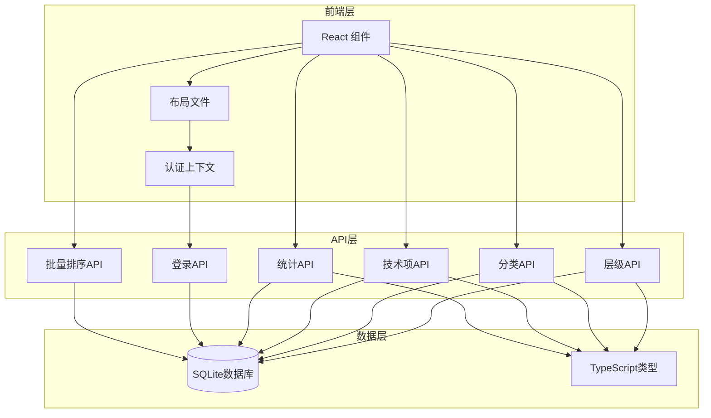
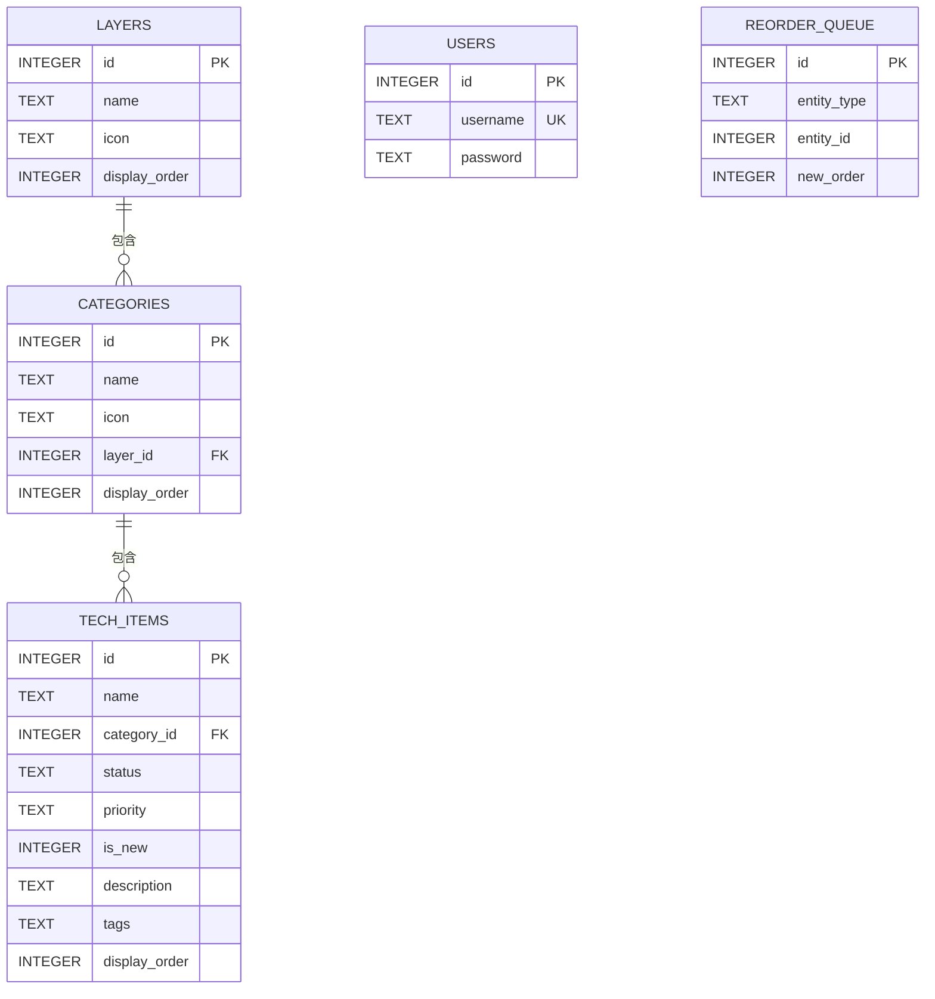
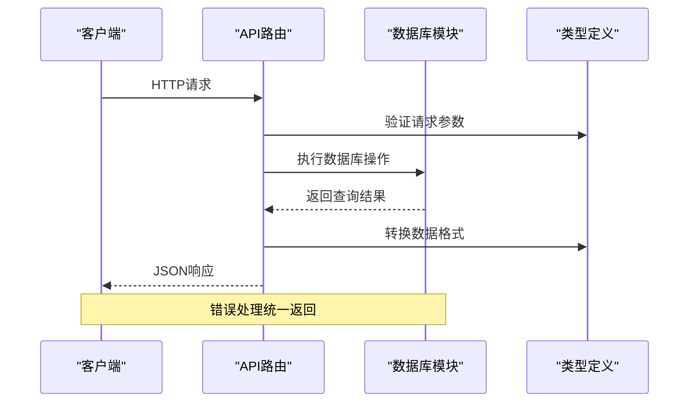
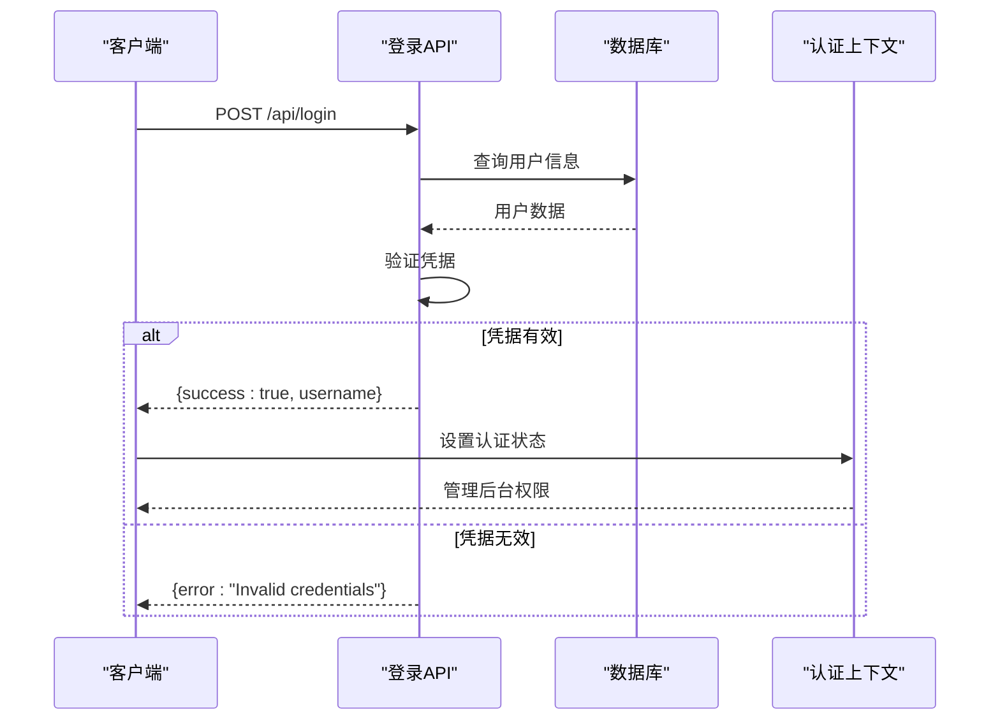
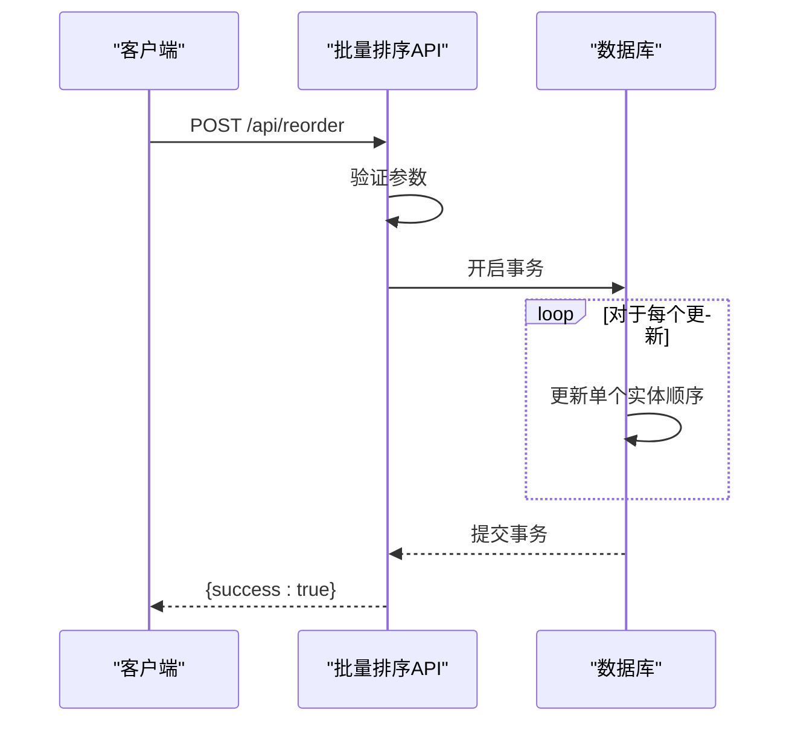
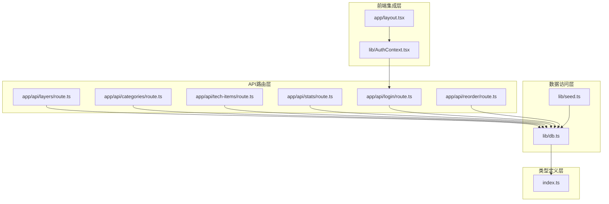

# API接口参考

<cite>
**本文档引用的文件**
- [README.md](file://README.md)
- [layers 路由](file://app/api/layers/route.ts)
- [categories 路由](file://app/api/categories/route.ts)
- [tech-items 路由](file://app/api/tech-items/route.ts)
- [stats 路由](file://app/api/stats/route.ts)
- [login 路由](file://app/api/login/route.ts)
- [reorder 路由](file://app/api/reorder/route.ts)
- [数据库模块](file://lib/db.ts)
- [类型定义](file://types/index.ts)
- [种子数据脚本](file://lib/seed.ts)
- [包配置](file://package.json)
- [认证上下文](file://lib/AuthContext.tsx)
- [布局文件](file://app/layout.tsx)
</cite>

## 更新摘要
**所做更改**
- 新增批量排序API端点，支持层级、分类和技术项的批量顺序更新
- 扩展数据库功能，新增批量更新排序方法
- 更新认证机制，增强登录API的安全性和错误处理
- 完善API文档，包含新的排序功能和改进的错误处理说明

## 目录
1. [简介](#简介)
2. [项目结构](#项目结构)
3. [核心组件](#核心组件)
4. [架构概览](#架构概览)
5. [详细组件分析](#详细组件分析)
6. [依赖关系分析](#依赖关系分析)
7. [性能考虑](#性能考虑)
8. [故障排除指南](#故障排除指南)
9. [结论](#结论)

## 简介

Lantu Next 是一个基于 Next.js + TypeScript + Tailwind CSS + SQLite 构建的技术栈管理系统。该项目提供了完整的 RESTful API 接口，支持技术蓝图的增删改查操作，包含层级管理、分类管理和技术项管理三大核心功能模块。

该系统采用现代前端技术栈，使用 SQLite 作为数据存储，提供直观的管理后台界面和丰富的技术栈展示功能。API 设计遵循 RESTful 原则，支持标准的 HTTP 方法和状态码。

**更新** 新增批量排序功能，支持对层级、分类和技术项进行批量顺序调整，提升管理效率。

## 项目结构

项目采用 Next.js App Router 架构，API 路由位于 `app/api/` 目录下，数据库操作封装在 `lib/db.ts` 中，类型定义位于 `types/index.ts`。

**图表来源**
- [布局文件](file://app/layout.tsx#L21-L35)
- [认证上下文](file://lib/AuthContext.tsx#L13-L52)
- [layers 路由](file://app/api/layers/route.ts#L1-L48)
- [categories 路由](file://app/api/categories/route.ts#L1-L48)
- [tech-items 路由](file://app/api/tech-items/route.ts#L1-L50)
- [stats 路由](file://app/api/stats/route.ts#L1-L15)
- [login 路由](file://app/api/login/route.ts#L1-L20)
- [reorder 路由](file://app/api/reorder/route.ts#L1-L100)

**章节来源**
- [README.md](file://README.md#L20-L43)
- [package.json](file://package.json#L1-L43)

## 核心组件

### 数据库设计

系统使用 SQLite 作为数据存储，包含五个主要表结构，新增用户表支持认证功能。

**图表来源**
- [数据库模块](file://lib/db.ts#L14-L49)

### 类型定义

系统定义了四个核心接口类型，确保前后端数据一致性：

- **Layer**: 层级实体，包含显示序号和图标信息
- **Category**: 分类实体，关联到具体层级
- **TechItem**: 技术项实体，包含状态、优先级等属性
- **Stats**: 统计结果实体，包含活跃数、缺失数、总数和覆盖率
- **User**: 用户实体，用于认证管理

**章节来源**
- [类型定义](file://types/index.ts#L1-L34)

## 架构概览

系统采用分层架构设计，API 层负责处理 HTTP 请求，数据层负责数据库操作，类型层确保数据一致性。

**图表来源**
- [layers 路由](file://app/api/layers/route.ts#L6-L13)
- [categories 路由](file://app/api/categories/route.ts#L6-L13)
- [tech-items 路由](file://app/api/tech-items/route.ts#L7-L14)
- [reorder 路由](file://app/api/reorder/route.ts#L1-L100)

## 详细组件分析

### 层级管理 API

层级管理提供技术蓝图的最高级分类功能，支持 CRUD 操作。

#### API 端点

| 方法 | URL | 描述 | 请求体 | 响应 |
|------|-----|------|--------|------|
| GET | `/api/layers` | 获取所有层级 | 无 | 层级数组 |
| POST | `/api/layers` | 创建新层级 | `{name, icon, display_order}` | `{id, name, icon, display_order}` |
| PUT | `/api/layers` | 更新层级 | `{id, name, icon, display_order}` | `{success: true}` |
| DELETE | `/api/layers?id={id}` | 删除层级 | 查询参数: id | `{success: true}` |

#### 请求参数验证

- **name**: 必填，字符串类型，最大长度限制
- **icon**: 可选，字符串类型，用于显示图标
- **display_order**: 必填，数字类型，用于排序
- **id**: DELETE 请求必需，数字类型

#### 响应格式

成功响应返回标准 JSON 格式，错误响应包含错误信息和 HTTP 状态码。

**章节来源**
- [layers 路由](file://app/api/layers/route.ts#L1-L48)

### 分类管理 API

分类管理提供层级下的具体分类功能，支持 CRUD 操作。

#### API 端点

| 方法 | URL | 描述 | 请求体 | 响应 |
|------|-----|------|--------|------|
| GET | `/api/categories` | 获取所有分类 | 无 | 分类数组 |
| POST | `/api/categories` | 创建新分类 | `{name, icon, layer_id, display_order}` | `{id, name, icon, layer_id, display_order}` |
| PUT | `/api/categories` | 更新分类 | `{id, name, icon, layer_id, display_order}` | `{success: true}` |
| DELETE | `/api/categories?id={id}` | 删除分类 | 查询参数: id | `{success: true}` |

#### 请求参数验证

- **name**: 必填，字符串类型
- **icon**: 可选，字符串类型
- **layer_id**: 必填，数字类型，必须对应存在的层级
- **display_order**: 必填，数字类型

#### 关联关系

分类必须关联到有效的层级 ID，删除层级时需要先删除其下的所有分类。

**章节来源**
- [categories 路由](file://app/api/categories/route.ts#L1-L48)

### 技术项管理 API

技术项管理提供具体的技能和技术条目，支持完整的 CRUD 操作。

#### API 端点

| 方法 | URL | 描述 | 请求体 | 响应 |
|------|-----|------|--------|------|
| GET | `/api/tech-items` | 获取所有技术项 | 无 | 技术项数组 |
| POST | `/api/tech-items` | 创建新技术项 | `{name, category_id, status, priority, is_new, description, tags, display_order}` | `{id, ...data}` |
| PUT | `/api/tech-items` | 更新技术项 | `{id, ...data}` | `{success: true}` |
| DELETE | `/api/tech-items?id={id}` | 删除技术项 | 查询参数: id | `{success: true}` |

#### 请求参数验证

- **name**: 必填，字符串类型
- **category_id**: 必填，数字类型，必须对应存在的分类
- **status**: 必填，枚举值: 'active' | 'missing'
- **priority**: 可选，枚举值: 'high' | 'medium' | 'low' | ''
- **is_new**: 可选，数字类型 (0/1)
- **description**: 可选，字符串类型
- **tags**: 可选，字符串类型
- **display_order**: 可选，数字类型

#### 状态管理

技术项支持两种状态：
- **active**: 表示当前正在使用的技术
- **missing**: 表示已过时或不再推荐的技术

**章节来源**
- [tech-items 路由](file://app/api/tech-items/route.ts#L1-L50)

### 统计 API

统计 API 提供系统整体的统计数据，包括技术项的分布情况。

#### API 端点

| 方法 | URL | 描述 | 请求体 | 响应 |
|------|-----|------|--------|------|
| GET | `/api/stats` | 获取统计数据 | 无 | `{active, missing, total, coverage}` |

#### 响应数据

- **active**: 活跃技术项数量
- **missing**: 缺失技术项数量  
- **total**: 总技术项数量
- **coverage**: 覆盖率百分比 (保留一位小数)

**章节来源**
- [stats 路由](file://app/api/stats/route.ts#L1-L15)

### 登录认证 API

登录 API 提供简单的用户认证功能，用于管理后台访问控制。

#### API 端点

| 方法 | URL | 描述 | 请求体 | 响应 |
|------|-----|------|--------|------|
| POST | `/api/login` | 用户登录 | `{username, password}` | `{success: true, username: string}` |

#### 认证流程

**图表来源**
- [login 路由](file://app/api/login/route.ts#L4-L19)
- [认证上下文](file://lib/AuthContext.tsx#L23-L41)

**章节来源**
- [login 路由](file://app/api/login/route.ts#L1-L20)

### 批量排序 API

批量排序 API 提供对层级、分类和技术项的批量顺序更新功能。

#### API 端点

| 方法 | URL | 描述 | 请求体 | 响应 |
|------|-----|------|--------|------|
| POST | `/api/reorder` | 批量更新排序 | `{entity_type, updates: [{id, display_order}...]}` | `{success: true}` |

#### 请求参数验证

- **entity_type**: 必填，枚举值: 'layers' | 'categories' | 'tech_items'
- **updates**: 必填，数组类型，包含 `{id, display_order}` 对象
- **id**: 数字类型，必须对应存在的实体ID
- **display_order**: 数字类型，新的显示顺序

#### 批量操作流程

**图表来源**
- [reorder 路由](file://app/api/reorder/route.ts#L1-L100)
- [数据库模块](file://lib/db.ts#L241-L282)

**章节来源**
- [reorder 路由](file://app/api/reorder/route.ts#L1-L100)

## 依赖关系分析

系统各组件之间的依赖关系如下：

**图表来源**
- [layers 路由](file://app/api/layers/route.ts#L1-L2)
- [categories 路由](file://app/api/categories/route.ts#L1-L2)
- [tech-items 路由](file://app/api/tech-items/route.ts#L1-L2)
- [stats 路由](file://app/api/stats/route.ts#L1-L2)
- [login 路由](file://app/api/login/route.ts#L1-L2)
- [reorder 路由](file://app/api/reorder/route.ts#L1-L2)

**章节来源**
- [数据库模块](file://lib/db.ts#L1-L312)
- [认证上下文](file://lib/AuthContext.tsx#L1-L61)

## 性能考虑

### 数据库优化

1. **索引策略**: 使用 `display_order` 字段进行排序，确保查询性能
2. **事务处理**: 对批量更新操作使用事务，保证数据一致性和性能
3. **连接管理**: 单例数据库连接，避免频繁创建连接
4. **批量操作**: 批量排序使用单个事务处理多个更新，减少数据库往返

### API 性能

1. **响应缓存**: 对只读查询结果可以考虑添加缓存层
2. **批量操作**: 支持批量更新排序，减少多次往返
3. **错误处理**: 统一的错误处理机制，避免异常传播
4. **参数验证**: 在数据库层面进行参数验证，减少无效请求

### 前端优化

1. **状态管理**: 使用 React Context 管理认证状态
2. **懒加载**: 组件按需加载，减少初始包大小
3. **样式优化**: 使用 Tailwind CSS 实现原子化样式

## 故障排除指南

### 常见错误及解决方案

#### 数据库连接问题

**症状**: API 调用返回 500 错误
**原因**: 数据库文件不存在或权限不足
**解决方案**:
1. 确认 `data/techmap.db` 文件存在
2. 检查数据库文件权限
3. 重新执行 `npm run seed` 初始化数据库

#### 参数验证错误

**症状**: API 返回 400 错误
**原因**: 请求参数格式不正确或缺少必需字段
**解决方案**:
1. 检查请求体格式是否为 JSON
2. 确认必需字段是否完整
3. 验证数据类型是否正确

#### 认证失败

**症状**: 登录返回 401 错误
**原因**: 用户名或密码不正确
**解决方案**:
1. 确认用户名和密码
2. 检查用户是否存在
3. 验证密码是否匹配

#### 批量排序错误

**症状**: 批量排序返回 400 或 500 错误
**原因**: 实体类型不正确或实体ID不存在
**解决方案**:
1. 确认 `entity_type` 参数值正确
2. 检查实体ID是否存在于数据库中
3. 验证 `display_order` 值的有效性

### 调试技巧

1. **网络请求检查**: 使用浏览器开发者工具查看 API 请求和响应
2. **数据库查询**: 在 SQLite 中直接查询数据验证状态
3. **日志输出**: 在 API 路由中添加适当的日志输出
4. **类型检查**: 利用 TypeScript 的类型检查发现潜在问题
5. **批量操作验证**: 使用事务回滚测试批量操作的原子性

### API 测试工具

推荐使用以下工具进行 API 测试：

1. **curl**: 命令行工具，适合快速测试
2. **Postman**: 图形化界面，功能强大
3. **Insomnia**: 现代化的 API 客户端
4. **浏览器开发者工具**: 直接在浏览器中测试

**章节来源**
- [数据库模块](file://lib/db.ts#L14-L50)
- [login 路由](file://app/api/login/route.ts#L15-L18)
- [reorder 路由](file://app/api/reorder/route.ts#L1-L100)

## 结论

Lantu Next 项目提供了一个完整的技术栈管理系统，具有清晰的 API 设计和良好的扩展性。系统采用现代技术栈，支持 RESTful API 规范，具备以下特点：

1. **完整的 CRUD 支持**: 五个主要实体都支持完整的增删改查操作
2. **类型安全**: 使用 TypeScript 确保前后端数据一致性
3. **简单认证**: 提供基本的用户认证功能
4. **批量操作**: 新增批量排序功能，提升管理效率
5. **易于部署**: 支持多种部署方式，包括内网服务器部署
6. **可扩展性**: 模块化设计便于功能扩展

**更新** 最新版本增强了批量排序功能，支持对层级、分类和技术项进行高效批量管理，同时完善了认证机制和错误处理，为用户提供更加稳定可靠的服务。

该系统适合用于技术栈管理、技能矩阵展示和团队知识管理等场景。通过合理的 API 设计和错误处理机制，为用户提供稳定可靠的服务。