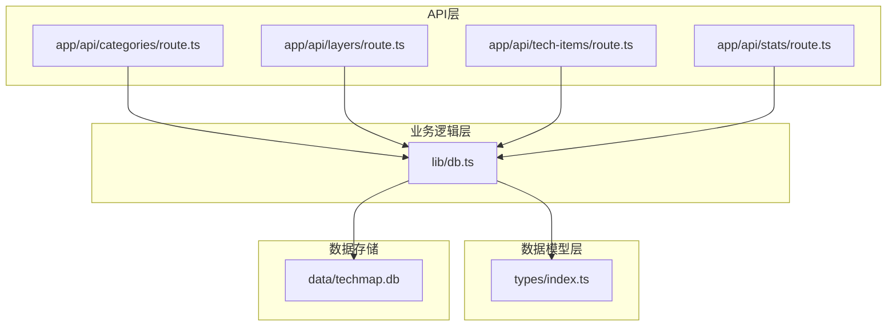
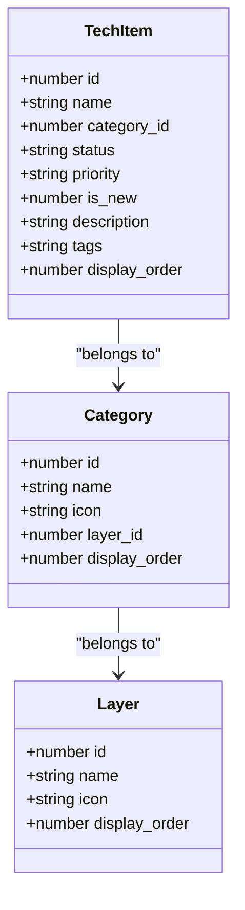
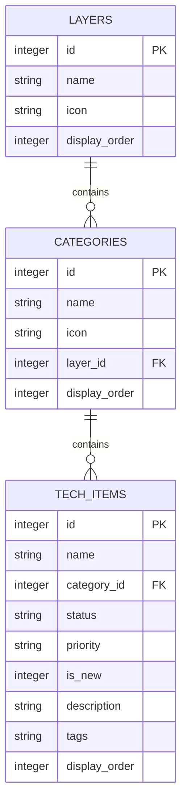
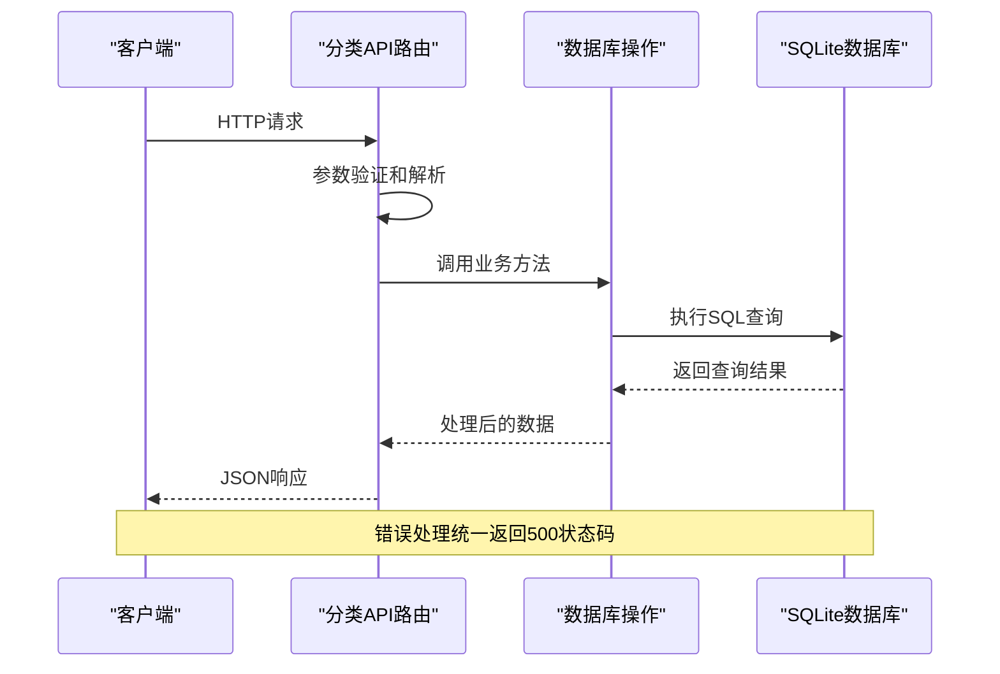
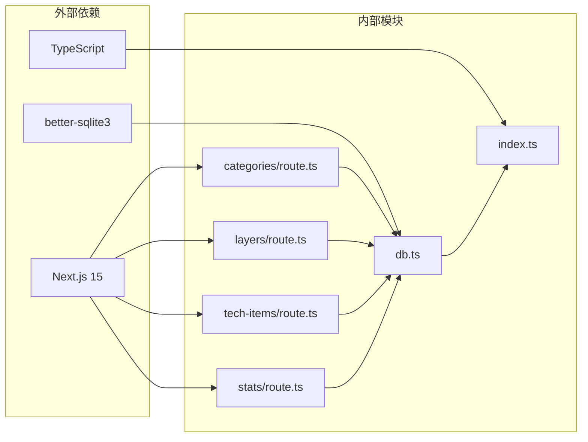
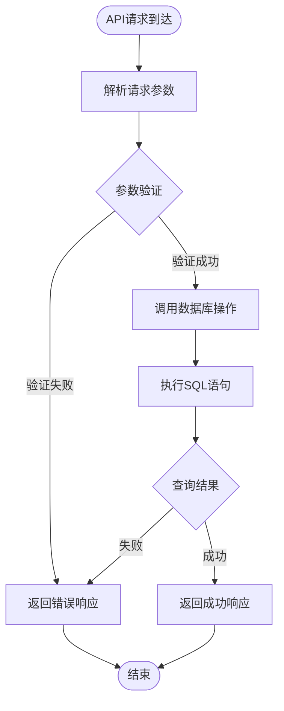

# 分类管理API

<cite>
**本文档引用的文件**
- [app/api/categories/route.ts](file://app/api/categories/route.ts)
- [lib/db.ts](file://lib/db.ts)
- [types/index.ts](file://types/index.ts)
- [README.md](file://README.md)
</cite>

## 目录
1. [简介](#简介)
2. [项目结构](#项目结构)
3. [核心组件](#核心组件)
4. [架构概览](#架构概览)
5. [详细组件分析](#详细组件分析)
6. [依赖关系分析](#依赖关系分析)
7. [性能考虑](#性能考虑)
8. [故障排除指南](#故障排除指南)
9. [结论](#结论)

## 简介

分类管理API是云平台技术蓝图图谱系统的核心接口之一，负责管理技术分类的生命周期。该API基于Next.js 15的App Router架构，使用TypeScript进行类型安全编程，采用SQLite数据库存储数据。系统提供了完整的RESTful接口来管理分类信息，包括获取所有分类、创建新分类、更新现有分类和删除分类等操作。

## 项目结构

该系统采用模块化的设计模式，API路由位于`app/api/`目录下，数据库操作封装在`lib/db.ts`中，类型定义位于`types/index.ts`中。



**图表来源**
- [app/api/categories/route.ts](file://app/api/categories/route.ts#L1-L48)
- [lib/db.ts](file://lib/db.ts#L1-L312)
- [types/index.ts](file://types/index.ts#L1-L34)

**章节来源**
- [README.md](file://README.md#L20-L43)

## 核心组件

### 数据模型定义

系统使用TypeScript接口定义了完整的数据模型，确保类型安全和代码可维护性。



**图表来源**
- [types/index.ts](file://types/index.ts#L8-L26)

### 数据库表结构

系统使用SQLite作为数据存储，采用规范化设计确保数据完整性。



**图表来源**
- [lib/db.ts](file://lib/db.ts#L15-L49)

**章节来源**
- [types/index.ts](file://types/index.ts#L1-L34)
- [lib/db.ts](file://lib/db.ts#L14-L49)

## 架构概览

分类管理API采用分层架构设计，清晰分离了API路由、业务逻辑和数据访问层。



**图表来源**
- [app/api/categories/route.ts](file://app/api/categories/route.ts#L6-L47)
- [lib/db.ts](file://lib/db.ts#L78-L105)

## 详细组件分析

### GET /api/categories - 获取所有分类

此端点用于获取系统中的所有分类信息，支持按层级和显示顺序进行排序。

#### 请求规范

- **HTTP方法**: GET
- **URL路径**: `/api/categories`
- **请求头**: 无特殊要求
- **查询参数**: 无
- **请求体**: 无

#### 响应格式

成功响应返回JSON数组，包含所有分类对象：

```json
[
  {
    "id": 1,
    "name": "前端技术",
    "icon": "frontend-icon",
    "layer_id": 1,
    "display_order": 0
  },
  {
    "id": 2,
    "name": "后端技术",
    "icon": "backend-icon", 
    "layer_id": 1,
    "display_order": 1
  }
]
```

#### 错误处理

- **500 Internal Server Error**: 数据库查询失败时返回错误信息

**章节来源**
- [app/api/categories/route.ts](file://app/api/categories/route.ts#L6-L13)
- [lib/db.ts](file://lib/db.ts#L78-L85)

### POST /api/categories - 创建分类

此端点用于创建新的技术分类，支持设置分类名称、图标、所属层级和显示顺序。

#### 请求规范

- **HTTP方法**: POST
- **URL路径**: `/api/categories`
- **请求头**: `Content-Type: application/json`
- **请求体参数**:
  - `name` (string, 必需): 分类名称
  - `icon` (string, 可选): 分类图标
  - `layer_id` (number, 必需): 所属层级ID
  - `display_order` (number, 必需): 显示顺序

#### 响应格式

成功响应返回包含新创建分类信息的JSON对象：

```json
{
  "id": 3,
  "name": "移动开发",
  "icon": "mobile-icon",
  "layer_id": 2,
  "display_order": 0
}
```

#### 错误处理

- **500 Internal Server Error**: 数据库插入失败时返回错误信息

**章节来源**
- [app/api/categories/route.ts](file://app/api/categories/route.ts#L15-L23)
- [lib/db.ts](file://lib/db.ts#L124-L135)

### PUT /api/categories - 更新分类

此端点用于更新现有的分类信息，支持部分字段更新。

#### 请求规范

- **HTTP方法**: PUT
- **URL路径**: `/api/categories`
- **请求头**: `Content-Type: application/json`
- **请求体参数**:
  - `id` (number, 必需): 分类ID
  - `name` (string, 可选): 分类名称
  - `icon` (string, 可选): 分类图标
  - `layer_id` (number, 可选): 所属层级ID
  - `display_order` (number, 可选): 显示顺序

#### 响应格式

成功响应返回包含操作状态的JSON对象：

```json
{
  "success": true
}
```

#### 错误处理

- **500 Internal Server Error**: 数据库更新失败时返回错误信息

**章节来源**
- [app/api/categories/route.ts](file://app/api/categories/route.ts#L25-L33)
- [lib/db.ts](file://lib/db.ts#L87-L99)

### DELETE /api/categories - 删除分类

此端点用于删除指定的分类，支持通过查询参数传递分类ID。

#### 请求规范

- **HTTP方法**: DELETE
- **URL路径**: `/api/categories`
- **请求头**: 无特殊要求
- **查询参数**:
  - `id` (string, 必需): 分类ID

#### 响应格式

成功响应返回包含操作状态的JSON对象：

```json
{
  "success": true
}
```

#### 错误处理

- **400 Bad Request**: 当未提供ID参数时返回错误信息
- **500 Internal Server Error**: 数据库删除失败时返回错误信息

**章节来源**
- [app/api/categories/route.ts](file://app/api/categories/route.ts#L35-L47)
- [lib/db.ts](file://lib/db.ts#L101-L105)

### 使用示例

#### 获取所有分类

```bash
curl -X GET http://localhost:3000/api/categories
```

#### 创建新分类

```bash
curl -X POST http://localhost:3000/api/categories \
  -H "Content-Type: application/json" \
  -d '{
    "name": "测试分类",
    "icon": "test-icon",
    "layer_id": 1,
    "display_order": 0
  }'
```

#### 更新分类

```bash
curl -X PUT http://localhost:3000/api/categories \
  -H "Content-Type: application/json" \
  -d '{
    "id": 1,
    "name": "更新后的分类名",
    "display_order": 1
  }'
```

#### 删除分类

```bash
curl -X DELETE "http://localhost:3000/api/categories?id=1"
```

## 依赖关系分析

分类管理API与其他系统组件存在明确的依赖关系，形成了清晰的模块化架构。



**图表来源**
- [app/api/categories/route.ts](file://app/api/categories/route.ts#L1-L2)
- [lib/db.ts](file://lib/db.ts#L1-L3)
- [types/index.ts](file://types/index.ts#L1-L34)

### 数据流分析



**图表来源**
- [app/api/categories/route.ts](file://app/api/categories/route.ts#L6-L47)
- [lib/db.ts](file://lib/db.ts#L78-L105)

**章节来源**
- [app/api/categories/route.ts](file://app/api/categories/route.ts#L1-L48)
- [lib/db.ts](file://lib/db.ts#L1-L312)

## 性能考虑

### 数据库优化

系统采用SQLite作为数据存储，具有以下性能特点：

- **索引策略**: 按`layer_id`和`display_order`进行排序，支持高效的层级分类展示
- **事务处理**: 批量操作使用事务确保数据一致性
- **连接池**: 使用better-sqlite3的连接池机制提高并发性能

### API性能优化

- **响应缓存**: 对于只读的分类查询，可以考虑添加适当的缓存策略
- **批量操作**: 提供批量更新接口减少网络往返次数
- **错误处理**: 统一的错误处理机制避免重复的错误检查代码

### 内存管理

- **连接管理**: 确保数据库连接正确关闭，避免内存泄漏
- **数据序列化**: 使用高效的JSON序列化机制处理大量数据

## 故障排除指南

### 常见问题及解决方案

#### 数据库连接问题

**症状**: API调用返回500错误，数据库操作失败

**可能原因**:
- 数据库文件权限不足
- 数据库文件损坏
- 数据库路径配置错误

**解决方案**:
1. 检查`data/techmap.db`文件的读写权限
2. 确认数据库文件存在于正确的路径
3. 重新运行数据库初始化脚本

#### 参数验证错误

**症状**: POST/PUT请求返回400错误

**可能原因**:
- 缺少必需的请求参数
- 参数类型不匹配
- 参数值超出范围

**解决方案**:
1. 确保请求体包含所有必需参数
2. 验证参数的数据类型和格式
3. 检查参数值是否在有效范围内

#### 权限问题

**症状**: 访问API时返回403或权限被拒绝

**可能原因**:
- 缺少必要的认证信息
- 用户权限不足
- CORS配置问题

**解决方案**:
1. 检查API的认证机制配置
2. 验证用户权限设置
3. 配置正确的CORS策略

### 调试技巧

#### 日志记录

建议在开发环境中启用详细的日志记录：

```typescript
console.log('分类创建请求:', { name, icon, layer_id, display_order });
console.log('数据库响应:', result);
```

#### 错误追踪

使用Promise链和try-catch块确保错误能够正确传播：

```typescript
try {
  const result = addCategory(name, icon, layer_id, display_order);
  return NextResponse.json({ id: result.lastInsertRowid, name, icon, layer_id, display_order });
} catch (error) {
  console.error('分类创建失败:', error);
  return NextResponse.json({ error: 'Failed to create category' }, { status: 500 });
}
```

**章节来源**
- [app/api/categories/route.ts](file://app/api/categories/route.ts#L6-L47)
- [lib/db.ts](file://lib/db.ts#L14-L50)

## 结论

分类管理API提供了完整的技术分类管理功能，具有以下优势：

### 设计优势

- **模块化架构**: 清晰分离的API路由、业务逻辑和数据访问层
- **类型安全**: 使用TypeScript确保代码质量和开发体验
- **标准化接口**: 符合RESTful设计原则的标准化API
- **错误处理**: 统一的错误处理机制确保系统的稳定性

### 扩展性

系统设计支持进一步的功能扩展，包括：
- 添加分类搜索和过滤功能
- 实现分类层级的嵌套结构
- 支持分类的批量操作
- 集成权限管理和审计日志

### 最佳实践

建议在生产环境中实施以下最佳实践：
- 实施适当的缓存策略
- 添加API速率限制
- 实现详细的日志记录
- 建立监控和告警机制
- 定期备份数据库

该API为技术蓝图管理系统提供了坚实的基础，支持高效的技术分类管理和展示功能。