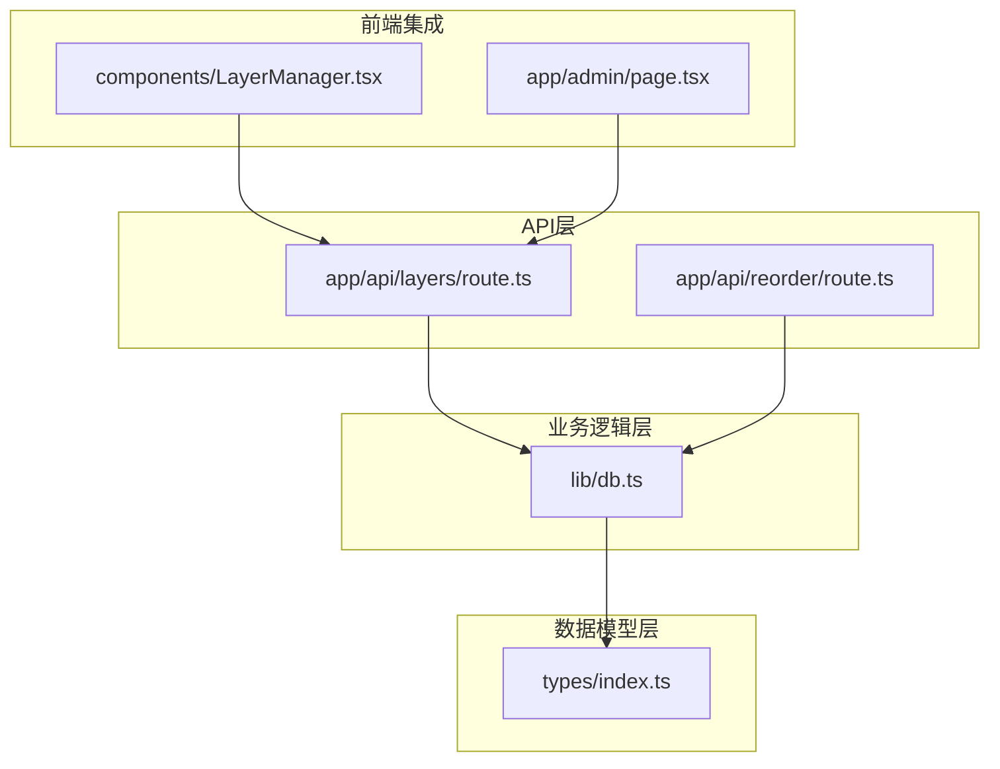
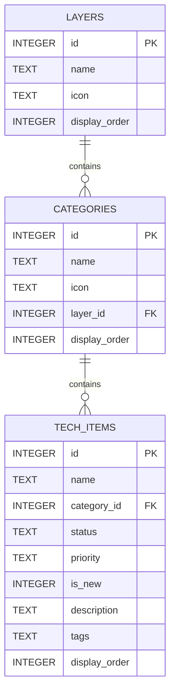
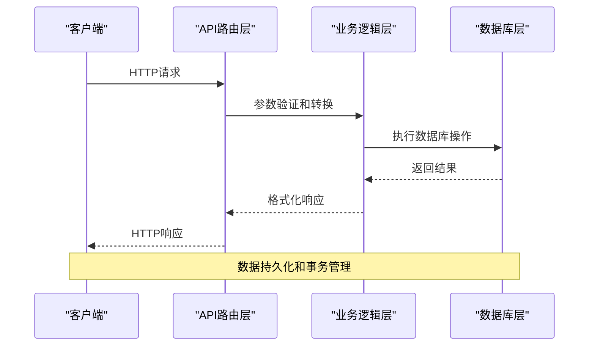
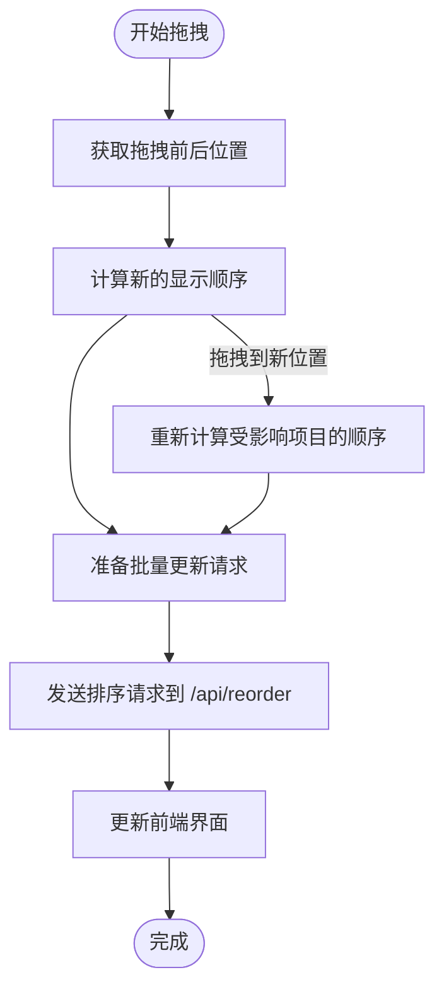
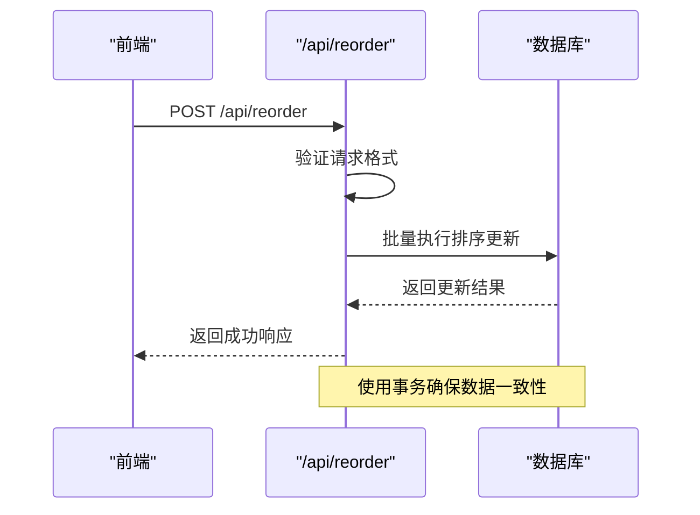
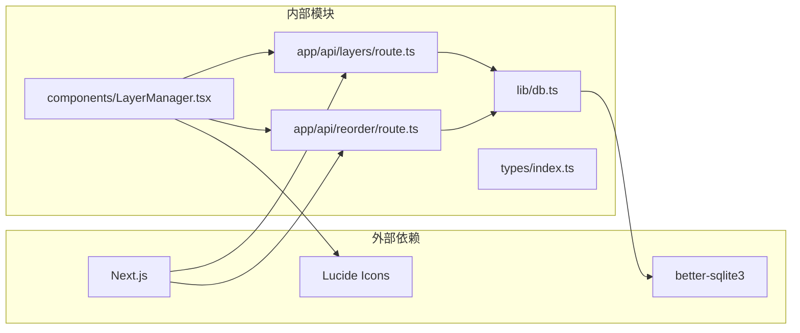

# 层级管理API

<cite>
**本文档引用的文件**
- [app/api/layers/route.ts](file://app/api/layers/route.ts)
- [lib/db.ts](file://lib/db.ts)
- [types/index.ts](file://types/index.ts)
- [README.md](file://README.md)
- [components/LayerManager.tsx](file://components/LayerManager.tsx)
- [app/admin/page.tsx](file://app/admin/page.tsx)
- [app/api/reorder/route.ts](file://app/api/reorder/route.ts)
</cite>

## 目录
1. [简介](#简介)
2. [项目结构](#项目结构)
3. [核心组件](#核心组件)
4. [架构概览](#架构概览)
5. [详细组件分析](#详细组件分析)
6. [依赖关系分析](#依赖关系分析)
7. [性能考虑](#性能考虑)
8. [故障排除指南](#故障排除指南)
9. [结论](#结论)

## 简介

层级管理API是云平台技术蓝图图谱系统的核心功能模块，负责管理技术栈的层级结构。该API提供了完整的RESTful接口，支持对层级进行查询、创建、更新和删除操作，同时具备灵活的排序机制和数据验证功能。

## 项目结构

系统采用Next.js 15 App Router架构，层级管理API位于`app/api/layers/`目录下，数据库操作封装在`lib/db.ts`中，类型定义在`types/index.ts`中。



**图表来源**
- [app/api/layers/route.ts](file://app/api/layers/route.ts#L1-L48)
- [lib/db.ts](file://lib/db.ts#L1-L312)
- [types/index.ts](file://types/index.ts#L1-L34)

**章节来源**
- [README.md](file://README.md#L20-L43)

## 核心组件

### 数据模型定义

层级数据模型包含以下字段：

| 字段名 | 类型 | 必填 | 描述 | 默认值 |
|--------|------|------|------|--------|
| id | number | 否 | 层级唯一标识符 | 自增主键 |
| name | string | 是 | 层级名称 | - |
| icon | string | 否 | 图标标识符或emoji | 空字符串 |
| display_order | number | 是 | 显示顺序 | 0 |

### 数据库结构



**图表来源**
- [lib/db.ts](file://lib/db.ts#L37-L42)

**章节来源**
- [types/index.ts](file://types/index.ts#L1-L6)
- [lib/db.ts](file://lib/db.ts#L37-L42)

## 架构概览

层级管理API采用分层架构设计，实现了清晰的职责分离：



**图表来源**
- [app/api/layers/route.ts](file://app/api/layers/route.ts#L6-L47)
- [lib/db.ts](file://lib/db.ts#L52-L76)

## 详细组件分析

### GET /api/layers - 获取所有层级

#### 请求规范
- **方法**: GET
- **路径**: `/api/layers`
- **认证**: 无需认证
- **查询参数**: 无

#### 响应格式
成功时返回JSON数组，每个元素包含层级的完整信息：

```json
[
  {
    "id": 1,
    "name": "开发技术层",
    "icon": "💻",
    "display_order": 1
  },
  {
    "id": 2,
    "name": "后端与大数据",
    "icon": "⚙️",
    "display_order": 2
  }
]
```

#### 错误处理
- **500**: 数据库查询失败时返回错误信息

**章节来源**
- [app/api/layers/route.ts](file://app/api/layers/route.ts#L6-L13)
- [lib/db.ts](file://lib/db.ts#L52-L57)

### POST /api/layers - 创建层级

#### 请求规范
- **方法**: POST
- **路径**: `/api/layers`
- **认证**: 无需认证
- **请求头**: `Content-Type: application/json`
- **请求体**: 包含层级基本信息的JSON对象

请求体字段：
| 字段名 | 类型 | 必填 | 描述 |
|--------|------|------|------|
| name | string | 是 | 层级名称 |
| icon | string | 否 | 图标标识符或emoji |
| display_order | number | 是 | 显示顺序 |

#### 响应格式
成功时返回包含新创建层级信息的JSON对象：

```json
{
  "id": 3,
  "name": "AI 与数据智能",
  "icon": "🧠",
  "display_order": 3
}
```

#### 错误处理
- **500**: 数据库插入失败时返回错误信息

**章节来源**
- [app/api/layers/route.ts](file://app/api/layers/route.ts#L15-L23)
- [lib/db.ts](file://lib/db.ts#L116-L122)

### PUT /api/layers - 更新层级

#### 请求规范
- **方法**: PUT
- **路径**: `/api/layers`
- **认证**: 无需认证
- **请求头**: `Content-Type: application/json`
- **请求体**: 包含完整层级信息的JSON对象

请求体字段：
| 字段名 | 类型 | 必填 | 描述 |
|--------|------|------|------|
| id | number | 是 | 层级唯一标识符 |
| name | string | 是 | 层级名称 |
| icon | string | 否 | 图标标识符或emoji |
| display_order | number | 是 | 显示顺序 |

#### 响应格式
成功时返回简单的成功确认：

```json
{
  "success": true
}
```

#### 错误处理
- **500**: 数据库更新失败时返回错误信息

**章节来源**
- [app/api/layers/route.ts](file://app/api/layers/route.ts#L25-L33)
- [lib/db.ts](file://lib/db.ts#L59-L70)

### DELETE /api/layers - 删除层级

#### 请求规范
- **方法**: DELETE
- **路径**: `/api/layers`
- **认证**: 无需认证
- **查询参数**: 
  - `id` (必需): 要删除的层级ID

#### 响应格式
成功时返回简单的成功确认：

```json
{
  "success": true
}
```

#### 错误处理
- **400**: 当缺少`id`参数时返回错误信息
- **500**: 数据库删除失败时返回错误信息

**章节来源**
- [app/api/layers/route.ts](file://app/api/layers/route.ts#L35-L47)
- [lib/db.ts](file://lib/db.ts#L72-L76)

### 层级排序机制

系统支持两种排序方式：

#### 前端拖拽排序
前端使用DnD Kit实现拖拽排序，自动计算新的显示顺序：



**图表来源**
- [components/LayerManager.tsx](file://components/LayerManager.tsx#L50-L76)

#### 后端批量更新
系统提供专门的排序API处理批量更新：



**图表来源**
- [app/api/reorder/route.ts](file://app/api/reorder/route.ts#L8-L38)
- [lib/db.ts](file://lib/db.ts#L241-L252)

**章节来源**
- [components/LayerManager.tsx](file://components/LayerManager.tsx#L50-L76)
- [app/api/reorder/route.ts](file://app/api/reorder/route.ts#L8-L38)
- [lib/db.ts](file://lib/db.ts#L241-L252)

## 依赖关系分析

层级管理API的依赖关系如下：



**图表来源**
- [app/api/layers/route.ts](file://app/api/layers/route.ts#L1-L2)
- [lib/db.ts](file://lib/db.ts#L1-L3)
- [components/LayerManager.tsx](file://components/LayerManager.tsx#L1-L6)

**章节来源**
- [app/api/layers/route.ts](file://app/api/layers/route.ts#L1-L2)
- [lib/db.ts](file://lib/db.ts#L1-L3)

## 性能考虑

### 数据库优化
- **索引策略**: `display_order`字段用于排序，建议在高频查询场景下考虑添加索引
- **事务处理**: 批量更新使用事务确保数据一致性，避免部分更新导致的数据不一致
- **连接池**: 使用better-sqlite3的连接池机制，支持并发访问

### API性能
- **响应缓存**: 对于只读的GET请求，可以考虑添加适当的缓存策略
- **批量操作**: 提供批量排序接口，减少网络往返次数
- **错误处理**: 统一的错误处理机制，避免异常传播影响整体性能

### 前端优化
- **虚拟滚动**: 对于大量层级的情况，可以考虑实现虚拟滚动
- **懒加载**: 图标等资源按需加载
- **防抖处理**: 输入验证和提交操作添加防抖机制

## 故障排除指南

### 常见问题及解决方案

#### 数据库连接问题
**症状**: API调用返回500错误
**原因**: 数据库文件损坏或权限不足
**解决方案**:
1. 检查`data/techmap.db`文件是否存在且可读写
2. 确认Node.js进程对`data/`目录有足够权限
3. 重新运行`npm run seed`初始化数据库

#### 参数验证错误
**症状**: API调用返回400错误
**原因**: 请求参数格式不正确或缺失
**解决方案**:
1. 确保请求体为有效的JSON格式
2. 检查必需字段是否完整
3. 验证数据类型是否正确

#### 排序冲突
**症状**: 层级顺序显示异常
**原因**: 显示顺序值重复或超出范围
**解决方案**:
1. 使用系统提供的排序API进行批量更新
2. 确保每个层级都有唯一的`display_order`值
3. 遵循递增的顺序规则

**章节来源**
- [app/api/layers/route.ts](file://app/api/layers/route.ts#L10-L12)
- [app/api/layers/route.ts](file://app/api/layers/route.ts#L39-L41)

## 结论

层级管理API提供了完整的技术栈层级管理功能，具有以下特点：

### 设计优势
- **RESTful架构**: 符合HTTP标准，易于理解和使用
- **类型安全**: 完整的TypeScript类型定义，提供编译时类型检查
- **数据一致性**: 使用事务处理确保数据完整性
- **扩展性**: 模块化设计便于功能扩展

### 功能特性
- **完整的CRUD操作**: 支持层级的创建、读取、更新和删除
- **灵活的排序机制**: 支持前端拖拽和后端批量排序
- **错误处理**: 完善的错误处理和状态码返回
- **前端集成**: 与React组件无缝集成

### 最佳实践
- 使用POST创建层级时，合理设置`display_order`值
- 更新层级信息时，确保提供完整的字段数据
- 删除层级前，确认该层级下没有子分类
- 利用批量排序API处理复杂的层级结构调整

该API为技术栈管理系统提供了坚实的基础，支持高效的层级管理和维护工作。