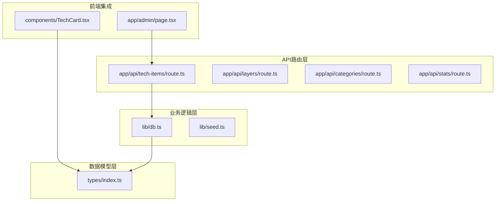
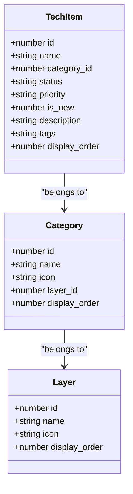
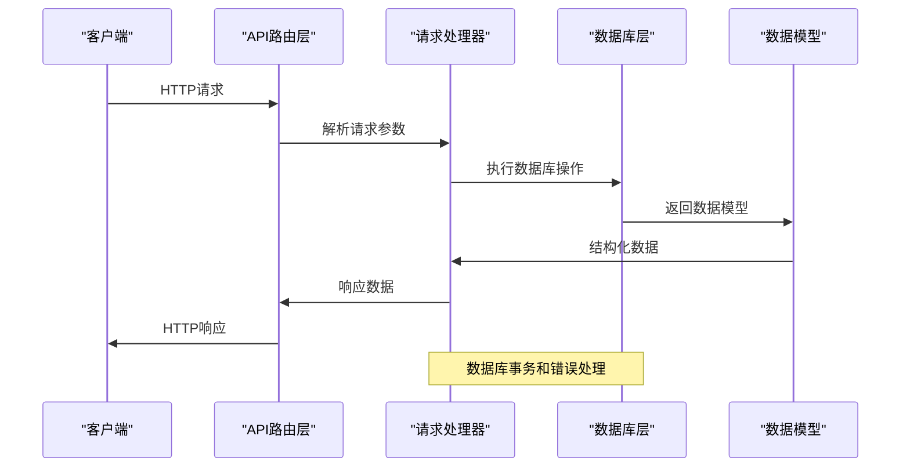
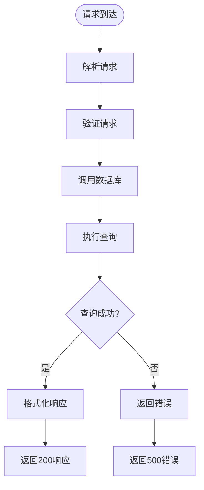
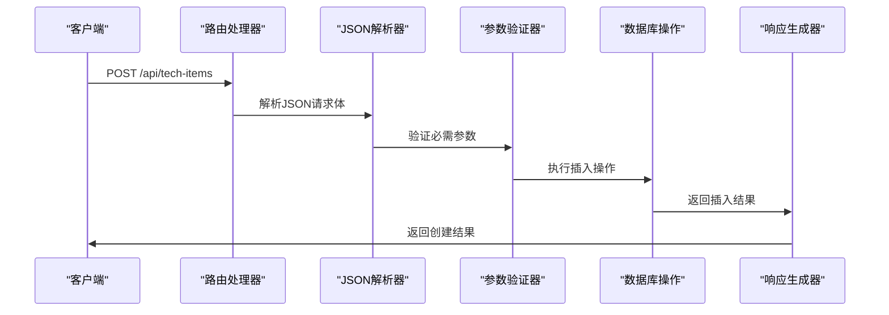
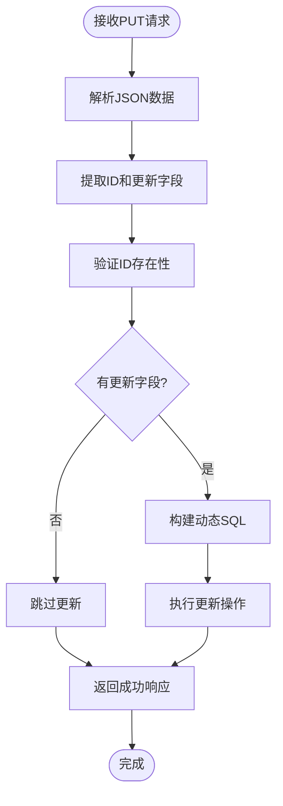
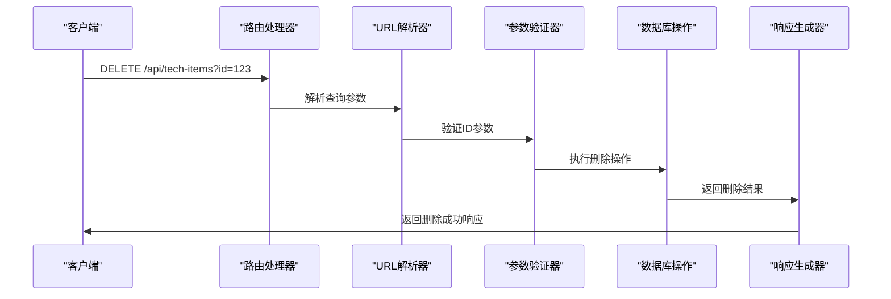
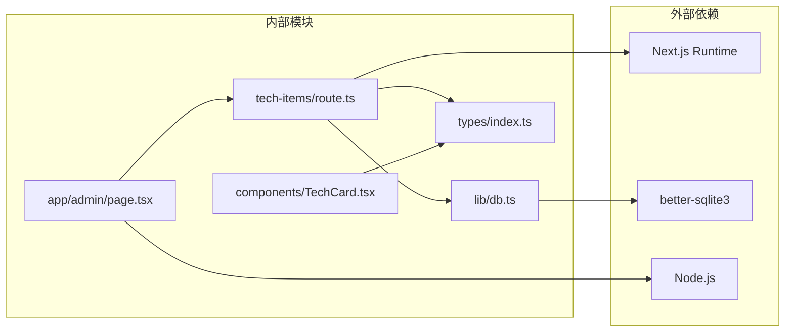
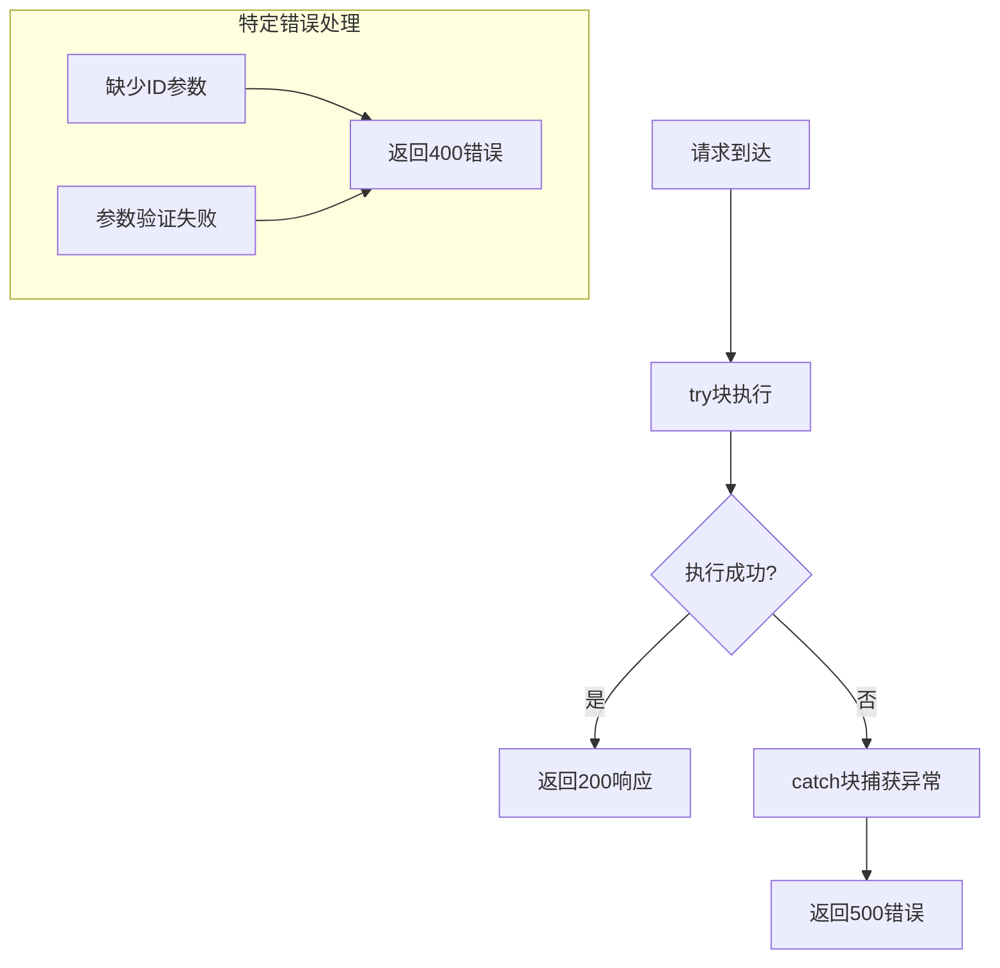

# 技术项管理API

<cite>
**本文档引用的文件**
- [app/api/tech-items/route.ts](file://app/api/tech-items/route.ts)
- [lib/db.ts](file://lib/db.ts)
- [types/index.ts](file://types/index.ts)
- [app/admin/page.tsx](file://app/admin/page.tsx)
- [components/TechCard.tsx](file://components/TechCard.tsx)
- [README.md](file://README.md)
</cite>

## 目录
1. [简介](#简介)
2. [项目结构](#项目结构)
3. [核心组件](#核心组件)
4. [架构概览](#架构概览)
5. [详细组件分析](#详细组件分析)
6. [依赖关系分析](#依赖关系分析)
7. [性能考虑](#性能考虑)
8. [故障排除指南](#故障排除指南)
9. [结论](#结论)

## 简介

技术项管理API是云平台技术蓝图图谱系统的核心RESTful API，负责管理技术栈中的各种技术项。该API提供了完整的CRUD操作，支持技术项的创建、查询、更新和删除，同时集成了状态管理、优先级设置和标签系统。

本系统采用Next.js 15 App Router架构，使用TypeScript进行类型安全编程，基于SQLite数据库存储技术项数据。API设计遵循RESTful原则，提供简洁明了的接口规范。

## 项目结构

技术项管理API位于Next.js的应用路由系统中，采用模块化的文件组织方式：



**图表来源**
- [app/api/tech-items/route.ts](file://app/api/tech-items/route.ts#L1-L50)
- [lib/db.ts](file://lib/db.ts#L1-L312)
- [types/index.ts](file://types/index.ts#L1-L34)

**章节来源**
- [README.md](file://README.md#L20-L43)

## 核心组件

### 技术项数据模型

技术项采用强类型定义，确保数据的一致性和完整性：



**图表来源**
- [types/index.ts](file://types/index.ts#L16-L26)

### 数据库表结构

技术项数据存储在SQLite数据库中，采用规范化设计：

| 字段名 | 类型 | 约束 | 描述 |
|--------|------|------|------|
| id | INTEGER | PRIMARY KEY, AUTOINCREMENT | 技术项唯一标识符 |
| name | TEXT | NOT NULL | 技术项名称 |
| category_id | INTEGER | NOT NULL, FOREIGN KEY | 所属分类ID |
| status | TEXT | CHECK('active','missing') | 技术项状态 |
| priority | TEXT | CHECK('high','medium','low','') | 优先级设置 |
| is_new | INTEGER | DEFAULT 0 | 是否为新增技术项 |
| description | TEXT |  | 技术项描述 |
| tags | TEXT |  | 标签字符串（逗号分隔） |
| display_order | INTEGER | DEFAULT 0 | 显示排序 |

**章节来源**
- [lib/db.ts](file://lib/db.ts#L24-L35)
- [types/index.ts](file://types/index.ts#L16-L26)

## 架构概览

技术项管理API采用分层架构设计，确保关注点分离和代码的可维护性：



**图表来源**
- [app/api/tech-items/route.ts](file://app/api/tech-items/route.ts#L7-L49)
- [lib/db.ts](file://lib/db.ts#L107-L162)

## 详细组件分析

### GET /api/tech-items - 获取所有技术项

#### 接口规范

**HTTP方法**: GET  
**请求URL**: `/api/tech-items`  
**请求头**: 无特殊要求  
**请求参数**: 无  
**响应状态码**:
- 200: 成功获取技术项列表
- 500: 服务器内部错误

#### 请求处理流程



**图表来源**
- [app/api/tech-items/route.ts](file://app/api/tech-items/route.ts#L7-L14)
- [lib/db.ts](file://lib/db.ts#L107-L114)

#### 响应格式

成功的响应返回JSON数组，每个元素包含完整的技术项信息：

```json
[
  {
    "id": 1,
    "name": "React 18",
    "category_id": 1,
    "status": "active",
    "priority": "high",
    "is_new": 1,
    "description": "现代JavaScript库",
    "tags": "framework,frontend",
    "display_order": 1
  }
]
```

**章节来源**
- [app/api/tech-items/route.ts](file://app/api/tech-items/route.ts#L7-L14)
- [lib/db.ts](file://lib/db.ts#L107-L114)

### POST /api/tech-items - 创建技术项

#### 接口规范

**HTTP方法**: POST  
**请求URL**: `/api/tech-items`  
**请求头**: `Content-Type: application/json`  
**请求体参数**:
- name (string, 必填): 技术项名称
- category_id (number, 必填): 所属分类ID
- status (string, 必填): 技术项状态，可选值：'active' | 'missing'
- priority (string, 可选): 优先级，可选值：'high' | 'medium' | 'low' | ''
- is_new (number, 可选): 是否新增，0或1，默认0
- description (string, 可选): 技术项描述
- tags (string, 可选): 标签字符串，逗号分隔
- display_order (number, 可选): 显示排序，默认0

**响应状态码**:
- 200: 成功创建技术项
- 500: 服务器内部错误

#### 请求处理流程



**图表来源**
- [app/api/tech-items/route.ts](file://app/api/tech-items/route.ts#L16-L24)
- [lib/db.ts](file://lib/db.ts#L137-L162)

#### 响应格式

成功的响应返回包含新创建技术项信息的JSON对象：

```json
{
  "id": 123,
  "name": "Vue 3.4",
  "category_id": 1,
  "status": "active",
  "priority": "high",
  "is_new": 1,
  "description": "渐进式JavaScript框架",
  "tags": "framework,frontend",
  "display_order": 0
}
```

**章节来源**
- [app/api/tech-items/route.ts](file://app/api/tech-items/route.ts#L16-L24)
- [lib/db.ts](file://lib/db.ts#L137-L162)

### PUT /api/tech-items - 更新技术项

#### 接口规范

**HTTP方法**: PUT  
**请求URL**: `/api/tech-items`  
**请求头**: `Content-Type: application/json`  
**请求体参数**:
- id (number, 必填): 技术项ID
- name (string, 可选): 技术项名称
- status (string, 可选): 技术项状态
- priority (string, 可选): 优先级
- is_new (number, 可选): 是否新增
- description (string, 可选): 技术项描述
- tags (string, 可选): 标签字符串

**响应状态码**:
- 200: 成功更新技术项
- 500: 服务器内部错误

#### 请求处理流程



**图表来源**
- [app/api/tech-items/route.ts](file://app/api/tech-items/route.ts#L26-L35)
- [lib/db.ts](file://lib/db.ts#L164-L211)

#### 响应格式

成功的响应返回简单的确认对象：

```json
{
  "success": true
}
```

**章节来源**
- [app/api/tech-items/route.ts](file://app/api/tech-items/route.ts#L26-L35)
- [lib/db.ts](file://lib/db.ts#L164-L211)

### DELETE /api/tech-items - 删除技术项

#### 接口规范

**HTTP方法**: DELETE  
**请求URL**: `/api/tech-items?id={id}`  
**请求头**: 无特殊要求  
**查询参数**:
- id (string, 必填): 要删除的技术项ID

**响应状态码**:
- 200: 成功删除技术项
- 400: 缺少ID参数
- 500: 服务器内部错误

#### 请求处理流程



**图表来源**
- [app/api/tech-items/route.ts](file://app/api/tech-items/route.ts#L37-L49)
- [lib/db.ts](file://lib/db.ts#L213-L217)

#### 响应格式

成功的响应返回确认对象：

```json
{
  "success": true
}
```

**章节来源**
- [app/api/tech-items/route.ts](file://app/api/tech-items/route.ts#L37-L49)
- [lib/db.ts](file://lib/db.ts#L213-L217)

## 依赖关系分析

技术项管理API的依赖关系清晰明确，遵循单一职责原则：



**图表来源**
- [app/api/tech-items/route.ts](file://app/api/tech-items/route.ts#L1-L2)
- [lib/db.ts](file://lib/db.ts#L1-L4)
- [app/admin/page.tsx](file://app/admin/page.tsx#L1-L4)

### 错误处理机制

系统实现了统一的错误处理机制，确保API的健壮性：



**图表来源**
- [app/api/tech-items/route.ts](file://app/api/tech-items/route.ts#L11-L13)
- [app/api/tech-items/route.ts](file://app/api/tech-items/route.ts#L41-L43)

**章节来源**
- [app/api/tech-items/route.ts](file://app/api/tech-items/route.ts#L11-L13)
- [app/api/tech-items/route.ts](file://app/api/tech-items/route.ts#L41-L43)

## 性能考虑

### 数据库优化策略

1. **索引设计**: 技术项表按`category_id`和`display_order`建立索引，优化查询性能
2. **批量操作**: 提供批量更新排序的功能，支持高效的批量操作
3. **连接池**: 使用better-sqlite3的连接池机制，提高并发性能

### 缓存策略

- **前端缓存**: 前端组件使用React状态管理，避免重复请求
- **数据库缓存**: SQLite内置缓存机制，减少磁盘I/O操作

### API性能优化

- **异步处理**: 所有数据库操作采用异步模式，避免阻塞
- **错误快速返回**: 对于无效请求立即返回错误，减少资源消耗

## 故障排除指南

### 常见问题及解决方案

#### 1. 数据库连接失败

**症状**: API返回500错误，无法获取或操作技术项数据

**原因分析**:
- 数据库文件权限问题
- 数据库文件损坏
- 数据库路径配置错误

**解决步骤**:
1. 检查`data/techmap.db`文件是否存在且可读写
2. 验证数据库文件权限设置
3. 重新运行数据库初始化脚本

#### 2. 参数验证错误

**症状**: API返回400错误，提示缺少必要参数

**常见原因**:
- 缺少必需的请求参数
- 参数类型不匹配
- 参数值超出允许范围

**解决方法**:
1. 确保请求包含所有必需参数
2. 验证参数类型和格式
3. 检查参数值的有效性

#### 3. 前端集成问题

**症状**: 管理后台无法正常显示或操作技术项

**排查步骤**:
1. 检查网络请求是否成功
2. 验证API响应格式
3. 确认前端组件正确处理响应数据

**章节来源**
- [app/admin/page.tsx](file://app/admin/page.tsx#L23-L34)
- [app/admin/page.tsx](file://app/admin/page.tsx#L86-L96)

## 结论

技术项管理API提供了完整、可靠的RESTful接口，支持技术栈数据的全生命周期管理。系统采用现代化的技术栈和架构设计，具有以下优势：

1. **类型安全**: 使用TypeScript确保编译时类型检查
2. **数据完整性**: 数据库约束和参数验证保证数据质量
3. **易于扩展**: 模块化设计便于功能扩展和维护
4. **性能优化**: 异步处理和数据库优化提升系统性能
5. **错误处理**: 完善的错误处理机制确保系统稳定性

该API为技术蓝图管理系统提供了坚实的数据基础，支持复杂的技术栈管理和展示需求。通过合理的架构设计和实现细节，确保了系统的可靠性、可维护性和可扩展性。