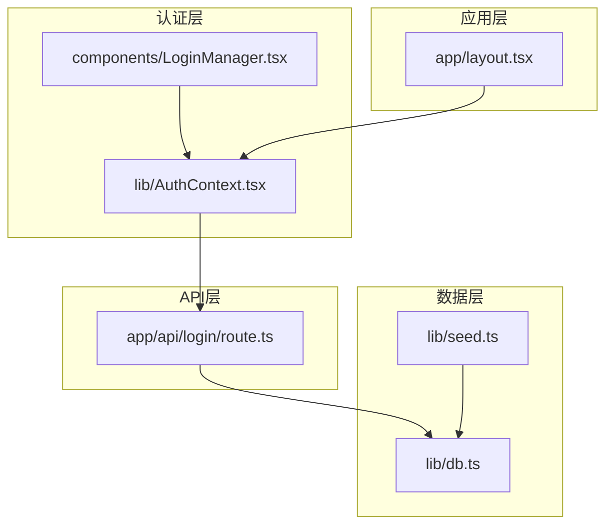
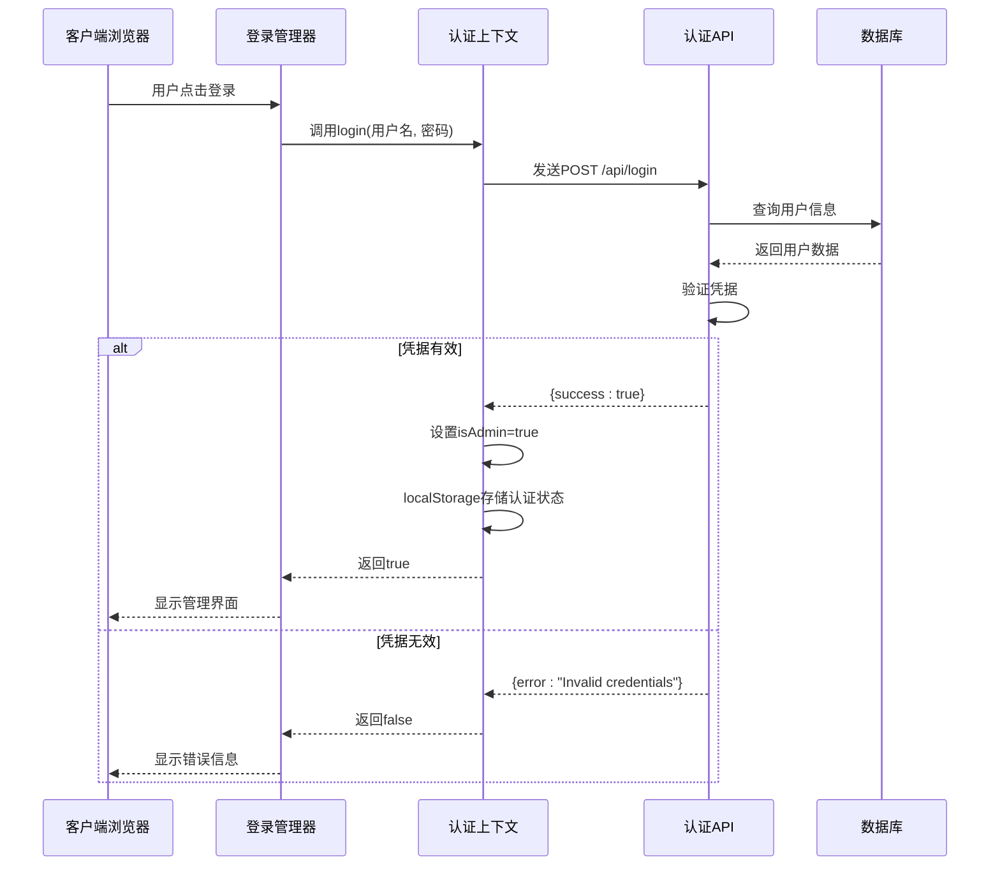
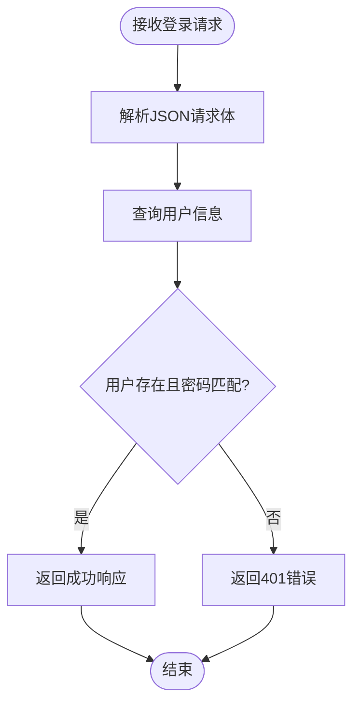
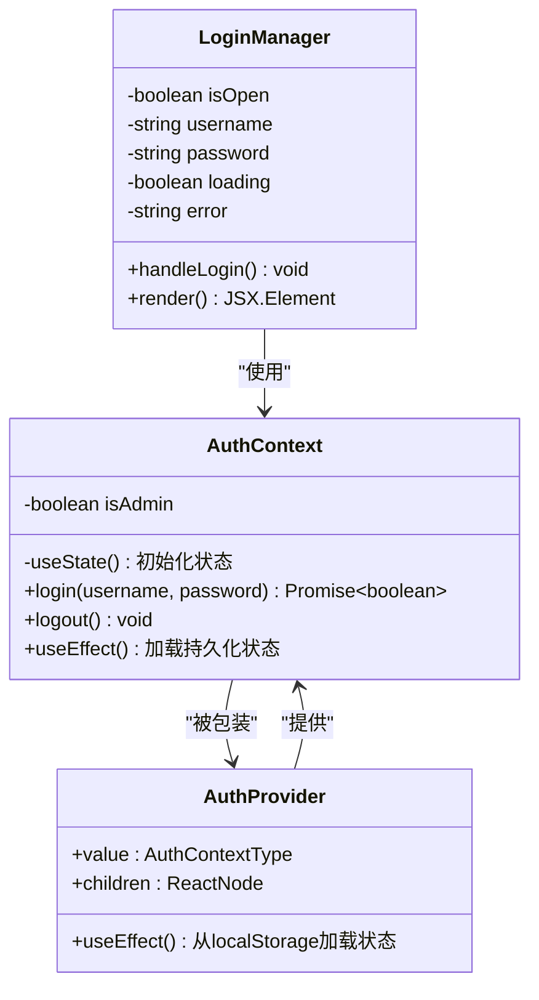
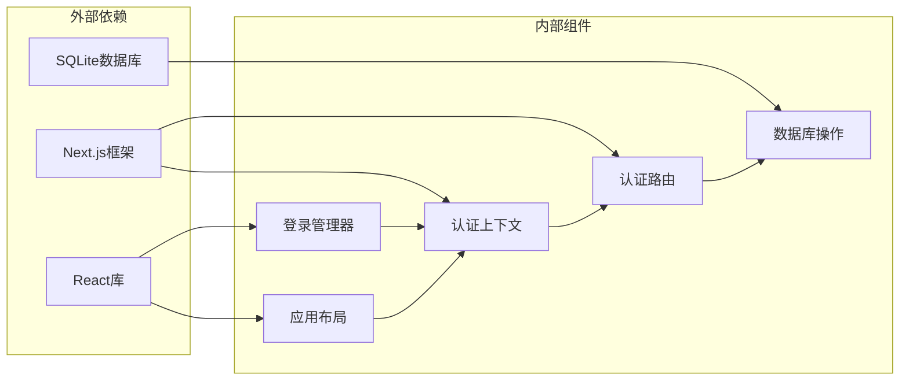

# 用户认证API

<cite>
**本文档引用的文件**
- [app/api/login/route.ts](file://app/api/login/route.ts)
- [lib/AuthContext.tsx](file://lib/AuthContext.tsx)
- [lib/db.ts](file://lib/db.ts)
- [components/LoginManager.tsx](file://components/LoginManager.tsx)
- [app/layout.tsx](file://app/layout.tsx)
- [lib/seed.ts](file://lib/seed.ts)
</cite>

## 目录
1. [简介](#简介)
2. [项目结构](#项目结构)
3. [核心组件](#核心组件)
4. [架构概览](#架构概览)
5. [详细组件分析](#详细组件分析)
6. [依赖关系分析](#依赖关系分析)
7. [性能考虑](#性能考虑)
8. [故障排除指南](#故障排除指南)
9. [结论](#结论)

## 简介

本文档详细说明了用户认证API的设计和实现，重点关注POST /api/login接口的完整规范。该系统采用简化的认证机制，通过用户名密码验证实现用户身份确认，并在成功认证后在客户端本地存储认证状态。

当前实现采用localStorage存储认证状态，模拟管理员权限控制。完整的生产环境部署需要增强安全措施，包括JWT令牌管理、密码哈希加密和更严格的权限控制。

## 项目结构

认证系统的文件组织采用按功能模块划分的方式：

**图表来源**
- [app/api/login/route.ts](file://app/api/login/route.ts#L1-L19)
- [lib/AuthContext.tsx](file://lib/AuthContext.tsx#L1-L62)
- [lib/db.ts](file://lib/db.ts#L1-L312)

**章节来源**
- [app/api/login/route.ts](file://app/api/login/route.ts#L1-L19)
- [lib/AuthContext.tsx](file://lib/AuthContext.tsx#L1-L62)
- [lib/db.ts](file://lib/db.ts#L1-L312)

## 核心组件

### 认证API接口

POST /api/login 接口负责处理用户登录请求，实现基本的身份验证功能。

**请求格式**
- 方法: POST
- 路径: /api/login
- 内容类型: application/json
- 请求体字段:
  - username: 字符串类型，用户标识符
  - password: 字符串类型，用户密码

**响应格式**
- 成功响应: { success: true, username: string }
- 失败响应: { error: string }
- 状态码:
  - 200: 认证成功
  - 401: 凭据无效
  - 500: 服务器内部错误

**章节来源**
- [app/api/login/route.ts](file://app/api/login/route.ts#L4-L19)

### 客户端认证上下文

AuthContext 提供全局认证状态管理，使用React Context模式实现跨组件的状态共享。

**主要功能**
- 管理isAdmin布尔状态
- 实现login异步方法
- 实现logout方法
- 使用localStorage持久化认证状态

**章节来源**
- [lib/AuthContext.tsx](file://lib/AuthContext.tsx#L13-L53)

### 数据库用户管理

数据库层包含用户表结构和用户查询功能，支持认证系统的数据存储需求。

**用户表结构**
- id: INTEGER PRIMARY KEY AUTOINCREMENT
- username: TEXT NOT NULL UNIQUE
- password: TEXT NOT NULL

**关键函数**
- getUser(username): 查询指定用户名的用户信息
- addUser(username, password): 添加新用户（用于种子数据）

**章节来源**
- [lib/db.ts](file://lib/db.ts#L44-L48)
- [lib/db.ts](file://lib/db.ts#L296-L309)

## 架构概览

认证系统采用分层架构设计，各层职责明确，耦合度低。

**图表来源**
- [components/LoginManager.tsx](file://components/LoginManager.tsx#L16-L30)
- [lib/AuthContext.tsx](file://lib/AuthContext.tsx#L23-L41)
- [app/api/login/route.ts](file://app/api/login/route.ts#L4-L19)

## 详细组件分析

### 认证API实现分析

认证API采用简洁的实现方式，直接比较用户名和密码字符串。

**图表来源**
- [app/api/login/route.ts](file://app/api/login/route.ts#L4-L19)

**实现特点**
- 简单直接的凭据验证
- 异常情况的统一错误处理
- 未实现密码哈希加密
- 未实现会话管理

**章节来源**
- [app/api/login/route.ts](file://app/api/login/route.ts#L4-L19)

### 客户端认证流程

客户端认证通过React Context实现全局状态管理，提供便捷的认证API。

**图表来源**
- [lib/AuthContext.tsx](file://lib/AuthContext.tsx#L5-L11)
- [components/LoginManager.tsx](file://components/LoginManager.tsx#L8-L15)

**章节来源**
- [lib/AuthContext.tsx](file://lib/AuthContext.tsx#L13-L53)
- [components/LoginManager.tsx](file://components/LoginManager.tsx#L16-L30)

### 权限控制系统

系统实现了基于localStorage的简单权限控制机制。

**权限级别**
- 管理员权限 (isAdmin: boolean)
- 匿名用户权限 (默认状态)

**权限管理机制**
- 登录成功后设置isAdmin为true
- 使用localStorage持久化权限状态
- 页面加载时从localStorage恢复权限状态

**章节来源**
- [lib/AuthContext.tsx](file://lib/AuthContext.tsx#L14-L21)
- [lib/AuthContext.tsx](file://lib/AuthContext.tsx#L43-L46)

## 依赖关系分析

认证系统各组件之间的依赖关系清晰，形成完整的认证链路。

**图表来源**
- [app/api/login/route.ts](file://app/api/login/route.ts#L1-L2)
- [lib/AuthContext.tsx](file://lib/AuthContext.tsx#L3-L4)
- [lib/db.ts](file://lib/db.ts#L1-L4)

**依赖特性**
- 低耦合设计，各组件职责单一
- 数据流向清晰，便于维护和扩展
- 依赖注入模式，便于测试和替换

**章节来源**
- [app/layout.tsx](file://app/layout.tsx#L4-L31)

## 性能考虑

当前认证实现具有以下性能特征：

**优势**
- 同步数据库查询，响应速度快
- localStorage操作开销小
- React Context状态更新高效

**潜在瓶颈**
- 数据库查询未使用索引优化
- 密码明文存储影响安全性
- 缺少缓存机制

**优化建议**
- 为username字段添加数据库索引
- 实现密码哈希存储
- 添加认证状态缓存
- 实现请求去重机制

## 故障排除指南

### 常见问题及解决方案

**登录失败**
- 检查用户名密码是否正确
- 确认用户已在数据库中存在
- 查看服务器端错误日志

**权限状态异常**
- 清除浏览器localStorage中的is_admin键
- 检查AuthContext初始化逻辑
- 验证组件是否正确使用useAuth Hook

**数据库连接问题**
- 确认data目录可写权限
- 检查SQLite数据库文件完整性
- 验证数据库初始化是否成功

**章节来源**
- [lib/AuthContext.tsx](file://lib/AuthContext.tsx#L37-L40)
- [lib/db.ts](file://lib/db.ts#L6-L8)

### 调试技巧

1. **网络请求调试**: 使用浏览器开发者工具查看API响应
2. **状态检查**: 在React DevTools中检查AuthContext状态
3. **数据库验证**: 直接查询SQLite数据库确认用户数据
4. **日志输出**: 在关键位置添加console.log语句

## 结论

当前认证系统实现了基本的用户身份验证功能，采用简化的实现方式确保了系统的易用性和可维护性。然而，在生产环境中需要进行重要的安全增强：

**必需的安全改进**
- 实现JWT令牌机制
- 采用密码哈希存储
- 添加会话超时管理
- 实现CSRF防护
- 增强输入验证和清理

**推荐的后续步骤**
1. 集成JWT认证库
2. 实现密码哈希算法
3. 添加权限分级系统
4. 部署HTTPS证书
5. 实施安全审计日志

该认证系统为后续的功能扩展提供了良好的基础架构，通过适当的改进可以满足生产环境的安全要求。