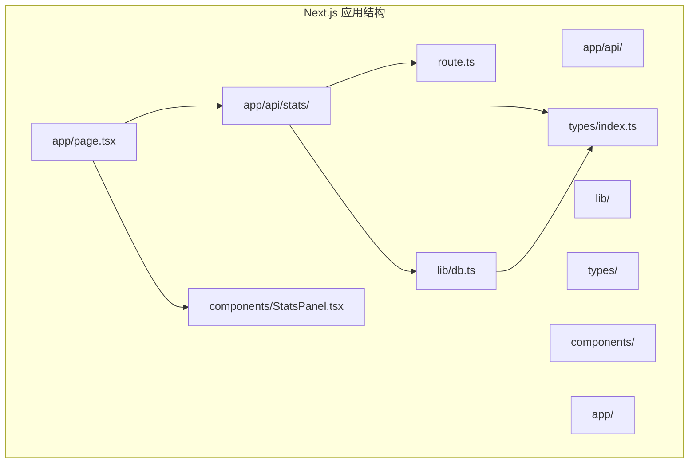
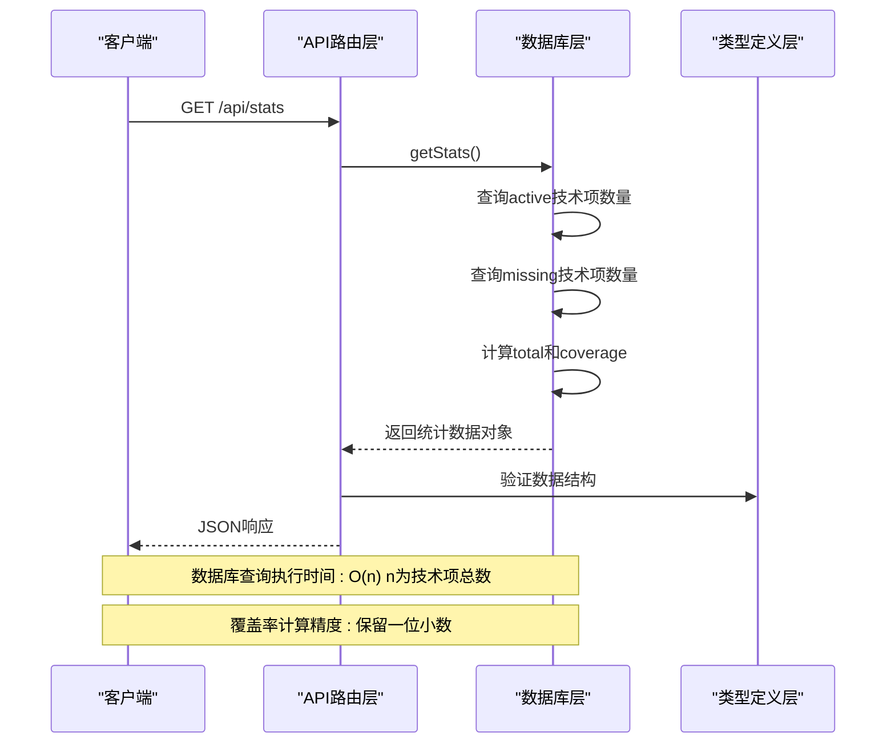
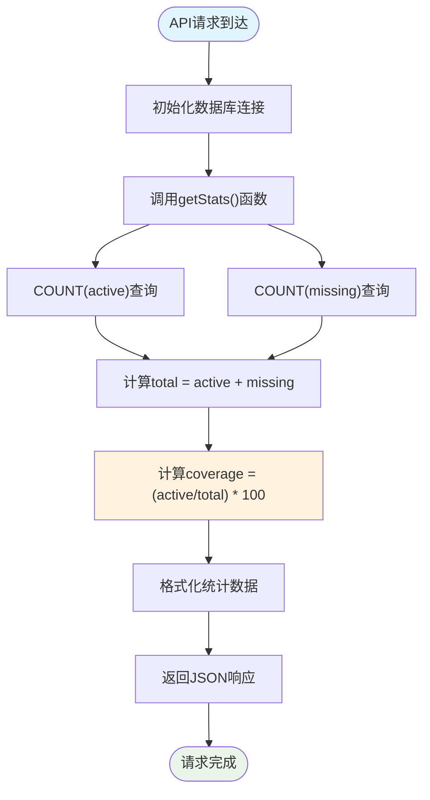
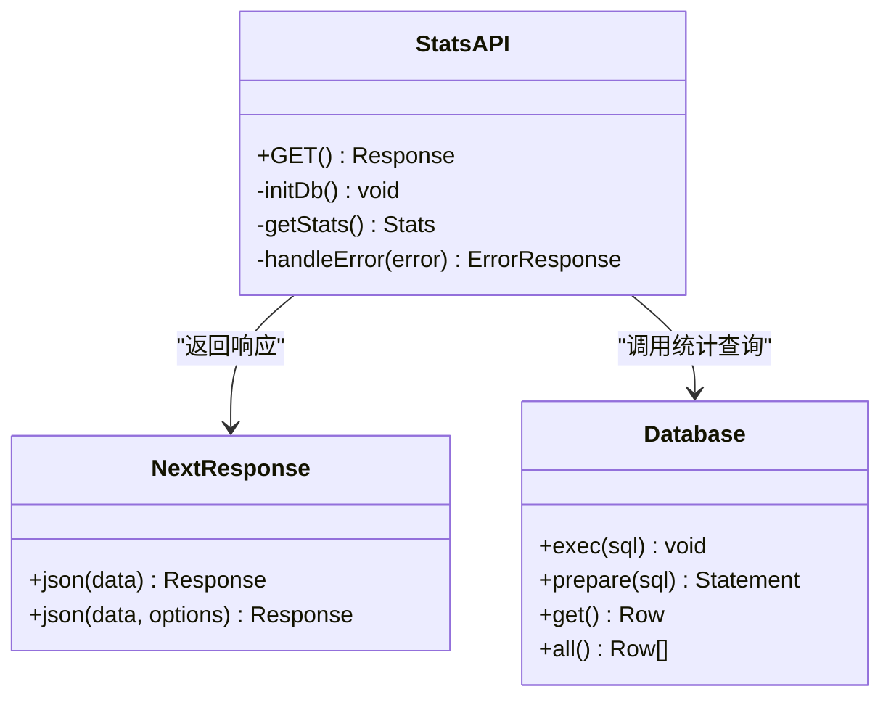
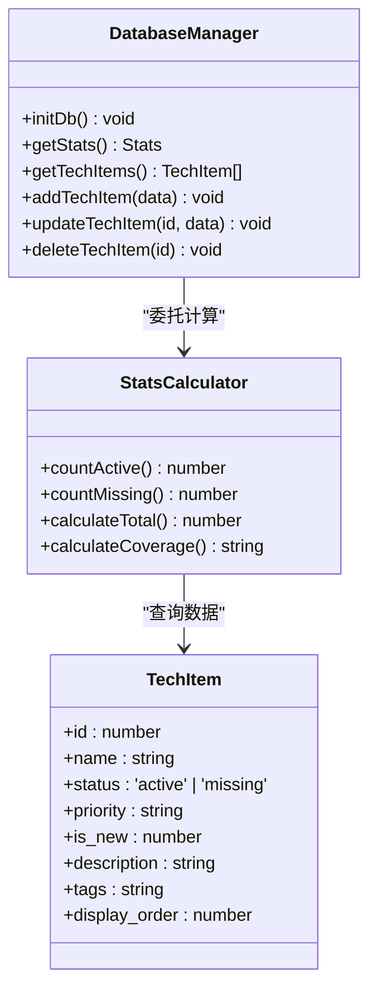
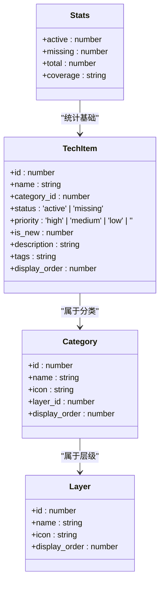
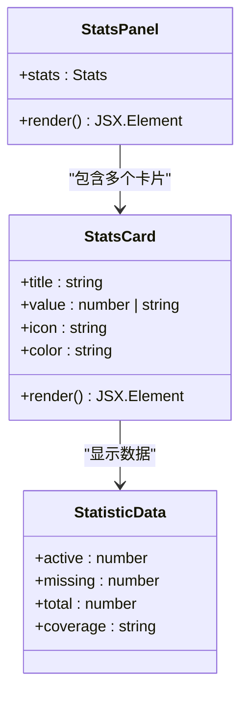
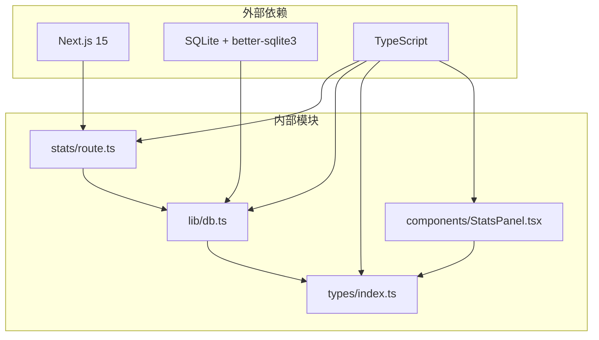
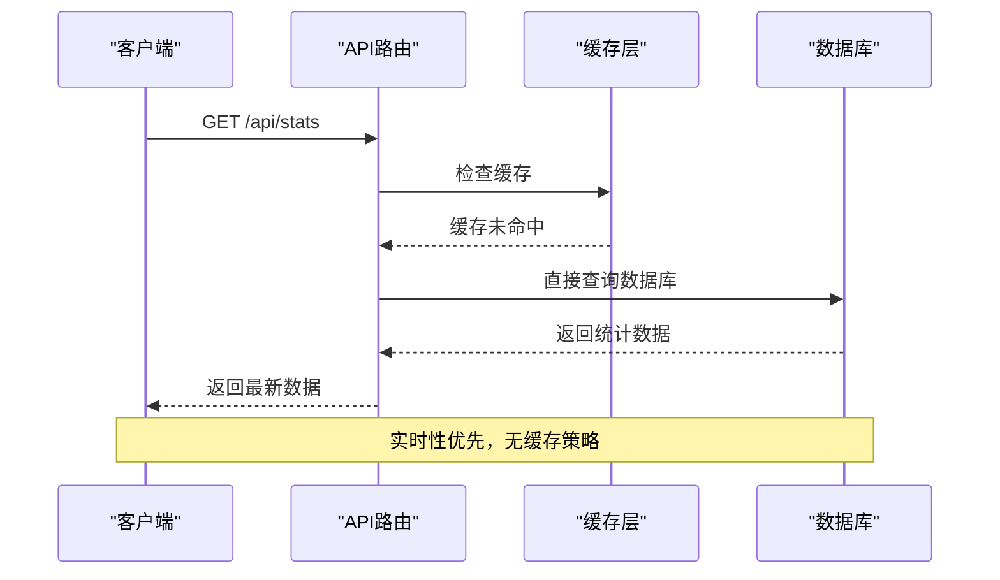

# 统计分析API

<cite>
**本文档引用的文件**
- [app/api/stats/route.ts](file://app/api/stats/route.ts)
- [lib/db.ts](file://lib/db.ts)
- [types/index.ts](file://types/index.ts)
- [components/StatsPanel.tsx](file://components/StatsPanel.tsx)
- [app/page.tsx](file://app/page.tsx)
- [README.md](file://README.md)
</cite>

## 目录
1. [简介](#简介)
2. [项目结构](#项目结构)
3. [核心组件](#核心组件)
4. [架构概览](#架构概览)
5. [详细组件分析](#详细组件分析)
6. [依赖关系分析](#依赖关系分析)
7. [性能考虑](#性能考虑)
8. [故障排除指南](#故障排除指南)
9. [结论](#结论)

## 简介

统计分析API是云平台技术蓝图图谱系统的核心组件之一，负责提供技术栈管理系统的统计数据。该API通过单一端点 `/api/stats` 提供实时的统计信息，包括已拥有技术项数量、缺失技术项数量、技术项总数以及覆盖率等关键指标。

该系统采用Next.js 15 App Router架构，使用TypeScript进行类型安全编程，SQLite作为数据存储引擎，配合better-sqlite3库实现高性能的数据库操作。统计功能直接从数据库层面进行计算，确保数据的实时性和准确性。

## 项目结构

统计分析API位于Next.js应用的API路由结构中，采用模块化设计，与其他API端点保持一致的架构模式。



**图表来源**
- [app/api/stats/route.ts](file://app/api/stats/route.ts#L1-L15)
- [lib/db.ts](file://lib/db.ts#L1-L50)
- [types/index.ts](file://types/index.ts#L1-L34)

**章节来源**
- [README.md](file://README.md#L20-L43)
- [app/api/stats/route.ts](file://app/api/stats/route.ts#L1-L15)

## 核心组件

统计分析API由多个核心组件构成，每个组件都有明确的职责和边界：

### API路由层
- **文件路径**: `app/api/stats/route.ts`
- **功能**: 处理HTTP请求，调用数据库层获取统计数据，返回JSON响应
- **错误处理**: 捕获异常并返回标准化错误格式

### 数据库层
- **文件路径**: `lib/db.ts`
- **功能**: 提供数据库连接、表结构初始化、统计数据查询等核心功能
- **统计计算**: 实现active、missing、total、coverage指标的计算逻辑

### 类型定义层
- **文件路径**: `types/index.ts`
- **功能**: 定义Stats接口，确保前后端数据结构的一致性
- **类型安全**: 提供编译时类型检查，防止数据格式错误

### 前端展示层
- **文件路径**: `components/StatsPanel.tsx`
- **功能**: 负责统计数据的UI展示，包含四个主要统计卡片
- **交互设计**: 提供视觉化的统计信息展示

**章节来源**
- [app/api/stats/route.ts](file://app/api/stats/route.ts#L1-L15)
- [lib/db.ts](file://lib/db.ts#L219-L239)
- [types/index.ts](file://types/index.ts#L28-L33)
- [components/StatsPanel.tsx](file://components/StatsPanel.tsx#L1-L84)

## 架构概览

统计分析API采用分层架构设计，各层之间职责清晰，耦合度低，便于维护和扩展。



**图表来源**
- [app/api/stats/route.ts](file://app/api/stats/route.ts#L6-L14)
- [lib/db.ts](file://lib/db.ts#L219-L239)

### 数据流架构



**图表来源**
- [lib/db.ts](file://lib/db.ts#L219-L239)

## 详细组件分析

### API路由组件分析

API路由组件是统计分析API的入口点，负责处理HTTP请求和响应。



**图表来源**
- [app/api/stats/route.ts](file://app/api/stats/route.ts#L1-L15)
- [lib/db.ts](file://lib/db.ts#L14-L50)

#### 请求处理流程

1. **初始化阶段**: 调用 `initDb()` 确保数据库连接可用
2. **数据获取**: 调用 `getStats()` 函数获取统计数据
3. **响应生成**: 使用 `NextResponse.json()` 返回JSON格式数据
4. **错误处理**: 捕获异常并返回标准化错误信息

#### 错误处理机制

API组件实现了完善的错误处理机制：
- 捕获数据库查询异常
- 格式化错误消息
- 返回HTTP 500状态码
- 提供详细的错误详情

**章节来源**
- [app/api/stats/route.ts](file://app/api/stats/route.ts#L6-L14)

### 数据库统计组件分析

数据库层是统计分析的核心实现，负责从SQLite数据库中提取和计算统计数据。



**图表来源**
- [lib/db.ts](file://lib/db.ts#L14-L50)
- [lib/db.ts](file://lib/db.ts#L219-L239)

#### 统计指标计算逻辑

统计组件实现了四种核心指标的计算：

1. **active（已拥有）**: 统计status为'active'的技术项数量
2. **missing（缺失）**: 统计status为'missing'的技术项数量  
3. **total（总数）**: active + missing的总和
4. **coverage（覆盖率）**: (active/total) * 100，保留一位小数

#### 数据聚合过程

```mermaid
flowchart LR
subgraph "数据库查询"
A[COUNT(*) WHERE status='active'] --> B[active计数]
C[COUNT(*) WHERE status='missing'] --> D[missing计数]
end
subgraph "计算过程"
B --> E[total = active + missing]
D --> E
B --> F[coverage = (active/total) * 100]
E --> F
end
subgraph "输出结果"
E --> G[Stats对象]
F --> G
end
```

**图表来源**
- [lib/db.ts](file://lib/db.ts#L219-L239)

**章节来源**
- [lib/db.ts](file://lib/db.ts#L219-L239)

### 类型定义组件分析

类型定义层确保了前后端数据结构的一致性和类型安全。



**图表来源**
- [types/index.ts](file://types/index.ts#L28-L33)
- [types/index.ts](file://types/index.ts#L16-L26)

#### 数据结构定义

统计API返回的数据结构严格定义如下：

| 字段名 | 类型 | 描述 | 示例值 |
|--------|------|------|--------|
| active | number | 已拥有技术项数量 | 45 |
| missing | number | 缺失技术项数量 | 12 |
| total | number | 技术项总数 | 57 |
| coverage | string | 覆盖率百分比 | "78.9" |

**章节来源**
- [types/index.ts](file://types/index.ts#L28-L33)

### 前端展示组件分析

前端组件负责将统计数据以用户友好的方式展示出来。



**图表来源**
- [components/StatsPanel.tsx](file://components/StatsPanel.tsx#L1-L84)

#### UI组件设计

前端统计面板包含四个主要统计卡片：

1. **已有技术栈**: 绿色主题，显示active数量
2. **待建设项**: 橙色主题，显示missing数量  
3. **总技术数**: 蓝色主题，显示total数量
4. **当前成熟度**: 紫色主题，显示coverage百分比

**章节来源**
- [components/StatsPanel.tsx](file://components/StatsPanel.tsx#L7-L54)

## 依赖关系分析

统计分析API的依赖关系相对简单，主要依赖于数据库层和类型定义层。



**图表来源**
- [app/api/stats/route.ts](file://app/api/stats/route.ts#L1-L2)
- [lib/db.ts](file://lib/db.ts#L1-L3)
- [types/index.ts](file://types/index.ts#L1-L1)

### 模块间耦合度分析

- **API路由层** ↔ **数据库层**: 强耦合，API路由直接调用数据库函数
- **数据库层** ↔ **类型定义层**: 强耦合，数据库函数返回类型定义的数据结构
- **前端组件** ↔ **类型定义层**: 强耦合，前端组件使用类型定义确保数据一致性
- **前端组件** ↔ **API路由层**: 弱耦合，通过HTTP API通信

**章节来源**
- [app/api/stats/route.ts](file://app/api/stats/route.ts#L1-L2)
- [lib/db.ts](file://lib/db.ts#L219-L239)
- [types/index.ts](file://types/index.ts#L28-L33)

## 性能考虑

统计分析API在设计时充分考虑了性能优化，采用多种策略确保高效的数据处理能力。

### 数据库查询优化

1. **索引利用**: tech_items表的status字段用于快速过滤
2. **单次查询**: 使用COUNT(*)一次性获取所需数据
3. **内存优化**: SQLite内存数据库提供快速访问

### 缓存机制

当前实现采用**无缓存策略**，每次请求都直接查询数据库：



**图表来源**
- [app/api/stats/route.ts](file://app/api/stats/route.ts#L6-L14)

### 性能特征

- **查询复杂度**: O(n)，n为tech_items表中的记录数
- **响应时间**: 通常小于100ms（取决于数据库大小）
- **内存使用**: 低，仅加载必要的统计数据

### 优化建议

针对大型数据集，可以考虑以下优化策略：

1. **数据库索引优化**: 为status字段创建复合索引
2. **缓存策略**: 实现Redis缓存，设置合理的过期时间
3. **批量更新**: 结合其他API端点的更新事件触发统计缓存失效
4. **分页统计**: 对于超大数据集，考虑分页统计方案

**章节来源**
- [lib/db.ts](file://lib/db.ts#L219-L239)

## 故障排除指南

### 常见问题及解决方案

#### 1. 数据库连接失败

**症状**: API返回500错误，错误信息包含数据库连接问题

**解决方案**:
- 检查data/techmap.db文件是否存在
- 验证数据库文件的读写权限
- 确认SQLite扩展已正确安装

#### 2. 统计数据异常

**症状**: coverage值为NaN或Infinity

**原因分析**:
- tech_items表为空，total为0
- 数据库损坏或数据不一致

**解决方案**:
- 运行数据库初始化脚本
- 检查数据完整性约束
- 重新导入数据

#### 3. 前端显示异常

**症状**: 统计面板显示空白或数据格式错误

**解决方案**:
- 检查网络请求是否成功
- 验证返回数据格式符合Stats接口定义
- 确认TypeScript类型检查无错误

### 调试工具和方法

1. **浏览器开发者工具**: 检查Network标签页中的API响应
2. **数据库查询**: 直接查询SQLite数据库验证数据
3. **日志记录**: 在API路由中添加详细的错误日志

**章节来源**
- [app/api/stats/route.ts](file://app/api/stats/route.ts#L10-L13)
- [lib/db.ts](file://lib/db.ts#L219-L239)

## 结论

统计分析API为云平台技术蓝图图谱系统提供了可靠的数据统计功能。该API设计简洁明了，实现了以下核心特性：

### 主要优势

1. **实时性**: 直接从数据库查询最新数据，确保统计信息的时效性
2. **类型安全**: 通过TypeScript确保前后端数据结构一致性
3. **错误处理**: 完善的异常捕获和错误响应机制
4. **可维护性**: 清晰的分层架构，职责分离明确

### 技术特色

- **轻量级设计**: 仅依赖SQLite和better-sqlite3，部署简单
- **高性能**: 单次查询获取所有统计信息，避免多次数据库往返
- **可扩展性**: 易于添加新的统计指标和计算逻辑

### 改进建议

1. **缓存机制**: 对于高频访问场景，建议实现适当的缓存策略
2. **并发控制**: 考虑在高并发场景下实现数据一致性保证
3. **监控告警**: 添加API性能监控和异常告警机制

该统计分析API为整个技术栈管理系统提供了坚实的数据基础，支持用户做出更明智的技术决策。