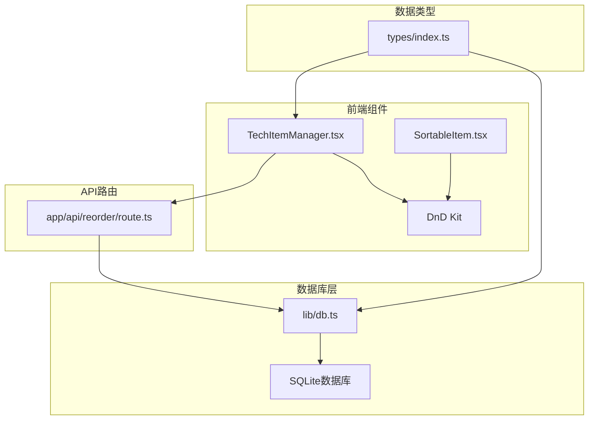
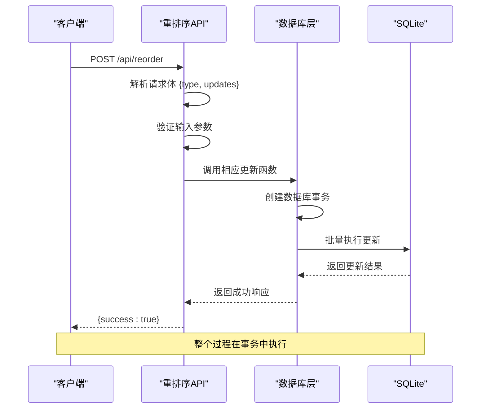
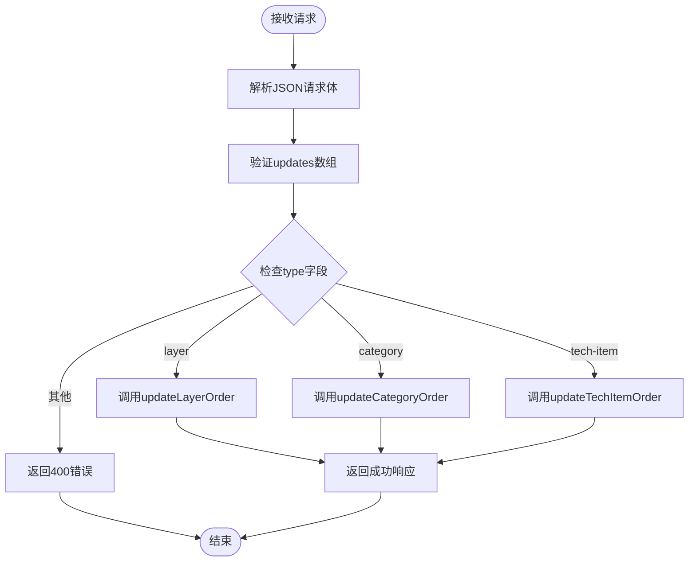
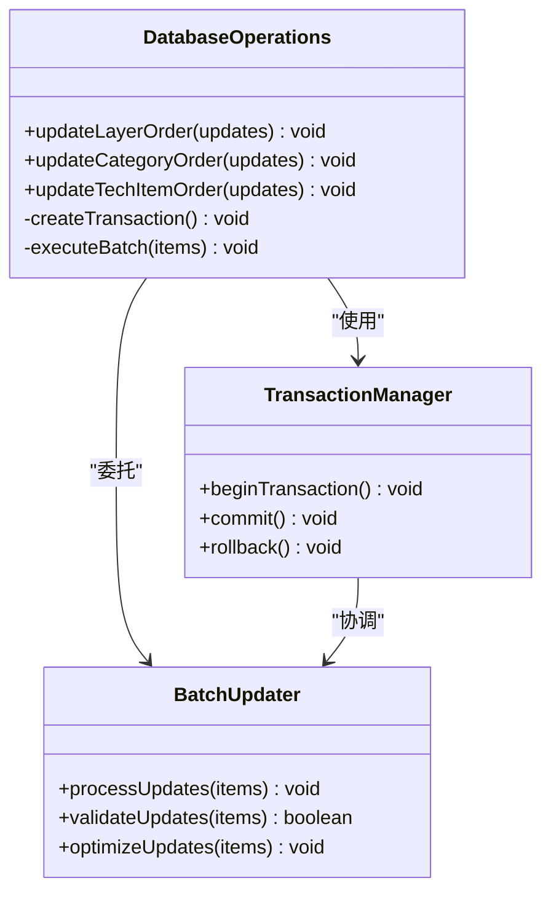
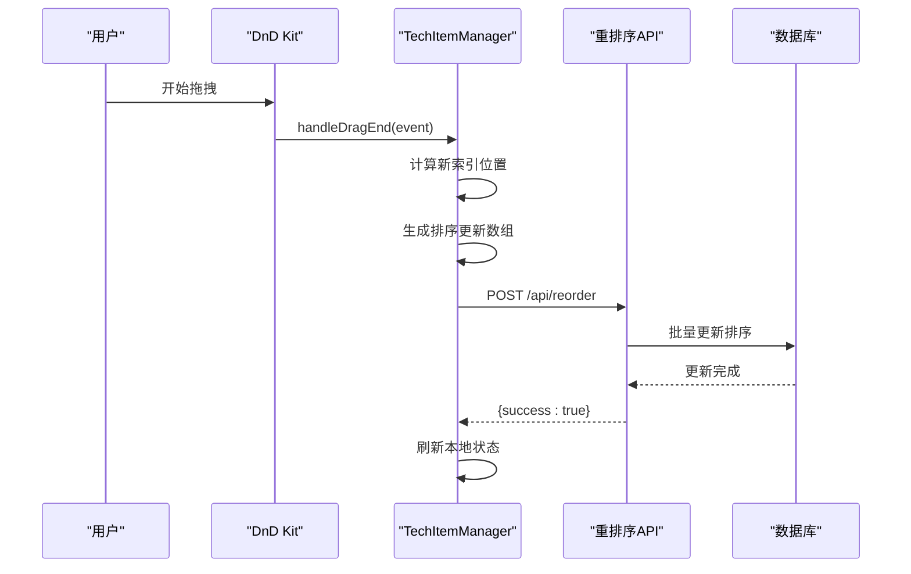

# 重新排序API

<cite>
**本文档引用的文件**
- [app/api/reorder/route.ts](file://app/api/reorder/route.ts)
- [lib/db.ts](file://lib/db.ts)
- [components/TechItemManager.tsx](file://components/TechItemManager.tsx)
- [components/SortableItem.tsx](file://components/SortableItem.tsx)
- [types/index.ts](file://types/index.ts)
</cite>

## 目录
1. [简介](#简介)
2. [项目结构](#项目结构)
3. [核心组件](#核心组件)
4. [架构概览](#架构概览)
5. [详细组件分析](#详细组件分析)
6. [依赖关系分析](#依赖关系分析)
7. [性能考虑](#性能考虑)
8. [故障排除指南](#故障排除指南)
9. [结论](#结论)

## 简介

重新排序API是云平台技术蓝图管理系统中的核心功能之一，负责处理拖拽重排序操作。该API支持对三个主要实体进行排序：层级（layers）、分类（categories）和技术项（tech-items）。通过拖拽交互，用户可以直观地调整内容的显示顺序，系统会自动将排序结果持久化到SQLite数据库中。

该API采用批量更新机制，使用数据库事务确保数据一致性和完整性。前端使用DnD Kit库实现流畅的拖拽体验，后端通过Next.js API Routes提供RESTful接口。

## 项目结构

重新排序功能涉及以下关键文件和组件：



**图表来源**
- [app/api/reorder/route.ts](file://app/api/reorder/route.ts#L1-L38)
- [lib/db.ts](file://lib/db.ts#L241-L282)
- [components/TechItemManager.tsx](file://components/TechItemManager.tsx#L58-L84)

**章节来源**
- [app/api/reorder/route.ts](file://app/api/reorder/route.ts#L1-L38)
- [lib/db.ts](file://lib/db.ts#L1-L312)
- [components/TechItemManager.tsx](file://components/TechItemManager.tsx#L1-L444)

## 核心组件

重新排序API的核心组件包括：

### API路由处理器
- **文件路径**: `app/api/reorder/route.ts`
- **HTTP方法**: POST
- **路由**: `/api/reorder`
- **功能**: 接收排序请求，根据类型调用相应的数据库更新函数

### 数据库操作层
- **文件路径**: `lib/db.ts`
- **批量更新函数**: 
  - `updateLayerOrder()` - 更新层级排序
  - `updateCategoryOrder()` - 更新分类排序  
  - `updateTechItemOrder()` - 更新技术项排序
- **事务处理**: 使用`db.transaction()`确保批量更新的一致性

### 前端拖拽组件
- **文件路径**: `components/TechItemManager.tsx`
- **拖拽处理**: `handleDragEnd()`函数处理拖拽结束事件
- **排序算法**: 使用`arrayMove()`实现数组重排序
- **数据转换**: 将排序结果转换为数据库更新格式

**章节来源**
- [app/api/reorder/route.ts](file://app/api/reorder/route.ts#L8-L38)
- [lib/db.ts](file://lib/db.ts#L241-L282)
- [components/TechItemManager.tsx](file://components/TechItemManager.tsx#L58-L84)

## 架构概览

重新排序API采用分层架构设计，确保职责分离和代码可维护性：



**图表来源**
- [app/api/reorder/route.ts](file://app/api/reorder/route.ts#L8-L38)
- [lib/db.ts](file://lib/db.ts#L241-L282)

## 详细组件分析

### API路由处理器分析

#### 请求处理流程
API路由处理器实现了完整的请求验证和错误处理机制：



**图表来源**
- [app/api/reorder/route.ts](file://app/api/reorder/route.ts#L8-L38)

#### 错误处理机制
- **输入验证**: 确保`updates`必须是数组
- **类型检查**: 支持"layer"、"category"、"tech-item"三种类型
- **异常捕获**: 捕获数据库操作异常并返回500错误
- **日志记录**: 控制台输出错误信息便于调试

**章节来源**
- [app/api/reorder/route.ts](file://app/api/reorder/route.ts#L8-L38)

### 数据库批量更新机制

#### 事务处理策略
数据库层使用SQLite的事务机制确保批量更新的一致性：



**图表来源**
- [lib/db.ts](file://lib/db.ts#L241-L282)

#### 批量更新优化
- **单次事务**: 所有更新在单个事务中完成
- **预编译语句**: 使用预编译SQL语句提高性能
- **原子性保证**: 整个批量操作要么全部成功，要么全部失败

**章节来源**
- [lib/db.ts](file://lib/db.ts#L241-L282)

### 前端拖拽交互实现

#### 拖拽事件处理
前端组件实现了完整的拖拽交互逻辑：



**图表来源**
- [components/TechItemManager.tsx](file://components/TechItemManager.tsx#L58-L84)
- [app/api/reorder/route.ts](file://app/api/reorder/route.ts#L8-L38)

#### 排序算法实现
前端使用`arrayMove`算法实现高效的数组重排序：

1. **索引计算**: 通过`findIndex()`获取拖拽元素和目标元素的索引
2. **数组重排**: 使用`arrayMove()`函数重新排列数组元素
3. **排序映射**: 将重排后的数组映射为`{id, display_order}`对象数组
4. **顺序生成**: `display_order`从1开始递增

**章节来源**
- [components/TechItemManager.tsx](file://components/TechItemManager.tsx#L58-L84)

### 数据一致性保证

#### ACID特性实现
重新排序操作满足ACID特性：

- **原子性**: 事务要么全部成功，要么全部回滚
- **一致性**: 数据库约束确保排序值的有效性
- **隔离性**: 事务隔离级别防止并发冲突
- **持久性**: SQLite WAL模式确保数据持久化

#### 并发控制
- **乐观锁**: 前端使用本地状态乐观更新
- **冲突检测**: 通过重新获取数据检测并发修改
- **回退机制**: 失败时自动回滚到最新状态

**章节来源**
- [lib/db.ts](file://lib/db.ts#L241-L282)
- [components/TechItemManager.tsx](file://components/TechItemManager.tsx#L58-L84)

## 依赖关系分析

重新排序API的依赖关系清晰明确：

```mermaid
graph LR
subgraph "外部依赖"
A[better-sqlite3]
B[@dnd-kit/sortable]
C[@dnd-kit/core]
end
subgraph "内部模块"
D[app/api/reorder/route.ts]
E[lib/db.ts]
F[components/TechItemManager.tsx]
G[components/SortableItem.tsx]
H[types/index.ts]
end
F --> B
F --> C
F --> G
D --> E
D --> H
E --> A
F --> H
```

**图表来源**
- [app/api/reorder/route.ts](file://app/api/reorder/route.ts#L1-L6)
- [lib/db.ts](file://lib/db.ts#L1-L3)
- [components/TechItemManager.tsx](file://components/TechItemManager.tsx#L1-L23)

**章节来源**
- [app/api/reorder/route.ts](file://app/api/reorder/route.ts#L1-L6)
- [lib/db.ts](file://lib/db.ts#L1-L3)
- [components/TechItemManager.tsx](file://components/TechItemManager.tsx#L1-L23)

## 性能考虑

### 数据库性能优化
- **批量操作**: 使用单个事务处理多个更新，减少数据库往返
- **预编译语句**: 避免SQL注入同时提高执行效率
- **索引利用**: `display_order`字段用于查询排序，建议建立索引

### 前端性能优化
- **虚拟滚动**: 对于大量数据使用虚拟滚动减少DOM节点
- **防抖处理**: 拖拽过程中的频繁更新进行防抖处理
- **内存管理**: 及时清理拖拽状态和事件监听器

### 缓存策略
- **本地缓存**: 前端缓存最新数据避免不必要的网络请求
- **增量更新**: 只更新受影响的数据项而非整个列表
- **失效策略**: 在数据变更后主动失效相关缓存

## 故障排除指南

### 常见问题及解决方案

#### API请求失败
**症状**: 前端收到500错误响应
**原因**: 数据库操作异常或事务失败
**解决**: 
1. 检查数据库连接状态
2. 验证`updates`数组格式正确
3. 查看服务器日志获取详细错误信息

#### 排序不生效
**症状**: 拖拽后页面显示顺序未改变
**原因**: 
1. 前端状态未正确更新
2. API响应处理错误
3. 数据库更新失败

**解决**:
1. 确认`onUpdate()`回调被正确调用
2. 检查`fetch`请求的Promise处理
3. 验证数据库事务是否正常提交

#### 数据库约束错误
**症状**: 更新操作抛出约束违反异常
**原因**: `display_order`值超出范围或重复
**解决**:
1. 确保排序值连续且无重复
2. 验证数据完整性约束
3. 检查外键关系是否正确

**章节来源**
- [app/api/reorder/route.ts](file://app/api/reorder/route.ts#L34-L37)
- [lib/db.ts](file://lib/db.ts#L241-L282)

## 结论

重新排序API通过精心设计的架构实现了高效、可靠的拖拽重排序功能。该系统的主要优势包括：

### 技术优势
- **事务保证**: 使用SQLite事务确保数据一致性
- **批量优化**: 单事务批量更新提升性能
- **类型安全**: TypeScript提供编译时类型检查
- **响应式设计**: 实时拖拽反馈提升用户体验

### 架构优势
- **分层清晰**: 前端、API、数据库各司其职
- **扩展性强**: 支持添加新的排序实体类型
- **错误处理完善**: 全面的异常捕获和恢复机制
- **性能优化**: 批量操作和事务处理提升效率

### 最佳实践
- **前端乐观更新**: 提升用户交互体验
- **后端事务处理**: 确保数据完整性
- **类型定义**: 强类型约束减少运行时错误
- **错误处理**: 完善的异常处理机制

该重新排序API为技术蓝图管理系统提供了稳定可靠的内容管理能力，为用户提供了直观便捷的排序体验。