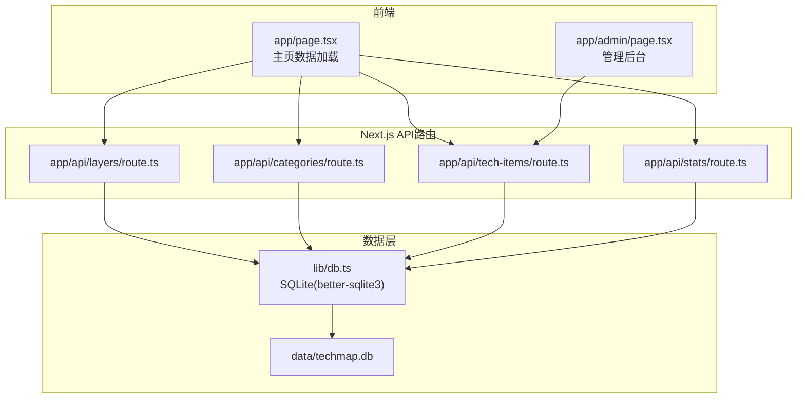
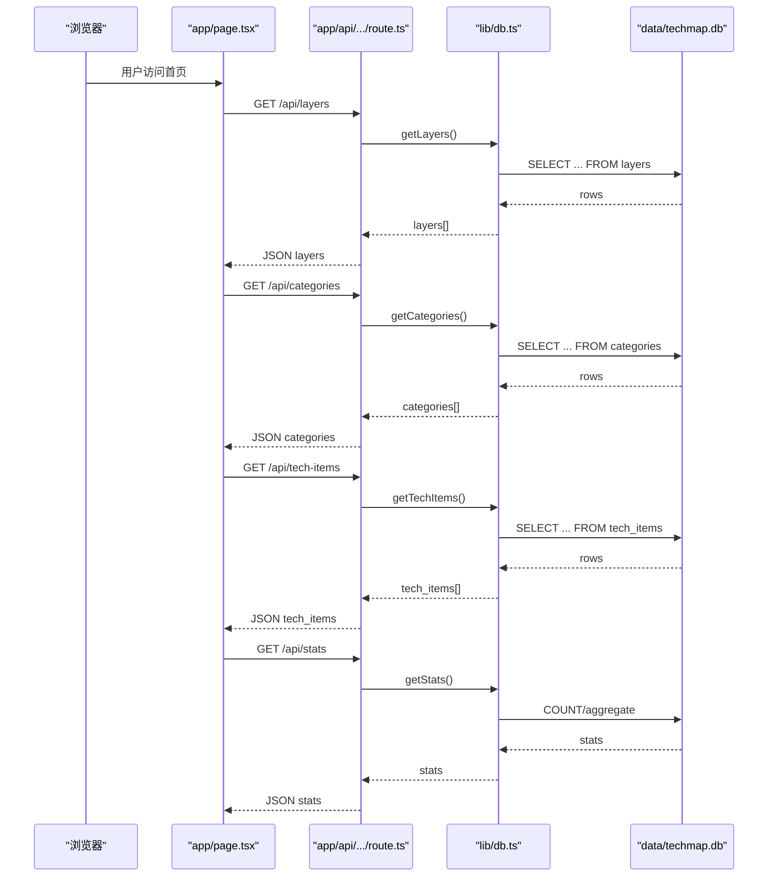
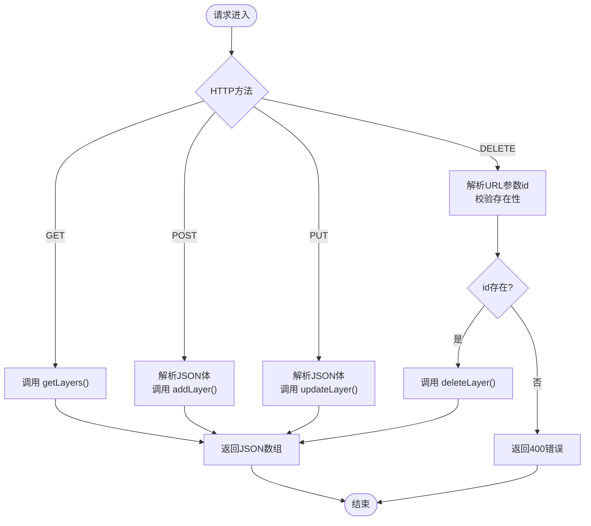
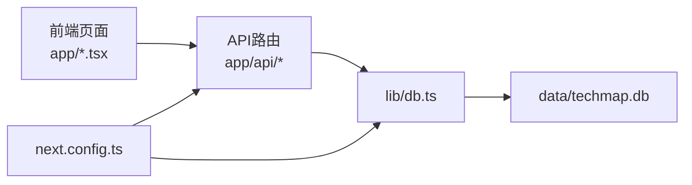

# API开发与集成

<cite>
**本文档引用的文件**
- [README.md](file://README.md)
- [app/api/categories/route.ts](file://app/api/categories/route.ts)
- [app/api/layers/route.ts](file://app/api/layers/route.ts)
- [app/api/stats/route.ts](file://app/api/stats/route.ts)
- [app/api/tech-items/route.ts](file://app/api/tech-items/route.ts)
- [lib/db.ts](file://lib/db.ts)
- [types/index.ts](file://types/index.ts)
- [package.json](file://package.json)
- [next.config.ts](file://next.config.ts)
- [lib/seed.ts](file://lib/seed.ts)
- [app/page.tsx](file://app/page.tsx)
- [app/admin/page.tsx](file://app/admin/page.tsx)
</cite>

## 目录
1. [简介](#简介)
2. [项目结构](#项目结构)
3. [核心组件](#核心组件)
4. [架构总览](#架构总览)
5. [详细组件分析](#详细组件分析)
6. [依赖关系分析](#依赖关系分析)
7. [性能考虑](#性能考虑)
8. [故障排查指南](#故障排查指南)
9. [结论](#结论)
10. [附录](#附录)

## 简介
本指南面向Lantu Next项目的API开发与集成，围绕Next.js App Router的API路由、请求处理与响应格式展开，结合项目现有的RESTful接口与SQLite数据层，系统阐述：
- RESTful API设计原则与HTTP状态码使用
- 请求参数校验与错误处理机制
- 数据验证与安全防护实践
- API文档生成与测试策略
- CORS配置、身份验证与权限控制
- 性能优化、缓存策略与限流机制
- 客户端调用示例、错误处理与调试技巧

## 项目结构
Lantu Next采用Next.js 15 App Router组织API路由，API位于app/api下，按资源域划分：layers、categories、tech-items、stats；数据访问封装在lib/db.ts中，类型定义位于types/index.ts；前端页面通过fetch调用这些API。

图表来源
- [app/page.tsx](file://app/page.tsx#L39-L63)
- [app/admin/page.tsx](file://app/admin/page.tsx#L23-L39)
- [app/api/layers/route.ts](file://app/api/layers/route.ts#L1-L48)
- [app/api/categories/route.ts](file://app/api/categories/route.ts#L1-L48)
- [app/api/tech-items/route.ts](file://app/api/tech-items/route.ts#L1-L50)
- [app/api/stats/route.ts](file://app/api/stats/route.ts#L1-L15)
- [lib/db.ts](file://lib/db.ts#L1-L312)

章节来源
- [README.md](file://README.md#L20-L43)
- [package.json](file://package.json#L1-L43)
- [next.config.ts](file://next.config.ts#L1-L10)

## 核心组件
- API路由模块：提供REST端点，统一返回JSON响应，异常时返回错误信息与HTTP状态码。
- 数据库模块：封装SQLite访问，包含表初始化、CRUD操作、统计查询与批量排序更新。
- 类型定义：为各资源提供TS接口，确保前后端契约一致。
- 前端页面：主页与管理后台通过fetch调用API，实现数据展示与管理。

章节来源
- [app/api/layers/route.ts](file://app/api/layers/route.ts#L1-L48)
- [app/api/categories/route.ts](file://app/api/categories/route.ts#L1-L48)
- [app/api/tech-items/route.ts](file://app/api/tech-items/route.ts#L1-L50)
- [app/api/stats/route.ts](file://app/api/stats/route.ts#L1-L15)
- [lib/db.ts](file://lib/db.ts#L14-L312)
- [types/index.ts](file://types/index.ts#L1-L34)
- [app/page.tsx](file://app/page.tsx#L39-L63)
- [app/admin/page.tsx](file://app/admin/page.tsx#L41-L70)

## 架构总览
API层采用Next.js App Router的约定式路由，每个API文件导出HTTP方法处理器，内部通过lib/db.ts访问SQLite数据库。前端页面通过同源fetch调用API，实现数据获取与管理操作。

图表来源
- [app/page.tsx](file://app/page.tsx#L39-L63)
- [app/api/layers/route.ts](file://app/api/layers/route.ts#L6-L13)
- [app/api/categories/route.ts](file://app/api/categories/route.ts#L6-L13)
- [app/api/tech-items/route.ts](file://app/api/tech-items/route.ts#L7-L14)
- [app/api/stats/route.ts](file://app/api/stats/route.ts#L6-L14)
- [lib/db.ts](file://lib/db.ts#L53-L57)
- [lib/db.ts](file://lib/db.ts#L79-L85)
- [lib/db.ts](file://lib/db.ts#L108-L114)
- [lib/db.ts](file://lib/db.ts#L220-L239)

## 详细组件分析

### 层级(Layers)API
- 端点
  - GET /api/layers：获取所有层级，按display_order排序
  - POST /api/layers：创建新层级
  - PUT /api/layers：更新层级
  - DELETE /api/layers?id={id}：删除层级
- 请求处理
  - GET：直接调用getLayers()返回数组
  - POST：解析JSON体，调用addLayer()并返回插入的id与提交字段
  - PUT：解析JSON体，调用updateLayer()，返回success
  - DELETE：从URL查询参数解析id，校验必填，调用deleteLayer()，返回success
- 错误处理
  - try/catch捕获异常，返回500与错误信息
  - DELETE缺少id时返回400与错误信息
- 响应格式
  - 成功：JSON对象或数组
  - 失败：包含error字段的JSON对象，配合HTTP状态码

图表来源
- [app/api/layers/route.ts](file://app/api/layers/route.ts#L6-L47)
- [lib/db.ts](file://lib/db.ts#L53-L57)
- [lib/db.ts](file://lib/db.ts#L117-L122)
- [lib/db.ts](file://lib/db.ts#L60-L70)
- [lib/db.ts](file://lib/db.ts#L73-L76)

章节来源
- [app/api/layers/route.ts](file://app/api/layers/route.ts#L1-L48)
- [lib/db.ts](file://lib/db.ts#L14-L50)
- [lib/db.ts](file://lib/db.ts#L53-L76)
- [lib/db.ts](file://lib/db.ts#L117-L122)

### 分类(Categories)API
- 端点
  - GET /api/categories：获取所有分类，按layer_id与display_order排序
  - POST /api/categories：创建新分类
  - PUT /api/categories：更新分类
  - DELETE /api/categories?id={id}：删除分类
- 请求处理
  - POST：解析name、icon、layer_id、display_order，调用addCategory()
  - PUT：解析id与其他字段，调用updateCategory()
  - DELETE：校验id，调用deleteCategory()
- 错误处理
  - 与layers类似，统一try/catch与状态码

章节来源
- [app/api/categories/route.ts](file://app/api/categories/route.ts#L1-L48)
- [lib/db.ts](file://lib/db.ts#L79-L85)
- [lib/db.ts](file://lib/db.ts#L125-L135)
- [lib/db.ts](file://lib/db.ts#L88-L105)

### 技术项(Tech Items)API
- 端点
  - GET /api/tech-items：获取所有技术项，按category_id与display_order排序
  - POST /api/tech-items：创建技术项（接收完整对象）
  - PUT /api/tech-items：更新技术项（接收包含id的对象）
  - DELETE /api/tech-items?id={id}：删除技术项
- 请求处理
  - POST：接收整个对象，调用addTechItem()
  - PUT：解构出id，其余字段动态更新，调用updateTechItem()
  - DELETE：校验id，调用deleteTechItem()

章节来源
- [app/api/tech-items/route.ts](file://app/api/tech-items/route.ts#L1-L50)
- [lib/db.ts](file://lib/db.ts#L108-L114)
- [lib/db.ts](file://lib/db.ts#L138-L162)
- [lib/db.ts](file://lib/db.ts#L165-L211)
- [lib/db.ts](file://lib/db.ts#L214-L217)

### 统计(Stats)API
- 端点
  - GET /api/stats：获取统计数据（active、missing、total、coverage）
- 请求处理
  - 调用getStats()，计算覆盖率百分比
- 错误处理
  - 捕获异常，返回500与错误详情

章节来源
- [app/api/stats/route.ts](file://app/api/stats/route.ts#L1-L15)
- [lib/db.ts](file://lib/db.ts#L220-L239)

### 数据库模块(db.ts)
- 初始化
  - 自动创建layers、categories、tech_items、users表
  - 使用better-sqlite3连接data/techmap.db
- 查询与变更
  - 提供getLayers、getCategories、getTechItems、getStats等查询
  - 提供addLayer、addCategory、addTechItem、updateLayer、updateCategory、updateTechItem、deleteLayer、deleteCategory、deleteTechItem
  - 支持批量排序更新：updateLayerOrder、updateCategoryOrder、updateTechItemOrder
  - 支持清空数据与用户管理
- 类型约束
  - tech_items.status限定为'active'或'missing'
  - tech_items.priority限定为'high'、'medium'、'low'或空字符串

章节来源
- [lib/db.ts](file://lib/db.ts#L14-L50)
- [lib/db.ts](file://lib/db.ts#L53-L239)
- [lib/db.ts](file://lib/db.ts#L242-L282)
- [lib/db.ts](file://lib/db.ts#L285-L309)

### 类型定义(types/index.ts)
- Layer、Category、TechItem、Stats接口，确保前后端契约一致
- TechItem.priority支持空字符串，便于表示“无优先级”

章节来源
- [types/index.ts](file://types/index.ts#L1-L34)

### 前端调用示例
- 主页(app/page.tsx)：并发获取四类API，设置状态，渲染UI
- 管理后台(app/admin/page.tsx)：新增/更新/删除技术项，使用fetch与PUT/POST/DELETE

章节来源
- [app/page.tsx](file://app/page.tsx#L39-L63)
- [app/admin/page.tsx](file://app/admin/page.tsx#L41-L70)

## 依赖关系分析
- API路由依赖lib/db.ts进行数据库操作
- lib/db.ts依赖better-sqlite3与SQLite文件
- 前端页面通过同源fetch调用API
- next.config.ts启用reactCompiler并声明better-sqlite3为外部包

图表来源
- [app/api/layers/route.ts](file://app/api/layers/route.ts#L1-L4)
- [lib/db.ts](file://lib/db.ts#L1-L11)
- [app/page.tsx](file://app/page.tsx#L39-L63)
- [next.config.ts](file://next.config.ts#L1-L10)

章节来源
- [package.json](file://package.json#L12-L36)
- [next.config.ts](file://next.config.ts#L1-L10)

## 性能考虑
- 并发请求：主页并发调用四个API，减少总等待时间
- 缓存策略：当前fetch未设置缓存头，建议根据场景选择no-store或cache策略
- 数据库事务：批量排序更新使用事务，保证一致性与性能
- 前端渲染优化：使用useMemo避免重复计算，减少重渲染
- 依赖优化：next.config.ts声明better-sqlite3为外部包，利于构建与运行时性能

章节来源
- [app/page.tsx](file://app/page.tsx#L39-L63)
- [lib/db.ts](file://lib/db.ts#L242-L282)
- [next.config.ts](file://next.config.ts#L1-L10)

## 故障排查指南
- 常见错误与状态码
  - 400：DELETE缺少id参数
  - 500：数据库异常或业务逻辑异常
- 错误处理模式
  - API路由统一try/catch，返回JSON错误与对应状态码
  - stats路由在500时返回错误详情
- 调试建议
  - 检查data/techmap.db是否存在与权限
  - 确认API端点路径与HTTP方法正确
  - 在前端console查看fetch错误
  - 使用数据库工具检查表结构与数据

章节来源
- [app/api/layers/route.ts](file://app/api/layers/route.ts#L35-L47)
- [app/api/categories/route.ts](file://app/api/categories/route.ts#L35-L47)
- [app/api/tech-items/route.ts](file://app/api/tech-items/route.ts#L37-L49)
- [app/api/stats/route.ts](file://app/api/stats/route.ts#L10-L14)
- [lib/db.ts](file://lib/db.ts#L14-L50)

## 结论
Lantu Next的API层遵循RESTful设计，使用Next.js App Router的约定式路由，结合better-sqlite3实现轻量级数据持久化。通过统一的错误处理与清晰的类型定义，前端能够稳定地消费API。建议在此基础上引入参数校验、CORS配置、身份认证与权限控制、API文档生成与测试策略，进一步提升系统的安全性、可维护性与可扩展性。

## 附录

### RESTful设计与HTTP状态码使用
- GET：获取资源集合或单个资源
- POST：创建资源
- PUT：完整更新资源
- DELETE：删除资源
- 状态码
  - 200：成功
  - 400：参数错误或缺失
  - 500：服务器内部错误

章节来源
- [README.md](file://README.md#L89-L111)
- [app/api/layers/route.ts](file://app/api/layers/route.ts#L6-L47)
- [app/api/categories/route.ts](file://app/api/categories/route.ts#L6-L47)
- [app/api/tech-items/route.ts](file://app/api/tech-items/route.ts#L7-L49)
- [app/api/stats/route.ts](file://app/api/stats/route.ts#L6-L14)

### 数据验证与参数校验
- 建议在API路由层增加参数校验（如使用Zod或Joi），对请求体与查询参数进行验证
- 对于DELETE端点，必须校验id存在性
- 对于枚举字段（status、priority），应在入库前进行白名单校验

章节来源
- [lib/db.ts](file://lib/db.ts#L28-L35)
- [lib/db.ts](file://lib/db.ts#L167-L174)

### 安全防护
- 身份认证与权限控制：当前项目包含users表，可在API路由中集成鉴权中间件
- CORS配置：在next.config.ts或中间件中配置允许的源、方法与头部
- 输入过滤与转义：对用户输入进行清理，避免注入风险

章节来源
- [lib/db.ts](file://lib/db.ts#L44-L48)
- [next.config.ts](file://next.config.ts#L1-L10)

### API文档生成与测试策略
- 文档生成：可使用Swagger/OpenAPI工具对接口进行描述与自动生成文档
- 测试策略：编写单元测试与集成测试，覆盖正常流程与边界条件（如缺失id、非法状态值）

章节来源
- [README.md](file://README.md#L89-L111)

### 缓存策略与限流机制
- 缓存策略：对只读数据（如layers、categories、stats）可考虑短期缓存
- 限流机制：在API层或反向代理层实现速率限制，防止滥用

章节来源
- [app/page.tsx](file://app/page.tsx#L41-L46)

### 客户端调用示例与调试技巧
- 客户端调用：使用fetch发送GET/POST/PUT/DELETE请求，注意Content-Type与请求体格式
- 错误处理：捕获网络错误与非2xx状态码，显示友好提示
- 调试技巧：利用浏览器开发者工具查看Network与Console，确认请求与响应

章节来源
- [app/page.tsx](file://app/page.tsx#L39-L63)
- [app/admin/page.tsx](file://app/admin/page.tsx#L41-L70)