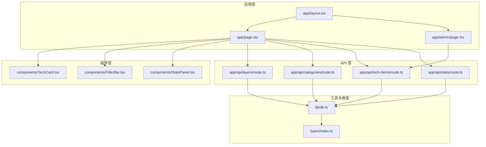
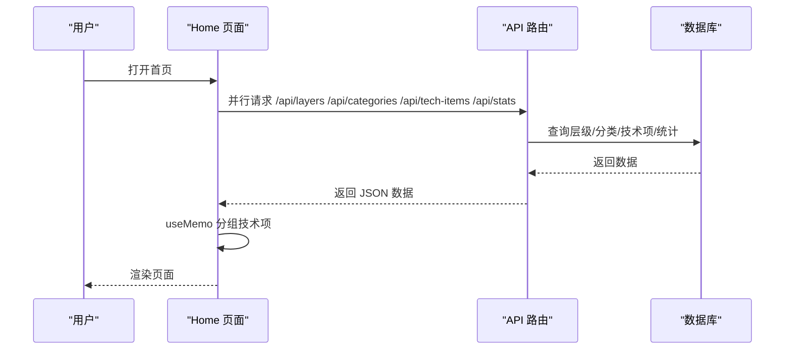
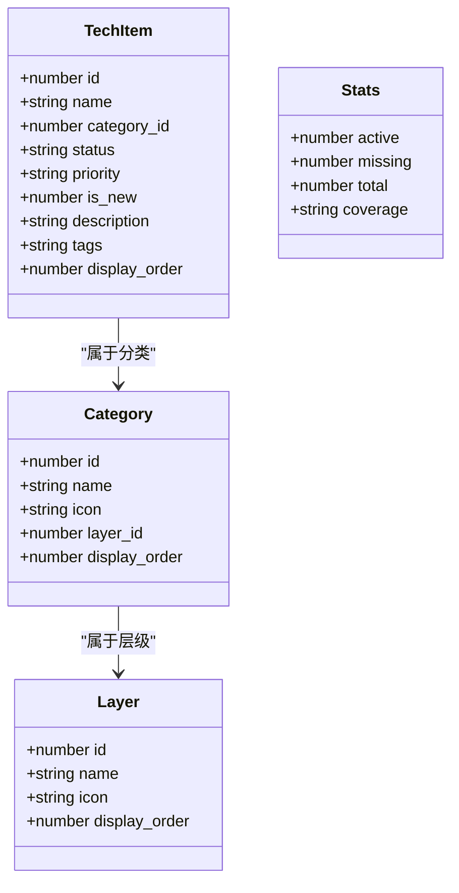
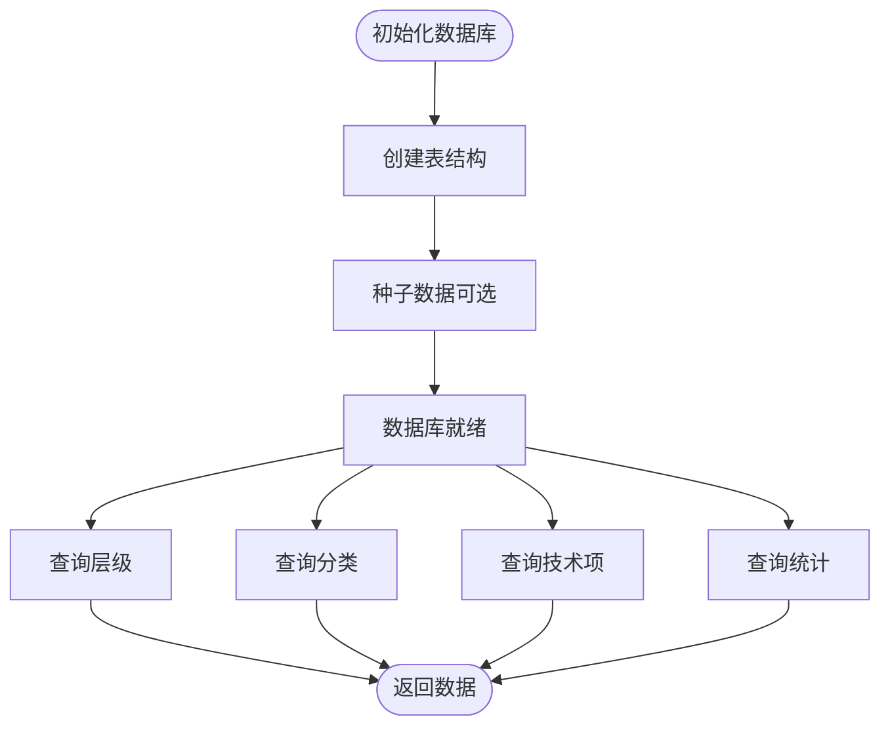
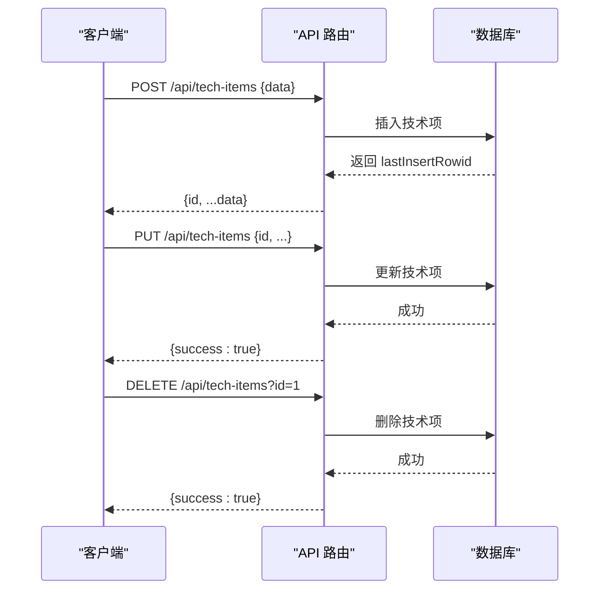
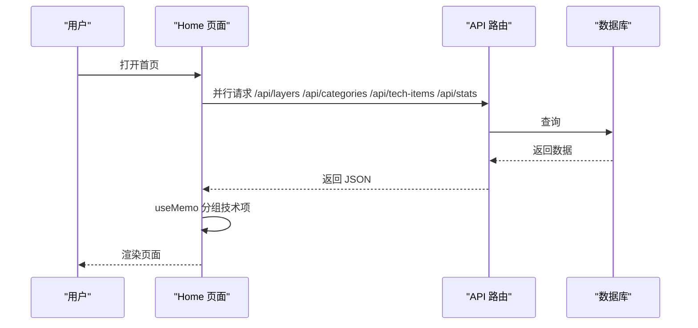
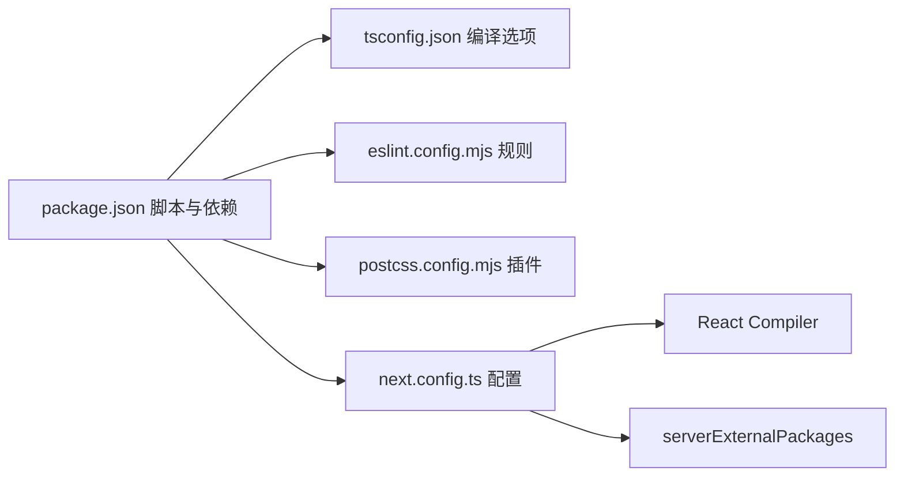

# 开发指南

<cite>
**本文档引用的文件**
- [package.json](file://package.json)
- [tsconfig.json](file://tsconfig.json)
- [eslint.config.mjs](file://eslint.config.mjs)
- [next.config.ts](file://next.config.ts)
- [postcss.config.mjs](file://postcss.config.mjs)
- [README.md](file://README.md)
- [types/index.ts](file://types/index.ts)
- [lib/db.ts](file://lib/db.ts)
- [app/layout.tsx](file://app/layout.tsx)
- [app/page.tsx](file://app/page.tsx)
- [app/admin/page.tsx](file://app/admin/page.tsx)
- [app/api/layers/route.ts](file://app/api/layers/route.ts)
- [app/api/categories/route.ts](file://app/api/categories/route.ts)
- [app/api/tech-items/route.ts](file://app/api/tech-items/route.ts)
- [app/api/stats/route.ts](file://app/api/stats/route.ts)
- [components/TechCard.tsx](file://components/TechCard.tsx)
- [components/FilterBar.tsx](file://components/FilterBar.tsx)
- [components/StatsPanel.tsx](file://components/StatsPanel.tsx)
</cite>

## 目录
1. [简介](#简介)
2. [项目结构](#项目结构)
3. [核心组件](#核心组件)
4. [架构总览](#架构总览)
5. [详细组件分析](#详细组件分析)
6. [依赖关系分析](#依赖关系分析)
7. [性能考虑](#性能考虑)
8. [故障排查指南](#故障排查指南)
9. [结论](#结论)
10. [附录](#附录)

## 简介
本指南面向 Lantu Next 项目的开发者，目标是帮助你快速搭建开发环境、理解项目架构、掌握组件与 API 的开发规范、样式与性能优化策略，以及新增功能的完整开发流程与测试、代码审查要点。项目采用 Next.js App Router、TypeScript、Tailwind CSS 与 SQLite，提供技术蓝图可视化与管理后台。

## 项目结构
- 应用入口与布局：根布局负责字体加载、全局样式与上下文提供。
- 页面层：首页与管理后台页面，负责数据拉取、状态管理与组件编排。
- 组件层：通用 UI 组件（卡片、筛选、统计面板等），按功能模块化组织。
- API 层：Next.js App Router 的 API 路由，封装数据库操作。
- 工具与类型：数据库工具、类型定义集中于 lib 与 types 目录。
- 配置：TypeScript、ESLint、PostCSS、Next.js 等配置文件位于仓库根目录。

图表来源
- [app/layout.tsx](file://app/layout.tsx#L1-L36)
- [app/page.tsx](file://app/page.tsx#L1-L238)
- [app/admin/page.tsx](file://app/admin/page.tsx#L1-L311)
- [components/TechCard.tsx](file://components/TechCard.tsx#L1-L37)
- [components/FilterBar.tsx](file://components/FilterBar.tsx#L1-L52)
- [components/StatsPanel.tsx](file://components/StatsPanel.tsx#L1-L84)
- [app/api/layers/route.ts](file://app/api/layers/route.ts#L1-L48)
- [app/api/categories/route.ts](file://app/api/categories/route.ts#L1-L48)
- [app/api/tech-items/route.ts](file://app/api/tech-items/route.ts#L1-L50)
- [app/api/stats/route.ts](file://app/api/stats/route.ts#L1-L15)
- [lib/db.ts](file://lib/db.ts#L1-L312)
- [types/index.ts](file://types/index.ts#L1-L34)

章节来源
- [README.md](file://README.md#L20-L43)

## 核心组件
- TechCard：展示单个技术项，根据状态与优先级动态切换样式，悬停显示详情提示。
- FilterBar：提供多种筛选条件按钮，支持“全部/已有/缺失”与多语言标签筛选。
- StatsPanel：展示已有、缺失、总数与覆盖率统计，并提供图例说明。
- 页面 Home：负责并发拉取层级、分类、技术项与统计信息，使用 useMemo 进行分组缓存，实现高效渲染。
- 管理后台 Admin：提供技术项的增删改查与列表展示，支持批量操作与表单校验。

章节来源
- [components/TechCard.tsx](file://components/TechCard.tsx#L1-L37)
- [components/FilterBar.tsx](file://components/FilterBar.tsx#L1-L52)
- [components/StatsPanel.tsx](file://components/StatsPanel.tsx#L1-L84)
- [app/page.tsx](file://app/page.tsx#L1-L238)
- [app/admin/page.tsx](file://app/admin/page.tsx#L1-L311)

## 架构总览
系统采用前后端同构的 Next.js 架构，页面组件负责 UI 与交互，API 路由作为服务端接口，数据库操作集中在 lib/db.ts 中，类型定义统一于 types/index.ts。页面通过并行请求获取多源数据，减少重渲染，提升用户体验。

图表来源
- [app/page.tsx](file://app/page.tsx#L39-L68)
- [app/api/layers/route.ts](file://app/api/layers/route.ts#L6-L13)
- [app/api/categories/route.ts](file://app/api/categories/route.ts#L6-L13)
- [app/api/tech-items/route.ts](file://app/api/tech-items/route.ts#L7-L14)
- [app/api/stats/route.ts](file://app/api/stats/route.ts#L6-L14)
- [lib/db.ts](file://lib/db.ts#L53-L57)
- [lib/db.ts](file://lib/db.ts#L79-L85)
- [lib/db.ts](file://lib/db.ts#L108-L114)
- [lib/db.ts](file://lib/db.ts#L220-L239)

## 详细组件分析

### 数据模型与类型
- 层级（Layer）、分类（Category）、技术项（TechItem）、统计（Stats）定义了数据结构与约束。
- 技术项的状态为枚举值，优先级支持高/中/低/空字符串；新增标记为数值布尔。

图表来源
- [types/index.ts](file://types/index.ts#L1-L34)

章节来源
- [types/index.ts](file://types/index.ts#L1-L34)

### 数据库设计与操作
- 初始化表结构：categories、tech_items、layers、users。
- 提供 CRUD 与排序更新接口，支持事务批量更新。
- 统计查询计算已有/缺失数量与覆盖率百分比。

图表来源
- [lib/db.ts](file://lib/db.ts#L14-L50)
- [lib/db.ts](file://lib/db.ts#L220-L239)

章节来源
- [lib/db.ts](file://lib/db.ts#L1-L312)

### API 路由设计
- 层级 API：GET/POST/PUT/DELETE，支持创建、更新与删除层级。
- 分类 API：GET/POST/PUT/DELETE，支持创建、更新与删除分类。
- 技术项 API：GET/POST/PUT/DELETE，支持创建、更新与删除技术项。
- 统计 API：GET，返回已有/缺失/总数/覆盖率。

图表来源
- [app/api/tech-items/route.ts](file://app/api/tech-items/route.ts#L16-L49)
- [lib/db.ts](file://lib/db.ts#L138-L162)
- [lib/db.ts](file://lib/db.ts#L165-L211)
- [lib/db.ts](file://lib/db.ts#L214-L217)

章节来源
- [app/api/layers/route.ts](file://app/api/layers/route.ts#L1-L48)
- [app/api/categories/route.ts](file://app/api/categories/route.ts#L1-L48)
- [app/api/tech-items/route.ts](file://app/api/tech-items/route.ts#L1-L50)
- [app/api/stats/route.ts](file://app/api/stats/route.ts#L1-L15)

### 页面与组件交互
- 首页 Home 并发获取四类数据，使用 useMemo 将技术项按分类分组，避免重复创建数组引用导致子组件重渲染。
- 管理后台 AdminPage 提供表单与列表，支持新增/编辑/删除，提交后刷新数据。

图表来源
- [app/page.tsx](file://app/page.tsx#L39-L68)
- [app/api/layers/route.ts](file://app/api/layers/route.ts#L6-L13)
- [app/api/categories/route.ts](file://app/api/categories/route.ts#L6-L13)
- [app/api/tech-items/route.ts](file://app/api/tech-items/route.ts#L7-L14)
- [app/api/stats/route.ts](file://app/api/stats/route.ts#L6-L14)

章节来源
- [app/page.tsx](file://app/page.tsx#L1-L238)
- [app/admin/page.tsx](file://app/admin/page.tsx#L1-L311)

## 依赖关系分析
- 依赖管理：使用 npm scripts 启动开发、构建与启动，提供 ESLint 检查与数据库初始化脚本。
- TypeScript：严格模式、禁止 emit、路径别名 @/* 指向项目根目录。
- ESLint：基于 Next.js 推荐规则，覆盖 Core Web Vitals 与 TypeScript。
- PostCSS：集成 Tailwind CSS 插件，配合 Tailwind v4。
- Next.js：启用 React Compiler，外部依赖 better-sqlite3 通过 serverExternalPackages 处理。

图表来源
- [package.json](file://package.json#L1-L43)
- [tsconfig.json](file://tsconfig.json#L1-L35)
- [eslint.config.mjs](file://eslint.config.mjs#L1-L19)
- [postcss.config.mjs](file://postcss.config.mjs#L1-L8)
- [next.config.ts](file://next.config.ts#L1-L10)

章节来源
- [package.json](file://package.json#L1-L43)
- [tsconfig.json](file://tsconfig.json#L1-L35)
- [eslint.config.mjs](file://eslint.config.mjs#L1-L19)
- [postcss.config.mjs](file://postcss.config.mjs#L1-L8)
- [next.config.ts](file://next.config.ts#L1-L10)

## 性能考虑
- 并发数据拉取：首页使用 Promise.all 并行请求多个 API，降低首屏等待时间。
- 渲染优化：使用 useMemo 对技术项按分类进行分组，避免每次渲染创建新数组引用，减少子组件重渲染。
- 图标动态解析：通过 lucide-react 动态导入图标，避免打包未使用图标。
- 样式与动画：使用 Tailwind CSS 控制过渡与悬停效果，保持轻量与一致的视觉反馈。
- 数据库事务：批量更新排序时使用事务，保证一致性与性能。

章节来源
- [app/page.tsx](file://app/page.tsx#L39-L68)
- [app/page.tsx](file://app/page.tsx#L26-L34)
- [lib/db.ts](file://lib/db.ts#L242-L252)
- [lib/db.ts](file://lib/db.ts#L255-L267)
- [lib/db.ts](file://lib/db.ts#L270-L282)

## 故障排查指南
- 数据库初始化失败
  - 现象：API 请求报错或页面空白。
  - 排查：确认数据库目录存在且可写；执行数据库初始化脚本；检查表结构是否正确。
  - 参考
    - [README.md](file://README.md#L53-L59)
    - [lib/db.ts](file://lib/db.ts#L14-L50)
- 端口占用
  - 现象：开发服务器无法启动。
  - 排查：检查 package.json 中的端口配置；更换端口或释放占用端口。
  - 参考
    - [README.md](file://README.md#L61-L67)
    - [package.json](file://package.json#L6)
- ESLint 报错
  - 现象：编辑器或命令行提示规则错误。
  - 排查：遵循 Next.js 推荐规则；检查忽略项与自定义规则；修复类型相关问题。
  - 参考
    - [eslint.config.mjs](file://eslint.config.mjs#L1-L19)
- 样式异常
  - 现象：组件样式不生效或冲突。
  - 排查：确认 Tailwind 插件已启用；检查路径别名与编译选项；验证类名拼接逻辑。
  - 参考
    - [postcss.config.mjs](file://postcss.config.mjs#L1-L8)
    - [tsconfig.json](file://tsconfig.json#L21-L23)
- API 返回错误
  - 现象：管理后台或首页请求失败。
  - 排查：检查 API 路由中的错误处理与状态码；确认数据库连接与初始化；查看控制台日志。
  - 参考
    - [app/api/tech-items/route.ts](file://app/api/tech-items/route.ts#L16-L24)
    - [app/api/stats/route.ts](file://app/api/stats/route.ts#L6-L14)

章节来源
- [README.md](file://README.md#L53-L59)
- [README.md](file://README.md#L61-L67)
- [eslint.config.mjs](file://eslint.config.mjs#L1-L19)
- [postcss.config.mjs](file://postcss.config.mjs#L1-L8)
- [tsconfig.json](file://tsconfig.json#L21-L23)
- [app/api/tech-items/route.ts](file://app/api/tech-items/route.ts#L16-L24)
- [app/api/stats/route.ts](file://app/api/stats/route.ts#L6-L14)

## 结论
本指南从环境配置、代码规范、组件与 API 设计、性能优化到故障排查提供了系统性指导。建议在新增功能时遵循现有模式：先完善类型定义与数据库操作，再实现 API 路由，最后在页面中并行拉取与渲染。通过严格的 ESLint 规则与 TypeScript 类型约束，结合 Tailwind 样式体系，可确保代码质量与开发效率。

## 附录

### 开发环境配置
- Node.js 与包管理：使用 npm 脚本；如需更快安装可选用 pnpm。
- 依赖安装与初始化：安装依赖后执行数据库初始化脚本。
- 启动开发服务器：使用 npm run dev，默认端口可在脚本中调整。
- 参考
  - [README.md](file://README.md#L47-L67)
  - [package.json](file://package.json#L5-L11)

章节来源
- [README.md](file://README.md#L47-L67)
- [package.json](file://package.json#L5-L11)

### TypeScript 与 ESLint 配置
- TypeScript
  - 严格模式、禁止 emit、路径别名 @/*、增量编译与插件启用。
  - 参考
    - [tsconfig.json](file://tsconfig.json#L2-L24)
- ESLint
  - 基于 Next.js 推荐规则，覆盖 Core Web Vitals 与 TypeScript。
  - 参考
    - [eslint.config.mjs](file://eslint.config.mjs#L1-L19)

章节来源
- [tsconfig.json](file://tsconfig.json#L2-L24)
- [eslint.config.mjs](file://eslint.config.mjs#L1-L19)

### 组件开发最佳实践
- Props 明确：使用类型定义约束 props，避免运行时错误。
- 样式复用：统一使用 Tailwind 类名，保持风格一致。
- 交互反馈：为按钮与卡片添加过渡与悬停效果，提升可用性。
- 参考
  - [components/TechCard.tsx](file://components/TechCard.tsx#L3-L5)
  - [components/FilterBar.tsx](file://components/FilterBar.tsx#L1-L4)
  - [components/StatsPanel.tsx](file://components/StatsPanel.tsx#L3-L5)

章节来源
- [components/TechCard.tsx](file://components/TechCard.tsx#L3-L5)
- [components/FilterBar.tsx](file://components/FilterBar.tsx#L1-L4)
- [components/StatsPanel.tsx](file://components/StatsPanel.tsx#L3-L5)

### 新增功能开发流程
- 定义类型：在 types/index.ts 中新增接口或扩展现有接口。
- 数据库操作：在 lib/db.ts 中实现对应 CRUD 与查询函数。
- API 路由：在 app/api 下新增路由文件，调用数据库函数并返回 JSON。
- 页面集成：在 app/page.tsx 或 app/admin/page.tsx 中发起请求与渲染。
- 测试与审查：本地运行 lint 与功能测试，提交前进行代码审查。
- 参考
  - [types/index.ts](file://types/index.ts#L1-L34)
  - [lib/db.ts](file://lib/db.ts#L1-L312)
  - [app/api/tech-items/route.ts](file://app/api/tech-items/route.ts#L1-L50)
  - [app/page.tsx](file://app/page.tsx#L1-L238)
  - [package.json](file://package.json#L9)

章节来源
- [types/index.ts](file://types/index.ts#L1-L34)
- [lib/db.ts](file://lib/db.ts#L1-L312)
- [app/api/tech-items/route.ts](file://app/api/tech-items/route.ts#L1-L50)
- [app/page.tsx](file://app/page.tsx#L1-L238)
- [package.json](file://package.json#L9)

### 主题定制与国际化
- 主题定制：通过 Tailwind CSS 自定义颜色与变量，结合渐变与阴影实现视觉层次。
- 国际化：当前项目使用中文文案；如需国际化，建议引入 i18n 方案并在页面与组件中按需切换语言。
- 参考
  - [app/layout.tsx](file://app/layout.tsx#L6-L14)
  - [components/StatsPanel.tsx](file://components/StatsPanel.tsx#L58-L80)

章节来源
- [app/layout.tsx](file://app/layout.tsx#L6-L14)
- [components/StatsPanel.tsx](file://components/StatsPanel.tsx#L58-L80)