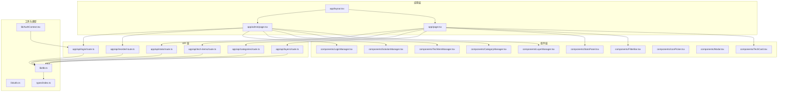
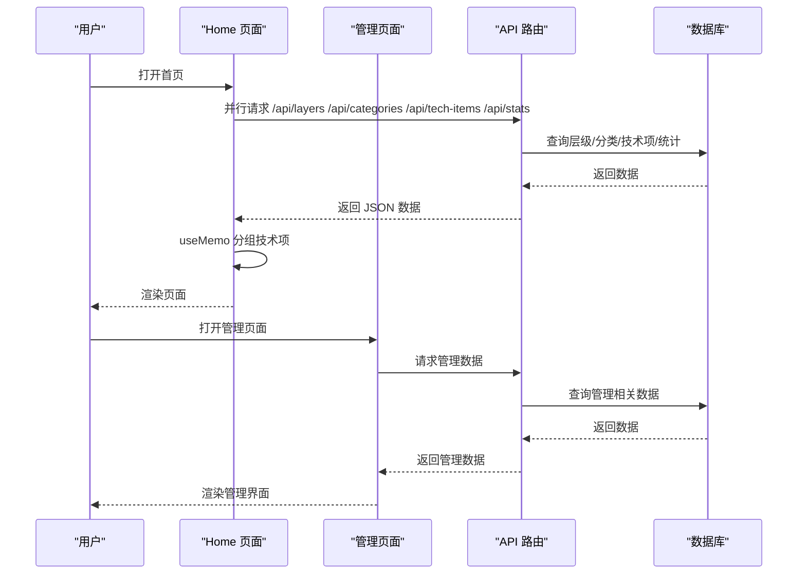
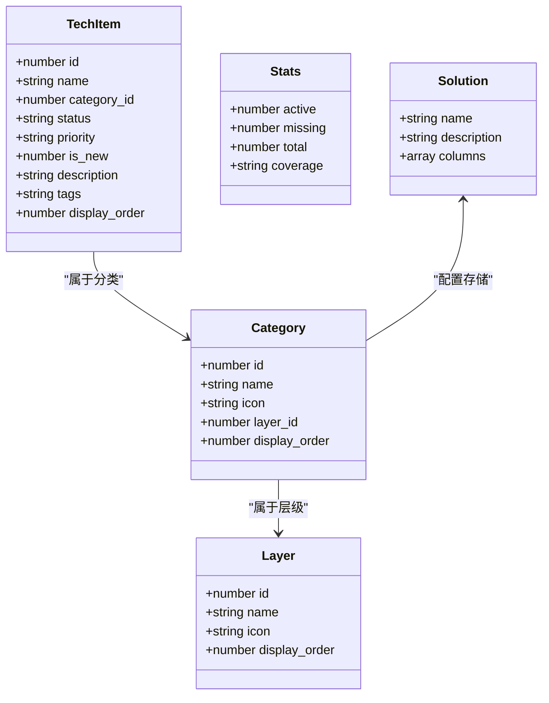
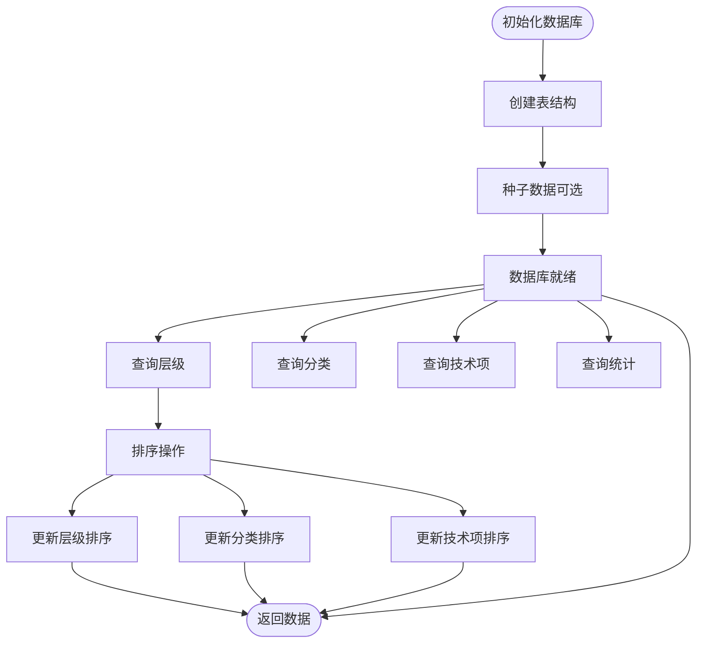
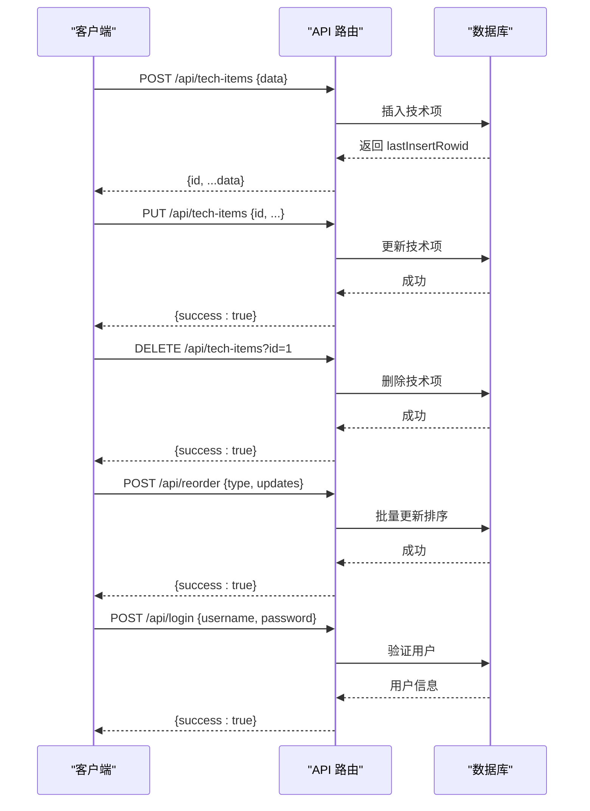
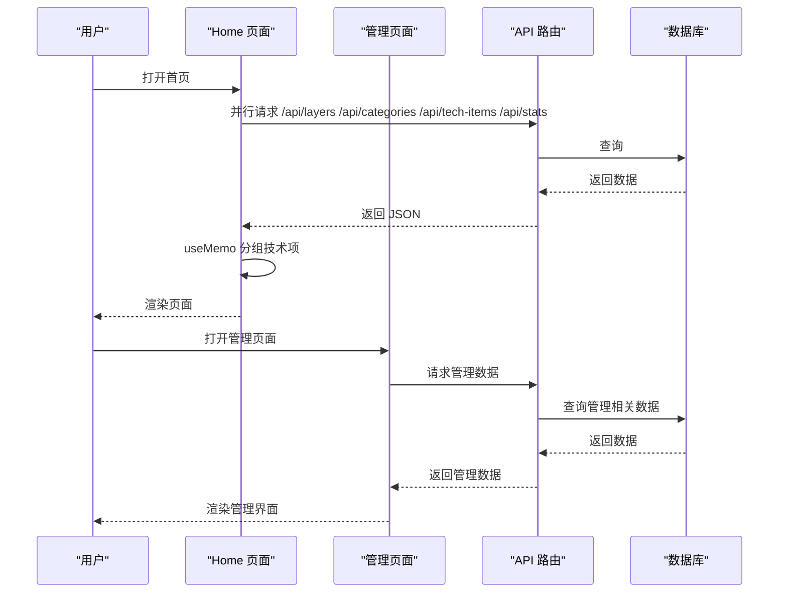
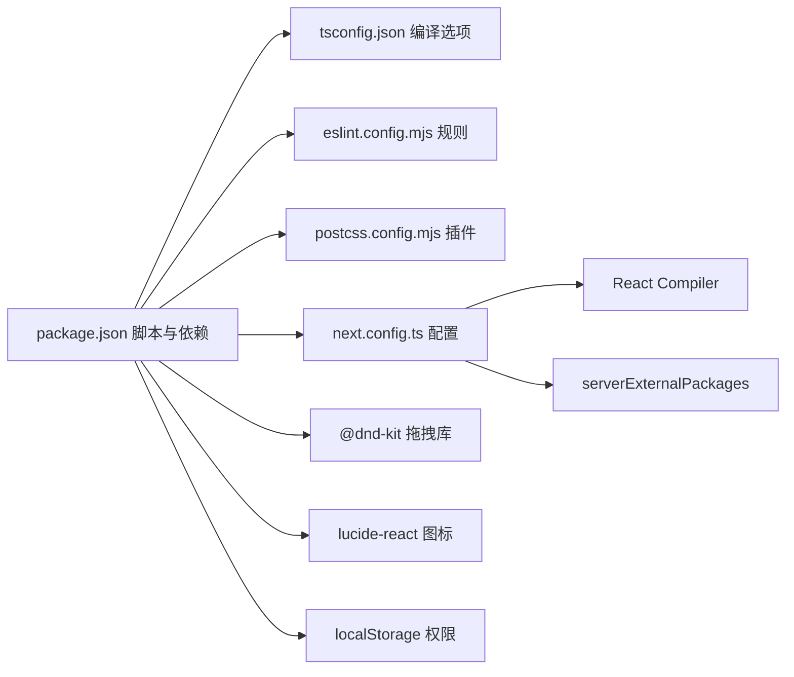

# 开发指南

<cite>
**本文档引用的文件**
- [package.json](file://package.json)
- [tsconfig.json](file://tsconfig.json)
- [eslint.config.mjs](file://eslint.config.mjs)
- [next.config.ts](file://next.config.ts)
- [postcss.config.mjs](file://postcss.config.mjs)
- [README.md](file://README.md)
- [types/index.ts](file://types/index.ts)
- [lib/db.ts](file://lib/db.ts)
- [lib/AuthContext.tsx](file://lib/AuthContext.tsx)
- [lib/utils.ts](file://lib/utils.ts)
- [app/layout.tsx](file://app/layout.tsx)
- [app/page.tsx](file://app/page.tsx)
- [app/admin/page.tsx](file://app/admin/page.tsx)
- [app/api/layers/route.ts](file://app/api/layers/route.ts)
- [app/api/categories/route.ts](file://app/api/categories/route.ts)
- [app/api/tech-items/route.ts](file://app/api/tech-items/route.ts)
- [app/api/stats/route.ts](file://app/api/stats/route.ts)
- [app/api/reorder/route.ts](file://app/api/reorder/route.ts)
- [app/api/login/route.ts](file://app/api/login/route.ts)
- [components/TechCard.tsx](file://components/TechCard.tsx)
- [components/FilterBar.tsx](file://components/FilterBar.tsx)
- [components/StatsPanel.tsx](file://components/StatsPanel.tsx)
- [components/Modal.tsx](file://components/Modal.tsx)
- [components/IconPicker.tsx](file://components/IconPicker.tsx)
- [components/CategoryManager.tsx](file://components/CategoryManager.tsx)
- [components/LayerManager.tsx](file://components/LayerManager.tsx)
- [components/SolutionManager.tsx](file://components/SolutionManager.tsx)
- [components/TechItemManager.tsx](file://components/TechItemManager.tsx)
- [components/LoginManager.tsx](file://components/LoginManager.tsx)
</cite>

## 更新摘要
**变更内容**
- 新增管理组件开发章节，涵盖层级管理、分类管理和技术项管理
- 新增API扩展开发章节，包括排序API和登录认证API
- 新增权限控制和认证机制说明
- 新增拖拽排序和批量操作功能介绍
- 更新组件开发最佳实践和管理功能集成

## 目录
1. [简介](#简介)
2. [项目结构](#项目结构)
3. [核心组件](#核心组件)
4. [架构总览](#架构总览)
5. [详细组件分析](#详细组件分析)
6. [管理组件开发](#管理组件开发)
7. [API扩展开发](#api扩展开发)
8. [权限控制与认证](#权限控制与认证)
9. [依赖关系分析](#依赖关系分析)
10. [性能考虑](#性能考虑)
11. [故障排查指南](#故障排查指南)
12. [结论](#结论)
13. [附录](#附录)

## 简介
本指南面向 Lantu Next 项目的开发者，目标是帮助你快速搭建开发环境、理解项目架构、掌握组件与 API 的开发规范、样式与性能优化策略，以及新增功能的完整开发流程与测试、代码审查要点。项目采用 Next.js App Router、TypeScript、Tailwind CSS 与 SQLite，提供技术蓝图可视化与管理后台。新增的管理组件和API扩展支持层级管理、分类管理、技术项管理、拖拽排序、权限控制等功能。

## 项目结构
- 应用入口与布局：根布局负责字体加载、全局样式与上下文提供。
- 页面层：首页与管理后台页面，负责数据拉取、状态管理与组件编排。
- 组件层：通用 UI 组件（卡片、筛选、统计面板等），管理组件（层级管理、分类管理、技术项管理等），按功能模块化组织。
- API 层：Next.js App Router 的 API 路由，封装数据库操作，新增排序和认证API。
- 工具与类型：数据库工具、认证上下文、工具函数、类型定义集中于 lib 与 types 目录。
- 配置：TypeScript、ESLint、PostCSS、Next.js 等配置文件位于仓库根目录。

**图表来源**
- [app/layout.tsx](file://app/layout.tsx#L1-L36)
- [app/page.tsx](file://app/page.tsx#L1-L238)
- [app/admin/page.tsx](file://app/admin/page.tsx#L1-L311)
- [components/TechCard.tsx](file://components/TechCard.tsx#L1-L37)
- [components/FilterBar.tsx](file://components/FilterBar.tsx#L1-L52)
- [components/StatsPanel.tsx](file://components/StatsPanel.tsx#L1-L84)
- [components/LayerManager.tsx](file://components/LayerManager.tsx#L1-L312)
- [components/CategoryManager.tsx](file://components/CategoryManager.tsx#L1-L280)
- [components/TechItemManager.tsx](file://components/TechItemManager.tsx#L1-L444)
- [components/SolutionManager.tsx](file://components/SolutionManager.tsx#L1-L508)
- [components/IconPicker.tsx](file://components/IconPicker.tsx#L1-L154)
- [components/Modal.tsx](file://components/Modal.tsx#L1-L75)
- [components/LoginManager.tsx](file://components/LoginManager.tsx#L1-L118)
- [app/api/layers/route.ts](file://app/api/layers/route.ts#L1-L48)
- [app/api/categories/route.ts](file://app/api/categories/route.ts#L1-L48)
- [app/api/tech-items/route.ts](file://app/api/tech-items/route.ts#L1-L50)
- [app/api/stats/route.ts](file://app/api/stats/route.ts#L1-L15)
- [app/api/reorder/route.ts](file://app/api/reorder/route.ts#L1-L39)
- [app/api/login/route.ts](file://app/api/login/route.ts#L1-L20)
- [lib/db.ts](file://lib/db.ts#L1-L312)
- [lib/AuthContext.tsx](file://lib/AuthContext.tsx#L1-L62)
- [lib/utils.ts](file://lib/utils.ts#L1-L7)
- [types/index.ts](file://types/index.ts#L1-L34)

**章节来源**
- [README.md](file://README.md#L20-L43)

## 核心组件
- TechCard：展示单个技术项，根据状态与优先级动态切换样式，悬停显示详情提示。
- FilterBar：提供多种筛选条件按钮，支持"全部/已有/缺失"与多语言标签筛选。
- StatsPanel：展示已有、缺失、总数与覆盖率统计，并提供图例说明。
- 页面 Home：负责并发拉取层级、分类、技术项与统计信息，使用 useMemo 进行分组缓存，实现高效渲染。
- 管理后台 Admin：提供技术项的增删改查与列表展示，支持批量操作与表单校验。
- **新增** LayerManager：管理技术蓝图的层级，支持拖拽排序、创建、编辑、删除操作。
- **新增** CategoryManager：管理分类，支持拖拽排序、创建、编辑、删除操作。
- **新增** TechItemManager：管理技术项，支持拖拽排序、状态切换、创建、编辑、删除操作。
- **新增** SolutionManager：管理解决方案，支持多列技术架构分层、批量技术项管理。
- **新增** LoginManager：提供管理员登录界面，集成认证状态管理。

**章节来源**
- [components/TechCard.tsx](file://components/TechCard.tsx#L1-L37)
- [components/FilterBar.tsx](file://components/FilterBar.tsx#L1-L52)
- [components/StatsPanel.tsx](file://components/StatsPanel.tsx#L1-L84)
- [components/LayerManager.tsx](file://components/LayerManager.tsx#L1-L312)
- [components/CategoryManager.tsx](file://components/CategoryManager.tsx#L1-L280)
- [components/TechItemManager.tsx](file://components/TechItemManager.tsx#L1-L444)
- [components/SolutionManager.tsx](file://components/SolutionManager.tsx#L1-L508)
- [components/LoginManager.tsx](file://components/LoginManager.tsx#L1-L118)
- [app/page.tsx](file://app/page.tsx#L1-L238)
- [app/admin/page.tsx](file://app/admin/page.tsx#L1-L311)

## 架构总览
系统采用前后端同构的 Next.js 架构，页面组件负责 UI 与交互，API 路由作为服务端接口，数据库操作集中在 lib/db.ts 中，类型定义统一于 types/index.ts。页面通过并行请求获取多源数据，减少重渲染，提升用户体验。新增的管理组件通过拖拽排序和批量操作增强用户体验。

**图表来源**
- [app/page.tsx](file://app/page.tsx#L39-L68)
- [app/admin/page.tsx](file://app/admin/page.tsx#L23-L39)
- [app/api/layers/route.ts](file://app/api/layers/route.ts#L6-L13)
- [app/api/categories/route.ts](file://app/api/categories/route.ts#L6-L13)
- [app/api/tech-items/route.ts](file://app/api/tech-items/route.ts#L7-L14)
- [app/api/stats/route.ts](file://app/api/stats/route.ts#L6-L14)
- [lib/db.ts](file://lib/db.ts#L53-L57)
- [lib/db.ts](file://lib/db.ts#L79-L85)
- [lib/db.ts](file://lib/db.ts#L108-L114)
- [lib/db.ts](file://lib/db.ts#L220-L239)

## 详细组件分析

### 数据模型与类型
- 层级（Layer）、分类（Category）、技术项（TechItem）、统计（Stats）定义了数据结构与约束。
- 技术项的状态为枚举值，优先级支持高/中/低/空字符串；新增标记为数值布尔。
- **新增** 解决方案（Solution）通过分类的 icon 字段存储配置信息。

**图表来源**
- [types/index.ts](file://types/index.ts#L1-L34)

**章节来源**
- [types/index.ts](file://types/index.ts#L1-L34)

### 数据库设计与操作
- 初始化表结构：categories、tech_items、layers、users。
- 提供 CRUD 与排序更新接口，支持事务批量更新。
- 统计查询计算已有/缺失数量与覆盖率百分比。
- **新增** 排序更新函数：updateLayerOrder、updateCategoryOrder、updateTechItemOrder。

**图表来源**
- [lib/db.ts](file://lib/db.ts#L14-L50)
- [lib/db.ts](file://lib/db.ts#L241-L282)
- [lib/db.ts](file://lib/db.ts#L220-L239)

**章节来源**
- [lib/db.ts](file://lib/db.ts#L1-L312)

### API 路由设计
- 层级 API：GET/POST/PUT/DELETE，支持创建、更新与删除层级。
- 分类 API：GET/POST/PUT/DELETE，支持创建、更新与删除分类。
- 技术项 API：GET/POST/PUT/DELETE，支持创建、更新与删除技术项。
- 统计 API：GET，返回已有/缺失/总数/覆盖率。
- **新增** 排序 API：POST /api/reorder，支持层级、分类、技术项的批量排序更新。
- **新增** 登录 API：POST /api/login，提供管理员认证功能。

**图表来源**
- [app/api/tech-items/route.ts](file://app/api/tech-items/route.ts#L16-L49)
- [app/api/reorder/route.ts](file://app/api/reorder/route.ts#L8-L38)
- [app/api/login/route.ts](file://app/api/login/route.ts#L4-L19)
- [lib/db.ts](file://lib/db.ts#L138-L162)
- [lib/db.ts](file://lib/db.ts#L165-L211)
- [lib/db.ts](file://lib/db.ts#L214-L217)
- [lib/db.ts](file://lib/db.ts#L241-L282)

**章节来源**
- [app/api/layers/route.ts](file://app/api/layers/route.ts#L1-L48)
- [app/api/categories/route.ts](file://app/api/categories/route.ts#L1-L48)
- [app/api/tech-items/route.ts](file://app/api/tech-items/route.ts#L1-L50)
- [app/api/stats/route.ts](file://app/api/stats/route.ts#L1-L15)
- [app/api/reorder/route.ts](file://app/api/reorder/route.ts#L1-L39)
- [app/api/login/route.ts](file://app/api/login/route.ts#L1-L20)

### 页面与组件交互
- 首页 Home 并发获取四类数据，使用 useMemo 将技术项按分类分组，避免重复创建数组引用导致子组件重渲染。
- 管理后台 AdminPage 提供表单与列表，支持新增/编辑/删除，提交后刷新数据。
- **新增** 管理组件通过拖拽排序实现层级、分类、技术项的重新排列。
- **新增** 解决方案管理器支持多列技术架构分层和批量技术项管理。

**图表来源**
- [app/page.tsx](file://app/page.tsx#L39-L68)
- [app/admin/page.tsx](file://app/admin/page.tsx#L23-L39)
- [app/api/layers/route.ts](file://app/api/layers/route.ts#L6-L13)
- [app/api/categories/route.ts](file://app/api/categories/route.ts#L6-L13)
- [app/api/tech-items/route.ts](file://app/api/tech-items/route.ts#L7-L14)
- [app/api/stats/route.ts](file://app/api/stats/route.ts#L6-L14)

**章节来源**
- [app/page.tsx](file://app/page.tsx#L1-L238)
- [app/admin/page.tsx](file://app/admin/page.tsx#L1-L311)

## 管理组件开发

### 层级管理组件（LayerManager）
LayerManager 提供完整的层级管理功能，包括拖拽排序、创建、编辑、删除操作。

**核心功能**
- 拖拽排序：使用 @dnd-kit 实现层级的拖拽排序，实时更新数据库排序。
- 创建编辑：支持层级名称、图标、显示顺序的创建和编辑。
- 删除保护：提供确认对话框，防止误删除。
- 图标选择：集成 IconPicker 组件，支持 Lucide 图标和自定义表情符号。

**实现特点**
- 使用 DndContext 和 SortableContext 实现拖拽功能。
- 通过 /api/reorder API 批量更新排序。
- 支持动态图标渲染，兼容 Lucide 图标和自定义文本。

**章节来源**
- [components/LayerManager.tsx](file://components/LayerManager.tsx#L1-L312)
- [components/IconPicker.tsx](file://components/IconPicker.tsx#L1-L154)

### 分类管理组件（CategoryManager）
CategoryManager 专注于分类的管理，提供与层级管理相似的功能集。

**核心功能**
- 分类拖拽排序：基于 display_order 字段实现分类排序。
- 分类生命周期：支持分类的创建、编辑、删除。
- 与层级关联：每个分类都关联到特定的层级。

**实现特点**
- 深度监听初始数据变化，确保状态同步。
- 使用 Modal 组件提供弹窗式管理界面。
- 支持分类级别的权限控制。

**章节来源**
- [components/CategoryManager.tsx](file://components/CategoryManager.tsx#L1-L280)

### 技术项管理组件（TechItemManager）
TechItemManager 提供技术项的精细化管理功能。

**核心功能**
- 技术项拖拽排序：支持技术项在分类内的重新排序。
- 状态切换：一键切换技术项的"已有/缺失"状态。
- 详细编辑：支持名称、状态、优先级、描述、标签等字段编辑。
- 乐观更新：状态切换时先更新本地状态，失败时回滚。

**实现特点**
- 使用深度序列化比较确保状态同步。
- 实现乐观更新机制提升用户体验。
- 支持 is_new 标记，突出显示新技术项。

**章节来源**
- [components/TechItemManager.tsx](file://components/TechItemManager.tsx#L1-L444)

### 解决方案管理器（SolutionManager）
SolutionManager 是最复杂的管理组件，支持多列技术架构分层。

**核心功能**
- 多列架构：支持自定义技术架构分层（前端、后端、运维等）。
- 动态列管理：支持添加、删除自定义技术分组。
- 批量技术项管理：在不同列间移动技术项。
- 解决方案持久化：将配置信息存储在分类的 icon 字段中。

**实现特点**
- 使用 JSON 存储复杂配置数据。
- 实现完整的 CRUD 流程，包括级联删除。
- 支持解决方案级别的删除操作。

**章节来源**
- [components/SolutionManager.tsx](file://components/SolutionManager.tsx#L1-L508)

### 管理组件开发最佳实践
- **状态管理**：使用 useState 和 useEffect 管理组件状态，确保与父组件同步。
- **权限控制**：通过 useAuth hook 实现管理员权限验证。
- **错误处理**：统一的错误处理和用户反馈机制。
- **性能优化**：使用 useMemo 和 useCallback 优化渲染性能。
- **用户体验**：提供加载状态、确认对话框、即时反馈等。

**章节来源**
- [components/LayerManager.tsx](file://components/LayerManager.tsx#L120-L131)
- [components/CategoryManager.tsx](file://components/CategoryManager.tsx#L120-L122)
- [components/TechItemManager.tsx](file://components/TechItemManager.tsx#L166-L168)
- [components/SolutionManager.tsx](file://components/SolutionManager.tsx#L278-L289)

## API扩展开发

### 排序API（/api/reorder）
新增的排序API支持对层级、分类、技术项进行批量排序更新。

**功能特性**
- 类型区分：通过 type 参数区分不同的排序对象类型。
- 批量更新：支持一次性更新多个对象的排序。
- 错误处理：完善的参数验证和错误处理机制。
- 事务支持：数据库操作在事务中执行，保证数据一致性。

**实现细节**
- 使用 switch 语句根据 type 调用相应的排序更新函数。
- 验证 updates 参数必须为数组格式。
- 支持三种排序类型：layer、category、tech-item。

**章节来源**
- [app/api/reorder/route.ts](file://app/api/reorder/route.ts#L1-L39)
- [lib/db.ts](file://lib/db.ts#L241-L282)

### 登录认证API（/api/login）
提供管理员登录认证功能，简化权限管理。

**功能特性**
- 简单认证：用户名和密码直接匹配验证。
- 会话管理：使用 localStorage 存储认证状态。
- 安全考虑：实际项目中应使用更安全的认证方式。
- 错误处理：完善的认证失败处理。

**实现细节**
- 通过 AuthContext 提供认证状态管理。
- 支持登录和退出功能。
- 状态持久化到浏览器本地存储。

**章节来源**
- [app/api/login/route.ts](file://app/api/login/route.ts#L1-L20)
- [lib/AuthContext.tsx](file://lib/AuthContext.tsx#L1-L62)
- [components/LoginManager.tsx](file://components/LoginManager.tsx#L1-L118)

### API开发最佳实践
- **参数验证**：始终验证请求参数的有效性。
- **错误处理**：提供清晰的错误信息和适当的HTTP状态码。
- **安全性**：在生产环境中实现更安全的认证和授权机制。
- **性能优化**：使用事务批量更新提高数据库性能。
- **文档规范**：保持API接口的一致性和可预测性。

**章节来源**
- [app/api/reorder/route.ts](file://app/api/reorder/route.ts#L8-L38)
- [app/api/login/route.ts](file://app/api/login/route.ts#L4-L19)
- [lib/db.ts](file://lib/db.ts#L241-L282)

## 权限控制与认证

### 认证上下文（AuthContext）
提供全局的认证状态管理，支持管理员权限验证。

**核心功能**
- 状态管理：跟踪用户的认证状态。
- 生命周期：从 localStorage 恢复认证状态。
- 方法提供：提供 login 和 logout 方法。
- 权限控制：通过 isAdmin 状态控制管理功能的显示。

**实现特点**
- 使用 React Context 提供跨组件的状态共享。
- 支持本地存储持久化。
- 简化的认证逻辑，便于扩展。

**章节来源**
- [lib/AuthContext.tsx](file://lib/AuthContext.tsx#L1-L62)

### 登录管理组件（LoginManager）
提供直观的管理员登录界面。

**核心功能**
- 表单验证：用户名和密码必填验证。
- 加载状态：登录过程中的加载指示。
- 错误处理：认证失败的错误提示。
- 界面设计：现代化的登录表单设计。

**实现特点**
- 使用 Lucide 图标增强视觉效果。
- 支持键盘快捷键（Enter 提交）。
- 响应式设计适配不同屏幕尺寸。

**章节来源**
- [components/LoginManager.tsx](file://components/LoginManager.tsx#L1-L118)

### 权限控制最佳实践
- **组件级控制**：在组件层面检查权限状态。
- **API级保护**：在API层面实现访问控制。
- **状态同步**：确保认证状态在所有组件间同步。
- **安全考虑**：生产环境应使用更安全的认证机制。
- **用户体验**：提供清晰的权限提示和引导。

**章节来源**
- [lib/AuthContext.tsx](file://lib/AuthContext.tsx#L13-L53)
- [components/LoginManager.tsx](file://components/LoginManager.tsx#L32-L42)

## 依赖关系分析
- 依赖管理：使用 npm scripts 启动开发、构建与启动，提供 ESLint 检查与数据库初始化脚本。
- TypeScript：严格模式、禁止 emit、路径别名 @/* 指向项目根目录。
- ESLint：基于 Next.js 推荐规则，覆盖 Core Web Vitals 与 TypeScript。
- PostCSS：集成 Tailwind CSS 插件，配合 Tailwind v4。
- Next.js：启用 React Compiler，外部依赖 better-sqlite3 通过 serverExternalPackages 处理。
- **新增** 拖拽功能：@dnd-kit/core 和 @dnd-kit/sortable 提供拖拽排序功能。
- **新增** 图标系统：lucide-react 提供丰富的图标资源。
- **新增** 权限管理：localStorage 提供简单的认证状态持久化。

**图表来源**
- [package.json](file://package.json#L1-L43)
- [tsconfig.json](file://tsconfig.json#L1-L35)
- [eslint.config.mjs](file://eslint.config.mjs#L1-L19)
- [postcss.config.mjs](file://postcss.config.mjs#L1-L8)
- [next.config.ts](file://next.config.ts#L1-L10)

**章节来源**
- [package.json](file://package.json#L1-L43)
- [tsconfig.json](file://tsconfig.json#L1-L35)
- [eslint.config.mjs](file://eslint.config.mjs#L1-L19)
- [postcss.config.mjs](file://postcss.config.mjs#L1-L8)
- [next.config.ts](file://next.config.ts#L1-L10)

## 性能考虑
- 并发数据拉取：首页使用 Promise.all 并行请求多个 API，降低首屏等待时间。
- 渲染优化：使用 useMemo 对技术项按分类进行分组，避免每次渲染创建新数组引用，减少子组件重渲染。
- 图标动态解析：通过 lucide-react 动态导入图标，避免打包未使用图标。
- 样式与动画：使用 Tailwind CSS 控制过渡与悬停效果，保持轻量与一致的视觉反馈。
- 数据库事务：批量更新排序时使用事务，保证一致性与性能。
- **新增** 拖拽优化：使用 @dnd-kit 优化拖拽性能，减少不必要的重渲染。
- **新增** 乐观更新：技术项状态切换时先更新本地状态，提升响应速度。
- **新增** 深度比较：使用序列化比较确保管理组件状态同步，避免不必要的更新。

**章节来源**
- [app/page.tsx](file://app/page.tsx#L39-L68)
- [app/page.tsx](file://app/page.tsx#L26-L34)
- [lib/db.ts](file://lib/db.ts#L242-L252)
- [lib/db.ts](file://lib/db.ts#L255-L267)
- [lib/db.ts](file://lib/db.ts#L270-L282)
- [components/TechItemManager.tsx](file://components/TechItemManager.tsx#L42-L49)

## 故障排查指南
- 数据库初始化失败
  - 现象：API 请求报错或页面空白。
  - 排查：确认数据库目录存在且可写；执行数据库初始化脚本；检查表结构是否正确。
  - 参考
    - [README.md](file://README.md#L53-L59)
    - [lib/db.ts](file://lib/db.ts#L14-L50)
- 端口占用
  - 现象：开发服务器无法启动。
  - 排查：检查 package.json 中的端口配置；更换端口或释放占用端口。
  - 参考
    - [README.md](file://README.md#L61-L67)
    - [package.json](file://package.json#L6)
- ESLint 报错
  - 现象：编辑器或命令行提示规则错误。
  - 排查：遵循 Next.js 推荐规则；检查忽略项与自定义规则；修复类型相关问题。
  - 参考
    - [eslint.config.mjs](file://eslint.config.mjs#L1-L19)
- 样式异常
  - 现象：组件样式不生效或冲突。
  - 排查：确认 Tailwind 插件已启用；检查路径别名与编译选项；验证类名拼接逻辑。
  - 参考
    - [postcss.config.mjs](file://postcss.config.mjs#L1-L8)
    - [tsconfig.json](file://tsconfig.json#L21-L23)
- API 返回错误
  - 现象：管理后台或首页请求失败。
  - 排查：检查 API 路由中的错误处理与状态码；确认数据库连接与初始化；查看控制台日志。
  - 参考
    - [app/api/tech-items/route.ts](file://app/api/tech-items/route.ts#L16-L24)
    - [app/api/stats/route.ts](file://app/api/stats/route.ts#L6-L14)
- **新增** 拖拽功能异常
  - 现象：拖拽排序无效或出现异常。
  - 排查：检查 @dnd-kit 依赖是否正确安装；验证事件处理器绑定；确认权限状态。
  - 参考
    - [components/LayerManager.tsx](file://components/LayerManager.tsx#L43-L48)
    - [components/CategoryManager.tsx](file://components/CategoryManager.tsx#L43-L48)
    - [components/TechItemManager.tsx](file://components/TechItemManager.tsx#L51-L56)
- **新增** 认证失败
  - 现象：管理员登录失败或权限控制异常。
  - 排查：检查 /api/login 接口；验证用户名密码；确认 localStorage 状态。
  - 参考
    - [app/api/login/route.ts](file://app/api/login/route.ts#L4-L19)
    - [lib/AuthContext.tsx](file://lib/AuthContext.tsx#L23-L41)

**章节来源**
- [README.md](file://README.md#L53-L59)
- [README.md](file://README.md#L61-L67)
- [eslint.config.mjs](file://eslint.config.mjs#L1-L19)
- [postcss.config.mjs](file://postcss.config.mjs#L1-L8)
- [tsconfig.json](file://tsconfig.json#L21-L23)
- [app/api/tech-items/route.ts](file://app/api/tech-items/route.ts#L16-L24)
- [app/api/stats/route.ts](file://app/api/stats/route.ts#L6-L14)
- [components/LayerManager.tsx](file://components/LayerManager.tsx#L43-L48)
- [components/CategoryManager.tsx](file://components/CategoryManager.tsx#L43-L48)
- [components/TechItemManager.tsx](file://components/TechItemManager.tsx#L51-L56)
- [app/api/login/route.ts](file://app/api/login/route.ts#L4-L19)
- [lib/AuthContext.tsx](file://lib/AuthContext.tsx#L23-L41)

## 结论
本指南从环境配置、代码规范、组件与 API 设计、性能优化到故障排查提供了系统性指导。新增的管理组件和API扩展显著增强了系统的管理能力，包括层级管理、分类管理、技术项管理、拖拽排序、权限控制等功能。建议在新增功能时遵循现有模式：先完善类型定义与数据库操作，再实现 API 路由，最后在页面中并行拉取与渲染。通过严格的 ESLint 规则与 TypeScript 类型约束，结合 Tailwind 样式体系和现代化的拖拽交互，可确保代码质量与开发效率。

## 附录

### 开发环境配置
- Node.js 与包管理：使用 npm 脚本；如需更快安装可选用 pnpm。
- 依赖安装与初始化：安装依赖后执行数据库初始化脚本。
- 启动开发服务器：使用 npm run dev，默认端口可在脚本中调整。
- **新增** 拖拽功能：确保 @dnd-kit 依赖正确安装。
- **新增** 图标系统：lucide-react 图标库自动提供所需图标。
- **新增** 权限管理：localStorage 用于认证状态持久化。

**章节来源**
- [README.md](file://README.md#L47-L67)
- [package.json](file://package.json#L5-L11)

### TypeScript 与 ESLint 配置
- TypeScript
  - 严格模式、禁止 emit、路径别名 @/*、增量编译与插件启用。
  - **新增** 支持 JSX 和现代 JavaScript 特性。
- ESLint
  - 基于 Next.js 推荐规则，覆盖 Core Web Vitals 与 TypeScript。
  - **新增** 支持 React Hooks 和现代 React 特性。

**章节来源**
- [tsconfig.json](file://tsconfig.json#L2-L24)
- [eslint.config.mjs](file://eslint.config.mjs#L1-L19)

### 组件开发最佳实践
- Props 明确：使用类型定义约束 props，避免运行时错误。
- 样式复用：统一使用 Tailwind 类名，保持风格一致。
- 交互反馈：为按钮与卡片添加过渡与悬停效果，提升可用性。
- **新增** 拖拽优化：使用 @dnd-kit 实现流畅的拖拽体验。
- **新增** 乐观更新：提升用户交互的响应速度。
- **新增** 权限控制：在组件层面实现细粒度的权限管理。

**章节来源**
- [components/TechCard.tsx](file://components/TechCard.tsx#L3-L5)
- [components/FilterBar.tsx](file://components/FilterBar.tsx#L1-L4)
- [components/StatsPanel.tsx](file://components/StatsPanel.tsx#L3-L5)
- [components/LayerManager.tsx](file://components/LayerManager.tsx#L129-L131)
- [components/CategoryManager.tsx](file://components/CategoryManager.tsx#L129-L131)
- [components/TechItemManager.tsx](file://components/TechItemManager.tsx#L166-L168)

### 新增功能开发流程
- 定义类型：在 types/index.ts 中新增接口或扩展现有接口。
- 数据库操作：在 lib/db.ts 中实现对应 CRUD 与查询函数。
- API 路由：在 app/api 下新增路由文件，调用数据库函数并返回 JSON。
- 页面集成：在 app/page.tsx 或 app/admin/page.tsx 中发起请求与渲染。
- **新增** 管理组件：创建专门的管理组件，实现拖拽排序和批量操作。
- **新增** 权限控制：在 AuthContext 中添加认证逻辑。
- 测试与审查：本地运行 lint 与功能测试，提交前进行代码审查。

**章节来源**
- [types/index.ts](file://types/index.ts#L1-L34)
- [lib/db.ts](file://lib/db.ts#L1-L312)
- [app/api/tech-items/route.ts](file://app/api/tech-items/route.ts#L1-L50)
- [app/api/reorder/route.ts](file://app/api/reorder/route.ts#L1-L39)
- [app/api/login/route.ts](file://app/api/login/route.ts#L1-L20)
- [app/page.tsx](file://app/page.tsx#L1-L238)
- [package.json](file://package.json#L9)

### 主题定制与国际化
- 主题定制：通过 Tailwind CSS 自定义颜色与变量，结合渐变与阴影实现视觉层次。
- 国际化：当前项目使用中文文案；如需国际化，建议引入 i18n 方案并在页面与组件中按需切换语言。
- **新增** 拖拽主题：支持自定义拖拽操作的视觉反馈。
- **新增** 权限主题：为管理员界面提供专门的主题样式。

**章节来源**
- [app/layout.tsx](file://app/layout.tsx#L6-L14)
- [components/StatsPanel.tsx](file://components/StatsPanel.tsx#L58-L80)
- [components/LayerManager.tsx](file://components/LayerManager.tsx#L134-L141)
- [components/CategoryManager.tsx](file://components/CategoryManager.tsx#L134-L142)

### 管理组件使用指南
- **层级管理**：通过 LayerManager 管理技术蓝图的层级结构，支持拖拽排序和图标选择。
- **分类管理**：使用 CategoryManager 管理分类，支持批量操作和权限控制。
- **技术项管理**：通过 TechItemManager 管理具体的技术项，支持状态切换和优先级设置。
- **解决方案管理**：使用 SolutionManager 创建复杂的技术架构解决方案。
- **登录管理**：通过 LoginManager 进行管理员身份验证。

**章节来源**
- [components/LayerManager.tsx](file://components/LayerManager.tsx#L1-L312)
- [components/CategoryManager.tsx](file://components/CategoryManager.tsx#L1-L280)
- [components/TechItemManager.tsx](file://components/TechItemManager.tsx#L1-L444)
- [components/SolutionManager.tsx](file://components/SolutionManager.tsx#L1-L508)
- [components/LoginManager.tsx](file://components/LoginManager.tsx#L1-L118)