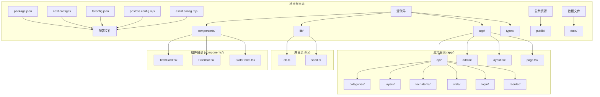
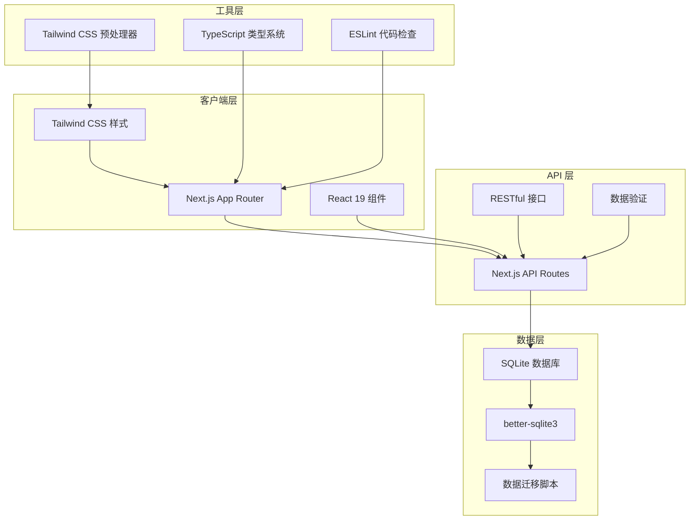
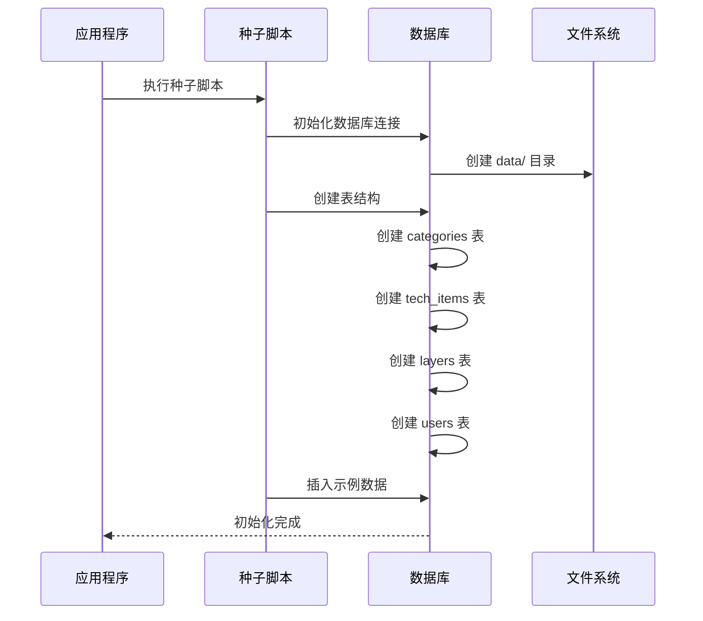
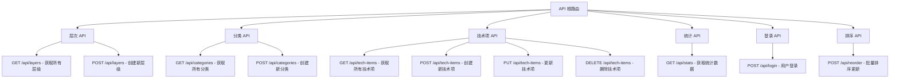
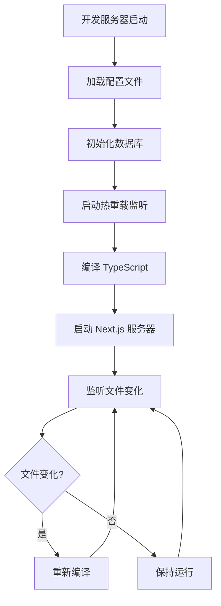
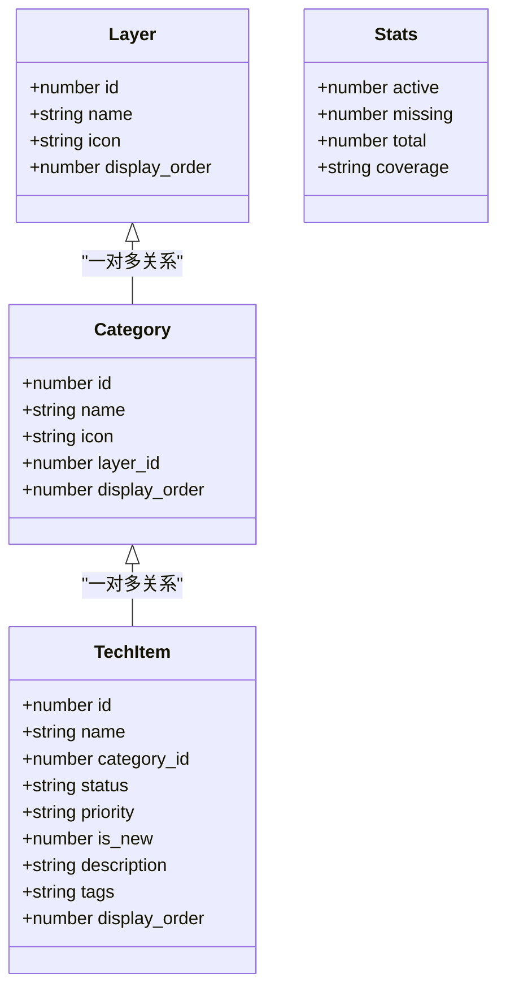
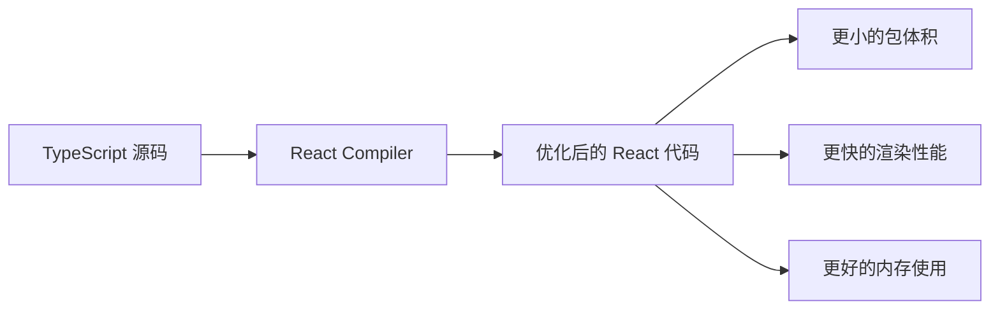
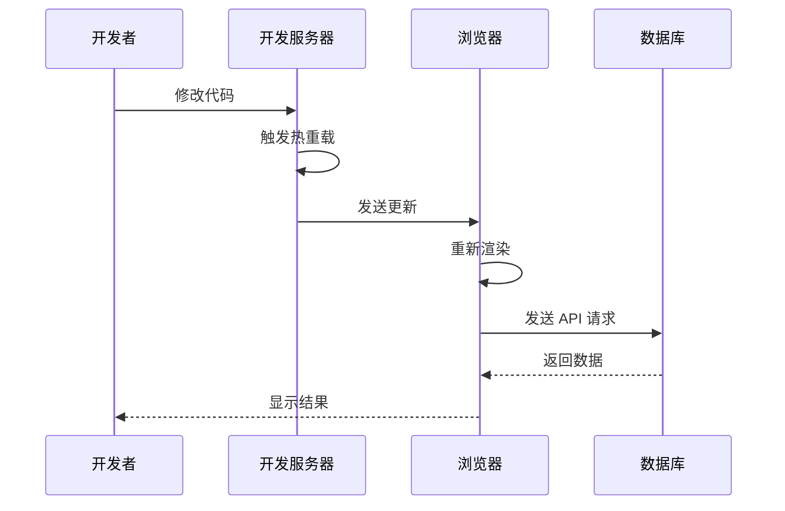

# 开发环境配置

<cite>
**本文档引用的文件**
- [package.json](file://package.json)
- [next.config.ts](file://next.config.ts)
- [tsconfig.json](file://tsconfig.json)
- [README.md](file://README.md)
- [lib/db.ts](file://lib/db.ts)
- [lib/seed.ts](file://lib/seed.ts)
- [postcss.config.mjs](file://postcss.config.mjs)
- [eslint.config.mjs](file://eslint.config.mjs)
- [types/index.ts](file://types/index.ts)
- [next-env.d.ts](file://next-env.d.ts)
</cite>

## 目录
1. [简介](#简介)
2. [项目结构](#项目结构)
3. [核心组件](#核心组件)
4. [架构概览](#架构概览)
5. [详细组件分析](#详细组件分析)
6. [依赖关系分析](#依赖关系分析)
7. [性能考虑](#性能考虑)
8. [故障排除指南](#故障排除指南)
9. [结论](#结论)

## 简介

Lantu Next 是一个基于 Next.js 16 + TypeScript + Tailwind CSS + SQLite 的技术栈管理系统。该项目采用现代化的前端技术栈，提供了完整的 CRUD 功能、REST API 接口和管理后台界面。项目支持热重载开发模式，具备良好的开发体验和生产就绪特性。

## 项目结构

项目采用标准的 Next.js 16 App Router 结构，主要目录包括：



**图表来源**
- [package.json](file://package.json#L1-L43)
- [lib/db.ts](file://lib/db.ts#L1-L312)

**章节来源**
- [package.json](file://package.json#L1-L43)
- [README.md](file://README.md#L20-L43)

## 核心组件

### 包管理器配置

项目明确选择了 pnpm 作为包管理器，这带来了更快的安装速度和更好的磁盘空间利用率：

- **包管理器**: pnpm (通过 `pnpm.onlyBuiltDependencies` 配置)
- **依赖安装**: `pnpm install`
- **开发依赖**: TypeScript 5.x, ESLint 9.x, Tailwind CSS 4.x

### Node.js 版本要求

根据项目配置和依赖要求，推荐使用以下 Node.js 版本：

- **最低版本**: Node.js 18.17.0
- **推荐版本**: Node.js 18.17.0 或更高版本
- **兼容性**: 与 Next.js 16.1.6 和 React 19.2.3 完全兼容

### TypeScript 配置

项目采用严格的 TypeScript 配置，确保类型安全：

- **目标版本**: ES2017
- **模块系统**: ESNext (bundler)
- **严格模式**: 启用
- **路径映射**: `@/*` -> `./`
- **插件支持**: Next.js TypeScript 插件

**章节来源**
- [package.json](file://package.json#L12-L36)
- [tsconfig.json](file://tsconfig.json#L1-L35)
- [README.md](file://README.md#L170-L171)

## 架构概览

项目采用分层架构设计，结合现代前端开发最佳实践：



**图表来源**
- [lib/db.ts](file://lib/db.ts#L1-L312)
- [lib/seed.ts](file://lib/seed.ts#L1-L840)
- [next.config.ts](file://next.config.ts#L1-L10)

## 详细组件分析

### 数据库配置

项目使用 SQLite 作为主要数据存储，通过 better-sqlite3 实现高性能的本地数据库操作：

#### 数据库初始化



**图表来源**
- [lib/db.ts](file://lib/db.ts#L14-L50)
- [lib/seed.ts](file://lib/seed.ts#L10-L16)

#### 数据库表结构

项目包含四个主要数据表：

| 表名 | 字段数量 | 主要用途 |
|------|----------|----------|
| layers | 4个字段 | 存储技术层级信息 |
| categories | 5个字段 | 存储技术分类信息 |
| tech_items | 8个字段 | 存储具体技术项信息 |
| users | 3个字段 | 存储用户认证信息 |

**章节来源**
- [lib/db.ts](file://lib/db.ts#L14-L49)
- [lib/seed.ts](file://lib/seed.ts#L15-L840)

### API 路由配置

项目提供完整的 REST API 接口，支持 CRUD 操作：

#### API 路由结构



**图表来源**
- [lib/db.ts](file://lib/db.ts#L52-L282)
- [README.md](file://README.md#L89-L111)

**章节来源**
- [lib/db.ts](file://lib/db.ts#L52-L282)
- [README.md](file://README.md#L89-L111)

### 开发服务器配置

项目配置了专门的开发服务器设置：

#### 开发服务器参数

- **端口号**: 4701 (通过 `-p 4701` 参数指定)
- **热重载**: 自动启用
- **开发模式**: Next.js 开发服务器
- **调试支持**: 支持 TypeScript 源码映射

#### 构建配置



**图表来源**
- [package.json](file://package.json#L5-L11)
- [next.config.ts](file://next.config.ts#L3-L7)

**章节来源**
- [package.json](file://package.json#L5-L11)
- [next.config.ts](file://next.config.ts#L3-L7)

### TypeScript 类型系统

项目建立了完整的类型定义系统：

#### 核心接口定义



**图表来源**
- [types/index.ts](file://types/index.ts#L1-L34)

**章节来源**
- [types/index.ts](file://types/index.ts#L1-L34)

## 依赖关系分析

### 核心依赖关系

```mermaid
graph TB
subgraph "运行时依赖"
A[react 19.2.3] --> B[Next.js 16.1.6]
C[react-dom 19.2.3] --> B
D[better-sqlite3 12.6.2] --> E[数据库操作]
F[clsx 2.1.1] --> G[样式类名处理]
H[lucide-react 0.563.0] --> I[图标组件]
J[tailwind-merge 3.4.0] --> K[样式合并]
end
subgraph "开发依赖"
L[typescript 5.x] --> M[类型检查]
N[eslint 9.x] --> O[代码质量]
P[tailwindcss 4.x] --> Q[CSS 预处理]
R[tsx 4.x] --> S[TypeScript 运行]
T[babel-plugin-react-compiler] --> U[性能优化]
end
subgraph "UI 组件库"
V[@dnd-kit/core] --> W[拖拽功能]
X[@dnd-kit/sortable] --> W
Y[@dnd-kit/utilities] --> W
end
B --> E
M --> B
O --> B
Q --> B
```

**图表来源**
- [package.json](file://package.json#L12-L36)

### 依赖版本兼容性

项目依赖关系经过精心设计，确保版本兼容性：

- **Next.js 16.1.6**: 与 React 19.2.3 完全兼容
- **TypeScript 5.x**: 提供最新的类型系统特性
- **Tailwind CSS 4.x**: 支持最新的 CSS 功能
- **better-sqlite3**: 为 SQLite 提供高性能绑定

**章节来源**
- [package.json](file://package.json#L12-L36)

## 性能考虑

### 构建优化

项目采用了多项性能优化策略：

#### React Compiler 优化



**图表来源**
- [next.config.ts](file://next.config.ts#L5)

#### 服务器外部包配置

项目将 `better-sqlite3` 标记为服务器外部包，避免在客户端打包：

- **减少客户端包体积**: 避免将二进制依赖打包到浏览器
- **提高构建性能**: 减少不必要的编译步骤
- **降低运行时开销**: 减少客户端 JavaScript 体积

**章节来源**
- [next.config.ts](file://next.config.ts#L6)

### 开发体验优化

#### 热重载机制

- **文件监听**: 自动检测文件变化
- **增量编译**: 只编译受影响的模块
- **快速刷新**: 最小化页面刷新时间
- **错误隔离**: 单个组件错误不影响整体应用

## 故障排除指南

### 常见问题解决

#### 数据库连接问题

**问题症状**: 应用启动时报数据库连接错误

**解决方案**:
1. 确认 `data/` 目录存在且有写权限
2. 检查 `better-sqlite3` 是否正确安装
3. 验证数据库文件权限设置

**章节来源**
- [lib/db.ts](file://lib/db.ts#L5-L11)

#### 端口冲突问题

**问题症状**: 开发服务器无法启动，提示端口被占用

**解决方案**:
1. 修改 `package.json` 中的端口配置
2. 使用 `lsof -i :4701` 查找占用进程
3. 杀死占用进程或选择其他端口

#### TypeScript 类型错误

**问题症状**: 编译时报类型相关错误

**解决方案**:
1. 检查 `tsconfig.json` 配置
2. 确认所有类型定义完整
3. 运行 `tsc --noEmit` 进行类型检查

### 调试技巧

#### 开发服务器调试



**图表来源**
- [package.json](file://package.json#L6)

## 结论

Lantu Next 项目提供了一个完整、现代化的开发环境配置。通过精心设计的配置文件和依赖关系，项目实现了：

- **高效的开发体验**: pnpm 包管理器 + React Compiler + 热重载
- **可靠的类型安全**: TypeScript 严格模式 + 完整的类型定义
- **高性能的数据库操作**: better-sqlite3 + 优化的查询设计
- **现代化的前端架构**: Next.js App Router + Tailwind CSS
- **完善的 API 接口**: RESTful 设计 + 数据验证

项目配置充分考虑了开发效率和生产就绪性，为后续的功能扩展和维护奠定了坚实基础。开发者可以基于此配置快速启动新功能开发，并保持代码质量和性能标准。