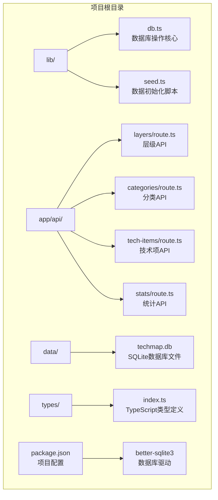
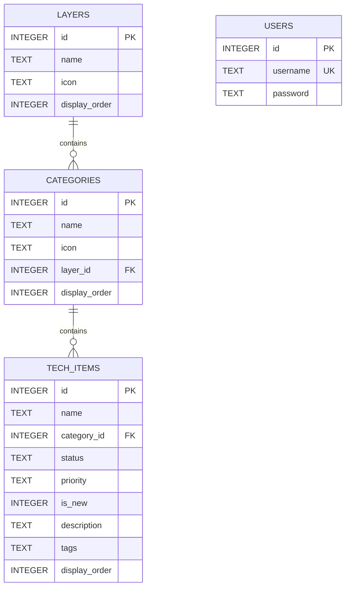
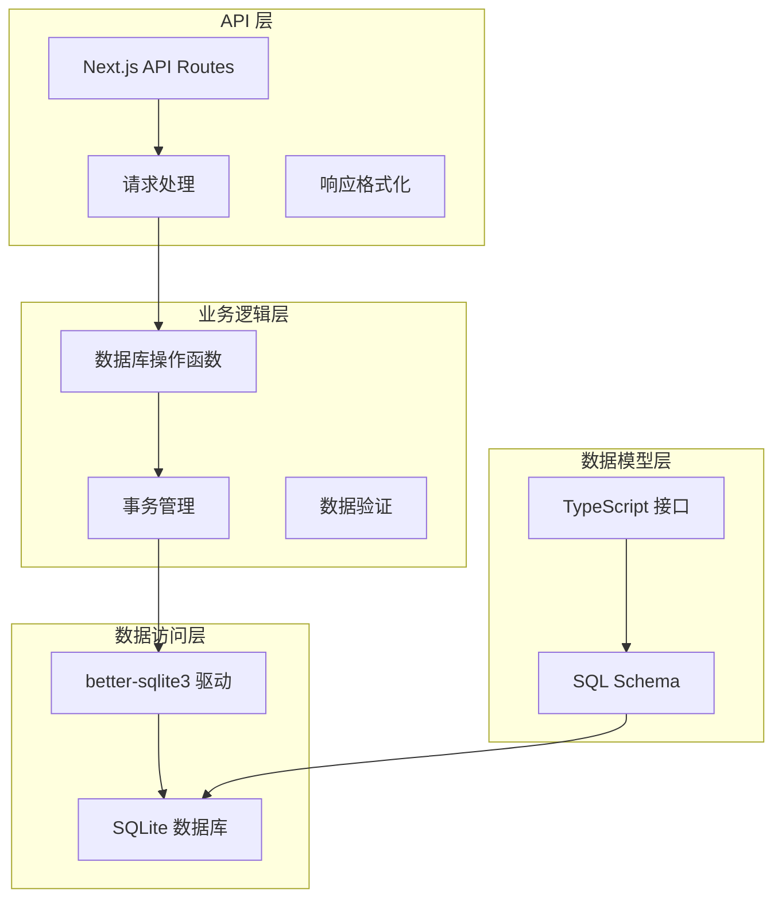
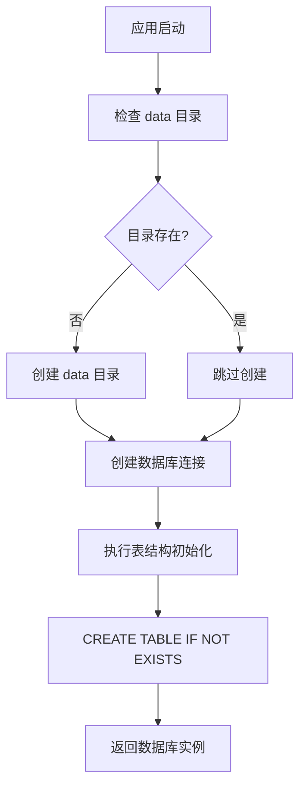
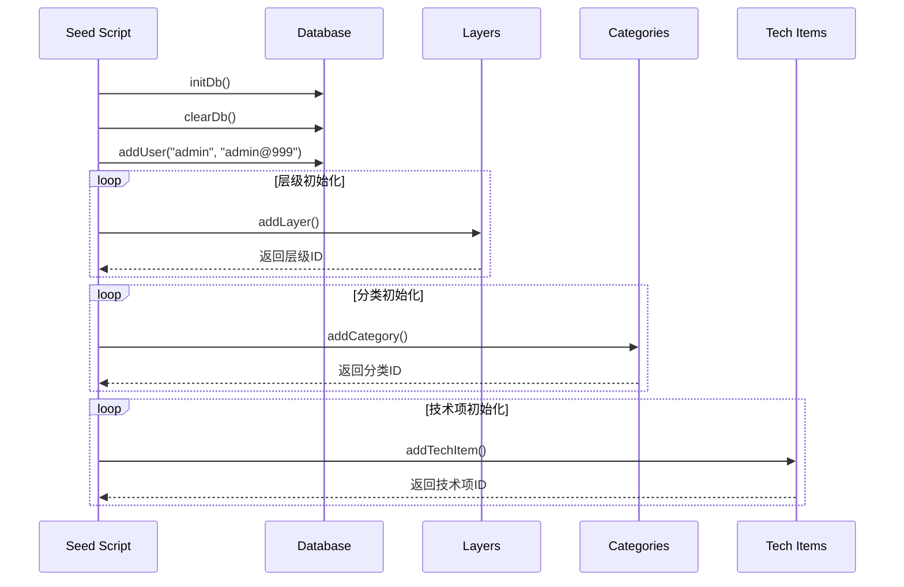
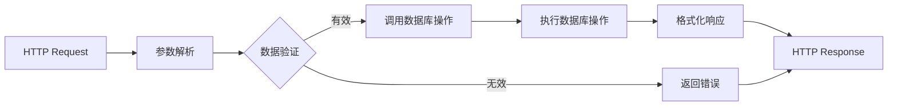
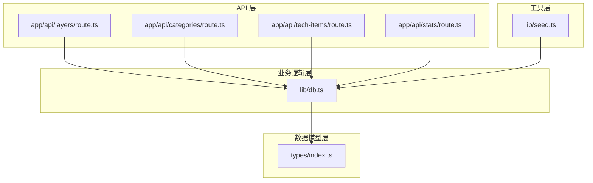

# 数据库集成开发

<cite>
**本文档引用的文件**
- [lib/db.ts](file://lib/db.ts)
- [lib/seed.ts](file://lib/seed.ts)
- [app/api/layers/route.ts](file://app/api/layers/route.ts)
- [app/api/categories/route.ts](file://app/api/categories/route.ts)
- [app/api/tech-items/route.ts](file://app/api/tech-items/route.ts)
- [app/api/stats/route.ts](file://app/api/stats/route.ts)
- [types/index.ts](file://types/index.ts)
- [PROJECT_MIGRATION.md](file://PROJECT_MIGRATION.md)
- [README.md](file://README.md)
- [package.json](file://package.json)
</cite>

## 目录
1. [简介](#简介)
2. [项目结构](#项目结构)
3. [核心组件](#核心组件)
4. [架构概览](#架构概览)
5. [详细组件分析](#详细组件分析)
6. [依赖关系分析](#依赖关系分析)
7. [性能考虑](#性能考虑)
8. [故障排除指南](#故障排除指南)
9. [结论](#结论)

## 简介

Lantu Next 项目是一个基于 Next.js + TypeScript + Tailwind CSS + SQLite 的技术栈管理系统。该项目采用 SQLite 作为数据存储引擎，使用 better-sqlite3 驱动程序进行数据库操作，实现了完整的 CRUD 操作、事务处理和数据初始化功能。

项目的核心目标是提供一个可视化的技术栈管理平台，支持技术项的增删改查、层级管理和统计分析功能。数据库设计采用了三层架构：层级（layers）、分类（categories）和技术项（tech_items），并通过外键关系建立清晰的数据关联。

## 项目结构

Lantu Next 项目的数据库相关文件组织结构如下：



**图表来源**
- [lib/db.ts](file://lib/db.ts#L1-L312)
- [lib/seed.ts](file://lib/seed.ts#L1-L840)
- [app/api/layers/route.ts](file://app/api/layers/route.ts#L1-L48)

**章节来源**
- [README.md](file://README.md#L20-L43)
- [PROJECT_MIGRATION.md](file://PROJECT_MIGRATION.md#L36-L46)

## 核心组件

### 数据库连接管理

项目使用 better-sqlite3 驱动程序创建 SQLite 数据库连接。数据库文件位于 `data/techmap.db`，通过绝对路径进行访问，确保在不同环境下的稳定性。

数据库连接的初始化过程包括：
1. 创建 data 目录（如果不存在）
2. 定义数据库文件路径
3. 建立数据库连接实例

### 数据库 Schema 设计

项目采用三层数据模型设计：



**图表来源**
- [lib/db.ts](file://lib/db.ts#L16-L49)
- [PROJECT_MIGRATION.md](file://PROJECT_MIGRATION.md#L122-L160)

### 类型系统设计

项目使用 TypeScript 定义了完整的数据类型接口：

- **Layer 接口**: 表示技术层级信息
- **Category 接口**: 表示技术分类信息  
- **TechItem 接口**: 表示具体的技术项信息
- **Stats 接口**: 表示统计数据结构

这些类型定义确保了前端和后端之间的数据一致性，并提供了编译时的类型检查。

**章节来源**
- [types/index.ts](file://types/index.ts#L1-L34)
- [lib/db.ts](file://lib/db.ts#L14-L50)

## 架构概览

Lantu Next 项目的数据库架构采用分层设计模式：



**图表来源**
- [app/api/layers/route.ts](file://app/api/layers/route.ts#L1-L48)
- [lib/db.ts](file://lib/db.ts#L1-L312)

### 数据流处理

系统的数据流处理遵循标准的 MVC 模式：

1. **请求接收**: Next.js API Routes 接收 HTTP 请求
2. **参数解析**: 解析请求体中的 JSON 数据
3. **业务处理**: 调用数据库操作函数执行业务逻辑
4. **数据验证**: 验证输入数据的有效性
5. **数据库操作**: 使用 better-sqlite3 执行 SQL 语句
6. **结果返回**: 格式化响应数据并返回给客户端

**章节来源**
- [app/api/tech-items/route.ts](file://app/api/tech-items/route.ts#L1-L50)
- [app/api/categories/route.ts](file://app/api/categories/route.ts#L1-L48)

## 详细组件分析

### 数据库操作模块 (lib/db.ts)

数据库操作模块是整个项目的核心，提供了完整的 CRUD 操作和数据库管理功能。

#### 初始化与连接管理

数据库初始化过程包括表结构创建和目录管理：



**图表来源**
- [lib/db.ts](file://lib/db.ts#L5-L50)

#### CRUD 操作实现

每个实体都实现了标准的 CRUD 操作：

**层级管理操作**:
- `getLayers()`: 获取所有层级，按显示顺序排序
- `addLayer()`: 添加新层级
- `updateLayer()`: 更新现有层级
- `deleteLayer()`: 删除层级

**分类管理操作**:
- `getCategories()`: 获取所有分类，按层级和显示顺序排序
- `addCategory()`: 添加新分类
- `updateCategory()`: 更新现有分类
- `deleteCategory()`: 删除分类

**技术项管理操作**:
- `getTechItems()`: 获取所有技术项，按分类和显示顺序排序
- `addTechItem()`: 添加新技术项
- `updateTechItem()`: 动态更新技术项字段
- `deleteTechItem()`: 删除技术项

**章节来源**
- [lib/db.ts](file://lib/db.ts#L52-L312)

#### 事务处理机制

项目实现了多种事务处理模式：

**批量更新事务**:
- `updateLayerOrder()`: 批量更新层级顺序
- `updateCategoryOrder()`: 批量更新分类顺序  
- `updateTechItemOrder()`: 批量更新技术项顺序

这些函数使用 `db.transaction()` 包装多个更新操作，确保数据的一致性和原子性。

**清空数据库事务**:
- `clearDb()`: 清空所有数据表并重置自增序列

**章节来源**
- [lib/db.ts](file://lib/db.ts#L241-L294)

### 数据初始化模块 (lib/seed.ts)

数据初始化模块负责创建数据库结构和填充示例数据：



**图表来源**
- [lib/seed.ts](file://lib/seed.ts#L1-L840)

#### 种子数据管理

种子数据包含了完整的示例数据集：

**层级数据**: 5个主要技术领域
**分类数据**: 20+个技术分类
**技术项数据**: 800+个具体技术条目

所有数据都包含状态标记（active/missing）、优先级、新特性标识等属性。

**章节来源**
- [lib/seed.ts](file://lib/seed.ts#L15-L840)

### API 路由层

每个 API 路由都遵循统一的模式：



**图表来源**
- [app/api/layers/route.ts](file://app/api/layers/route.ts#L1-L48)

#### 错误处理机制

API 路由实现了统一的错误处理模式：

- **参数验证**: 检查必需参数的存在性
- **数据库操作**: 捕获并处理数据库异常
- **响应格式**: 统一的 JSON 响应格式
- **状态码**: 根据错误类型返回适当的 HTTP 状态码

**章节来源**
- [app/api/tech-items/route.ts](file://app/api/tech-items/route.ts#L1-L50)
- [app/api/stats/route.ts](file://app/api/stats/route.ts#L1-L15)

## 依赖关系分析

### 外部依赖

项目的主要外部依赖包括：

```mermaid
graph TB
subgraph "核心依赖"
A[better-sqlite3<br/>SQLite 驱动]
B[next<br/>Next.js 框架]
C[react<br/>React 框架]
D[tailwindcss<br/>CSS 框架]
end
subgraph "开发依赖"
E[typescript<br/>类型系统]
F[tsx<br/>TypeScript 运行器]
G[@types/*<br/>类型定义]
end
subgraph "UI 依赖"
H[@dnd-kit<br/>拖拽功能]
I[lucide-react<br/>图标库]
end
A --> J[SQLite 数据库]
B --> K[API 路由]
C --> L[前端组件]
D --> M[样式系统]
```

**图表来源**
- [package.json](file://package.json#L12-L42)

### 内部模块依赖



**图表来源**
- [app/api/layers/route.ts](file://app/api/layers/route.ts#L1-L48)
- [lib/db.ts](file://lib/db.ts#L1-L312)
- [types/index.ts](file://types/index.ts#L1-L34)

**章节来源**
- [package.json](file://package.json#L12-L42)

## 性能考虑

### SQLite 性能优化

由于项目使用 SQLite 作为数据存储，需要考虑以下性能因素：

**索引设计建议**:
- 在经常查询的字段上建立索引
- 考虑复合索引以优化复杂查询
- 监控查询执行计划

**连接池管理**:
- better-sqlite3 是同步驱动，不支持连接池
- 建议使用单连接模式
- 避免长时间持有连接

**查询优化**:
- 使用预编译语句减少解析开销
- 避免 SELECT *
- 合理使用 LIMIT 和 OFFSET

### 并发处理

SQLite 的并发限制：
- 不支持多写入并发
- 适合单机应用和小规模并发
- 对于高并发场景建议迁移到 PostgreSQL

**章节来源**
- [PROJECT_MIGRATION.md](file://PROJECT_MIGRATION.md#L190-L195)

## 故障排除指南

### 常见问题诊断

**数据库连接问题**:
- 检查 data 目录权限
- 验证数据库文件存在性
- 确认 better-sqlite3 驱动安装

**数据初始化失败**:
- 删除现有的 techmap.db 文件
- 重新运行 npm run seed
- 检查数据库表结构

**API 调用错误**:
- 验证请求参数格式
- 检查数据库连接状态
- 查看服务器日志

### 数据库维护

**数据备份**:
- 定期备份 data/techmap.db 文件
- 在修改数据库结构前创建备份

**性能监控**:
- 监控数据库文件大小
- 检查查询响应时间
- 监控内存使用情况

**章节来源**
- [PROJECT_MIGRATION.md](file://PROJECT_MIGRATION.md#L116-L121)

## 结论

Lantu Next 项目展示了如何在 Next.js 应用中有效集成 SQLite 数据库。通过 better-sqlite3 驱动程序，项目实现了完整的 CRUD 操作、事务处理和数据初始化功能。

项目的主要优势包括：
- 简化的部署架构（单文件数据库）
- 良好的开发体验（TypeScript 类型安全）
- 完整的功能实现（管理后台、API 接口、统计数据）

对于生产环境部署，建议考虑以下改进：
- 对于高并发场景迁移到 PostgreSQL
- 实现数据库连接池管理
- 添加数据备份和恢复机制
- 增强错误处理和监控功能

该数据库集成方案为类似的技术栈管理应用提供了良好的参考模板。