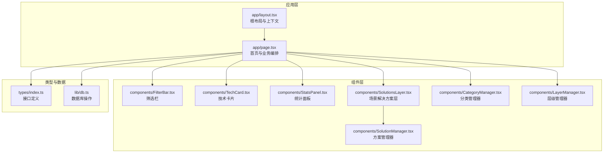
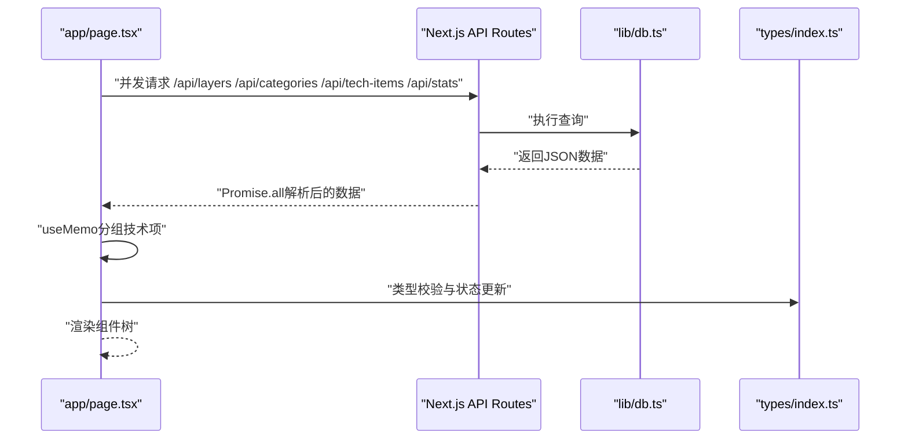
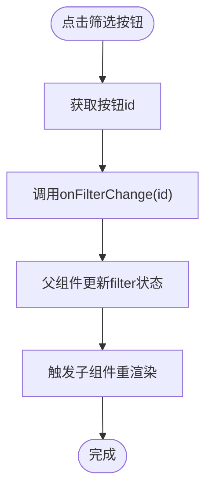
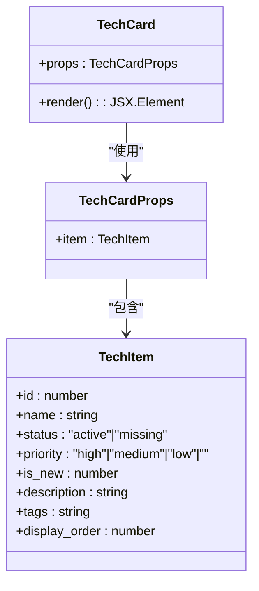
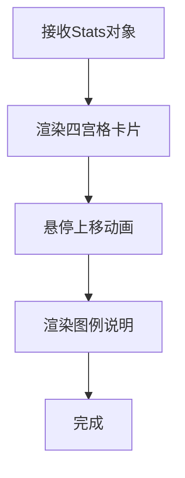
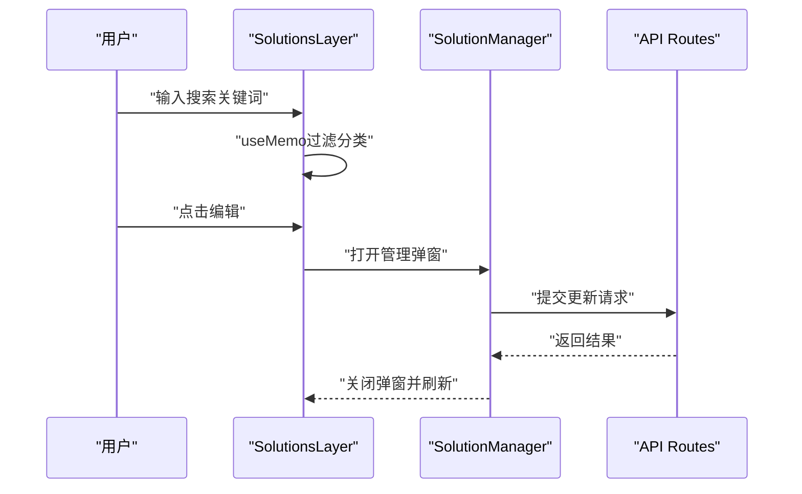
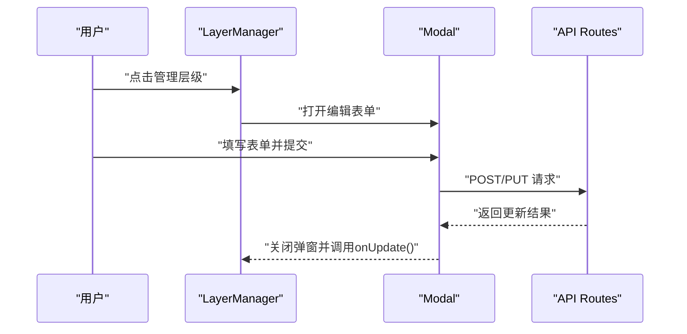
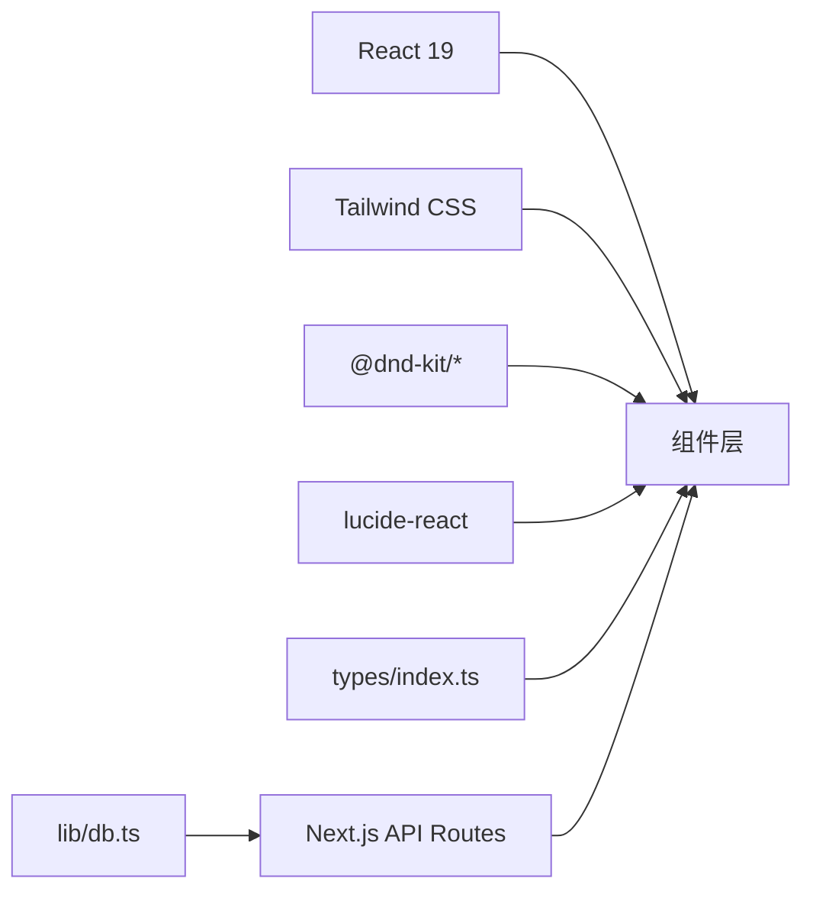

# 组件开发指南

<cite>
**本文档引用的文件**
- [README.md](file://README.md)
- [package.json](file://package.json)
- [next.config.ts](file://next.config.ts)
- [tsconfig.json](file://tsconfig.json)
- [app/layout.tsx](file://app/layout.tsx)
- [app/page.tsx](file://app/page.tsx)
- [components/FilterBar.tsx](file://components/FilterBar.tsx)
- [components/TechCard.tsx](file://components/TechCard.tsx)
- [components/StatsPanel.tsx](file://components/StatsPanel.tsx)
- [components/SolutionsLayer.tsx](file://components/SolutionsLayer.tsx)
- [components/SolutionManager.tsx](file://components/SolutionManager.tsx)
- [components/CategoryManager.tsx](file://components/CategoryManager.tsx)
- [components/LayerManager.tsx](file://components/LayerManager.tsx)
- [types/index.ts](file://types/index.ts)
- [lib/db.ts](file://lib/db.ts)
</cite>

## 目录
1. [简介](#简介)
2. [项目结构](#项目结构)
3. [核心组件](#核心组件)
4. [架构概览](#架构概览)
5. [详细组件分析](#详细组件分析)
6. [依赖分析](#依赖分析)
7. [性能考虑](#性能考虑)
8. [故障排除指南](#故障排除指南)
9. [结论](#结论)
10. [附录](#附录)

## 简介
本指南面向Lantu Next项目的组件开发者，系统阐述React组件设计模式、Props接口定义与状态管理策略，提供可复用组件开发流程、组件组合模式与生命周期管理方法。同时涵盖UI组件最佳实践、动画效果实现、交互设计规范、组件测试策略、Storybook使用与组件文档编写、性能优化、懒加载与内存管理，以及IconPicker等具体组件的开发示例与扩展思路。

## 项目结构
Lantu Next采用Next.js 15 App Router架构，前端使用React 19、TypeScript与Tailwind CSS，后端通过Next.js API Routes提供REST接口，SQLite作为数据存储。项目采用按功能模块划分的组件组织方式，类型定义集中于types目录，工具库位于lib目录，页面逻辑集中在app目录。

**图表来源**
- [app/layout.tsx](file://app/layout.tsx#L1-L36)
- [app/page.tsx](file://app/page.tsx#L1-L238)
- [components/FilterBar.tsx](file://components/FilterBar.tsx#L1-L52)
- [components/TechCard.tsx](file://components/TechCard.tsx#L1-L37)
- [components/StatsPanel.tsx](file://components/StatsPanel.tsx#L1-L84)
- [components/SolutionsLayer.tsx](file://components/SolutionsLayer.tsx#L1-L137)
- [components/SolutionManager.tsx](file://components/SolutionManager.tsx#L1-L73)
- [components/CategoryManager.tsx](file://components/CategoryManager.tsx#L134-L172)
- [components/LayerManager.tsx](file://components/LayerManager.tsx#L138-L178)
- [types/index.ts](file://types/index.ts#L1-L34)
- [lib/db.ts](file://lib/db.ts#L1-L312)

**章节来源**
- [README.md](file://README.md#L20-L43)
- [package.json](file://package.json#L1-L43)
- [next.config.ts](file://next.config.ts#L1-L10)
- [tsconfig.json](file://tsconfig.json#L1-L35)

## 核心组件
本节聚焦三个基础且高频使用的组件：筛选栏、技术卡片与统计面板，它们共同构成页面的核心交互与信息展示。

- 筛选栏组件
  - 设计目标：提供多维度快速筛选能力，支持状态与标签两类过滤。
  - Props接口：包含当前筛选值与变更回调，便于父组件统一管理状态。
  - 交互特性：动态样式根据选中状态切换，支持键盘与鼠标交互。
  - 代码路径参考：[components/FilterBar.tsx](file://components/FilterBar.tsx#L1-L52)

- 技术卡片组件
  - 设计目标：以视觉化方式呈现技术项的状态、优先级与新增标记。
  - Props接口：接收单个技术项对象，内部基于字段计算样式与提示信息。
  - 视觉反馈：悬停缩放、阴影增强与渐变边框，体现层级与优先级。
  - 代码路径参考：[components/TechCard.tsx](file://components/TechCard.tsx#L1-L37)

- 统计面板组件
  - 设计目标：以卡片网格形式展示已有、缺失、总数与覆盖率等关键指标。
  - Props接口：接收统计对象，包含数值与百分比字符串。
  - 交互特性：卡片悬停轻微上移，增强可点击感；底部图例说明颜色语义。
  - 代码路径参考：[components/StatsPanel.tsx](file://components/StatsPanel.tsx#L1-L84)

**章节来源**
- [components/FilterBar.tsx](file://components/FilterBar.tsx#L1-L52)
- [components/TechCard.tsx](file://components/TechCard.tsx#L1-L37)
- [components/StatsPanel.tsx](file://components/StatsPanel.tsx#L1-L84)
- [types/index.ts](file://types/index.ts#L16-L26)

## 架构概览
Lantu Next采用“页面驱动的数据流”架构：页面组件负责拉取数据、缓存与分组，子组件仅关注展示与受控交互。数据库操作封装在lib/db.ts中，API路由提供数据访问入口。

**图表来源**
- [app/page.tsx](file://app/page.tsx#L39-L68)
- [lib/db.ts](file://lib/db.ts#L52-L239)
- [types/index.ts](file://types/index.ts#L1-L34)

**章节来源**
- [app/page.tsx](file://app/page.tsx#L39-L68)
- [lib/db.ts](file://lib/db.ts#L52-L239)

## 详细组件分析

### 筛选栏组件（FilterBar）
- 设计模式
  - 受控组件：父组件通过props传递当前筛选值与回调，保证状态单一来源。
  - 列表渲染：按钮数组通过map生成，便于扩展更多筛选维度。
- Props接口
  - filter: 当前筛选键值
  - onFilterChange: 回调函数，接收新筛选值
- 生命周期与状态
  - 无本地状态，完全由父组件控制，降低耦合。
- 交互与样式
  - 选中态使用渐变背景与阴影，未选中态使用半透明与悬停过渡。
- 扩展建议
  - 支持多选：引入集合类型与组合筛选逻辑。
  - 搜索联动：结合搜索输入与筛选按钮，实现更细粒度过滤。

**图表来源**
- [components/FilterBar.tsx](file://components/FilterBar.tsx#L30-L45)
- [app/page.tsx](file://app/page.tsx#L74-L84)

**章节来源**
- [components/FilterBar.tsx](file://components/FilterBar.tsx#L1-L52)
- [app/page.tsx](file://app/page.tsx#L74-L84)

### 技术卡片组件（TechCard）
- 设计模式
  - 展示型组件：接收数据并渲染，不直接发起网络请求。
  - 条件渲染：根据状态与新增标记决定徽章显示。
- Props接口
  - item: TechItem对象，包含名称、状态、优先级、描述等字段。
- 视觉与交互
  - 状态色板：激活与缺失使用不同渐变与边框色。
  - 优先级指示：通过左侧加粗边框颜色区分P0/P1/P2。
  - 提示气泡：悬停显示完整信息，使用绝对定位与透明度过渡。
- 性能注意
  - 尽量避免在渲染期间进行昂贵计算，必要时使用memo或useMemo。

**图表来源**
- [components/TechCard.tsx](file://components/TechCard.tsx#L3-L5)
- [types/index.ts](file://types/index.ts#L16-L26)

**章节来源**
- [components/TechCard.tsx](file://components/TechCard.tsx#L1-L37)
- [types/index.ts](file://types/index.ts#L16-L26)

### 统计面板组件（StatsPanel）
- 设计模式
  - 卡片网格：响应式布局，支持小屏堆叠与大屏并排。
  - 图标+数值+描述：信息密度高，便于快速浏览。
- Props接口
  - stats: Stats对象，包含激活数、缺失数、总数与覆盖率。
- 交互特性
  - 卡片悬停轻微上移，增强可交互感。
  - 底部图例说明颜色含义，辅助理解数据。
- 可复用性
  - 通过Props传入数据，可在其他页面复用。

**图表来源**
- [components/StatsPanel.tsx](file://components/StatsPanel.tsx#L7-L54)
- [types/index.ts](file://types/index.ts#L28-L33)

**章节来源**
- [components/StatsPanel.tsx](file://components/StatsPanel.tsx#L1-L84)
- [types/index.ts](file://types/index.ts#L28-L33)

### 场景解决方案层（SolutionsLayer）
- 设计目标
  - 为“场景解决方案”层级提供专用展示与管理界面，支持搜索与编辑。
- 关键特性
  - 分类搜索：输入框实时过滤分类列表。
  - 管理入口：管理员可见编辑按钮，弹窗管理分类与技术项。
- 代码要点
  - 使用useMemo对分类进行搜索过滤，避免重复计算。
  - 通过useAuth判断管理员权限，控制编辑按钮显示。

**图表来源**
- [components/SolutionsLayer.tsx](file://components/SolutionsLayer.tsx#L57-L116)
- [components/SolutionManager.tsx](file://components/SolutionManager.tsx#L71-L73)

**章节来源**
- [components/SolutionsLayer.tsx](file://components/SolutionsLayer.tsx#L1-L137)
- [components/SolutionManager.tsx](file://components/SolutionManager.tsx#L1-L73)

### 管理器组件（LayerManager/CategoryManager）
- 设计目标
  - 提供层级与分类的增删改查界面，支持拖拽排序与批量更新。
- 关键特性
  - 表单驱动：编辑模式下渲染输入表单，保存后关闭弹窗并触发刷新。
  - 批量更新：通过lib/db.ts提供的事务接口更新排序。
- 代码要点
  - 使用Modal组件承载表单，统一标题与尺寸。
  - 提交成功后调用父组件的刷新回调，保持数据一致性。

**图表来源**
- [components/LayerManager.tsx](file://components/LayerManager.tsx#L138-L178)
- [components/CategoryManager.tsx](file://components/CategoryManager.tsx#L134-L172)

**章节来源**
- [components/LayerManager.tsx](file://components/LayerManager.tsx#L138-L178)
- [components/CategoryManager.tsx](file://components/CategoryManager.tsx#L134-L172)

## 依赖分析
- 外部依赖
  - React生态：@dnd-kit用于拖拽排序，lucide-react提供图标。
  - 样式：Tailwind CSS与clsx/tailwind-merge组合实现条件样式。
  - 数据库：better-sqlite3与SQLite配合使用。
- 内部依赖
  - 类型系统：types/index.ts集中定义接口，确保组件与API一致。
  - 数据访问：lib/db.ts封装SQL操作，提供事务与批量更新。
  - 页面编排：app/page.tsx协调多个组件与数据流。

**图表来源**
- [package.json](file://package.json#L12-L24)
- [types/index.ts](file://types/index.ts#L1-L34)
- [lib/db.ts](file://lib/db.ts#L1-L312)

**章节来源**
- [package.json](file://package.json#L12-L24)
- [lib/db.ts](file://lib/db.ts#L1-L312)

## 性能考虑
- 渲染优化
  - 使用useMemo对昂贵计算进行缓存，如技术项按分类分组。
  - 避免在渲染期间创建新引用，减少子组件重渲染。
- 网络与数据
  - 并发请求多个API端点，使用Promise.all提升首屏速度。
  - 在客户端禁用缓存以保证数据实时性。
- 样式与动画
  - 使用CSS过渡与变换实现轻量动画，避免JavaScript动画带来的卡顿。
  - 控制动画复杂度，仅在交互时启用。
- 懒加载与内存
  - 对非关键路径组件采用动态导入，延迟加载重型模块。
  - 在组件卸载时清理定时器与事件监听，避免内存泄漏。

**章节来源**
- [app/page.tsx](file://app/page.tsx#L26-L34)
- [app/page.tsx](file://app/page.tsx#L39-L68)

## 故障排除指南
- 数据不更新
  - 确认父组件已正确调用刷新回调，触发状态更新。
  - 检查API响应格式与类型定义是否一致。
- 筛选无效
  - 核对筛选键值与标签匹配逻辑，确保大小写与空格处理一致。
- 图标显示异常
  - 检查图标名称是否存在于lucide-react中，或回退到文本显示。
- 拖拽排序失败
  - 确认事务接口调用成功，检查批量更新的参数顺序。

**章节来源**
- [app/page.tsx](file://app/page.tsx#L70-L72)
- [components/SolutionsLayer.tsx](file://components/SolutionsLayer.tsx#L94-L99)
- [lib/db.ts](file://lib/db.ts#L242-L282)

## 结论
Lantu Next的组件体系以清晰的职责分离与类型安全为核心，通过受控组件与受控状态实现高内聚低耦合。建议在后续开发中继续强化类型约束、引入单元测试与Storybook文档，完善动画与交互细节，并持续优化数据流与渲染性能。

## 附录

### 组件开发最佳实践清单
- Props设计
  - 明确必填与可选字段，提供合理默认值。
  - 使用类型系统约束枚举值与联合类型。
- 状态管理
  - 将状态上移至最近公共祖先，避免重复状态。
  - 使用useMemo/useCallback缓存昂贵计算与回调。
- 交互与动画
  - 优先使用CSS过渡与变换，保持帧率稳定。
  - 为关键交互提供明确的视觉反馈。
- 可访问性
  - 为按钮与表单元素提供语义化标签与键盘导航支持。
- 文档与测试
  - 为每个组件编写简要说明与Props文档。
  - 使用Storybook演示不同状态与变体。
  - 编写单元测试验证核心逻辑与边界条件。

### Storybook使用建议
- 为每个组件创建stories文件，覆盖默认、禁用、错误等状态。
- 使用controls与actions增强交互体验。
- 通过addon-docs生成组件文档，包含Props、Events与Slots说明。

### 组件测试策略
- 单元测试：针对纯函数与Hook逻辑，使用React Testing Library。
- 集成测试：模拟API响应，验证组件渲染与交互。
- 端到端测试：使用Cypress或Playwright覆盖关键用户流程。

### IconPicker组件开发示例与扩展
- 设计目标
  - 提供图标选择器，支持搜索与分类浏览。
- Props接口
  - value: 当前选中图标名
  - onChange: 回调函数，接收新图标名
  - icons: 图标集合（可从lucide-react导出）
- 实现要点
  - 搜索过滤：基于名称与关键词进行模糊匹配。
  - 分类浏览：按功能域分组，支持折叠展开。
  - 预览与确认：点击预览图标，确认后触发onChange。
- 扩展方向
  - 支持自定义图标上传与本地缓存。
  - 增加收藏夹与最近使用记录。
  - 集成图标字体与SVG Sprite以优化加载。