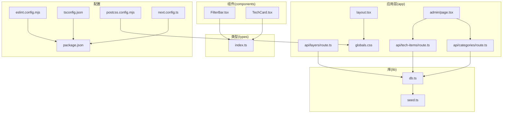
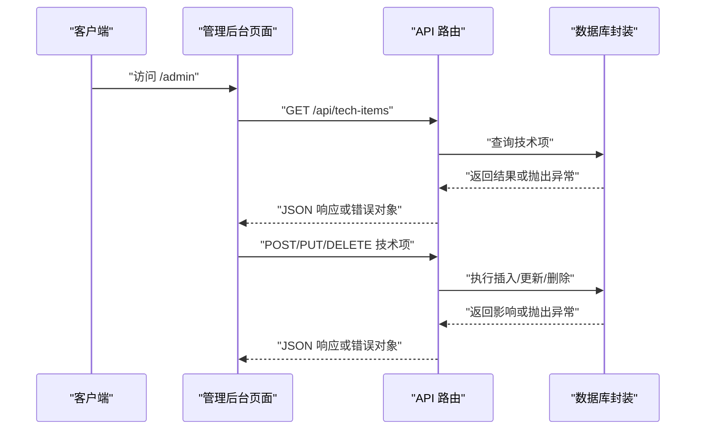
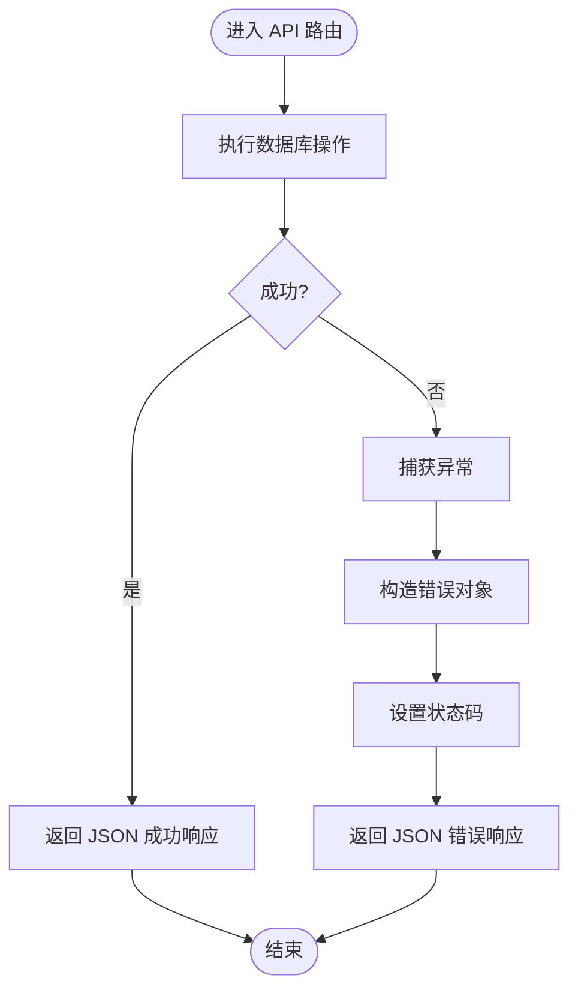
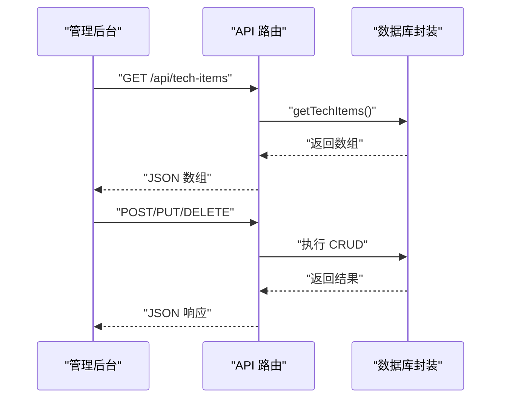
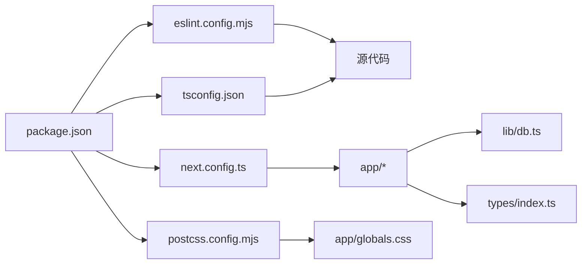

# 编码规范与工具

<cite>
**本文引用的文件**
- [eslint.config.mjs](file://eslint.config.mjs)
- [package.json](file://package.json)
- [tsconfig.json](file://tsconfig.json)
- [postcss.config.mjs](file://postcss.config.mjs)
- [next.config.ts](file://next.config.ts)
- [types/index.ts](file://types/index.ts)
- [components/TechCard.tsx](file://components/TechCard.tsx)
- [components/FilterBar.tsx](file://components/FilterBar.tsx)
- [app/layout.tsx](file://app/layout.tsx)
- [app/globals.css](file://app/globals.css)
- [lib/db.ts](file://lib/db.ts)
- [lib/seed.ts](file://lib/seed.ts)
- [app/admin/page.tsx](file://app/admin/page.tsx)
- [app/api/layers/route.ts](file://app/api/layers/route.ts)
- [app/api/categories/route.ts](file://app/api/categories/route.ts)
- [app/api/tech-items/route.ts](file://app/api/tech-items/route.ts)
- [README.md](file://README.md)
</cite>

## 目录
1. [简介](#简介)
2. [项目结构](#项目结构)
3. [核心组件](#核心组件)
4. [架构总览](#架构总览)
5. [详细组件分析](#详细组件分析)
6. [依赖关系分析](#依赖关系分析)
7. [性能考虑](#性能考虑)
8. [故障排查指南](#故障排查指南)
9. [结论](#结论)
10. [附录](#附录)

## 简介
本指南面向 Lantu Next 项目，提供统一的编码规范与开发工具使用方法，涵盖 ESLint 规则、代码格式化、Git 提交规范、Tailwind CSS 样式与类命名约定、响应式设计原则、TypeScript 类型定义最佳实践、接口设计规范、错误处理模式、代码审查清单、性能优化准则、安全编码要求、自动化工具与 CI/CD 流程以及代码质量监控建议。内容基于仓库现有配置与实现进行提炼与扩展，帮助团队达成一致的开发体验与质量标准。

## 项目结构
Lantu Next 采用 Next.js App Router 结构，核心目录与职责如下：
- app：页面与 API 路由，包含布局、页面与 API 路由
- components：通用 React 组件
- lib：业务库与数据库封装
- types：全局 TypeScript 类型定义
- data：SQLite 数据库文件
- 根目录配置：ESLint、TypeScript、PostCSS、Next 配置与包管理

图表来源
- [app/layout.tsx](file://app/layout.tsx#L1-L36)
- [app/admin/page.tsx](file://app/admin/page.tsx#L1-L311)
- [app/api/layers/route.ts](file://app/api/layers/route.ts#L1-L48)
- [app/api/categories/route.ts](file://app/api/categories/route.ts#L1-L48)
- [app/api/tech-items/route.ts](file://app/api/tech-items/route.ts#L1-L50)
- [app/globals.css](file://app/globals.css#L1-L72)
- [components/TechCard.tsx](file://components/TechCard.tsx#L1-L37)
- [components/FilterBar.tsx](file://components/FilterBar.tsx#L1-L52)
- [lib/db.ts](file://lib/db.ts#L1-L312)
- [lib/seed.ts](file://lib/seed.ts#L1-L840)
- [types/index.ts](file://types/index.ts#L1-L34)
- [eslint.config.mjs](file://eslint.config.mjs#L1-L19)
- [tsconfig.json](file://tsconfig.json#L1-L35)
- [postcss.config.mjs](file://postcss.config.mjs#L1-L8)
- [next.config.ts](file://next.config.ts#L1-L10)
- [package.json](file://package.json#L1-L43)

章节来源
- [README.md](file://README.md#L20-L43)

## 核心组件
- ESLint 配置：基于 eslint-config-next 的 Core Web Vitals 与 TypeScript 规则，自定义忽略项覆盖默认行为
- TypeScript 配置：严格模式、ESNext 模块解析、路径别名 @/*、增量编译
- PostCSS/Tailwind：使用 @tailwindcss/postcss 插件，全局样式通过 app/globals.css 引入
- Next 配置：启用 reactCompiler，外部依赖 better-sqlite3
- 数据库：better-sqlite3 封装，事务与批量更新，统计查询
- API 路由：统一错误处理返回 JSON 错误响应与状态码
- 组件：TechCard 与 FilterBar 使用 Tailwind 类名与条件样式组合

章节来源
- [eslint.config.mjs](file://eslint.config.mjs#L1-L19)
- [tsconfig.json](file://tsconfig.json#L1-L35)
- [postcss.config.mjs](file://postcss.config.mjs#L1-L8)
- [next.config.ts](file://next.config.ts#L1-L10)
- [lib/db.ts](file://lib/db.ts#L1-L312)
- [app/api/layers/route.ts](file://app/api/layers/route.ts#L1-L48)
- [app/api/categories/route.ts](file://app/api/categories/route.ts#L1-L48)
- [app/api/tech-items/route.ts](file://app/api/tech-items/route.ts#L1-L50)
- [components/TechCard.tsx](file://components/TechCard.tsx#L1-L37)
- [components/FilterBar.tsx](file://components/FilterBar.tsx#L1-L52)

## 架构总览
下图展示从客户端到 API 路由再到数据库的请求流程，体现错误处理与数据返回模式。

图表来源
- [app/admin/page.tsx](file://app/admin/page.tsx#L23-L39)
- [app/api/tech-items/route.ts](file://app/api/tech-items/route.ts#L7-L14)
- [app/api/tech-items/route.ts](file://app/api/tech-items/route.ts#L16-L24)
- [app/api/tech-items/route.ts](file://app/api/tech-items/route.ts#L26-L35)
- [app/api/tech-items/route.ts](file://app/api/tech-items/route.ts#L37-L49)
- [lib/db.ts](file://lib/db.ts#L108-L114)
- [lib/db.ts](file://lib/db.ts#L138-L162)
- [lib/db.ts](file://lib/db.ts#L165-L211)
- [lib/db.ts](file://lib/db.ts#L214-L217)

## 详细组件分析

### ESLint 规则与 Git 提交规范
- 规则来源：使用 eslint-config-next 的 Core Web Vitals 与 TypeScript 规则，确保现代 Web 性能指标与类型安全
- 自定义忽略：覆盖默认忽略项，排除 .next、out、build、next-env.d.ts 等目录
- 建议的 Git 提交规范（扩展建议）
  - 类型：feat、fix、docs、style、refactor、perf、test、build、ci、chore、revert
  - 格式：type(scope): subject
  - 示例：feat(api): 添加技术项排序接口
  - 配套工具：husky + lint-staged + commitlint 实现提交前校验

章节来源
- [eslint.config.mjs](file://eslint.config.mjs#L1-L19)

### 代码格式化与编辑器设置
- 推荐使用 Prettier 与 ESLint 协同，VS Code 插件：ESLint、Prettier
- 在编辑器中启用“保存时格式化”，避免手动格式化差异
- 与 ESLint 配置保持一致，确保规则统一

[本节为通用实践说明，不直接分析具体文件]

### Tailwind CSS 样式编写规范与类命名约定
- 原子类优先：使用 Tailwind 原子类组合，减少自定义 CSS
- 命名约定：语义化类名，如“状态类”“尺寸类”“颜色类”“间距类”“交互类”
- 条件样式：根据数据动态拼接类名，避免硬编码
- 响应式设计：使用断点前缀（sm、md、lg、xl、2xl），按需开启
- 全局样式：通过 app/globals.css 引入 Tailwind 并定义主题变量与滚动条样式
- 字体与排版：通过 Next Font 注入变量，统一字体族

章节来源
- [app/globals.css](file://app/globals.css#L1-L72)
- [app/layout.tsx](file://app/layout.tsx#L6-L14)
- [components/TechCard.tsx](file://components/TechCard.tsx#L13-L19)
- [components/FilterBar.tsx](file://components/FilterBar.tsx#L20-L41)

### 响应式设计原则
- 移动优先：先写移动端样式，再用断点扩展
- 网格与间距：使用 flex/grid 与 gap、space、divide 控制布局
- 视口适配：利用 Next.js App Router 的根布局与字体变量
- 交互反馈：hover、focus、active 状态使用过渡动画提升体验

章节来源
- [app/layout.tsx](file://app/layout.tsx#L21-L35)
- [components/FilterBar.tsx](file://components/FilterBar.tsx#L22-L48)

### TypeScript 类型定义最佳实践
- 接口设计：字段明确、可选字段与联合类型结合，避免 any
- 枚举与字面量：使用字面量联合类型表达有限取值
- 类型复用：在 types/index.ts 统一导出，组件与 API 路由共享
- 严格模式：tsconfig.json 启用 strict、noImplicitAny、strictNullChecks

章节来源
- [types/index.ts](file://types/index.ts#L1-L34)
- [tsconfig.json](file://tsconfig.json#L7-L10)

### 错误处理模式
- API 路由：try/catch 包裹，捕获异常后返回 JSON 错误与状态码
- 客户端：fetch 请求统一处理，错误时弹窗提示或记录日志
- 数据库：事务包裹批量更新，保证一致性；查询异常统一转换为错误响应

图表来源
- [app/api/layers/route.ts](file://app/api/layers/route.ts#L6-L13)
- [app/api/layers/route.ts](file://app/api/layers/route.ts#L15-L23)
- [app/api/layers/route.ts](file://app/api/layers/route.ts#L25-L33)
- [app/api/layers/route.ts](file://app/api/layers/route.ts#L35-L47)
- [app/api/categories/route.ts](file://app/api/categories/route.ts#L6-L13)
- [app/api/tech-items/route.ts](file://app/api/tech-items/route.ts#L7-L14)

章节来源
- [app/api/layers/route.ts](file://app/api/layers/route.ts#L1-L48)
- [app/api/categories/route.ts](file://app/api/categories/route.ts#L1-L48)
- [app/api/tech-items/route.ts](file://app/api/tech-items/route.ts#L1-L50)
- [app/admin/page.tsx](file://app/admin/page.tsx#L41-L70)

### 组件与数据流
- TechCard：接收 TechItem，根据状态与优先级动态拼接类名，悬停显示 Tooltip
- FilterBar：快速筛选按钮集合，点击触发父组件回调
- 管理后台：拉取技术项与分类，支持新增/编辑/删除，统一错误处理

图表来源
- [app/admin/page.tsx](file://app/admin/page.tsx#L23-L39)
- [app/api/tech-items/route.ts](file://app/api/tech-items/route.ts#L7-L14)
- [lib/db.ts](file://lib/db.ts#L108-L114)

章节来源
- [components/TechCard.tsx](file://components/TechCard.tsx#L1-L37)
- [components/FilterBar.tsx](file://components/FilterBar.tsx#L1-L52)
- [app/admin/page.tsx](file://app/admin/page.tsx#L1-L311)

## 依赖关系分析
- 工具链：ESLint、TypeScript、Tailwind CSS、Next.js
- 运行时：React 19、Next.js App Router、better-sqlite3
- 构建与打包：Next.js 构建系统、PostCSS 插件

图表来源
- [package.json](file://package.json#L1-L43)
- [eslint.config.mjs](file://eslint.config.mjs#L1-L19)
- [tsconfig.json](file://tsconfig.json#L1-L35)
- [postcss.config.mjs](file://postcss.config.mjs#L1-L8)
- [next.config.ts](file://next.config.ts#L1-L10)
- [app/globals.css](file://app/globals.css#L1-L72)
- [lib/db.ts](file://lib/db.ts#L1-L312)
- [types/index.ts](file://types/index.ts#L1-L34)

章节来源
- [package.json](file://package.json#L1-L43)

## 性能考虑
- 构建优化：启用 Next.js 内置优化与 reactCompiler
- 数据库：批量更新使用事务，避免逐条提交；索引与查询条件优化
- 前端：Tailwind 原子类减少 CSS 体积；按需引入图标与组件
- API：统一错误处理，避免泄露内部错误细节；合理使用缓存与分页
- 部署：使用 PM2 守护进程，反向代理 Nginx 提升稳定性与安全性

章节来源
- [next.config.ts](file://next.config.ts#L5-L7)
- [lib/db.ts](file://lib/db.ts#L242-L282)
- [README.md](file://README.md#L164-L234)

## 故障排查指南
- 数据库连接失败：确认 data/techmap.db 文件存在与权限，必要时删除后重新 seed
- API 返回 500：检查 API 路由中的 try/catch 是否捕获异常并返回 JSON 错误
- 样式未生效：确认 app/globals.css 已正确引入，Tailwind 插件配置无误
- 类名拼接异常：检查条件类名拼接逻辑，避免空字符串导致多余空格
- 类型错误：启用 tsconfig.json 的严格模式，修复 any 与未声明属性

章节来源
- [lib/db.ts](file://lib/db.ts#L1-L11)
- [app/api/layers/route.ts](file://app/api/layers/route.ts#L10-L12)
- [app/globals.css](file://app/globals.css#L1-L72)
- [components/TechCard.tsx](file://components/TechCard.tsx#L13-L19)
- [tsconfig.json](file://tsconfig.json#L7-L10)

## 结论
本指南基于 Lantu Next 项目现有配置与实现，总结了编码规范与工具使用方法。建议团队在现有基础上补充 Git 提交规范、husky/lint-staged、commitlint、Prettier 与 CI/CD 流水线，持续提升代码质量与协作效率。

## 附录

### 代码审查检查清单
- ESLint 与 TypeScript 无警告/错误
- Tailwind 类名语义清晰、无冗余
- API 路由统一错误处理与状态码
- 组件 Props 类型明确，避免 any
- 数据库事务与批量更新逻辑正确
- 样式与响应式设计符合移动端优先原则
- README 与变更同步更新

[本节为通用清单，不直接分析具体文件]

### 自动化工具与 CI/CD 流程建议
- 提交前钩子：husky + lint-staged + ESLint + Prettier
- CI：拉取依赖 → 类型检查 → 单元测试（如有） → 构建 → 静态分析
- CD：构建产物部署至服务器，PM2 启动，Nginx 反代
- 质量监控：集成 SonarQube 或类似工具进行代码覆盖率与复杂度分析

[本节为通用流程建议，不直接分析具体文件]