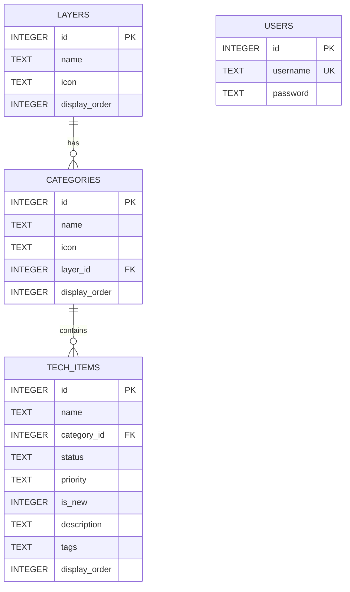
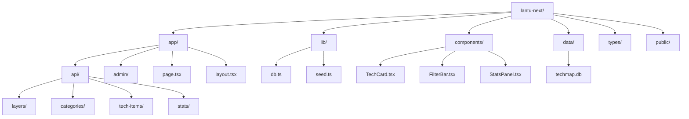

# 快速开始

<cite>
**本文档引用的文件**
- [README.md](file://README.md)
- [package.json](file://package.json)
- [next.config.ts](file://next.config.ts)
- [tsconfig.json](file://tsconfig.json)
- [lib/db.ts](file://lib/db.ts)
- [lib/seed.ts](file://lib/seed.ts)
- [app/layout.tsx](file://app/layout.tsx)
- [app/page.tsx](file://app/page.tsx)
- [types/index.ts](file://types/index.ts)
- [postcss.config.mjs](file://postcss.config.mjs)
- [app/api/layers/route.ts](file://app/api/layers/route.ts)
- [app/api/categories/route.ts](file://app/api/categories/route.ts)
- [app/api/stats/route.ts](file://app/api/stats/route.ts)
- [app/admin/page.tsx](file://app/admin/page.tsx)
</cite>

## 目录
1. [简介](#简介)
2. [环境准备](#环境准备)
3. [项目克隆](#项目克隆)
4. [依赖安装](#依赖安装)
5. [数据库初始化](#数据库初始化)
6. [开发服务器启动](#开发服务器启动)
7. [项目结构说明](#项目结构说明)
8. [常见问题排查](#常见问题排查)
9. [不同操作系统命令示例](#不同操作系统命令示例)
10. [API接口说明](#api接口说明)
11. [部署指南](#部署指南)
12. [结语](#结语)

## 简介

Lantu Next 是一个基于 Next.js + TypeScript + Tailwind CSS + SQLite 构建的技术栈管理系统。该项目提供了一个可视化的技术蓝图图谱，支持技术项的增删改查、层级管理和统计分析功能。

## 环境准备

### Node.js 版本要求

根据项目配置，推荐使用以下 Node.js 版本：
- **推荐版本**: v18.17.0 或更高版本
- **兼容版本**: v16.17.0+（根据 package.json 中的依赖）

### 包管理器选择

项目支持多种包管理器：
- **npm** (默认推荐)
- **pnpm** (性能更优，推荐使用)
- **yarn** (可选)

### 系统要求

- **操作系统**: Windows 10+/macOS 10.13+/Linux
- **内存**: 至少 4GB RAM
- **磁盘空间**: 至少 500MB 可用空间

**章节来源**
- [README.md](file://README.md#L168-L172)
- [package.json](file://package.json#L1-L43)

## 项目克隆

### GitHub 克隆

```bash
# 使用 HTTPS
git clone https://github.com/your-repository/lantu-next.git

# 使用 SSH
git clone git@github.com:your-repository/lantu-next.git
```

### 本地克隆

```bash
# 如果从本地目录克隆
git clone file:///path/to/your/local/repo
```

**章节来源**
- [README.md](file://README.md#L45-L51)

## 依赖安装

### 使用 npm 安装

```bash
# 安装项目依赖
npm install

# 安装开发依赖
npm install --dev
```

### 使用 pnpm 安装（推荐）

```bash
# 安装项目依赖
pnpm install

# 安装开发依赖
pnpm install --dev
```

### 使用 yarn 安装

```bash
# 安装项目依赖
yarn install

# 安装开发依赖
yarn install --dev
```

### 依赖安装注意事项

1. **better-sqlite3 包**: 该包需要编译，可能需要 Python 和构建工具
2. **Node-gyp**: 在某些系统上可能需要预安装
3. **权限问题**: 确保有写入 node_modules 的权限

**章节来源**
- [README.md](file://README.md#L47-L51)
- [package.json](file://package.json#L37-L41)

## 数据库初始化

### 执行种子脚本

```bash
# 初始化数据库并填充示例数据
npm run seed

# 或者使用 pnpm
pnpm run seed

# 或者使用 yarn
yarn run seed
```

### 数据库结构

项目使用 SQLite 数据库，包含以下表结构：



**图表来源**
- [lib/db.ts](file://lib/db.ts#L14-L49)

### 初始化过程说明

1. **创建数据目录**: 自动创建 `data/` 目录
2. **初始化表结构**: 创建 layers、categories、tech_items、users 表
3. **添加示例数据**: 插入预定义的技术栈数据
4. **创建管理员账户**: 默认用户名: admin, 密码: admin@999

**章节来源**
- [README.md](file://README.md#L53-L59)
- [lib/seed.ts](file://lib/seed.ts#L1-L14)
- [lib/db.ts](file://lib/db.ts#L14-L49)

## 开发服务器启动

### 启动开发服务器

```bash
# 启动开发服务器
npm run dev

# 或者使用 pnpm
pnpm run dev

# 或者使用 yarn
yarn run dev
```

### 服务器配置

- **默认端口**: 4701
- **开发模式**: Next.js 16.1.6
- **热重载**: 支持文件变更自动刷新
- **TypeScript**: 编译时类型检查

### 访问应用

启动完成后，在浏览器中访问：
```
http://localhost:4701
```

### 开发特性

1. **实时预览**: 修改代码后自动刷新
2. **错误边界**: 提供友好的错误页面
3. **TypeScript 支持**: 编译时类型检查
4. **热模块替换**: 提升开发体验

**章节来源**
- [README.md](file://README.md#L61-L67)
- [package.json](file://package.json#L6)
- [next.config.ts](file://next.config.ts#L3-L7)

## 项目结构说明

### 核心目录结构



**图表来源**
- [README.md](file://README.md#L20-L43)

### 关键文件说明

#### 应用入口文件
- `app/layout.tsx`: 应用根布局配置
- `app/page.tsx`: 首页组件实现
- `app/admin/page.tsx`: 管理后台页面

#### 数据库相关
- `lib/db.ts`: 数据库连接和操作封装
- `lib/seed.ts`: 数据库初始化脚本
- `data/techmap.db`: SQLite 数据库文件

#### 类型定义
- `types/index.ts`: TypeScript 接口定义

#### 构建配置
- `next.config.ts`: Next.js 配置文件
- `tsconfig.json`: TypeScript 配置文件
- `postcss.config.mjs`: PostCSS 配置文件

**章节来源**
- [README.md](file://README.md#L20-L43)
- [app/layout.tsx](file://app/layout.tsx#L1-L36)
- [app/page.tsx](file://app/page.tsx#L1-L238)
- [lib/db.ts](file://lib/db.ts#L1-L312)

## 常见问题排查

### 依赖安装问题

#### better-sqlite3 编译失败

**问题**: 在某些系统上编译 better-sqlite3 失败

**解决方案**:
```bash
# 方法1: 使用预编译版本
npm install --platform=linux --arch=x64 better-sqlite3

# 方法2: 安装构建工具
# Windows: npm install --global windows-build-tools
# macOS: xcode-select --install
# Linux: sudo apt-get install build-essential python3

# 方法3: 使用 pnpm 的 onlyBuiltDependencies
pnpm install
```

#### 权限不足错误

**问题**: 无法写入 node_modules 或创建数据库文件

**解决方案**:
```bash
# Linux/macOS
sudo chown -R $(whoami) node_modules
chmod 755 node_modules

# Windows (以管理员身份运行)
icacls node_modules /grant Everyone:F
```

### 数据库初始化问题

#### 数据库文件权限问题

**问题**: 无法创建或写入 data/techmap.db

**解决方案**:
```bash
# 检查目录权限
ls -la data/

# 创建目录并设置权限
mkdir -p data
chmod 755 data
chown -R $(whoami) data

# 删除损坏的数据库文件
rm data/techmap.db
npm run seed
```

#### 数据库连接失败

**问题**: 应用无法连接到 SQLite 数据库

**解决方案**:
```bash
# 检查数据库文件是否存在
ls -la data/techmap.db

# 检查文件权限
file data/techmap.db

# 重新初始化数据库
rm data/techmap.db
npm run seed
```

### 开发服务器启动问题

#### 端口被占用

**问题**: 端口 4701 被其他程序占用

**解决方案**:
```bash
# 查找占用端口的进程
netstat -ano | findstr :4701
lsof -i :4701

# 修改端口配置
# 在 package.json 中修改 "dev": "next dev -p 4702"

# 或者杀死占用进程
taskkill /PID <进程ID> /F
```

#### 热重载失效

**问题**: 修改文件后页面不自动刷新

**解决方案**:
```bash
# 清理缓存
rm -rf .next
npm run dev

# 检查文件监听
lsof -i :4701

# 重启开发服务器
npm run dev
```

### TypeScript 类型错误

#### 类型检查失败

**问题**: 编译时报类型错误

**解决方案**:
```bash
# 清理 TypeScript 缓存
rm -rf .next/types
rm -rf .next/dev/types

# 重新安装类型定义
npm install --save-dev @types/node @types/react @types/react-dom

# 检查 tsconfig.json 配置
npx tsc --noEmit
```

**章节来源**
- [README.md](file://README.md#L164-L235)
- [lib/db.ts](file://lib/db.ts#L5-L11)

## 不同操作系统命令示例

### Windows 系统

```bash
# 1. 环境准备
# 安装 Node.js (推荐 LTS 版本)
# 安装 Git for Windows

# 2. 克隆项目
git clone https://github.com/your-repository/lantu-next.git
cd lantu-next

# 3. 安装依赖 (推荐使用 pnpm)
winget install pnpm
pnpm install

# 4. 初始化数据库
pnpm run seed

# 5. 启动开发服务器
pnpm run dev
```

### macOS 系统

```bash
# 1. 环境准备
# 安装 Homebrew (如果未安装)
/bin/bash -c "$(curl -fsSL https://raw.githubusercontent.com/Homebrew/install/HEAD/install.sh)"

# 安装 Node.js 和 Git
brew install node git

# 2. 克隆项目
git clone https://github.com/your-repository/lantu-next.git
cd lantu-next

# 3. 安装依赖
npm install

# 4. 初始化数据库
npm run seed

# 5. 启动开发服务器
npm run dev
```

### Linux 系统

```bash
# Ubuntu/Debian
# 1. 环境准备
sudo apt update
sudo apt install nodejs npm git build-essential python3

# 2. 克隆项目
git clone https://github.com/your-repository/lantu-next.git
cd lantu-next

# 3. 安装依赖
npm install

# 4. 初始化数据库
npm run seed

# 5. 启动开发服务器
npm run dev
```

```bash
# CentOS/RHEL/Fedora
# 1. 环境准备
sudo dnf install nodejs npm git gcc-c++ python3

# 2. 克隆项目
git clone https://github.com/your-repository/lantu-next.git
cd lantu-next

# 3. 安装依赖
npm install

# 4. 初始化数据库
npm run seed

# 5. 启动开发服务器
npm run dev
```

## API接口说明

### 层级管理 API

#### 获取所有层级

```bash
# GET 请求
curl http://localhost:4701/api/layers
```

响应格式:
```json
[
  {
    "id": 1,
    "name": "开发技术层",
    "icon": "💻",
    "display_order": 1
  }
]
```

#### 创建新层级

```bash
# POST 请求
curl -X POST http://localhost:4701/api/layers \
  -H "Content-Type: application/json" \
  -d '{"name":"新层级","icon":"⭐","display_order":1}'
```

### 分类管理 API

#### 获取所有分类

```bash
# GET 请求
curl http://localhost:4701/api/categories
```

#### 创建新分类

```bash
# POST 请求
curl -X POST http://localhost:4701/api/categories \
  -H "Content-Type: application/json" \
  -d '{"name":"新分类","icon":"📝","layer_id":1,"display_order":1}'
```

### 技术项管理 API

#### 获取所有技术项

```bash
# GET 请求
curl http://localhost:4701/api/tech-items
```

#### 创建新技术项

```bash
# POST 请求
curl -X POST http://localhost:4701/api/tech-items \
  -H "Content-Type: application/json" \
  -d '{"name":"新技术","category_id":1,"status":"active","priority":"high","is_new":1}'
```

#### 更新技术项

```bash
# PUT 请求
curl -X PUT http://localhost:4701/api/tech-items \
  -H "Content-Type: application/json" \
  -d '{"id":1,"name":"更新后的技术","status":"missing"}'
```

#### 删除技术项

```bash
# DELETE 请求
curl -X DELETE "http://localhost:4701/api/tech-items?id=1"
```

### 统计数据 API

#### 获取统计数据

```bash
# GET 请求
curl http://localhost:4701/api/stats
```

响应格式:
```json
{
  "active": 150,
  "missing": 25,
  "total": 175,
  "coverage": "85.7"
}
```

**章节来源**
- [README.md](file://README.md#L89-L111)
- [app/api/layers/route.ts](file://app/api/layers/route.ts#L1-L48)
- [app/api/categories/route.ts](file://app/api/categories/route.ts#L1-L48)
- [app/api/stats/route.ts](file://app/api/stats/route.ts#L1-L15)

## 部署指南

### 生产环境构建

```bash
# 构建生产版本
npm run build

# 启动生产服务器
npm start
```

### 内网服务器部署

#### 环境准备

```bash
# 推荐环境
# - Node.js: v18.17.0+
# - pnpm: 最新版本
# - PM2: 用于进程守护
```

#### 部署步骤

```bash
# 1. 进入项目目录
cd /path/to/lantu-next

# 2. 安装依赖
pnpm install

# 3. 初始化数据 (首次部署)
pnpm run seed

# 4. 构建应用
pnpm run build

# 5. 启动应用
pnpm run start
```

#### PM2 进程管理

```bash
# 使用 PM2 启动应用
pm2 start npm --name "lantu-next" -- start -- -p 4701

# 设置开机自启
pm2 save
pm2 startup

# 查看应用状态
pm2 status
```

#### Nginx 反向代理配置

```nginx
server {
    listen 80;
    server_name your.internal.ip;

    location / {
        proxy_pass http://127.0.0.1:4701;
        proxy_http_version 1.1;
        proxy_set_header Upgrade $http_upgrade;
        proxy_set_header Connection 'upgrade';
        proxy_set_header Host $host;
        proxy_cache_bypass $http_upgrade;
    }
}
```

### 部署注意事项

1. **数据库权限**: 确保运行用户对 `data/` 目录有读写权限
2. **端口配置**: 默认使用 4701 端口，可根据需要修改
3. **静态资源**: `public/` 目录资源自动处理，无需额外配置
4. **SSL 证书**: 生产环境建议配置 HTTPS

**章节来源**
- [README.md](file://README.md#L164-L228)
- [package.json](file://package.json#L6-L10)

## 结语

通过以上步骤，您应该能够在30分钟内成功运行 Lantu Next 项目。如果在安装过程中遇到任何问题，请参考常见问题排查部分或查看项目文档。

### 下一步建议

1. **探索管理后台**: 访问 `/admin` 页面管理技术项
2. **自定义样式**: 修改 `app/globals.css` 和 Tailwind 配置
3. **扩展功能**: 根据需求添加新的 API 接口或页面组件
4. **数据迁移**: 学习如何修改数据库结构和迁移数据

### 贡献指南

欢迎提交 Issue 和 Pull Request 来改进项目！请确保遵循项目的编码规范和测试要求。