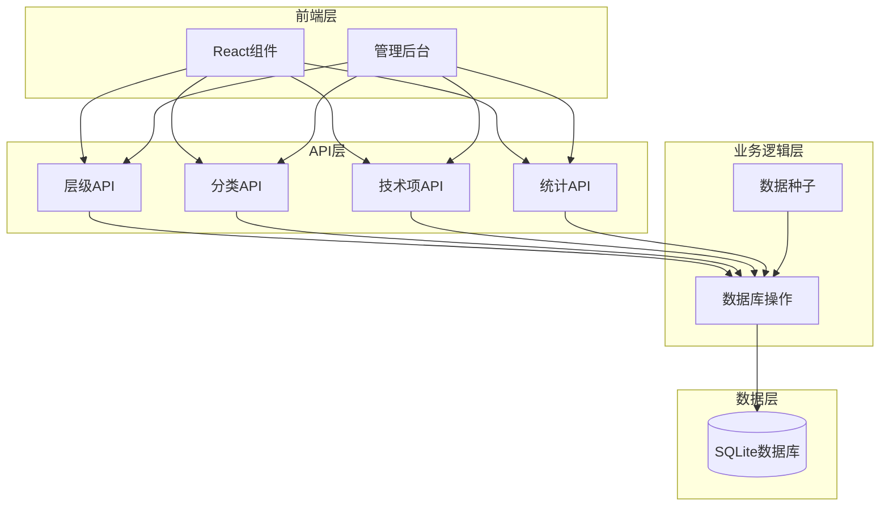
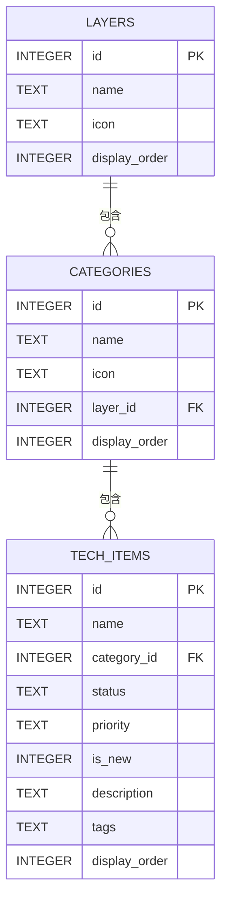
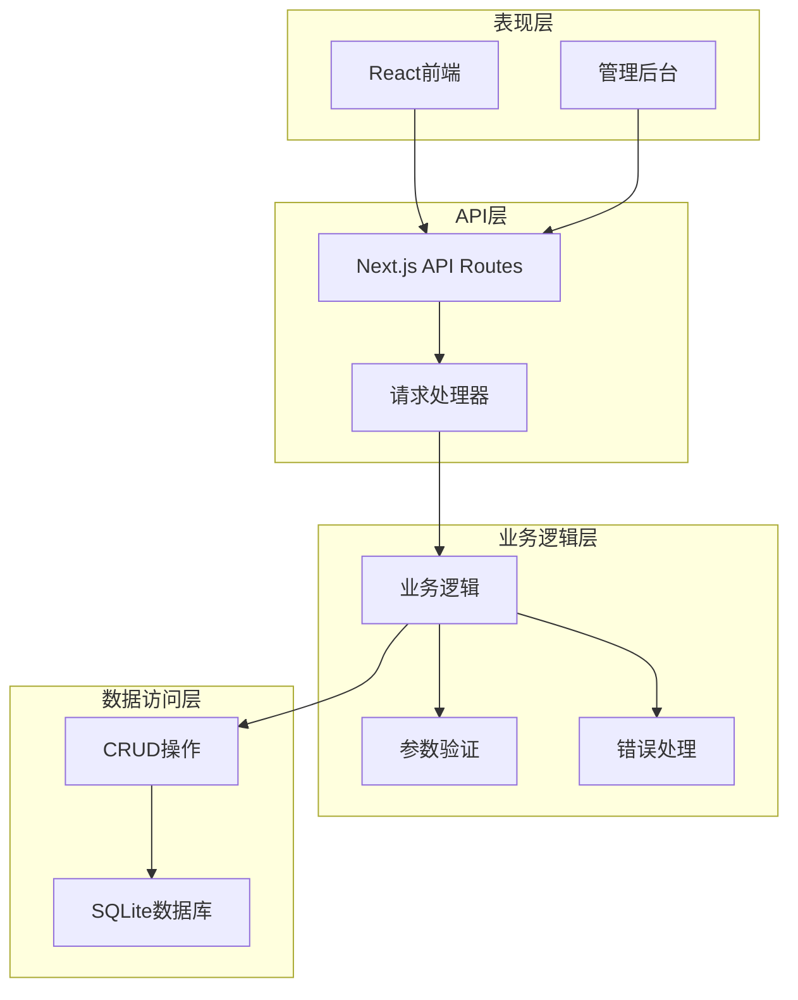
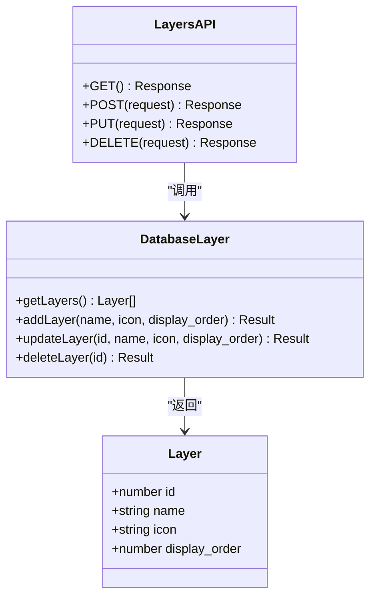
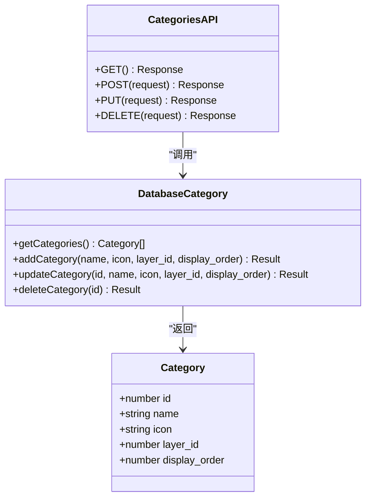
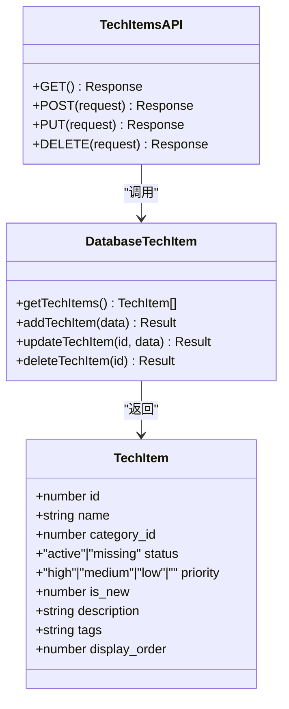
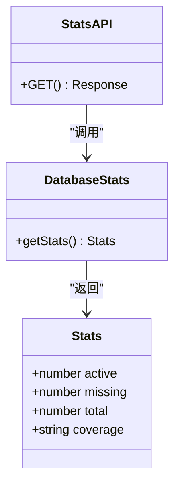
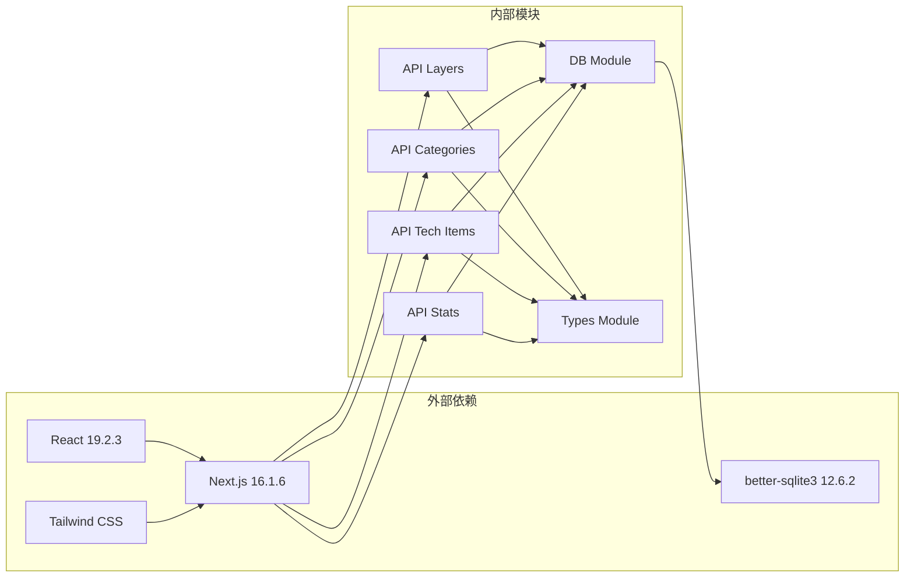
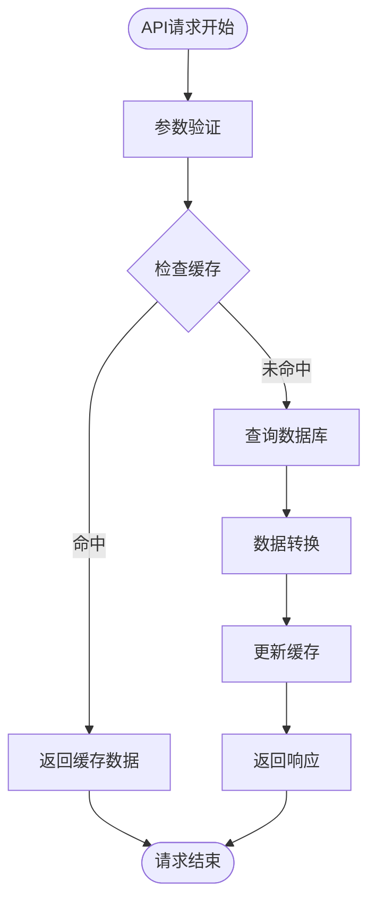

# API接口调试

<cite>
**本文档引用的文件**
- [app/api/categories/route.ts](file://app/api/categories/route.ts)
- [app/api/layers/route.ts](file://app/api/layers/route.ts)
- [app/api/stats/route.ts](file://app/api/stats/route.ts)
- [app/api/tech-items/route.ts](file://app/api/tech-items/route.ts)
- [lib/db.ts](file://lib/db.ts)
- [types/index.ts](file://types/index.ts)
- [lib/seed.ts](file://lib/seed.ts)
- [next.config.ts](file://next.config.ts)
- [package.json](file://package.json)
- [README.md](file://README.md)
</cite>

## 目录
1. [简介](#简介)
2. [项目结构](#项目结构)
3. [核心组件](#核心组件)
4. [架构概览](#架构概览)
5. [详细组件分析](#详细组件分析)
6. [依赖关系分析](#依赖关系分析)
7. [性能考虑](#性能考虑)
8. [故障排除指南](#故障排除指南)
9. [结论](#结论)

## 简介

本文档为云平台技术蓝图图谱项目的API接口调试专业指南。该系统基于Next.js构建，使用TypeScript、Tailwind CSS和SQLite数据库，提供了完整的REST API接口用于技术栈管理。

项目包含四个主要API端点：层级(Layers)、分类(Categories)、技术项(Tech Items)和统计(Stats)，支持完整的CRUD操作。本文档将详细介绍每个API端点的使用方法、响应格式、常见问题排查以及性能优化建议。

## 项目结构

该项目采用Next.js App Router架构，API路由位于`app/api/`目录下，数据库操作封装在`lib/db.ts`中，类型定义位于`types/index.ts`。



**图表来源**
- [app/api/categories/route.ts](file://app/api/categories/route.ts#L1-L48)
- [app/api/layers/route.ts](file://app/api/layers/route.ts#L1-L48)
- [app/api/stats/route.ts](file://app/api/stats/route.ts#L1-L15)
- [app/api/tech-items/route.ts](file://app/api/tech-items/route.ts#L1-L50)
- [lib/db.ts](file://lib/db.ts#L1-L312)

**章节来源**
- [README.md](file://README.md#L20-L43)
- [package.json](file://package.json#L1-L43)

## 核心组件

### API端点概览

系统提供四个主要API端点，每个都支持标准的REST操作：

| 端点 | 方法 | 描述 | 请求体 | 响应 |
|------|------|------|--------|------|
| `/api/layers` | GET | 获取所有层级 | 无 | 层级数组 |
| `/api/layers` | POST | 创建新层级 | 层级对象 | 新层级信息 |
| `/api/layers` | PUT | 更新层级 | 层级对象 | 成功状态 |
| `/api/layers` | DELETE | 删除层级 | 查询参数: id | 成功状态 |
| `/api/categories` | GET | 获取所有分类 | 无 | 分类数组 |
| `/api/categories` | POST | 创建新分类 | 分类对象 | 新分类信息 |
| `/api/categories` | PUT | 更新分类 | 分类对象 | 成功状态 |
| `/api/categories` | DELETE | 删除分类 | 查询参数: id | 成功状态 |
| `/api/tech-items` | GET | 获取所有技术项 | 无 | 技术项数组 |
| `/api/tech-items` | POST | 创建新技术项 | 技术项对象 | 新技术项信息 |
| `/api/tech-items` | PUT | 更新技术项 | 技术项对象 | 成功状态 |
| `/api/tech-items` | DELETE | 删除技术项 | 查询参数: id | 成功状态 |
| `/api/stats` | GET | 获取统计数据 | 无 | 统计信息 |

**章节来源**
- [README.md](file://README.md#L89-L111)
- [app/api/layers/route.ts](file://app/api/layers/route.ts#L6-L47)
- [app/api/categories/route.ts](file://app/api/categories/route.ts#L6-L47)
- [app/api/tech-items/route.ts](file://app/api/tech-items/route.ts#L7-L49)
- [app/api/stats/route.ts](file://app/api/stats/route.ts#L6-L14)

### 数据模型

系统使用三个核心数据表来存储信息：



**图表来源**
- [lib/db.ts](file://lib/db.ts#L15-L49)
- [types/index.ts](file://types/index.ts#L1-L34)

**章节来源**
- [lib/db.ts](file://lib/db.ts#L15-L49)
- [types/index.ts](file://types/index.ts#L1-L34)

## 架构概览

系统采用分层架构设计，从上到下分别为：



**图表来源**
- [app/api/layers/route.ts](file://app/api/layers/route.ts#L1-L48)
- [app/api/categories/route.ts](file://app/api/categories/route.ts#L1-L48)
- [app/api/tech-items/route.ts](file://app/api/tech-items/route.ts#L1-L50)
- [app/api/stats/route.ts](file://app/api/stats/route.ts#L1-L15)
- [lib/db.ts](file://lib/db.ts#L52-L312)

## 详细组件分析

### 层级API (Layers)

层级API负责管理技术栈的顶层分类，支持完整的CRUD操作。

#### 数据结构



**图表来源**
- [types/index.ts](file://types/index.ts#L1-L6)
- [app/api/layers/route.ts](file://app/api/layers/route.ts#L1-L48)
- [lib/db.ts](file://lib/db.ts#L52-L76)

#### API使用示例

**获取所有层级**
```bash
curl -X GET http://localhost:4701/api/layers
```

**创建新层级**
```bash
curl -X POST http://localhost:4701/api/layers \
  -H "Content-Type: application/json" \
  -d '{
    "name": "新层级",
    "icon": "🚀",
    "display_order": 1
  }'
```

**更新层级**
```bash
curl -X PUT http://localhost:4701/api/layers \
  -H "Content-Type: application/json" \
  -d '{
    "id": 1,
    "name": "更新后的名称",
    "icon": "🌟",
    "display_order": 2
  }'
```

**删除层级**
```bash
curl -X DELETE "http://localhost:4701/api/layers?id=1"
```

**章节来源**
- [app/api/layers/route.ts](file://app/api/layers/route.ts#L6-L47)
- [lib/db.ts](file://lib/db.ts#L117-L122)

### 分类API (Categories)

分类API管理技术项的二级分类，支持层级关联和排序功能。

#### 数据结构



**图表来源**
- [types/index.ts](file://types/index.ts#L8-L14)
- [app/api/categories/route.ts](file://app/api/categories/route.ts#L1-L48)
- [lib/db.ts](file://lib/db.ts#L78-L105)

#### API使用示例

**获取所有分类**
```bash
curl -X GET http://localhost:4701/api/categories
```

**创建新分类**
```bash
curl -X POST http://localhost:4701/api/categories \
  -H "Content-Type: application/json" \
  -d '{
    "name": "新分类",
    "icon": "🔧",
    "layer_id": 1,
    "display_order": 1
  }'
```

**更新分类**
```bash
curl -X PUT http://localhost:4701/api/categories \
  -H "Content-Type: application/json" \
  -d '{
    "id": 1,
    "name": "更新后的分类",
    "icon": "⚙️",
    "layer_id": 1,
    "display_order": 2
  }'
```

**删除分类**
```bash
curl -X DELETE "http://localhost:4701/api/categories?id=1"
```

**章节来源**
- [app/api/categories/route.ts](file://app/api/categories/route.ts#L6-L47)
- [lib/db.ts](file://lib/db.ts#L124-L135)

### 技术项API (Tech Items)

技术项API管理具体的技术栈条目，支持复杂的状态管理和标签系统。

#### 数据结构



**图表来源**
- [types/index.ts](file://types/index.ts#L16-L26)
- [app/api/tech-items/route.ts](file://app/api/tech-items/route.ts#L1-L50)
- [lib/db.ts](file://lib/db.ts#L107-L162)

#### API使用示例

**获取所有技术项**
```bash
curl -X GET http://localhost:4701/api/tech-items
```

**创建新技术项**
```bash
curl -X POST http://localhost:4701/api/tech-items \
  -H "Content-Type: application/json" \
  -d '{
    "name": "新技术项",
    "category_id": 1,
    "status": "active",
    "priority": "high",
    "is_new": 1,
    "description": "技术项描述",
    "tags": "tag1,tag2",
    "display_order": 1
  }'
```

**更新技术项**
```bash
curl -X PUT http://localhost:4701/api/tech-items \
  -H "Content-Type: application/json" \
  -d '{
    "id": 1,
    "name": "更新后的技术项",
    "status": "missing",
    "priority": "medium"
  }'
```

**删除技术项**
```bash
curl -X DELETE "http://localhost:4701/api/tech-items?id=1"
```

**章节来源**
- [app/api/tech-items/route.ts](file://app/api/tech-items/route.ts#L7-L49)
- [lib/db.ts](file://lib/db.ts#L137-L162)

### 统计API (Stats)

统计API提供系统的整体统计信息，包括活跃技术项、缺失技术和覆盖率。

#### 数据结构



**图表来源**
- [types/index.ts](file://types/index.ts#L28-L33)
- [app/api/stats/route.ts](file://app/api/stats/route.ts#L1-L15)
- [lib/db.ts](file://lib/db.ts#L219-L239)

#### API使用示例

**获取统计信息**
```bash
curl -X GET http://localhost:4701/api/stats
```

**预期响应格式**
```json
{
  "active": 150,
  "missing": 25,
  "total": 175,
  "coverage": "85.7"
}
```

**章节来源**
- [app/api/stats/route.ts](file://app/api/stats/route.ts#L6-L14)
- [lib/db.ts](file://lib/db.ts#L219-L239)

## 依赖关系分析

系统的关键依赖关系如下：



**图表来源**
- [package.json](file://package.json#L12-L24)
- [next.config.ts](file://next.config.ts#L1-L10)
- [lib/db.ts](file://lib/db.ts#L1-L4)

**章节来源**
- [package.json](file://package.json#L12-L24)
- [next.config.ts](file://next.config.ts#L3-L7)

## 性能考虑

### 数据库性能优化

1. **索引策略**: 当前数据库结构使用了适当的索引，包括主键索引和外键约束
2. **查询优化**: 所有查询都包含ORDER BY子句，确保结果的一致性
3. **事务处理**: 批量操作使用事务确保数据一致性

### API性能优化

1. **缓存策略**: 可以考虑在应用层添加适当的缓存机制
2. **分页支持**: 对于大量数据的GET请求，可以考虑实现分页功能
3. **并发控制**: 在高并发场景下，需要考虑数据库连接池的配置

### 监控指标



**图表来源**
- [app/api/layers/route.ts](file://app/api/layers/route.ts#L6-L13)
- [app/api/categories/route.ts](file://app/api/categories/route.ts#L6-L13)
- [app/api/tech-items/route.ts](file://app/api/tech-items/route.ts#L7-L14)

## 故障排除指南

### 常见HTTP状态码

| 状态码 | 含义 | 可能原因 | 解决方案 |
|--------|------|----------|----------|
| 200 | OK | 请求成功 | 检查响应数据格式 |
| 201 | Created | 创建成功 | 验证创建的数据 |
| 400 | Bad Request | 参数错误 | 检查请求格式和必填字段 |
| 404 | Not Found | 资源不存在 | 确认ID是否存在 |
| 500 | Internal Server Error | 服务器错误 | 查看服务器日志 |
| 503 | Service Unavailable | 服务不可用 | 检查数据库连接 |

### 错误响应格式

所有API错误都会返回统一的JSON格式：

```json
{
  "error": "错误描述信息"
}
```

某些端点还会包含详细信息：
```json
{
  "error": "错误描述",
  "details": "详细错误信息"
}
```

### 调试技巧

#### 使用curl进行调试

**基本GET请求**
```bash
# 获取所有层级
curl -v http://localhost:4701/api/layers

# 获取特定层级
curl -v "http://localhost:4701/api/layers?id=1"
```

**POST请求调试**
```bash
# 使用-d参数传递JSON数据
curl -X POST http://localhost:4701/api/layers \
  -H "Content-Type: application/json" \
  -d '{"name":"测试","icon":"🚀","display_order":1}'
```

**查看响应头**
```bash
curl -v http://localhost:4701/api/layers
```

#### Postman使用指南

1. **设置请求**: 选择正确的HTTP方法和URL
2. **配置Headers**: 添加`Content-Type: application/json`
3. **设置Body**: 选择raw JSON格式
4. **发送请求**: 点击Send按钮
5. **检查响应**: 查看Status、Headers和Body

### 常见问题诊断

#### 数据库连接问题

**症状**: 所有API请求返回500错误

**诊断步骤**:
1. 检查数据库文件是否存在
2. 验证数据库文件权限
3. 确认数据库连接字符串

**解决方法**:
```bash
# 检查数据库文件
ls -la data/

# 重新初始化数据库
npm run seed
```

#### 参数验证错误

**症状**: 返回400错误，提示参数无效

**常见原因**:
1. 缺少必需字段
2. 字段类型不匹配
3. 数值范围超出限制

**解决方法**:
```javascript
// 正确的请求格式示例
{
  "name": "层级名称",
  "icon": "图标",
  "display_order": 1
}
```

#### 跨域问题

**症状**: 浏览器控制台显示CORS错误

**解决方法**:
在Next.js配置中添加CORS支持：

```typescript
// next.config.ts
const nextConfig = {
  experimental: {
    serverExternalPackages: ["better-sqlite3"],
  },
  async headers() {
    return [
      {
        source: "/api/:path*",
        headers: [
          {
            key: "Access-Control-Allow-Origin",
            value: "*",
          },
          {
            key: "Access-Control-Allow-Methods",
            value: "GET, POST, PUT, DELETE, OPTIONS",
          },
          {
            key: "Access-Control-Allow-Headers",
            value: "Content-Type, Authorization",
          },
        ],
      },
    ];
  },
};
```

#### 认证失败问题

**症状**: API返回401或403错误

**解决方法**:
1. 检查认证头是否正确设置
2. 验证令牌有效性
3. 确认用户权限

### 日志分析

#### 服务器日志

```bash
# 启动开发服务器查看日志
npm run dev

# 查看生产环境日志
npm run start
```

#### 数据库日志

```typescript
// 在数据库操作中添加日志
export function addLayer(name: string, icon: string, display_order: number) {
  console.log(`Adding layer: ${name}`);
  const stmt = db.prepare(
    "INSERT INTO layers (name, icon, display_order) VALUES (?, ?, ?)",
  );
  const result = stmt.run(name, icon, display_order);
  console.log(`Layer added with id: ${result.lastInsertRowid}`);
  return result;
}
```

#### 性能监控

```typescript
// 添加性能监控
export async function GET() {
  const startTime = Date.now();
  try {
    const layers = getLayers();
    const endTime = Date.now();
    console.log(`GET /api/layers took ${endTime - startTime}ms`);
    return NextResponse.json(layers);
  } catch (error) {
    console.error(`Error in GET /api/layers: ${error}`);
    return NextResponse.json({ error: 'Failed to fetch layers' }, { status: 500 });
  }
}
```

**章节来源**
- [app/api/layers/route.ts](file://app/api/layers/route.ts#L10-L12)
- [app/api/categories/route.ts](file://app/api/categories/route.ts#L20-L22)
- [app/api/tech-items/route.ts](file://app/api/tech-items/route.ts#L21-L23)
- [app/api/stats/route.ts](file://app/api/stats/route.ts#L11-L12)

## 结论

本API接口调试指南涵盖了云平台技术蓝图图谱项目的所有核心功能。通过理解API端点的结构、数据模型和错误处理机制，开发者可以有效地进行API调试和问题排查。

关键要点包括：
- 理解每个API端点的功能和数据结构
- 掌握正确的请求格式和参数要求
- 识别和解决常见的HTTP状态码问题
- 实施有效的调试策略和日志分析方法
- 优化API性能和可靠性

建议在实际使用中结合具体的业务需求，根据本指南提供的调试方法和故障排除技巧，快速定位和解决问题，确保系统的稳定运行。