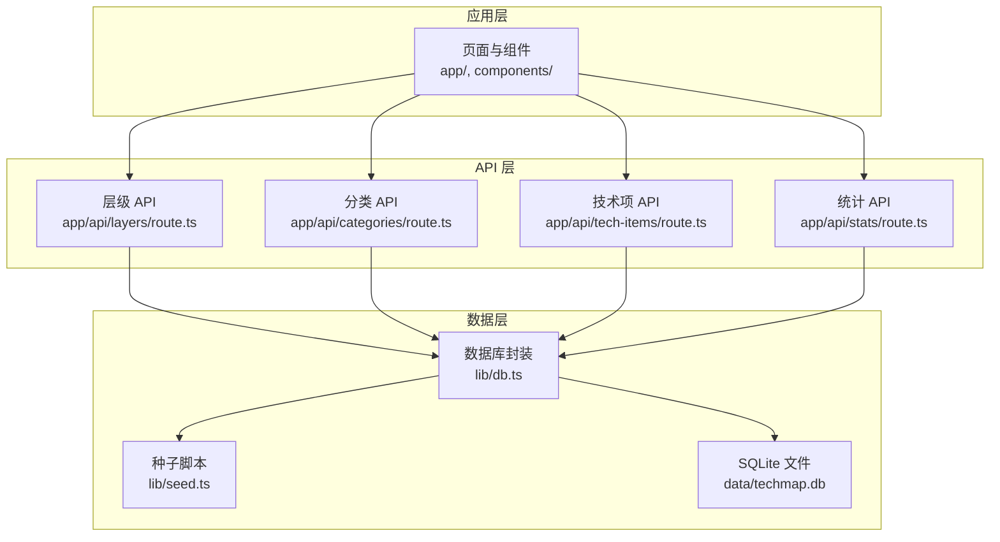
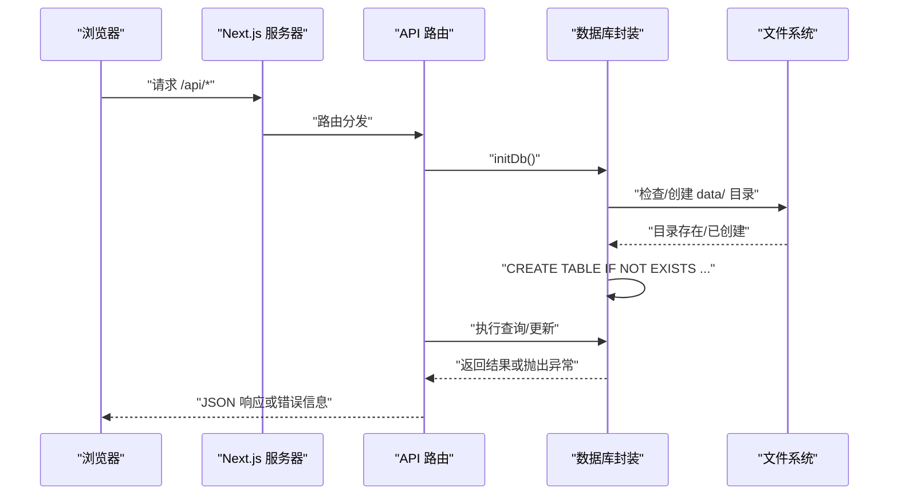
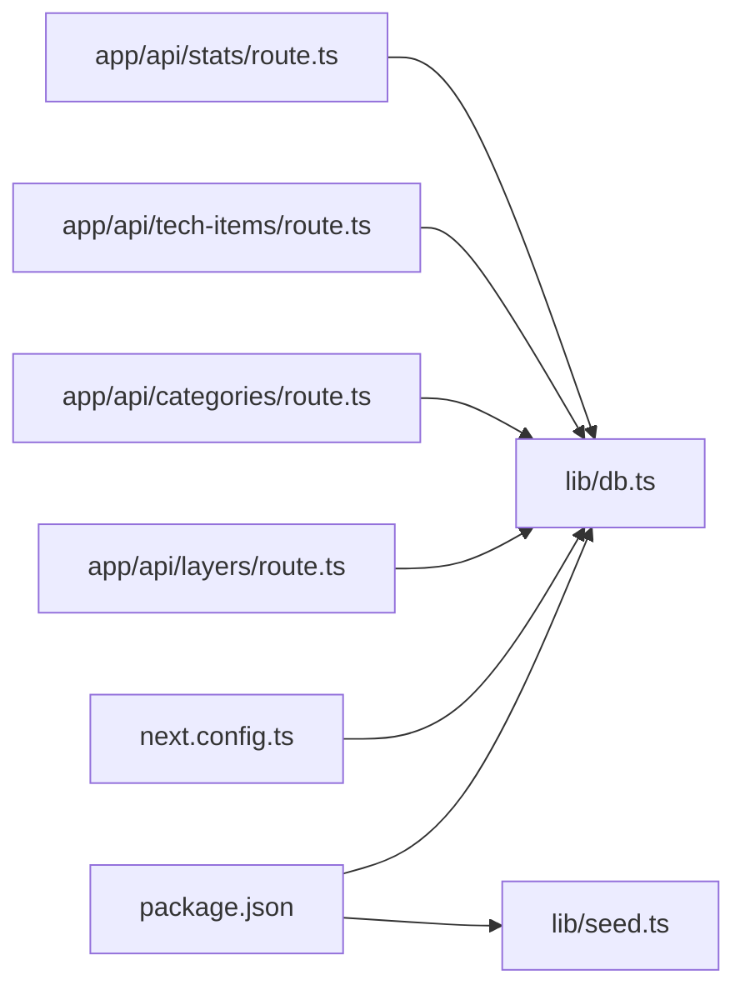

# 常见问题

<cite>
**本文引用的文件**
- [README.md](file://README.md)
- [package.json](file://package.json)
- [next.config.ts](file://next.config.ts)
- [lib/db.ts](file://lib/db.ts)
- [lib/seed.ts](file://lib/seed.ts)
- [app/api/layers/route.ts](file://app/api/layers/route.ts)
- [app/api/categories/route.ts](file://app/api/categories/route.ts)
- [app/api/tech-items/route.ts](file://app/api/tech-items/route.ts)
- [app/api/stats/route.ts](file://app/api/stats/route.ts)
- [tsconfig.json](file://tsconfig.json)
- [types/index.ts](file://types/index.ts)
- [scripts/clean-duplicates.ts](file://scripts/clean-duplicates.ts)
</cite>

## 目录
1. [简介](#简介)
2. [项目结构](#项目结构)
3. [核心组件](#核心组件)
4. [架构总览](#架构总览)
5. [详细组件分析](#详细组件分析)
6. [依赖关系分析](#依赖关系分析)
7. [性能考虑](#性能考虑)
8. [故障排查指南](#故障排查指南)
9. [结论](#结论)
10. [附录](#附录)

## 简介
本文件面向 Lantu Next 项目使用者，聚焦安装、配置、运行阶段的常见问题与解决方案，涵盖依赖安装失败、数据库初始化错误、API 接口调用异常、前端页面加载失败等问题。内容结合仓库中的实际实现，提供可复现的排查路径、错误信息定位方法、配置修正步骤以及针对不同操作系统与 Node.js 版本的建议。

## 项目结构
Lantu Next 是一个基于 Next.js App Router 的全栈应用，采用 TypeScript、Tailwind CSS 与 SQLite（better-sqlite3）实现。核心模块包括：
- 前端页面与组件：app/ 与 components/
- API 路由：app/api/*
- 数据库与种子脚本：lib/db.ts、lib/seed.ts、data/techmap.db
- 构建与运行配置：next.config.ts、package.json、tsconfig.json

图表来源
- [app/api/layers/route.ts](file://app/api/layers/route.ts#L1-L48)
- [app/api/categories/route.ts](file://app/api/categories/route.ts#L1-L48)
- [app/api/tech-items/route.ts](file://app/api/tech-items/route.ts#L1-L50)
- [app/api/stats/route.ts](file://app/api/stats/route.ts#L1-L15)
- [lib/db.ts](file://lib/db.ts#L1-L312)
- [lib/seed.ts](file://lib/seed.ts#L1-L840)

章节来源
- [README.md](file://README.md#L20-L43)
- [package.json](file://package.json#L1-L43)
- [next.config.ts](file://next.config.ts#L1-L10)
- [tsconfig.json](file://tsconfig.json#L1-L35)

## 核心组件
- 数据库封装与初始化：负责创建表结构、执行 CRUD、批量排序与统计查询；在每次 API 请求前进行数据库初始化。
- 种子脚本：负责创建表、清空旧数据、插入示例数据与管理员账户。
- API 路由：统一处理 GET/POST/PUT/DELETE，返回 JSON 响应或错误信息。
- 类型定义：对层级、分类、技术项与统计结果进行类型约束。

章节来源
- [lib/db.ts](file://lib/db.ts#L14-L50)
- [lib/seed.ts](file://lib/seed.ts#L10-L16)
- [app/api/layers/route.ts](file://app/api/layers/route.ts#L6-L13)
- [types/index.ts](file://types/index.ts#L1-L34)

## 架构总览
下图展示了从浏览器到数据库的数据流与错误处理路径：

图表来源
- [app/api/layers/route.ts](file://app/api/layers/route.ts#L4-L4)
- [lib/db.ts](file://lib/db.ts#L5-L11)
- [lib/db.ts](file://lib/db.ts#L14-L50)

## 详细组件分析

### 数据库初始化与权限问题
- 症状
  - 启动时出现“无法读取二进制文件”或数据库连接失败
  - API 返回 500，提示初始化失败
- 根因
  - data/ 目录不存在或无写权限
  - better-sqlite3 二进制预编译与当前环境不匹配
  - package.json 中的 onlyBuiltDependencies 限制导致安装阶段未正确预编译
- 解决步骤
  - 确保 data/ 目录存在且具备读写权限
  - 在安装依赖时使用 pnpm 并遵循 onlyBuiltDependencies 配置
  - 如仍失败，尝试清除缓存后重装依赖
- 相关实现
  - 数据库初始化与目录检查
  - better-sqlite3 外部包声明
  - 仅构建依赖配置

章节来源
- [lib/db.ts](file://lib/db.ts#L5-L11)
- [lib/db.ts](file://lib/db.ts#L14-L50)
- [next.config.ts](file://next.config.ts#L6-L6)
- [package.json](file://package.json#L37-L41)

### 种子脚本执行失败
- 症状
  - 执行种子脚本后数据库为空或报错
  - 用户表未生成，后台登录失败
- 根因
  - 种子脚本先清空旧数据再插入，若中途失败则数据不完整
  - 数据库表尚未初始化
- 解决步骤
  - 先执行数据库初始化，再运行种子脚本
  - 确认种子脚本中管理员账户已创建
- 相关实现
  - 初始化表结构与清空逻辑
  - 插入管理员账户

章节来源
- [lib/seed.ts](file://lib/seed.ts#L10-L16)
- [lib/db.ts](file://lib/db.ts#L284-L294)

### API 接口调用异常
- 症状
  - GET /api/layers、/api/categories、/api/tech-items、/api/stats 返回 500
  - POST/PUT/DELETE 返回 500 或缺少必要参数时报 400
- 根因
  - 数据库未初始化即发起请求
  - 请求体格式不正确或缺少必需字段
- 解决步骤
  - 确保每次请求前数据库已初始化
  - 检查请求体字段与类型，参考类型定义
- 相关实现
  - API 路由中的 try/catch 错误处理
  - 类型定义约束

章节来源
- [app/api/layers/route.ts](file://app/api/layers/route.ts#L6-L13)
- [app/api/categories/route.ts](file://app/api/categories/route.ts#L6-L13)
- [app/api/tech-items/route.ts](file://app/api/tech-items/route.ts#L7-L14)
- [app/api/stats/route.ts](file://app/api/stats/route.ts#L6-L14)
- [types/index.ts](file://types/index.ts#L1-L34)

### 前端页面加载失败
- 症状
  - 首页或管理后台页面白屏或 404
- 根因
  - 开发服务器端口冲突或未正确启动
  - 构建产物缺失或路径错误
- 解决步骤
  - 检查开发端口配置与占用情况
  - 重新执行构建并启动
- 相关实现
  - 开发端口配置
  - 构建与启动脚本

章节来源
- [package.json](file://package.json#L6-L8)
- [README.md](file://README.md#L61-L67)

### 重复数据清理
- 症状
  - 分类或层级存在重复名称，影响关联一致性
- 根因
  - 历史导入或多次初始化导致重复记录
- 解决步骤
  - 使用提供的清理脚本，自动迁移外键引用并删除重复记录
- 相关实现
  - 重复数据检测与迁移逻辑

章节来源
- [scripts/clean-duplicates.ts](file://scripts/clean-duplicates.ts#L10-L48)

## 依赖关系分析
- 外部依赖
  - better-sqlite3：SQLite 引擎，需预编译二进制
  - next：App Router 与构建工具
- 内部依赖
  - API 路由依赖数据库封装
  - 数据库封装依赖文件系统与 SQLite
  - 类型定义被 API 与数据库封装共同使用

图表来源
- [package.json](file://package.json#L12-L36)
- [next.config.ts](file://next.config.ts#L1-L10)
- [lib/db.ts](file://lib/db.ts#L1-L312)
- [lib/seed.ts](file://lib/seed.ts#L1-L840)
- [app/api/layers/route.ts](file://app/api/layers/route.ts#L1-L48)
- [app/api/categories/route.ts](file://app/api/categories/route.ts#L1-L48)
- [app/api/tech-items/route.ts](file://app/api/tech-items/route.ts#L1-L50)
- [app/api/stats/route.ts](file://app/api/stats/route.ts#L1-L15)

章节来源
- [package.json](file://package.json#L12-L41)
- [next.config.ts](file://next.config.ts#L6-L6)

## 性能考虑
- 数据库事务
  - 批量排序与清空数据使用事务，减少锁竞争与 IO 次数
- 查询优化
  - 按排序字段索引查询，避免全表扫描
- 构建优化
  - 启用 React 编译器与外部包优化，缩短冷启动时间

章节来源
- [lib/db.ts](file://lib/db.ts#L241-L282)
- [lib/db.ts](file://lib/db.ts#L284-L294)
- [next.config.ts](file://next.config.ts#L5-L5)

## 故障排查指南

### 依赖安装失败（better-sqlite3）
- 症状
  - 安装阶段卡住或报错，提示二进制下载失败
- 原因
  - 网络环境限制或镜像源不可用
  - Node.js 版本与预编译二进制不兼容
- 解决步骤
  - 使用 pnpm 并遵循 onlyBuiltDependencies 配置
  - 切换可靠镜像源或离线预编译
  - 升级 Node.js 至推荐版本
- 相关实现
  - 仅构建依赖声明
  - 外部包配置

章节来源
- [package.json](file://package.json#L37-L41)
- [next.config.ts](file://next.config.ts#L6-L6)
- [README.md](file://README.md#L170-L171)

### 数据库初始化错误
- 症状
  - API 返回 500，提示初始化失败
  - data/techmap.db 未生成或损坏
- 原因
  - data/ 目录不存在或权限不足
  - better-sqlite3 未正确预编译
- 解决步骤
  - 手动创建 data/ 目录并赋予读写权限
  - 清理依赖缓存后重装
  - 确保 initDb() 在请求前执行
- 相关实现
  - 目录检查与创建
  - 初始化 SQL

章节来源
- [lib/db.ts](file://lib/db.ts#L5-L11)
- [lib/db.ts](file://lib/db.ts#L14-L50)

### API 接口调用异常
- 症状
  - GET/POST/PUT/DELETE 返回 500 或 400
- 原因
  - 请求体字段缺失或类型不符
  - 数据库未初始化
- 解决步骤
  - 对照类型定义校验请求体
  - 确保先初始化数据库再发起请求
- 相关实现
  - API 路由错误处理
  - 类型定义

章节来源
- [app/api/layers/route.ts](file://app/api/layers/route.ts#L15-L23)
- [app/api/categories/route.ts](file://app/api/categories/route.ts#L15-L23)
- [app/api/tech-items/route.ts](file://app/api/tech-items/route.ts#L16-L24)
- [types/index.ts](file://types/index.ts#L1-L34)

### 前端页面加载失败
- 症状
  - 访问 http://localhost:3000 出现白屏或 404
- 原因
  - 开发服务器未启动或端口被占用
  - 构建产物缺失
- 解决步骤
  - 检查端口占用并更换端口
  - 重新执行构建与启动
- 相关实现
  - 开发端口配置
  - 启动脚本

章节来源
- [package.json](file://package.json#L6-L8)
- [README.md](file://README.md#L61-L67)

### 登录与后台管理
- 症状
  - 管理后台无法登录
- 原因
  - 种子脚本未执行导致管理员账户缺失
- 解决步骤
  - 执行种子脚本创建管理员账户
  - 确认密码与用户名一致
- 相关实现
  - 种子脚本添加用户
  - 用户查询接口

章节来源
- [lib/seed.ts](file://lib/seed.ts#L15-L16)
- [lib/db.ts](file://lib/db.ts#L296-L309)

### 重复数据导致的关联异常
- 症状
  - 分类无法正确归属层级，或层级重复显示
- 原因
  - 历史数据导入产生重复记录
- 解决步骤
  - 运行重复数据清理脚本，自动迁移外键并删除重复
- 相关实现
  - 重复检测与迁移逻辑

章节来源
- [scripts/clean-duplicates.ts](file://scripts/clean-duplicates.ts#L10-L48)

## 结论
本 FAQ 围绕 Lantu Next 的安装、配置与运行阶段的关键问题提供了系统化的排查与修复路径。通过关注数据库初始化、依赖安装、API 请求体规范与前端启动流程，大多数问题可在几分钟内定位并解决。建议在部署前完成种子脚本执行与权限检查，并在生产环境中配合进程管理与反向代理以提升稳定性与可用性。

## 附录

### 面向不同操作系统与 Node.js 版本的建议
- Windows
  - 使用 pnpm 并启用 onlyBuiltDependencies
  - 确保 data/ 目录具备当前用户写权限
- Linux（Ubuntu/CentOS）
  - 使用推荐 Node.js 版本，避免与 better-sqlite3 预编译二进制不兼容
  - 部署时使用 PM2 管理进程，配置端口与开机自启
- macOS
  - 若 Apple Silicon 芯片，注意 Rosetta 与本地编译差异，必要时切换 x86 环境或使用二进制镜像

章节来源
- [README.md](file://README.md#L166-L208)
- [package.json](file://package.json#L37-L41)