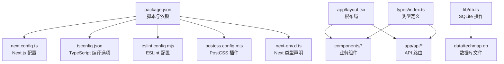
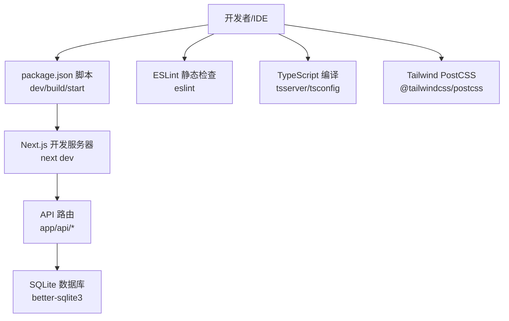
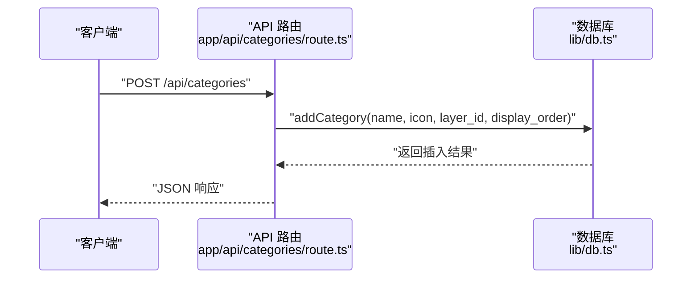
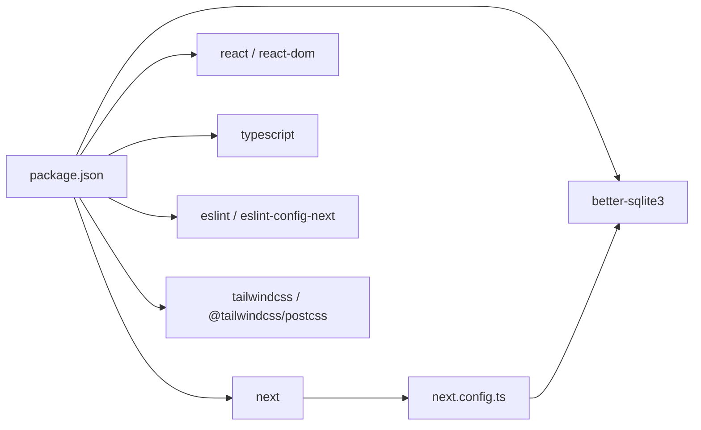

# 开发环境问题

<cite>
**本文引用的文件**
- [package.json](file://package.json)
- [next.config.ts](file://next.config.ts)
- [tsconfig.json](file://tsconfig.json)
- [eslint.config.mjs](file://eslint.config.mjs)
- [postcss.config.mjs](file://postcss.config.mjs)
- [next-env.d.ts](file://next-env.d.ts)
- [README.md](file://README.md)
- [lib/db.ts](file://lib/db.ts)
- [app/layout.tsx](file://app/layout.tsx)
- [app/api/categories/route.ts](file://app/api/categories/route.ts)
- [components/TechCard.tsx](file://components/TechCard.tsx)
- [types/index.ts](file://types/index.ts)
- [lib/AuthContext.tsx](file://lib/AuthContext.tsx)
</cite>

## 目录
1. [简介](#简介)
2. [项目结构](#项目结构)
3. [核心组件](#核心组件)
4. [架构总览](#架构总览)
5. [详细组件分析](#详细组件分析)
6. [依赖关系分析](#依赖关系分析)
7. [性能考虑](#性能考虑)
8. [故障排查指南](#故障排查指南)
9. [结论](#结论)
10. [附录](#附录)

## 简介
本指南面向使用 Next.js 16 App Router 的开发者，聚焦于开发环境配置与常见问题排查，覆盖以下主题：
- Node.js 版本兼容性与包管理器选择（npm/pnpm）
- TypeScript 编译与路径别名配置
- ESLint 规则与 Next.js 配置集成
- 依赖版本冲突、构建失败、热重载异常
- 不同操作系统下的环境配置最佳实践
- IDE 配置建议、调试工具设置与开发服务器启动问题
- Next.js 配置文件的作用与常见配置错误

## 项目结构
该仓库采用 Next.js App Router 结构，核心目录与文件如下：
- 应用入口与布局：app/layout.tsx
- API 路由：app/api/*
- 组件：components/*
- 类型定义：types/index.ts
- 数据库与种子脚本：lib/db.ts、lib/seed.ts
- 配置文件：next.config.ts、tsconfig.json、eslint.config.mjs、postcss.config.mjs、next-env.d.ts
- 包管理与脚本：package.json
- 项目说明：README.md

图表来源
- [package.json](file://package.json#L1-L43)
- [next.config.ts](file://next.config.ts#L1-L10)
- [tsconfig.json](file://tsconfig.json#L1-L35)
- [eslint.config.mjs](file://eslint.config.mjs#L1-L19)
- [postcss.config.mjs](file://postcss.config.mjs#L1-L8)
- [next-env.d.ts](file://next-env.d.ts#L1-L7)
- [app/layout.tsx](file://app/layout.tsx#L1-L36)
- [lib/db.ts](file://lib/db.ts#L1-L312)
- [types/index.ts](file://types/index.ts#L1-L34)

章节来源
- [README.md](file://README.md#L20-L43)
- [package.json](file://package.json#L1-L43)

## 核心组件
- 包管理与脚本：统一通过 package.json 管理开发脚本与依赖，支持 npm 与 pnpm（pnpm 字段仅用于特定场景）。
- Next.js 配置：启用 React Compiler 并将 better-sqlite3 标记为外部依赖，避免打包时编译原生模块。
- TypeScript 配置：严格模式、隔离模块、bundler 解析、路径别名 @/* 映射到项目根目录。
- ESLint 配置：基于 eslint-config-next 的核心 Web Vitals 与 TypeScript 规则，并自定义忽略项。
- PostCSS/Tailwind：使用 @tailwindcss/postcss 插件，配合 Tailwind v4。
- 数据层：better-sqlite3 本地数据库，初始化与 CRUD 操作集中在 lib/db.ts。

章节来源
- [package.json](file://package.json#L5-L11)
- [next.config.ts](file://next.config.ts#L3-L7)
- [tsconfig.json](file://tsconfig.json#L2-L24)
- [eslint.config.mjs](file://eslint.config.mjs#L1-L19)
- [postcss.config.mjs](file://postcss.config.mjs#L1-L8)
- [lib/db.ts](file://lib/db.ts#L1-L312)

## 架构总览
下图展示了开发环境中的关键交互：IDE/终端触发脚本 → Next.js 开发服务器 → API 路由 → 数据库；同时 ESLint/TS 在编辑阶段进行静态检查。

图表来源
- [package.json](file://package.json#L5-L11)
- [next.config.ts](file://next.config.ts#L3-L7)
- [app/api/categories/route.ts](file://app/api/categories/route.ts#L1-L48)
- [lib/db.ts](file://lib/db.ts#L1-L312)
- [eslint.config.mjs](file://eslint.config.mjs#L1-L19)
- [tsconfig.json](file://tsconfig.json#L2-L24)
- [postcss.config.mjs](file://postcss.config.mjs#L1-L8)

## 详细组件分析

### Node.js 与包管理器（npm/pnpm）
- Node.js 版本：README 建议使用 v18.17.0 或更高版本，确保与 Next.js 16 兼容。
- 包管理器：README 推荐使用 pnpm 以提升安装速度；项目中保留了 pnpm 字段，用于控制某些原生依赖的构建行为。
- 依赖安装：建议在团队内统一使用 pnpm，避免 npm 与 pnpm 的 lockfile 差异导致的版本不一致。

章节来源
- [README.md](file://README.md#L166-L172)
- [package.json](file://package.json#L37-L41)

### TypeScript 编译与路径别名
- 编译目标与模块系统：目标 ES2017，模块系统为 esnext，解析策略为 bundler，适合 Next.js App Router。
- 严格模式与隔离模块：开启严格模式与 isolatedModules，有助于早期发现类型问题。
- 路径别名：通过 paths 将 @/* 映射到项目根目录，便于相对导入。
- Next 类型声明：next-env.d.ts 引入 Next.js 类型与自动生成的路由类型声明。

章节来源
- [tsconfig.json](file://tsconfig.json#L2-L24)
- [next-env.d.ts](file://next-env.d.ts#L1-L7)

### ESLint 规则与 Next.js 集成
- 规则来源：基于 eslint-config-next 的 core-web-vitals 与 TypeScript 规则。
- 忽略项：覆盖默认忽略项，排除 .next、out、build、next-env.d.ts 等目录。
- 建议：在 IDE 中启用 ESLint 实时检查，避免提交前遗漏问题。

章节来源
- [eslint.config.mjs](file://eslint.config.mjs#L1-L19)

### Next.js 配置与 React Compiler
- React Compiler：启用 reactCompiler 以获得更好的编译优化。
- 外部依赖：serverExternalPackages 包含 better-sqlite3，避免在 Node 侧打包原生模块。
- 端口：开发脚本指定端口 4701，注意与系统端口占用冲突。

章节来源
- [next.config.ts](file://next.config.ts#L3-L7)
- [package.json](file://package.json#L6)

### 数据库与 API 路由
- 数据库初始化：lib/db.ts 在应用启动时初始化表结构，确保开发与生产环境一致。
- API 路由：app/api/categories/route.ts 提供分类的增删改查接口，内部调用 lib/db.ts。
- 类型约束：types/index.ts 定义了 Layer、Category、TechItem、Stats 等接口，API 返回值与组件消费保持一致。

图表来源
- [app/api/categories/route.ts](file://app/api/categories/route.ts#L15-L23)
- [lib/db.ts](file://lib/db.ts#L124-L135)

章节来源
- [lib/db.ts](file://lib/db.ts#L1-L312)
- [types/index.ts](file://types/index.ts#L1-L34)
- [app/api/categories/route.ts](file://app/api/categories/route.ts#L1-L48)

### 组件与上下文
- 根布局：app/layout.tsx 引入字体、全局样式与 AuthProvider，作为应用上下文根节点。
- 技术卡片：components/TechCard.tsx 使用类型定义 TechItem，渲染状态与优先级。
- 认证上下文：lib/AuthContext.tsx 提供登录/登出逻辑与本地存储持久化。

章节来源
- [app/layout.tsx](file://app/layout.tsx#L1-L36)
- [components/TechCard.tsx](file://components/TechCard.tsx#L1-L37)
- [lib/AuthContext.tsx](file://lib/AuthContext.tsx#L1-L62)
- [types/index.ts](file://types/index.ts#L16-L26)

## 依赖关系分析
- Next.js 与 React：版本号在 package.json 中固定，确保前后端版本一致。
- 原生依赖：better-sqlite3 通过 next.config.ts 的 serverExternalPackages 处理，避免打包。
- 开发工具：TypeScript、ESLint、Tailwind、tsx 等均在 devDependencies 中声明。

图表来源
- [package.json](file://package.json#L12-L36)
- [next.config.ts](file://next.config.ts#L3-L7)

章节来源
- [package.json](file://package.json#L12-L36)
- [next.config.ts](file://next.config.ts#L3-L7)

## 性能考虑
- React Compiler：启用后可减少运行时开销，建议在开发与生产均启用。
- 模块解析：bundler 解析策略与 esnext 模块系统配合，有利于 Tree Shaking。
- Tailwind：使用 PostCSS 插件按需生成样式，避免无用样式进入产物。
- 数据库：better-sqlite3 为本地嵌入式数据库，适合开发与小规模生产；若扩展需求高，建议迁移到远程数据库。

章节来源
- [next.config.ts](file://next.config.ts#L5-L6)
- [tsconfig.json](file://tsconfig.json#L10-L11)
- [postcss.config.mjs](file://postcss.config.mjs#L1-L8)

## 故障排查指南

### Node.js 版本兼容性问题
- 症状：安装依赖时报错、运行时报错或构建失败。
- 排查：确认 Node.js 版本满足 README 建议（v18.17.0+），并在 CI/CD 中固定版本。
- 处理：升级 Node.js 或切换至匹配版本的容器镜像。

章节来源
- [README.md](file://README.md#L166-L171)

### 包管理器选择（npm/pnpm）差异
- 症状：lockfile 冲突、依赖版本不一致、安装速度慢。
- 排查：统一团队使用 pnpm，避免混用；如必须混用，清理缓存并重建 lockfile。
- 处理：在 CI 中强制使用 pnpm install；本地开发也统一使用 pnpm。

章节来源
- [README.md](file://README.md#L166-L172)
- [package.json](file://package.json#L37-L41)

### TypeScript 编译错误
- 常见原因：类型不匹配、路径别名未生效、严格模式报错。
- 排查：检查 tsconfig.json 的 paths、moduleResolution、strict 等选项；确认 next-env.d.ts 正常生成。
- 处理：修复类型错误；确保 IDE 使用项目 tsserver；必要时临时关闭严格模式定位问题。

章节来源
- [tsconfig.json](file://tsconfig.json#L2-L24)
- [next-env.d.ts](file://next-env.d.ts#L1-L7)

### ESLint 规则冲突
- 症状：编辑器提示与命令行输出不一致、CI 失败。
- 排查：确认 eslint.config.mjs 的规则继承与忽略项；检查 IDE ESLint 插件配置。
- 处理：在 IDE 中同步 ESLint 配置；修复规则冲突；必要时添加注释禁用规则。

章节来源
- [eslint.config.mjs](file://eslint.config.mjs#L1-L19)

### 依赖版本冲突
- 症状：运行时报 require 错误、模块找不到、打包失败。
- 排查：检查 package.json 与 pnpm 字段；确认 better-sqlite3 是否被标记为外部依赖。
- 处理：在 next.config.ts 中将原生模块加入 serverExternalPackages；统一依赖版本。

章节来源
- [package.json](file://package.json#L12-L24)
- [next.config.ts](file://next.config.ts#L6)

### 构建失败
- 症状：next build 失败、TypeScript 类型检查失败、PostCSS 插件报错。
- 排查：查看构建日志中的具体错误；确认 tsconfig.json 与 postcss.config.mjs 配置正确。
- 处理：修复类型与样式配置；确保路径别名与模块解析策略一致。

章节来源
- [tsconfig.json](file://tsconfig.json#L2-L24)
- [postcss.config.mjs](file://postcss.config.mjs#L1-L8)

### 热重载异常
- 症状：保存文件后页面不刷新、样式不更新。
- 排查：确认开发端口 4701 未被占用；检查文件监听与缓存。
- 处理：更换端口或释放端口；重启开发服务器；清理 .next 缓存。

章节来源
- [package.json](file://package.json#L6)
- [README.md](file://README.md#L230-L234)

### 开发服务器启动问题
- 症状：无法启动、端口冲突、跨平台路径问题。
- 排查：检查端口占用、环境变量、路径分隔符；Windows/Linux/macOS 差异。
- 处理：修改端口；统一使用相对路径；在 CI 中固定 Node 与 pnpm 版本。

章节来源
- [package.json](file://package.json#L6)
- [README.md](file://README.md#L166-L172)

### Next.js 配置文件作用与常见错误
- next.config.ts：启用 React Compiler、配置 serverExternalPackages；不要在此处修改与原生模块无关的选项。
- 常见错误：忘记将 better-sqlite3 加入 serverExternalPackages 导致打包失败；误改 moduleResolution 导致路径别名失效。
- 处理：按需调整；保持最小改动；在 PR 中说明变更影响。

章节来源
- [next.config.ts](file://next.config.ts#L3-L7)

### 数据库与 API 调试
- 症状：API 返回错误、数据库连接失败、表结构不一致。
- 排查：确认 lib/db.ts 初始化逻辑；检查请求体字段与类型定义；验证数据库文件权限。
- 处理：先执行初始化脚本；核对请求参数；在本地删除并重建数据库文件后重新 seed。

章节来源
- [lib/db.ts](file://lib/db.ts#L14-L50)
- [app/api/categories/route.ts](file://app/api/categories/route.ts#L15-L23)
- [types/index.ts](file://types/index.ts#L8-L14)

## 结论
本指南围绕开发环境的关键配置与常见问题提供了系统性的排查思路与处理方案。建议团队统一 Node.js 与包管理器版本，严格遵循 TypeScript 与 ESLint 配置，谨慎调整 Next.js 配置，确保数据库与 API 的一致性与稳定性。通过 IDE 与 CI 的协同，可显著降低开发与部署风险。

## 附录

### 不同操作系统下的环境配置最佳实践
- Windows：使用 pnpm；注意路径分隔符与大小写敏感性；确保数据库文件权限。
- Linux：使用 pnpm；在 systemd 或 PM2 中固定 Node 与端口；配置反向代理。
- macOS：使用 pnpm；注意 Homebrew 与系统 Node 的版本冲突；统一开发环境。

章节来源
- [README.md](file://README.md#L166-L228)

### IDE 配置建议
- VS Code：安装 TypeScript、ESLint、Tailwind CSS 插件；启用“在工作区中使用建议的工具”；配置 ESLint 与 Prettier。
- WebStorm：启用 TypeScript 与 ESLint 支持；配置 PostCSS 插件；使用内置的 Next.js 支持。

### 调试工具设置
- 浏览器 DevTools：检查网络请求、Console 错误、性能面板。
- Node 调试：使用 VS Code 的 Node 调试配置；在 API 路由中设置断点。
- 数据库调试：在本地直接查询 SQLite 文件；使用数据库可视化工具。