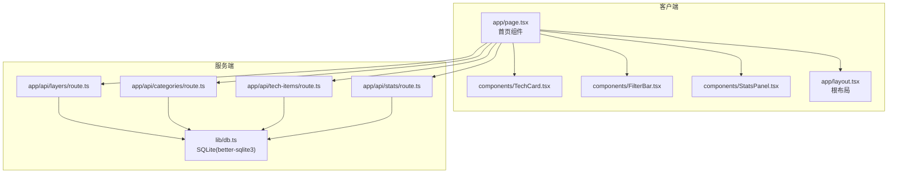
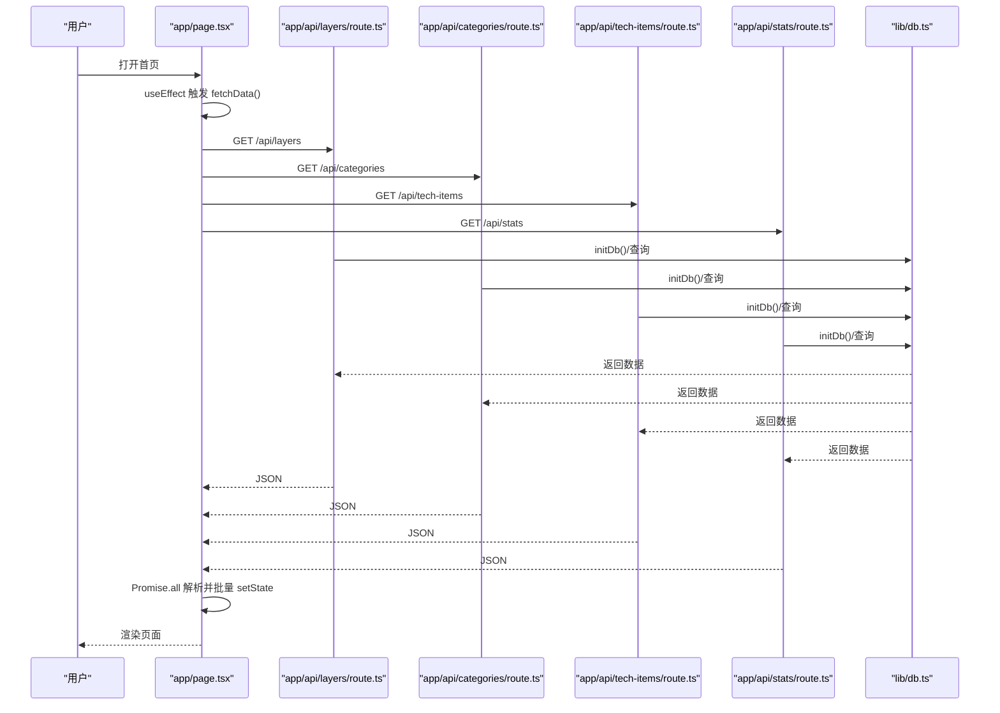
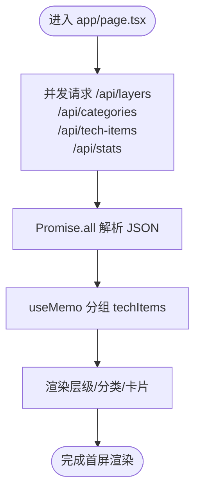
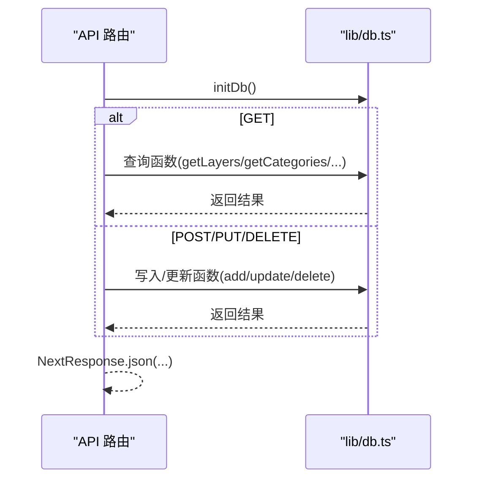
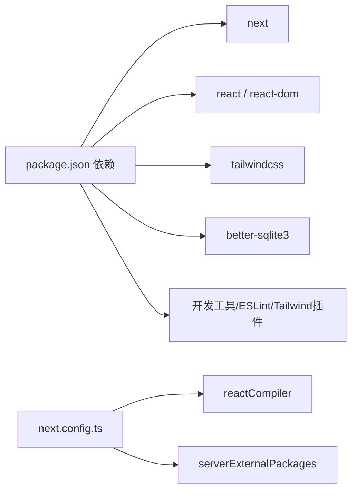

# 性能问题诊断

<cite>
**本文引用的文件**
- [package.json](file://package.json)
- [next.config.ts](file://next.config.ts)
- [lib/db.ts](file://lib/db.ts)
- [app/layout.tsx](file://app/layout.tsx)
- [app/page.tsx](file://app/page.tsx)
- [app/api/layers/route.ts](file://app/api/layers/route.ts)
- [app/api/categories/route.ts](file://app/api/categories/route.ts)
- [app/api/stats/route.ts](file://app/api/stats/route.ts)
- [app/api/tech-items/route.ts](file://app/api/tech-items/route.ts)
- [components/TechCard.tsx](file://components/TechCard.tsx)
- [components/FilterBar.tsx](file://components/FilterBar.tsx)
- [components/StatsPanel.tsx](file://components/StatsPanel.tsx)
- [types/index.ts](file://types/index.ts)
- [lib/seed.ts](file://lib/seed.ts)
- [README.md](file://README.md)
</cite>

## 目录
1. [简介](#简介)
2. [项目结构](#项目结构)
3. [核心组件](#核心组件)
4. [架构总览](#架构总览)
5. [详细组件分析](#详细组件分析)
6. [依赖关系分析](#依赖关系分析)
7. [性能考量](#性能考量)
8. [故障排查指南](#故障排查指南)
9. [结论](#结论)
10. [附录](#附录)

## 简介
本指南聚焦于该 Next.js 应用的性能问题诊断与优化，涵盖页面加载、API 响应、数据库查询、渲染性能、内存泄漏、缓存策略、懒加载与代码分割、以及生产环境监控与告警。文档结合仓库中的实际实现，提供可落地的优化建议与最佳实践。

## 项目结构
项目采用 Next.js App Router 结构，前端页面位于 app 目录，API 路由位于 app/api 下，数据访问封装在 lib/db.ts，组件位于 components 目录，类型定义位于 types/index.ts。整体结构清晰，便于定位性能热点与优化点。

图表来源
- [app/page.tsx](file://app/page.tsx#L1-L238)
- [app/layout.tsx](file://app/layout.tsx#L1-L36)
- [app/api/layers/route.ts](file://app/api/layers/route.ts#L1-L48)
- [app/api/categories/route.ts](file://app/api/categories/route.ts#L1-L48)
- [app/api/tech-items/route.ts](file://app/api/tech-items/route.ts#L1-L50)
- [app/api/stats/route.ts](file://app/api/stats/route.ts#L1-L15)
- [lib/db.ts](file://lib/db.ts#L1-L312)

章节来源
- [README.md](file://README.md#L20-L43)
- [package.json](file://package.json#L1-L43)

## 核心组件
- 首页页面：负责并发拉取多路 API 并进行本地过滤与分组渲染，是页面加载与渲染性能的关键入口。
- API 路由：统一初始化数据库并提供 CRUD 接口，是后端性能与数据库瓶颈的主要承载者。
- 数据库模块：封装 SQLite 访问与事务，直接影响查询与写入性能。
- 组件：TechCard、FilterBar、StatsPanel 等，承担渲染与交互成本。

章节来源
- [app/page.tsx](file://app/page.tsx#L1-L238)
- [app/api/layers/route.ts](file://app/api/layers/route.ts#L1-L48)
- [app/api/categories/route.ts](file://app/api/categories/route.ts#L1-L48)
- [app/api/tech-items/route.ts](file://app/api/tech-items/route.ts#L1-L50)
- [app/api/stats/route.ts](file://app/api/stats/route.ts#L1-L15)
- [lib/db.ts](file://lib/db.ts#L1-L312)
- [components/TechCard.tsx](file://components/TechCard.tsx#L1-L37)
- [components/FilterBar.tsx](file://components/FilterBar.tsx#L1-L52)
- [components/StatsPanel.tsx](file://components/StatsPanel.tsx#L1-L84)

## 架构总览
应用采用“客户端并发请求 + 服务端 SQLite”的轻量架构。页面在初次加载时通过 Promise.all 并发请求四个 API，随后在客户端进行过滤与分组渲染；统计接口按需请求。数据库初始化在每个 API 路由入口执行，保证可用性但可能带来重复初始化开销。

图表来源
- [app/page.tsx](file://app/page.tsx#L39-L63)
- [app/api/layers/route.ts](file://app/api/layers/route.ts#L4-L13)
- [app/api/categories/route.ts](file://app/api/categories/route.ts#L4-L13)
- [app/api/tech-items/route.ts](file://app/api/tech-items/route.ts#L4-L14)
- [app/api/stats/route.ts](file://app/api/stats/route.ts#L4-L14)
- [lib/db.ts](file://lib/db.ts#L14-L50)

## 详细组件分析

### 首页页面性能分析（并发请求与渲染）
- 并发请求：页面在挂载时通过 Promise.all 并发请求四个 API，减少总等待时间，但会同时产生多个网络与数据库查询。
- 本地过滤与分组：使用 useMemo 对 techItems 进行分组，避免每次渲染创建新引用，降低子组件重渲染概率。
- 渲染路径：根据层级与分类进行网格渲染，TechCard 为轻量组件，FilterBar 与 StatsPanel 提供交互与统计展示。

图表来源
- [app/page.tsx](file://app/page.tsx#L39-L88)

章节来源
- [app/page.tsx](file://app/page.tsx#L1-L238)
- [components/TechCard.tsx](file://components/TechCard.tsx#L1-L37)
- [components/FilterBar.tsx](file://components/FilterBar.tsx#L1-L52)
- [components/StatsPanel.tsx](file://components/StatsPanel.tsx#L1-L84)

### API 路由与数据库访问（性能瓶颈定位）
- 路由入口：每个 API 路由在顶部调用 initDb()，确保数据库存在，但可能导致重复初始化。
- 查询实现：各路由调用 lib/db.ts 中对应函数，返回 JSON 响应。
- 数据库事务：批量更新顺序使用 transaction 包裹，减少多次提交开销。

图表来源
- [app/api/layers/route.ts](file://app/api/layers/route.ts#L1-L48)
- [app/api/categories/route.ts](file://app/api/categories/route.ts#L1-L48)
- [app/api/tech-items/route.ts](file://app/api/tech-items/route.ts#L1-L50)
- [app/api/stats/route.ts](file://app/api/stats/route.ts#L1-L15)
- [lib/db.ts](file://lib/db.ts#L14-L50)

章节来源
- [app/api/layers/route.ts](file://app/api/layers/route.ts#L1-L48)
- [app/api/categories/route.ts](file://app/api/categories/route.ts#L1-L48)
- [app/api/tech-items/route.ts](file://app/api/tech-items/route.ts#L1-L50)
- [app/api/stats/route.ts](file://app/api/stats/route.ts#L1-L15)
- [lib/db.ts](file://lib/db.ts#L1-L312)

### 数据库设计与查询优化
- 表结构：layers、categories、tech_items、users 四张表，tech_items 与 categories 存在外键关联。
- 查询模式：按 display_order 排序，使用 prepare + all/get，适合小到中型数据集。
- 优化建议：
  - 为高频查询字段建立索引（如 categories.layer_id、tech_items.category_id、tech_items.status、tech_items.tags）。
  - 将统计查询拆分为更细粒度的缓存或物化视图（当前 getStats 通过 COUNT 聚合计算）。
  - 对批量更新顺序的事务已使用 transaction，可进一步评估是否需要分批提交以避免长事务锁竞争。

章节来源
- [lib/db.ts](file://lib/db.ts#L14-L50)
- [lib/db.ts](file://lib/db.ts#L220-L239)

### 组件渲染与交互
- TechCard：轻量卡片，包含悬停提示，注意大量卡片时的 DOM 数量与事件绑定。
- FilterBar：快速筛选按钮，切换 filter 会触发重新过滤与渲染。
- StatsPanel：统计展示，无交互，渲染成本较低。

章节来源
- [components/TechCard.tsx](file://components/TechCard.tsx#L1-L37)
- [components/FilterBar.tsx](file://components/FilterBar.tsx#L1-L52)
- [components/StatsPanel.tsx](file://components/StatsPanel.tsx#L1-L84)

## 依赖关系分析
- 客户端依赖 Next.js 16、React 19、Tailwind CSS，使用 better-sqlite3 作为数据库驱动。
- next.config.ts 启用 reactCompiler 与 serverExternalPackages，有助于编译期优化与打包体积控制。
- 项目未内置性能监控 SDK，生产环境需自行集成。

图表来源
- [package.json](file://package.json#L12-L36)
- [next.config.ts](file://next.config.ts#L3-L7)

章节来源
- [package.json](file://package.json#L1-L43)
- [next.config.ts](file://next.config.ts#L1-L10)

## 性能考量

### 页面加载性能
- 并发请求：已使用 Promise.all 并发拉取四路数据，有效缩短首屏等待时间。
- 首屏渲染：页面包含多个网格与卡片，建议启用 React 18 的并发特性与 Suspense（若后续引入），并考虑虚拟滚动以减少 DOM 节点数量。
- 字体与样式：根布局去除 Google Fonts，建议预加载关键字体或使用本地字体替代以降低首字节时间。

章节来源
- [app/page.tsx](file://app/page.tsx#L39-L63)
- [app/layout.tsx](file://app/layout.tsx#L6-L14)

### API 响应与数据库查询
- 初始化开销：每个 API 路由均调用 initDb()，存在重复初始化风险。建议在应用启动阶段集中初始化一次，并在路由中复用连接。
- 查询优化：为高频字段添加索引；对统计类查询考虑缓存或物化视图；避免一次性返回过多数据，必要时分页或分片。
- 事务与批量更新：批量顺序更新已使用 transaction，建议评估是否需要分批提交以降低锁持有时间。

章节来源
- [app/api/layers/route.ts](file://app/api/layers/route.ts#L4-L4)
- [app/api/categories/route.ts](file://app/api/categories/route.ts#L4-L4)
- [app/api/tech-items/route.ts](file://app/api/tech-items/route.ts#L4-L4)
- [app/api/stats/route.ts](file://app/api/stats/route.ts#L4-L4)
- [lib/db.ts](file://lib/db.ts#L242-L282)

### 渲染性能与内存泄漏
- 渲染优化：使用 useMemo 对分组数据进行稳定化，避免子组件因引用变化而重渲染；保持组件纯函数式，减少副作用。
- 事件与监听：确认未在组件中遗留定时器、订阅或 DOM 事件监听器；卸载时清理。
- 大列表渲染：当 techItems 数量增长时，建议引入虚拟列表或分页，避免一次性渲染过多节点。

章节来源
- [app/page.tsx](file://app/page.tsx#L26-L34)
- [components/TechCard.tsx](file://components/TechCard.tsx#L1-L37)

### 缓存策略
- 浏览器缓存：当前并发请求使用 { cache: "no-store" }，确保数据实时性但增加网络与数据库压力。建议对只读列表数据采用合理的缓存策略（如 ETag/Last-Modified）。
- 服务端缓存：对统计类数据与静态配置可引入短期缓存（如 Redis），降低数据库查询频率。
- 构建缓存：利用 Next.js 的增量构建与输出缓存，配合 CI/CD 提升构建稳定性。

章节来源
- [app/page.tsx](file://app/page.tsx#L41-L46)

### 懒加载与代码分割
- 组件懒加载：对非首屏使用的组件（如管理后台相关）采用动态导入，减少首屏 JS 体积。
- 图片与媒体：对图片资源使用现代格式与合适的尺寸，结合占位符与懒加载。
- Next.js 自动分割：利用 App Router 的路由级分割，按需加载页面与组件。

章节来源
- [app/page.tsx](file://app/page.tsx#L8-L12)

### 生产环境监控与告警
- 前端监控：集成前端错误监控（如 Sentry）与性能指标（如 Core Web Vitals）。
- 后端监控：记录 API 延迟、错误率与数据库慢查询日志；对关键路径埋点。
- 告警策略：针对首屏时间、API 延迟、数据库连接数与慢查询设置阈值告警。

章节来源
- [README.md](file://README.md#L164-L234)

## 故障排查指南

### 页面加载缓慢
- 检查网络：确认并发请求是否被阻塞，是否存在跨域或代理问题。
- 检查数据库：确认 initDb() 是否重复执行，查询是否缺少索引。
- 检查渲染：确认是否存在大量节点与复杂计算，考虑虚拟滚动与 useMemo。

章节来源
- [app/page.tsx](file://app/page.tsx#L39-L63)
- [lib/db.ts](file://lib/db.ts#L14-L50)

### API 响应超时
- 排查路由：确认路由是否正确调用 initDb()，查询是否阻塞。
- 排查数据库：检查慢查询与锁竞争，评估索引与事务大小。
- 排查缓存：对只读数据引入短期缓存，减少数据库压力。

章节来源
- [app/api/layers/route.ts](file://app/api/layers/route.ts#L4-L13)
- [app/api/categories/route.ts](file://app/api/categories/route.ts#L4-L13)
- [app/api/tech-items/route.ts](file://app/api/tech-items/route.ts#L4-L14)
- [app/api/stats/route.ts](file://app/api/stats/route.ts#L4-L14)
- [lib/db.ts](file://lib/db.ts#L242-L282)

### 数据库查询效率低
- 建立索引：为高频过滤字段（如 categories.layer_id、tech_items.category_id/status/tags）添加索引。
- 分页与分片：对大列表采用分页或分片，避免一次性返回过多数据。
- 事务优化：批量更新已使用事务，评估是否需要分批提交。

章节来源
- [lib/db.ts](file://lib/db.ts#L14-L50)
- [lib/db.ts](file://lib/db.ts#L242-L282)

### 内存泄漏检测
- 使用浏览器开发者工具的 Memory 面板进行快照对比，定位未释放的对象。
- 检查组件生命周期，确保清理定时器、订阅与事件监听器。
- 关注大量卡片渲染场景，避免闭包与事件对象累积。

章节来源
- [components/TechCard.tsx](file://components/TechCard.tsx#L1-L37)
- [app/page.tsx](file://app/page.tsx#L1-L238)

### 缓存与懒加载配置
- 浏览器缓存：对只读数据采用合理缓存策略，避免每次请求都走后端。
- 服务端缓存：对统计类数据引入短期缓存，降低数据库压力。
- 代码分割：对非首屏组件使用动态导入，减少首屏 JS 体积。

章节来源
- [app/page.tsx](file://app/page.tsx#L41-L46)

## 结论
本项目采用轻量的前后端分离架构，页面并发请求与本地渲染组合提供了较好的首屏体验。为进一步提升性能，建议从数据库索引、缓存策略、懒加载与代码分割、以及生产监控与告警等方面入手，形成系统化的性能优化闭环。

## 附录

### 性能分析工具使用建议
- Chrome DevTools：使用 Performance 面板录制首屏渲染，Network 面板分析 API 延迟与缓存命中；使用 Lighthouse 生成性能报告。
- Next.js 性能监控：结合构建产物分析与路由级分割效果，关注静态化与预渲染收益。
- 数据库分析：开启 SQLite 慢查询日志，定位耗时 SQL 并建立索引。

章节来源
- [README.md](file://README.md#L1-L239)