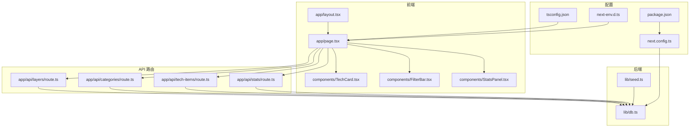
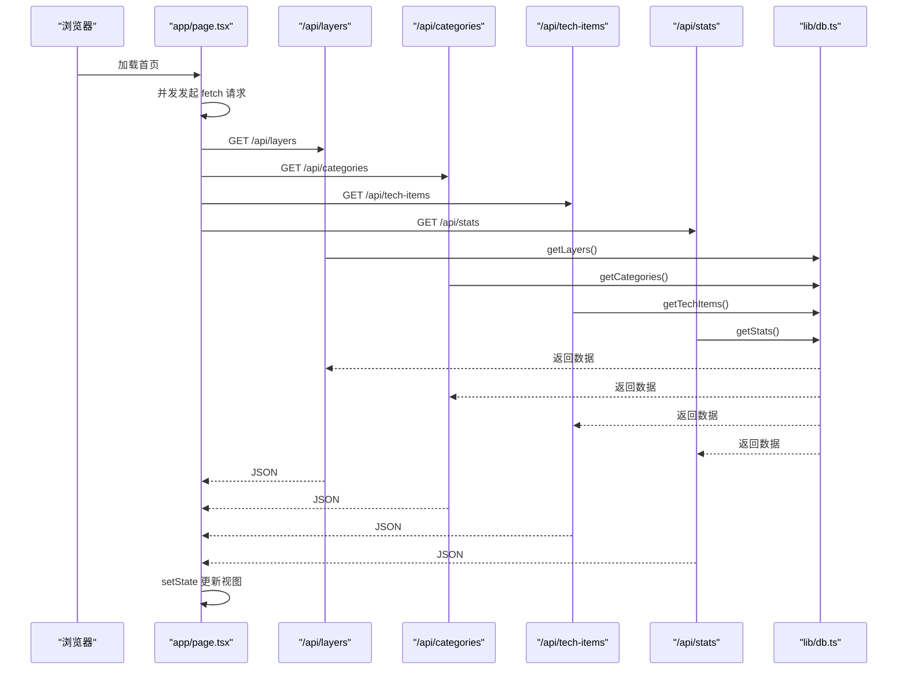
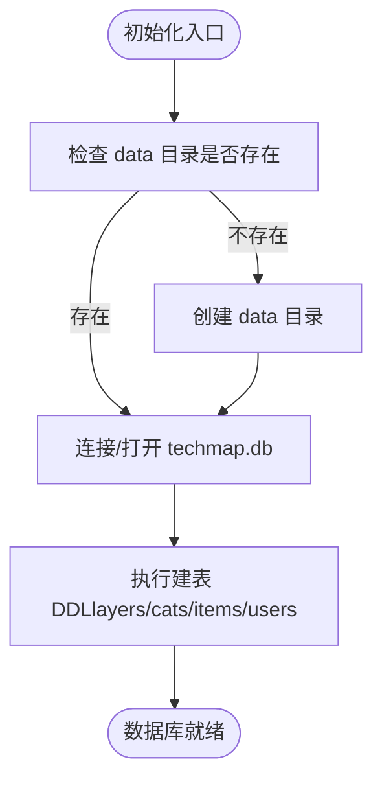
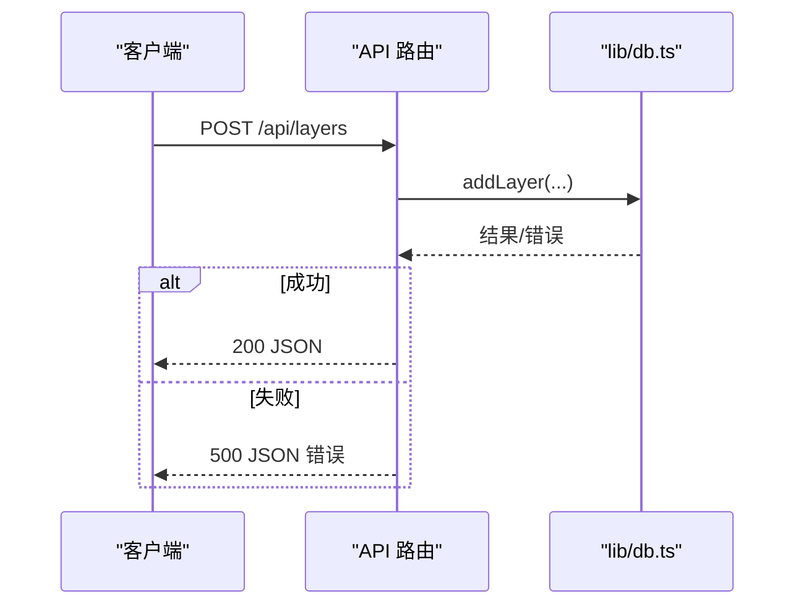
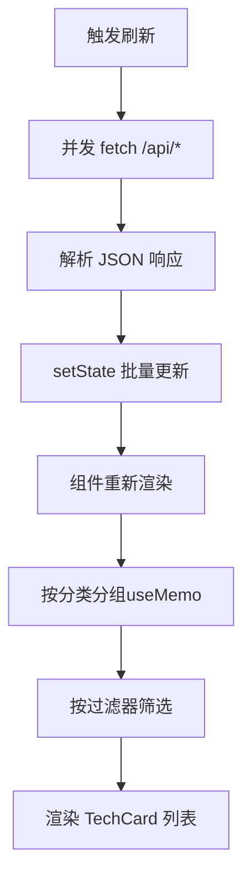
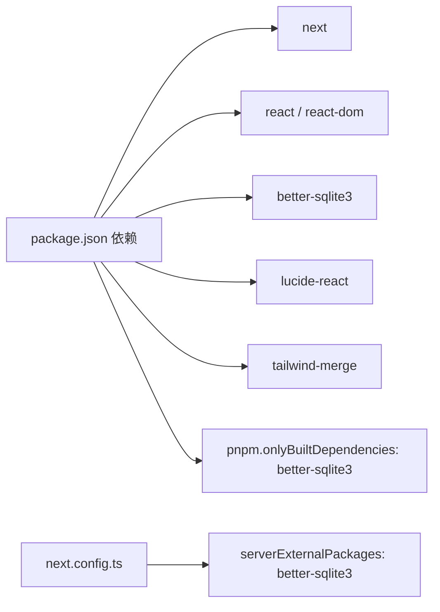

# 故障排除

<cite>
**本文引用的文件**
- [package.json](file://package.json)
- [next.config.ts](file://next.config.ts)
- [lib/db.ts](file://lib/db.ts)
- [app/api/layers/route.ts](file://app/api/layers/route.ts)
- [app/api/categories/route.ts](file://app/api/categories/route.ts)
- [app/api/tech-items/route.ts](file://app/api/tech-items/route.ts)
- [app/api/stats/route.ts](file://app/api/stats/route.ts)
- [lib/seed.ts](file://lib/seed.ts)
- [app/layout.tsx](file://app/layout.tsx)
- [app/page.tsx](file://app/page.tsx)
- [components/TechCard.tsx](file://components/TechCard.tsx)
- [components/FilterBar.tsx](file://components/FilterBar.tsx)
- [components/StatsPanel.tsx](file://components/StatsPanel.tsx)
- [types/index.ts](file://types/index.ts)
- [README.md](file://README.md)
- [tsconfig.json](file://tsconfig.json)
- [next-env.d.ts](file://next-env.d.ts)
</cite>

## 目录
1. [简介](#简介)
2. [项目结构](#项目结构)
3. [核心组件](#核心组件)
4. [架构总览](#架构总览)
5. [详细组件分析](#详细组件分析)
6. [依赖关系分析](#依赖关系分析)
7. [性能考虑](#性能考虑)
8. [故障排除指南](#故障排除指南)
9. [结论](#结论)
10. [附录](#附录)

## 简介
本指南面向不同技术水平的用户，系统化梳理 Lantu Next 在开发、部署与运行阶段可能遇到的常见问题与解决方案，涵盖数据库连接问题、API 接口错误、前端渲染异常、性能瓶颈、日志分析与错误追踪、环境兼容性与依赖冲突、版本不匹配等。文档同时提供调试流程与工具使用建议，帮助快速定位与解决问题。

## 项目结构
Lantu Next 是一个基于 Next.js App Router 的前端应用，采用 TypeScript、Tailwind CSS 与 SQLite 存储。核心模块包括：
- API 路由：/api/layers、/api/categories、/api/tech-items、/api/stats
- 数据库封装：lib/db.ts（better-sqlite3）
- 初始化脚本：lib/seed.ts
- 前端页面与组件：app/page.tsx、components/*、app/layout.tsx
- 类型定义：types/index.ts
- 构建与运行配置：next.config.ts、package.json、tsconfig.json、next-env.d.ts

图表来源
- [app/page.tsx](file://app/page.tsx#L39-L68)
- [app/api/layers/route.ts](file://app/api/layers/route.ts#L1-L48)
- [app/api/categories/route.ts](file://app/api/categories/route.ts#L1-L48)
- [app/api/tech-items/route.ts](file://app/api/tech-items/route.ts#L1-L50)
- [app/api/stats/route.ts](file://app/api/stats/route.ts#L1-L15)
- [lib/db.ts](file://lib/db.ts#L1-L312)
- [lib/seed.ts](file://lib/seed.ts#L1-L800)
- [next.config.ts](file://next.config.ts#L1-L10)
- [package.json](file://package.json#L1-L43)
- [tsconfig.json](file://tsconfig.json#L1-L35)
- [next-env.d.ts](file://next-env.d.ts#L1-L7)

章节来源
- [README.md](file://README.md#L20-L43)
- [package.json](file://package.json#L1-L43)
- [next.config.ts](file://next.config.ts#L1-L10)
- [tsconfig.json](file://tsconfig.json#L1-L35)
- [next-env.d.ts](file://next-env.d.ts#L1-L7)

## 核心组件
- 数据库层：负责表初始化、CRUD 操作、批量排序更新、统计查询、用户管理等。关键点：数据库路径、事务、约束校验、初始化调用时机。
- API 路由层：统一初始化数据库，暴露 GET/POST/PUT/DELETE 接口；对异常进行捕获并返回标准化错误响应。
- 前端页面与组件：Home 页面并发拉取四类数据，使用 useMemo 优化渲染；组件负责展示与交互。
- 配置层：Next.js 配置启用 React Compiler 与外部包声明；package.json 定义脚本与 pnpm 仅编译依赖。

章节来源
- [lib/db.ts](file://lib/db.ts#L14-L50)
- [app/api/layers/route.ts](file://app/api/layers/route.ts#L4-L48)
- [app/api/categories/route.ts](file://app/api/categories/route.ts#L4-L48)
- [app/api/tech-items/route.ts](file://app/api/tech-items/route.ts#L4-L50)
- [app/api/stats/route.ts](file://app/api/stats/route.ts#L4-L15)
- [app/page.tsx](file://app/page.tsx#L39-L68)
- [next.config.ts](file://next.config.ts#L3-L7)
- [package.json](file://package.json#L5-L11)

## 架构总览
前端通过 fetch 并发请求四个 API，分别获取层级、分类、技术项与统计；API 路由层调用数据库封装执行 SQL；数据库封装基于 better-sqlite3，使用本地 data/techmap.db 文件。

图表来源
- [app/page.tsx](file://app/page.tsx#L39-L68)
- [app/api/layers/route.ts](file://app/api/layers/route.ts#L6-L13)
- [app/api/categories/route.ts](file://app/api/categories/route.ts#L6-L13)
- [app/api/tech-items/route.ts](file://app/api/tech-items/route.ts#L7-L14)
- [app/api/stats/route.ts](file://app/api/stats/route.ts#L6-L10)
- [lib/db.ts](file://lib/db.ts#L53-L57)
- [lib/db.ts](file://lib/db.ts#L79-L85)
- [lib/db.ts](file://lib/db.ts#L108-L114)
- [lib/db.ts](file://lib/db.ts#L220-L239)

## 详细组件分析

### 数据库层（lib/db.ts）
- 初始化：自动创建 data 目录与 techmap.db 文件，执行多表建表语句（categories、tech_items、layers、users），含主外键与 CHECK 约束。
- 查询与变更：提供 getLayers、getCategories、getTechItems、getStats 等；支持 add/update/delete；支持批量排序更新与清库。
- 事务：批量更新与清库使用事务，保证一致性。
- 用户：提供 getUser/addUser，供种子脚本使用。

图表来源
- [lib/db.ts](file://lib/db.ts#L5-L11)
- [lib/db.ts](file://lib/db.ts#L14-L50)

章节来源
- [lib/db.ts](file://lib/db.ts#L1-L312)

### API 路由层（/api/*）
- 统一初始化：每个路由在模块顶层调用 initDb，确保数据库可用。
- 异常处理：try/catch 包裹业务逻辑，捕获错误后返回 500 与错误信息；部分路由对必填参数进行显式校验（如删除时要求 id）。
- 方法映射：GET/POST/PUT/DELETE 对应查询/新增/更新/删除。

图表来源
- [app/api/layers/route.ts](file://app/api/layers/route.ts#L15-L23)
- [app/api/layers/route.ts](file://app/api/layers/route.ts#L25-L33)
- [app/api/layers/route.ts](file://app/api/layers/route.ts#L35-L47)
- [lib/db.ts](file://lib/db.ts#L117-L122)

章节来源
- [app/api/layers/route.ts](file://app/api/layers/route.ts#L1-L48)
- [app/api/categories/route.ts](file://app/api/categories/route.ts#L1-L48)
- [app/api/tech-items/route.ts](file://app/api/tech-items/route.ts#L1-L50)
- [app/api/stats/route.ts](file://app/api/stats/route.ts#L1-L15)

### 前端页面与组件（app/page.tsx 与 components/*）
- 并发数据拉取：Promise.all 并发请求四个 API，避免串行导致的等待时间过长。
- 渲染优化：使用 useMemo 将 techItems 按 category_id 分组，降低子组件重渲染频率。
- 过滤与展示：FilterBar 提供多种过滤条件；TechCard 根据状态与优先级渲染样式；StatsPanel 展示统计。
- 图标动态解析：根据字符串尝试从 lucide-react 解析图标组件。

图表来源
- [app/page.tsx](file://app/page.tsx#L39-L68)
- [app/page.tsx](file://app/page.tsx#L26-L34)
- [components/FilterBar.tsx](file://components/FilterBar.tsx#L6-L17)
- [components/TechCard.tsx](file://components/TechCard.tsx#L7-L19)

章节来源
- [app/page.tsx](file://app/page.tsx#L1-L238)
- [components/FilterBar.tsx](file://components/FilterBar.tsx#L1-L52)
- [components/TechCard.tsx](file://components/TechCard.tsx#L1-L37)
- [components/StatsPanel.tsx](file://components/StatsPanel.tsx#L1-L84)
- [types/index.ts](file://types/index.ts#L1-L34)

## 依赖关系分析
- 运行时依赖：Next.js、React、better-sqlite3、lucide-react、tailwind-merge 等。
- 开发依赖：TypeScript、ESLint、TailwindCSS、tsx 等。
- Next.js 配置：启用 React Compiler；声明 better-sqlite3 为外部包，避免打包。
- pnpm 配置：仅对 better-sqlite3 进行编译，减少安装与构建时间。

图表来源
- [package.json](file://package.json#L12-L41)
- [next.config.ts](file://next.config.ts#L3-L7)

章节来源
- [package.json](file://package.json#L1-L43)
- [next.config.ts](file://next.config.ts#L1-L10)

## 性能考虑
- 前端渲染优化：useMemo 避免每次渲染都重建分组映射；并发请求减少首屏等待。
- 数据库事务：批量更新与清库使用事务，降低锁竞争与 IO 次数。
- 缓存策略：页面 fetch 显式设置 no-store，避免缓存干扰开发期数据变化。
- 构建优化：启用 React Compiler 与外部包声明，缩短构建时间并减小包体。

章节来源
- [app/page.tsx](file://app/page.tsx#L26-L34)
- [lib/db.ts](file://lib/db.ts#L242-L282)
- [next.config.ts](file://next.config.ts#L3-L7)

## 故障排除指南

### 一、数据库连接与初始化问题
- 症状
  - 首次运行无数据或报错
  - 数据库文件无法读写
  - API 调用失败且无明确错误
- 诊断步骤
  - 确认 data 目录存在且可写
  - 确认 techmap.db 文件已生成
  - 确认 initDb 在路由与页面加载前被调用
  - 检查数据库表是否正确创建（layers/cats/items/users）
- 解决方案
  - 手动创建 data 目录或允许程序自动创建
  - 运行初始化脚本以重建表结构与示例数据
  - 若修改了表结构，删除 techmap.db 后重新 seed
  - 确保运行用户对 data/techmap.db 具有读写权限
- 相关实现参考
  - 数据库初始化与建表：[lib/db.ts](file://lib/db.ts#L5-L11), [lib/db.ts](file://lib/db.ts#L14-L50)
  - 初始化脚本：[lib/seed.ts](file://lib/seed.ts#L10-L13)
  - API 路由初始化：[app/api/layers/route.ts](file://app/api/layers/route.ts#L4), [app/api/categories/route.ts](file://app/api/categories/route.ts#L4), [app/api/tech-items/route.ts](file://app/api/tech-items/route.ts#L4-L6), [app/api/stats/route.ts](file://app/api/stats/route.ts#L4)

章节来源
- [lib/db.ts](file://lib/db.ts#L5-L11)
- [lib/db.ts](file://lib/db.ts#L14-L50)
- [lib/seed.ts](file://lib/seed.ts#L10-L13)
- [app/api/layers/route.ts](file://app/api/layers/route.ts#L4)
- [app/api/categories/route.ts](file://app/api/categories/route.ts#L4)
- [app/api/tech-items/route.ts](file://app/api/tech-items/route.ts#L4-L6)
- [app/api/stats/route.ts](file://app/api/stats/route.ts#L4)

### 二、API 接口错误
- 症状
  - 400：缺少必需参数（如删除时未传 id）
  - 500：服务器内部错误
  - CORS/跨域问题（部署后）
- 诊断步骤
  - 检查请求方法与路径是否匹配
  - 检查请求体格式（JSON）与字段完整性
  - 查看后端日志中的错误堆栈
  - 确认 initDb 是否在模块加载时执行
- 解决方案
  - 补充缺失参数或修正请求体
  - 在路由中增加参数校验与更友好的错误提示
  - 统一异常处理，记录错误详情并返回稳定格式
  - 部署后如遇跨域，检查反向代理与请求头配置
- 相关实现参考
  - 参数校验与错误处理：[app/api/tech-items/route.ts](file://app/api/tech-items/route.ts#L37-L48), [app/api/categories/route.ts](file://app/api/categories/route.ts#L35-L47)
  - 统一异常捕获：[app/api/layers/route.ts](file://app/api/layers/route.ts#L10-L12), [app/api/stats/route.ts](file://app/api/stats/route.ts#L10-L13)

章节来源
- [app/api/tech-items/route.ts](file://app/api/tech-items/route.ts#L37-L48)
- [app/api/categories/route.ts](file://app/api/categories/route.ts#L35-L47)
- [app/api/layers/route.ts](file://app/api/layers/route.ts#L10-L12)
- [app/api/stats/route.ts](file://app/api/stats/route.ts#L10-L13)

### 三、前端渲染异常
- 症状
  - 页面空白或白屏
  - 技术项不显示或显示异常
  - 过滤无效或报错
- 诊断步骤
  - 检查网络面板：确认 /api/* 请求成功返回 JSON
  - 检查控制台错误：类型不匹配、图标名解析失败
  - 检查数据结构：确认返回字段与 types/index.ts 定义一致
  - 检查并发请求是否全部完成
- 解决方案
  - 修复类型不匹配问题，确保字段与接口一致
  - 修正图标名或提供回退显示
  - 确保所有 API 响应均能被解析为 JSON
  - 为异常分支添加占位或提示
- 相关实现参考
  - 并发请求与状态更新：[app/page.tsx](file://app/page.tsx#L39-L68)
  - 图标动态解析：[app/page.tsx](file://app/page.tsx#L94-L99)
  - 类型定义：[types/index.ts](file://types/index.ts#L1-L34)

章节来源
- [app/page.tsx](file://app/page.tsx#L39-L68)
- [app/page.tsx](file://app/page.tsx#L94-L99)
- [types/index.ts](file://types/index.ts#L1-L34)

### 四、性能瓶颈
- 症状
  - 首屏加载慢
  - 列表滚动卡顿
  - 大量数据时内存占用高
- 诊断步骤
  - 使用浏览器性能面板观察主线程阻塞
  - 检查是否有重复渲染与对象重建
  - 检查数据库查询是否高效（索引、排序字段）
- 解决方案
  - 保持现有 useMemo 优化，避免在渲染期间创建新对象
  - 控制一次性渲染的数据量，必要时分页或虚拟化
  - 优化数据库查询与排序逻辑，减少不必要的 JOIN
- 相关实现参考
  - 渲染优化：[app/page.tsx](file://app/page.tsx#L26-L34)
  - 批量排序更新：[lib/db.ts](file://lib/db.ts#L242-L282)

章节来源
- [app/page.tsx](file://app/page.tsx#L26-L34)
- [lib/db.ts](file://lib/db.ts#L242-L282)

### 五、日志分析与错误追踪
- 日志位置
  - 开发：Next.js 控制台输出
  - 生产：PM2 日志（若使用）、系统日志
- 常见错误模式
  - 数据库连接失败：检查 data 目录权限与 techmap.db 文件
  - API 500：查看后端异常堆栈与数据库约束错误
  - 前端 JSON 解析失败：检查请求体格式与字段命名
- 工具建议
  - 浏览器 Network 面板：抓取请求与响应
  - 浏览器 Console 面板：查看运行时错误
  - PM2 日志：查看生产环境错误堆栈
- 相关实现参考
  - 统一错误返回：[app/api/layers/route.ts](file://app/api/layers/route.ts#L10-L12), [app/api/stats/route.ts](file://app/api/stats/route.ts#L11-L13)

章节来源
- [app/api/layers/route.ts](file://app/api/layers/route.ts#L10-L12)
- [app/api/stats/route.ts](file://app/api/stats/route.ts#L11-L13)

### 六、环境兼容性与依赖冲突
- 症状
  - 安装失败或构建失败
  - better-sqlite3 编译失败
  - Next.js 版本与依赖不兼容
- 诊断步骤
  - 检查 Node.js 版本是否满足要求
  - 检查 pnpm 与 npm 的一致性
  - 检查 next.config.ts 中 external packages 配置
- 解决方案
  - 使用推荐的 Node.js 版本
  - 使用 pnpm 并遵循 onlyBuiltDependencies 配置
  - 升级到兼容的 Next.js 版本
- 相关实现参考
  - 依赖与脚本：[package.json](file://package.json#L12-L41)
  - 外部包声明：[next.config.ts](file://next.config.ts#L6)
  - 版本说明：[README.md](file://README.md#L170-L172)

章节来源
- [package.json](file://package.json#L12-L41)
- [next.config.ts](file://next.config.ts#L6)
- [README.md](file://README.md#L170-L172)

### 七、版本不匹配与迁移
- 症状
  - 数据库结构变更后数据不一致
  - 新增字段导致旧版数据异常
- 诊断步骤
  - 比对 lib/db.ts 中的建表语句与实际表结构
  - 检查 seed 脚本是否与最新结构一致
- 解决方案
  - 删除 techmap.db 后重新 seed
  - 在迁移文档中记录结构变更与回滚步骤
- 相关实现参考
  - 建表与迁移：[lib/db.ts](file://lib/db.ts#L14-L50)
  - 数据初始化：[lib/seed.ts](file://lib/seed.ts#L10-L13)
  - 迁移说明：[README.md](file://README.md#L156-L163)

章节来源
- [lib/db.ts](file://lib/db.ts#L14-L50)
- [lib/seed.ts](file://lib/seed.ts#L10-L13)
- [README.md](file://README.md#L156-L163)

### 八、部署与运行问题
- 症状
  - 启动后无法访问或端口冲突
  - PM2 启动失败或进程退出
  - Nginx 反代 404/502
- 诊断步骤
  - 检查端口占用与防火墙
  - 检查 PM2 应用状态与日志
  - 检查 Nginx upstream 与 proxy_pass 配置
- 解决方案
  - 修改端口或释放占用端口
  - 使用 PM2 启动并保存配置
  - 正确配置 Nginx 反向代理
- 相关实现参考
  - 默认端口与脚本：[package.json](file://package.json#L6)
  - PM2 启动命令：[README.md](file://README.md#L197-L208)
  - Nginx 反代配置：[README.md](file://README.md#L210-L228)

章节来源
- [package.json](file://package.json#L6)
- [README.md](file://README.md#L197-L208)
- [README.md](file://README.md#L210-L228)

## 结论
本指南围绕 Lantu Next 的数据库、API、前端与部署等关键环节，提供了系统化的故障排除方法与实践建议。建议在开发与生产环境中遵循统一的日志规范、参数校验与异常处理策略，并结合性能优化手段（并发请求、memo 化、事务）提升用户体验与稳定性。

## 附录
- 快速检查清单
  - 数据库：data 目录存在、techmap.db 可读写、表结构正确
  - API：路由初始化正常、参数校验完备、异常处理统一
  - 前端：并发请求成功、类型定义一致、渲染优化生效
  - 部署：端口可用、PM2 运行正常、Nginx 反代正确
- 常用命令参考
  - 初始化数据库：[README.md](file://README.md#L53-L59)
  - 启动开发：[README.md](file://README.md#L61-L67)
  - 构建与启动：[README.md](file://README.md#L141-L147)
  - PM2 启动：[README.md](file://README.md#L197-L208)