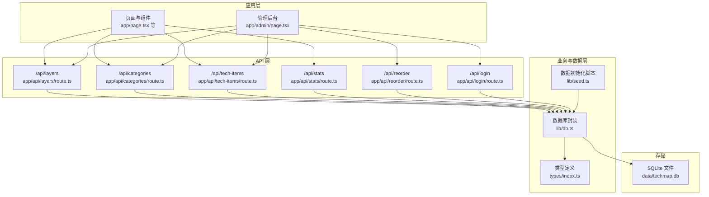
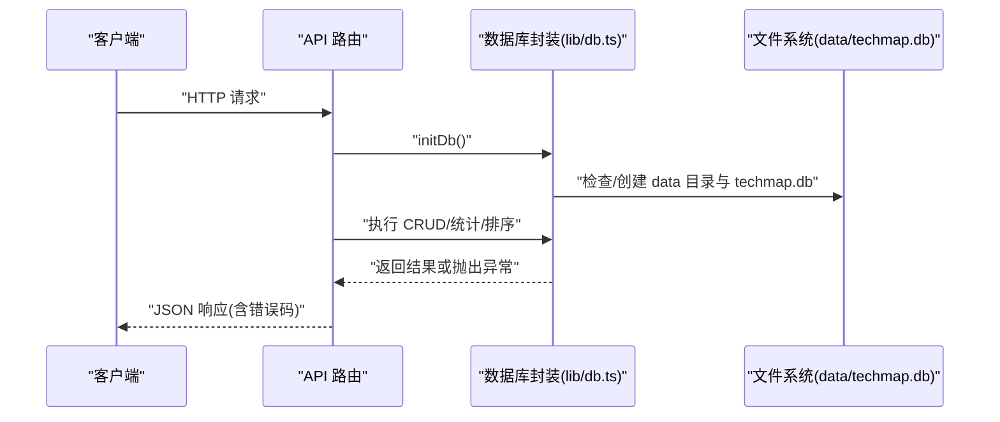
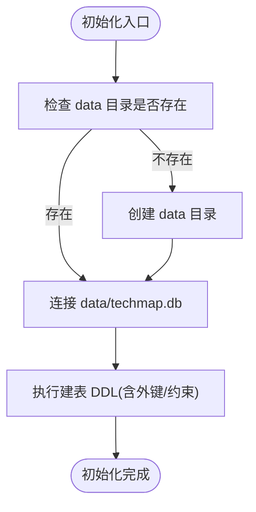
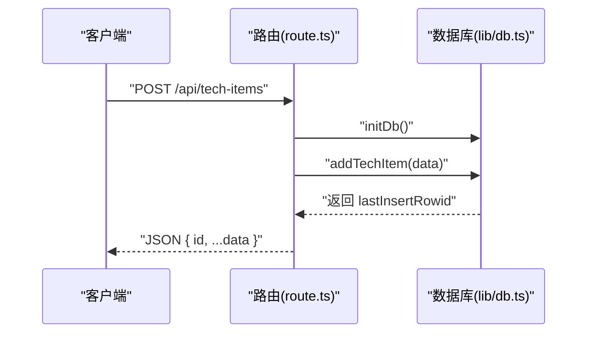
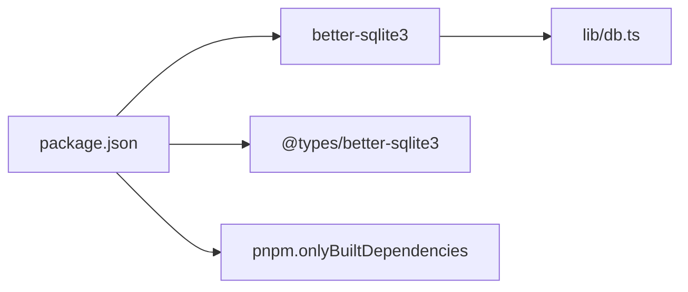
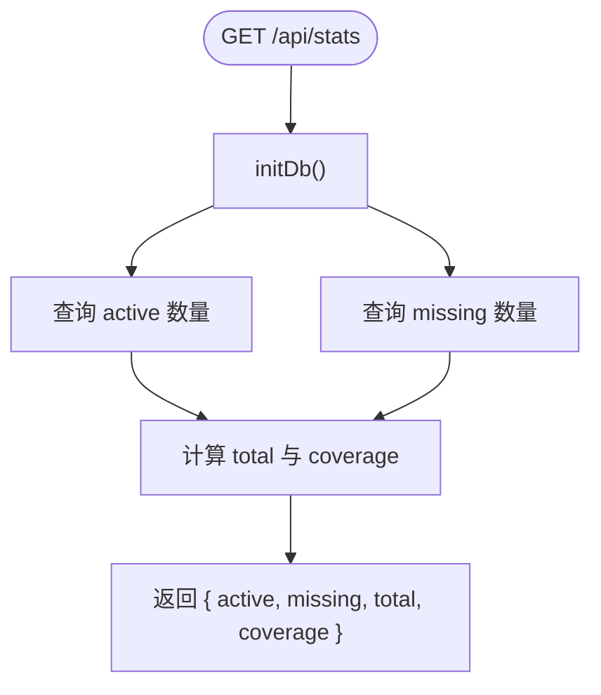
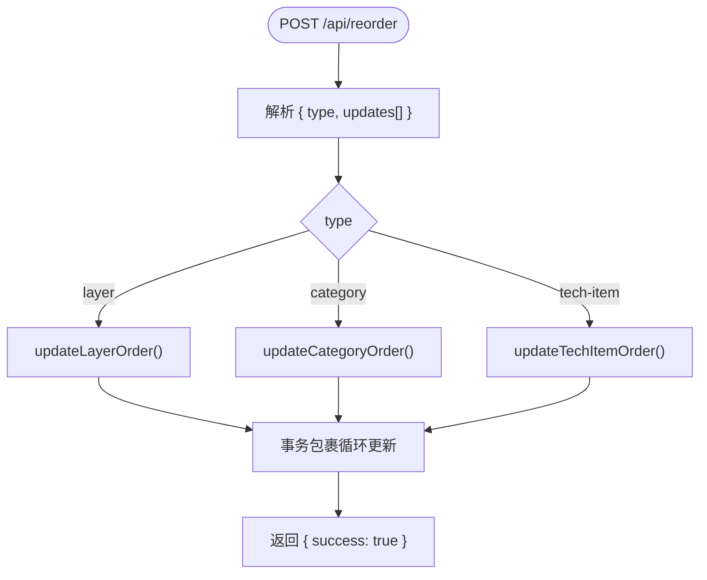

# 数据库问题排查

<cite>
**本文引用的文件**
- [lib/db.ts](file://lib/db.ts)
- [lib/seed.ts](file://lib/seed.ts)
- [app/api/layers/route.ts](file://app/api/layers/route.ts)
- [app/api/categories/route.ts](file://app/api/categories/route.ts)
- [app/api/tech-items/route.ts](file://app/api/tech-items/route.ts)
- [app/api/stats/route.ts](file://app/api/stats/route.ts)
- [app/api/reorder/route.ts](file://app/api/reorder/route.ts)
- [app/api/login/route.ts](file://app/api/login/route.ts)
- [types/index.ts](file://types/index.ts)
- [PROJECT_MIGRATION.md](file://PROJECT_MIGRATION.md)
- [README.md](file://README.md)
- [package.json](file://package.json)
</cite>

## 目录
1. [简介](#简介)
2. [项目结构](#项目结构)
3. [核心组件](#核心组件)
4. [架构总览](#架构总览)
5. [详细组件分析](#详细组件分析)
6. [依赖关系分析](#依赖关系分析)
7. [性能考虑](#性能考虑)
8. [故障排查指南](#故障排查指南)
9. [结论](#结论)
10. [附录](#附录)

## 简介
本指南聚焦于 SQLite 数据库在本项目中的常见问题排查与运维实践，围绕连接失败、表结构不匹配、数据初始化错误、权限不足、数据库文件完整性、表结构一致性、数据库锁定与并发访问、备份恢复、数据迁移与版本升级、性能优化与监控指标，以及 better-sqlite3 驱动的特殊注意事项与最佳实践展开。文档同时结合实际源码路径，帮助开发者快速定位与解决问题。

## 项目结构
本项目采用 Next.js App Router，数据库操作集中在 lib/db.ts，API 路由位于 app/api/*，类型定义位于 types/index.ts，数据初始化脚本位于 lib/seed.ts，数据库文件位于 data/techmap.db。

**图表来源**
- [lib/db.ts](file://lib/db.ts#L1-L312)
- [lib/seed.ts](file://lib/seed.ts#L1-L840)
- [app/api/layers/route.ts](file://app/api/layers/route.ts#L1-L48)
- [app/api/categories/route.ts](file://app/api/categories/route.ts#L1-L48)
- [app/api/tech-items/route.ts](file://app/api/tech-items/route.ts#L1-L50)
- [app/api/stats/route.ts](file://app/api/stats/route.ts#L1-L15)
- [app/api/reorder/route.ts](file://app/api/reorder/route.ts#L1-L39)
- [app/api/login/route.ts](file://app/api/login/route.ts#L1-L20)
- [types/index.ts](file://types/index.ts#L1-L34)

**章节来源**
- [README.md](file://README.md#L20-L43)
- [PROJECT_MIGRATION.md](file://PROJECT_MIGRATION.md#L34-L46)

## 核心组件
- 数据库封装与初始化：负责数据库连接、表结构初始化、CRUD 操作、事务与统计查询等。
- API 路由：各模块的 HTTP 接口，统一调用数据库封装。
- 类型定义：约束请求/响应字段，保证前后端一致。
- 数据初始化脚本：清理旧数据、插入示例数据、建立管理员账户。

关键职责与入口：
- 初始化与连接：在 lib/db.ts 中创建数据库实例并执行初始化 SQL。
- API 路由入口：在各 route.ts 中调用 initDb 并执行对应业务函数。
- 类型约束：在 types/index.ts 中定义 Layer、Category、TechItem、Stats 接口。

**章节来源**
- [lib/db.ts](file://lib/db.ts#L1-L50)
- [app/api/layers/route.ts](file://app/api/layers/route.ts#L4-L4)
- [app/api/categories/route.ts](file://app/api/categories/route.ts#L4-L4)
- [app/api/tech-items/route.ts](file://app/api/tech-items/route.ts#L4-L5)
- [types/index.ts](file://types/index.ts#L1-L34)

## 架构总览
下图展示了从 API 请求到数据库操作的关键流程，以及错误处理与事务使用的要点。

**图表来源**
- [lib/db.ts](file://lib/db.ts#L5-L11)
- [app/api/layers/route.ts](file://app/api/layers/route.ts#L4-L4)
- [app/api/categories/route.ts](file://app/api/categories/route.ts#L4-L4)
- [app/api/tech-items/route.ts](file://app/api/tech-items/route.ts#L4-L5)

## 详细组件分析

### 数据库封装与初始化
- 初始化流程：创建 data 目录，连接 data/techmap.db，执行多表创建语句（layers、categories、tech_items、users）。
- 表结构要点：外键约束、CHECK 约束、自增主键、显示顺序字段等。
- 事务与批量更新：提供事务包装的批量排序更新，减少锁竞争。
- 统计查询：按状态统计 active/missing 数量与覆盖率。
- 用户管理：简单用户名密码校验接口。

**图表来源**
- [lib/db.ts](file://lib/db.ts#L5-L11)
- [lib/db.ts](file://lib/db.ts#L14-L49)

**章节来源**
- [lib/db.ts](file://lib/db.ts#L1-L312)

### API 路由与数据库交互
- 层级 API：GET/POST/PUT/DELETE，统一调用 initDb() 与对应 CRUD 函数。
- 分类 API：GET/POST/PUT/DELETE，统一调用 initDb() 与对应 CRUD 函数。
- 技术项 API：GET/POST/PUT/DELETE，统一调用 initDb() 与对应 CRUD 函数。
- 统计 API：GET，返回 active/missing/total/coverage。
- 排序 API：POST，根据 type 调用不同批量排序函数。
- 登录 API：POST，简单用户名密码校验。

**图表来源**
- [app/api/tech-items/route.ts](file://app/api/tech-items/route.ts#L16-L23)
- [lib/db.ts](file://lib/db.ts#L137-L162)

**章节来源**
- [app/api/layers/route.ts](file://app/api/layers/route.ts#L1-L48)
- [app/api/categories/route.ts](file://app/api/categories/route.ts#L1-L48)
- [app/api/tech-items/route.ts](file://app/api/tech-items/route.ts#L1-L50)
- [app/api/stats/route.ts](file://app/api/stats/route.ts#L1-L15)
- [app/api/reorder/route.ts](file://app/api/reorder/route.ts#L1-L39)
- [app/api/login/route.ts](file://app/api/login/route.ts#L1-L20)

### 类型定义与一致性
- Layer、Category、TechItem、Stats 接口明确字段与取值范围，有助于前端与后端保持一致。
- 建议在数据库变更时同步更新类型定义，避免运行期类型不匹配。

**章节来源**
- [types/index.ts](file://types/index.ts#L1-L34)

## 依赖关系分析
- better-sqlite3：作为 SQLite 驱动，负责连接与执行 SQL。
- pnpm 配置：仅构建 better-sqlite3，避免跨平台编译问题。
- 依赖声明：包含 better-sqlite3 与 @types/better-sqlite3。

**图表来源**
- [package.json](file://package.json#L12-L41)
- [lib/db.ts](file://lib/db.ts#L1-L1)

**章节来源**
- [package.json](file://package.json#L12-L41)

## 性能考虑
- 连接与文件系统：better-sqlite3 为本地文件数据库，避免网络延迟；注意磁盘 I/O 与文件锁。
- 事务批处理：批量排序使用事务包裹，减少锁持有时间，提升吞吐。
- 查询索引：当前未见显式索引，若查询量增大，可在高频过滤/排序字段上评估索引。
- 并发写入：SQLite 不支持高并发写入，建议在高并发场景迁移到 PostgreSQL 等。
- 统计查询：统计逻辑在应用侧聚合，避免复杂 JOIN，保持查询简洁。

**章节来源**
- [lib/db.ts](file://lib/db.ts#L241-L282)
- [PROJECT_MIGRATION.md](file://PROJECT_MIGRATION.md#L190-L195)

## 故障排查指南

### 一、数据库连接失败
症状表现
- 启动时报错无法打开数据库文件
- API 返回 500，提示连接失败

排查步骤
1. 检查 data 目录是否存在，若不存在，确认程序是否有权限创建目录与文件。
2. 确认 data/techmap.db 是否存在且可读写。
3. 检查进程运行用户对 data/techmap.db 是否具备读写权限。
4. 若文件损坏，可参考“备份恢复”章节进行恢复。
5. 在生产环境（如 Vercel）需替换为 PostgreSQL，详见“部署建议”。

定位依据
- 初始化时会创建 data 目录并连接 techmap.db。
- API 路由在每次请求前调用 initDb()。

**章节来源**
- [lib/db.ts](file://lib/db.ts#L5-L11)
- [app/api/layers/route.ts](file://app/api/layers/route.ts#L4-L4)
- [app/api/categories/route.ts](file://app/api/categories/route.ts#L4-L4)
- [app/api/tech-items/route.ts](file://app/api/tech-items/route.ts#L4-L5)
- [README.md](file://README.md#L230-L233)
- [PROJECT_MIGRATION.md](file://PROJECT_MIGRATION.md#L170-L173)

### 二、表结构不匹配
症状表现
- 新增/更新字段时报错
- 查询结果缺少预期列
- 类型不匹配导致运行时异常

排查步骤
1. 对照数据库初始化 SQL，核对表结构是否与期望一致。
2. 若已有数据，修改表结构需谨慎，建议先备份再迁移。
3. 修改后删除 data/techmap.db，重新执行初始化脚本。

定位依据
- 初始化 SQL 定义了 layers、categories、tech_items、users 的完整结构。
- 类型定义与数据库字段一一对应。

**章节来源**
- [lib/db.ts](file://lib/db.ts#L14-L49)
- [types/index.ts](file://types/index.ts#L1-L34)
- [README.md](file://README.md#L156-L163)

### 三、数据初始化错误
症状表现
- 执行 npm run seed 后无数据或报错
- 用户无法登录（admin）

排查步骤
1. 确认已执行 npm run seed，该脚本会初始化表并清空旧数据。
2. 检查是否正确创建了管理员用户。
3. 如需重置，删除 data/techmap.db 后再次执行 seed。

定位依据
- seed.ts 会在初始化后插入管理员用户并填充示例数据。

**章节来源**
- [lib/seed.ts](file://lib/seed.ts#L10-L16)
- [PROJECT_MIGRATION.md](file://PROJECT_MIGRATION.md#L116-L120)

### 四、权限不足
症状表现
- 无法创建/写入 data/techmap.db
- 启动时报权限错误

排查步骤
1. 确保运行用户对 data/ 目录有读写权限。
2. 在 Linux/Unix 上，可使用 chown/chmod 调整权限。
3. 在 Windows 上，检查文件属性与共享权限。

定位依据
- README 明确指出数据库权限要求。

**章节来源**
- [README.md](file://README.md#L230-L233)

### 五、数据库文件完整性
症状表现
- 打开数据库报错
- 查询异常或数据丢失

排查步骤
1. 使用 sqlite3 命令行工具打开 data/techmap.db，执行 PRAGMA integrity_check。
2. 若发现损坏，执行备份恢复流程。
3. 定期备份 data/techmap.db。

定位依据
- 项目文档提供了 sqlite3 打开数据库的方法与重置数据库的命令。

**章节来源**
- [PROJECT_MIGRATION.md](file://PROJECT_MIGRATION.md#L111-L120)

### 六、表结构一致性
症状表现
- 类型不匹配导致运行时异常
- 字段缺失或多余

排查步骤
1. 对照 types/index.ts 与 lib/db.ts 的建表 SQL，逐项比对字段名、类型、约束。
2. 修改结构后，删除旧数据库文件并重新 seed。

定位依据
- 类型定义与数据库结构强关联。

**章节来源**
- [types/index.ts](file://types/index.ts#L1-L34)
- [lib/db.ts](file://lib/db.ts#L14-L49)

### 七、数据库锁定与并发访问
症状表现
- 写入阻塞或超时
- 事务执行失败

排查步骤
1. 避免高并发写入，必要时迁移到 PostgreSQL。
2. 将批量更新放入事务中，减少锁持有时间。
3. 控制并发写入频率，避免多个进程同时写入同一数据库文件。

定位依据
- 项目文档明确指出 SQLite 不支持并发写入。

**章节来源**
- [PROJECT_MIGRATION.md](file://PROJECT_MIGRATION.md#L190-L195)
- [lib/db.ts](file://lib/db.ts#L241-L282)

### 八、备份与恢复
备份
- 复制 data/techmap.db 到安全位置

恢复
- 停止应用
- 将备份文件覆盖到 data/techmap.db
- 启动应用

重置
- 删除 data/techmap.db
- 执行 npm run seed

定位依据
- 项目文档提供了备份与重置命令。

**章节来源**
- [PROJECT_MIGRATION.md](file://PROJECT_MIGRATION.md#L111-L120)

### 九、数据迁移与版本升级
步骤建议
1. 在 lib/db.ts 中修改建表 SQL，增加/删除/修改字段。
2. 删除 data/techmap.db。
3. 重新执行 npm run seed。
4. 如需保留历史数据，编写迁移脚本，将旧数据转换到新结构后再删除旧文件。

定位依据
- README 提供了修改数据库结构的建议流程。

**章节来源**
- [README.md](file://README.md#L156-L163)

### 十、性能优化与监控指标
优化建议
- 事务批处理：使用事务包裹批量更新，降低锁竞争。
- 查询简化：避免复杂 JOIN，保持统计查询简洁。
- 索引评估：在高频过滤/排序字段上评估是否需要索引。
- 并发策略：避免高并发写入，必要时迁移到 PostgreSQL。

监控指标
- 响应时间：记录 API 路由到数据库的耗时。
- 错误率：统计 5xx 错误占比。
- 数据量：记录 layers/categories/tech_items 的数量变化趋势。

定位依据
- 事务与批量更新已在 lib/db.ts 中实现。
- 项目文档建议迁移到 PostgreSQL 以支持高并发。

**章节来源**
- [lib/db.ts](file://lib/db.ts#L241-L282)
- [PROJECT_MIGRATION.md](file://PROJECT_MIGRATION.md#L190-L195)

### 十一、better-sqlite3 驱动注意事项与最佳实践
- 仅构建：pnpm 配置仅构建 better-sqlite3，避免跨平台编译问题。
- 本地文件：better-sqlite3 读写本地文件，注意磁盘 I/O 与文件锁。
- 并发限制：不支持高并发写入，建议在高并发场景迁移到 PostgreSQL。
- 权限与路径：确保运行用户对 data/techmap.db 具备读写权限。

定位依据
- package.json 中的 pnpm.onlyBuiltDependencies。
- README 与项目文档对部署与并发的说明。

**章节来源**
- [package.json](file://package.json#L37-L41)
- [README.md](file://README.md#L230-L233)
- [PROJECT_MIGRATION.md](file://PROJECT_MIGRATION.md#L170-L195)

## 结论
本指南基于实际源码梳理了 SQLite 在本项目中的使用方式与常见问题排查路径。通过规范化的初始化、严格的类型约束、事务化的批量更新、完善的备份与恢复流程，以及对 better-sqlite3 驱动特性的充分认识，可以有效降低数据库层面的风险并提升系统的稳定性与可维护性。

## 附录

### A. 关键流程图：统计查询

**图表来源**
- [app/api/stats/route.ts](file://app/api/stats/route.ts#L6-L13)
- [lib/db.ts](file://lib/db.ts#L219-L239)

### B. 关键流程图：批量排序

**图表来源**
- [app/api/reorder/route.ts](file://app/api/reorder/route.ts#L8-L33)
- [lib/db.ts](file://lib/db.ts#L241-L282)