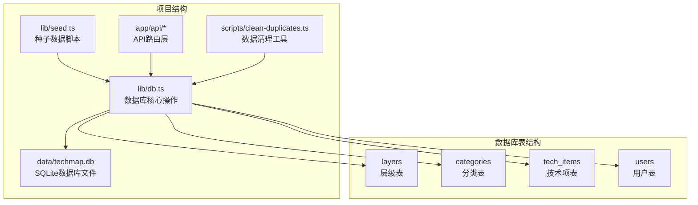
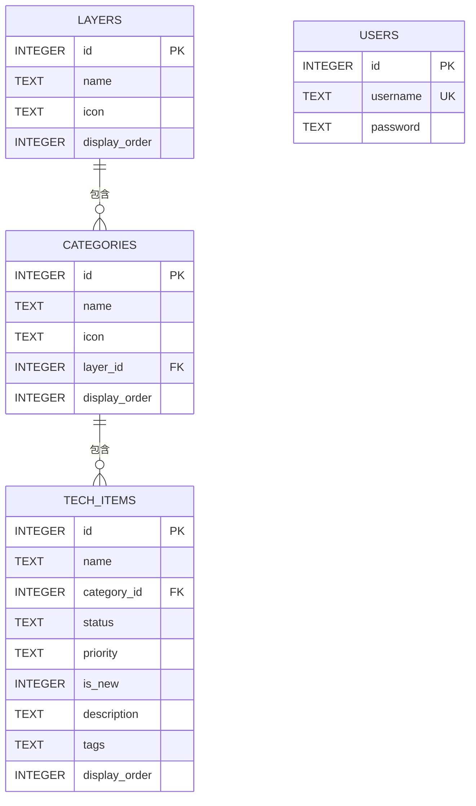
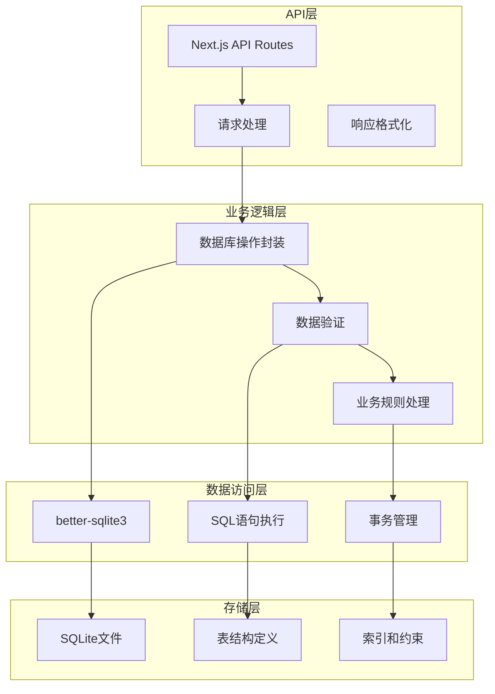
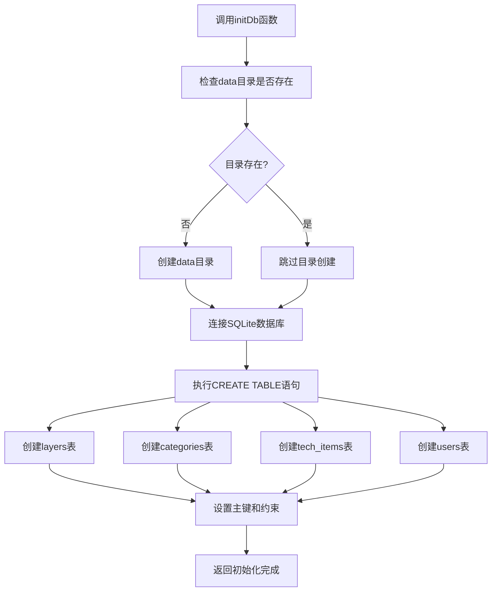
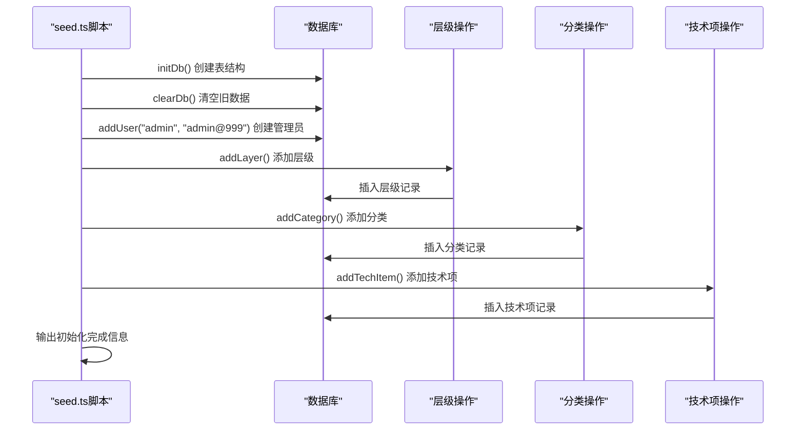
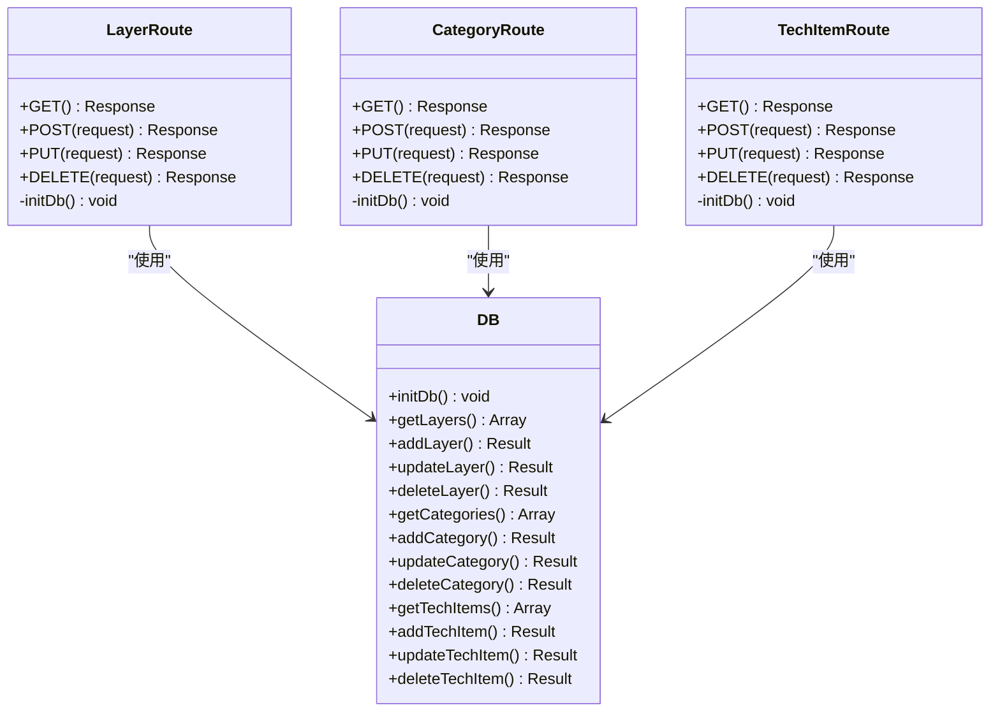
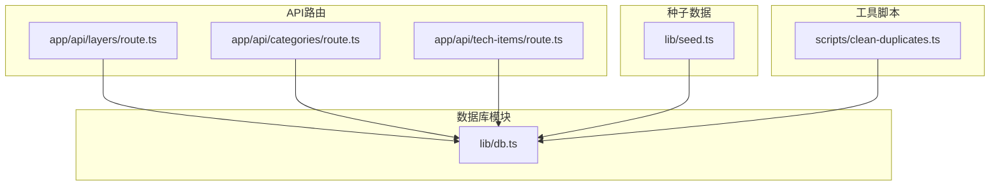
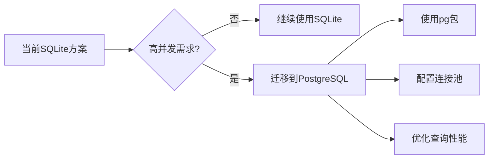
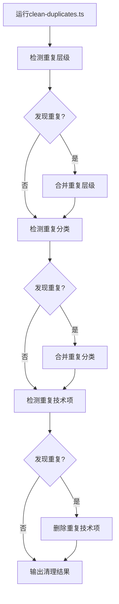

# 数据库初始化脚本

<cite>
**本文档引用的文件**
- [lib/db.ts](file://lib/db.ts)
- [lib/seed.ts](file://lib/seed.ts)
- [app/api/layers/route.ts](file://app/api/layers/route.ts)
- [app/api/categories/route.ts](file://app/api/categories/route.ts)
- [app/api/tech-items/route.ts](file://app/api/tech-items/route.ts)
- [PROJECT_MIGRATION.md](file://PROJECT_MIGRATION.md)
- [README.md](file://README.md)
- [package.json](file://package.json)
- [scripts/clean-duplicates.ts](file://scripts/clean-duplicates.ts)
</cite>

## 目录
1. [简介](#简介)
2. [项目结构概览](#项目结构概览)
3. [核心组件分析](#核心组件分析)
4. [架构总览](#架构总览)
5. [详细组件分析](#详细组件分析)
6. [依赖关系分析](#依赖关系分析)
7. [性能考虑](#性能考虑)
8. [故障排除指南](#故障排除指南)
9. [结论](#结论)
10. [附录](#附录)

## 简介

本文档详细介绍了云平台技术蓝图图谱项目的数据库初始化和种子数据脚本系统。该系统基于SQLite数据库，使用better-sqlite3作为数据库驱动，实现了完整的数据库初始化、表结构创建、数据填充和管理功能。项目采用Next.js 16 + TypeScript + Tailwind CSS + SQLite的现代技术栈，提供了从开发到生产的完整数据库解决方案。

## 项目结构概览

项目采用模块化的文件组织方式，数据库相关的核心文件分布如下：



**图表来源**
- [lib/db.ts](file://lib/db.ts#L1-L50)
- [lib/seed.ts](file://lib/seed.ts#L1-L20)

**章节来源**
- [README.md](file://README.md#L20-L43)
- [package.json](file://package.json#L1-L43)

## 核心组件分析

### 数据库连接管理

数据库连接通过better-sqlite3库实现，采用集中式管理方式：

- **数据库路径**: `data/techmap.db`（相对项目根目录）
- **数据目录创建**: 自动创建`data`目录确保数据库文件存在
- **连接池**: 单实例连接，适用于中小型应用
- **事务支持**: 内置事务处理机制，保证数据一致性

### 表结构设计

系统包含四个核心数据表，采用外键关联实现数据完整性：



**图表来源**
- [lib/db.ts](file://lib/db.ts#L16-L48)

**章节来源**
- [lib/db.ts](file://lib/db.ts#L14-L50)

## 架构总览

系统采用分层架构设计，从API路由到数据库操作形成清晰的层次结构：



**图表来源**
- [app/api/layers/route.ts](file://app/api/layers/route.ts#L1-L48)
- [lib/db.ts](file://lib/db.ts#L1-L312)

## 详细组件分析

### initDb函数实现原理

initDb函数是数据库初始化的核心，负责创建所有必要的表结构：

#### 表创建逻辑



**图表来源**
- [lib/db.ts](file://lib/db.ts#L14-L50)

#### 表结构详细说明

**layers表**（层级表）
- 主键：`id` (INTEGER PRIMARY KEY AUTOINCREMENT)
- 字段：`name` (TEXT NOT NULL), `icon` (TEXT), `display_order` (INTEGER DEFAULT 0)
- 用途：定义技术栈的层级结构

**categories表**（分类表）
- 主键：`id` (INTEGER PRIMARY KEY AUTOINCREMENT)
- 外键：`layer_id` REFERENCES layers(id)
- 字段：`name` (TEXT NOT NULL), `icon` (TEXT), `layer_id` (INTEGER NOT NULL), `display_order` (INTEGER DEFAULT 0)
- 用途：在层级下进一步细分技术领域

**tech_items表**（技术项表）
- 主键：`id` (INTEGER PRIMARY KEY AUTOINCREMENT)
- 外键：`category_id` REFERENCES categories(id)
- 约束：`status` CHECK(status IN ('active', 'missing'))
- 约束：`priority` CHECK(priority IN ('high', 'medium', 'low', ''))
- 字段：`name` (TEXT NOT NULL), `category_id` (INTEGER NOT NULL), `status` (TEXT NOT NULL), `priority` (TEXT), `is_new` (INTEGER DEFAULT 0), `description` (TEXT), `tags` (TEXT), `display_order` (INTEGER DEFAULT 0)
- 用途：具体的技术栈条目

**users表**（用户表）
- 主键：`id` (INTEGER PRIMARY KEY AUTOINCREMENT)
- 唯一约束：`username` UNIQUE
- 字段：`username` (TEXT NOT NULL), `password` (TEXT NOT NULL)
- 用途：管理后台用户认证

**章节来源**
- [lib/db.ts](file://lib/db.ts#L14-L49)

### seed.ts脚本工作机制

seed.ts脚本实现了完整的数据初始化流程，包含管理员账户创建、层级定义、分类映射和技术项填充：

#### 数据初始化流程



**图表来源**
- [lib/seed.ts](file://lib/seed.ts#L10-L16)
- [lib/db.ts](file://lib/db.ts#L285-L309)

#### 数据填充策略

**层级定义策略**
- 采用固定顺序：开发技术层 → 后端与大数据 → AI 与数据智能 → 基础设施与安全 → 场景解决方案
- 每个层级包含特定的图标和显示顺序
- 使用映射表（layerMap）跟踪层级ID，确保后续分类正确关联

**分类定义策略**
- 按层级进行分组，每个层级包含多个技术分类
- 支持复杂的JSON格式图标定义，特别是场景解决方案中的多列布局
- 使用catMap映射分类名称到ID，确保技术项正确关联

**技术项填充策略**
- 包含800+个技术项，覆盖当前主流技术栈
- 每个技术项包含状态（active/missing）、优先级、是否新增等属性
- 使用display_order字段按索引顺序排列，确保稳定的数据展示

**章节来源**
- [lib/seed.ts](file://lib/seed.ts#L15-L840)

### API路由集成

各个API路由都集成了数据库初始化功能：



**图表来源**
- [app/api/layers/route.ts](file://app/api/layers/route.ts#L1-L48)
- [app/api/categories/route.ts](file://app/api/categories/route.ts#L1-L48)
- [app/api/tech-items/route.ts](file://app/api/tech-items/route.ts#L1-L50)

**章节来源**
- [app/api/layers/route.ts](file://app/api/layers/route.ts#L1-L48)
- [app/api/categories/route.ts](file://app/api/categories/route.ts#L1-L48)
- [app/api/tech-items/route.ts](file://app/api/tech-items/route.ts#L1-L50)

## 依赖关系分析

### 外部依赖

项目的主要外部依赖包括：

```mermaid
graph LR
subgraph "核心依赖"
A[better-sqlite3] --> B[SQLite数据库驱动]
C[next] --> D[Next.js框架]
E[react] --> F[React库]
G[tailwindcss] --> H[样式框架]
end
subgraph "开发依赖"
I[typescript] --> J[类型系统]
K[tsx] --> L[TypeScript执行器]
M[eslint] --> N[代码检查]
end
subgraph "工具依赖"
O[clsx] --> P[条件类名组合]
Q[lucide-react] --> R[图标库]
S[@dnd-kit] --> T[拖拽功能]
end
```

**图表来源**
- [package.json](file://package.json#L12-L36)

### 内部模块依赖



**图表来源**
- [lib/db.ts](file://lib/db.ts#L1-L312)
- [lib/seed.ts](file://lib/seed.ts#L1-L840)

**章节来源**
- [package.json](file://package.json#L1-L43)

## 性能考虑

### SQLite性能特性

- **文件系统依赖**: SQLite直接操作文件系统，避免网络延迟
- **并发限制**: 单文件锁机制，不适合高并发写入场景
- **内存使用**: 内存映射模式，适合中小规模数据
- **查询优化**: 基于索引的查询，支持基本的WHERE和ORDER BY操作

### 优化建议

1. **索引策略**: 对频繁查询的字段建立适当索引
2. **批量操作**: 使用事务批量插入大量数据
3. **连接复用**: 在API请求间复用数据库连接
4. **查询优化**: 避免SELECT *，只选择需要的字段

### 扩展性考虑

对于高并发场景，建议迁移到PostgreSQL或其他关系型数据库：



## 故障排除指南

### 常见问题及解决方案

**数据库文件权限问题**
- 症状：无法创建或写入数据库文件
- 解决方案：确保运行用户对data目录有读写权限

**端口占用问题**
- 症状：开发服务器启动失败
- 解决方案：修改package.json中的端口号或释放占用端口

**数据重复问题**
- 症状：出现重复的层级、分类或技术项
- 解决方案：使用提供的数据清理脚本

### 数据清理工具

项目提供了专门的数据清理工具来处理重复数据：



**图表来源**
- [scripts/clean-duplicates.ts](file://scripts/clean-duplicates.ts#L1-L162)

**章节来源**
- [scripts/clean-duplicates.ts](file://scripts/clean-duplicates.ts#L1-L162)

## 结论

该数据库初始化和种子数据系统提供了完整的解决方案，具有以下优势：

1. **简洁高效**: 基于SQLite的轻量级设计，适合中小型应用
2. **易于部署**: 无外部数据库依赖，简化部署流程
3. **数据完整性**: 通过外键约束和数据验证确保数据一致性
4. **可维护性**: 清晰的模块化设计，便于代码维护和扩展
5. **自动化**: 完整的种子数据脚本，支持一键初始化

对于需要更高性能和更大规模的应用，建议考虑迁移到PostgreSQL等企业级数据库解决方案。

## 附录

### 数据库初始化流程

完整的数据库初始化流程包括以下步骤：

1. **环境准备**: 确保Node.js环境和依赖安装完成
2. **目录创建**: 自动创建data目录用于存储数据库文件
3. **表结构创建**: 执行initDb函数创建所有必要表
4. **数据清理**: 清空可能存在的旧数据
5. **管理员创建**: 添加默认管理员账户
6. **层级填充**: 添加五个主要技术层级
7. **分类映射**: 建立层级与分类的关联关系
8. **技术项填充**: 插入800+个技术项数据
9. **验证确认**: 输出初始化完成信息

### 开发与生产环境配置

**开发环境配置**
- 端口：4701（避免与默认Next.js端口冲突）
- 数据库：SQLite文件存储
- 开发工具：TypeScript + TSX执行器
- 调试支持：完整的错误处理和日志输出

**生产环境配置**
- 部署方式：PM2进程管理
- 反向代理：Nginx配置
- 端口：4701（可根据需要调整）
- 权限：确保对data目录的读写权限

### 数据备份与恢复

**备份策略**
1. 定期复制`data/techmap.db`文件
2. 使用数据库内置的备份功能
3. 考虑使用数据库快照功能

**恢复流程**
1. 停止应用服务
2. 备份当前数据库文件
3. 恢复备份文件到原始位置
4. 重启应用服务
5. 验证数据完整性