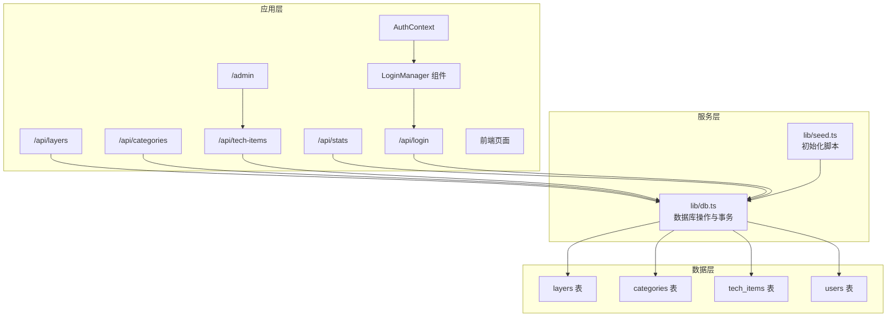
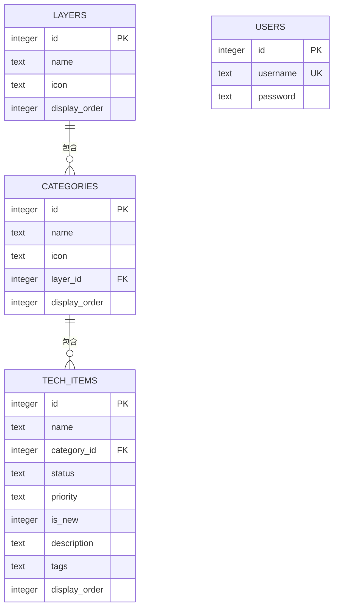
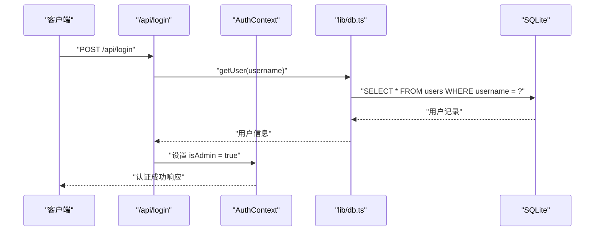
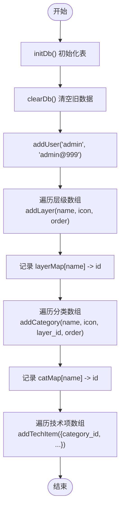
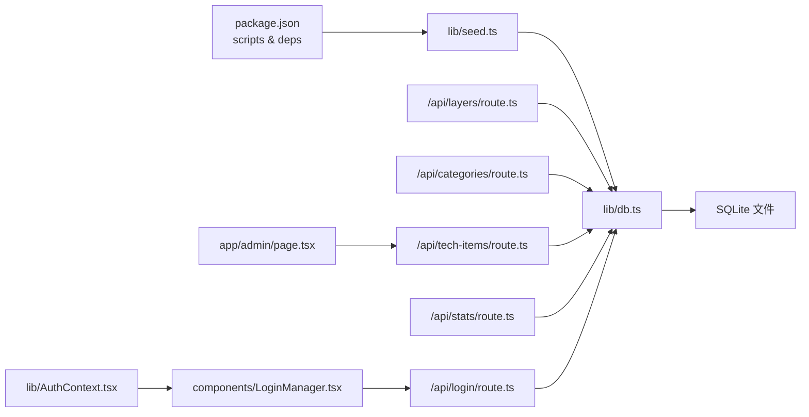

# 数据库设计

<cite>
**本文引用的文件**
- [lib/db.ts](file://lib/db.ts)
- [lib/seed.ts](file://lib/seed.ts)
- [types/index.ts](file://types/index.ts)
- [app/api/layers/route.ts](file://app/api/layers/route.ts)
- [app/api/categories/route.ts](file://app/api/categories/route.ts)
- [app/api/tech-items/route.ts](file://app/api/tech-items/route.ts)
- [app/api/stats/route.ts](file://app/api/stats/route.ts)
- [app/api/login/route.ts](file://app/api/login/route.ts)
- [lib/AuthContext.tsx](file://lib/AuthContext.tsx)
- [components/LoginManager.tsx](file://components/LoginManager.tsx)
- [app/admin/page.tsx](file://app/admin/page.tsx)
- [PROJECT_MIGRATION.md](file://PROJECT_MIGRATION.md)
- [package.json](file://package.json)
</cite>

## 目录
1. [简介](#简介)
2. [项目结构](#项目结构)
3. [核心组件](#核心组件)
4. [架构总览](#架构总览)
5. [详细组件分析](#详细组件分析)
6. [依赖分析](#依赖分析)
7. [性能考虑](#性能考虑)
8. [故障排查指南](#故障排查指南)
9. [结论](#结论)
10. [附录](#附录)

## 简介
本文件面向 Lantu Next 项目的数据库设计，聚焦三层数据库架构：
- layers 层级表：用于组织技术栈的顶层分层
- categories 分类表：在层级下进一步细分技术领域
- tech_items 技术项表：具体的技术条目，如框架、语言、工具等
- users 用户表：用于管理后台的用户凭证管理

文档将详细说明表结构、字段语义、外键约束、索引策略、数据初始化脚本原理与扩展方法，并给出数据迁移、备份恢复与性能优化建议，以及常见 SQL 查询示例与数据访问模式。

## 项目结构
数据库相关代码集中在以下模块：
- 数据库连接与初始化：lib/db.ts
- 数据初始化脚本：lib/seed.ts
- 类型定义：types/index.ts
- API 路由：app/api/{layers,categories,tech-items,stats,login}/route.ts
- 认证上下文：lib/AuthContext.tsx
- 登录管理组件：components/LoginManager.tsx
- 管理后台页面：app/admin/page.tsx
- 项目迁移与说明：PROJECT_MIGRATION.md
- 项目脚本与依赖：package.json

**图表来源**
- [lib/db.ts](file://lib/db.ts#L1-L312)
- [lib/seed.ts](file://lib/seed.ts#L1-L840)
- [app/api/layers/route.ts](file://app/api/layers/route.ts#L1-L48)
- [app/api/categories/route.ts](file://app/api/categories/route.ts#L1-L48)
- [app/api/tech-items/route.ts](file://app/api/tech-items/route.ts#L1-L50)
- [app/api/stats/route.ts](file://app/api/stats/route.ts#L1-L15)
- [app/api/login/route.ts](file://app/api/login/route.ts#L1-L20)
- [lib/AuthContext.tsx](file://lib/AuthContext.tsx#L1-L62)
- [components/LoginManager.tsx](file://components/LoginManager.tsx#L1-L118)
- [app/admin/page.tsx](file://app/admin/page.tsx#L1-L311)

**章节来源**
- [lib/db.ts](file://lib/db.ts#L1-L312)
- [lib/seed.ts](file://lib/seed.ts#L1-L840)
- [types/index.ts](file://types/index.ts#L1-L34)
- [app/api/layers/route.ts](file://app/api/layers/route.ts#L1-L48)
- [app/api/categories/route.ts](file://app/api/categories/route.ts#L1-L48)
- [app/api/tech-items/route.ts](file://app/api/tech-items/route.ts#L1-L50)
- [app/api/stats/route.ts](file://app/api/stats/route.ts#L1-L15)
- [app/api/login/route.ts](file://app/api/login/route.ts#L1-L20)
- [lib/AuthContext.tsx](file://lib/AuthContext.tsx#L1-L62)
- [components/LoginManager.tsx](file://components/LoginManager.tsx#L1-L118)
- [app/admin/page.tsx](file://app/admin/page.tsx#L1-L311)
- [PROJECT_MIGRATION.md](file://PROJECT_MIGRATION.md#L122-L160)
- [package.json](file://package.json#L1-L43)

## 核心组件
- 数据库初始化与表结构
  - layers：层级表，包含 id、name、icon、display_order
  - categories：分类表，包含 id、name、icon、layer_id、display_order，并外键关联 layers.id
  - tech_items：技术项表，包含 id、name、category_id、status、priority、is_new、description、tags、display_order，并外键关联 categories.id
  - users：用户表，包含 id、username（唯一）、password，用于管理后台认证
- 数据访问接口
  - 层级：增删改查、批量排序
  - 分类：增删改查、批量排序
  - 技术项：增删改查、批量排序、按分类与显示顺序查询
  - 用户：获取用户信息、添加用户
  - 统计：活跃数、缺失数、总数与覆盖率
- 认证与授权
  - 简单用户名密码认证
  - 基于 localStorage 的会话管理
  - 管理后台访问控制
- 初始化脚本
  - 清空旧数据
  - 插入管理员用户
  - 创建层级、分类映射
  - 批量插入技术项，按分类映射写入

**章节来源**
- [lib/db.ts](file://lib/db.ts#L14-L49)
- [lib/db.ts](file://lib/db.ts#L52-L312)
- [lib/seed.ts](file://lib/seed.ts#L1-L14)
- [lib/seed.ts](file://lib/seed.ts#L15-L16)
- [lib/seed.ts](file://lib/seed.ts#L18-L280)
- [lib/seed.ts](file://lib/seed.ts#L281-L840)
- [types/index.ts](file://types/index.ts#L1-L34)

## 架构总览
三层数据库架构的 ER 关系如下：

**图表来源**
- [lib/db.ts](file://lib/db.ts#L16-L48)
- [types/index.ts](file://types/index.ts#L1-L34)

**说明**
- 外键约束：categories.layer_id 引用 layers.id；tech_items.category_id 引用 categories.id
- 索引策略：当前未显式创建索引，但查询使用了 display_order 字段进行排序，建议后续根据查询模式增加索引
- 数据类型与约束：SQLite 使用通用类型，status/priority 使用 CHECK 约束限定枚举值
- 用户认证：users 表提供基础的用户名密码认证支持

## 详细组件分析

### layers 层级表
- 字段与约束
  - id：主键，自增
  - name：非空，表示层级名称
  - icon：图标标识
  - display_order：默认 0，用于排序
- 业务含义
  - 代表技术栈的顶层分类，如"开发技术层"、"后端与大数据"等
- 查询与排序
  - 按 display_order 去重排序返回
- 外键关系
  - categories.layer_id 引用 layers.id

**章节来源**
- [lib/db.ts](file://lib/db.ts#L16-L22)
- [lib/db.ts](file://lib/db.ts#L53-L57)
- [types/index.ts](file://types/index.ts#L1-L6)

### categories 分类表
- 字段与约束
  - id：主键，自增
  - name：非空，分类名称
  - icon：图标标识
  - layer_id：非空，外键引用 layers.id
  - display_order：默认 0，用于排序
- 业务含义
  - 在某一层级下进一步细分，如"前端基础与框架"、"Java 生态"等
- 查询与排序
  - 按 layer_id 和 display_order 去重排序
- 外键关系
  - tech_items.category_id 引用 categories.id

**章节来源**
- [lib/db.ts](file://lib/db.ts#L24-L35)
- [lib/db.ts](file://lib/db.ts#L78-L85)
- [types/index.ts](file://types/index.ts#L8-L14)

### tech_items 技术项表
- 字段与约束
  - id：主键，自增
  - name：非空，技术项名称
  - category_id：非空，外键引用 categories.id
  - status：非空，CHECK 限定为 'active' 或 'missing'
  - priority：CHECK 限定为 'high' | 'medium' | 'low' | ''
  - is_new：默认 0，标记是否为新项
  - description：描述
  - tags：标签字符串
  - display_order：默认 0，用于排序
- 业务含义
  - 具体技术条目，如框架、语言、工具等
- 查询与排序
  - 按 category_id 和 display_order 去重排序
- 外键关系
  - 无额外外键，依赖约束保证 referential integrity

**章节来源**
- [lib/db.ts](file://lib/db.ts#L24-L35)
- [lib/db.ts](file://lib/db.ts#L107-L114)
- [types/index.ts](file://types/index.ts#L16-L26)

### users 用户表
- 字段与约束
  - id：主键，自增
  - username：非空且唯一
  - password：非空
- 业务含义
  - 用于管理后台的用户凭证管理，当前实现为简单明文存储
- 认证流程
  - 前端通过 /api/login 发送用户名密码
  - 后端验证用户名存在且密码匹配
  - 成功后在客户端设置 is_admin 标识
- 安全考虑
  - 当前为演示用途，使用明文密码存储
  - 实际部署建议使用哈希加密和更安全的认证机制

**章节来源**
- [lib/db.ts](file://lib/db.ts#L44-L48)
- [lib/db.ts](file://lib/db.ts#L296-L309)
- [lib/db.ts](file://lib/db.ts#L303-L309)
- [app/api/login/route.ts](file://app/api/login/route.ts#L1-L20)
- [lib/AuthContext.tsx](file://lib/AuthContext.tsx#L1-L62)
- [components/LoginManager.tsx](file://components/LoginManager.tsx#L1-L118)

### 认证与授权系统
- 认证上下文
  - 提供 isAdmin 状态管理
  - 支持 login/logout 操作
  - 使用 localStorage 持久化会话状态
- 登录组件
  - 提供用户友好的登录界面
  - 包含用户名和密码输入
  - 处理登录错误和加载状态
- 管理后台
  - 提供技术项的增删改查功能
  - 仅在认证状态下可用
  - 支持批量操作和实时更新

**章节来源**
- [lib/AuthContext.tsx](file://lib/AuthContext.tsx#L1-L62)
- [components/LoginManager.tsx](file://components/LoginManager.tsx#L1-L118)
- [app/admin/page.tsx](file://app/admin/page.tsx#L1-L311)

### 数据访问模式与 API 路由
- 层级 API：GET/POST/PUT/DELETE，支持批量排序
- 分类 API：GET/POST/PUT/DELETE，支持批量排序
- 技术项 API：GET/POST/PUT/DELETE，支持批量排序
- 统计 API：GET，返回活跃、缺失、总数与覆盖率
- 登录 API：POST，提供简单认证功能

**图表来源**
- [app/api/login/route.ts](file://app/api/login/route.ts#L4-L12)
- [lib/db.ts](file://lib/db.ts#L296-L301)
- [lib/AuthContext.tsx](file://lib/AuthContext.tsx#L23-L41)

**章节来源**
- [app/api/layers/route.ts](file://app/api/layers/route.ts#L1-L48)
- [app/api/categories/route.ts](file://app/api/categories/route.ts#L1-L48)
- [app/api/tech-items/route.ts](file://app/api/tech-items/route.ts#L1-L50)
- [app/api/stats/route.ts](file://app/api/stats/route.ts#L1-L15)
- [app/api/login/route.ts](file://app/api/login/route.ts#L1-L20)
- [lib/db.ts](file://lib/db.ts#L52-L312)

### 数据初始化脚本（seed）
- 流程
  - 初始化数据库表
  - 清空旧数据（避免重复）
  - 插入管理员用户
  - 定义层级并建立 name->id 映射
  - 定义分类并建立 name->id 映射
  - 定义技术项，按分类映射写入，设置 display_order
- 扩展方法
  - 新增层级：在层级数组中添加对象，seed 会自动插入并记录 lastInsertRowid
  - 新增分类：在分类数组中添加对象，指定 layer 名称，seed 会解析映射
  - 新增技术项：在技术项数组中添加对象，指定分类名称，seed 会解析映射
  - 批量导入：可读取外部 CSV/Excel 并调用对应 insert 方法

**图表来源**
- [lib/seed.ts](file://lib/seed.ts#L10-L14)
- [lib/seed.ts](file://lib/seed.ts#L15-L16)
- [lib/seed.ts](file://lib/seed.ts#L18-L31)
- [lib/seed.ts](file://lib/seed.ts#L33-L279)
- [lib/seed.ts](file://lib/seed.ts#L281-L840)

**章节来源**
- [lib/seed.ts](file://lib/seed.ts#L1-L840)
- [lib/db.ts](file://lib/db.ts#L14-L49)
- [lib/db.ts](file://lib/db.ts#L284-L294)

## 依赖分析
- 组件耦合
  - API 路由依赖 lib/db.ts 的数据访问函数
  - 认证组件依赖 AuthContext 提供的状态管理
  - 管理后台依赖登录组件提供的认证功能
  - lib/db.ts 依赖 better-sqlite3 连接 SQLite
  - lib/seed.ts 依赖 lib/db.ts 的初始化与插入函数
- 外部依赖
  - better-sqlite3：SQLite 驱动
  - tsx：执行 seed 脚本
  - lucide-react：图标库
- 潜在循环依赖
  - 当前未发现循环依赖，各模块职责清晰

**图表来源**
- [package.json](file://package.json#L5-L11)
- [lib/seed.ts](file://lib/seed.ts#L1-L8)
- [lib/db.ts](file://lib/db.ts#L1-L11)
- [app/api/layers/route.ts](file://app/api/layers/route.ts#L1-L2)
- [app/api/categories/route.ts](file://app/api/categories/route.ts#L1-L2)
- [app/api/tech-items/route.ts](file://app/api/tech-items/route.ts#L1-L2)
- [app/api/stats/route.ts](file://app/api/stats/route.ts#L1-L2)
- [app/api/login/route.ts](file://app/api/login/route.ts#L1-L2)
- [lib/AuthContext.tsx](file://lib/AuthContext.tsx#L1-L3)
- [components/LoginManager.tsx](file://components/LoginManager.tsx#L1-L3)
- [app/admin/page.tsx](file://app/admin/page.tsx#L1-L3)

**章节来源**
- [package.json](file://package.json#L1-L43)
- [lib/db.ts](file://lib/db.ts#L1-L11)
- [lib/seed.ts](file://lib/seed.ts#L1-L8)
- [app/api/layers/route.ts](file://app/api/layers/route.ts#L1-L2)
- [app/api/categories/route.ts](file://app/api/categories/route.ts#L1-L2)
- [app/api/tech-items/route.ts](file://app/api/tech-items/route.ts#L1-L2)
- [app/api/stats/route.ts](file://app/api/stats/route.ts#L1-L2)
- [app/api/login/route.ts](file://app/api/login/route.ts#L1-L2)
- [lib/AuthContext.tsx](file://lib/AuthContext.tsx#L1-L62)
- [components/LoginManager.tsx](file://components/LoginManager.tsx#L1-L118)
- [app/admin/page.tsx](file://app/admin/page.tsx#L1-L311)

## 性能考虑
- 索引策略
  - 建议为 categories.layer_id 建立索引，提升按层级查询效率
  - 建议为 tech_items.category_id 建立索引，提升按分类查询效率
  - 建议为 tech_items.status 建立索引，提升状态筛选效率
  - 建议为 users.username 建立索引，提升用户查询效率
  - 建议为 layers.display_order、categories.display_order、tech_items.display_order 建立复合索引，优化排序
- 查询优化
  - 使用 ORDER BY 时尽量配合索引字段，减少排序成本
  - 使用 LIMIT/分页，避免一次性加载大量数据
  - 对频繁查询的字段建立适当的索引
- 写入优化
  - 批量更新使用事务（已实现），减少锁竞争
  - 批量插入使用 prepared statement，减少编译开销
- 存储与并发
  - SQLite 不支持高并发写入，建议在生产环境迁移到 PostgreSQL
  - 对于只读场景可考虑 WAL 模式提升并发读取能力
- 安全考虑
  - 用户密码当前为明文存储，建议迁移到哈希加密
  - 考虑添加密码强度验证和账户锁定机制

## 故障排查指南
- 数据库初始化失败
  - 确认 data/techmap.db 是否存在且可写
  - 检查 initDb() 是否正确执行
- API 返回错误
  - 查看 API 路由中的 try/catch 错误响应
  - 检查请求参数格式（如 id、name、icon、display_order 等）
- 数据不一致
  - 检查外键约束是否生效（category_id 必须存在）
  - 使用 SQLite CLI 验证数据一致性
- 用户认证问题
  - 确认用户表中是否存在对应的用户名记录
  - 检查密码是否正确（当前为明文匹配）
  - 验证 localStorage 中的 is_admin 标识状态
- 重置数据库
  - 删除 data/techmap.db 后重新执行 npm run seed

**章节来源**
- [lib/db.ts](file://lib/db.ts#L14-L49)
- [app/api/layers/route.ts](file://app/api/layers/route.ts#L10-L12)
- [app/api/categories/route.ts](file://app/api/categories/route.ts#L10-L12)
- [app/api/tech-items/route.ts](file://app/api/tech-items/route.ts#L11-L13)
- [app/api/login/route.ts](file://app/api/login/route.ts#L15-L18)
- [PROJECT_MIGRATION.md](file://PROJECT_MIGRATION.md#L116-L120)

## 结论
本数据库设计采用三层架构，层次清晰、外键约束明确，适合中小型项目与演示场景。通过 seed 脚本可快速完成初始化与扩展。新增的用户管理和认证功能为项目提供了基础的后台管理能力。建议在生产环境中引入索引、WAL 模式与 PostgreSQL，同时加强用户认证的安全性，以提升性能与安全性。

## 附录

### 数据模型与字段说明
- layers
  - id：整型，主键，自增
  - name：文本，非空
  - icon：文本
  - display_order：整型，默认 0
- categories
  - id：整型，主键，自增
  - name：文本，非空
  - icon：文本
  - layer_id：整型，非空，外键引用 layers.id
  - display_order：整型，默认 0
- tech_items
  - id：整型，主键，自增
  - name：文本，非空
  - category_id：整型，非空，外键引用 categories.id
  - status：文本，非空，枚举 'active' | 'missing'
  - priority：文本，枚举 'high' | 'medium' | 'low' | ''
  - is_new：整型，默认 0
  - description：文本
  - tags：文本
  - display_order：整型，默认 0
- users
  - id：整型，主键，自增
  - username：文本，非空，唯一
  - password：文本，非空

**章节来源**
- [lib/db.ts](file://lib/db.ts#L16-L48)
- [types/index.ts](file://types/index.ts#L1-L34)

### SQL 查询示例（路径引用）
- 查询所有层级（按显示顺序）
  - [lib/db.ts](file://lib/db.ts#L53-L57)
- 查询所有分类（按层级与显示顺序）
  - [lib/db.ts](file://lib/db.ts#L78-L85)
- 查询所有技术项（按分类与显示顺序）
  - [lib/db.ts](file://lib/db.ts#L107-L114)
- 按状态统计
  - [lib/db.ts](file://lib/db.ts#L220-L239)
- 获取用户信息
  - [lib/db.ts](file://lib/db.ts#L296-L301)

### 数据访问模式
- 层级 CRUD：getLayers、addLayer、updateLayer、deleteLayer
- 分类 CRUD：getCategories、addCategory、updateCategory、deleteCategory
- 技术项 CRUD：getTechItems、addTechItem、updateTechItem、deleteTechItem
- 用户管理：getUser、addUser
- 批量排序：updateLayerOrder、updateCategoryOrder、updateTechItemOrder
- 统计：getStats

**章节来源**
- [lib/db.ts](file://lib/db.ts#L52-L312)

### 认证与授权模式
- 用户认证：POST /api/login
- 会话管理：localStorage 持久化
- 管理后台：/admin 页面
- 权限控制：基于 isAdmin 状态

**章节来源**
- [app/api/login/route.ts](file://app/api/login/route.ts#L1-L20)
- [lib/AuthContext.tsx](file://lib/AuthContext.tsx#L1-L62)
- [components/LoginManager.tsx](file://components/LoginManager.tsx#L1-L118)
- [app/admin/page.tsx](file://app/admin/page.tsx#L1-L311)

### 迁移与备份恢复
- 迁移策略
  - 通过 seed 脚本重建数据，确保一致性
  - 如需增量迁移，可在 seed 中加入版本号与迁移逻辑
- 备份恢复
  - 备份：复制 data/techmap.db
  - 恢复：替换 data/techmap.db 后重启服务
- 部署建议
  - 本地：直接部署 SQLite
  - 云端：建议替换为 PostgreSQL（参考项目迁移文档）
- 安全加固
  - 用户密码加密存储
  - 添加 CSRF 保护
  - 实施账户锁定机制
  - 使用 HTTPS 和安全的 Cookie 设置

**章节来源**
- [PROJECT_MIGRATION.md](file://PROJECT_MIGRATION.md#L162-L195)