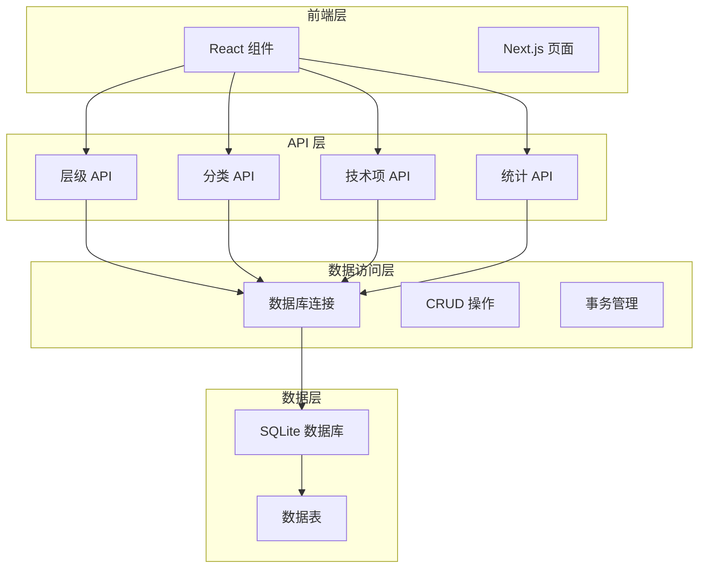
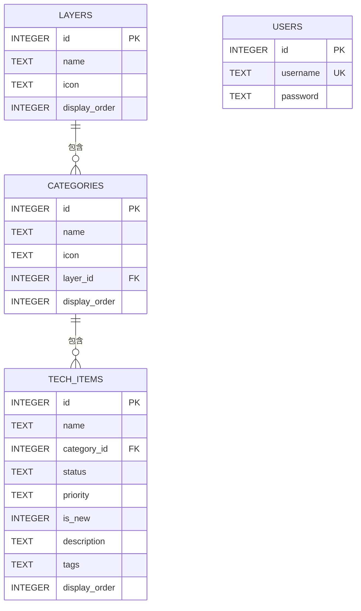
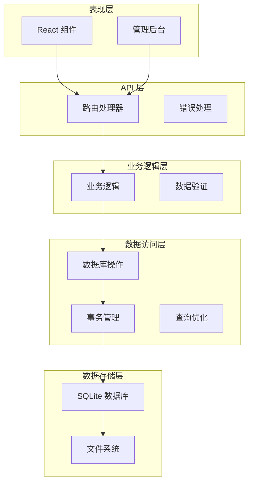
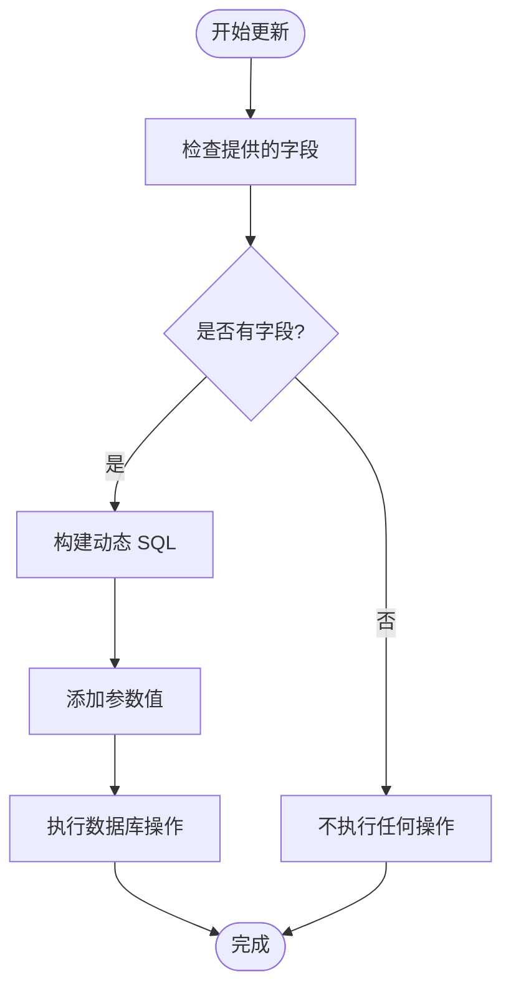
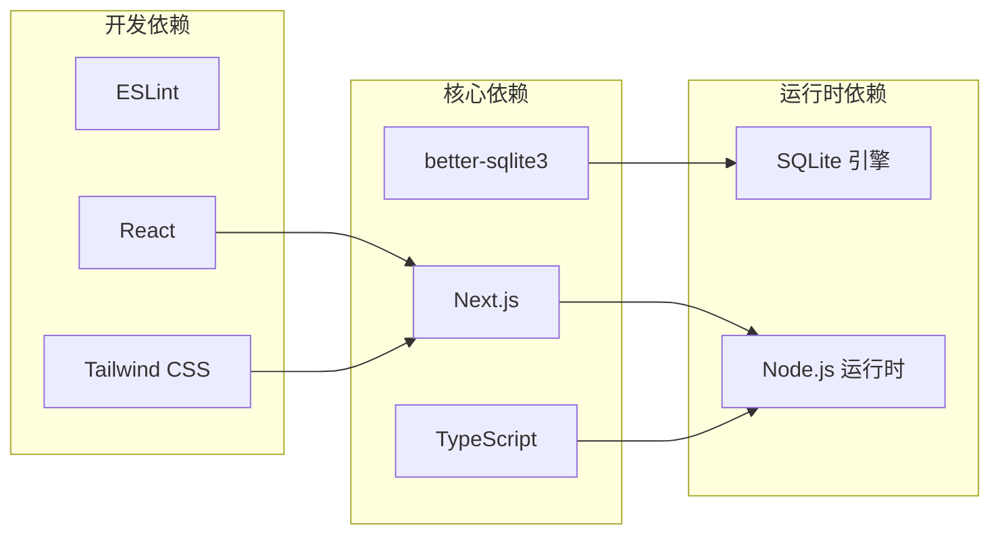
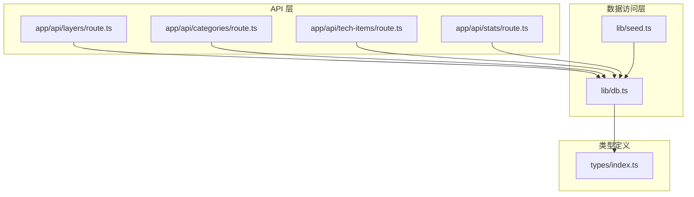

# 数据操作接口

<cite>
**本文档引用的文件**
- [lib/db.ts](file://lib/db.ts)
- [app/api/layers/route.ts](file://app/api/layers/route.ts)
- [app/api/categories/route.ts](file://app/api/categories/route.ts)
- [app/api/tech-items/route.ts](file://app/api/tech-items/route.ts)
- [app/api/stats/route.ts](file://app/api/stats/route.ts)
- [lib/seed.ts](file://lib/seed.ts)
- [types/index.ts](file://types/index.ts)
- [README.md](file://README.md)
- [next.config.ts](file://next.config.ts)
</cite>

## 目录
1. [简介](#简介)
2. [项目结构](#项目结构)
3. [核心组件](#核心组件)
4. [架构概览](#架构概览)
5. [详细组件分析](#详细组件分析)
6. [依赖关系分析](#依赖关系分析)
7. [性能考虑](#性能考虑)
8. [故障排除指南](#故障排除指南)
9. [结论](#结论)

## 简介

本项目是一个基于 Next.js + TypeScript + SQLite 的技术栈管理系统，提供了完整的数据访问接口。系统采用 SQLite 数据库存储，通过 better-sqlite3 库实现高性能的数据操作。项目包含三层架构：API 层负责处理 HTTP 请求，数据访问层封装数据库操作，类型定义层提供 TypeScript 类型安全。

## 项目结构

项目采用模块化的文件组织方式，主要分为以下几个部分：



**图表来源**
- [lib/db.ts](file://lib/db.ts#L1-L312)
- [app/api/layers/route.ts](file://app/api/layers/route.ts#L1-L48)

**章节来源**
- [README.md](file://README.md#L20-L43)
- [lib/db.ts](file://lib/db.ts#L1-L50)

## 核心组件

### 数据库连接管理

系统使用 better-sqlite3 库建立数据库连接，支持本地文件存储和内存数据库两种模式。数据库文件位于 `data/techmap.db`，自动创建必要的数据目录。

### 表结构设计

系统包含四个核心数据表，采用外键关联实现层次化数据结构：



**图表来源**
- [lib/db.ts](file://lib/db.ts#L16-L48)

**章节来源**
- [lib/db.ts](file://lib/db.ts#L14-L49)
- [types/index.ts](file://types/index.ts#L1-L34)

## 架构概览

系统采用分层架构设计，每层职责明确，便于维护和扩展：



**图表来源**
- [app/api/layers/route.ts](file://app/api/layers/route.ts#L1-L48)
- [lib/db.ts](file://lib/db.ts#L1-L312)

## 详细组件分析

### 层级管理接口 (Layers)

#### CRUD 操作

**获取所有层级**
- **HTTP 方法**: GET
- **路径**: `/api/layers`
- **功能**: 返回所有层级信息，按显示顺序排序
- **返回值**: 层级数组对象
- **SQL 实现**: `SELECT DISTINCT * FROM layers ORDER BY display_order`

**创建新层级**
- **HTTP 方法**: POST
- **路径**: `/api/layers`
- **请求体**: `{ name, icon, display_order }`
- **返回值**: 包含新插入记录 ID 的对象
- **SQL 实现**: `INSERT INTO layers (name, icon, display_order) VALUES (?, ?, ?)`

**更新层级**
- **HTTP 方法**: PUT
- **路径**: `/api/layers`
- **请求体**: `{ id, name, icon, display_order }`
- **返回值**: `{ success: true }`
- **SQL 实现**: `UPDATE layers SET name = ?, icon = ?, display_order = ? WHERE id = ?`

**删除层级**
- **HTTP 方法**: DELETE
- **路径**: `/api/layers`
- **查询参数**: `?id={层级ID}`
- **返回值**: `{ success: true }`
- **SQL 实现**: `DELETE FROM layers WHERE id = ?`

#### 错误处理策略

层级接口采用统一的错误处理模式：
- 捕获数据库操作异常
- 返回标准化的错误响应
- 使用适当的 HTTP 状态码
- 提供详细的错误信息

**章节来源**
- [app/api/layers/route.ts](file://app/api/layers/route.ts#L1-L48)
- [lib/db.ts](file://lib/db.ts#L52-L76)

### 分类管理接口 (Categories)

#### CRUD 操作

**获取所有分类**
- **HTTP 方法**: GET
- **路径**: `/api/categories`
- **功能**: 返回所有分类信息，按层级和显示顺序排序
- **返回值**: 分类数组对象
- **SQL 实现**: `SELECT DISTINCT * FROM categories ORDER BY layer_id, display_order`

**创建新分类**
- **HTTP 方法**: POST
- **路径**: `/api/categories`
- **请求体**: `{ name, icon, layer_id, display_order }`
- **返回值**: 包含新插入记录 ID 的对象
- **SQL 实现**: `INSERT INTO categories (name, icon, layer_id, display_order) VALUES (?, ?, ?, ?)`

**更新分类**
- **HTTP 方法**: PUT
- **路径**: `/api/categories`
- **请求体**: `{ id, name, icon, layer_id, display_order }`
- **返回值**: `{ success: true }`
- **SQL 实现**: `UPDATE categories SET name = ?, icon = ?, layer_id = ?, display_order = ? WHERE id = ?`

**删除分类**
- **HTTP 方法**: DELETE
- **路径**: `/api/categories`
- **查询参数**: `?id={分类ID}`
- **返回值**: `{ success: true }`
- **SQL 实现**: `DELETE FROM categories WHERE id = ?`

#### 批量操作

系统支持批量更新显示顺序的操作，通过事务确保数据一致性：

**批量更新层级顺序**
- **函数**: `updateLayerOrder(updates)`
- **参数**: `[{ id, display_order }][]`
- **事务**: 使用 `db.transaction()` 包装多个更新操作

**章节来源**
- [app/api/categories/route.ts](file://app/api/categories/route.ts#L1-L48)
- [lib/db.ts](file://lib/db.ts#L78-L105)

### 技术项管理接口 (Tech Items)

#### CRUD 操作

**获取所有技术项**
- **HTTP 方法**: GET
- **路径**: `/api/tech-items`
- **功能**: 返回所有技术项信息，按分类和显示顺序排序
- **返回值**: 技术项数组对象
- **SQL 实现**: `SELECT DISTINCT * FROM tech_items ORDER BY category_id, display_order`

**创建新技术项**
- **HTTP 方法**: POST
- **路径**: `/api/tech-items`
- **请求体**: 技术项完整数据对象
- **返回值**: 包含新插入记录 ID 的对象
- **SQL 实现**: 
  ```
  INSERT INTO tech_items 
  (name, category_id, status, priority, is_new, description, tags, display_order)
  VALUES (?, ?, ?, ?, ?, ?, ?, ?)
  ```

**更新技术项**
- **HTTP 方法**: PUT
- **路径**: `/api/tech-items`
- **请求体**: `{ id, ...updateData }`
- **动态更新**: 支持部分字段更新，仅更新提供的字段
- **SQL 实现**: 动态生成 UPDATE 语句，根据提供的字段组合

**删除技术项**
- **HTTP 方法**: DELETE
- **路径**: `/api/tech-items`
- **查询参数**: `?id={技术项ID}`
- **返回值**: `{ success: true }`
- **SQL 实现**: `DELETE FROM tech_items WHERE id = ?`

#### 高级功能

**部分字段更新机制**
技术项更新支持选择性字段更新，避免不必要的数据修改：



**图表来源**
- [lib/db.ts](file://lib/db.ts#L165-L211)

**章节来源**
- [app/api/tech-items/route.ts](file://app/api/tech-items/route.ts#L1-L50)
- [lib/db.ts](file://lib/db.ts#L107-L217)

### 统计查询接口 (Stats)

#### 统计功能

**获取统计数据**
- **HTTP 方法**: GET
- **路径**: `/api/stats`
- **功能**: 返回技术项的统计信息
- **返回值**: `{ active, missing, total, coverage }`
- **SQL 实现**:
  - `SELECT COUNT(*) as count FROM tech_items WHERE status = 'active'`
  - `SELECT COUNT(*) as count FROM tech_items WHERE status = 'missing'`

**统计计算逻辑**
- 计算活跃技术项数量
- 计算缺失技术项数量  
- 计算总数和覆盖率百分比
- 覆盖率 = (活跃数量 / 总数) × 100%

**章节来源**
- [app/api/stats/route.ts](file://app/api/stats/route.ts#L1-L15)
- [lib/db.ts](file://lib/db.ts#L219-L239)

### 用户认证接口

#### 用户管理

**获取用户**
- **函数**: `getUser(username: string)`
- **SQL 实现**: `SELECT * FROM users WHERE username = ?`

**添加用户**
- **函数**: `addUser(username: string, password: string)`
- **SQL 实现**: `INSERT OR IGNORE INTO users (username, password) VALUES (?, ?)`

**章节来源**
- [lib/db.ts](file://lib/db.ts#L296-L309)

## 依赖关系分析

### 外部依赖

系统依赖于以下关键外部库：



**图表来源**
- [next.config.ts](file://next.config.ts#L1-L9)
- [lib/db.ts](file://lib/db.ts#L1-L4)

### 内部模块依赖



**图表来源**
- [app/api/layers/route.ts](file://app/api/layers/route.ts#L1-L5)
- [lib/db.ts](file://lib/db.ts#L1-L10)

**章节来源**
- [lib/db.ts](file://lib/db.ts#L1-L10)
- [next.config.ts](file://next.config.ts#L1-L9)

## 性能考虑

### 查询优化策略

**索引和排序优化**
- 所有表都建立了合适的索引用于排序操作
- 使用 `display_order` 字段进行高效排序
- 避免在查询中使用 `SELECT *`，只选择必要字段

**批量操作优化**
- 使用事务包装批量更新操作
- 减少数据库往返次数
- 通过单个事务提交多个变更

**连接池管理**
- better-sqlite3 自动管理连接
- 避免长时间持有数据库连接
- 合理使用预编译语句

### 并发控制

**事务隔离**
- 使用 `db.transaction()` 确保数据一致性
- 原子性执行多个相关操作
- 自动回滚失败的操作

**锁机制**
- SQLite 自动处理并发访问
- 读写操作的适当锁策略
- 避免长时间持有锁

### 内存管理

**预编译语句缓存**
- better-sqlite3 自动缓存预编译语句
- 减少 SQL 解析开销
- 提高重复查询性能

**垃圾回收**
- 合理释放数据库连接
- 避免内存泄漏
- 及时清理未使用的变量

## 故障排除指南

### 常见错误类型

**数据库连接错误**
- 检查数据库文件权限
- 验证数据目录存在性
- 确认 SQLite 文件完整性

**约束违反错误**
- 外键约束检查
- 唯一约束冲突
- 数据类型不匹配

**事务失败处理**
- 捕获事务异常
- 自动回滚操作
- 提供详细的错误信息

### 调试技巧

**启用详细日志**
- 在开发环境中输出 SQL 语句
- 记录参数绑定信息
- 监控查询执行时间

**性能监控**
- 监控数据库连接数
- 检查查询执行计划
- 分析慢查询

**数据完整性检查**
- 定期验证外键关系
- 检查数据一致性
- 监控表结构变更

**章节来源**
- [app/api/layers/route.ts](file://app/api/layers/route.ts#L10-L12)
- [app/api/categories/route.ts](file://app/api/categories/route.ts#L10-L12)
- [app/api/tech-items/route.ts](file://app/api/tech-items/route.ts#L11-L13)

## 结论

本项目提供了一个完整且高效的数据库操作接口系统，具有以下特点：

**架构优势**
- 清晰的分层架构设计
- 完善的错误处理机制
- 支持事务和并发控制
- 类型安全的 TypeScript 实现

**功能完整性**
- 全面的 CRUD 操作支持
- 高效的批量更新功能
- 灵活的统计查询接口
- 完整的用户管理功能

**性能特性**
- 基于 SQLite 的高性能存储
- 优化的查询执行计划
- 有效的缓存策略
- 良好的并发处理能力

该系统为技术栈管理提供了坚实的数据基础，支持未来功能扩展和性能优化。通过合理的架构设计和完善的错误处理机制，确保了系统的稳定性和可靠性。