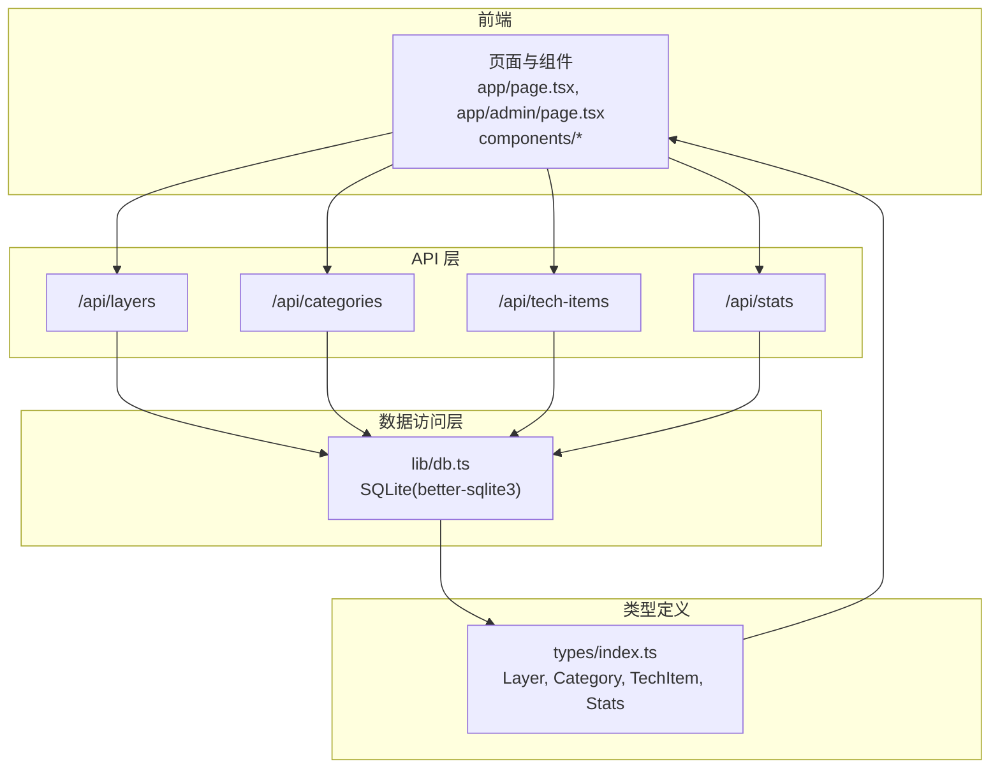
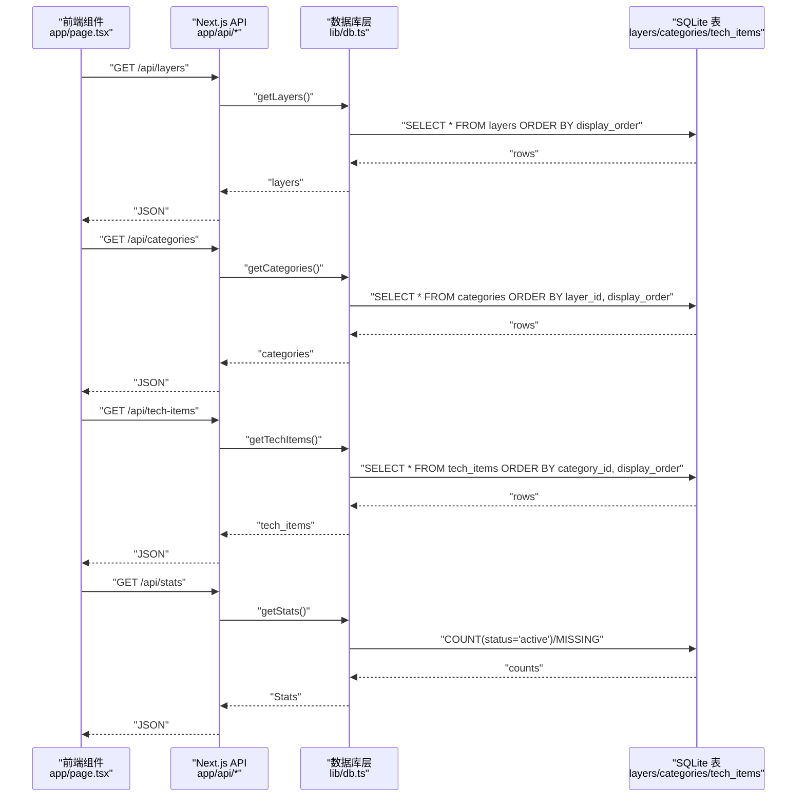
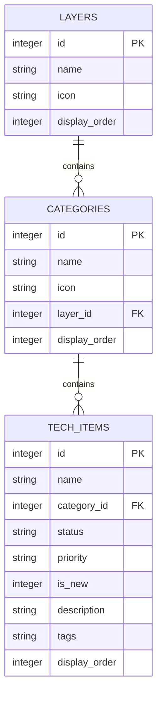
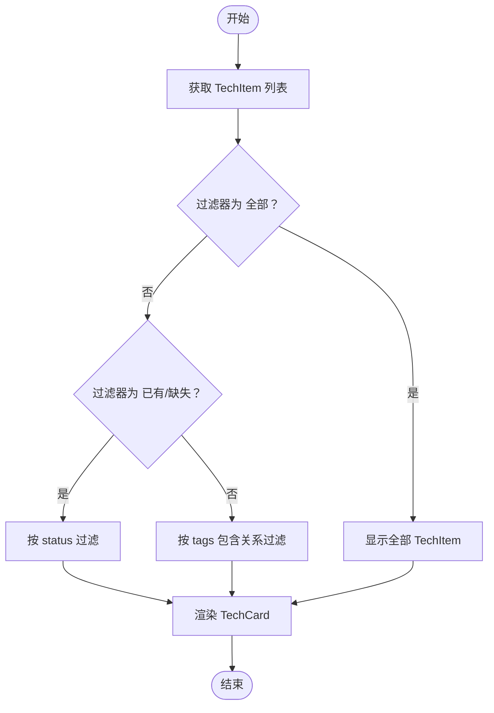
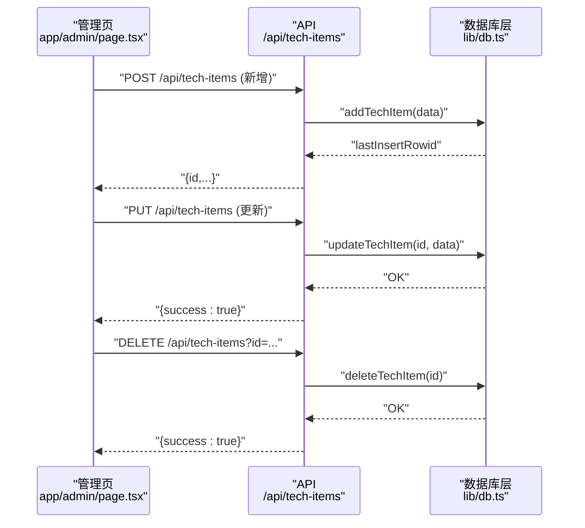
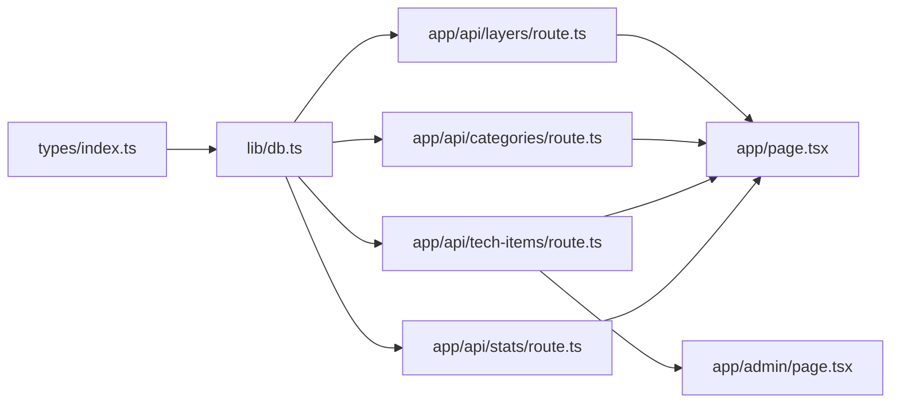

# 数据模型

<cite>
**本文引用的文件**
- [types/index.ts](file://types/index.ts)
- [lib/db.ts](file://lib/db.ts)
- [app/api/layers/route.ts](file://app/api/layers/route.ts)
- [app/api/categories/route.ts](file://app/api/categories/route.ts)
- [app/api/tech-items/route.ts](file://app/api/tech-items/route.ts)
- [app/api/stats/route.ts](file://app/api/stats/route.ts)
- [lib/seed.ts](file://lib/seed.ts)
- [components/TechCard.tsx](file://components/TechCard.tsx)
- [components/FilterBar.tsx](file://components/FilterBar.tsx)
- [components/StatsPanel.tsx](file://components/StatsPanel.tsx)
- [app/admin/page.tsx](file://app/admin/page.tsx)
- [app/page.tsx](file://app/page.tsx)
</cite>

## 目录
1. [简介](#简介)
2. [项目结构](#项目结构)
3. [核心数据模型](#核心数据模型)
4. [架构概览](#架构概览)
5. [详细组件分析](#详细组件分析)
6. [依赖关系分析](#依赖关系分析)
7. [性能考量](#性能考量)
8. [故障排查指南](#故障排查指南)
9. [结论](#结论)
10. [附录](#附录)

## 简介
本文件系统性梳理 Lantu Next 项目的“数据模型”，聚焦于 TypeScript 接口定义与数据库表结构的对应关系，解释各模型的属性、类型约束与验证规则，并说明模型间的引用关系与使用方式。同时给出序列化/反序列化建议、类型安全与运行时验证策略，以及在前端组件中的使用示例与最佳实践。

## 项目结构
本项目采用“类型定义 + SQLite 数据库 + Next.js API 路由”的分层设计：
- 类型定义：集中于 types/index.ts，定义 Layer、Category、TechItem、Stats 四个核心接口。
- 数据访问层：lib/db.ts 封装 SQLite 表结构与 CRUD 操作，含初始化、查询、更新、删除、统计等方法。
- API 层：app/api/* 提供 REST 风格路由，负责请求解析、调用数据库层并返回 JSON 响应。
- 前端展示层：页面与组件通过 fetch 请求 API，消费数据模型并在 UI 中渲染。

图表来源
- [app/page.tsx](file://app/page.tsx#L39-L63)
- [app/admin/page.tsx](file://app/admin/page.tsx#L23-L34)
- [app/api/layers/route.ts](file://app/api/layers/route.ts#L1-L48)
- [app/api/categories/route.ts](file://app/api/categories/route.ts#L1-L48)
- [app/api/tech-items/route.ts](file://app/api/tech-items/route.ts#L1-L50)
- [app/api/stats/route.ts](file://app/api/stats/route.ts#L1-L15)
- [lib/db.ts](file://lib/db.ts#L14-L50)
- [types/index.ts](file://types/index.ts#L1-L34)

章节来源
- [types/index.ts](file://types/index.ts#L1-L34)
- [lib/db.ts](file://lib/db.ts#L14-L50)
- [app/api/layers/route.ts](file://app/api/layers/route.ts#L1-L48)
- [app/api/categories/route.ts](file://app/api/categories/route.ts#L1-L48)
- [app/api/tech-items/route.ts](file://app/api/tech-items/route.ts#L1-L50)
- [app/api/stats/route.ts](file://app/api/stats/route.ts#L1-L15)
- [app/page.tsx](file://app/page.tsx#L39-L63)
- [app/admin/page.tsx](file://app/admin/page.tsx#L23-L34)

## 核心数据模型
本节逐条说明四个核心数据模型的属性、类型定义与约束，并给出数据库表结构的对应关系。

- Layer（层级）
  - 字段与类型
    - id: number
    - name: string
    - icon: string
    - display_order: number
  - 约束与校验
    - 主键：id 自增
    - 名称非空：name NOT NULL
    - 显示顺序默认值：display_order 默认 0
  - 关系映射
    - 一对多：一个 Layer 包含多个 Category（通过 Category.layer_id 引用）
  - 使用示例
    - 在页面中按 display_order 排序展示层级卡片
    - 在管理界面支持批量更新 display_order

- Category（分类）
  - 字段与类型
    - id: number
    - name: string
    - icon: string
    - layer_id: number
    - display_order: number
  - 约束与校验
    - 主键：id 自增
    - 名称非空：name NOT NULL
    - 外键：layer_id 引用 layers.id
    - 显示顺序默认值：display_order 默认 0
  - 关系映射
    - 多对一：Category 属于某个 Layer
    - 一对多：一个 Category 包含多个 TechItem（通过 TechItem.category_id 引用）
  - 使用示例
    - 页面按 layer_id + display_order 组合排序
    - 管理界面支持批量更新 display_order

- TechItem（技术项）
  - 字段与类型
    - id: number
    - name: string
    - category_id: number
    - status: 'active' | 'missing'
    - priority: 'high' | 'medium' | 'low' | ''
    - is_new: number
    - description: string
    - tags: string
    - display_order: number
  - 约束与校验
    - 主键：id 自增
    - 名称非空：name NOT NULL
    - 外键：category_id 引用 categories.id
    - 状态枚举：CHECK(status IN ('active', 'missing'))
    - 优先级枚举：CHECK(priority IN ('high', 'medium', 'low', ''))
    - is_new：整型布尔语义（0/1）
    - 显示顺序默认值：display_order 默认 0
  - 关系映射
    - 多对一：TechItem 属于某个 Category
  - 使用示例
    - 页面根据 status/priority/tags 过滤与高亮
    - 管理界面支持新增/编辑/删除与批量排序

- Stats（统计）
  - 字段与类型
    - active: number
    - missing: number
    - total: number
    - coverage: string（百分比字符串，保留一位小数）
  - 计算逻辑
    - total = active + missing
    - coverage = total > 0 ? Math.round(active/total*1000)/10 : 0.0
  - 使用示例
    - 页面顶部徽章与统计面板展示覆盖率与数量

章节来源
- [types/index.ts](file://types/index.ts#L1-L34)
- [lib/db.ts](file://lib/db.ts#L14-L50)
- [lib/db.ts](file://lib/db.ts#L220-L239)
- [components/StatsPanel.tsx](file://components/StatsPanel.tsx#L7-L54)

## 架构概览
下图展示了从 API 到数据库再到前端组件的数据流与模型交互：

图表来源
- [app/page.tsx](file://app/page.tsx#L39-L63)
- [app/api/layers/route.ts](file://app/api/layers/route.ts#L6-L13)
- [app/api/categories/route.ts](file://app/api/categories/route.ts#L6-L13)
- [app/api/tech-items/route.ts](file://app/api/tech-items/route.ts#L7-L14)
- [app/api/stats/route.ts](file://app/api/stats/route.ts#L6-L14)
- [lib/db.ts](file://lib/db.ts#L52-L57)
- [lib/db.ts](file://lib/db.ts#L78-L85)
- [lib/db.ts](file://lib/db.ts#L107-L114)
- [lib/db.ts](file://lib/db.ts#L220-L239)

## 详细组件分析

### 类型定义与数据库表结构映射

图表来源
- [lib/db.ts](file://lib/db.ts#L16-L42)
- [types/index.ts](file://types/index.ts#L1-L34)

章节来源
- [lib/db.ts](file://lib/db.ts#L16-L42)
- [types/index.ts](file://types/index.ts#L1-L34)

### TechItem 的过滤与渲染流程

图表来源
- [app/page.tsx](file://app/page.tsx#L74-L84)
- [components/TechCard.tsx](file://components/TechCard.tsx#L7-L36)

章节来源
- [app/page.tsx](file://app/page.tsx#L74-L84)
- [components/TechCard.tsx](file://components/TechCard.tsx#L7-L36)

### TechItem 管理（新增/编辑/删除）序列流程

图表来源
- [app/admin/page.tsx](file://app/admin/page.tsx#L41-L70)
- [app/api/tech-items/route.ts](file://app/api/tech-items/route.ts#L16-L35)
- [lib/db.ts](file://lib/db.ts#L137-L162)
- [lib/db.ts](file://lib/db.ts#L164-L211)
- [lib/db.ts](file://lib/db.ts#L213-L217)

章节来源
- [app/admin/page.tsx](file://app/admin/page.tsx#L41-L70)
- [app/api/tech-items/route.ts](file://app/api/tech-items/route.ts#L16-L35)
- [lib/db.ts](file://lib/db.ts#L137-L162)
- [lib/db.ts](file://lib/db.ts#L164-L211)
- [lib/db.ts](file://lib/db.ts#L213-L217)

### 数据模型使用示例与最佳实践
- 类型安全
  - 在组件中使用明确的 props 类型（如 TechCardProps），确保传入的字段与接口一致。
  - 在管理页中使用 useState<TechItem[]> 等泛型，避免类型不匹配导致的运行时错误。
- 运行时验证
  - API 层对必填字段进行基本校验（如删除时要求 id 存在），并在异常时返回 500。
  - 建议在客户端对关键字段（如 status/priority）做枚举校验，避免非法值进入数据库。
- 序列化与反序列化
  - API 返回 JSON，前端通过 fetch().json() 解析；注意 SQLite 返回的数值类型与 JS 数字一致性。
  - 对 is_new 字段，建议统一使用 0/1 的整型布尔语义，避免字符串比较。
- 性能优化
  - 使用 useMemo 对 TechItem 按 category_id 分组，避免每次渲染重建数组引用。
  - 批量更新 display_order 时使用事务（updateLayerOrder/updateCategoryOrder/updateTechItemOrder），减少多次往返。

章节来源
- [components/TechCard.tsx](file://components/TechCard.tsx#L1-L37)
- [app/admin/page.tsx](file://app/admin/page.tsx#L6-L21)
- [app/page.tsx](file://app/page.tsx#L26-L34)
- [lib/db.ts](file://lib/db.ts#L242-L282)

## 依赖关系分析
- 类型到实现的依赖
  - types/index.ts 定义的接口被 lib/db.ts 的函数签名与返回值引用，也作为前端组件的 props 类型。
- API 到数据层的依赖
  - app/api/* 路由函数直接依赖 lib/db.ts 的导出方法（getLayers/getCategories/getTechItems/getStats/add*/update*/delete*）。
- 前端到 API 的依赖
  - app/page.tsx 与 app/admin/page.tsx 通过 fetch 调用 /api/*，并以 JSON 形式消费数据模型。

图表来源
- [types/index.ts](file://types/index.ts#L1-L34)
- [lib/db.ts](file://lib/db.ts#L14-L50)
- [app/api/layers/route.ts](file://app/api/layers/route.ts#L1-L48)
- [app/api/categories/route.ts](file://app/api/categories/route.ts#L1-L48)
- [app/api/tech-items/route.ts](file://app/api/tech-items/route.ts#L1-L50)
- [app/api/stats/route.ts](file://app/api/stats/route.ts#L1-L15)
- [app/page.tsx](file://app/page.tsx#L39-L63)
- [app/admin/page.tsx](file://app/admin/page.tsx#L23-L34)

章节来源
- [types/index.ts](file://types/index.ts#L1-L34)
- [lib/db.ts](file://lib/db.ts#L14-L50)
- [app/api/layers/route.ts](file://app/api/layers/route.ts#L1-L48)
- [app/api/categories/route.ts](file://app/api/categories/route.ts#L1-L48)
- [app/api/tech-items/route.ts](file://app/api/tech-items/route.ts#L1-L50)
- [app/api/stats/route.ts](file://app/api/stats/route.ts#L1-L15)
- [app/page.tsx](file://app/page.tsx#L39-L63)
- [app/admin/page.tsx](file://app/admin/page.tsx#L23-L34)

## 性能考量
- 查询与排序
  - 按 display_order 排序的查询在 SQLite 中可利用索引（默认主键索引）获得较好性能；若数据量增长，可考虑为 layer_id/display_order 建立复合索引。
- 批量更新
  - 使用事务（db.transaction）批量更新排序字段，减少 IO 次数，提高吞吐。
- 前端渲染
  - 使用 useMemo 对 TechItem 按类别分组，避免每次渲染都创建新的数组引用，降低子组件重渲染频率。
- 缓存策略
  - API 层使用 { cache: "no-store" }，确保数据实时性；若业务允许，可在特定场景引入缓存策略以减轻数据库压力。

章节来源
- [lib/db.ts](file://lib/db.ts#L242-L282)
- [app/page.tsx](file://app/page.tsx#L26-L34)

## 故障排查指南
- 常见错误与定位
  - 删除请求缺少 id：API 层会返回 400 并提示“ID is required”；检查前端传参或 URLSearchParams。
  - 数据库约束冲突：status/priority 的枚举值不在允许集合内会导致 SQLite CHECK 失败；确认前端选择框与后端枚举一致。
  - 未初始化数据库：首次访问前需执行 initDb；若表不存在，API 路由会在入口处调用 initDb。
- 建议的日志与错误处理
  - API 层捕获异常并返回结构化错误信息；前端统一处理 500 错误并提示用户。
  - 对关键字段（如 category_id、status）在客户端做边界检查，避免无效请求。

章节来源
- [app/api/layers/route.ts](file://app/api/layers/route.ts#L35-L47)
- [app/api/categories/route.ts](file://app/api/categories/route.ts#L35-L47)
- [app/api/tech-items/route.ts](file://app/api/tech-items/route.ts#L37-L49)
- [lib/db.ts](file://lib/db.ts#L28-L35)

## 结论
本项目通过清晰的 TypeScript 接口与 SQLite 表结构定义，构建了稳定的数据模型层。API 层提供简洁的 CRUD 与统计接口，前端组件围绕模型进行渲染与交互。建议在后续迭代中：
- 引入更严格的运行时验证（如 Zod 或 io-ts）以增强类型安全；
- 对高频查询建立索引并评估缓存策略；
- 将“新增/编辑/删除”等操作封装为统一的服务层，便于复用与测试。

## 附录
- 数据模型初始化与示例数据
  - 通过 lib/seed.ts 初始化数据库并填充示例数据，涵盖多层级、多分类与大量技术项，便于演示与测试。
- 前端组件与模型的绑定
  - TechCard、FilterBar、StatsPanel 等组件均直接消费 TechItem/Category/Stats 模型，体现“模型驱动 UI”的设计思想。

章节来源
- [lib/seed.ts](file://lib/seed.ts#L10-L13)
- [lib/seed.ts](file://lib/seed.ts#L18-L280)
- [components/TechCard.tsx](file://components/TechCard.tsx#L1-L37)
- [components/FilterBar.tsx](file://components/FilterBar.tsx#L1-L52)
- [components/StatsPanel.tsx](file://components/StatsPanel.tsx#L1-L84)