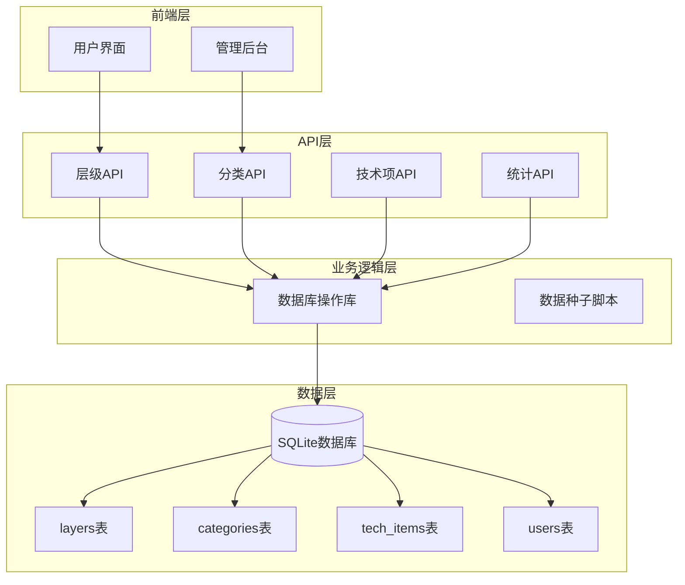
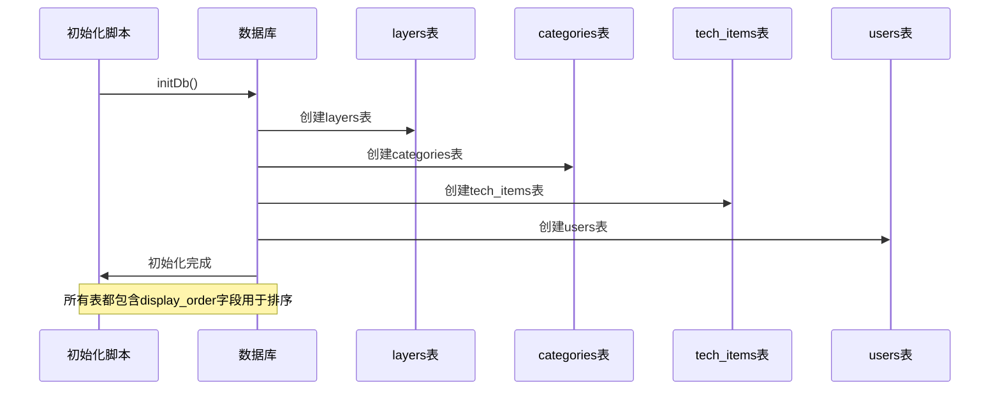
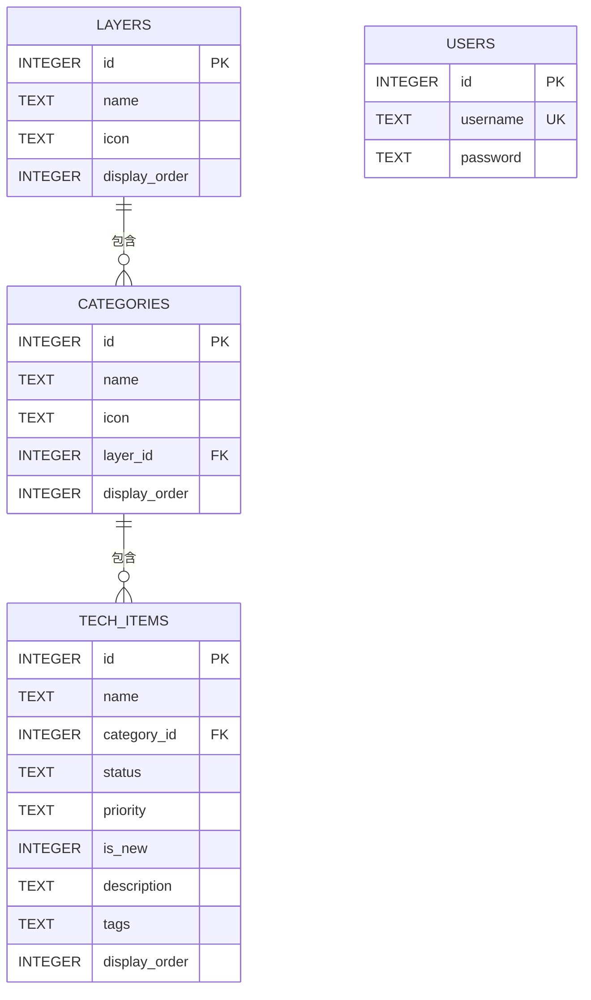
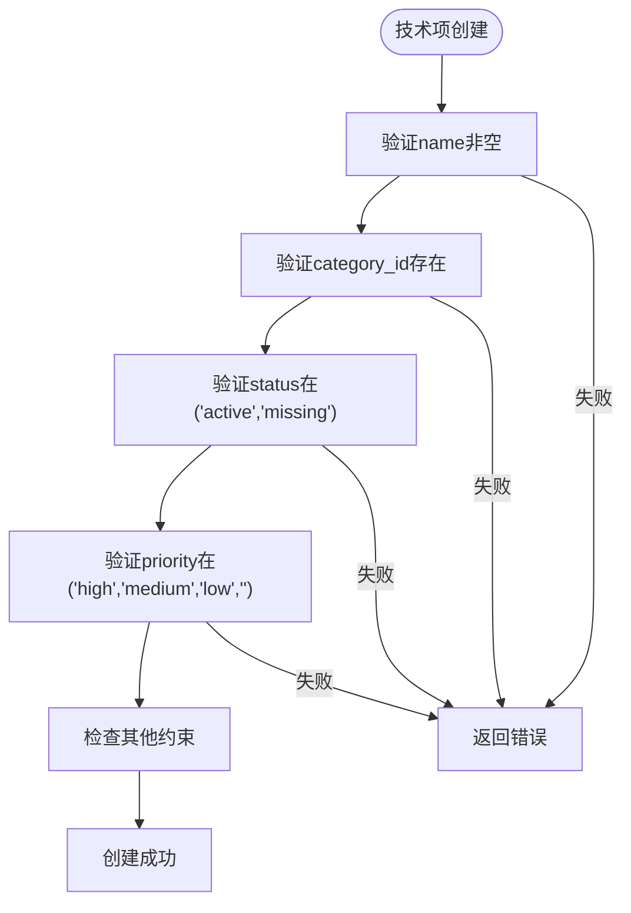
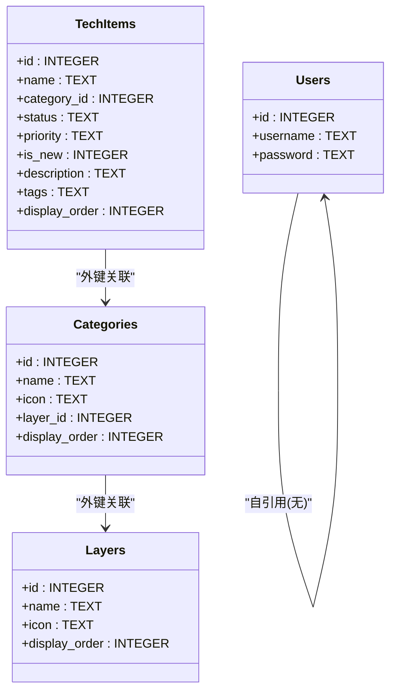
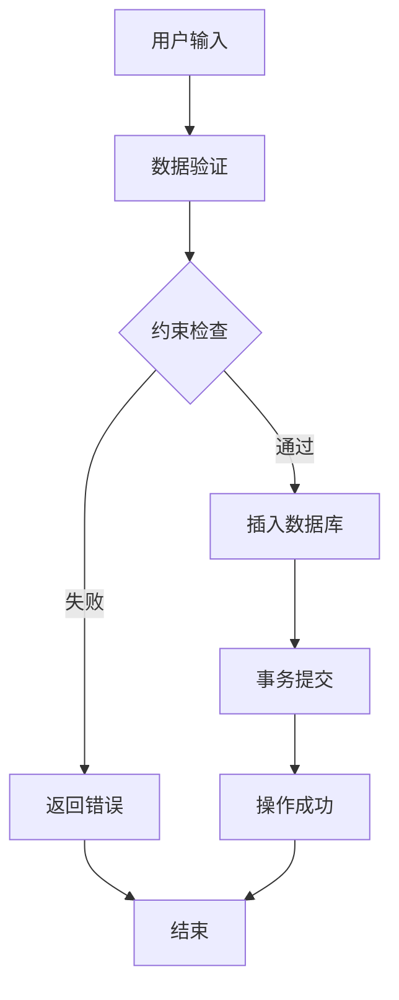

# 表结构设计

<cite>
**本文档引用的文件**
- [lib/db.ts](file://lib/db.ts)
- [lib/seed.ts](file://lib/seed.ts)
- [types/index.ts](file://types/index.ts)
- [app/api/layers/route.ts](file://app/api/layers/route.ts)
- [app/api/categories/route.ts](file://app/api/categories/route.ts)
- [app/api/tech-items/route.ts](file://app/api/tech-items/route.ts)
- [app/api/stats/route.ts](file://app/api/stats/route.ts)
- [README.md](file://README.md)
</cite>

## 目录
1. [简介](#简介)
2. [项目结构](#项目结构)
3. [核心组件](#核心组件)
4. [架构概览](#架构概览)
5. [详细组件分析](#详细组件分析)
6. [依赖关系分析](#依赖关系分析)
7. [性能考虑](#性能考虑)
8. [故障排除指南](#故障排除指南)
9. [结论](#结论)

## 简介

本文档详细描述了云平台技术蓝图图谱项目的数据库表结构设计。该系统采用SQLite数据库，使用Next.js + TypeScript + Tailwind CSS构建，主要包含四个核心表：layers层级表、categories分类表、tech_items技术项表和users用户表。系统通过REST API提供数据管理功能，支持技术栈的层级化管理和可视化展示。

## 项目结构

该项目采用分层架构设计，数据库操作集中在lib/db.ts文件中，API路由处理位于app/api/目录下，类型定义位于types/index.ts中。



**图表来源**
- [lib/db.ts](file://lib/db.ts#L14-L49)
- [app/api/layers/route.ts](file://app/api/layers/route.ts#L1-L48)
- [app/api/categories/route.ts](file://app/api/categories/route.ts#L1-L48)
- [app/api/tech-items/route.ts](file://app/api/tech-items/route.ts#L1-L50)

**章节来源**
- [README.md](file://README.md#L20-L43)
- [lib/db.ts](file://lib/db.ts#L1-L312)

## 核心组件

系统包含四个核心表，每个表都有明确的业务职责和约束条件：

### 数据库初始化流程



**图表来源**
- [lib/db.ts](file://lib/db.ts#L14-L49)

**章节来源**
- [lib/db.ts](file://lib/db.ts#L14-L49)

## 架构概览

系统采用三层架构模式：表现层（Next.js应用）、API层（Next.js API Routes）和数据层（SQLite数据库）。每个表之间通过外键关系建立关联，形成清晰的层次结构。



**图表来源**
- [lib/db.ts](file://lib/db.ts#L16-L48)
- [types/index.ts](file://types/index.ts#L1-L34)

## 详细组件分析

### layers层级表

layers表是整个技术栈系统的最高层级，用于组织不同类型的技术领域。

#### 字段详细说明

| 字段名 | 数据类型 | 约束条件 | 默认值 | 业务含义 |
|--------|----------|----------|--------|----------|
| id | INTEGER | PRIMARY KEY, AUTOINCREMENT | 无 | 主键，自增标识符 |
| name | TEXT | NOT NULL | 无 | 层级名称，如"开发技术层" |
| icon | TEXT | 无 | 无 | 图标标识，支持emoji或JSON格式 |
| display_order | INTEGER | DEFAULT 0 | 0 | 显示顺序，数值越小越靠前 |

#### 索引策略
- 主键索引：自动为id字段创建唯一索引
- 排序优化：display_order字段用于ORDER BY查询

#### 业务规则
- 层级名称必须唯一且非空
- 图标字段支持多种格式，包括emoji字符串和复杂JSON对象
- 排序机制通过display_order实现，支持动态调整层级顺序

**章节来源**
- [lib/db.ts](file://lib/db.ts#L16-L22)
- [types/index.ts](file://types/index.ts#L1-L6)

### categories分类表

categories表用于在特定层级下进一步细分技术领域，建立层级到分类的一对多关系。

#### 字段详细说明

| 字段名 | 数据类型 | 约束条件 | 默认值 | 业务含义 |
|--------|----------|----------|--------|----------|
| id | INTEGER | PRIMARY KEY, AUTOINCREMENT | 无 | 主键，自增标识符 |
| name | TEXT | NOT NULL | 无 | 分类名称，如"前端基础与框架" |
| icon | TEXT | 无 | 无 | 图标标识，支持复杂JSON结构 |
| layer_id | INTEGER | NOT NULL, FOREIGN KEY | 无 | 外键，指向layers表的id |
| display_order | INTEGER | DEFAULT 0 | 0 | 显示顺序，数值越小越靠前 |

#### 索引策略
- 主键索引：自动为id字段创建唯一索引
- 外键索引：layer_id字段建立外键约束
- 复合索引：(layer_id, display_order)用于高效查询

#### 业务规则
- 必须关联有效的层级（外键约束）
- 分类名称在同一层级内应保持唯一性
- 支持复杂的图标配置，包括描述和颜色主题

**章节来源**
- [lib/db.ts](file://lib/db.ts#L16-L22)
- [lib/db.ts](file://lib/db.ts#L82-L84)
- [types/index.ts](file://types/index.ts#L8-L14)

### tech_items技术项表

tech_items表是最细粒度的技术元素表，包含具体的技术栈条目。

#### 字段详细说明

| 字段名 | 数据类型 | 约束条件 | 默认值 | 业务含义 |
|--------|----------|----------|--------|----------|
| id | INTEGER | PRIMARY KEY, AUTOINCREMENT | 无 | 主键，自增标识符 |
| name | TEXT | NOT NULL | 无 | 技术项名称，如"React 18" |
| category_id | INTEGER | NOT NULL, FOREIGN KEY | 无 | 外键，指向categories表的id |
| status | TEXT | NOT NULL, CHECK | 无 | 状态：'active'或'missing' |
| priority | TEXT | CHECK | '' | 优先级：'high'、'medium'、'low'或空字符串 |
| is_new | INTEGER | DEFAULT 0 | 0 | 是否新增标记（0或1） |
| description | TEXT | 无 | 无 | 技术项详细描述 |
| tags | TEXT | 无 | 无 | 标签，支持逗号分隔的多个标签 |
| display_order | INTEGER | DEFAULT 0 | 0 | 显示顺序，数值越小越靠前 |

#### 约束条件详解



**图表来源**
- [lib/db.ts](file://lib/db.ts#L24-L35)

#### 索引策略
- 主键索引：自动为id字段创建唯一索引
- 外键索引：category_id字段建立外键约束
- 复合索引：(category_id, display_order)用于高效查询
- 状态索引：status字段用于快速筛选活跃/缺失技术项

#### 业务规则
- 状态字段强制约束，确保数据一致性
- 优先级字段允许空值，表示未设置优先级
- is_new字段使用INTEGER存储布尔值（0/1）
- tags字段支持多标签管理，便于搜索和过滤

**章节来源**
- [lib/db.ts](file://lib/db.ts#L24-L35)
- [lib/db.ts](file://lib/db.ts#L108-L114)
- [types/index.ts](file://types/index.ts#L16-L26)

### users用户表

users表用于系统认证和权限管理，目前支持基本的用户注册和登录功能。

#### 字段详细说明

| 字段名 | 数据类型 | 约束条件 | 默认值 | 业务含义 |
|--------|----------|----------|--------|----------|
| id | INTEGER | PRIMARY KEY, AUTOINCREMENT | 无 | 主键，自增标识符 |
| username | TEXT | NOT NULL, UNIQUE | 无 | 用户名，全局唯一 |
| password | TEXT | NOT NULL | 无 | 密码，明文存储（开发环境） |

#### 索引策略
- 主键索引：自动为id字段创建唯一索引
- 唯一索引：username字段创建唯一约束

#### 安全考虑
- 当前实现为开发环境设计，密码采用明文存储
- 生产环境中建议实现密码哈希和加密存储
- 用户名唯一性确保系统安全性

**章节来源**
- [lib/db.ts](file://lib/db.ts#L44-L48)
- [lib/db.ts](file://lib/db.ts#L296-L309)

## 依赖关系分析

系统中的表间关系形成了清晰的层次结构，通过外键约束保证数据完整性。

```mermaid
graph TD
subgraph "层级关系"
L1[layers表]
L2[categories表]
L3[tech_items表]
L4[users表]
end
subgraph "约束关系"
FK1[外键: categories.layer_id -> layers.id]
FK2[外键: tech_items.category_id -> categories.id]
CK1[检查约束: tech_items.status IN ('active','missing')]
CK2[检查约束: tech_items.priority IN ('high','medium','low','')]
end
L1 --> L2
L2 --> L3
L4 -.-> L1
L2 --- FK1
L3 --- FK2
L3 --- CK1
L3 --- CK2
```

**图表来源**
- [lib/db.ts](file://lib/db.ts#L16-L48)

### 外键关系详解



**图表来源**
- [lib/db.ts](file://lib/db.ts#L16-L48)
- [types/index.ts](file://types/index.ts#L1-L34)

**章节来源**
- [lib/db.ts](file://lib/db.ts#L34-L34)
- [lib/db.ts](file://lib/db.ts#L34-L34)

## 性能考虑

### 查询优化策略

1. **排序性能**：所有表都包含display_order字段，支持O(n log n)的排序操作
2. **索引利用**：外键字段自动创建索引，提高关联查询效率
3. **批量操作**：提供批量更新接口，减少数据库往返次数

### 数据完整性保障



**图表来源**
- [lib/db.ts](file://lib/db.ts#L285-L294)

### 批量操作优化

系统提供了专门的批量更新接口，用于处理大量数据的顺序调整：

- `updateLayerOrder()`: 批量更新层级顺序
- `updateCategoryOrder()`: 批量更新分类顺序  
- `updateTechItemOrder()`: 批量更新技术项顺序

这些接口使用事务处理，确保数据一致性和操作原子性。

**章节来源**
- [lib/db.ts](file://lib/db.ts#L242-L282)

## 故障排除指南

### 常见问题及解决方案

#### 数据库连接问题
- **症状**：应用启动时报数据库连接错误
- **原因**：SQLite文件权限不足或路径错误
- **解决**：检查data/目录权限，确保应用有读写权限

#### 外键约束错误
- **症状**：插入或更新时出现外键约束失败
- **原因**：引用的父记录不存在
- **解决**：先创建父记录，再创建子记录

#### 数据验证错误
- **症状**：状态或优先级字段设置无效值
- **原因**：违反CHECK约束
- **解决**：确保status为'active'或'missing'，priority为有效枚举值

#### 用户名重复
- **症状**：添加用户时报用户名重复
- **原因**：用户名已存在
- **解决**：使用唯一的用户名或删除重复用户

**章节来源**
- [lib/db.ts](file://lib/db.ts#L285-L294)

## 结论

该数据库设计采用了标准化的关系型数据库范式，通过清晰的表结构和约束条件实现了技术栈数据的有效管理。系统的核心优势包括：

1. **层次化设计**：从层级到分类再到技术项的三级结构，符合技术栈的自然组织方式
2. **灵活的排序机制**：通过display_order字段实现动态排序，支持用户自定义显示顺序
3. **数据完整性保障**：通过外键约束和CHECK约束确保数据一致性
4. **扩展性强**：支持新增表和字段，便于功能扩展

建议的改进方向：
- 在生产环境中实现密码哈希存储
- 考虑添加更详细的索引策略以优化查询性能
- 实现更完善的错误处理和日志记录机制