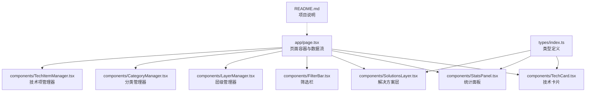
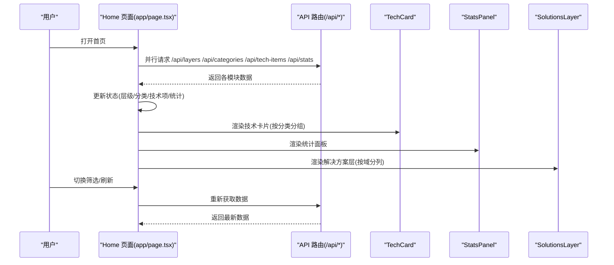
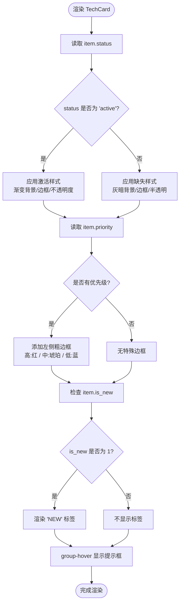
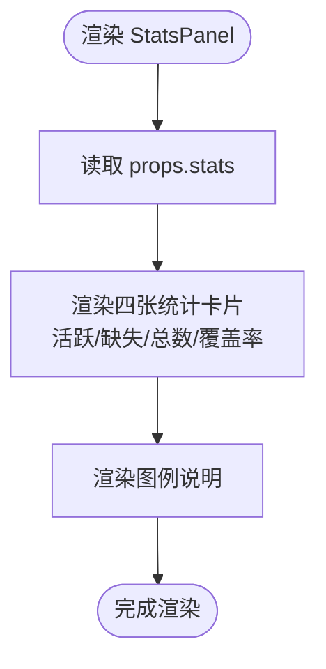
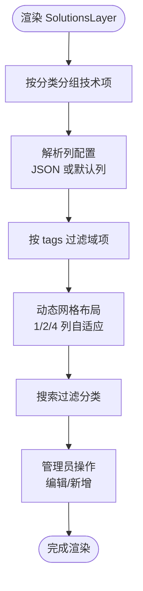
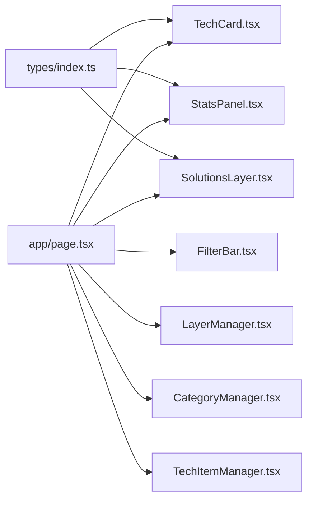

# 展示组件

<cite>
**本文档引用的文件**
- [TechCard.tsx](file://components/TechCard.tsx)
- [StatsPanel.tsx](file://components/StatsPanel.tsx)
- [SolutionsLayer.tsx](file://components/SolutionsLayer.tsx)
- [FilterBar.tsx](file://components/FilterBar.tsx)
- [LayerManager.tsx](file://components/LayerManager.tsx)
- [CategoryManager.tsx](file://components/CategoryManager.tsx)
- [TechItemManager.tsx](file://components/TechItemManager.tsx)
- [page.tsx](file://app/page.tsx)
- [index.ts](file://types/index.ts)
- [README.md](file://README.md)
</cite>

## 目录
1. [简介](#简介)
2. [项目结构](#项目结构)
3. [核心组件](#核心组件)
4. [架构总览](#架构总览)
5. [详细组件分析](#详细组件分析)
6. [依赖关系分析](#依赖关系分析)
7. [性能考量](#性能考量)
8. [故障排查指南](#故障排查指南)
9. [结论](#结论)
10. [附录](#附录)

## 简介
本文件聚焦于展示组件的实现与使用，深入解析以下内容：
- TechCard 的状态管理、样式系统与交互逻辑（激活状态、优先级标识、悬停效果）
- StatsPanel 的数据可视化与统计计算逻辑
- SolutionsLayer 的层级展示与布局算法
- 组件 props 接口定义、事件处理机制与性能优化技巧
- 使用示例与自定义样式的实现方法

## 项目结构
本项目采用 Next.js App Router，页面入口位于 app/page.tsx，主要展示组件集中在 components 目录。类型定义位于 types/index.ts，README.md 提供了整体概览。

图表来源
- [page.tsx](file://app/page.tsx#L15-L237)
- [TechCard.tsx](file://components/TechCard.tsx#L1-L37)
- [StatsPanel.tsx](file://components/StatsPanel.tsx#L1-L84)
- [SolutionsLayer.tsx](file://components/SolutionsLayer.tsx#L1-L269)
- [FilterBar.tsx](file://components/FilterBar.tsx#L1-L52)
- [LayerManager.tsx](file://components/LayerManager.tsx#L1-L312)
- [CategoryManager.tsx](file://components/CategoryManager.tsx#L1-L280)
- [TechItemManager.tsx](file://components/TechItemManager.tsx#L1-L444)
- [index.ts](file://types/index.ts#L1-L34)
- [README.md](file://README.md#L20-L43)

章节来源
- [page.tsx](file://app/page.tsx#L15-L237)
- [README.md](file://README.md#L20-L43)

## 核心组件
本节概述三个关键展示组件的职责与交互关系：
- TechCard：呈现单个技术项，根据状态与优先级动态切换样式，并提供悬停提示
- StatsPanel：展示活跃/缺失/总数/覆盖率等统计信息，并提供图例说明
- SolutionsLayer：针对“场景解决方案”层级的网格化展示，支持按域（tags）分列与搜索

章节来源
- [TechCard.tsx](file://components/TechCard.tsx#L1-L37)
- [StatsPanel.tsx](file://components/StatsPanel.tsx#L1-L84)
- [SolutionsLayer.tsx](file://components/SolutionsLayer.tsx#L1-L269)
- [page.tsx](file://app/page.tsx#L15-L237)

## 架构总览
页面容器负责数据获取与状态管理，TechCard/StatsPanel/SolutionsLayer 作为子组件消费数据并渲染 UI；FilterBar 提供筛选能力，其他管理器组件负责后台维护。

图表来源
- [page.tsx](file://app/page.tsx#L39-L68)
- [page.tsx](file://app/page.tsx#L101-L237)

章节来源
- [page.tsx](file://app/page.tsx#L15-L237)

## 详细组件分析

### TechCard 组件
TechCard 负责单个技术项的视觉呈现，包含状态指示、优先级边框、NEW 标签与悬停提示。

- Props 接口
  - item: TechItem（见类型定义）
- 状态管理与样式系统
  - 激活状态：根据 status === 'active' 切换渐变背景与边框颜色
  - 优先级标识：根据 priority 动态添加不同颜色的左侧粗边框
  - NEW 标签：当 is_new === 1 时显示红色半透明白色标签
  - 悬停效果：group-hover 实现透明度、缩放、阴影与层级变化
- 交互逻辑
  - 悬停提示：通过 group-hover 控制绝对定位提示框的可见性与过渡动画
- 性能优化
  - 使用 useMemo 将技术项按分类分组，避免重复创建引用导致的子组件重渲染
  - 在父组件中统一过滤与分组，降低子组件内部计算成本

图表来源
- [TechCard.tsx](file://components/TechCard.tsx#L7-L35)
- [page.tsx](file://app/page.tsx#L26-L34)

章节来源
- [TechCard.tsx](file://components/TechCard.tsx#L1-L37)
- [index.ts](file://types/index.ts#L16-L26)
- [page.tsx](file://app/page.tsx#L26-L34)

### StatsPanel 组件
StatsPanel 展示活跃技术数、缺失技术数、总技术数与覆盖率，并提供图例说明。

- Props 接口
  - stats: Stats（见类型定义）
- 数据可视化与统计逻辑
  - 活跃/缺失/总数：直接从 stats 对象渲染数值与对应图标
  - 覆盖率：以百分比字符串形式展示
  - 图例：包含激活/缺失/高/中优先级/New 标签的说明
- 交互与样式
  - 卡片 hover 时轻微上移，增强交互反馈
- 使用示例
  - 在页面底部渲染，传入从 /api/stats 获取的统计数据

图表来源
- [StatsPanel.tsx](file://components/StatsPanel.tsx#L7-L83)
- [index.ts](file://types/index.ts#L28-L33)
- [page.tsx](file://app/page.tsx#L19-L24)

章节来源
- [StatsPanel.tsx](file://components/StatsPanel.tsx#L1-L84)
- [index.ts](file://types/index.ts#L28-L33)
- [page.tsx](file://app/page.tsx#L233-L235)

### SolutionsLayer 组件
SolutionsLayer 专门用于“场景解决方案”层级的展示，支持动态列配置、按域过滤与搜索。

- Props 接口
  - layer: Layer
  - categories: Category[]
  - techItems: TechItem[]
  - onUpdate: () => void
- 展示与布局算法
  - 分类过滤：根据 layer.id 过滤出该层的分类
  - 列配置：从分类 icon 字段解析 JSON，若无效则回退到默认列（前端/后端/运维/数据库）
  - 域过滤：根据 tags 包含关系将技术项分配到对应列
  - 动态网格：使用 CSS Grid 自适应列数，支持响应式布局
  - 搜索：支持按分类名称模糊搜索
- 交互与管理
  - 管理员可见的编辑/新增按钮
  - 通过 SolutionManager 弹窗进行分类/技术项的维护
- 性能优化
  - 使用 useMemo 缓存搜索结果，避免每次渲染都重新过滤
  - 仅在输入变化时更新过滤列表

图表来源
- [SolutionsLayer.tsx](file://components/SolutionsLayer.tsx#L57-L267)
- [index.ts](file://types/index.ts#L1-L6)
- [index.ts](file://types/index.ts#L8-L14)
- [index.ts](file://types/index.ts#L16-L26)

章节来源
- [SolutionsLayer.tsx](file://components/SolutionsLayer.tsx#L1-L269)
- [index.ts](file://types/index.ts#L1-L34)
- [page.tsx](file://app/page.tsx#L152-L162)

### FilterBar 组件
- Props 接口
  - filter: string
  - onFilterChange: (filter: string) => void
- 功能
  - 提供“全部技术/已有技术/缺失技术/前端/后端/多语言/发布策略/监控告警/安全合规”等快速筛选按钮
  - 当前选中按钮高亮，其余保持浅色

章节来源
- [FilterBar.tsx](file://components/FilterBar.tsx#L1-L52)
- [page.tsx](file://app/page.tsx#L74-L84)

### 管理器组件（补充说明）
- LayerManager：支持拖拽排序、创建/编辑/删除层级，调用 /api/layers 与 /api/reorder
- CategoryManager：支持拖拽排序、创建/编辑/删除分类，调用 /api/categories 与 /api/reorder
- TechItemManager：支持拖拽排序、切换状态、创建/编辑/删除技术项，调用 /api/tech-items 与 /api/reorder

章节来源
- [LayerManager.tsx](file://components/LayerManager.tsx#L1-L312)
- [CategoryManager.tsx](file://components/CategoryManager.tsx#L1-L280)
- [TechItemManager.tsx](file://components/TechItemManager.tsx#L1-L444)

## 依赖关系分析
TechCard/StatsPanel/SolutionsLayer 依赖类型定义中的 TechItem/Stats/Layer/Category；页面容器负责数据获取与状态传递；管理器组件负责后台维护与排序更新。

图表来源
- [index.ts](file://types/index.ts#L1-L34)
- [TechCard.tsx](file://components/TechCard.tsx#L1-L37)
- [StatsPanel.tsx](file://components/StatsPanel.tsx#L1-L84)
- [SolutionsLayer.tsx](file://components/SolutionsLayer.tsx#L1-L269)
- [FilterBar.tsx](file://components/FilterBar.tsx#L1-L52)
- [LayerManager.tsx](file://components/LayerManager.tsx#L1-L312)
- [CategoryManager.tsx](file://components/CategoryManager.tsx#L1-L280)
- [TechItemManager.tsx](file://components/TechItemManager.tsx#L1-L444)
- [page.tsx](file://app/page.tsx#L15-L237)

章节来源
- [index.ts](file://types/index.ts#L1-L34)
- [page.tsx](file://app/page.tsx#L15-L237)

## 性能考量
- 数据获取与批处理
  - 使用 Promise.all 并行请求多个 API，减少等待时间
  - 批量设置状态，避免多次重渲染
- 计算缓存
  - 使用 useMemo 对技术项按分类分组，避免重复创建对象
- 渲染优化
  - TechCard 通过 group-hover 实现纯 CSS 的悬停效果，避免额外状态管理
  - SolutionsLayer 使用 useMemo 缓存搜索过滤结果
- 网络与一致性
  - TechItemManager 的状态切换采用乐观更新，随后通过 onUpdate 刷新统计，保证 UI 与数据一致

章节来源
- [page.tsx](file://app/page.tsx#L39-L68)
- [page.tsx](file://app/page.tsx#L26-L34)
- [TechItemManager.tsx](file://components/TechItemManager.tsx#L116-L138)

## 故障排查指南
- TechCard 不显示 NEW 标签
  - 检查 item.is_new 是否为 1；确认渲染条件分支
- TechCard 未显示优先级边框
  - 检查 item.priority 是否为 'high'/'medium'/'low'；确认样式拼接逻辑
- SolutionsLayer 列配置异常
  - 检查分类 icon 是否为合法 JSON；若解析失败将回退默认列
- 筛选无效
  - 检查 FilterBar 的 filter 值与 getFilteredItems 的判断逻辑
- 统计值不更新
  - 确认 onUpdate 是否被调用；检查 /api/stats 的返回数据格式

章节来源
- [TechCard.tsx](file://components/TechCard.tsx#L23-L27)
- [TechCard.tsx](file://components/TechCard.tsx#L8-L18)
- [SolutionsLayer.tsx](file://components/SolutionsLayer.tsx#L74-L86)
- [page.tsx](file://app/page.tsx#L74-L84)
- [page.tsx](file://app/page.tsx#L70-L72)

## 结论
本项目通过清晰的组件职责划分与合理的状态管理，实现了高效且易扩展的展示层。TechCard 的状态驱动样式、SolutionsLayer 的动态列布局与 StatsPanel 的直观统计，共同构成了完整的可视化体系。配合管理器组件与 API 路由，形成从前端展示到后台维护的闭环。

## 附录

### 组件 Props 接口定义
- TechCardProps
  - item: TechItem
- StatsPanelProps
  - stats: Stats
- SolutionsLayerProps
  - layer: Layer
  - categories: Category[]
  - techItems: TechItem[]
  - onUpdate: () => void
- FilterBarProps
  - filter: string
  - onFilterChange: (filter: string) => void

章节来源
- [TechCard.tsx](file://components/TechCard.tsx#L3-L5)
- [StatsPanel.tsx](file://components/StatsPanel.tsx#L3-L5)
- [SolutionsLayer.tsx](file://components/SolutionsLayer.tsx#L18-L23)
- [FilterBar.tsx](file://components/FilterBar.tsx#L1-L4)
- [index.ts](file://types/index.ts#L16-L33)

### 使用示例与自定义样式
- TechCard
  - 传入 TechItem，即可根据状态与优先级自动切换样式
  - 自定义样式：通过覆盖 hover/active 类名或在父容器中调整 group 作用域
- StatsPanel
  - 传入 Stats 对象，即可渲染四类统计卡片与图例
  - 自定义样式：替换颜色变量或调整卡片布局类名
- SolutionsLayer
  - 传入 layer/categories/techItems 与 onUpdate 回调
  - 自定义列：在分类 icon 中提供列配置 JSON，包含 id/name/icon/color/bg
  - 自定义搜索：通过 searchTerm 控制过滤行为

章节来源
- [TechCard.tsx](file://components/TechCard.tsx#L7-L35)
- [StatsPanel.tsx](file://components/StatsPanel.tsx#L7-L83)
- [SolutionsLayer.tsx](file://components/SolutionsLayer.tsx#L57-L103)
- [page.tsx](file://app/page.tsx#L152-L162)