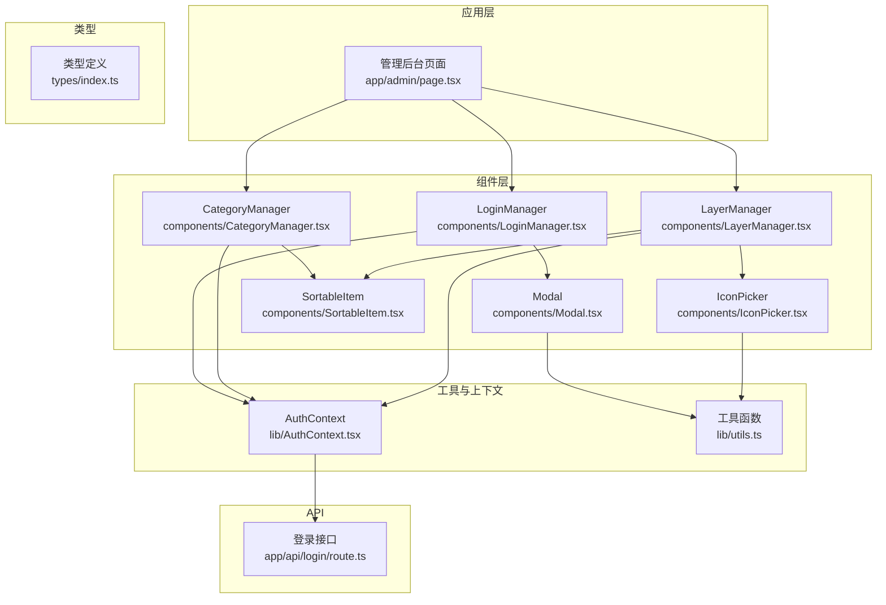
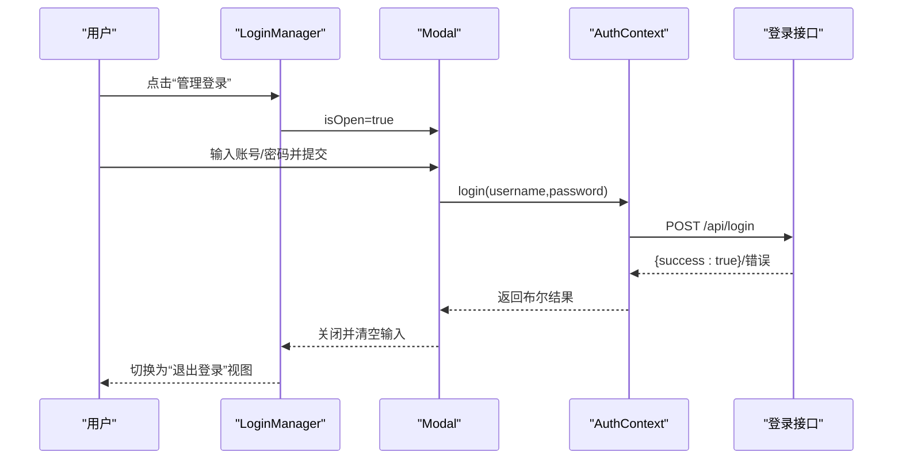
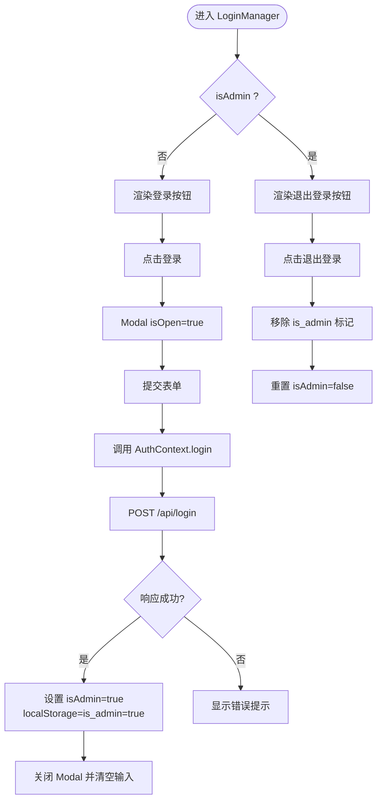
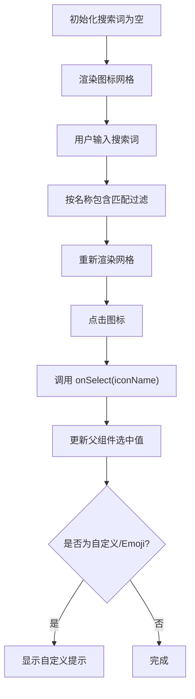
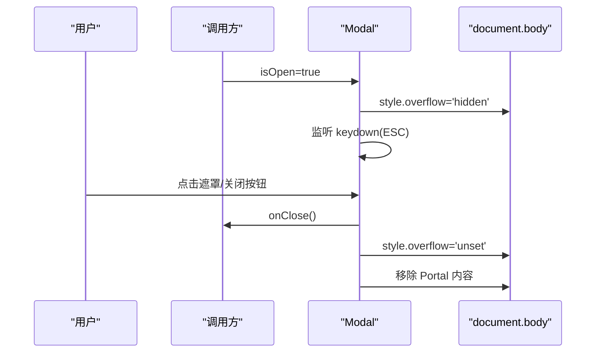
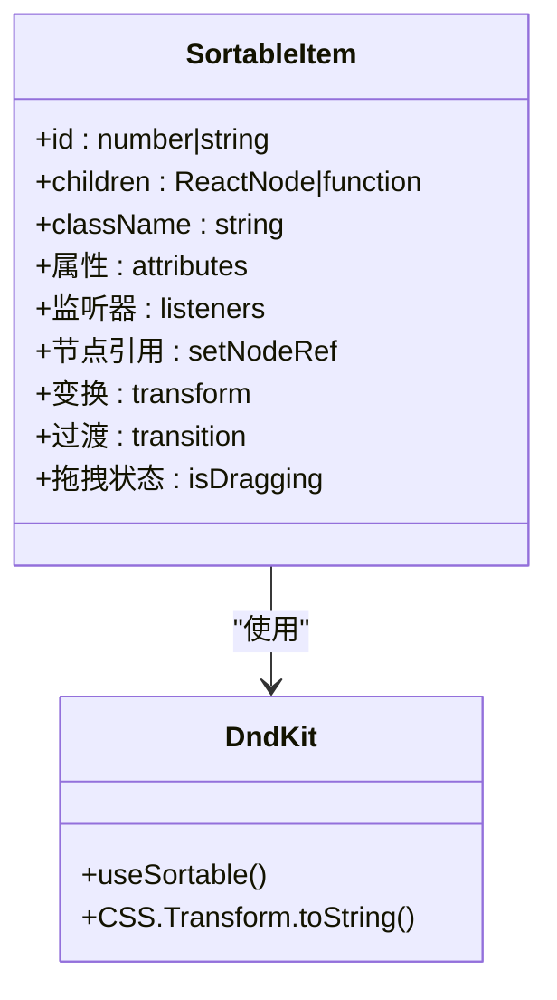
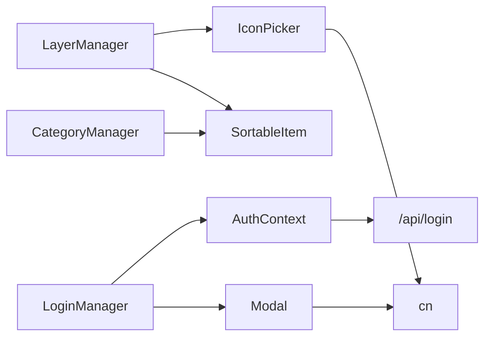

# 工具组件

<cite>
**本文引用的文件**
- [components/LoginManager.tsx](file://components/LoginManager.tsx)
- [components/IconPicker.tsx](file://components/IconPicker.tsx)
- [components/Modal.tsx](file://components/Modal.tsx)
- [components/SortableItem.tsx](file://components/SortableItem.tsx)
- [components/CategoryManager.tsx](file://components/CategoryManager.tsx)
- [components/LayerManager.tsx](file://components/LayerManager.tsx)
- [lib/AuthContext.tsx](file://lib/AuthContext.tsx)
- [app/admin/page.tsx](file://app/admin/page.tsx)
- [app/api/login/route.ts](file://app/api/login/route.ts)
- [types/index.ts](file://types/index.ts)
- [lib/utils.ts](file://lib/utils.ts)
</cite>

## 目录
1. [简介](#简介)
2. [项目结构](#项目结构)
3. [核心组件](#核心组件)
4. [架构总览](#架构总览)
5. [组件详解](#组件详解)
6. [依赖关系分析](#依赖关系分析)
7. [性能考量](#性能考量)
8. [故障排查指南](#故障排查指南)
9. [结论](#结论)
10. [附录](#附录)

## 简介
本文件聚焦于工具组件的综合文档，覆盖以下主题：
- LoginManager 的身份验证流程、会话管理与安全机制
- IconPicker 的图标选择器实现、搜索过滤与预览
- Modal 的模态框管理、遮罩层处理与键盘事件响应
- SortableItem 的拖拽排序实现、碰撞检测与动画效果
同时提供各组件的配置选项、事件处理与可访问性支持说明。

## 项目结构
本项目采用 Next.js App Router 结构，组件位于 components 目录，认证上下文位于 lib 目录，管理后台页面位于 app/admin，登录 API 在 app/api/login。

图表来源
- [app/admin/page.tsx](file://app/admin/page.tsx#L1-L311)
- [components/LoginManager.tsx](file://components/LoginManager.tsx#L1-L118)
- [components/IconPicker.tsx](file://components/IconPicker.tsx#L1-L154)
- [components/Modal.tsx](file://components/Modal.tsx#L1-L75)
- [components/SortableItem.tsx](file://components/SortableItem.tsx#L1-L37)
- [components/CategoryManager.tsx](file://components/CategoryManager.tsx#L1-L280)
- [components/LayerManager.tsx](file://components/LayerManager.tsx#L1-L312)
- [lib/AuthContext.tsx](file://lib/AuthContext.tsx#L1-L62)
- [app/api/login/route.ts](file://app/api/login/route.ts#L1-L19)
- [lib/utils.ts](file://lib/utils.ts#L1-L7)
- [types/index.ts](file://types/index.ts#L1-L34)

章节来源
- [app/admin/page.tsx](file://app/admin/page.tsx#L1-L311)
- [components/LoginManager.tsx](file://components/LoginManager.tsx#L1-L118)
- [components/IconPicker.tsx](file://components/IconPicker.tsx#L1-L154)
- [components/Modal.tsx](file://components/Modal.tsx#L1-L75)
- [components/SortableItem.tsx](file://components/SortableItem.tsx#L1-L37)
- [components/CategoryManager.tsx](file://components/CategoryManager.tsx#L1-L280)
- [components/LayerManager.tsx](file://components/LayerManager.tsx#L1-L312)
- [lib/AuthContext.tsx](file://lib/AuthContext.tsx#L1-L62)
- [app/api/login/route.ts](file://app/api/login/route.ts#L1-L19)
- [lib/utils.ts](file://lib/utils.ts#L1-L7)
- [types/index.ts](file://types/index.ts#L1-L34)

## 核心组件
- LoginManager：提供登录入口、表单与提交逻辑，集成 Modal 展示登录窗体，使用 AuthContext 进行认证与会话持久化。
- IconPicker：提供 Lucide 图标库的搜索与选择，支持自定义字符串/Emoji 回退显示。
- Modal：通用模态框组件，负责遮罩层、Esc 键关闭、焦点锁定与 Portal 渲染。
- SortableItem：基于 @dnd-kit 的可拖拽容器，暴露 attributes/listeners 并提供拖拽时的样式与层级控制。
- CategoryManager / LayerManager：管理后台中的排序与编辑功能，结合 SortableItem 实现拖拽排序，调用后端接口更新 display_order。

章节来源
- [components/LoginManager.tsx](file://components/LoginManager.tsx#L1-L118)
- [components/IconPicker.tsx](file://components/IconPicker.tsx#L1-L154)
- [components/Modal.tsx](file://components/Modal.tsx#L1-L75)
- [components/SortableItem.tsx](file://components/SortableItem.tsx#L1-L37)
- [components/CategoryManager.tsx](file://components/CategoryManager.tsx#L1-L280)
- [components/LayerManager.tsx](file://components/LayerManager.tsx#L1-L312)

## 架构总览
下图展示了登录流程与模态框交互的整体架构：

图表来源
- [components/LoginManager.tsx](file://components/LoginManager.tsx#L16-L30)
- [components/Modal.tsx](file://components/Modal.tsx#L47-L73)
- [lib/AuthContext.tsx](file://lib/AuthContext.tsx#L23-L41)
- [app/api/login/route.ts](file://app/api/login/route.ts#L4-L18)

## 组件详解

### LoginManager：身份验证流程、会话管理与安全
- 身份验证流程
  - 点击“管理登录”打开 Modal
  - 提交表单触发 login(username, password)，内部发起 /api/login 请求
  - 成功则设置 isAdmin=true 并将标记存入 localStorage；失败则显示错误提示
  - 登录成功后自动关闭 Modal 并清空输入
- 会话管理
  - 初始加载检查 localStorage 中的 is_admin 标记决定是否处于管理员态
  - 退出登录移除标记并重置状态
- 安全机制
  - 前端仅存储布尔标记，不存储敏感令牌
  - 登录请求为明文传输，实际项目应升级为 JWT 或服务端会话
  - 错误处理返回统一错误码，避免泄露细节

图表来源
- [components/LoginManager.tsx](file://components/LoginManager.tsx#L8-L30)
- [lib/AuthContext.tsx](file://lib/AuthContext.tsx#L13-L46)
- [app/api/login/route.ts](file://app/api/login/route.ts#L4-L18)

章节来源
- [components/LoginManager.tsx](file://components/LoginManager.tsx#L1-L118)
- [lib/AuthContext.tsx](file://lib/AuthContext.tsx#L1-L62)
- [app/api/login/route.ts](file://app/api/login/route.ts#L1-L19)

### IconPicker：图标选择器、搜索过滤与预览
- 图标选择器实现
  - 内置常用图标名列表，支持大小写不敏感的模糊匹配
  - 渲染网格布局，点击回调 onSelect(iconName)
  - 当选中图标不在内置列表时，显示“自定义/Emoji”提示
- 搜索过滤
  - 输入框实时过滤，过滤逻辑为包含匹配
- 预览与交互
  - 选中项高亮并放大，未选中项悬停高亮
  - 支持标题提示（图标名）

图表来源
- [components/IconPicker.tsx](file://components/IconPicker.tsx#L95-L153)

章节来源
- [components/IconPicker.tsx](file://components/IconPicker.tsx#L1-L154)

### Modal：模态框管理、遮罩层与键盘事件
- 模态框管理
  - 通过 isOpen 控制显示/隐藏；关闭时销毁 DOM
  - 使用 createPortal 将内容挂载到 document.body，保证层级与定位
- 遮罩层处理
  - 打开时禁用 body 滚动；关闭时恢复滚动
  - 背景半透明与模糊效果
- 键盘事件响应
  - 监听 Escape 键，按下即关闭
- 动画与样式
  - 弹出动画与缩放过渡，使用工具函数合并类名

图表来源
- [components/Modal.tsx](file://components/Modal.tsx#L24-L43)
- [components/Modal.tsx](file://components/Modal.tsx#L47-L73)
- [lib/utils.ts](file://lib/utils.ts#L4-L6)

章节来源
- [components/Modal.tsx](file://components/Modal.tsx#L1-L75)
- [lib/utils.ts](file://lib/utils.ts#L1-L7)

### SortableItem：拖拽排序、碰撞检测与动画
- 拖拽排序实现
  - 包装 useSortable，注入 attributes 与 listeners，绑定 ref
  - 应用 transform/transition/z-index/isDragging 等样式，实现拖拽时相对定位与层级提升
- 碰撞检测与策略
  - 与 DndContext/SortableContext 配合，使用 closestCenter 碰撞检测与 verticalListSortingStrategy 垂直列表排序策略
- 动画效果
  - 通过 transition 与 CSS.Transform.toString 实现平滑动画
- 事件处理
  - 由外层 DndContext.onDragEnd 处理排序结束后的数据更新与后端同步

图表来源
- [components/SortableItem.tsx](file://components/SortableItem.tsx#L14-L36)

章节来源
- [components/SortableItem.tsx](file://components/SortableItem.tsx#L1-L37)
- [components/CategoryManager.tsx](file://components/CategoryManager.tsx#L50-L74)
- [components/LayerManager.tsx](file://components/LayerManager.tsx#L50-L76)

### 可访问性支持
- Modal
  - ESC 键关闭，便于键盘用户快速退出
  - Portal 渲染在 body，避免层级问题影响焦点管理
- SortableItem
  - 通过 listeners 将拖拽事件绑定到可聚焦元素，支持键盘拖拽
- IconPicker
  - 为每个图标按钮提供 title，辅助屏幕阅读器识别
- LoginManager
  - 输入框 autoFocus，减少不必要的键盘移动

章节来源
- [components/Modal.tsx](file://components/Modal.tsx#L29-L43)
- [components/SortableItem.tsx](file://components/SortableItem.tsx#L22-L34)
- [components/IconPicker.tsx](file://components/IconPicker.tsx#L125-L139)
- [components/LoginManager.tsx](file://components/LoginManager.tsx#L70-L78)

## 依赖关系分析
- 组件间依赖
  - LoginManager 依赖 Modal 与 AuthContext
  - LayerManager/CategoryManager 依赖 SortableItem 与 IconPicker
  - Modal/IconPicker 依赖工具函数 cn
- 外部依赖
  - @dnd-kit 提供拖拽能力
  - lucide-react 提供图标
  - localStorage 用于会话标记持久化

图表来源
- [components/LoginManager.tsx](file://components/LoginManager.tsx#L4-L5)
- [components/LayerManager.tsx](file://components/LayerManager.tsx#L23-L23)
- [components/CategoryManager.tsx](file://components/CategoryManager.tsx#L21-L21)
- [components/Modal.tsx](file://components/Modal.tsx#L4-L4)
- [components/IconPicker.tsx](file://components/IconPicker.tsx#L3-L3)
- [lib/AuthContext.tsx](file://lib/AuthContext.tsx#L25-L29)
- [app/api/login/route.ts](file://app/api/login/route.ts#L4-L18)

章节来源
- [components/LoginManager.tsx](file://components/LoginManager.tsx#L1-L118)
- [components/LayerManager.tsx](file://components/LayerManager.tsx#L1-L312)
- [components/CategoryManager.tsx](file://components/CategoryManager.tsx#L1-L280)
- [components/Modal.tsx](file://components/Modal.tsx#L1-L75)
- [components/IconPicker.tsx](file://components/IconPicker.tsx#L1-L154)
- [lib/AuthContext.tsx](file://lib/AuthContext.tsx#L1-L62)
- [app/api/login/route.ts](file://app/api/login/route.ts#L1-L19)
- [lib/utils.ts](file://lib/utils.ts#L1-L7)

## 性能考量
- Modal
  - Portal 渲染避免了深层 DOM 重排；仅在 isOpen 时挂载，减少常驻开销
  - ESC 键监听在打开时注册，关闭时清理，避免内存泄漏
- IconPicker
  - 过滤为 O(n) 遍历，n 为内置图标数量（约 80），性能可接受；建议在大量图标场景引入虚拟滚动
- SortableItem
  - transform/transition 由浏览器合成层加速；拖拽时提升 z-index，避免重绘
- AuthContext
  - localStorage 读写为同步操作，影响极小；建议在大型应用中考虑服务端会话以降低前端状态复杂度

## 故障排查指南
- 登录失败
  - 检查 /api/login 是否返回 200；确认用户名/密码是否正确
  - 查看 AuthContext.login 的异常捕获与返回值
- 模态框无法关闭
  - 确认 isOpen 状态与 onClose 回调是否正确传递
  - 检查 ESC 键事件是否被其他元素拦截
- 拖拽无效
  - 确认 DndContext 传感器配置与 onDragEnd 事件是否绑定
  - 检查 SortableContext 的 items 与 strategy 是否一致
- 自定义图标显示异常
  - 若选中图标不在内置列表，组件会回退为文本/Emoji 显示，确认输入是否为合法 Emoji 或字符串

章节来源
- [app/api/login/route.ts](file://app/api/login/route.ts#L4-L18)
- [lib/AuthContext.tsx](file://lib/AuthContext.tsx#L23-L41)
- [components/Modal.tsx](file://components/Modal.tsx#L29-L43)
- [components/CategoryManager.tsx](file://components/CategoryManager.tsx#L50-L74)
- [components/LayerManager.tsx](file://components/LayerManager.tsx#L50-L76)
- [components/IconPicker.tsx](file://components/IconPicker.tsx#L144-L150)

## 结论
上述工具组件围绕“认证、选择、弹窗、排序”四大主题构建，具备清晰的职责划分与良好的可扩展性。建议在生产环境中进一步强化安全（JWT/会话）、性能（虚拟滚动、防抖）与可访问性（ARIA、焦点管理）方面的实现。

## 附录
- 配置选项与事件
  - LoginManager
    - 属性：无
    - 事件：无；内部通过 AuthContext.login/logout 触发
  - IconPicker
    - 属性：selectedIcon, onSelect(iconName)
    - 事件：无；onSelect 为外部回调
  - Modal
    - 属性：isOpen, onClose(), title, children, className?
    - 事件：Esc 键关闭
  - SortableItem
    - 属性：id, children(children 或函数), className?
    - 事件：由外层 DndContext/onDragEnd 处理

章节来源
- [components/LoginManager.tsx](file://components/LoginManager.tsx#L1-L118)
- [components/IconPicker.tsx](file://components/IconPicker.tsx#L6-L9)
- [components/Modal.tsx](file://components/Modal.tsx#L6-L12)
- [components/SortableItem.tsx](file://components/SortableItem.tsx#L6-L12)