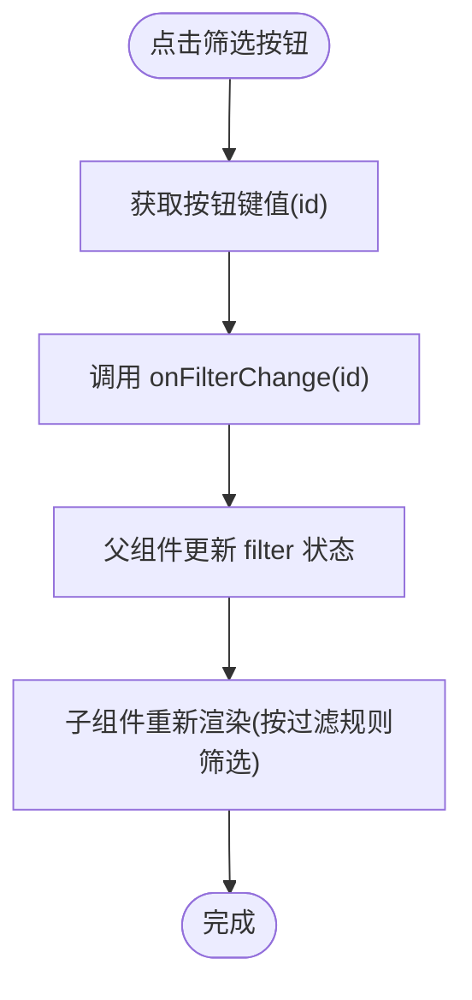

# 核心组件

<cite>
**本文档引用的文件**
- [README.md](file://README.md)
- [app/page.tsx](file://app/page.tsx)
- [app/admin/page.tsx](file://app/admin/page.tsx)
- [components/FilterBar.tsx](file://components/FilterBar.tsx)
- [components/StatsPanel.tsx](file://components/StatsPanel.tsx)
- [components/TechCard.tsx](file://components/TechCard.tsx)
- [components/LayerManager.tsx](file://components/LayerManager.tsx)
- [components/CategoryManager.tsx](file://components/CategoryManager.tsx)
- [components/TechItemManager.tsx](file://components/TechItemManager.tsx)
- [components/SolutionManager.tsx](file://components/SolutionManager.tsx)
- [components/SolutionsLayer.tsx](file://components/SolutionsLayer.tsx)
- [components/SortableItem.tsx](file://components/SortableItem.tsx)
- [components/Modal.tsx](file://components/Modal.tsx)
- [components/IconPicker.tsx](file://components/IconPicker.tsx)
- [types/index.ts](file://types/index.ts)
- [lib/db.ts](file://lib/db.ts)
- [app/api/layers/route.ts](file://app/api/layers/route.ts)
- [app/api/categories/route.ts](file://app/api/categories/route.ts)
- [app/api/tech-items/route.ts](file://app/api/tech-items/route.ts)
- [app/api/stats/route.ts](file://app/api/stats/route.ts)
- [app/api/reorder/route.ts](file://app/api/reorder/route.ts)
</cite>

## 更新摘要
**变更内容**
- 新增四个核心管理组件：LayerManager、CategoryManager、TechItemManager、SolutionManager
- 增强前端性能优化：引入dnd-kit拖拽排序、深度状态同步、乐观更新机制
- 完善解决方案管理功能：支持动态列配置、技术项分组展示
- 优化用户体验：模态框组件、图标选择器、拖拽排序交互

## 目录
1. [简介](#简介)
2. [项目结构](#项目结构)
3. [核心组件](#核心组件)
4. [架构总览](#架构总览)
5. [详细组件分析](#详细组件分析)
6. [依赖分析](#依赖分析)
7. [性能考虑](#性能考虑)
8. [故障排查指南](#故障排查指南)
9. [结论](#结论)
10. [附录](#附录)

## 简介
本项目是一个基于 Next.js App Router 的技术蓝图可视化系统，采用 TypeScript、Tailwind CSS 和 SQLite 实现。核心目标是通过层级-分类-技术项三层结构，呈现"全栈技术栈规划"，并提供筛选、统计与后台管理能力。

**更新** 项目现已集成完整的管理组件体系，支持拖拽排序、动态配置和解决方案管理，大幅提升了数据管理和用户体验。

- 面向不同经验水平的开发者：从页面到组件、从类型到数据流，逐层展开说明。
- 关注可复用性、可测试性与可维护性：组件职责清晰、数据单向流动、状态集中管理。
- 提供使用示例与最佳实践：结合实际代码路径，避免空谈。

## 项目结构
项目采用"页面 + 组件 + 类型 + 库 + API 路由"的分层组织方式，核心页面负责数据拉取与状态管理，组件负责渲染与交互，类型定义贯穿前后端，API 路由提供数据接口，SQLite 存储业务数据。

**图表来源**
- [app/page.tsx](file://app/page.tsx#L1-L200)
- [components/LayerManager.tsx](file://components/LayerManager.tsx#L1-L312)
- [components/CategoryManager.tsx](file://components/CategoryManager.tsx#L1-L280)
- [components/TechItemManager.tsx](file://components/TechItemManager.tsx#L1-L444)
- [components/SolutionManager.tsx](file://components/SolutionManager.tsx#L1-L508)
- [components/SolutionsLayer.tsx](file://components/SolutionsLayer.tsx#L1-L269)

**章节来源**
- [README.md](file://README.md#L20-L43)
- [app/page.tsx](file://app/page.tsx#L1-L200)
- [app/admin/page.tsx](file://app/admin/page.tsx#L1-L311)

## 核心组件
本节聚焦七个核心 React 组件：TechCard、FilterBar、StatsPanel、LayerManager、CategoryManager、TechItemManager、SolutionManager。它们分别承担"技术项展示"、"筛选控制"、"统计面板"、"层级管理"、"分类管理"、"技术项管理"、"解决方案管理"的职责，配合页面状态与 API 数据，形成完整的数据-视图闭环。

- **TechCard**：接收单个技术项，根据状态与优先级渲染样式，并提供悬停提示。
- **FilterBar**：提供多种筛选条件，通过回调通知父组件更新过滤状态。
- **StatsPanel**：接收聚合统计，展示"已有/缺失/总数/覆盖率"，并提供图例说明。
- **LayerManager**：支持层级的增删改查和拖拽排序，提供完整的后台管理界面。
- **CategoryManager**：管理分类的显示顺序和基本信息，支持拖拽排序。
- **TechItemManager**：管理技术项的状态切换、优先级设置和显示顺序。
- **SolutionManager**：管理解决方案的完整配置，支持动态列和复杂的技术项分组。

**章节来源**
- [components/TechCard.tsx](file://components/TechCard.tsx#L1-L37)
- [components/FilterBar.tsx](file://components/FilterBar.tsx#L1-L52)
- [components/StatsPanel.tsx](file://components/StatsPanel.tsx#L1-L84)
- [components/LayerManager.tsx](file://components/LayerManager.tsx#L1-L312)
- [components/CategoryManager.tsx](file://components/CategoryManager.tsx#L1-L280)
- [components/TechItemManager.tsx](file://components/TechItemManager.tsx#L1-L444)
- [components/SolutionManager.tsx](file://components/SolutionManager.tsx#L1-L508)
- [types/index.ts](file://types/index.ts#L1-L34)

## 架构总览
下图展示了页面与组件、API、数据库之间的数据流向与调用关系。页面在客户端发起并发请求，获取层级、分类、技术项与统计信息，随后在组件间传递状态与事件，完成筛选与展示。

**图表来源**
- [app/page.tsx](file://app/page.tsx#L39-L63)
- [app/api/layers/route.ts](file://app/api/layers/route.ts#L6-L13)
- [app/api/categories/route.ts](file://app/api/categories/route.ts#L6-L13)
- [app/api/tech-items/route.ts](file://app/api/tech-items/route.ts#L7-L14)
- [app/api/stats/route.ts](file://app/api/stats/route.ts#L6-L10)
- [lib/db.ts](file://lib/db.ts#L53-L114)
- [lib/db.ts](file://lib/db.ts#L220-L239)

## 详细组件分析

### TechCard 组件
- **职责**：渲染单个技术项卡片，依据状态(active/missing)与优先级(high/medium/low)设置样式；支持悬停显示完整描述。
- **属性接口**：
  - item: TechItem（来自 types/index.ts）
- **事件处理**：无外部事件；内部通过 CSS hover 触发提示展示。
- **状态管理**：无本地状态，纯函数组件。
- **设计模式**：受控渲染，样式与数据解耦。
- **可复用性**：卡片样式独立，适合在不同上下文复用。
- **性能优化**：作为子节点被频繁渲染，保持最小化计算与 DOM 结构。

**图表来源**
- [components/TechCard.tsx](file://components/TechCard.tsx#L1-L37)
- [types/index.ts](file://types/index.ts#L16-L26)

**章节来源**
- [components/TechCard.tsx](file://components/TechCard.tsx#L1-L37)
- [types/index.ts](file://types/index.ts#L16-L26)

### FilterBar 组件
- **职责**：提供一组预设筛选按钮，点击后通过回调通知父组件更新过滤状态。
- **属性接口**：
  - filter: string（当前选中的筛选键）
  - onFilterChange: (filter: string) => void（回调函数）
- **事件处理**：每个按钮绑定 onClick，触发 onFilterChange。
- **状态管理**：无本地状态；由父组件持有并传递。
- **设计模式**：单向数据流 + 回调事件。
- **可复用性**：按钮集合可抽象为配置，便于扩展更多筛选维度。
- **性能优化**：按钮列表为常量数组，渲染稳定；通过类名切换实现视觉反馈。

**图表来源**
- [components/FilterBar.tsx](file://components/FilterBar.tsx#L6-L45)

**章节来源**
- [components/FilterBar.tsx](file://components/FilterBar.tsx#L1-L52)

### StatsPanel 组件
- **职责**：展示统计信息（已有/缺失/总数/覆盖率），并提供颜色与图例说明。
- **属性接口**：
  - stats: Stats（来自 types/index.ts）
- **事件处理**：无；仅展示。
- **状态管理**：无本地状态。
- **设计模式**：展示型组件，数据来自父组件 props。
- **可复用性**：统计卡片结构可复用，适用于其他聚合数据展示。
- **性能优化**：静态布局，渲染成本低。

**图表来源**
- [components/StatsPanel.tsx](file://components/StatsPanel.tsx#L1-L84)
- [types/index.ts](file://types/index.ts#L28-L33)

**章节来源**
- [components/StatsPanel.tsx](file://components/StatsPanel.tsx#L1-L84)
- [types/index.ts](file://types/index.ts#L28-L33)

### LayerManager 组件
- **职责**：管理层级的完整生命周期，包括创建、编辑、删除、拖拽排序等功能。
- **属性接口**：
  - layers: Layer[]（初始层级数据）
  - onUpdate: () => void（数据更新回调）
- **事件处理**：支持表单提交、删除确认、拖拽排序、图标选择等。
- **状态管理**：本地维护模态框状态、编辑状态、当前编辑对象等。
- **设计模式**：基于dnd-kit的拖拽排序、模态框管理、权限控制。
- **可复用性**：通用的管理器模式，可扩展到其他实体。
- **性能优化**：使用useMemo进行深度比较，避免不必要的重渲染。

**图表来源**
- [components/LayerManager.tsx](file://components/LayerManager.tsx#L25-L312)
- [types/index.ts](file://types/index.ts#L1-L6)

**章节来源**
- [components/LayerManager.tsx](file://components/LayerManager.tsx#L1-L312)
- [types/index.ts](file://types/index.ts#L1-L6)

### CategoryManager 组件
- **职责**：管理特定层级下的分类，支持显示顺序调整和基本信息维护。
- **属性接口**：
  - layerId: number（所属层级ID）
  - categories: Category[]（初始分类数据）
  - onUpdate: () => void（数据更新回调）
- **事件处理**：表单提交、删除确认、拖拽排序。
- **状态管理**：本地维护模态框状态、编辑状态、当前编辑对象。
- **设计模式**：基于dnd-kit的垂直列表排序、权限控制。
- **可复用性**：通用分类管理模板，可适配其他层级结构。
- **性能优化**：深度状态同步，确保与父组件数据一致性。

**图表来源**
- [components/CategoryManager.tsx](file://components/CategoryManager.tsx#L23-L280)
- [types/index.ts](file://types/index.ts#L8-L14)

**章节来源**
- [components/CategoryManager.tsx](file://components/CategoryManager.tsx#L1-L280)
- [types/index.ts](file://types/index.ts#L8-L14)

### TechItemManager 组件
- **职责**：管理特定分类下的技术项，支持状态切换、优先级设置、显示顺序调整。
- **属性接口**：
  - categoryId: number（所属分类ID）
  - items: TechItem[]（初始技术项数据）
  - onUpdate: () => void（数据更新回调）
- **事件处理**：表单提交、删除确认、状态切换、拖拽排序。
- **状态管理**：本地维护模态框状态、编辑状态、当前编辑对象。
- **设计模式**：基于dnd-kit的拖拽排序、乐观更新、权限控制。
- **可复用性**：通用技术项管理模板，支持状态切换和优先级管理。
- **性能优化**：深度状态同步、乐观更新机制、防抖处理。

**图表来源**
- [components/TechItemManager.tsx](file://components/TechItemManager.tsx#L25-L444)
- [types/index.ts](file://types/index.ts#L16-L26)

**章节来源**
- [components/TechItemManager.tsx](file://components/TechItemManager.tsx#L1-L444)
- [types/index.ts](file://types/index.ts#L16-L26)

### SolutionManager 组件
- **职责**：管理解决方案的完整配置，支持动态列配置、技术项分组和批量操作。
- **属性接口**：
  - isOpen: boolean（模态框打开状态）
  - onClose: () => void（模态框关闭回调）
  - layerId: number（所属层级ID）
  - category: Category | null（当前编辑的分类）
  - allTechItems: TechItem[]（所有技术项数据）
  - onUpdate: () => void（数据更新回调）
- **事件处理**：表单提交、列管理、技术项添加删除、状态切换。
- **状态管理**：本地维护解决方案配置、删除项列表、列配置等。
- **设计模式**：动态网格布局、JSON序列化存储、批量API调用。
- **可复用性**：通用解决方案管理模板，支持复杂的技术项分组。
- **性能优化**：批量保存、状态持久化、动态列配置。

**图表来源**
- [components/SolutionManager.tsx](file://components/SolutionManager.tsx#L15-L508)
- [types/index.ts](file://types/index.ts#L8-L26)

**章节来源**
- [components/SolutionManager.tsx](file://components/SolutionManager.tsx#L1-L508)
- [types/index.ts](file://types/index.ts#L8-L26)

### SolutionsLayer 组件
- **职责**：展示解决方案层的内容，支持搜索、编辑和动态列配置。
- **属性接口**：
  - layer: Layer（层级信息）
  - categories: Category[]（分类列表）
  - techItems: TechItem[]（技术项数据）
  - onUpdate: () => void（数据更新回调）
- **事件处理**：搜索过滤、解决方案编辑、创建新解决方案。
- **状态管理**：本地维护搜索状态、编辑状态、模态框状态。
- **设计模式**：动态网格布局、JSON解析存储、权限控制。
- **可复用性**：通用解决方案展示模板，支持自定义列配置。
- **性能优化**：搜索过滤、动态列配置、懒加载。

**图表来源**
- [components/SolutionsLayer.tsx](file://components/SolutionsLayer.tsx#L18-L269)
- [types/index.ts](file://types/index.ts#L1-L14)

**章节来源**
- [components/SolutionsLayer.tsx](file://components/SolutionsLayer.tsx#L1-L269)
- [types/index.ts](file://types/index.ts#L1-L14)

### 页面 Home 的数据流与组合关系
- **数据获取**：在客户端并发请求四个 API，批量更新状态，减少重渲染。
- **状态管理**：使用 useState 管理层级、分类、技术项、统计；使用 useMemo 对技术项按分类分组，避免每次渲染重建映射。
- **过滤逻辑**：在父组件维护 filter 状态，通过 getCategoryItems/getFilteredItems 控制子组件渲染。
- **组件组合**：Header/FilterBar/主内容区/StatsPanel；部分分类容器内嵌管理器组件。

**图表来源**
- [app/page.tsx](file://app/page.tsx#L39-L63)
- [app/page.tsx](file://app/page.tsx#L26-L34)
- [app/page.tsx](file://app/page.tsx#L74-L84)

**章节来源**
- [app/page.tsx](file://app/page.tsx#L1-L200)

### 后台管理页面的数据流
- **数据获取**：加载技术项与分类列表。
- **表单提交**：支持新增与编辑两种模式，统一走 PUT/POST。
- **删除流程**：确认后调用 DELETE，再刷新列表。
- **状态管理**：表单数据与编辑态分离，提交成功后重置表单。

**图表来源**
- [app/admin/page.tsx](file://app/admin/page.tsx#L23-L39)
- [app/admin/page.tsx](file://app/admin/page.tsx#L41-L70)
- [app/admin/page.tsx](file://app/admin/page.tsx#L86-L96)

**章节来源**
- [app/admin/page.tsx](file://app/admin/page.tsx#L1-L311)

## 依赖分析
- **组件依赖**：
  - Home 依赖 TechCard、FilterBar、StatsPanel、LayerManager、CategoryManager、TechItemManager、SolutionsLayer。
  - 管理组件依赖 Modal、IconPicker、SortableItem 等基础组件。
  - TechCard 依赖 TechItem 类型。
  - FilterBar 依赖字符串类型的 filter 与回调。
  - StatsPanel 依赖 Stats 类型。
- **类型依赖**：types/index.ts 为全局共享的类型定义。
- **数据依赖**：页面通过 API 路由访问 lib/db.ts，后者封装 SQLite 操作。
- **API 依赖**：各 API 路由均调用 lib/db.ts 的对应方法，支持批量排序更新。

**图表来源**
- [app/page.tsx](file://app/page.tsx#L1-L14)
- [components/LayerManager.tsx](file://components/LayerManager.tsx#L1-L24)
- [components/CategoryManager.tsx](file://components/CategoryManager.tsx#L1-L21)
- [components/TechItemManager.tsx](file://components/TechItemManager.tsx#L1-L23)
- [components/SolutionManager.tsx](file://components/SolutionManager.tsx#L1-L13)
- [components/SolutionsLayer.tsx](file://components/SolutionsLayer.tsx#L1-L16)
- [types/index.ts](file://types/index.ts#L1-L34)
- [lib/db.ts](file://lib/db.ts#L1-L50)
- [app/api/layers/route.ts](file://app/api/layers/route.ts#L1-L5)
- [app/api/categories/route.ts](file://app/api/categories/route.ts#L1-L5)
- [app/api/tech-items/route.ts](file://app/api/tech-items/route.ts#L1-L6)
- [app/api/stats/route.ts](file://app/api/stats/route.ts#L1-L5)
- [app/api/reorder/route.ts](file://app/api/reorder/route.ts#L1-L6)

**章节来源**
- [types/index.ts](file://types/index.ts#L1-L34)
- [lib/db.ts](file://lib/db.ts#L1-L312)

## 性能考虑
- **并发请求**：页面使用 Promise.all 并发拉取多路数据，降低首屏等待时间。
- **状态合并**：一次性批量 setXXX，减少中间态渲染。
- **记忆化分组**：使用 useMemo 将 techItems 按 category_id 分组，避免重复创建映射。
- **渲染裁剪**：FilterBar 的过滤逻辑在父组件执行，子组件仅做展示，降低重渲染范围。
- **组件粒度**：TechCard 为轻量展示组件，StatsPanel 为静态布局，整体开销可控。
- **拖拽优化**：使用dnd-kit的useSortable hook，提供流畅的拖拽体验。
- **深度状态同步**：管理组件使用深度比较算法，确保状态与数据源的一致性。
- **乐观更新**：技术项状态切换采用乐观更新，提升用户体验。
- **批量排序**：排序操作通过单次API调用批量更新，减少数据库往返。

**章节来源**
- [app/page.tsx](file://app/page.tsx#L39-L63)
- [app/page.tsx](file://app/page.tsx#L26-L34)
- [components/FilterBar.tsx](file://components/FilterBar.tsx#L74-L79)
- [components/TechItemManager.tsx](file://components/TechItemManager.tsx#L41-L49)
- [components/LayerManager.tsx](file://components/LayerManager.tsx#L50-L76)

## 故障排查指南
- **数据为空或不更新**
  - 检查 API 是否返回正确 JSON（Headers/Status）。
  - 确认页面 useEffect 的依赖与 refreshTrigger 是否触发。
  - 参考：页面并发请求与错误捕获。
- **筛选无效**
  - 确认 FilterBar 的 onFilterChange 是否被调用。
  - 确认 Home 的 filter 状态与 getFilteredItems 的分支逻辑。
- **统计异常**
  - 检查 /api/stats 的实现与 lib/db.ts 的统计逻辑。
- **后台保存失败**
  - 检查表单字段与请求体格式，确认 PUT/POST/DELETE 的 URL 参数与 Body。
  - 参考：后台页面的表单提交与删除流程。
- **拖拽排序问题**
  - 确认dnd-kit依赖已正确安装和配置。
  - 检查sortableId是否唯一且正确传递。
  - 验证handleDragEnd事件的处理逻辑。
- **管理组件权限问题**
  - 确认useAuth返回的isAdmin状态是否正确。
  - 检查权限控制逻辑是否在所有管理组件中一致应用。

**章节来源**
- [app/page.tsx](file://app/page.tsx#L60-L62)
- [app/page.tsx](file://app/page.tsx#L74-L79)
- [app/api/stats/route.ts](file://app/api/stats/route.ts#L6-L14)
- [lib/db.ts](file://lib/db.ts#L220-L239)
- [app/admin/page.tsx](file://app/admin/page.tsx#L41-L70)
- [app/admin/page.tsx](file://app/admin/page.tsx#L86-L96)
- [components/LayerManager.tsx](file://components/LayerManager.tsx#L129-L131)
- [components/CategoryManager.tsx](file://components/CategoryManager.tsx#L120-L122)
- [components/TechItemManager.tsx](file://components/TechItemManager.tsx#L166-L168)

## 结论
本项目通过清晰的页面-组件-类型-API-数据库分层，实现了"层级-分类-技术项"的可视化与管理。新增的管理组件体系大幅提升了系统的可管理性和用户体验，支持拖拽排序、动态配置和解决方案管理等高级功能。核心组件职责单一、接口明确、易于复用与测试。页面侧采用并发请求与记忆化策略，配合管理组件的深度状态同步和乐观更新机制，保证了良好的性能与用户体验。建议后续在大数据量场景引入虚拟化与缓存策略，并完善单元测试与 E2E 测试覆盖。

## 附录
- **使用示例（路径参考）**
  - 在页面中引入并使用 TechCard：[app/page.tsx](file://app/page.tsx#L214-L217)
  - 在页面中引入并使用 FilterBar：[app/page.tsx](file://app/page.tsx#L144-L144)
  - 在页面中引入并使用 StatsPanel：[app/page.tsx](file://app/page.tsx#L234-L234)
  - 在页面中引入并使用 LayerManager：[app/page.tsx](file://app/page.tsx#L117-L117)
  - 在页面中引入并使用 CategoryManager：[app/page.tsx](file://app/page.tsx#L179-L183)
  - 在页面中引入并使用 TechItemManager：[app/page.tsx](file://app/page.tsx#L189-L189)
  - 在页面中引入并使用 SolutionsLayer：[app/page.tsx](file://app/page.tsx#L154-L161)
  - 后台表单提交（新增/编辑/删除）：[app/admin/page.tsx](file://app/admin/page.tsx#L41-L70)
- **最佳实践**
  - **组件设计**：单一职责、受控渲染、明确的 props 接口。
  - **状态管理**：集中于页面，子组件只消费 props。
  - **数据流**：单向数据流 + 回调事件，避免跨组件直接修改状态。
  - **性能**：并发请求、记忆化、渲染裁剪、必要时引入虚拟化。
  - **可测试性**：将副作用（网络请求）抽象为可注入的函数，便于测试替身与断言。
  - **管理组件**：使用深度状态同步确保数据一致性，采用乐观更新提升用户体验。
  - **拖拽排序**：合理使用dnd-kit，确保sortableId唯一性和事件处理正确性。
  - **权限控制**：在所有管理组件中统一应用权限检查，确保数据安全。