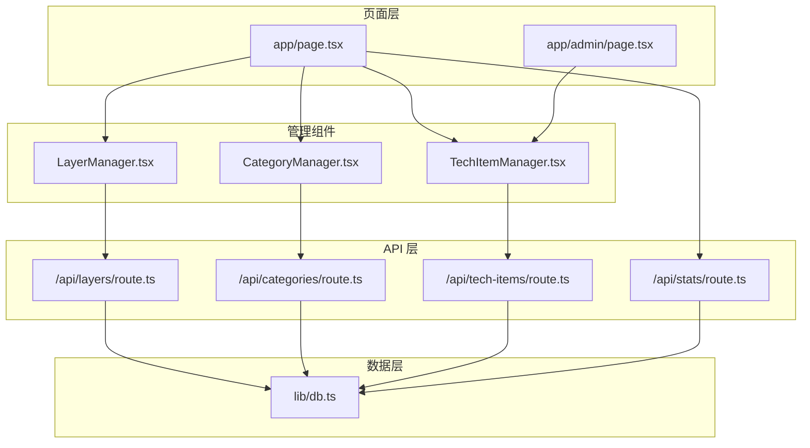
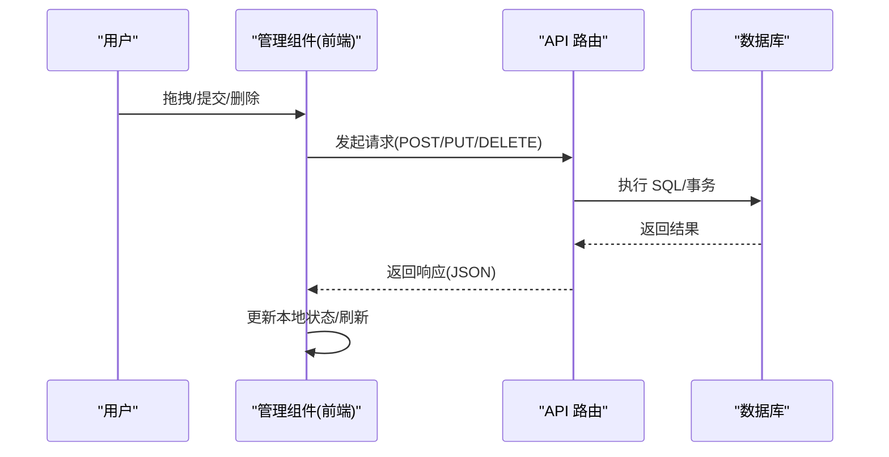
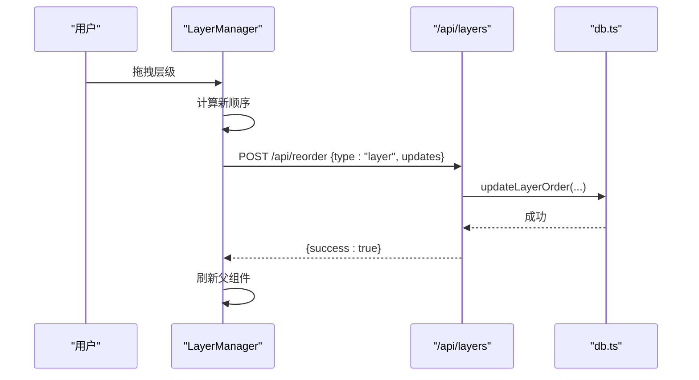
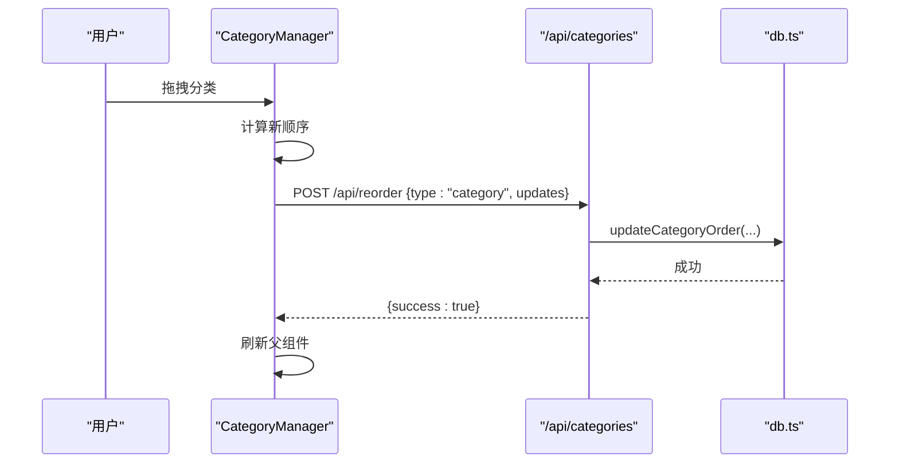
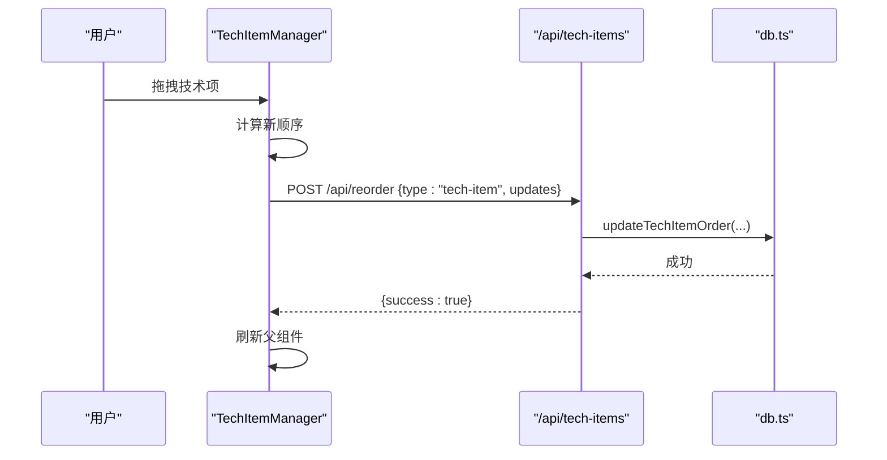
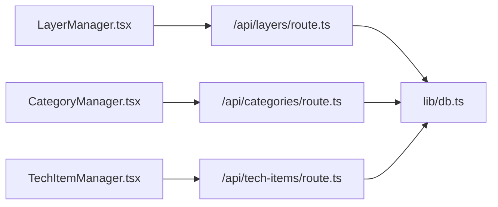

# 管理组件

<cite>
**本文档引用的文件**
- [app/admin/page.tsx](file://app/admin/page.tsx)
- [components/LayerManager.tsx](file://components/LayerManager.tsx)
- [components/CategoryManager.tsx](file://components/CategoryManager.tsx)
- [components/TechItemManager.tsx](file://components/TechItemManager.tsx)
- [app/api/layers/route.ts](file://app/api/layers/route.ts)
- [app/api/categories/route.ts](file://app/api/categories/route.ts)
- [app/api/tech-items/route.ts](file://app/api/tech-items/route.ts)
- [lib/db.ts](file://lib/db.ts)
- [types/index.ts](file://types/index.ts)
- [app/page.tsx](file://app/page.tsx)
- [components/SolutionsLayer.tsx](file://components/SolutionsLayer.tsx)
- [app/api/stats/route.ts](file://app/api/stats/route.ts)
</cite>

## 目录
1. [简介](#简介)
2. [项目结构](#项目结构)
3. [核心组件](#核心组件)
4. [架构总览](#架构总览)
5. [组件详细分析](#组件详细分析)
6. [依赖关系分析](#依赖关系分析)
7. [性能考量](#性能考量)
8. [故障排查指南](#故障排查指南)
9. [结论](#结论)

## 简介
本文件聚焦于管理组件的实现与使用，涵盖三层管理能力：
- LayerManager：层级的增删改查、排序与拖拽
- CategoryManager：分类的增删改查、父子关系维护与批量排序
- TechItemManager：技术项的增删改查、表单验证与数据同步

同时，文档提供 CRUD 接口、权限控制与状态管理模式，并给出业务流程示例与错误处理策略。

## 项目结构
管理组件主要分布在以下位置：
- 页面入口与展示层：app/page.tsx、app/admin/page.tsx
- 管理组件：components/LayerManager.tsx、components/CategoryManager.tsx、components/TechItemManager.tsx
- API 层：app/api/layers/route.ts、app/api/categories/route.ts、app/api/tech-items/route.ts
- 数据访问层：lib/db.ts
- 类型定义：types/index.ts
- 统计接口：app/api/stats/route.ts

图表来源
- [app/page.tsx](file://app/page.tsx#L143-L237)
- [app/admin/page.tsx](file://app/admin/page.tsx#L1-L311)
- [components/LayerManager.tsx](file://components/LayerManager.tsx#L1-L312)
- [components/CategoryManager.tsx](file://components/CategoryManager.tsx#L1-L280)
- [components/TechItemManager.tsx](file://components/TechItemManager.tsx#L1-L444)
- [app/api/layers/route.ts](file://app/api/layers/route.ts#L1-L48)
- [app/api/categories/route.ts](file://app/api/categories/route.ts#L1-L48)
- [app/api/tech-items/route.ts](file://app/api/tech-items/route.ts#L1-L50)
- [lib/db.ts](file://lib/db.ts#L1-L312)
- [app/api/stats/route.ts](file://app/api/stats/route.ts#L1-L15)

章节来源
- [app/page.tsx](file://app/page.tsx#L143-L237)
- [app/admin/page.tsx](file://app/admin/page.tsx#L1-L311)
- [components/LayerManager.tsx](file://components/LayerManager.tsx#L1-L312)
- [components/CategoryManager.tsx](file://components/CategoryManager.tsx#L1-L280)
- [components/TechItemManager.tsx](file://components/TechItemManager.tsx#L1-L444)
- [app/api/layers/route.ts](file://app/api/layers/route.ts#L1-L48)
- [app/api/categories/route.ts](file://app/api/categories/route.ts#L1-L48)
- [app/api/tech-items/route.ts](file://app/api/tech-items/route.ts#L1-L50)
- [lib/db.ts](file://lib/db.ts#L1-L312)
- [app/api/stats/route.ts](file://app/api/stats/route.ts#L1-L15)

## 核心组件
- LayerManager：负责层级的创建、编辑、删除与拖拽排序，通过 /api/reorder 批量更新 display_order 并触发父组件刷新。
- CategoryManager：负责分类的创建、编辑、删除与拖拽排序，维护 layer_id 父子关系，支持批量排序。
- TechItemManager：负责技术项的创建、编辑、删除、状态切换与拖拽排序，提供表单校验与乐观更新策略。

章节来源
- [components/LayerManager.tsx](file://components/LayerManager.tsx#L50-L76)
- [components/CategoryManager.tsx](file://components/CategoryManager.tsx#L50-L74)
- [components/TechItemManager.tsx](file://components/TechItemManager.tsx#L58-L84)

## 架构总览
管理组件采用“组件-API-数据库”三层架构：
- 组件层：负责交互与本地状态管理（含拖拽、表单、权限判断）
- API 层：RESTful 接口，统一初始化数据库，处理 CRUD 与批量排序
- 数据库层：SQLite 存储，提供批量更新事务与数据一致性保障

图表来源
- [components/LayerManager.tsx](file://components/LayerManager.tsx#L67-L71)
- [components/CategoryManager.tsx](file://components/CategoryManager.tsx#L65-L69)
- [components/TechItemManager.tsx](file://components/TechItemManager.tsx#L75-L79)
- [app/api/layers/route.ts](file://app/api/layers/route.ts#L15-L33)
- [app/api/categories/route.ts](file://app/api/categories/route.ts#L15-L33)
- [app/api/tech-items/route.ts](file://app/api/tech-items/route.ts#L16-L35)
- [lib/db.ts](file://lib/db.ts#L241-L282)

## 组件详细分析

### LayerManager（层级管理）
- 层级 CRUD
  - 创建/更新：调用 /api/layers，携带 name、icon、display_order
  - 删除：调用 /api/layers?id=...
- 拖拽排序
  - 使用 @dnd-kit 实现拖拽，拖拽结束时计算新的 display_order 序列
  - 通过 /api/reorder(type=layer, updates) 批量更新
- 权限控制
  - 仅管理员可见与可操作
- 错误处理
  - 弹窗提示与控制台输出；删除前二次确认

图表来源
- [components/LayerManager.tsx](file://components/LayerManager.tsx#L50-L76)
- [app/api/layers/route.ts](file://app/api/layers/route.ts#L15-L33)
- [lib/db.ts](file://lib/db.ts#L241-L252)

章节来源
- [components/LayerManager.tsx](file://components/LayerManager.tsx#L50-L119)
- [app/api/layers/route.ts](file://app/api/layers/route.ts#L1-L48)
- [lib/db.ts](file://lib/db.ts#L52-L76)

### CategoryManager（分类管理）
- 分类 CRUD
  - 创建/更新：调用 /api/categories，携带 name、icon、layer_id、display_order
  - 删除：调用 /api/categories?id=...（会级联影响技术项）
- 拖拽排序
  - 使用 @dnd-kit 实现拖拽，拖拽结束时计算新的 display_order 序列
  - 通过 /api/reorder(type=category, updates) 批量更新
- 父子关系维护
  - 通过 layer_id 关联层级，保证分类归属正确
- 错误处理
  - 弹窗提示与控制台输出；删除前二次确认

图表来源
- [components/CategoryManager.tsx](file://components/CategoryManager.tsx#L50-L74)
- [app/api/categories/route.ts](file://app/api/categories/route.ts#L15-L33)
- [lib/db.ts](file://lib/db.ts#L254-L267)

章节来源
- [components/CategoryManager.tsx](file://components/CategoryManager.tsx#L50-L118)
- [app/api/categories/route.ts](file://app/api/categories/route.ts#L1-L48)
- [lib/db.ts](file://lib/db.ts#L78-L105)

### TechItemManager（技术项管理）
- 技术项 CRUD
  - 创建/更新：调用 /api/tech-items，携带 name、category_id、status、priority、is_new、description、tags、display_order
  - 删除：调用 /api/tech-items?id=...
- 状态切换
  - 提供开关式状态切换（active/missing），采用乐观更新策略
  - 失败时回滚并刷新
- 拖拽排序
  - 使用 @dnd-kit 实现拖拽，拖拽结束时计算新的 display_order 序列
  - 通过 /api/reorder(type=tech-item, updates) 批量更新
- 表单验证与数据同步
  - 表单必填与类型约束；本地状态与远端数据保持一致
- 权限控制
  - 仅管理员可见与可操作

图表来源
- [components/TechItemManager.tsx](file://components/TechItemManager.tsx#L58-L84)
- [app/api/tech-items/route.ts](file://app/api/tech-items/route.ts#L16-L35)
- [lib/db.ts](file://lib/db.ts#L269-L282)

章节来源
- [components/TechItemManager.tsx](file://components/TechItemManager.tsx#L58-L160)
- [app/api/tech-items/route.ts](file://app/api/tech-items/route.ts#L1-L50)
- [lib/db.ts](file://lib/db.ts#L107-L162)

### 管理界面与权限控制
- 管理后台页面（app/admin/page.tsx）
  - 提供技术项的增删改查表单，支持批量获取数据与错误提示
  - 仅管理员可见与可操作
- 展示页面中的管理入口
  - 在 app/page.tsx 中，LayerManager 与 CategoryManager 注入到各层级容器
  - TechItemManager 注入到每个分类卡片中

章节来源
- [app/admin/page.tsx](file://app/admin/page.tsx#L1-L311)
- [app/page.tsx](file://app/page.tsx#L143-L237)
- [components/LayerManager.tsx](file://components/LayerManager.tsx#L129-L131)
- [components/CategoryManager.tsx](file://components/CategoryManager.tsx#L120-L122)
- [components/TechItemManager.tsx](file://components/TechItemManager.tsx#L166-L168)

## 依赖关系分析
- 组件依赖
  - LayerManager/CategoryManager/TechItemManager 依赖 @dnd-kit 实现拖拽
  - 管理组件均依赖 useAuth 进行权限判断
- API 依赖
  - 三个路由文件统一调用 lib/db.ts 的 CRUD 与批量更新函数
- 数据库依赖
  - db.ts 提供 initDb、批量更新事务、统计数据查询等

图表来源
- [components/LayerManager.tsx](file://components/LayerManager.tsx#L67-L71)
- [components/CategoryManager.tsx](file://components/CategoryManager.tsx#L65-L69)
- [components/TechItemManager.tsx](file://components/TechItemManager.tsx#L75-L79)
- [app/api/layers/route.ts](file://app/api/layers/route.ts#L1-L48)
- [app/api/categories/route.ts](file://app/api/categories/route.ts#L1-L48)
- [app/api/tech-items/route.ts](file://app/api/tech-items/route.ts#L1-L50)
- [lib/db.ts](file://lib/db.ts#L1-L312)

章节来源
- [lib/db.ts](file://lib/db.ts#L14-L49)
- [app/api/layers/route.ts](file://app/api/layers/route.ts#L1-L48)
- [app/api/categories/route.ts](file://app/api/categories/route.ts#L1-L48)
- [app/api/tech-items/route.ts](file://app/api/tech-items/route.ts#L1-L50)

## 性能考量
- 批量更新事务
  - db.ts 中的批量更新函数使用事务，减少多次往返开销，提升排序性能
- 乐观更新
  - TechItemManager 对状态切换采用乐观更新，降低等待时间，失败时回滚
- 本地状态同步
  - TechItemManager 通过序列化比较确保本地状态与远端数据一致，避免脏写

章节来源
- [lib/db.ts](file://lib/db.ts#L241-L282)
- [components/TechItemManager.tsx](file://components/TechItemManager.tsx#L41-L49)
- [components/TechItemManager.tsx](file://components/TechItemManager.tsx#L116-L138)

## 故障排查指南
- 常见问题
  - 拖拽排序未生效：检查 /api/reorder 是否返回成功，确认 display_order 是否正确更新
  - 删除失败：确认 ID 参数是否传递，查看控制台错误信息
  - 状态切换失败：乐观更新失败时会自动回滚并刷新，检查网络与后端响应
- 错误处理策略
  - 组件层：弹窗提示与控制台输出
  - API 层：统一返回 JSON 错误信息与状态码
  - 数据层：事务包裹批量更新，失败回滚

章节来源
- [components/LayerManager.tsx](file://components/LayerManager.tsx#L92-L101)
- [components/CategoryManager.tsx](file://components/CategoryManager.tsx#L91-L100)
- [components/TechItemManager.tsx](file://components/TechItemManager.tsx#L105-L114)
- [app/api/layers/route.ts](file://app/api/layers/route.ts#L35-L46)
- [app/api/categories/route.ts](file://app/api/categories/route.ts#L35-L46)
- [app/api/tech-items/route.ts](file://app/api/tech-items/route.ts#L37-L48)

## 结论
管理组件通过清晰的职责划分与一致的交互模式，实现了层级、分类与技术项的全生命周期管理。结合权限控制、拖拽排序与批量更新事务，既保证了用户体验，也确保了数据一致性与性能表现。建议在后续迭代中进一步完善权限细分与审计日志，以满足更严格的运营需求。