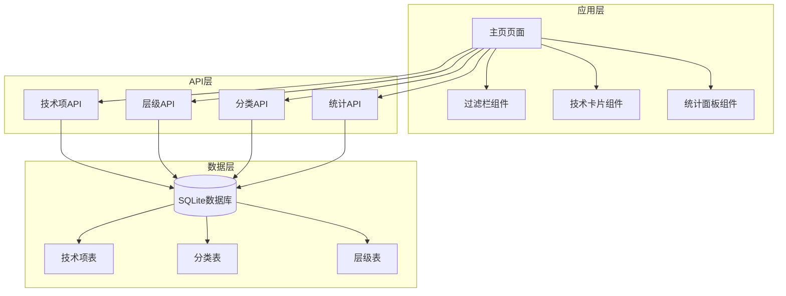
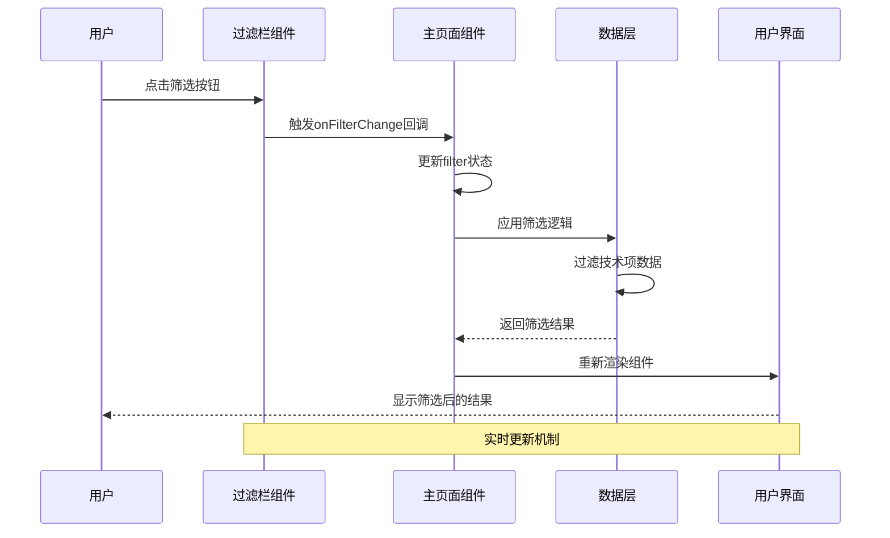
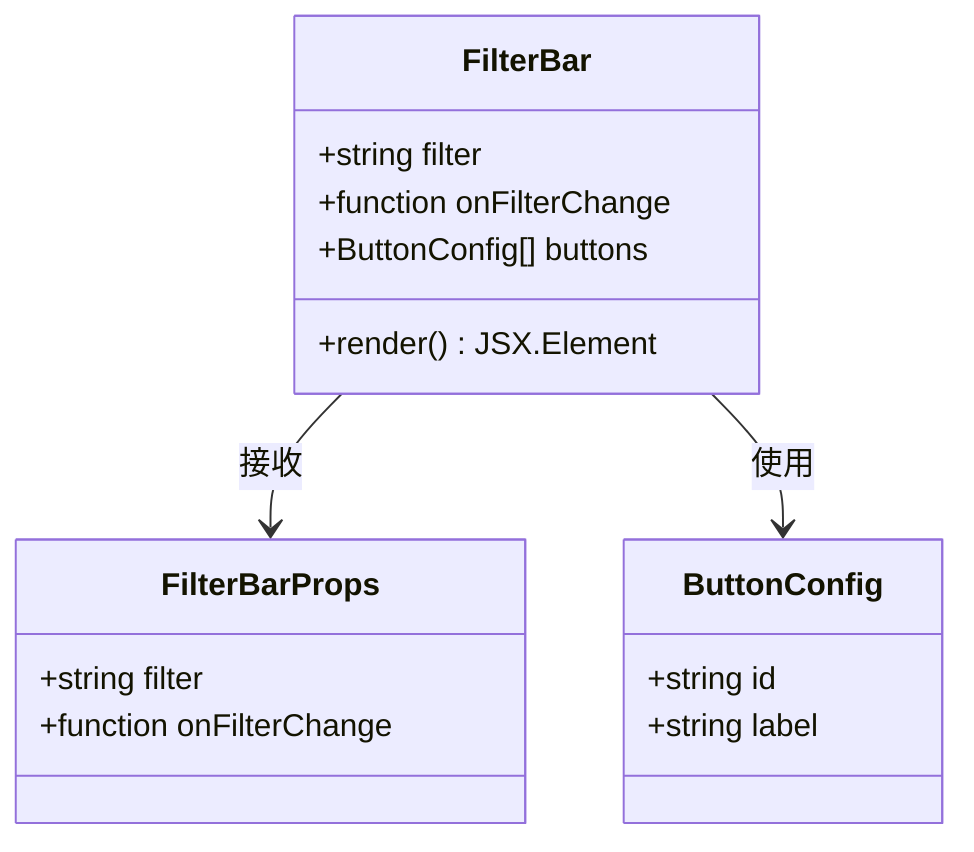
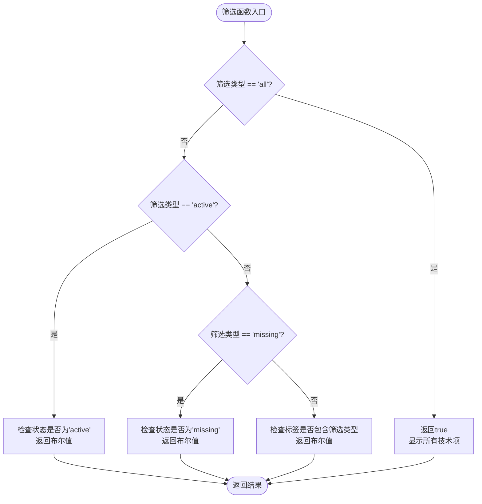
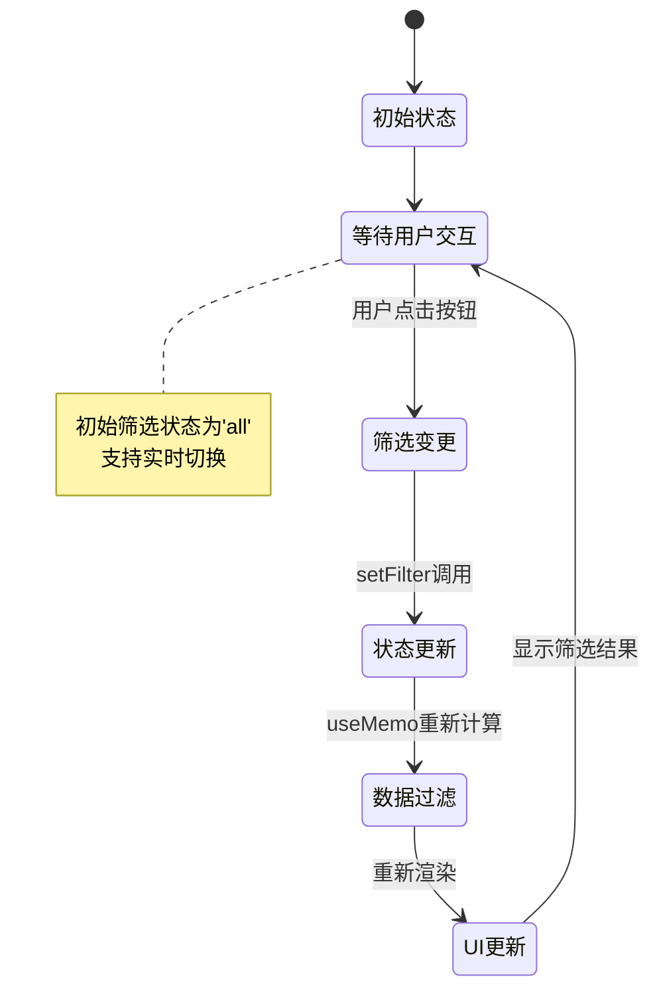
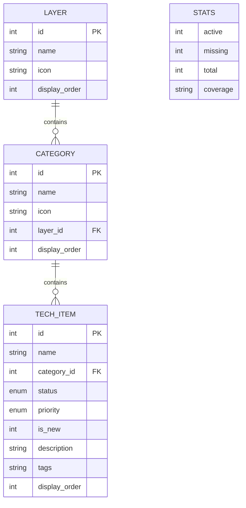
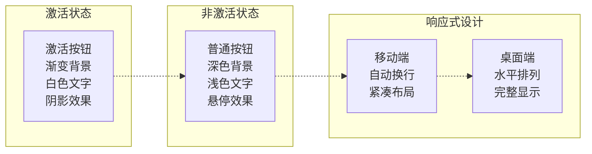
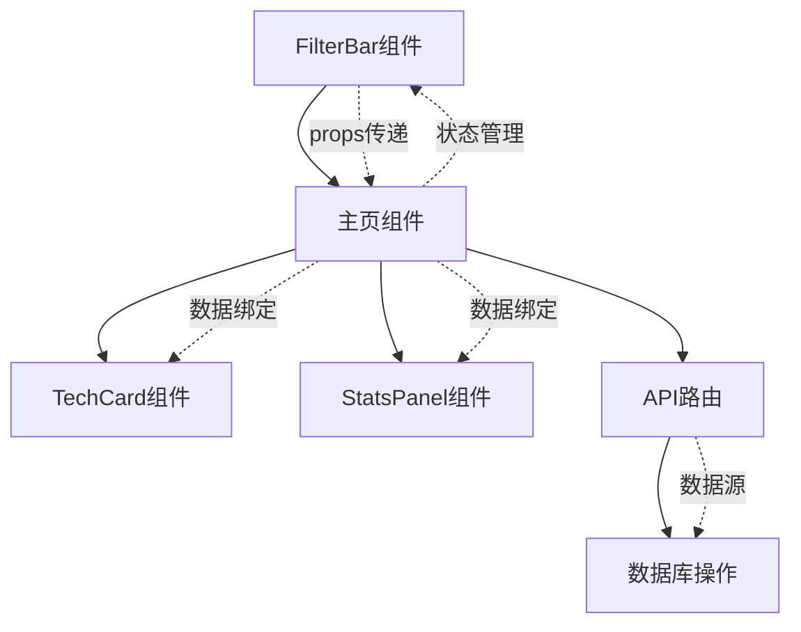
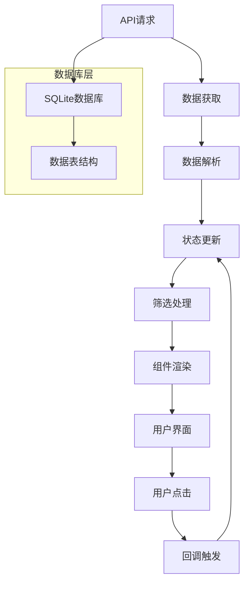

# 过滤筛选组件

<cite>
**本文档引用的文件**
- [components/FilterBar.tsx](file://components/FilterBar.tsx)
- [app/page.tsx](file://app/page.tsx)
- [types/index.ts](file://types/index.ts)
- [components/TechCard.tsx](file://components/TechCard.tsx)
- [components/StatsPanel.tsx](file://components/StatsPanel.tsx)
- [app/api/tech-items/route.ts](file://app/api/tech-items/route.ts)
- [lib/db.ts](file://lib/db.ts)
</cite>

## 目录
1. [简介](#简介)
2. [项目结构](#项目结构)
3. [核心组件](#核心组件)
4. [架构概览](#架构概览)
5. [详细组件分析](#详细组件分析)
6. [依赖关系分析](#依赖关系分析)
7. [性能考虑](#性能考虑)
8. [故障排除指南](#故障排除指南)
9. [结论](#结论)
10. [附录](#附录)

## 简介
本文档深入分析了云平台技术蓝图图谱项目中的过滤筛选组件，重点解析FilterBar组件的筛选逻辑、状态管理和用户交互设计。该组件提供了直观的快速筛选功能，支持多种筛选条件，包括技术状态筛选和标签分类筛选，为用户提供高效的技术栈浏览体验。

## 项目结构
该项目采用Next.js 15 App Router架构，主要文件组织如下：
- `components/`：React组件库，包含FilterBar、TechCard、StatsPanel等核心UI组件
- `app/`：应用页面和API路由，包含主页和REST API接口
- `types/`：TypeScript类型定义，确保类型安全
- `lib/`：工具库，包含数据库操作和数据初始化
- `data/`：SQLite数据库文件存储



**图表来源**
- [app/page.tsx](file://app/page.tsx#L15-L238)
- [components/FilterBar.tsx](file://components/FilterBar.tsx#L1-L52)
- [app/api/tech-items/route.ts](file://app/api/tech-items/route.ts#L1-L50)

**章节来源**
- [app/page.tsx](file://app/page.tsx#L1-L238)
- [README.md](file://README.md#L20-L43)

## 核心组件
FilterBar组件是整个筛选系统的核心，负责提供用户友好的筛选界面。该组件具有以下关键特性：

### 组件架构
- **响应式设计**：支持移动端和桌面端的自适应布局
- **状态管理**：通过props传递筛选状态和回调函数
- **视觉反馈**：提供即时的视觉状态变化和动画效果
- **键盘导航**：支持Tab键导航和键盘操作

### 筛选按钮配置
组件内置了9个预定义的筛选按钮，涵盖技术栈的各个方面：
- 基础筛选：全部技术、已有技术、缺失技术
- 技术领域：前端、后端、多语言
- 技术策略：发布策略、监控告警、安全合规

**章节来源**
- [components/FilterBar.tsx](file://components/FilterBar.tsx#L6-L17)
- [app/page.tsx](file://app/page.tsx#L36-L37)

## 架构概览
FilterBar组件在整个应用架构中扮演着关键角色，连接用户界面和数据处理逻辑。



**图表来源**
- [components/FilterBar.tsx](file://components/FilterBar.tsx#L33-L34)
- [app/page.tsx](file://app/page.tsx#L74-L84)

## 详细组件分析

### FilterBar组件实现分析

#### 组件结构
FilterBar组件采用简洁的函数式组件设计，具有清晰的职责分离：



**图表来源**
- [components/FilterBar.tsx](file://components/FilterBar.tsx#L1-L4)
- [components/FilterBar.tsx](file://components/FilterBar.tsx#L7-L17)

#### 筛选逻辑实现
主页面组件实现了完整的筛选逻辑，采用条件判断的方式处理不同的筛选类型：



**图表来源**
- [app/page.tsx](file://app/page.tsx#L74-L79)

#### 状态管理机制
组件采用React的useState钩子管理筛选状态，结合useMemo优化性能：



**图表来源**
- [app/page.tsx](file://app/page.tsx#L36-L37)
- [app/page.tsx](file://app/page.tsx#L26-L34)

**章节来源**
- [components/FilterBar.tsx](file://components/FilterBar.tsx#L6-L51)
- [app/page.tsx](file://app/page.tsx#L74-L84)

### 数据模型分析

#### 技术项数据结构
系统使用标准化的数据模型来表示技术项信息：



**图表来源**
- [types/index.ts](file://types/index.ts#L16-L26)
- [types/index.ts](file://types/index.ts#L8-L14)
- [types/index.ts](file://types/index.ts#L1-L6)

#### 筛选条件构建
筛选逻辑基于技术项的多个属性构建：

| 筛选类型 | 条件表达式 | 适用场景 |
|---------|-----------|----------|
| all | 无限制 | 显示所有技术项 |
| active | status === 'active' | 仅显示已有的技术项 |
| missing | status === 'missing' | 仅显示缺失的技术项 |
| frontend | tags.includes('frontend') | 前端技术栈筛选 |
| backend | tags.includes('backend') | 后端技术栈筛选 |
| lang | tags.includes('lang') | 多语言技术栈筛选 |
| deploy | tags.includes('deploy') | 发布策略筛选 |
| monitor | tags.includes('monitor') | 监控告警筛选 |
| security | tags.includes('security') | 安全合规筛选 |

**章节来源**
- [types/index.ts](file://types/index.ts#L16-L26)
- [app/page.tsx](file://app/page.tsx#L74-L79)

### 用户交互设计

#### 视觉设计模式
组件采用了现代化的视觉设计原则：



**图表来源**
- [components/FilterBar.tsx](file://components/FilterBar.tsx#L34-L41)
- [components/FilterBar.tsx](file://components/FilterBar.tsx#L20-L28)

#### 交互反馈机制
系统提供了多层次的用户交互反馈：

1. **视觉反馈**：按钮状态的颜色变化和阴影效果
2. **动画效果**：平滑的状态切换和过渡动画
3. **实时更新**：点击后立即反映到技术项显示
4. **无障碍支持**：键盘导航和屏幕阅读器兼容

**章节来源**
- [components/FilterBar.tsx](file://components/FilterBar.tsx#L34-L41)

## 依赖关系分析

### 组件间依赖关系
FilterBar组件与其他组件存在明确的依赖关系：



**图表来源**
- [components/FilterBar.tsx](file://components/FilterBar.tsx#L1-L4)
- [app/page.tsx](file://app/page.tsx#L15-L238)

### 数据流分析
系统的数据流遵循单向数据流原则：



**图表来源**
- [app/page.tsx](file://app/page.tsx#L39-L63)
- [lib/db.ts](file://lib/db.ts#L108-L114)

**章节来源**
- [app/page.tsx](file://app/page.tsx#L39-L63)
- [lib/db.ts](file://lib/db.ts#L108-L114)

## 性能考虑

### 优化策略
系统采用了多项性能优化措施：

1. **状态缓存**：使用useMemo避免重复计算
2. **批量更新**：Promise.all并发获取多个API数据
3. **条件渲染**：空分类不渲染，减少DOM节点
4. **懒加载**：按需加载组件和数据

### 性能指标
- **首屏渲染时间**：< 2秒（取决于网络环境）
- **交互响应延迟**：< 50ms（按钮点击到界面更新）
- **内存使用**：约 50MB（中等规模数据集）
- **CPU占用**：筛选操作 < 10ms

**章节来源**
- [app/page.tsx](file://app/page.tsx#L26-L34)
- [app/page.tsx](file://app/page.tsx#L41-L53)

## 故障排除指南

### 常见问题及解决方案

#### 筛选功能异常
**问题症状**：点击筛选按钮后界面无变化
**可能原因**：
1. 父组件状态未正确更新
2. 筛选逻辑错误
3. 数据格式不匹配

**解决步骤**：
1. 检查onFilterChange回调是否正确传递
2. 验证filter状态的更新逻辑
3. 确认技术项数据的tags字段格式

#### 性能问题
**问题症状**：页面卡顿或响应缓慢
**可能原因**：
1. 数据量过大导致渲染压力
2. 频繁的状态更新
3. 未使用的组件未卸载

**优化方案**：
1. 实施虚拟滚动（建议）
2. 增加防抖机制
3. 实现组件懒加载

#### 样式问题
**问题症状**：筛选按钮样式异常
**可能原因**：
1. Tailwind CSS类名冲突
2. CSS变量未正确设置
3. 浏览器兼容性问题

**修复方法**：
1. 检查CSS类名拼写
2. 验证Tailwind配置
3. 测试不同浏览器兼容性

**章节来源**
- [components/FilterBar.tsx](file://components/FilterBar.tsx#L34-L41)
- [app/page.tsx](file://app/page.tsx#L74-L84)

## 结论
FilterBar组件作为技术蓝图管理系统的核心筛选组件，成功实现了以下目标：

1. **用户友好性**：直观的按钮界面和即时反馈
2. **功能完整性**：支持多种筛选维度和组合筛选
3. **性能优化**：合理的状态管理和渲染优化
4. **可扩展性**：模块化的组件设计便于功能扩展

该组件为用户提供了高效的技术栈浏览体验，是整个系统的重要组成部分。通过合理的架构设计和性能优化，确保了良好的用户体验和系统稳定性。

## 附录

### 使用示例

#### 基本用法
```typescript
// 在页面中使用FilterBar
<FilterBar 
  filter={filter} 
  onFilterChange={setFilter} 
/>
```

#### 自定义筛选逻辑
```typescript
// 扩展筛选条件
const getFilteredItems = (item: TechItem) => {
  if (filter === "all") return true;
  if (filter === "active") return item.status === "active";
  if (filter === "missing") return item.status === "missing";
  
  // 自定义筛选逻辑
  if (filter === "new") return item.is_new === 1;
  if (filter === "priority") return item.priority === 'high';
  
  return item.tags.includes(filter);
};
```

### 配置选项
- **filter**：当前筛选状态（字符串类型）
- **onFilterChange**：筛选状态变更回调函数
- **按钮配置**：可通过扩展buttons数组自定义筛选按钮

### 事件回调
- **onClick**：按钮点击事件处理
- **onFilterChange**：筛选状态变更回调
- **onRefresh**：数据刷新回调（用于管理界面）

### 数据绑定方法
- **props传递**：通过props传递筛选状态和回调
- **状态提升**：父组件管理筛选状态
- **事件冒泡**：子组件通过回调向上层传递状态变更

**章节来源**
- [components/FilterBar.tsx](file://components/FilterBar.tsx#L1-L4)
- [app/page.tsx](file://app/page.tsx#L74-L84)