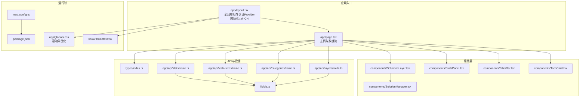
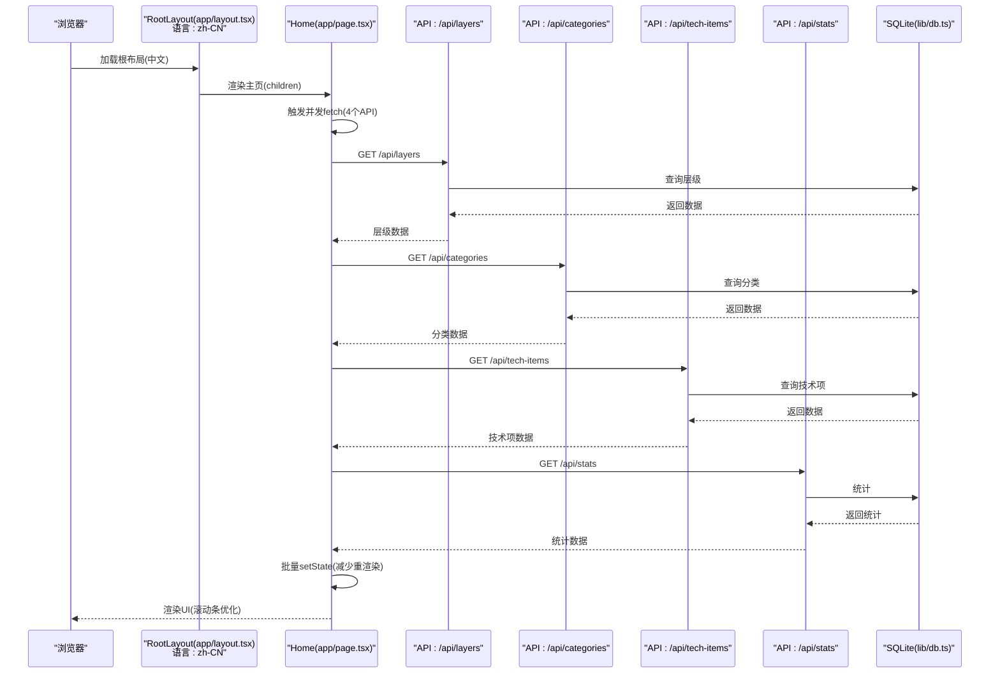
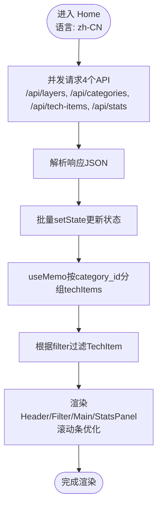
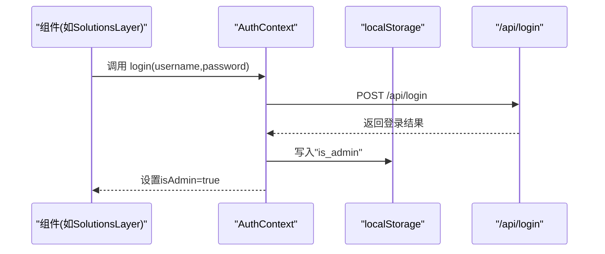
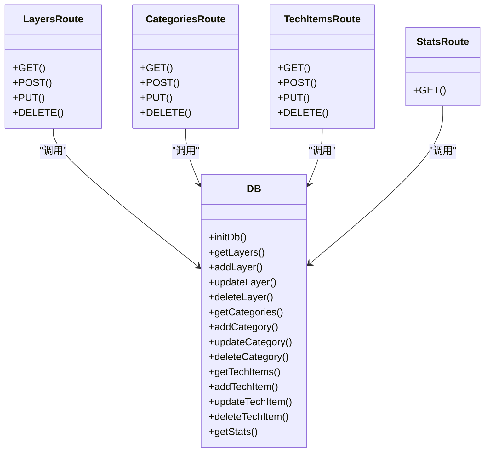
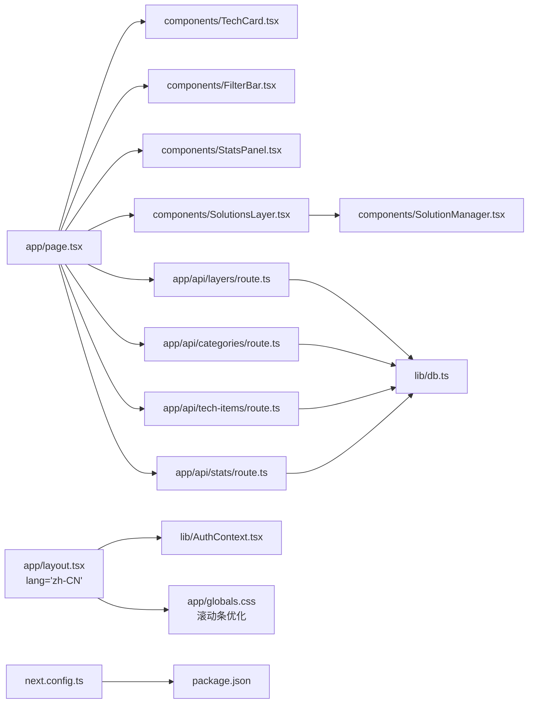

# 前端架构

<cite>
**本文引用的文件**
- [app/layout.tsx](file://app/layout.tsx)
- [app/page.tsx](file://app/page.tsx)
- [components/TechCard.tsx](file://components/TechCard.tsx)
- [components/FilterBar.tsx](file://components/FilterBar.tsx)
- [components/StatsPanel.tsx](file://components/StatsPanel.tsx)
- [components/SolutionsLayer.tsx](file://components/SolutionsLayer.tsx)
- [components/SolutionManager.tsx](file://components/SolutionManager.tsx)
- [lib/AuthContext.tsx](file://lib/AuthContext.tsx)
- [lib/db.ts](file://lib/db.ts)
- [types/index.ts](file://types/index.ts)
- [next.config.ts](file://next.config.ts)
- [package.json](file://package.json)
- [app/globals.css](file://app/globals.css)
- [app/api/layers/route.ts](file://app/api/layers/route.ts)
- [app/api/categories/route.ts](file://app/api/categories/route.ts)
- [app/api/stats/route.ts](file://app/api/stats/route.ts)
- [app/api/tech-items/route.ts](file://app/api/tech-items/route.ts)
</cite>

## 更新摘要
**变更内容**
- 移除了 Google Fonts 依赖，采用系统字体替代
- 更新国际化设置为中文（zh-CN）
- 增强全局样式系统，添加滚动条优化样式
- 优化字体配置，使用 Arial、Helvetica 等系统字体

## 目录
1. [引言](#引言)
2. [项目结构](#项目结构)
3. [核心组件](#核心组件)
4. [架构总览](#架构总览)
5. [组件详解](#组件详解)
6. [依赖关系分析](#依赖关系分析)
7. [性能考量](#性能考量)
8. [故障排查指南](#故障排查指南)
9. [结论](#结论)
10. [附录](#附录)

## 引言
本文件系统性梳理 Lantu Next 的前端架构，围绕基于 Next.js App Router 的页面与路由组织、全局布局 RootLayout 的职责与实现、认证上下文 AuthContext 的集成方式、主页面 Home 的数据获取与渲染流程、组件化设计与 Props 传递模式、以及前端性能优化策略展开。同时给出技术栈选择理由与最佳实践建议，帮助开发者快速理解并高效迭代。

**更新** 应用现已移除 Google Fonts 依赖，采用系统字体替代，提升加载性能；国际化设置更新为中文（zh-CN）；全局样式系统得到增强，包含滚动条优化等视觉改进。

## 项目结构
- 页面与路由
  - 根布局：app/layout.tsx 提供全局 HTML 结构、字体注入与认证 Provider 包裹。
  - 主页：app/page.tsx 实现客户端交互、数据拉取与渲染。
  - API 路由：app/api/* 下按资源划分 REST 接口，统一初始化数据库并提供 CRUD。
- 组件层
  - 可复用展示组件：TechCard、FilterBar、StatsPanel 等。
  - 场景化容器组件：SolutionsLayer、SolutionManager 等。
- 数据与类型
  - 类型定义：types/index.ts。
  - 数据访问：lib/db.ts 封装 SQLite 访问与事务。
  - 认证上下文：lib/AuthContext.tsx。
- 样式与构建
  - 全局样式：app/globals.css（包含滚动条优化）。
  - 构建配置：next.config.ts、package.json。

**图表来源**
- [app/layout.tsx](file://app/layout.tsx#L1-L23)
- [app/page.tsx](file://app/page.tsx#L1-L238)
- [components/TechCard.tsx](file://components/TechCard.tsx#L1-L37)
- [components/FilterBar.tsx](file://components/FilterBar.tsx#L1-L52)
- [components/StatsPanel.tsx](file://components/StatsPanel.tsx#L1-L84)
- [components/SolutionsLayer.tsx](file://components/SolutionsLayer.tsx#L1-L268)
- [components/SolutionManager.tsx](file://components/SolutionManager.tsx#L1-L73)
- [lib/AuthContext.tsx](file://lib/AuthContext.tsx#L1-L62)
- [lib/db.ts](file://lib/db.ts#L1-L312)
- [types/index.ts](file://types/index.ts#L1-L34)
- [next.config.ts](file://next.config.ts#L1-L10)
- [package.json](file://package.json#L1-L43)
- [app/globals.css](file://app/globals.css#L1-L70)
- [app/api/layers/route.ts](file://app/api/layers/route.ts#L1-L48)
- [app/api/categories/route.ts](file://app/api/categories/route.ts#L1-L48)
- [app/api/stats/route.ts](file://app/api/stats/route.ts#L1-L15)
- [app/api/tech-items/route.ts](file://app/api/tech-items/route.ts#L1-L50)

**章节来源**
- [app/layout.tsx](file://app/layout.tsx#L1-L23)
- [app/page.tsx](file://app/page.tsx#L1-L238)
- [next.config.ts](file://next.config.ts#L1-L10)
- [package.json](file://package.json#L1-L43)

## 核心组件
- RootLayout（全局布局）
  - 注入字体变量、全局样式、设置元数据。
  - 通过 AuthProvider 包裹 children，向子树提供认证能力。
  - 设置国际化语言为中文（zh-CN）。
- Home（主页）
  - 客户端组件，负责并发拉取多类数据、状态管理、过滤与渲染。
  - 通过 useMemo 对技术项进行分组，降低渲染成本。
  - 提供刷新触发器，驱动子组件联动更新。
- 展示与容器组件
  - TechCard：单个技术项卡片，根据状态与优先级动态样式。
  - FilterBar：快速筛选按钮集合，切换过滤条件。
  - StatsPanel：统计面板，展示已有、缺失、总数与覆盖率。
  - SolutionsLayer：场景解决方案层容器，支持搜索与管理。
  - SolutionManager：解决方案编辑/新增弹窗，支持列配置与技术项映射。
- 认证上下文
  - 提供 isAdmin、login、logout；持久化存储于本地存储；在组件中通过 useAuth 消费。
- 数据访问层
  - lib/db.ts：封装 SQLite 表结构、CRUD、批量排序更新、统计查询等。
- 类型系统
  - types/index.ts：Layer、Category、TechItem、Stats 的强类型定义。

**更新** 全局样式系统得到增强，包含滚动条优化样式，提升用户界面体验。

**章节来源**
- [app/layout.tsx](file://app/layout.tsx#L1-L23)
- [app/page.tsx](file://app/page.tsx#L1-L238)
- [components/TechCard.tsx](file://components/TechCard.tsx#L1-L37)
- [components/FilterBar.tsx](file://components/FilterBar.tsx#L1-L52)
- [components/StatsPanel.tsx](file://components/StatsPanel.tsx#L1-L84)
- [components/SolutionsLayer.tsx](file://components/SolutionsLayer.tsx#L1-L268)
- [components/SolutionManager.tsx](file://components/SolutionManager.tsx#L1-L73)
- [lib/AuthContext.tsx](file://lib/AuthContext.tsx#L1-L62)
- [lib/db.ts](file://lib/db.ts#L1-L312)
- [types/index.ts](file://types/index.ts#L1-L34)

## 架构总览
下图展示了从浏览器到 API、再到数据库的数据通路，以及认证上下文如何贯穿全局布局与部分容器组件。

**图表来源**
- [app/layout.tsx](file://app/layout.tsx#L15-L16)
- [app/page.tsx](file://app/page.tsx#L39-L63)
- [app/api/layers/route.ts](file://app/api/layers/route.ts#L6-L13)
- [app/api/categories/route.ts](file://app/api/categories/route.ts#L6-L13)
- [app/api/tech-items/route.ts](file://app/api/tech-items/route.ts#L7-L14)
- [app/api/stats/route.ts](file://app/api/stats/route.ts#L6-L14)
- [lib/db.ts](file://lib/db.ts#L53-L57)
- [lib/db.ts](file://lib/db.ts#L79-L85)
- [lib/db.ts](file://lib/db.ts#L108-L114)
- [lib/db.ts](file://lib/db.ts#L220-L239)

## 组件详解

### 全局布局 RootLayout
- 职责
  - 设置站点元数据与字体变量。
  - 在 body 内包裹 AuthProvider，使子组件具备认证能力。
  - 引入全局样式，确保主题一致性。
  - 设置国际化语言为中文（zh-CN）。
- 设计要点
  - 将认证上下文置于根部，避免重复包裹与上下文分散。
  - 字体变量注入为后续组件使用 CSS 变量提供基础。
  - **更新** 移除了 Google Fonts 依赖，采用系统字体替代，提升加载性能。

**章节来源**
- [app/layout.tsx](file://app/layout.tsx#L1-L23)

### 主页面 Home 的数据流与渲染
- 数据获取
  - 并发请求四个 API：/api/layers、/api/categories、/api/tech-items、/api/stats。
  - 使用 cache: "no-store" 避免服务端缓存导致的陈旧数据。
  - 成功后批量 setState，减少中间态渲染。
- 过滤与分组
  - 使用 useMemo 对 techItems 按 category_id 建立映射，避免每次渲染重建引用。
  - 支持"全部/已有/缺失/标签"等多维过滤。
- 渲染策略
  - 分层渲染：遍历 layers，区分"场景解决方案"与普通层。
  - 普通层内按 categories 渲染 TechCard，空层显示容器便于管理。
  - 顶部统计与底部统计面板分别展示实时指标。
- 刷新机制
  - 通过 refreshTrigger 控制副作用执行，触发 Home 重新拉取数据。

**图表来源**
- [app/page.tsx](file://app/page.tsx#L39-L63)
- [app/page.tsx](file://app/page.tsx#L26-L34)
- [app/page.tsx](file://app/page.tsx#L74-L84)

**章节来源**
- [app/page.tsx](file://app/page.tsx#L1-L238)

### 认证上下文 AuthContext
- 上下文提供者
  - 初始化：从本地存储恢复 isAdmin 状态。
  - 登录：POST /api/login，成功后设置 isAdmin 并持久化。
  - 登出：清除 isAdmin 与本地存储。
- 组件消费
  - SolutionsLayer 中通过 useAuth 判断是否管理员，决定是否显示管理入口。
  - LoginManager（未在本文详述）通常位于 Header，受 AuthContext 控制显示。

**图表来源**
- [lib/AuthContext.tsx](file://lib/AuthContext.tsx#L23-L41)
- [components/SolutionsLayer.tsx](file://components/SolutionsLayer.tsx#L105-L110)

**章节来源**
- [lib/AuthContext.tsx](file://lib/AuthContext.tsx#L1-L62)
- [components/SolutionsLayer.tsx](file://components/SolutionsLayer.tsx#L1-L268)

### 可复用组件设计与 Props 传递
- TechCard
  - 输入：TechItem。
  - 行为：根据状态与优先级动态样式；悬停显示 tooltip。
- FilterBar
  - 输入：filter、onFilterChange。
  - 行为：渲染一组筛选按钮，点击回调更新父组件过滤状态。
- StatsPanel
  - 输入：Stats。
  - 行为：展示四项统计卡片与图例说明。
- SolutionsLayer
  - 输入：Layer、Category[]、TechItem[]、onUpdate。
  - 行为：按列配置渲染解决方案卡片，支持搜索、编辑、新增。
- Props 传递模式
  - 单向数据流：父组件持有状态，子组件仅接收 props。
  - 回调反传：子组件通过回调通知父组件更新（如 onFilterChange、onUpdate）。
  - 事件冒泡：容器组件聚合状态，避免跨层级共享。

**章节来源**
- [components/TechCard.tsx](file://components/TechCard.tsx#L1-L37)
- [components/FilterBar.tsx](file://components/FilterBar.tsx#L1-L52)
- [components/StatsPanel.tsx](file://components/StatsPanel.tsx#L1-L84)
- [components/SolutionsLayer.tsx](file://components/SolutionsLayer.tsx#L1-L268)

### API 路由与数据访问
- 路由职责
  - /api/layers：GET/POST/PUT/DELETE 层级资源。
  - /api/categories：GET/POST/PUT/DELETE 分类资源。
  - /api/tech-items：GET/POST/PUT/DELETE 技术项资源。
  - /api/stats：GET 统计。
- 数据库操作
  - initDb：首次访问时创建表结构。
  - CRUD：提供增删改查与批量排序更新。
  - 统计：计算 active/missing/total/coverage。

**图表来源**
- [app/api/layers/route.ts](file://app/api/layers/route.ts#L1-L48)
- [app/api/categories/route.ts](file://app/api/categories/route.ts#L1-L48)
- [app/api/tech-items/route.ts](file://app/api/tech-items/route.ts#L1-L50)
- [app/api/stats/route.ts](file://app/api/stats/route.ts#L1-L15)
- [lib/db.ts](file://lib/db.ts#L14-L50)
- [lib/db.ts](file://lib/db.ts#L53-L57)
- [lib/db.ts](file://lib/db.ts#L79-L85)
- [lib/db.ts](file://lib/db.ts#L108-L114)
- [lib/db.ts](file://lib/db.ts#L220-L239)

**章节来源**
- [app/api/layers/route.ts](file://app/api/layers/route.ts#L1-L48)
- [app/api/categories/route.ts](file://app/api/categories/route.ts#L1-L48)
- [app/api/tech-items/route.ts](file://app/api/tech-items/route.ts#L1-L50)
- [app/api/stats/route.ts](file://app/api/stats/route.ts#L1-L15)
- [lib/db.ts](file://lib/db.ts#L1-L312)

### 全局样式系统与滚动条优化
- **更新** 全局样式系统得到增强，包含滚动条优化样式
- 滚动条优化特性
  - WebKit 浏览器滚动条：8px 宽度，圆角设计，透明轨道
  - 悬停效果：滚动条颜色从 Slate-700 变为 Slate-600
  - Firefox 兼容性：使用 thin 滚动条和 Slate 颜色方案
  - 深色模式适配：深色模式下滚动条颜色调整为 Slate-800
- 字体系统
  - 移除了 Google Fonts 依赖，采用 Arial、Helvetica 系统字体
  - 提升加载性能，减少网络请求
  - 保持良好的跨平台兼容性

**章节来源**
- [app/globals.css](file://app/globals.css#L26-L65)

## 依赖关系分析
- 组件耦合
  - Home 作为顶层容器，聚合多个子组件；子组件之间低耦合，通过 Props 通信。
  - SolutionsLayer 依赖 AuthContext 与外部 TechItem[]，内部通过 useMemo 优化渲染。
- 外部依赖
  - better-sqlite3：服务端原生扩展，配合 serverExternalPackages 与 onlyBuiltDependencies。
  - lucide-react：图标库，按需引入。
  - Tailwind V4：原子化样式，结合全局 CSS 与组件内类名。
  - **更新** 移除了 Google Fonts 依赖，减少外部资源请求。
- 构建与运行
  - next.config.ts 开启 reactCompiler，serverExternalPackages 指定原生模块。
  - package.json 定义脚本与依赖版本。

**图表来源**
- [app/page.tsx](file://app/page.tsx#L1-L238)
- [components/TechCard.tsx](file://components/TechCard.tsx#L1-L37)
- [components/FilterBar.tsx](file://components/FilterBar.tsx#L1-L52)
- [components/StatsPanel.tsx](file://components/StatsPanel.tsx#L1-L84)
- [components/SolutionsLayer.tsx](file://components/SolutionsLayer.tsx#L1-L268)
- [components/SolutionManager.tsx](file://components/SolutionManager.tsx#L1-L73)
- [app/api/layers/route.ts](file://app/api/layers/route.ts#L1-L48)
- [app/api/categories/route.ts](file://app/api/categories/route.ts#L1-L48)
- [app/api/tech-items/route.ts](file://app/api/tech-items/route.ts#L1-L50)
- [app/api/stats/route.ts](file://app/api/stats/route.ts#L1-L15)
- [lib/db.ts](file://lib/db.ts#L1-L312)
- [lib/AuthContext.tsx](file://lib/AuthContext.tsx#L1-L62)
- [app/globals.css](file://app/globals.css#L1-L70)
- [next.config.ts](file://next.config.ts#L1-L10)
- [package.json](file://package.json#L1-L43)

**章节来源**
- [next.config.ts](file://next.config.ts#L1-L10)
- [package.json](file://package.json#L1-L43)

## 性能考量
- 代码分割与懒加载
  - Next.js App Router 自动按路由拆分包；组件层面可通过动态导入进一步细化（例如将重型管理器组件按需加载）。
- 并发数据获取
  - Home 使用 Promise.all 并发请求多个 API，显著降低首屏等待时间。
- 渲染优化
  - useMemo 对技术项按分类分组，避免每次渲染创建新对象，降低子组件重渲染频率。
  - 批量 setState 减少中间态，提升整体渲染效率。
- 缓存策略
  - 当前 API 请求使用 cache: "no-store"，确保数据实时性；若业务允许，可在特定场景使用缓存策略以降低后端压力。
- 图标与样式
  - lucide-react 按需引入图标，避免打包冗余；Tailwind 原子类减少样式体积。
- 构建优化
  - reactCompiler 开启编译期优化；serverExternalPackages 与 onlyBuiltDependencies 避免原生模块安装问题。
- **更新** 性能优化改进
  - 移除 Google Fonts 依赖，减少网络请求和字体加载时间
  - 采用系统字体替代，提升跨平台兼容性和加载性能
  - 滚动条优化减少额外样式文件加载

**章节来源**
- [app/page.tsx](file://app/page.tsx#L39-L63)
- [app/page.tsx](file://app/page.tsx#L26-L34)
- [next.config.ts](file://next.config.ts#L5-L7)
- [package.json](file://package.json#L12-L24)

## 故障排查指南
- 数据不更新或显示陈旧
  - 确认 API 请求未被缓存（当前已使用 no-store）。
  - 检查 Home 的 refreshTrigger 是否正确递增并触发副作用。
- 认证状态异常
  - 检查本地存储中的 is_admin 键值；确认 /api/login 返回 200 且未抛错。
  - 确保 AuthProvider 包裹了需要使用的组件树。
- 解决方案层不可编辑
  - 确认 SolutionsLayer 正确调用 useAuth，并在管理员状态下显示管理入口。
- 数据库初始化失败
  - 确认 data/techmap.db 文件存在或可写；检查 initDb 是否在各路由中调用。
- 原生模块安装问题
  - 确认 serverExternalPackages 与 onlyBuiltDependencies 配置正确，避免开发环境安装失败。
- **更新** 新增故障排查项
  - 字体加载问题：确认系统字体可用，检查 app/globals.css 中字体配置
  - 滚动条样式异常：检查浏览器兼容性，确认 WebKit/Firefox 特殊样式生效
  - 国际化显示问题：确认 html 标签 lang 属性设置为 zh-CN

**章节来源**
- [app/page.tsx](file://app/page.tsx#L65-L72)
- [lib/AuthContext.tsx](file://lib/AuthContext.tsx#L16-L21)
- [lib/AuthContext.tsx](file://lib/AuthContext.tsx#L23-L41)
- [components/SolutionsLayer.tsx](file://components/SolutionsLayer.tsx#L105-L110)
- [app/api/layers/route.ts](file://app/api/layers/route.ts#L4-L4)
- [app/api/categories/route.ts](file://app/api/categories/route.ts#L4-L4)
- [app/api/tech-items/route.ts](file://app/api/tech-items/route.ts#L4-L5)
- [app/api/stats/route.ts](file://app/api/stats/route.ts#L4-L4)
- [next.config.ts](file://next.config.ts#L6-L6)
- [package.json](file://package.json#L37-L41)

## 结论
Lantu Next 的前端架构以 Next.js App Router 为核心，采用"全局布局 + 客户端主页 + 可复用组件 + 认证上下文 + API 路由 + SQLite 数据层"的清晰分层。通过并发数据获取、memo 化与批量更新等手段，兼顾性能与可维护性；认证上下文贯穿全局，为管理功能提供基础。

**更新** 应用现已完成关键性能优化：移除 Google Fonts 依赖，采用系统字体替代，显著提升加载性能；国际化设置更新为中文（zh-CN）；全局样式系统得到增强，包含滚动条优化等视觉改进。建议在保证数据实时性的前提下，逐步探索缓存策略与更细粒度的懒加载，持续优化用户体验与开发效率。

## 附录
- 技术栈选择理由
  - Next.js App Router：现代路由模型、自动代码分割、SSR/SSG 能力。
  - better-sqlite3：轻量、高性能、易于部署，适合小型到中型应用。
  - Tailwind V4：原子类提升样式迭代速度，减少 CSS 维护成本。
  - lucide-react：图标库稳定、按需引入、体积小。
  - **更新** 字体系统优化：移除 Google Fonts 依赖，采用系统字体提升性能。
- 最佳实践建议
  - 将管理类重型组件按需加载，减少首屏体积。
  - 对高频渲染组件使用 memo 化与 key 合理设计，避免不必要的重渲染。
  - 在 API 层增加错误边界与重试策略，提升稳定性。
  - 对数据库写操作增加幂等与事务控制，保障一致性。
  - **更新** 性能优化建议：利用系统字体减少网络请求，优化滚动条样式提升用户体验，确保国际化设置符合目标用户需求。