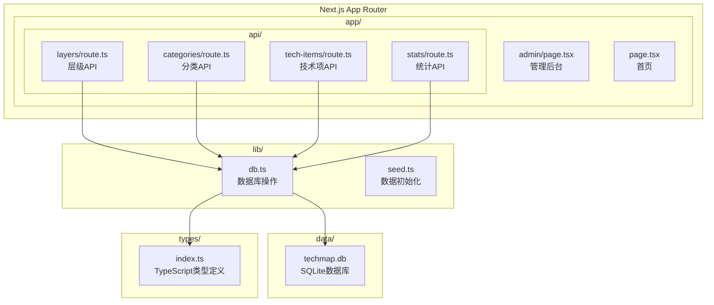
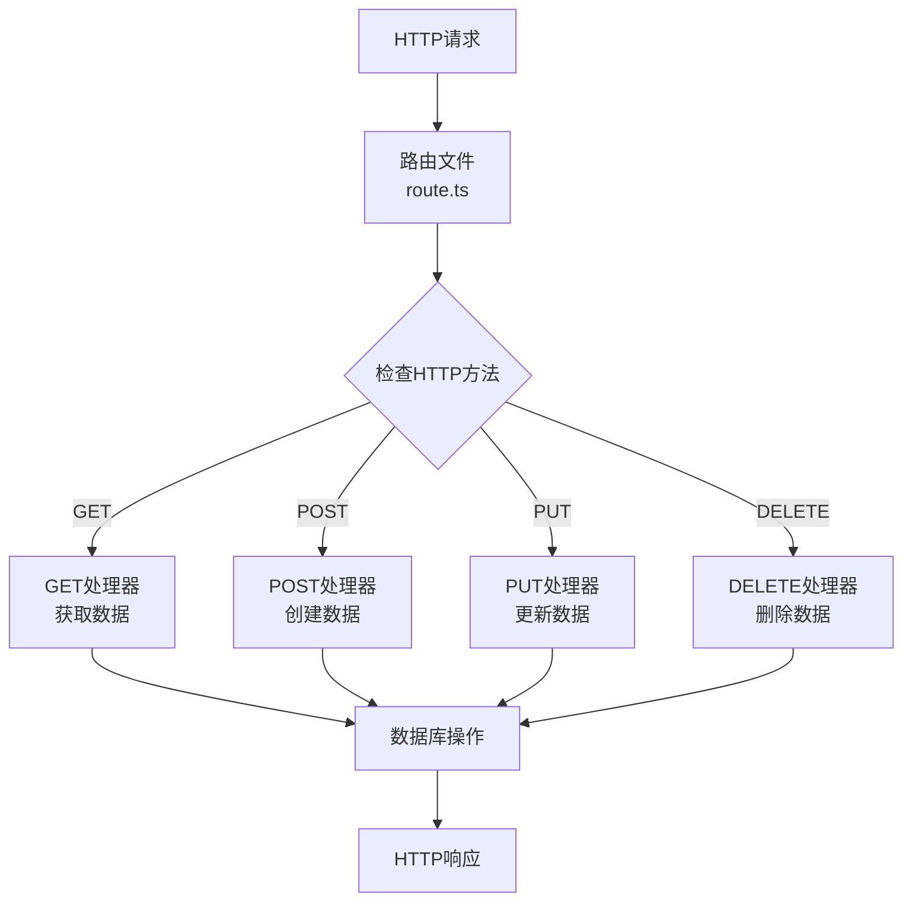
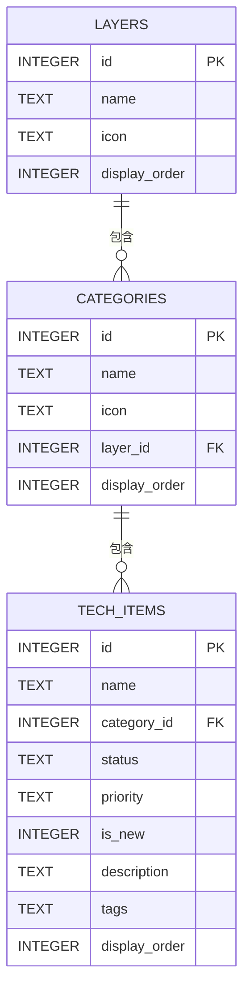
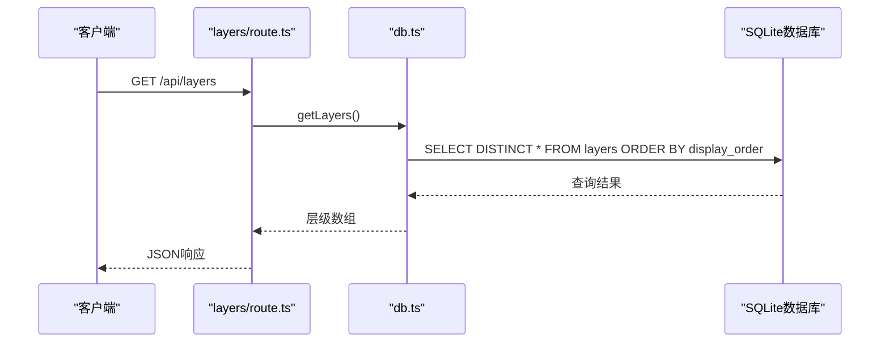
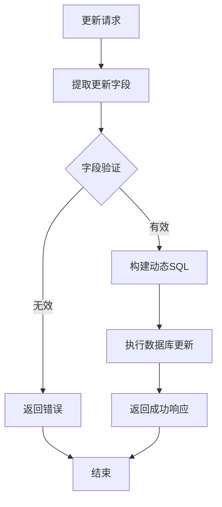
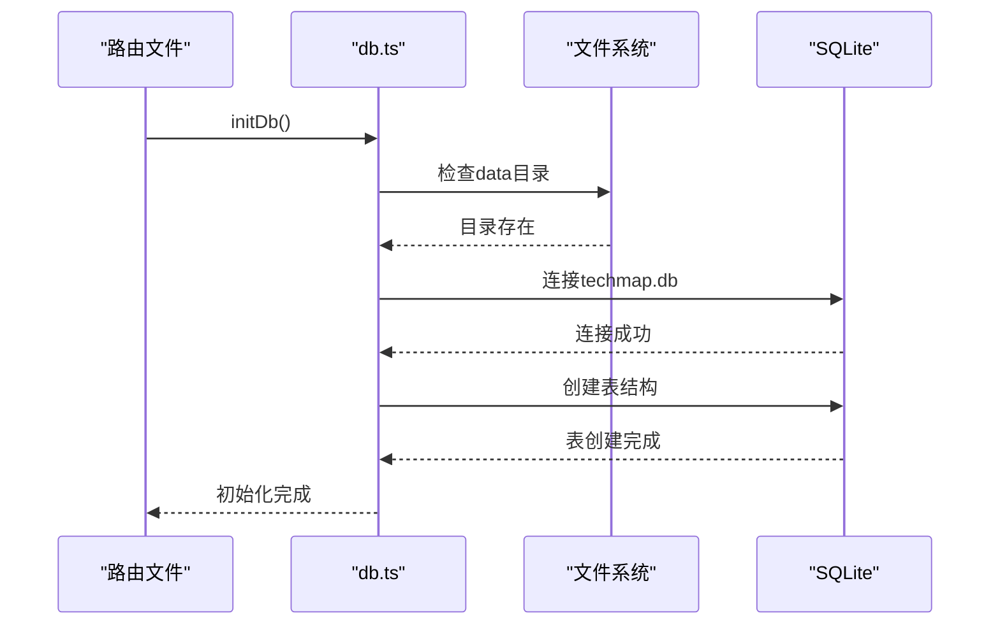
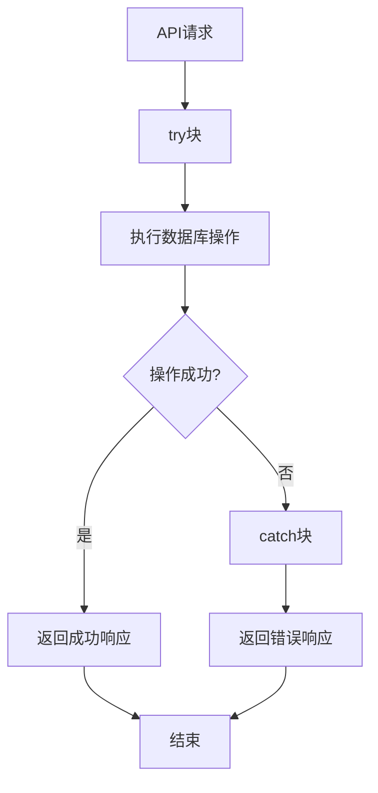
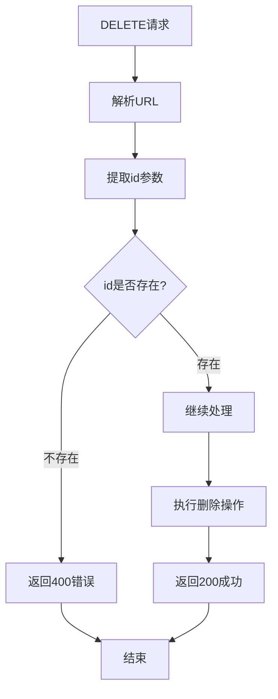

# API路由模式

<cite>
**本文档引用的文件**
- [app/api/tech-items/route.ts](file://app/api/tech-items/route.ts)
- [app/api/categories/route.ts](file://app/api/categories/route.ts)
- [app/api/layers/route.ts](file://app/api/layers/route.ts)
- [app/api/stats/route.ts](file://app/api/stats/route.ts)
- [lib/db.ts](file://lib/db.ts)
- [types/index.ts](file://types/index.ts)
- [lib/seed.ts](file://lib/seed.ts)
- [next.config.ts](file://next.config.ts)
- [README.md](file://README.md)
</cite>

## 目录
1. [简介](#简介)
2. [项目结构概览](#项目结构概览)
3. [API路由架构设计](#api路由架构设计)
4. [核心API端点分析](#核心api端点分析)
5. [数据库操作流程](#数据库操作流程)
6. [错误处理机制](#错误处理机制)
7. [性能优化策略](#性能优化策略)
8. [最佳实践建议](#最佳实践建议)
9. [故障排除指南](#故障排除指南)
10. [总结](#总结)

## 简介

Lantu Next项目是一个基于Next.js 15 App Router构建的技术栈管理系统，采用TypeScript、Tailwind CSS和SQLite数据库。该项目实现了完整的REST API路由模式，为前端应用提供数据访问接口。

项目的核心特色包括：
- 基于Next.js App Router的文件系统路由约定
- TypeScript类型安全的API实现
- SQLite数据库存储（better-sqlite3）
- 完整的CRUD操作支持
- 实时统计功能

## 项目结构概览

项目采用标准的Next.js 15 App Router结构，API路由位于`app/api/`目录下，每个子目录对应一个资源类型的API端点。



**图表来源**
- [app/api/tech-items/route.ts](file://app/api/tech-items/route.ts#L1-L50)
- [app/api/categories/route.ts](file://app/api/categories/route.ts#L1-L48)
- [app/api/layers/route.ts](file://app/api/layers/route.ts#L1-L48)
- [app/api/stats/route.ts](file://app/api/stats/route.ts#L1-L15)
- [lib/db.ts](file://lib/db.ts#L1-L312)

**章节来源**
- [README.md](file://README.md#L20-L43)
- [next.config.ts](file://next.config.ts#L1-L10)

## API路由架构设计

### 文件系统路由约定

Next.js 15 App Router采用文件系统作为路由定义的基础，每个API端点通过特定的文件命名约定实现：

- **路由文件位置**: `app/api/{resource}/{route.ts}`
- **HTTP方法映射**: 导出对应的函数名（GET、POST、PUT、DELETE）
- **动态路由参数**: 通过URL查询参数处理

### HTTP方法映射规则

每个API端点都实现了标准的RESTful HTTP方法映射：



**图表来源**
- [app/api/tech-items/route.ts](file://app/api/tech-items/route.ts#L7-L49)
- [app/api/categories/route.ts](file://app/api/categories/route.ts#L6-L47)
- [app/api/layers/route.ts](file://app/api/layers/route.ts#L6-L47)

### 动态路由参数处理

对于需要参数的API端点，采用URL查询参数的方式处理：

- **参数提取**: 使用`new URL(request.url).searchParams.get('paramName')`
- **参数验证**: 对必需参数进行存在性检查
- **类型转换**: 将字符串参数转换为适当的类型

**章节来源**
- [app/api/tech-items/route.ts](file://app/api/tech-items/route.ts#L37-L48)
- [app/api/categories/route.ts](file://app/api/categories/route.ts#L35-L46)
- [app/api/layers/route.ts](file://app/api/layers/route.ts#L35-L46)

## 核心API端点分析

### 层级API (Layers)

层级API负责管理技术栈的层级结构，支持完整的CRUD操作。

#### 端点定义
- **GET /api/layers**: 获取所有层级
- **POST /api/layers**: 创建新层级
- **PUT /api/layers**: 更新层级信息
- **DELETE /api/layers**: 删除层级

#### 数据结构


**图表来源**
- [lib/db.ts](file://lib/db.ts#L16-L49)
- [types/index.ts](file://types/index.ts#L1-L34)

#### 请求处理流程


**图表来源**
- [app/api/layers/route.ts](file://app/api/layers/route.ts#L6-L12)
- [lib/db.ts](file://lib/db.ts#L53-L57)

**章节来源**
- [app/api/layers/route.ts](file://app/api/layers/route.ts#L1-L48)
- [lib/db.ts](file://lib/db.ts#L53-L76)

### 分类API (Categories)

分类API管理技术项的分类结构，支持多层级嵌套关系。

#### 端点定义
- **GET /api/categories**: 获取所有分类
- **POST /api/categories**: 创建新分类
- **PUT /api/categories**: 更新分类信息
- **DELETE /api/categories**: 删除分类

#### 关键特性
- **层级关联**: 每个分类关联到特定的层级
- **显示顺序**: 支持自定义显示顺序
- **图标支持**: 支持文本图标和复杂JSON图标

**章节来源**
- [app/api/categories/route.ts](file://app/api/categories/route.ts#L1-L48)
- [lib/db.ts](file://lib/db.ts#L79-L105)

### 技术项API (Tech Items)

技术项API管理具体的技术栈条目，是最复杂的API端点。

#### 端点定义
- **GET /api/tech-items**: 获取所有技术项
- **POST /api/tech-items**: 创建新技术项
- **PUT /api/tech-items**: 更新技术项
- **DELETE /api/tech-items?id={id}**: 删除技术项

#### 高级功能
- **状态管理**: 支持"active"和"missing"两种状态
- **优先级设置**: 支持高、中、低优先级
- **标签系统**: 支持多标签分类
- **新增标记**: 支持"是否新增"标记

#### 动态更新机制


**图表来源**
- [lib/db.ts](file://lib/db.ts#L165-L211)

**章节来源**
- [app/api/tech-items/route.ts](file://app/api/tech-items/route.ts#L1-L50)
- [lib/db.ts](file://lib/db.ts#L108-L217)

### 统计API (Stats)

统计API提供实时的数据统计信息。

#### 端点定义
- **GET /api/stats**: 获取统计数据

#### 统计指标
- **活跃技术项数量**: 状态为"active"的技术项
- **缺失技术项数量**: 状态为"missing"的技术项
- **总数量**: 活跃和缺失技术项的总数
- **覆盖率**: 活跃技术项占总数的百分比

**章节来源**
- [app/api/stats/route.ts](file://app/api/stats/route.ts#L1-L15)
- [lib/db.ts](file://lib/db.ts#L220-L239)

## 数据库操作流程

### 数据库初始化

项目在每次API请求前都会初始化数据库连接：



**图表来源**
- [lib/db.ts](file://lib/db.ts#L14-L50)

### CRUD操作模式

所有API端点都遵循统一的CRUD操作模式：



**图表来源**
- [app/api/tech-items/route.ts](file://app/api/tech-items/route.ts#L7-L14)
- [app/api/categories/route.ts](file://app/api/categories/route.ts#L6-L13)

**章节来源**
- [lib/db.ts](file://lib/db.ts#L1-L312)

## 错误处理机制

### 错误处理策略

项目采用了统一的错误处理策略，确保API响应的一致性和可靠性：

#### 错误响应格式
```json
{
  "error": "错误描述",
  "details": "可选的详细信息"
}
```

#### 状态码规范
- **200 OK**: 成功的GET、PUT、DELETE请求
- **201 Created**: 成功的POST请求（返回创建的资源ID）
- **400 Bad Request**: 缺少必需参数或参数无效
- **500 Internal Server Error**: 服务器内部错误

### 具体错误处理实现

#### 参数验证错误


**图表来源**
- [app/api/tech-items/route.ts](file://app/api/tech-items/route.ts#L37-L48)

#### 数据库操作错误
所有数据库操作都在try-catch块中执行，确保任何异常都能被捕获并转换为标准的错误响应。

**章节来源**
- [app/api/tech-items/route.ts](file://app/api/tech-items/route.ts#L11-L13)
- [app/api/categories/route.ts](file://app/api/categories/route.ts#L10-L12)
- [app/api/layers/route.ts](file://app/api/layers/route.ts#L10-L12)
- [app/api/stats/route.ts](file://app/api/stats/route.ts#L11-L13)

## 性能优化策略

### 数据库连接优化

#### 连接池管理
- **单连接复用**: 每个API请求使用同一个数据库连接
- **事务批量操作**: 对批量更新操作使用事务以提高性能
- **预编译语句**: 使用预编译语句减少SQL解析开销

#### 查询优化
- **索引使用**: 在常用查询字段上建立适当的索引
- **选择性查询**: 使用SELECT DISTINCT避免重复数据
- **排序优化**: 在ORDER BY子句中使用合适的索引字段

### API响应优化

#### 缓存策略
- **内存缓存**: 对频繁访问的数据进行内存缓存
- **响应压缩**: 启用Gzip压缩减少传输大小
- **分页支持**: 对大量数据的查询支持分页

#### 并发处理
- **异步操作**: 所有数据库操作都是异步的
- **无阻塞I/O**: 使用异步文件系统操作
- **并发限制**: 通过Next.js的内置限制避免过度并发

### 内存管理

#### 对象生命周期
- **及时释放**: 确保数据库连接和语句对象及时释放
- **垃圾回收**: 利用JavaScript的垃圾回收机制
- **内存监控**: 定期监控内存使用情况

**章节来源**
- [lib/db.ts](file://lib/db.ts#L242-L282)
- [next.config.ts](file://next.config.ts#L1-L10)

## 最佳实践建议

### API设计原则

#### 一致性原则
- **命名一致**: 所有API端点遵循相同的命名约定
- **响应格式一致**: 所有API返回统一的JSON格式
- **错误处理一致**: 所有API使用相同的错误处理模式

#### 安全性原则
- **输入验证**: 对所有外部输入进行严格验证
- **SQL注入防护**: 使用参数化查询防止SQL注入
- **权限控制**: 在API层实现基本的权限控制

### 数据库设计最佳实践

#### 表结构设计
- **主键设计**: 每张表都有明确的主键
- **外键约束**: 正确使用外键维护数据完整性
- **索引优化**: 为常用查询字段建立索引

#### 数据迁移
- **版本控制**: 数据库结构变更要有版本控制
- **回滚机制**: 提供数据库结构变更的回滚方案
- **兼容性**: 确保新版本向后兼容

### 错误处理最佳实践

#### 用户友好性
- **清晰的错误消息**: 错误消息应该对最终用户友好
- **详细的日志记录**: 服务器端记录详细的错误日志
- **错误分类**: 区分不同类型的错误并给出相应的处理建议

#### 监控和告警
- **错误率监控**: 监控API的错误率变化
- **性能监控**: 监控API的响应时间和吞吐量
- **异常告警**: 对异常情况进行实时告警

### 部署最佳实践

#### 环境配置
- **环境变量**: 使用环境变量管理配置
- **配置分离**: 不同环境使用不同的配置
- **敏感信息保护**: 不要将敏感信息硬编码在代码中

#### 性能调优
- **资源限制**: 设置合理的内存和CPU限制
- **连接池配置**: 根据实际负载调整连接池大小
- **缓存策略**: 实现多层缓存策略

## 故障排除指南

### 常见问题诊断

#### 数据库连接问题
**症状**: API请求超时或数据库连接失败
**排查步骤**:
1. 检查数据库文件是否存在
2. 验证数据库文件的读写权限
3. 确认数据库连接字符串正确
4. 检查数据库文件是否被其他进程占用

#### API响应异常
**症状**: API返回非预期的响应格式
**排查步骤**:
1. 检查路由文件中的HTTP方法映射
2. 验证数据库操作函数的返回值
3. 确认错误处理逻辑正常工作
4. 检查TypeScript类型定义是否正确

#### 性能问题
**症状**: API响应时间过长
**排查步骤**:
1. 分析数据库查询执行计划
2. 检查是否有未使用的索引
3. 监控数据库连接数
4. 评估应用程序的内存使用情况

### 调试工具和技巧

#### 开发环境调试
- **日志输出**: 在关键位置添加详细的日志输出
- **断点调试**: 使用浏览器开发者工具进行断点调试
- **网络监控**: 使用Network面板监控API请求和响应

#### 生产环境监控
- **性能监控**: 使用APM工具监控应用性能
- **错误追踪**: 使用错误追踪工具监控异常
- **用户行为分析**: 分析用户API使用模式

### 数据恢复和备份

#### 数据备份策略
- **定期备份**: 建立定期的数据库备份策略
- **增量备份**: 对频繁变更的数据使用增量备份
- **异地备份**: 将备份数据存储在不同的地理位置

#### 数据恢复流程
- **备份验证**: 定期验证备份数据的完整性
- **恢复测试**: 定期进行数据恢复测试
- **恢复演练**: 制定详细的灾难恢复演练计划

**章节来源**
- [lib/db.ts](file://lib/db.ts#L1-L312)
- [lib/seed.ts](file://lib/seed.ts#L1-L80)

## 总结

Lantu Next项目的API路由模式展现了现代Web应用的最佳实践，通过以下关键特性实现了高效、可靠和可维护的API系统：

### 核心优势

1. **简洁的架构设计**: 基于Next.js App Router的文件系统路由约定，实现了直观的API组织方式
2. **强类型安全保障**: 完整的TypeScript类型定义确保了代码质量和开发体验
3. **统一的错误处理**: 标准化的错误响应格式和状态码规范提高了API的可用性
4. **高性能数据库操作**: 基于SQLite的优化查询和事务处理保证了良好的性能表现

### 技术亮点

- **动态更新机制**: 支持部分字段更新的灵活数据操作
- **批量操作支持**: 提供高效的批量数据处理能力
- **实时统计功能**: 动态计算和返回数据统计信息
- **完整的CRUD支持**: 每个资源类型都提供了完整的数据操作接口

### 未来发展方向

1. **API版本控制**: 考虑引入API版本控制机制以支持向后兼容
2. **缓存优化**: 实现更高级的缓存策略以提升性能
3. **认证授权**: 添加用户认证和权限控制机制
4. **API文档**: 生成自动化的API文档以提高开发效率

这个API路由模式为类似的技术栈管理系统提供了优秀的参考实现，展示了如何在Next.js环境中构建高质量的API服务。