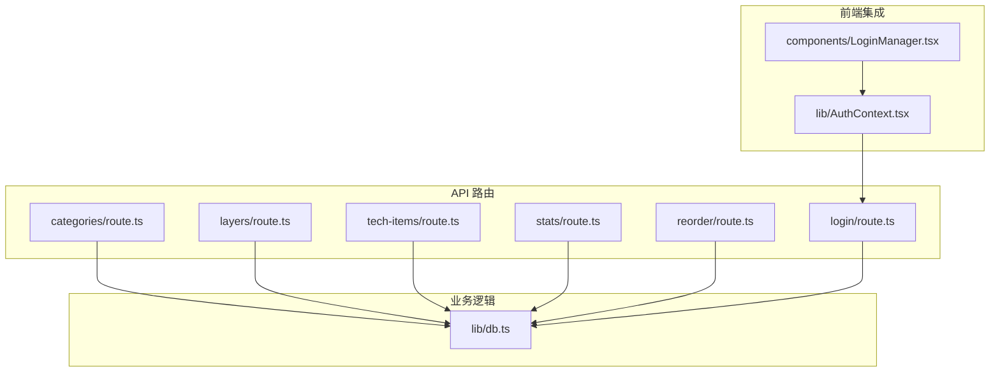
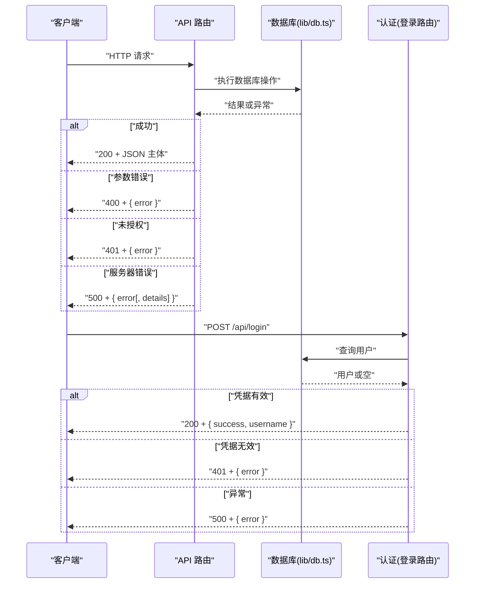
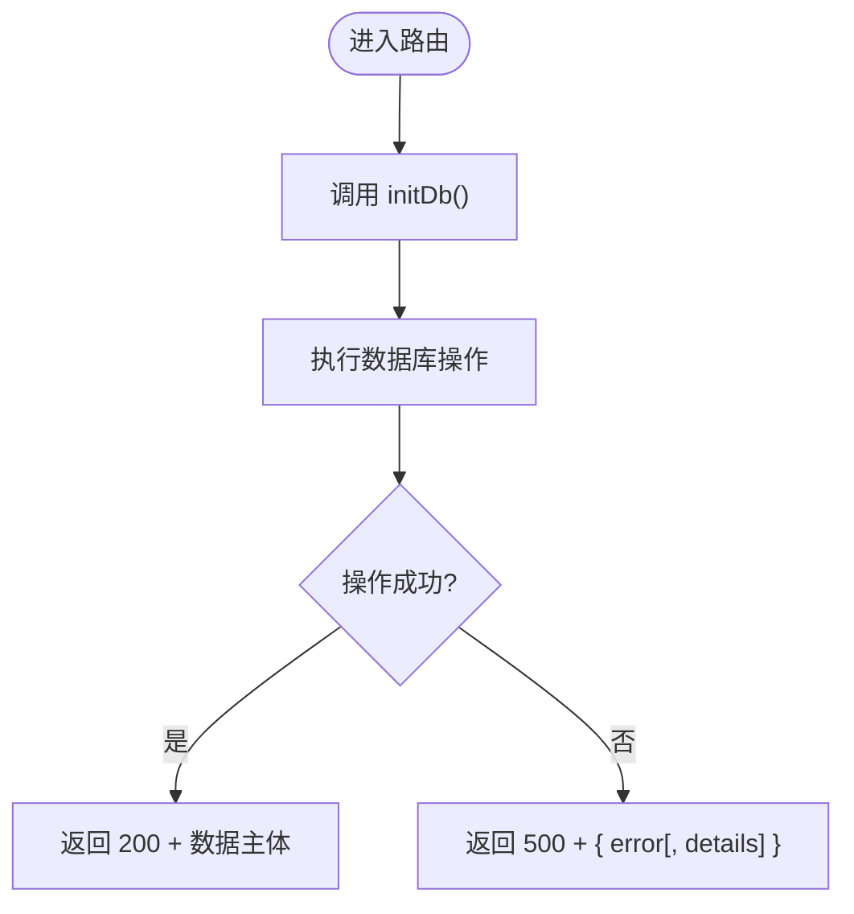
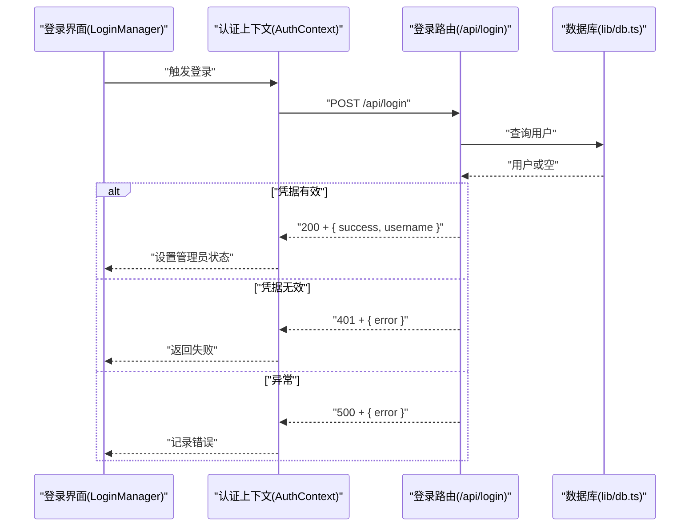
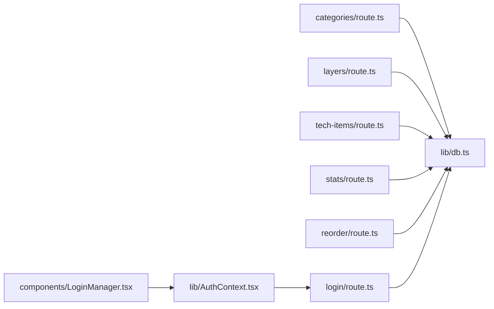

# API错误处理

<cite>
**本文引用的文件**
- [app/api/categories/route.ts](file://app/api/categories/route.ts)
- [app/api/layers/route.ts](file://app/api/layers/route.ts)
- [app/api/stats/route.ts](file://app/api/stats/route.ts)
- [app/api/tech-items/route.ts](file://app/api/tech-items/route.ts)
- [app/api/reorder/route.ts](file://app/api/reorder/route.ts)
- [app/api/login/route.ts](file://app/api/login/route.ts)
- [lib/db.ts](file://lib/db.ts)
- [lib/AuthContext.tsx](file://lib/AuthContext.tsx)
- [components/LoginManager.tsx](file://components/LoginManager.tsx)
- [types/index.ts](file://types/index.ts)
- [README.md](file://README.md)
- [package.json](file://package.json)
</cite>

## 目录
1. [简介](#简介)
2. [项目结构](#项目结构)
3. [核心组件](#核心组件)
4. [架构总览](#架构总览)
5. [详细组件分析](#详细组件分析)
6. [依赖关系分析](#依赖关系分析)
7. [性能考量](#性能考量)
8. [故障排查指南](#故障排查指南)
9. [结论](#结论)
10. [附录](#附录)

## 简介
本文件聚焦于 Lantu Next 项目的 API 错误处理机制，系统性阐述统一的错误响应格式、HTTP 状态码使用规范、典型错误场景的处理策略（如数据库连接失败、请求参数校验失败、认证失败等），并给出调试与日志记录的最佳实践，以及常见问题的诊断与解决路径。

## 项目结构
- API 路由集中于 app/api 下，按资源分组：layers、categories、tech-items、stats、reorder、login。
- 数据库操作集中在 lib/db.ts，采用 SQLite（better-sqlite3）。
- 类型定义位于 types/index.ts，确保前后端一致的数据契约。
- 登录与鉴权在 app/api/login/route.ts 与 lib/AuthContext.tsx、components/LoginManager.tsx 协同完成。

图表来源
- [app/api/categories/route.ts](file://app/api/categories/route.ts#L1-L48)
- [app/api/layers/route.ts](file://app/api/layers/route.ts#L1-L48)
- [app/api/tech-items/route.ts](file://app/api/tech-items/route.ts#L1-L50)
- [app/api/stats/route.ts](file://app/api/stats/route.ts#L1-L15)
- [app/api/reorder/route.ts](file://app/api/reorder/route.ts#L1-L39)
- [app/api/login/route.ts](file://app/api/login/route.ts#L1-L19)
- [lib/db.ts](file://lib/db.ts#L1-L312)
- [lib/AuthContext.tsx](file://lib/AuthContext.tsx#L1-L61)
- [components/LoginManager.tsx](file://components/LoginManager.tsx#L1-L81)

章节来源
- [README.md](file://README.md#L20-L43)
- [package.json](file://package.json#L1-L43)

## 核心组件
- 统一错误响应格式
  - 成功响应：返回业务数据主体。
  - 失败响应：统一返回对象，包含 error 字段；部分路由在内部错误时附加 details 字段以携带更详细的错误信息。
- HTTP 状态码使用规范
  - 客户端错误（4xx）
    - 400：请求参数缺失或格式不正确（如删除接口缺少 id、批量排序接口 updates 不是数组、登录凭据无效）。
    - 401：未授权（登录失败）。
  - 服务器错误（5xx）
    - 500：未捕获异常或数据库执行异常导致的通用错误。
- 数据库层
  - 初始化在各路由入口处调用 initDb()，确保表存在。
  - 所有 CRUD 操作均在 try/catch 包裹下进行，异常时统一返回 500。
  - 统计接口在 catch 中将错误对象转换为字符串作为 details 返回，便于前端展示。

章节来源
- [app/api/categories/route.ts](file://app/api/categories/route.ts#L1-L48)
- [app/api/layers/route.ts](file://app/api/layers/route.ts#L1-L48)
- [app/api/tech-items/route.ts](file://app/api/tech-items/route.ts#L1-L50)
- [app/api/stats/route.ts](file://app/api/stats/route.ts#L1-L15)
- [app/api/reorder/route.ts](file://app/api/reorder/route.ts#L1-L39)
- [app/api/login/route.ts](file://app/api/login/route.ts#L1-L19)
- [lib/db.ts](file://lib/db.ts#L14-L50)

## 架构总览
API 请求从 Next.js App Router 进入，经由各资源路由处理，调用 lib/db.ts 执行数据库操作，最终返回 JSON 响应。认证流程由登录路由与前端上下文协同完成。

图表来源
- [app/api/categories/route.ts](file://app/api/categories/route.ts#L1-L48)
- [app/api/layers/route.ts](file://app/api/layers/route.ts#L1-L48)
- [app/api/tech-items/route.ts](file://app/api/tech-items/route.ts#L1-L50)
- [app/api/stats/route.ts](file://app/api/stats/route.ts#L1-L15)
- [app/api/reorder/route.ts](file://app/api/reorder/route.ts#L1-L39)
- [app/api/login/route.ts](file://app/api/login/route.ts#L1-L19)
- [lib/db.ts](file://lib/db.ts#L14-L50)

## 详细组件分析

### 统一错误响应与状态码规范
- 成功响应
  - 返回业务数据主体（如列表、插入后的 id、成功标记等）。
- 失败响应
  - 400：参数缺失或非法（如删除接口缺少 id、批量排序 updates 非数组、登录凭据无效）。
  - 401：认证失败。
  - 500：数据库异常或未捕获异常。
- 细节字段
  - 统一返回 { error } 字段。
  - 统计接口在 500 时返回 { error, details }，details 为错误消息字符串。

章节来源
- [app/api/categories/route.ts](file://app/api/categories/route.ts#L39-L40)
- [app/api/layers/route.ts](file://app/api/layers/route.ts#L39-L40)
- [app/api/tech-items/route.ts](file://app/api/tech-items/route.ts#L40-L42)
- [app/api/reorder/route.ts](file://app/api/reorder/route.ts#L12-L17)
- [app/api/reorder/route.ts](file://app/api/reorder/route.ts#L29-L31)
- [app/api/login/route.ts](file://app/api/login/route.ts#L15-L17)
- [app/api/stats/route.ts](file://app/api/stats/route.ts#L11-L12)

### 数据库连接与初始化
- 初始化流程
  - 各路由在模块加载时调用 initDb()，确保表存在。
  - 表结构定义包含 categories、tech_items、layers、users。
- 异常处理
  - 所有数据库操作均在 try/catch 中执行，异常统一返回 500。
  - 统计接口在 catch 中将错误对象转为字符串作为 details 字段返回。

图表来源
- [lib/db.ts](file://lib/db.ts#L14-L50)
- [app/api/stats/route.ts](file://app/api/stats/route.ts#L11-L12)

章节来源
- [lib/db.ts](file://lib/db.ts#L14-L50)
- [app/api/stats/route.ts](file://app/api/stats/route.ts#L1-L15)

### 资源路由（categories、layers、tech-items）
- GET/POST/PUT/DELETE 均包裹在 try/catch 中。
- 删除接口在缺少 id 时返回 400；其余异常返回 500。
- POST/PUT 成功后返回包含 id 或成功标记的对象。

章节来源
- [app/api/categories/route.ts](file://app/api/categories/route.ts#L1-L48)
- [app/api/layers/route.ts](file://app/api/layers/route.ts#L1-L48)
- [app/api/tech-items/route.ts](file://app/api/tech-items/route.ts#L1-L50)

### 统计接口（stats）
- 在 catch 中将错误对象转换为字符串作为 details 返回，提升可读性与可诊断性。

章节来源
- [app/api/stats/route.ts](file://app/api/stats/route.ts#L1-L15)

### 批量排序接口（reorder）
- 校验 updates 是否为数组，否则返回 400。
- 校验 type 是否合法，否则返回 400。
- 异常时返回 500，并在服务端打印错误日志。

章节来源
- [app/api/reorder/route.ts](file://app/api/reorder/route.ts#L1-L39)

### 登录接口与认证上下文
- 登录路由
  - 校验凭据，有效则返回 200 + { success, username }，否则 401。
  - 异常返回 500。
- 前端上下文
  - 提供 login/logout 与状态持久化。
  - 登录失败时前端显示“主号或密码错误，请重试”。

图表来源
- [app/api/login/route.ts](file://app/api/login/route.ts#L1-L19)
- [lib/AuthContext.tsx](file://lib/AuthContext.tsx#L23-L41)
- [components/LoginManager.tsx](file://components/LoginManager.tsx#L16-L30)
- [lib/db.ts](file://lib/db.ts#L297-L301)

章节来源
- [app/api/login/route.ts](file://app/api/login/route.ts#L1-L19)
- [lib/AuthContext.tsx](file://lib/AuthContext.tsx#L1-L61)
- [components/LoginManager.tsx](file://components/LoginManager.tsx#L1-L81)

## 依赖关系分析
- 路由到数据库
  - categories、layers、tech-items、stats、reorder 均依赖 lib/db.ts。
- 认证链路
  - 前端 LoginManager 通过 AuthContext 调用 /api/login，登录路由依赖 lib/db.ts 查询用户。
- 类型约束
  - types/index.ts 定义了 Layer、Category、TechItem、Stats 的结构，有助于前后端一致性与 IDE 提示。

图表来源
- [app/api/categories/route.ts](file://app/api/categories/route.ts#L1-L48)
- [app/api/layers/route.ts](file://app/api/layers/route.ts#L1-L48)
- [app/api/tech-items/route.ts](file://app/api/tech-items/route.ts#L1-L50)
- [app/api/stats/route.ts](file://app/api/stats/route.ts#L1-L15)
- [app/api/reorder/route.ts](file://app/api/reorder/route.ts#L1-L39)
- [app/api/login/route.ts](file://app/api/login/route.ts#L1-L19)
- [lib/db.ts](file://lib/db.ts#L1-L312)
- [lib/AuthContext.tsx](file://lib/AuthContext.tsx#L1-L61)
- [components/LoginManager.tsx](file://components/LoginManager.tsx#L1-L81)

章节来源
- [types/index.ts](file://types/index.ts#L1-L34)

## 性能考量
- 数据库事务
  - 批量排序使用事务（updateLayerOrder/updateCategoryOrder/updateTechItemOrder）减少多次往返，提高吞吐与一致性。
- 响应体大小
  - 列表接口返回精简字段，避免传输冗余数据。
- 并发与锁
  - better-sqlite3 为同步驱动，高并发下建议配合连接池或限流策略（当前项目为开发/小规模使用场景）。

章节来源
- [lib/db.ts](file://lib/db.ts#L242-L282)

## 故障排查指南
- 常见错误与定位
  - 400 参数错误
    - 删除接口缺少 id：检查请求 URL 中的查询参数。
    - 批量排序 updates 非数组或 type 非法：检查请求体结构。
  - 401 认证失败
    - 登录凭据无效：确认用户名与密码是否匹配。
  - 500 服务器错误
    - 统计接口：查看 details 字段中的具体错误信息。
    - 其他接口：查看服务端日志（reorder 路由会在控制台输出错误）。
- 诊断步骤
  - 检查路由入口是否已调用 initDb()。
  - 使用最小化请求体复现问题，逐步缩小范围。
  - 对照 types/index.ts 的类型定义，确认字段命名与类型一致。
- 解决方案
  - 参数校验：在路由层增加显式的参数校验与错误提示。
  - 统一错误日志：在 catch 中记录 structured log（含时间戳、路由、错误摘要），便于运维检索。
  - 降级策略：对只读接口（如 GET）在数据库异常时可考虑缓存兜底或返回部分数据。

章节来源
- [app/api/categories/route.ts](file://app/api/categories/route.ts#L39-L40)
- [app/api/layers/route.ts](file://app/api/layers/route.ts#L39-L40)
- [app/api/tech-items/route.ts](file://app/api/tech-items/route.ts#L40-L42)
- [app/api/reorder/route.ts](file://app/api/reorder/route.ts#L12-L17)
- [app/api/reorder/route.ts](file://app/api/reorder/route.ts#L29-L31)
- [app/api/login/route.ts](file://app/api/login/route.ts#L15-L17)
- [app/api/stats/route.ts](file://app/api/stats/route.ts#L11-L12)
- [lib/db.ts](file://lib/db.ts#L14-L50)

## 结论
Lantu Next 的 API 错误处理机制以“统一响应格式 + 明确状态码”为核心，结合路由层的参数校验与 catch 包裹，实现了对常见错误场景的稳定处理。建议后续在参数校验、日志规范化与错误码分级方面进一步完善，以提升可维护性与可观测性。

## 附录
- API 路由与端点
  - 层级：GET/POST /api/layers
  - 分类：GET/POST /api/categories
  - 技术项：GET/POST/PUT/DELETE /api/tech-items
  - 统计：GET /api/stats
  - 批量排序：POST /api/reorder
  - 登录：POST /api/login
- 类型定义参考
  - Layer、Category、TechItem、Stats

章节来源
- [README.md](file://README.md#L89-L111)
- [types/index.ts](file://types/index.ts#L1-L34)