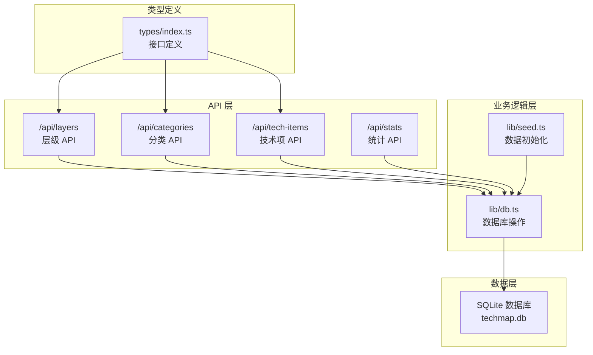
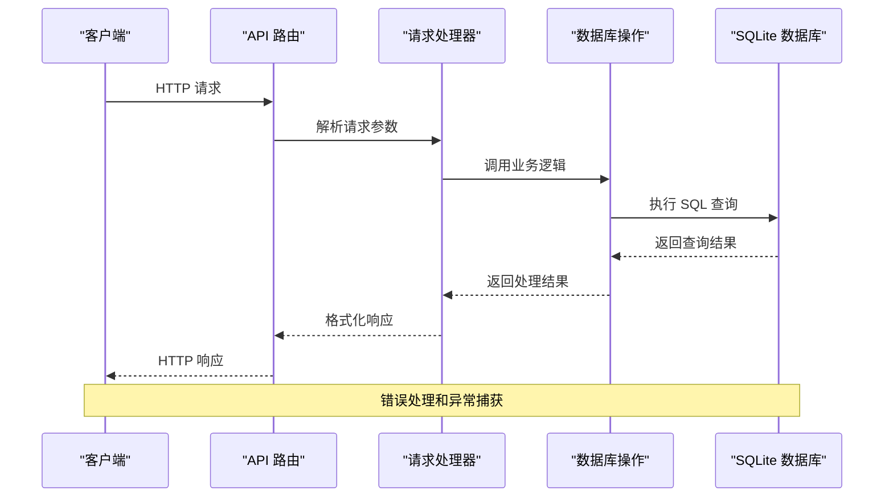
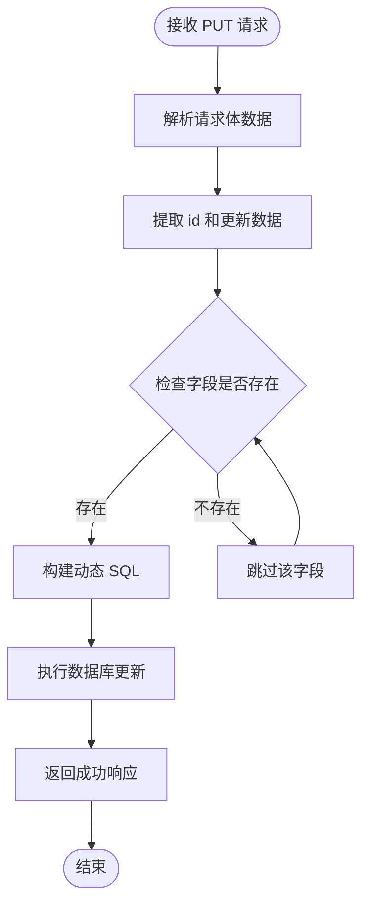
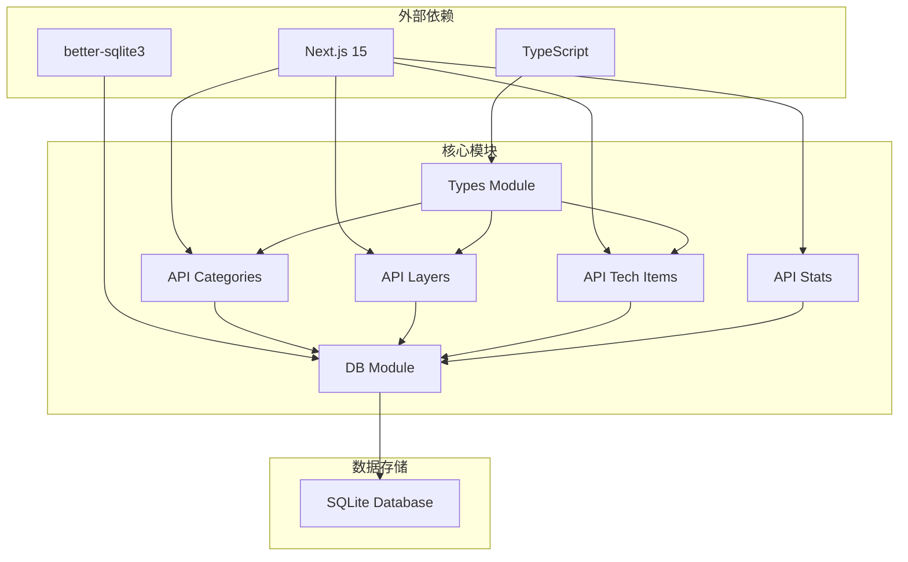
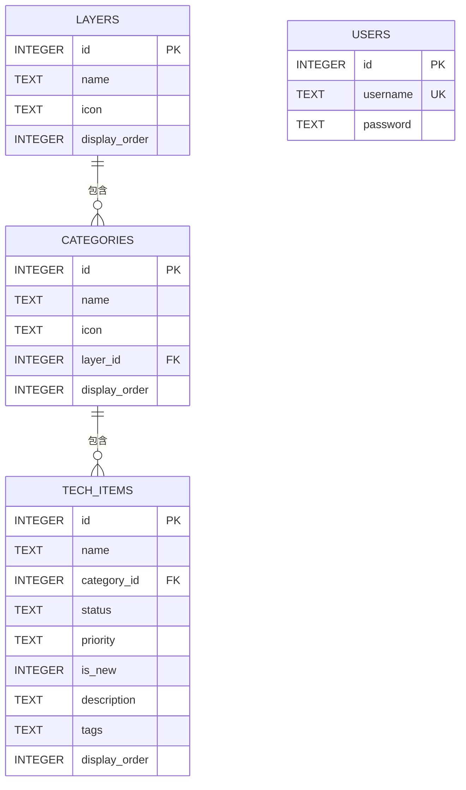

# CRUD操作API

<cite>
**本文档引用的文件**
- [app/api/categories/route.ts](file://app/api/categories/route.ts)
- [app/api/layers/route.ts](file://app/api/layers/route.ts)
- [app/api/tech-items/route.ts](file://app/api/tech-items/route.ts)
- [app/api/stats/route.ts](file://app/api/stats/route.ts)
- [lib/db.ts](file://lib/db.ts)
- [types/index.ts](file://types/index.ts)
- [lib/seed.ts](file://lib/seed.ts)
- [README.md](file://README.md)
</cite>

## 目录
1. [简介](#简介)
2. [项目结构](#项目结构)
3. [核心组件](#核心组件)
4. [架构概览](#架构概览)
5. [详细组件分析](#详细组件分析)
6. [依赖关系分析](#依赖关系分析)
7. [性能考虑](#性能考虑)
8. [故障排除指南](#故障排除指南)
9. [结论](#结论)

## 简介

Lantu Next 是一个基于 Next.js + TypeScript + SQLite 的技术栈管理系统，提供了完整的 CRUD 操作 API。该系统采用分层架构设计，包含三个主要实体：层级（Layers）、分类（Categories）和技术项（Tech Items），以及统计信息接口。

系统的核心特性包括：
- 使用 Next.js 15 App Router 和 TypeScript 提供类型安全
- SQLite 数据库存储，支持完整的 REST API
- 管理后台界面，支持技术项的增删改查操作
- 实时统计功能，展示技术栈覆盖率

## 项目结构

项目采用模块化的文件组织方式，API 路由位于 `app/api/` 目录下，数据库操作封装在 `lib/db.ts` 中，类型定义位于 `types/index.ts`。



**图表来源**
- [app/api/categories/route.ts](file://app/api/categories/route.ts#L1-L48)
- [app/api/layers/route.ts](file://app/api/layers/route.ts#L1-L48)
- [app/api/tech-items/route.ts](file://app/api/tech-items/route.ts#L1-L50)
- [app/api/stats/route.ts](file://app/api/stats/route.ts#L1-L15)
- [lib/db.ts](file://lib/db.ts#L1-L312)

**章节来源**
- [README.md](file://README.md#L20-L43)

## 核心组件

系统包含四个主要的 API 组件，每个都实现了完整的 CRUD 操作：

### 数据库连接管理
- **初始化**: 在每个 API 路由文件中调用 `initDb()` 确保数据库连接可用
- **连接池**: 使用 better-sqlite3 提供高性能的 SQLite 访问
- **事务支持**: 支持批量操作的事务处理

### 类型系统
- **Layer 接口**: 定义层级的基本属性（id, name, icon, display_order）
- **Category 接口**: 定义分类的属性（包含层级关联）
- **TechItem 接口**: 定义技术项的完整属性集
- **Stats 接口**: 定义统计结果的数据结构

**章节来源**
- [lib/db.ts](file://lib/db.ts#L14-L50)
- [types/index.ts](file://types/index.ts#L1-L34)

## 架构概览

系统采用分层架构，清晰分离了 API 层、业务逻辑层和数据持久层。



**图表来源**
- [app/api/categories/route.ts](file://app/api/categories/route.ts#L15-L23)
- [lib/db.ts](file://lib/db.ts#L117-L135)

## 详细组件分析

### 层级 API (Layers)

层级 API 提供技术栈层级的 CRUD 操作，支持层级的创建、查询、更新和删除。

#### API 端点定义

| 方法 | 端点 | 描述 | 请求参数 | 响应数据 |
|------|------|------|----------|----------|
| GET | `/api/layers` | 获取所有层级 | 无 | 层级数组 |
| POST | `/api/layers` | 创建新层级 | `{name, icon, display_order}` | `{id, name, icon, display_order}` |
| PUT | `/api/layers` | 更新层级信息 | `{id, name, icon, display_order}` | `{success: true}` |
| DELETE | `/api/layers` | 删除层级 | 查询参数: `id` | `{success: true}` |

#### 请求参数处理

**POST 请求**:
- 从请求体解析 JSON 数据
- 参数包括: name（层级名称）、icon（图标）、display_order（显示顺序）

**DELETE 请求**:
- 从 URL 查询参数获取 `id` 参数
- 进行必要的参数验证

#### 响应数据格式

**成功响应**:
```json
{
  "id": 1,
  "name": "开发技术层",
  "icon": "💻",
  "display_order": 1
}
```

**错误响应**:
```json
{
  "error": "Failed to create layer"
}
```

**章节来源**
- [app/api/layers/route.ts](file://app/api/layers/route.ts#L1-L48)
- [lib/db.ts](file://lib/db.ts#L117-L135)

### 分类 API (Categories)

分类 API 管理技术项的分类信息，支持分类的完整 CRUD 操作。

#### API 端点定义

| 方法 | 端点 | 描述 | 请求参数 | 响应数据 |
|------|------|------|----------|----------|
| GET | `/api/categories` | 获取所有分类 | 无 | 分类数组 |
| POST | `/api/categories` | 创建新分类 | `{name, icon, layer_id, display_order}` | `{id, name, icon, layer_id, display_order}` |
| PUT | `/api/categories` | 更新分类信息 | `{id, name, icon, layer_id, display_order}` | `{success: true}` |
| DELETE | `/api/categories` | 删除分类 | 查询参数: `id` | `{success: true}` |

#### 关键特性

**外键约束**: 分类必须关联到有效的层级（layer_id），确保数据完整性。

**排序机制**: 支持通过 display_order 字段进行排序管理。

#### 响应数据格式

**成功响应**:
```json
{
  "id": 1,
  "name": "前端基础与框架",
  "icon": "languages",
  "layer_id": 1,
  "display_order": 1
}
```

**章节来源**
- [app/api/categories/route.ts](file://app/api/categories/route.ts#L1-L48)
- [lib/db.ts](file://lib/db.ts#L125-L135)

### 技术项 API (Tech Items)

技术项 API 管理具体的技术栈条目，是最复杂的 CRUD 操作实现。

#### API 端点定义

| 方法 | 端点 | 描述 | 请求参数 | 响应数据 |
|------|------|------|----------|----------|
| GET | `/api/tech-items` | 获取所有技术项 | 无 | 技术项数组 |
| POST | `/api/tech-items` | 创建新技术项 | 完整技术项对象 | `{id, ...data}` |
| PUT | `/api/tech-items` | 更新技术项 | `{id, ...updateData}` | `{success: true}` |
| DELETE | `/api/tech-items` | 删除技术项 | 查询参数: `id` | `{success: true}` |

#### 技术项字段详解

**必需字段**:
- `name`: 技术名称（文本）
- `category_id`: 所属分类 ID（数字）

**可选字段**:
- `status`: 技术状态（active/missing）
- `priority`: 优先级（high/medium/low）
- `is_new`: 是否新增（0/1）
- `description`: 技术描述（文本）
- `tags`: 标签（文本）
- `display_order`: 显示顺序（数字）

#### 动态更新机制

PUT 请求支持部分字段更新，系统会动态构建 SQL 语句只更新提供的字段。



**图表来源**
- [lib/db.ts](file://lib/db.ts#L165-L211)

**章节来源**
- [app/api/tech-items/route.ts](file://app/api/tech-items/route.ts#L1-L50)
- [lib/db.ts](file://lib/db.ts#L138-L211)

### 统计 API (Stats)

统计 API 提供系统整体的统计信息，包括技术项数量、覆盖率等指标。

#### API 端点定义

| 方法 | 端点 | 描述 | 请求参数 | 响应数据 |
|------|------|------|----------|----------|
| GET | `/api/stats` | 获取统计信息 | 无 | `{active, missing, total, coverage}` |

#### 统计指标说明

**返回字段**:
- `active`: 活跃技术项数量
- `missing`: 缺失技术项数量  
- `total`: 总技术项数量
- `coverage`: 覆盖率百分比（保留一位小数）

**计算逻辑**:
覆盖率 = (活跃技术项数量 / 总技术项数量) × 100%

**章节来源**
- [app/api/stats/route.ts](file://app/api/stats/route.ts#L1-L15)
- [lib/db.ts](file://lib/db.ts#L220-L239)

## 依赖关系分析

系统采用清晰的依赖层次结构，确保模块间的松耦合。



**图表来源**
- [lib/db.ts](file://lib/db.ts#L1-L11)
- [types/index.ts](file://types/index.ts#L1-L34)

### 数据库模式设计

系统使用 SQLite 作为数据存储，采用规范化设计确保数据完整性。



**图表来源**
- [lib/db.ts](file://lib/db.ts#L15-L49)

**章节来源**
- [lib/db.ts](file://lib/db.ts#L15-L49)

## 性能考虑

### 数据库优化策略

1. **索引设计**: 使用 display_order 字段建立索引，优化排序查询性能
2. **预编译语句**: 所有数据库操作使用预编译语句，防止 SQL 注入并提高执行效率
3. **批量操作**: 提供批量更新接口，减少数据库往返次数

### 缓存策略

当前实现未包含缓存层，但在高并发场景下可以考虑：
- Redis 缓存热门查询结果
- 数据库连接池优化
- 响应缓存策略

### 并发处理

- 使用 SQLite 的内置锁机制保证数据一致性
- 对于批量操作使用事务确保原子性
- 异常情况下的回滚机制

## 故障排除指南

### 常见错误场景

**数据库连接失败**:
- 检查 data/techmap.db 文件权限
- 确认数据库文件路径正确
- 验证 SQLite 扩展安装

**参数验证错误**:
- 确保请求体格式为合法 JSON
- 验证必填字段完整性
- 检查数据类型匹配

**外键约束错误**:
- 确保关联的层级 ID 存在
- 验证分类与层级的对应关系
- 检查技术项的分类 ID

### 错误响应格式

所有 API 都遵循统一的错误响应格式：

```json
{
  "error": "错误描述信息"
}
```

对于统计 API，还会包含详细的错误信息：
```json
{
  "error": "Failed to fetch stats",
  "details": "具体的错误详情"
}
```

**章节来源**
- [app/api/categories/route.ts](file://app/api/categories/route.ts#L10-L12)
- [app/api/layers/route.ts](file://app/api/layers/route.ts#L10-L12)
- [app/api/tech-items/route.ts](file://app/api/tech-items/route.ts#L11-L13)
- [app/api/stats/route.ts](file://app/api/stats/route.ts#L11-L12)

## 结论

Lantu Next 项目提供了一个完整、健壮的 CRUD 操作 API 系统，具有以下优势：

### 技术优势
- **类型安全**: 完整的 TypeScript 类型定义确保编译时错误检测
- **数据库设计**: 规范化的 SQLite 模式设计保证数据完整性
- **API 设计**: RESTful 风格的接口设计符合最佳实践

### 功能完整性
- **完整 CRUD**: 每个实体都支持完整的增删改查操作
- **数据验证**: 内置的数据验证和错误处理机制
- **统计功能**: 提供实时的系统统计信息

### 扩展性
- **模块化设计**: 清晰的模块分离便于功能扩展
- **数据库抽象**: 数据库操作封装便于替换存储后端
- **类型系统**: 强类型的接口定义支持安全的 API 扩展

该系统为技术栈管理提供了坚实的基础，可以根据具体需求进一步扩展功能，如添加认证授权、搜索过滤、分页等功能。