# 后端API架构

<cite>
**本文档引用的文件**
- [app/api/categories/route.ts](file://app/api/categories/route.ts)
- [app/api/layers/route.ts](file://app/api/layers/route.ts)
- [app/api/stats/route.ts](file://app/api/stats/route.ts)
- [app/api/tech-items/route.ts](file://app/api/tech-items/route.ts)
- [lib/db.ts](file://lib/db.ts)
- [types/index.ts](file://types/index.ts)
- [lib/seed.ts](file://lib/seed.ts)
- [package.json](file://package.json)
- [next.config.ts](file://next.config.ts)
- [README.md](file://README.md)
</cite>

## 目录
1. [简介](#简介)
2. [项目结构](#项目结构)
3. [核心组件](#核心组件)
4. [架构概览](#架构概览)
5. [详细组件分析](#详细组件分析)
6. [依赖关系分析](#依赖关系分析)
7. [性能考虑](#性能考虑)
8. [故障排除指南](#故障排除指南)
9. [结论](#结论)
10. [附录](#附录)

## 简介

Lantu Next项目是一个基于Next.js构建的技术栈管理系统，采用RESTful API设计模式。该系统使用SQLite作为数据存储，通过Next.js API Routes提供完整的后端服务。项目主要包含四个核心API模块：层级管理、分类管理、技术项管理和统计查询。

系统的核心目标是提供一个灵活的技术栈管理平台，支持技术项的状态跟踪、优先级管理、分类组织和层级结构展示。通过标准化的API接口，前端可以实现完整的技术栈可视化和管理功能。

## 项目结构

项目采用基于功能的模块化组织方式，API路由按照业务领域进行分组：

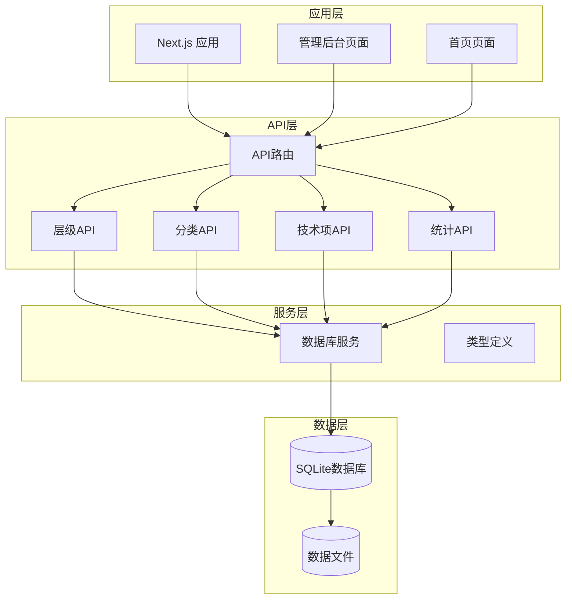

**图表来源**
- [app/api/categories/route.ts](file://app/api/categories/route.ts#L1-L48)
- [app/api/layers/route.ts](file://app/api/layers/route.ts#L1-L48)
- [app/api/stats/route.ts](file://app/api/stats/route.ts#L1-L15)
- [app/api/tech-items/route.ts](file://app/api/tech-items/route.ts#L1-L50)

**章节来源**
- [README.md](file://README.md#L20-L43)
- [package.json](file://package.json#L1-L43)

## 核心组件

### API路由架构

系统采用Next.js的App Router架构，每个API端点都是独立的路由处理器，支持标准的HTTP方法：

- **GET**: 数据查询和列表获取
- **POST**: 新数据创建
- **PUT**: 数据更新
- **DELETE**: 数据删除

### 数据库抽象层

lib/db.ts提供了统一的数据库访问接口，封装了所有数据操作逻辑：

- **初始化**: 自动创建必要的数据库表结构
- **CRUD操作**: 提供完整的数据增删改查功能
- **事务处理**: 支持批量操作的原子性保证
- **数据验证**: 在数据库层面实施约束检查

### 类型系统

types/index.ts定义了完整的TypeScript类型体系：

- **Layer**: 层级实体定义
- **Category**: 分类实体定义  
- **TechItem**: 技术项实体定义
- **Stats**: 统计数据结构定义

**章节来源**
- [lib/db.ts](file://lib/db.ts#L1-L312)
- [types/index.ts](file://types/index.ts#L1-L34)

## 架构概览

系统采用分层架构设计，确保关注点分离和代码可维护性：

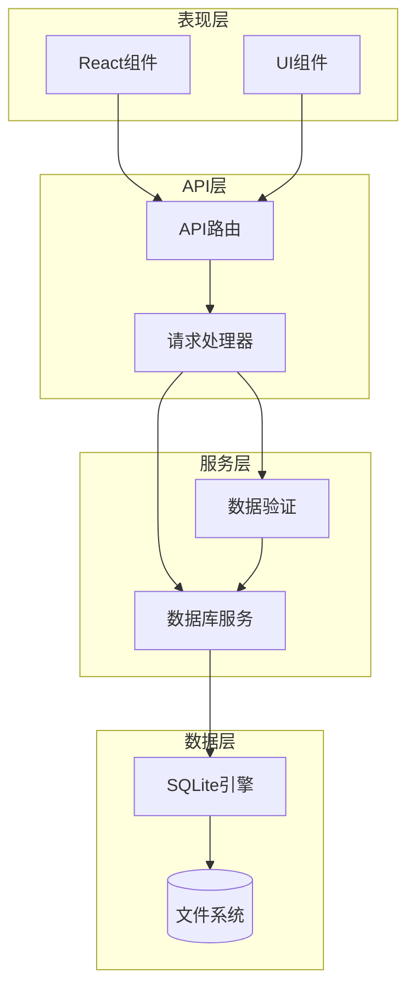

**图表来源**
- [lib/db.ts](file://lib/db.ts#L14-L50)
- [app/api/tech-items/route.ts](file://app/api/tech-items/route.ts#L1-L50)

### 数据流处理

系统的数据流遵循标准的RESTful模式：

1. **请求接收**: Next.js API Routes接收HTTP请求
2. **参数解析**: 解析请求体和查询参数
3. **业务处理**: 调用数据库服务执行相应操作
4. **响应生成**: 将结果转换为JSON格式返回
5. **错误处理**: 统一的异常捕获和错误响应

**章节来源**
- [app/api/categories/route.ts](file://app/api/categories/route.ts#L6-L47)
- [app/api/layers/route.ts](file://app/api/layers/route.ts#L6-L47)

## 详细组件分析

### 层级管理API (Layers)

层级API负责管理技术栈的顶层分类结构：

#### API端点设计

| 方法 | 端点 | 功能 | 请求参数 | 响应数据 |
|------|------|------|----------|----------|
| GET | `/api/layers` | 获取所有层级 | 无 | 层级数组 |
| POST | `/api/layers` | 创建新层级 | name, icon, display_order | 新层级对象 |
| PUT | `/api/layers` | 更新层级信息 | id, name, icon, display_order | 成功状态 |
| DELETE | `/api/layers?id={id}` | 删除层级 | id (查询参数) | 成功状态 |

#### 数据模型

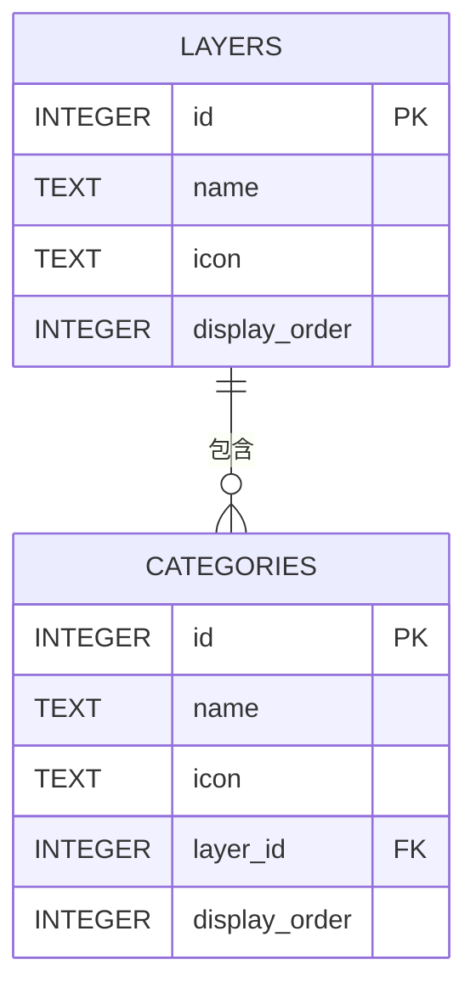

**图表来源**
- [lib/db.ts](file://lib/db.ts#L16-L42)
- [types/index.ts](file://types/index.ts#L1-L6)

#### 处理流程

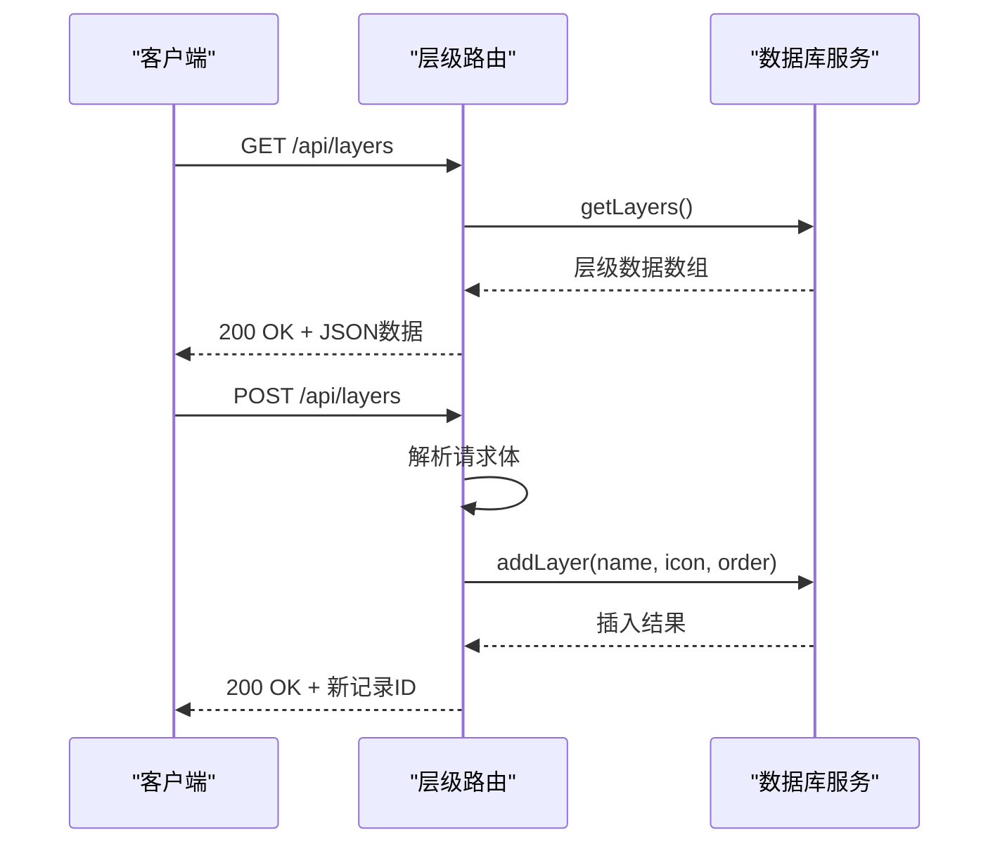

**图表来源**
- [app/api/layers/route.ts](file://app/api/layers/route.ts#L6-L23)
- [lib/db.ts](file://lib/db.ts#L117-L122)

**章节来源**
- [app/api/layers/route.ts](file://app/api/layers/route.ts#L1-L48)
- [lib/db.ts](file://lib/db.ts#L52-L76)

### 分类管理API (Categories)

分类API管理技术项的二级分类结构：

#### API端点设计

| 方法 | 端点 | 功能 | 请求参数 | 响应数据 |
|------|------|------|----------|----------|
| GET | `/api/categories` | 获取所有分类 | 无 | 分类数组 |
| POST | `/api/categories` | 创建新分类 | name, icon, layer_id, display_order | 新分类对象 |
| PUT | `/api/categories` | 更新分类信息 | id, name, icon, layer_id, display_order | 成功状态 |
| DELETE | `/api/categories?id={id}` | 删除分类 | id (查询参数) | 成功状态 |

#### 关联关系

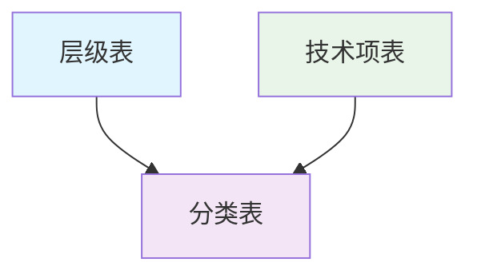

**图表来源**
- [lib/db.ts](file://lib/db.ts#L16-L42)
- [types/index.ts](file://types/index.ts#L8-L14)

#### 错误处理

分类API实现了完善的错误处理机制：

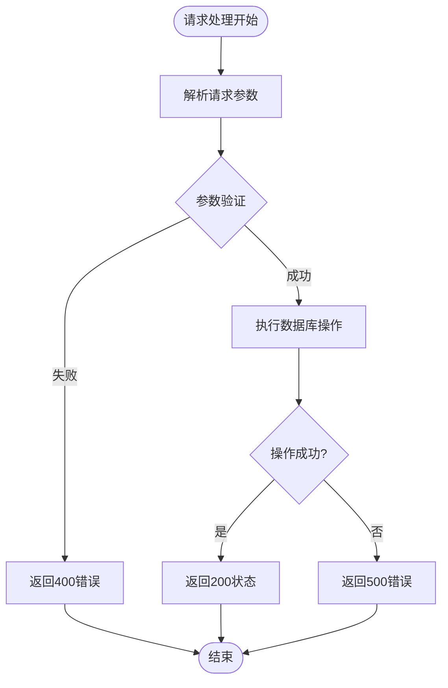

**图表来源**
- [app/api/categories/route.ts](file://app/api/categories/route.ts#L35-L47)

**章节来源**
- [app/api/categories/route.ts](file://app/api/categories/route.ts#L1-L48)
- [lib/db.ts](file://lib/db.ts#L78-L105)

### 技术项管理API (Tech Items)

技术项API管理具体的技术栈条目：

#### API端点设计

| 方法 | 端点 | 功能 | 请求参数 | 响应数据 |
|------|------|------|----------|----------|
| GET | `/api/tech-items` | 获取所有技术项 | 无 | 技术项数组 |
| POST | `/api/tech-items` | 创建新技术项 | 完整技术项数据 | 新技术项对象 |
| PUT | `/api/tech-items` | 更新技术项 | 包含id和更新字段 | 成功状态 |
| DELETE | `/api/tech-items?id={id}` | 删除技术项 | id (查询参数) | 成功状态 |

#### 数据模型复杂性

技术项模型支持丰富的属性组合：

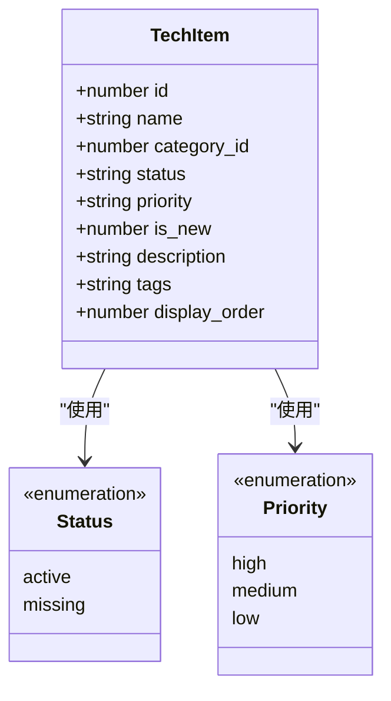

**图表来源**
- [types/index.ts](file://types/index.ts#L16-L26)

#### 动态更新机制

技术项API支持部分字段更新：

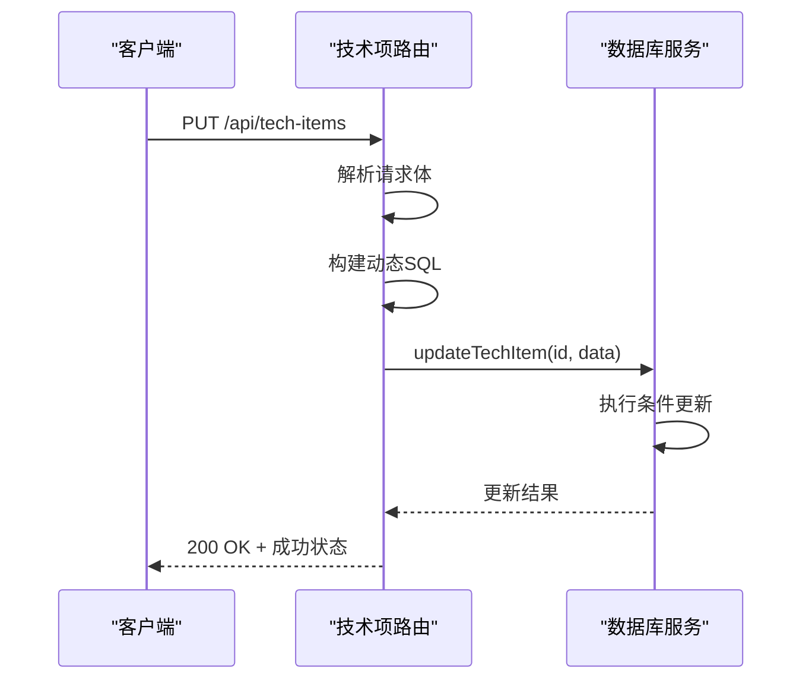

**图表来源**
- [app/api/tech-items/route.ts](file://app/api/tech-items/route.ts#L26-L35)
- [lib/db.ts](file://lib/db.ts#L165-L211)

**章节来源**
- [app/api/tech-items/route.ts](file://app/api/tech-items/route.ts#L1-L50)
- [lib/db.ts](file://lib/db.ts#L107-L217)

### 统计查询API (Stats)

统计API提供系统整体状态的聚合信息：

#### API端点设计

| 方法 | 端点 | 功能 | 请求参数 | 响应数据 |
|------|------|------|----------|----------|
| GET | `/api/stats` | 获取系统统计信息 | 无 | 统计数据对象 |

#### 统计指标

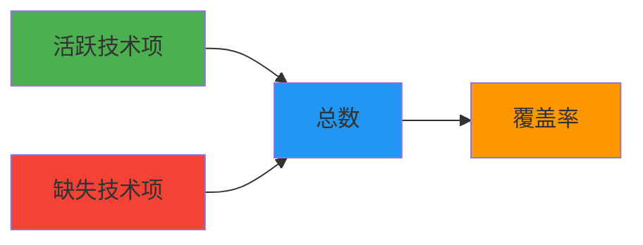

**图表来源**
- [lib/db.ts](file://lib/db.ts#L220-L239)
- [types/index.ts](file://types/index.ts#L28-L33)

#### 数据聚合逻辑

统计API实现了精确的覆盖率计算：

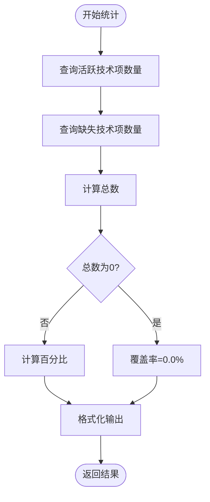

**图表来源**
- [app/api/stats/route.ts](file://app/api/stats/route.ts#L6-L14)
- [lib/db.ts](file://lib/db.ts#L220-L239)

**章节来源**
- [app/api/stats/route.ts](file://app/api/stats/route.ts#L1-L15)
- [lib/db.ts](file://lib/db.ts#L219-L239)

## 依赖关系分析

系统采用松耦合的设计模式，各组件间依赖关系清晰：

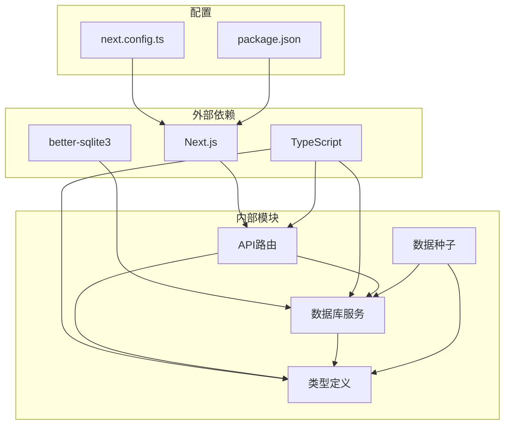

**图表来源**
- [package.json](file://package.json#L12-L36)
- [next.config.ts](file://next.config.ts#L3-L7)

### 数据库依赖

系统使用SQLite作为唯一数据存储，通过better-sqlite3驱动：

- **本地文件存储**: 数据保存在data/techmap.db文件中
- **自动初始化**: 首次访问时自动创建数据库和表结构
- **类型安全**: 通过TypeScript确保数据库操作的类型正确性

### 性能依赖

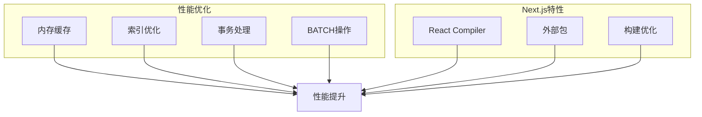

**图表来源**
- [next.config.ts](file://next.config.ts#L5-L6)
- [lib/db.ts](file://lib/db.ts#L242-L282)

**章节来源**
- [lib/db.ts](file://lib/db.ts#L1-L312)
- [package.json](file://package.json#L12-L41)

## 性能考虑

### 数据库性能优化

系统在数据库层面实现了多项性能优化策略：

1. **索引优化**: 在常用查询字段上建立索引
2. **批量操作**: 支持批量更新和删除操作
3. **事务处理**: 确保数据一致性和操作原子性
4. **连接池**: better-sqlite3内置连接管理

### API性能特性

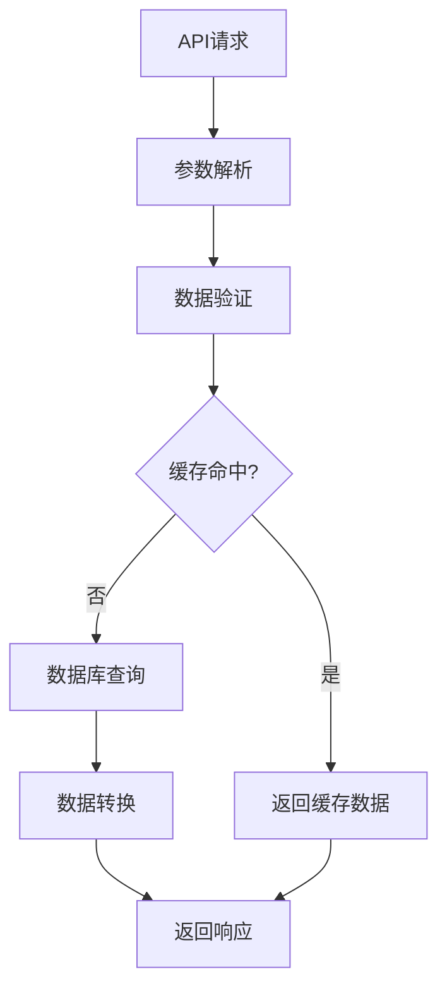

### 缓存策略

虽然当前实现未实现应用层缓存，但具备良好的缓存扩展能力：

- **数据库缓存**: better-sqlite3提供查询缓存
- **浏览器缓存**: 前端可实现HTTP缓存策略
- **CDN缓存**: 静态资源可通过CDN加速

### 监控方案

建议实施的监控指标：

- **响应时间**: API端点的平均响应时间
- **错误率**: 5xx错误的比率
- **数据库性能**: 查询执行时间和连接数
- **内存使用**: 应用进程的内存占用

## 故障排除指南

### 常见错误类型

系统实现了标准化的错误处理机制：

#### HTTP状态码使用

| 状态码 | 使用场景 | 错误类型 |
|--------|----------|----------|
| 200 | 成功响应 | 正常操作 |
| 201 | 创建成功 | POST操作 |
| 400 | 参数错误 | 缺少必需参数 |
| 404 | 资源不存在 | ID无效 |
| 500 | 服务器错误 | 系统异常 |

#### 错误响应格式

所有API端点都遵循统一的错误响应格式：

```json
{
  "error": "错误描述信息",
  "details": "可选的详细信息"
}
```

### 调试技巧

1. **数据库检查**: 使用SQLite命令行工具检查数据状态
2. **日志分析**: 查看Next.js的服务器日志
3. **网络监控**: 使用浏览器开发者工具监控API调用
4. **数据验证**: 确保请求参数符合类型定义

### 数据库维护

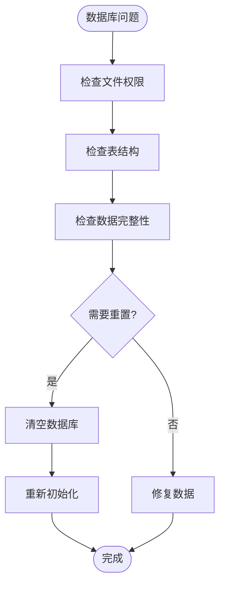

**章节来源**
- [app/api/categories/route.ts](file://app/api/categories/route.ts#L10-L12)
- [app/api/layers/route.ts](file://app/api/layers/route.ts#L10-L12)
- [app/api/stats/route.ts](file://app/api/stats/route.ts#L11-L12)

## 结论

Lantu Next项目的后端API架构展现了现代Web应用的最佳实践：

### 设计优势

1. **RESTful设计**: 符合HTTP标准的API设计模式
2. **类型安全**: 完整的TypeScript类型系统
3. **模块化结构**: 清晰的功能模块划分
4. **数据库抽象**: 统一的数据访问层设计
5. **错误处理**: 标准化的错误响应机制

### 扩展性考虑

系统具备良好的扩展基础：

- **API路由**: 易于添加新的端点和功能模块
- **数据库**: 支持复杂的关联查询和数据迁移
- **类型系统**: 强类型的约束确保代码质量
- **配置管理**: 灵活的环境配置选项

### 改进建议

为进一步提升系统质量，建议考虑：

1. **认证授权**: 实现用户认证和权限控制系统
2. **API版本**: 建立API版本管理策略
3. **缓存机制**: 实施多层缓存优化性能
4. **监控告警**: 部署完整的应用监控系统
5. **测试覆盖**: 增加单元测试和集成测试

## 附录

### API完整清单

| 模块 | 端点 | 方法 | 功能 |
|------|------|------|------|
| 层级 | `/api/layers` | GET, POST, PUT, DELETE | 层级管理 |
| 分类 | `/api/categories` | GET, POST, PUT, DELETE | 分类管理 |
| 技术项 | `/api/tech-items` | GET, POST, PUT, DELETE | 技术项管理 |
| 统计 | `/api/stats` | GET | 系统统计 |

### 数据库表结构

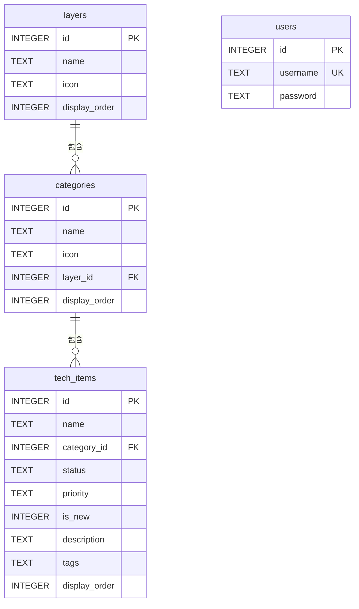

**图表来源**
- [lib/db.ts](file://lib/db.ts#L16-L48)

### 开发工具配置

系统使用现代化的开发工具链：

- **构建工具**: Next.js 16.1.6
- **类型检查**: TypeScript 5.x
- **样式框架**: Tailwind CSS 4.x
- **数据库**: better-sqlite3 12.6.2
- **包管理**: pnpm 8.x