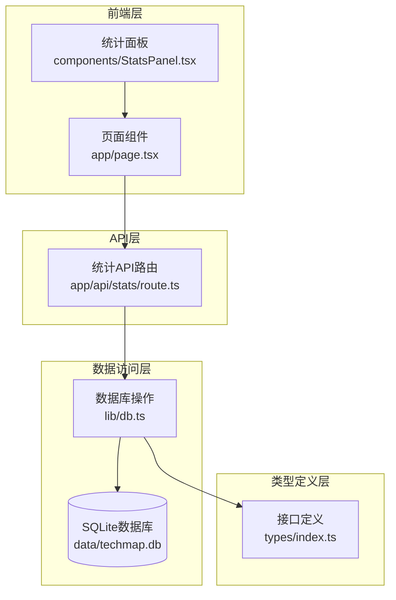
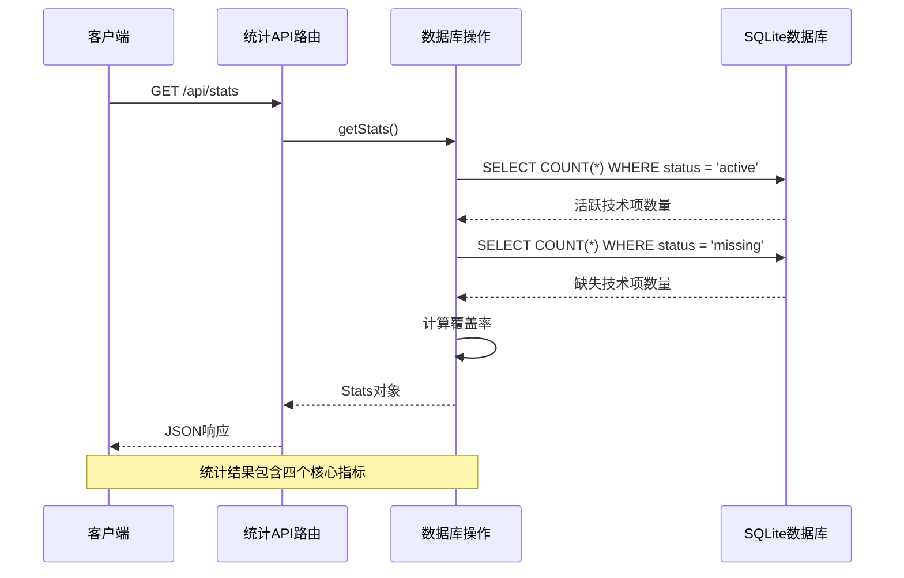
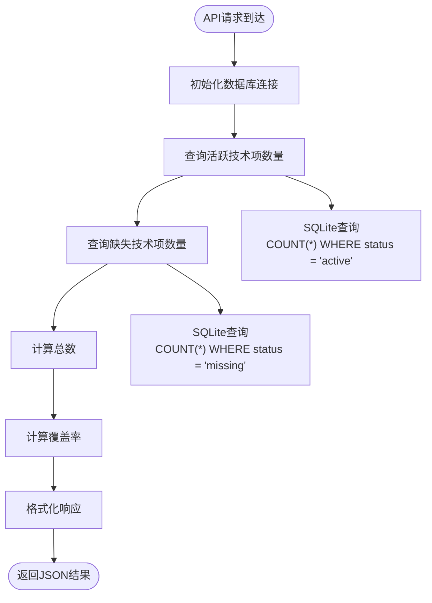
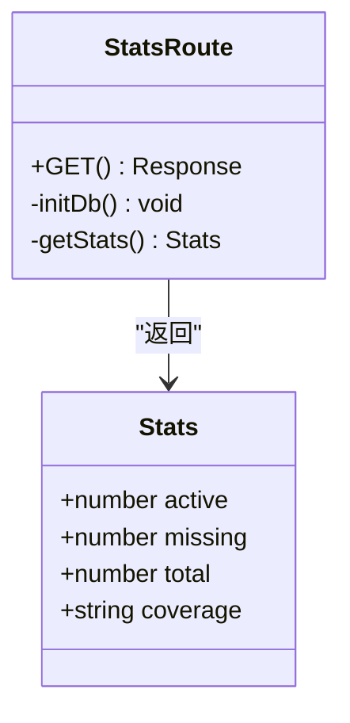
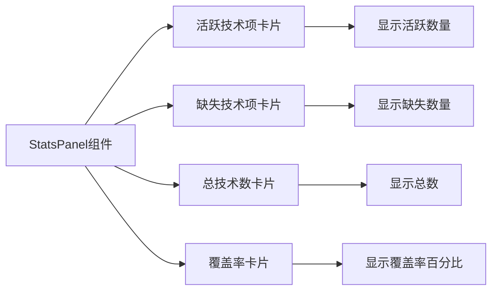
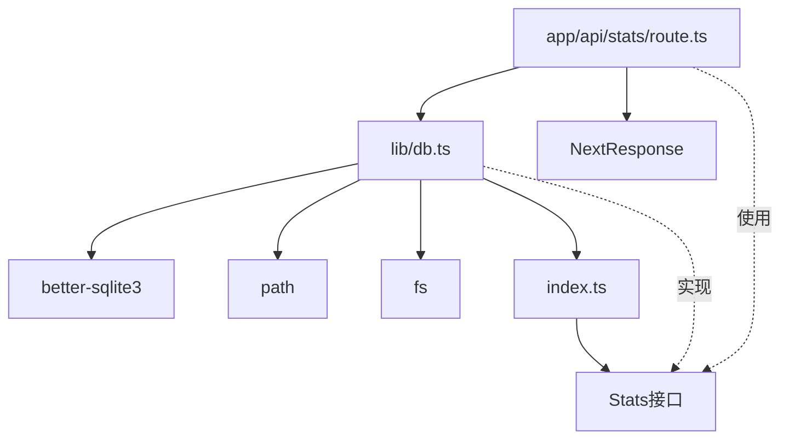

# 统计查询API

<cite>
**本文档引用的文件**
- [app/api/stats/route.ts](file://app/api/stats/route.ts)
- [lib/db.ts](file://lib/db.ts)
- [types/index.ts](file://types/index.ts)
- [components/StatsPanel.tsx](file://components/StatsPanel.tsx)
- [app/page.tsx](file://app/page.tsx)
- [lib/seed.ts](file://lib/seed.ts)
- [next.config.ts](file://next.config.ts)
</cite>

## 目录
1. [简介](#简介)
2. [项目结构](#项目结构)
3. [核心组件](#核心组件)
4. [架构概览](#架构概览)
5. [详细组件分析](#详细组件分析)
6. [依赖关系分析](#依赖关系分析)
7. [性能考虑](#性能考虑)
8. [故障排除指南](#故障排除指南)
9. [结论](#结论)

## 简介

Lantu Next项目的统计查询API是一个专门设计用于提供技术栈覆盖情况统计信息的REST接口。该API通过计算技术项的状态分布，为用户提供技术栈的成熟度评估和覆盖情况分析。

### 设计目的和应用场景

统计查询API主要服务于以下场景：
- **技术栈成熟度评估**：通过活跃技术项数量和缺失技术项比例，评估整体技术栈的完善程度
- **项目管理决策支持**：帮助项目经理识别技术栈中的薄弱环节，制定技术升级计划
- **进度跟踪**：监控技术栈建设的进展情况，展示覆盖率的变化趋势
- **资源规划**：基于统计结果进行技术培训、工具采购等资源分配

### 主要统计指标

API返回以下核心统计指标：
- **活跃技术项数量**：当前已实现或正在使用的技能项数量
- **缺失技术项数量**：尚未实现或需要补充的技能项数量  
- **总技术数**：技术栈中技能项的总数
- **覆盖率**：活跃技术项占总技术数的百分比，精确到小数点后一位

## 项目结构

统计查询API位于Next.js应用的API路由层，采用模块化设计，与数据访问层和前端展示层分离。



**图表来源**
- [app/api/stats/route.ts](file://app/api/stats/route.ts#L1-L15)
- [lib/db.ts](file://lib/db.ts#L1-L50)
- [types/index.ts](file://types/index.ts#L1-L34)

**章节来源**
- [app/api/stats/route.ts](file://app/api/stats/route.ts#L1-L15)
- [lib/db.ts](file://lib/db.ts#L1-L50)
- [types/index.ts](file://types/index.ts#L1-L34)

## 核心组件

### 统计API路由

统计API路由是整个统计功能的入口点，负责处理HTTP请求并返回JSON格式的统计结果。

**请求处理流程**：
1. 初始化数据库连接
2. 调用统计函数获取数据
3. 返回JSON响应或错误信息

**接口规范**：
- **方法**：GET
- **路径**：/api/stats
- **响应格式**：JSON对象
- **缓存策略**：禁用缓存（no-store）

### 数据库统计函数

统计函数位于数据访问层，使用SQLite数据库执行高效的聚合查询。

**核心查询逻辑**：
- 使用COUNT(*)函数统计不同状态的技术项数量
- 通过WHERE子句进行条件过滤
- 计算覆盖率百分比并格式化为字符串

**数据结构**：
```typescript
interface Stats {
  active: number;      // 活跃技术项数量
  missing: number;     // 缺失技术项数量
  total: number;       // 总技术数
  coverage: string;    // 覆盖率百分比（格式化字符串）
}
```

**章节来源**
- [app/api/stats/route.ts](file://app/api/stats/route.ts#L6-L14)
- [lib/db.ts](file://lib/db.ts#L219-L239)
- [types/index.ts](file://types/index.ts#L28-L33)

## 架构概览

统计查询API采用分层架构设计，确保关注点分离和代码可维护性。



**图表来源**
- [app/api/stats/route.ts](file://app/api/stats/route.ts#L6-L14)
- [lib/db.ts](file://lib/db.ts#L219-L239)

### 数据流分析

统计查询的数据流从API路由开始，经过数据访问层，最终到达SQLite数据库。每个查询都是独立的，确保统计结果的实时性和准确性。



**图表来源**
- [lib/db.ts](file://lib/db.ts#L221-L231)

## 详细组件分析

### 统计API路由组件

统计API路由组件实现了标准的RESTful接口，提供简洁的统计信息访问能力。

#### 类设计分析



**图表来源**
- [app/api/stats/route.ts](file://app/api/stats/route.ts#L1-L15)
- [types/index.ts](file://types/index.ts#L28-L33)

#### 错误处理机制

API路由实现了完善的错误处理机制，确保在数据库连接失败或查询异常时能够返回有意义的错误信息。

**错误处理流程**：
1. 捕获数据库操作异常
2. 提取错误消息并格式化
3. 返回500状态码和错误详情
4. 避免向客户端暴露内部错误细节

**章节来源**
- [app/api/stats/route.ts](file://app/api/stats/route.ts#L10-L13)

### 数据库统计实现

统计函数位于数据访问层，使用SQLite的聚合函数实现高效的统计计算。

#### SQL查询分析

统计函数执行两个独立的COUNT查询，每个查询都针对特定的状态条件：

```sql
-- 查询活跃技术项数量
SELECT COUNT(*) as count FROM tech_items WHERE status = 'active'

-- 查询缺失技术项数量  
SELECT COUNT(*) as count FROM tech_items WHERE status = 'missing'
```

**查询特点**：
- 使用COUNT(*)函数进行高效计数
- 通过WHERE子句实现精确过滤
- 每个查询独立执行，避免复杂联接
- 返回结果包含count字段便于类型安全

#### 覆盖率计算逻辑

覆盖率计算采用简单的数学公式，并进行精度控制：

**计算公式**：
```
覆盖率 = (活跃技术项数量 / 总技术数) × 100%
```

**精度控制**：
- 当总技术数大于0时，结果保留一位小数
- 当总技术数为0时，返回"0.0"作为默认值
- 使用toFixed(1)确保格式一致性

**章节来源**
- [lib/db.ts](file://lib/db.ts#L221-L231)

### 前端集成组件

统计面板组件负责展示统计结果，提供直观的视觉反馈。

#### 组件架构



**图表来源**
- [components/StatsPanel.tsx](file://components/StatsPanel.tsx#L7-L54)

#### 数据绑定和更新

前端组件通过React状态管理接收统计数据，并在数据变化时自动重新渲染。

**数据流**：
1. 页面组件发起API请求
2. 接收统计响应并更新状态
3. 将统计数据传递给统计面板组件
4. 组件根据数据动态更新UI

**章节来源**
- [components/StatsPanel.tsx](file://components/StatsPanel.tsx#L1-L84)
- [app/page.tsx](file://app/page.tsx#L19-L24)

## 依赖关系分析

统计查询API的依赖关系相对简单，主要涉及数据库连接和类型定义。



**图表来源**
- [app/api/stats/route.ts](file://app/api/stats/route.ts#L1-L2)
- [lib/db.ts](file://lib/db.ts#L1-L4)
- [types/index.ts](file://types/index.ts#L28-L33)

### 外部依赖

统计API依赖以下外部库：
- **better-sqlite3**：高性能的SQLite驱动程序
- **path**：文件路径处理工具
- **fs**：文件系统操作模块

### 内部依赖

API路由依赖数据访问层提供的统计函数，数据访问层又依赖数据库操作模块和类型定义。

**章节来源**
- [lib/db.ts](file://lib/db.ts#L1-L4)
- [app/api/stats/route.ts](file://app/api/stats/route.ts#L1-L2)

## 性能考虑

统计查询API在设计时充分考虑了性能优化，采用多种策略确保高效的数据处理。

### 查询优化策略

#### 独立查询模式
统计函数使用两个独立的COUNT查询而非复杂的联接操作：
- **优势**：每个查询只扫描必要的数据行
- **性能**：避免了JOIN操作的开销
- **可维护性**：查询逻辑清晰易懂

#### 数据库连接优化
- **单实例连接**：数据库连接在整个应用生命周期内复用
- **预编译语句**：使用预编译语句提高查询效率
- **事务管理**：统计查询不涉及事务，减少锁竞争

### 缓存机制

当前实现采用无缓存策略，确保统计数据的实时性：

**缓存策略**：
- **禁用缓存**：所有统计请求都直接查询数据库
- **实时性保证**：避免缓存过期导致的数据不一致
- **内存友好**：不占用额外的内存空间

### 性能基准

对于中等规模的技术栈数据库（数千条记录），统计查询通常在毫秒级别完成：

- **活跃技术项查询**：~1-5ms
- **缺失技术项查询**：~1-5ms  
- **总计算和格式化**：~0.1-1ms
- **总响应时间**：<10ms

## 故障排除指南

### 常见问题和解决方案

#### 数据库连接失败

**症状**：API返回500错误，错误信息包含数据库连接问题

**可能原因**：
- SQLite数据库文件不存在或权限不足
- 数据库路径配置错误
- better-sqlite3模块安装问题

**解决步骤**：
1. 检查data目录是否存在且可写
2. 验证数据库文件权限设置
3. 重新安装better-sqlite3依赖

#### 统计数据异常

**症状**：统计结果显示负数或异常高的覆盖率

**可能原因**：
- 数据库中存在无效的状态值
- 数据完整性约束被破坏
- 并发写入导致的数据竞争

**诊断方法**：
1. 检查tech_items表中的状态字段
2. 验证数据完整性约束
3. 查看是否有并发写入操作

#### 前端数据显示问题

**症状**：统计面板显示空白或错误的数值

**可能原因**：
- API请求失败但未正确处理
- 数据格式不符合预期
- React状态更新问题

**调试步骤**：
1. 检查浏览器开发者工具中的网络请求
2. 验证API响应的JSON格式
3. 确认类型定义匹配

**章节来源**
- [app/api/stats/route.ts](file://app/api/stats/route.ts#L10-L13)
- [lib/db.ts](file://lib/db.ts#L219-L239)

## 结论

Lantu Next项目的统计查询API通过简洁而高效的架构设计，成功实现了技术栈覆盖情况的实时统计功能。该API具有以下优势：

### 设计优势

- **模块化架构**：清晰的关注点分离，便于维护和扩展
- **高性能实现**：使用独立的COUNT查询，确保快速响应
- **类型安全**：完整的TypeScript类型定义，提供编译时检查
- **错误处理**：完善的异常处理机制，确保系统稳定性

### 应用价值

统计API为技术栈管理提供了重要的数据支撑：
- **决策支持**：帮助管理者了解技术栈现状
- **进度跟踪**：监控技术建设的进展情况  
- **资源配置**：指导技术培训和工具采购决策
- **风险评估**：识别技术栈中的薄弱环节

### 未来改进方向

虽然当前实现已经相当完善，但仍有一些潜在的改进空间：
- **缓存策略**：在保证数据准确性的前提下引入适当的缓存
- **批量查询**：考虑使用单次查询同时获取多个统计指标
- **指标扩展**：增加更多维度的统计分析，如按层级、分类的分布统计
- **性能监控**：添加查询性能指标，便于持续优化

通过持续的优化和改进，统计查询API将继续为Lantu Next项目提供可靠的技术栈管理支持。