# 认证登录API

<cite>
**本文档引用的文件**
- [app/api/login/route.ts](file://app/api/login/route.ts)
- [lib/AuthContext.tsx](file://lib/AuthContext.tsx)
- [lib/db.ts](file://lib/db.ts)
- [lib/seed.ts](file://lib/seed.ts)
- [app/layout.tsx](file://app/layout.tsx)
- [app/admin/page.tsx](file://app/admin/page.tsx)
- [types/index.ts](file://types/index.ts)
- [README.md](file://README.md)
</cite>

## 目录
1. [简介](#简介)
2. [项目结构](#项目结构)
3. [核心组件](#核心组件)
4. [架构概览](#架构概览)
5. [详细组件分析](#详细组件分析)
6. [依赖关系分析](#依赖关系分析)
7. [性能考虑](#性能考虑)
8. [故障排除指南](#故障排除指南)
9. [结论](#结论)

## 简介

Lantu Next项目是一个基于Next.js + TypeScript + SQLite构建的技术栈管理系统。该项目实现了基本的认证登录功能，采用简单的用户名密码验证机制。本文档将深入分析认证登录API的设计和实现，包括安全设计、会话管理机制、认证中间件原理以及权限控制策略。

## 项目结构

项目采用标准的Next.js 15 App Router架构，主要分为以下几个部分：

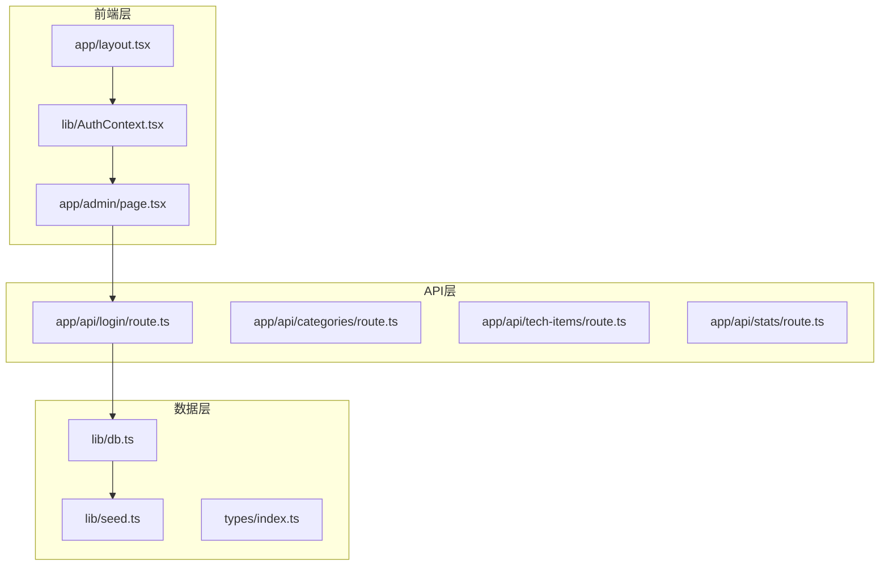

**图表来源**
- [app/layout.tsx](file://app/layout.tsx#L1-L36)
- [lib/AuthContext.tsx](file://lib/AuthContext.tsx#L1-L62)
- [app/api/login/route.ts](file://app/api/login/route.ts#L1-L20)

**章节来源**
- [README.md](file://README.md#L20-L43)
- [app/layout.tsx](file://app/layout.tsx#L1-L36)

## 核心组件

### 认证API组件

项目的核心认证功能由以下组件构成：

1. **登录API路由** (`app/api/login/route.ts`) - 处理用户登录请求
2. **认证上下文** (`lib/AuthContext.tsx`) - 管理客户端认证状态
3. **数据库操作** (`lib/db.ts`) - 提供用户认证和数据访问功能
4. **种子数据** (`lib/seed.ts`) - 初始化管理员账户

### 数据模型

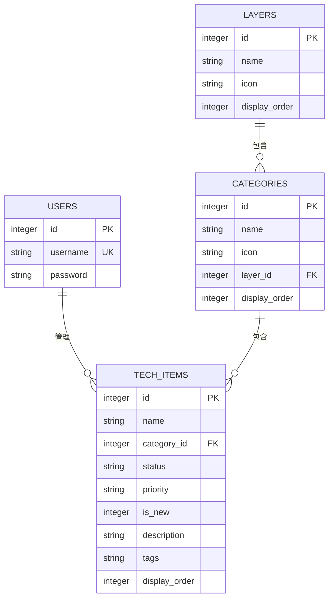

**图表来源**
- [lib/db.ts](file://lib/db.ts#L44-L48)
- [lib/db.ts](file://lib/db.ts#L16-L42)
- [lib/db.ts](file://lib/db.ts#L24-L35)

**章节来源**
- [lib/db.ts](file://lib/db.ts#L1-L312)
- [types/index.ts](file://types/index.ts#L1-L34)

## 架构概览

### 认证系统架构

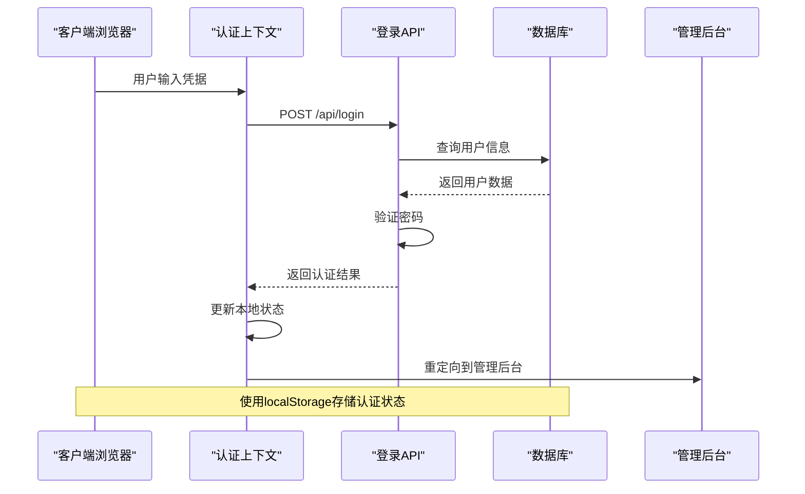

**图表来源**
- [lib/AuthContext.tsx](file://lib/AuthContext.tsx#L23-L41)
- [app/api/login/route.ts](file://app/api/login/route.ts#L4-L18)
- [lib/db.ts](file://lib/db.ts#L296-L301)

### 权限控制流程

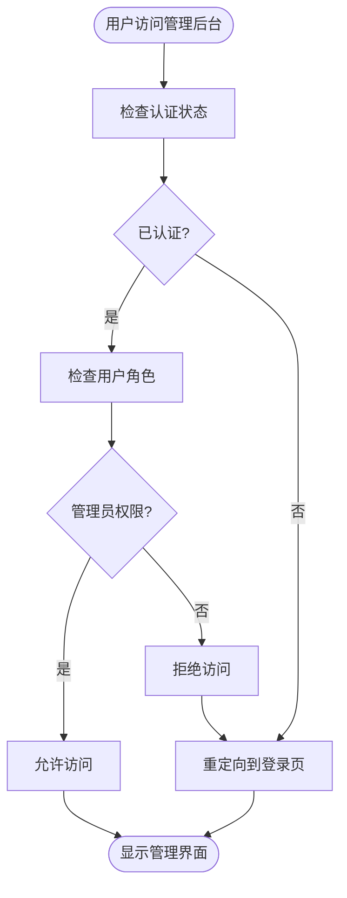

**图表来源**
- [lib/AuthContext.tsx](file://lib/AuthContext.tsx#L13-L52)
- [app/admin/page.tsx](file://app/admin/page.tsx#L1-L311)

## 详细组件分析

### 登录API实现

#### API路由设计

登录API位于`app/api/login/route.ts`，采用Next.js API Routes的标准模式：

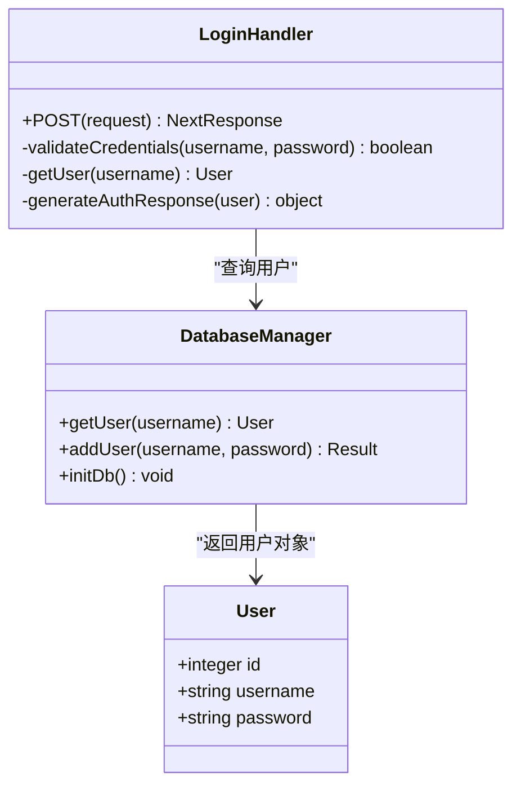

**图表来源**
- [app/api/login/route.ts](file://app/api/login/route.ts#L1-L20)
- [lib/db.ts](file://lib/db.ts#L296-L301)

#### 认证流程分析

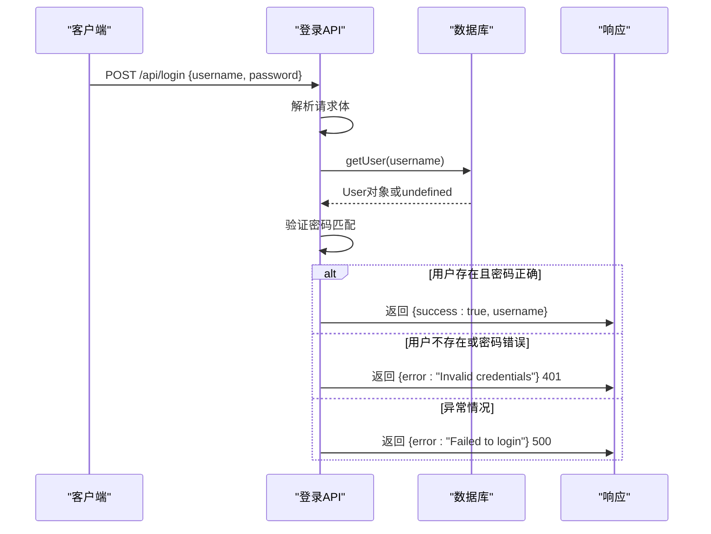

**图表来源**
- [app/api/login/route.ts](file://app/api/login/route.ts#L4-L18)

**章节来源**
- [app/api/login/route.ts](file://app/api/login/route.ts#L1-L20)

### 认证上下文实现

#### 状态管理机制

认证上下文`lib/AuthContext.tsx`实现了客户端状态管理：

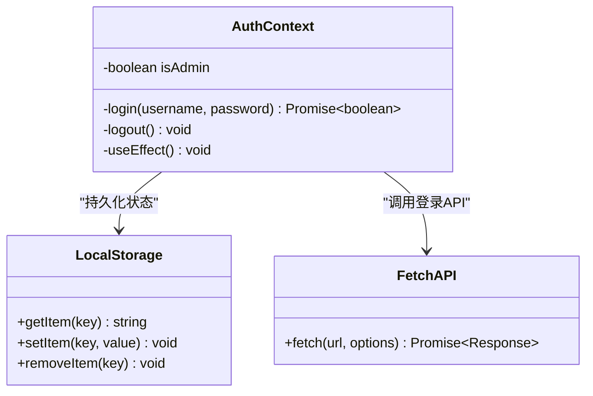

**图表来源**
- [lib/AuthContext.tsx](file://lib/AuthContext.tsx#L13-L52)

#### 生命周期管理

认证上下文通过React Context提供全局状态管理：

1. **初始化阶段**：从localStorage恢复认证状态
2. **登录阶段**：调用API进行身份验证
3. **登出阶段**：清除认证状态和本地存储

**章节来源**
- [lib/AuthContext.tsx](file://lib/AuthContext.tsx#L1-L62)

### 数据库设计

#### 用户表结构

数据库层提供了完整的用户管理功能：

```mermaid
erDiagram
USERS {
integer id PK
string username UK
string password
}
class UserManager {
+getUser(username) User
+addUser(username, password) Result
+initDb() void
+clearDb() void
}
UserManager --> USERS : "CRUD操作"
```

**图表来源**
- [lib/db.ts](file://lib/db.ts#L44-L48)
- [lib/db.ts](file://lib/db.ts#L296-L309)

#### 种子数据初始化

系统通过`lib/seed.ts`脚本初始化管理员账户：

**章节来源**
- [lib/db.ts](file://lib/db.ts#L1-L312)
- [lib/seed.ts](file://lib/seed.ts#L15-L16)

### 管理后台集成

#### 权限控制实现

管理后台页面`app/admin/page.tsx`集成了认证系统：

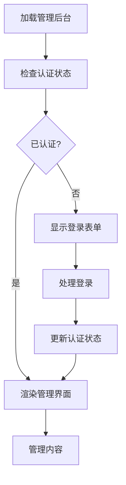

**图表来源**
- [app/admin/page.tsx](file://app/admin/page.tsx#L1-L311)
- [lib/AuthContext.tsx](file://lib/AuthContext.tsx#L13-L52)

**章节来源**
- [app/admin/page.tsx](file://app/admin/page.tsx#L1-L311)

## 依赖关系分析

### 组件依赖图

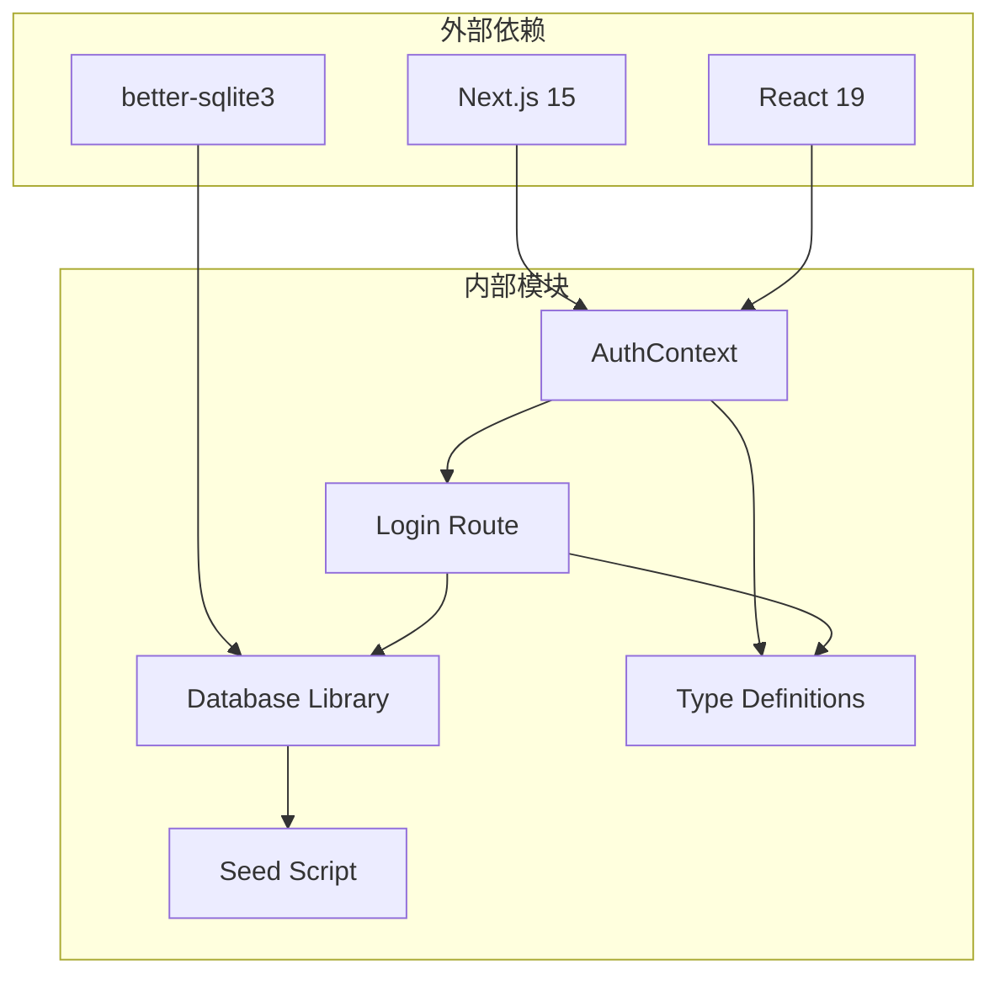

**图表来源**
- [package.json](file://package.json#L12-L24)
- [lib/AuthContext.tsx](file://lib/AuthContext.tsx#L1-L62)
- [app/api/login/route.ts](file://app/api/login/route.ts#L1-L20)

### 数据流依赖

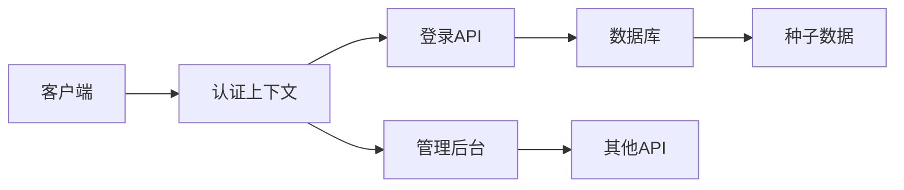

**图表来源**
- [lib/AuthContext.tsx](file://lib/AuthContext.tsx#L23-L41)
- [app/api/login/route.ts](file://app/api/login/route.ts#L4-L18)
- [lib/db.ts](file://lib/db.ts#L296-L301)

**章节来源**
- [package.json](file://package.json#L1-L43)

## 性能考虑

### 认证性能优化

1. **数据库查询优化**：使用预编译语句避免SQL注入
2. **内存管理**：合理使用React Context避免不必要的重渲染
3. **缓存策略**：利用localStorage减少重复认证请求

### 安全性能平衡

1. **密码存储**：当前采用明文存储，建议升级为哈希存储
2. **会话管理**：使用localStorage而非HTTP-only cookies
3. **传输安全**：建议启用HTTPS和CORS配置

## 故障排除指南

### 常见问题诊断

#### 认证失败问题

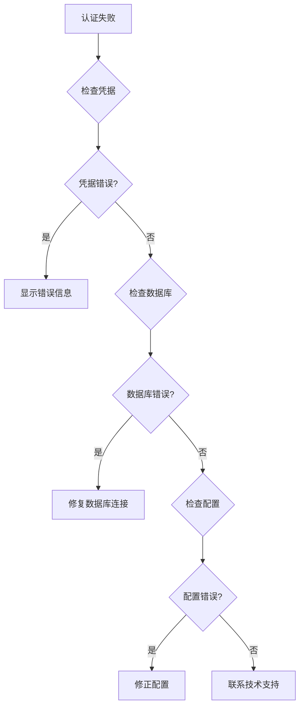

#### 错误处理机制

系统实现了多层次的错误处理：

1. **API层错误**：捕获数据库查询异常
2. **认证层错误**：处理网络请求失败
3. **前端错误**：提供用户友好的错误提示

**章节来源**
- [app/api/login/route.ts](file://app/api/login/route.ts#L15-L18)
- [lib/AuthContext.tsx](file://lib/AuthContext.tsx#L37-L40)

### 安全最佳实践

#### 当前安全状况评估

1. **密码存储**：明文存储，存在安全风险
2. **会话管理**：localStorage存储，易受XSS攻击
3. **传输安全**：未强制HTTPS
4. **权限控制**：基于localStorage的简单权限检查

#### 改进建议

1. **密码加密**：使用bcrypt等哈希算法
2. **安全存储**：使用HttpOnly cookies
3. **CORS配置**：限制跨域访问
4. **CSRF保护**：添加CSRF令牌
5. **速率限制**：防止暴力破解

## 结论

Lantu Next项目的认证登录API实现了基本的身份验证功能，采用简洁的用户名密码验证机制。系统的主要特点包括：

### 已实现功能
- 基本的用户认证流程
- 客户端状态管理
- 管理后台权限控制
- 数据库用户管理

### 安全改进空间
- 密码应使用哈希算法存储
- 会话应使用更安全的存储机制
- 应添加CSRF保护和速率限制
- 建议实现JWT或会话管理

### 架构优势
- 清晰的分层架构
- 良好的TypeScript类型支持
- 简洁的API设计
- 易于扩展的数据库结构

该系统为后续的安全增强提供了良好的基础，建议按照安全最佳实践逐步完善认证机制。