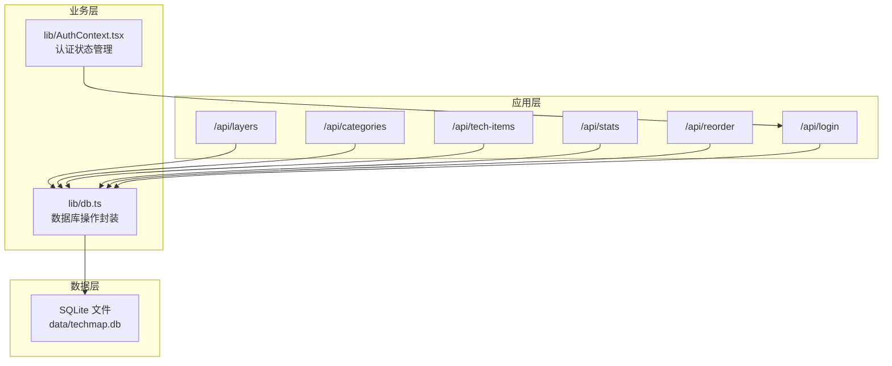
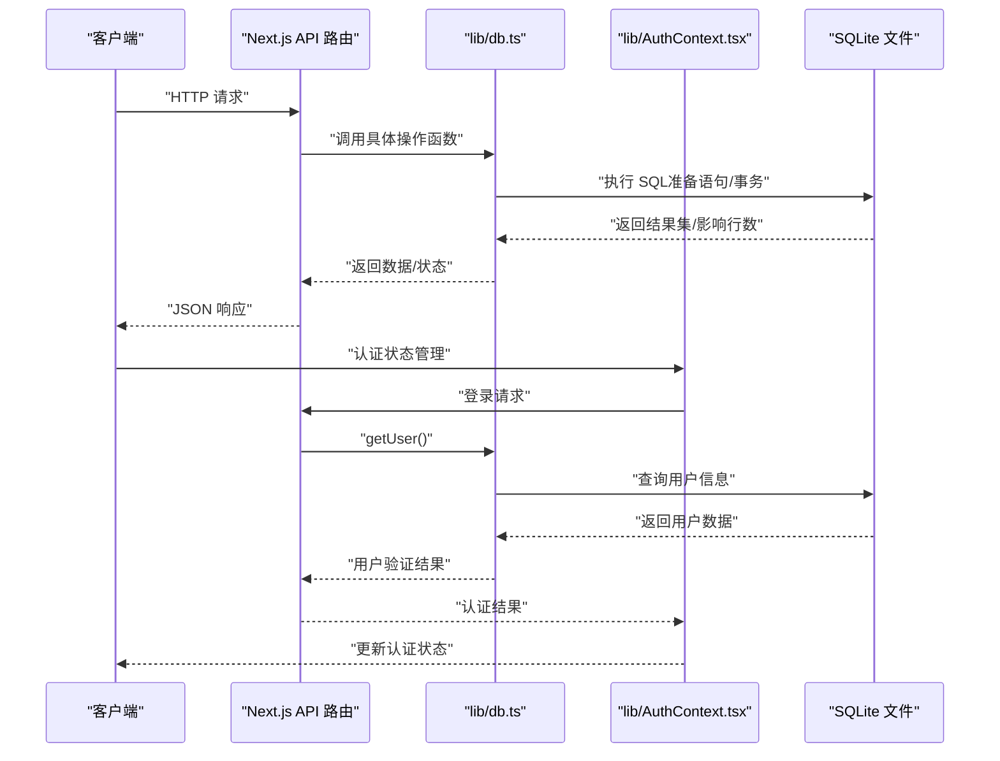
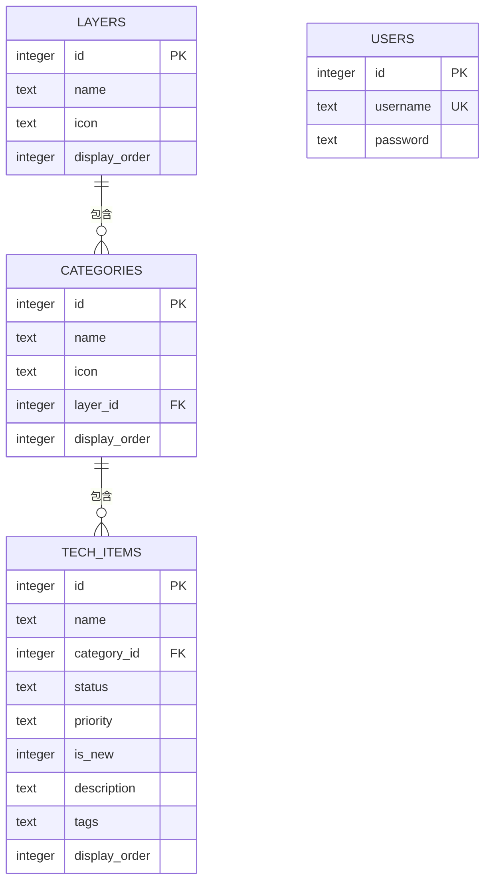
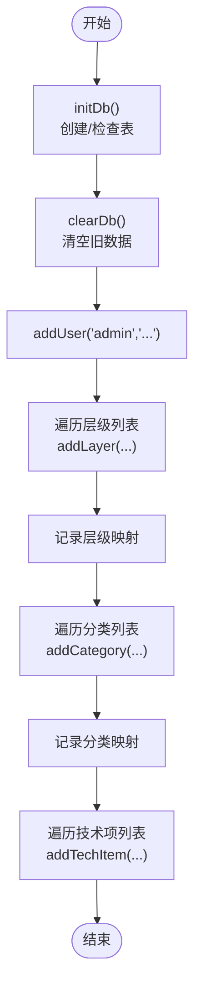
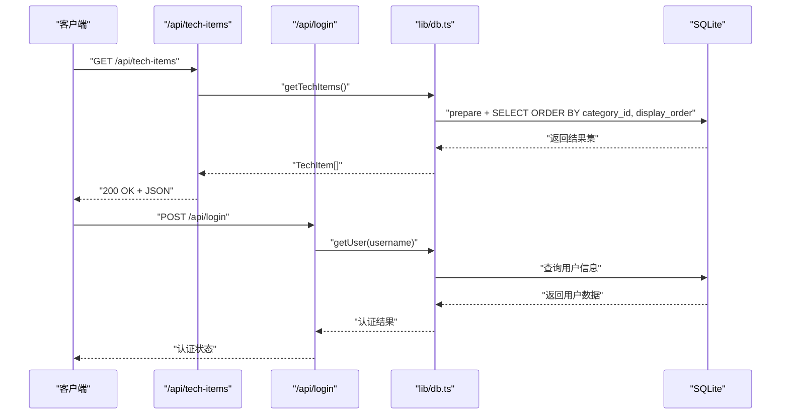
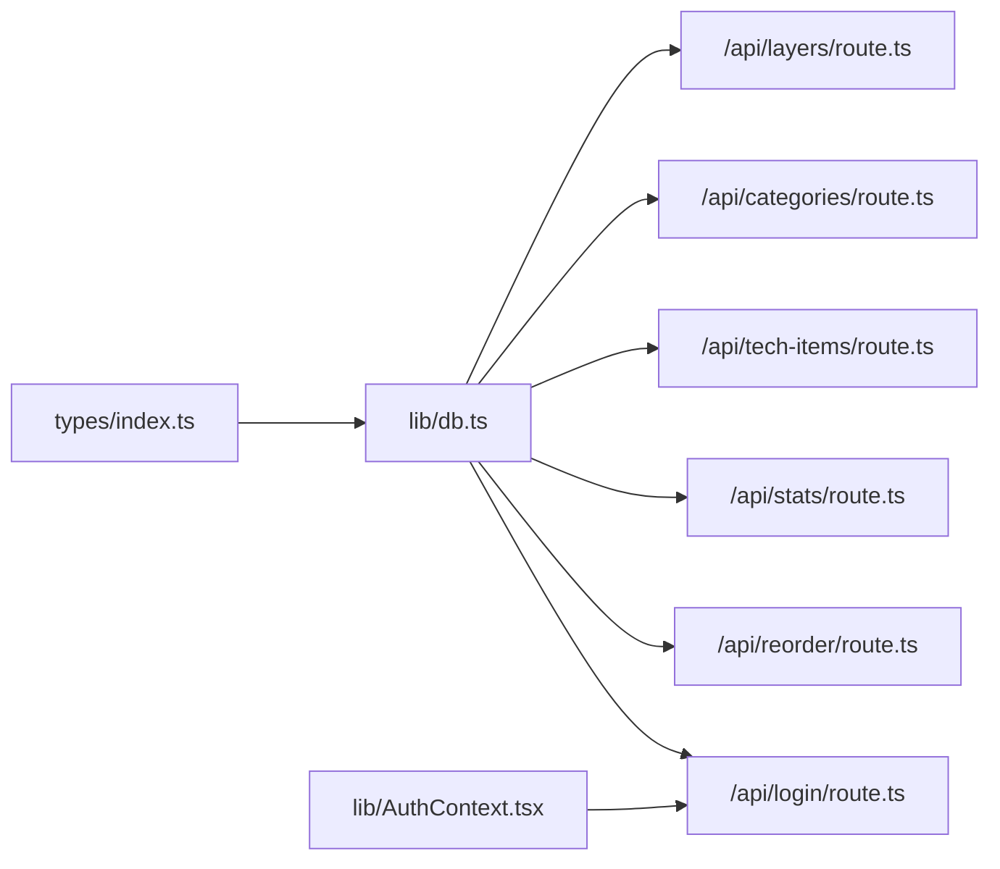

# 数据库架构

<cite>
**本文引用的文件**
- [lib/db.ts](file://lib/db.ts)
- [lib/seed.ts](file://lib/seed.ts)
- [types/index.ts](file://types/index.ts)
- [app/api/layers/route.ts](file://app/api/layers/route.ts)
- [app/api/categories/route.ts](file://app/api/categories/route.ts)
- [app/api/tech-items/route.ts](file://app/api/tech-items/route.ts)
- [app/api/stats/route.ts](file://app/api/stats/route.ts)
- [app/api/login/route.ts](file://app/api/login/route.ts)
- [app/api/reorder/route.ts](file://app/api/reorder/route.ts)
- [lib/AuthContext.tsx](file://lib/AuthContext.tsx)
- [PROJECT_MIGRATION.md](file://PROJECT_MIGRATION.md)
</cite>

## 目录
1. [简介](#简介)
2. [项目结构](#项目结构)
3. [核心组件](#核心组件)
4. [架构总览](#架构总览)
5. [详细组件分析](#详细组件分析)
6. [依赖分析](#依赖分析)
7. [性能考虑](#性能考虑)
8. [故障排查指南](#故障排查指南)
9. [结论](#结论)
10. [附录](#附录)

## 简介
本文件面向 Lantu Next 项目的数据库架构，聚焦于基于 better-sqlite3 的 SQLite 设计与实现。文档从表结构、实体关系、索引策略、迁移与初始化、查询优化、事务处理、数据一致性与并发控制、备份恢复与性能监控等方面进行系统化梳理，并结合实际代码路径提供可追溯的来源说明。

**更新** 本次更新扩展了数据库架构，新增了用户管理功能，包括users表、登录认证API和前端认证上下文。

## 项目结构
数据库相关的核心文件分布如下：
- 数据库连接与表初始化：lib/db.ts
- 种子数据生成与导入：lib/seed.ts
- 类型定义：types/index.ts
- API 路由入口：app/api/*（layers/categories/tech-items/stats/login/reorder）
- 认证上下文：lib/AuthContext.tsx
- 项目迁移与使用说明：PROJECT_MIGRATION.md

**图示来源**
- [lib/db.ts](file://lib/db.ts#L1-L312)
- [lib/AuthContext.tsx](file://lib/AuthContext.tsx#L1-L62)
- [app/api/layers/route.ts](file://app/api/layers/route.ts#L1-L48)
- [app/api/categories/route.ts](file://app/api/categories/route.ts#L1-L48)
- [app/api/tech-items/route.ts](file://app/api/tech-items/route.ts#L1-L50)
- [app/api/stats/route.ts](file://app/api/stats/route.ts#L1-L15)
- [app/api/reorder/route.ts](file://app/api/reorder/route.ts#L1-L39)
- [app/api/login/route.ts](file://app/api/login/route.ts#L1-L20)

**章节来源**
- [lib/db.ts](file://lib/db.ts#L1-L312)
- [lib/AuthContext.tsx](file://lib/AuthContext.tsx#L1-L62)
- [PROJECT_MIGRATION.md](file://PROJECT_MIGRATION.md#L122-L160)

## 核心组件
- 数据库连接与初始化：负责创建 data 目录、打开 SQLite 文件、执行建表语句。
- 表结构：layers、categories、tech_items、users 四张表。
- CRUD 封装：对每张表提供增删改查与批量排序更新方法。
- 统计查询：按状态统计总数与覆盖率。
- 用户认证：提供用户登录验证和认证状态管理。
- 种子数据：通过脚本生成层级、分类、技术项与管理员账户。
- API 路由：RESTful 接口对接数据库操作。

**章节来源**
- [lib/db.ts](file://lib/db.ts#L14-L50)
- [lib/seed.ts](file://lib/seed.ts#L10-L16)
- [types/index.ts](file://types/index.ts#L1-L34)
- [lib/AuthContext.tsx](file://lib/AuthContext.tsx#L1-L62)

## 架构总览
下图展示了从 API 请求到数据库操作的整体调用链，以及数据流向。

**图示来源**
- [app/api/layers/route.ts](file://app/api/layers/route.ts#L6-L13)
- [app/api/categories/route.ts](file://app/api/categories/route.ts#L6-L13)
- [app/api/tech-items/route.ts](file://app/api/tech-items/route.ts#L7-L14)
- [app/api/stats/route.ts](file://app/api/stats/route.ts#L6-L10)
- [app/api/login/route.ts](file://app/api/login/route.ts#L4-L19)
- [lib/db.ts](file://lib/db.ts#L52-L57)
- [lib/AuthContext.tsx](file://lib/AuthContext.tsx#L23-L41)

## 详细组件分析

### 数据模型与实体关系
- 实体与字段
  - Layer（层级）：id、name、icon、display_order
  - Category（分类）：id、name、icon、layer_id、display_order
  - TechItem（技术项）：id、name、category_id、status、priority、is_new、description、tags、display_order
  - Users（用户）：id、username、password
- 关系映射
  - Category 与 Layer：一对多（外键约束）
  - TechItem 与 Category：一对多（外键约束）
  - 用户认证：通过用户名密码进行身份验证
- 约束与校验
  - TechItem.status 限定为 'active' 或 'missing'
  - TechItem.priority 限定为 'high'、'medium'、'low' 或空字符串
  - Users.username 唯一

**图示来源**
- [lib/db.ts](file://lib/db.ts#L16-L48)
- [types/index.ts](file://types/index.ts#L1-L34)

**章节来源**
- [lib/db.ts](file://lib/db.ts#L16-L48)
- [types/index.ts](file://types/index.ts#L1-L34)

### 表结构与索引策略
- 表结构要点
  - 主键均为自增整数（AUTOINCREMENT），便于顺序管理与唯一标识。
  - 外键约束确保参照完整性：categories.layer_id -> layers.id；tech_items.category_id -> categories.id。
  - 字段默认值与校验：display_order 默认 0；status/priority 的 CHECK 约束。
  - 用户表具有唯一用户名约束，确保用户身份唯一性。
- 索引策略
  - 当前未显式创建额外索引。查询路径主要依赖：
    - ORDER BY display_order（在读取时排序）
    - WHERE status（用于统计）
    - 外键主键（隐式索引）
    - 用户名唯一约束（隐式索引）
  - 建议（基于当前使用模式）：
    - categories(layer_id, display_order) 复合索引，提升按层级分组与排序效率
    - tech_items(category_id, display_order) 复合索引，提升按分类分组与排序效率
    - tech_items(status) 索引，提升统计查询效率
    - users(username) 索引（当前唯一约束已具备索引）

**章节来源**
- [lib/db.ts](file://lib/db.ts#L16-L48)
- [lib/db.ts](file://lib/db.ts#L78-L85)
- [lib/db.ts](file://lib/db.ts#L107-L114)
- [lib/db.ts](file://lib/db.ts#L220-L239)
- [lib/db.ts](file://lib/db.ts#L296-L309)

### 数据库迁移与初始化流程
- 初始化步骤
  - 创建 data 目录（如不存在）
  - 打开 SQLite 文件 data/techmap.db
  - 执行建表语句（IF NOT EXISTS），包括新增的 users 表
- 种子数据流程
  - 调用 initDb 清空旧数据并重建表
  - 插入管理员用户（admin）
  - 依次插入层级、分类、技术项，维护映射表以解析外键
  - 最终输出"全量版"导入完成日志

**图示来源**
- [lib/seed.ts](file://lib/seed.ts#L10-L16)
- [lib/seed.ts](file://lib/seed.ts#L18-L31)
- [lib/seed.ts](file://lib/seed.ts#L33-L279)
- [lib/seed.ts](file://lib/seed.ts#L281-L837)

**章节来源**
- [lib/db.ts](file://lib/db.ts#L14-L50)
- [lib/db.ts](file://lib/db.ts#L284-L294)
- [lib/seed.ts](file://lib/seed.ts#L10-L16)
- [lib/seed.ts](file://lib/seed.ts#L18-L31)
- [lib/seed.ts](file://lib/seed.ts#L33-L279)
- [lib/seed.ts](file://lib/seed.ts#L281-L837)

### 用户认证与管理
- 用户表设计
  - users 表包含 id、username、password 三个字段
  - username 设置为 UNIQUE 约束，确保用户身份唯一性
  - password 字段存储用户凭据（注意：在生产环境中应使用哈希加密）
- 认证流程
  - 前端通过 AuthContext.tsx 提供认证状态管理
  - 登录 API 接收用户名和密码进行验证
  - 验证成功后在客户端设置认证状态并存储在 localStorage
- 安全考虑
  - 当前实现为简单明文密码验证，不适用于生产环境
  - 建议在生产环境中实现密码哈希、JWT 令牌、会话管理等安全措施

**章节来源**
- [lib/db.ts](file://lib/db.ts#L44-L48)
- [lib/db.ts](file://lib/db.ts#L296-L309)
- [app/api/login/route.ts](file://app/api/login/route.ts#L1-L20)
- [lib/AuthContext.tsx](file://lib/AuthContext.tsx#L1-L62)

### 查询优化策略
- 读取路径优化
  - 按 display_order 排序：利用 ORDER BY 在 SQLite 中的索引友好性，建议为 categories(layer_id, display_order)、tech_items(category_id, display_order) 建立复合索引。
  - 统计查询：按 status 分组统计，建议为 tech_items(status) 建立索引。
  - 用户查询：按 username 查询，当前唯一约束已提供索引支持。
- 写入路径优化
  - 批量排序更新：使用 db.transaction 包裹多次 UPDATE，减少锁竞争与 WAL 刷新次数。
- 预处理语句
  - 所有写入与复杂查询均使用 prepare + run，避免 SQL 注入并复用执行计划。

**章节来源**
- [lib/db.ts](file://lib/db.ts#L78-L85)
- [lib/db.ts](file://lib/db.ts#L107-L114)
- [lib/db.ts](file://lib/db.ts#L220-L239)
- [lib/db.ts](file://lib/db.ts#L241-L282)
- [lib/db.ts](file://lib/db.ts#L296-L309)

### 事务处理机制
- 事务使用点
  - 批量更新层级顺序：updateLayerOrder
  - 批量更新分类顺序：updateCategoryOrder
  - 批量更新技术项顺序：updateTechItemOrder
  - 清空数据库：clearDb（删除数据并重置 sqlite_sequence）
- 并发与一致性
  - 事务包裹多个 UPDATE，保证顺序更新的一致性。
  - SQLite 默认 WAL 模式，读写并发能力较强，但写入仍可能阻塞。

**章节来源**
- [lib/db.ts](file://lib/db.ts#L241-L282)
- [lib/db.ts](file://lib/db.ts#L284-L294)

### 数据一致性保证与并发控制
- 一致性
  - 外键约束：categories.layer_id、tech_items.category_id 确保引用有效。
  - CHECK 约束：status/priority 限定枚举值。
  - 用户名唯一：username 唯一键约束。
- 并发控制
  - SQLite 采用文件级锁，写操作互斥。
  - 项目说明指出 SQLite 不支持高并发写入，建议在高并发场景替换为 PostgreSQL。

**章节来源**
- [lib/db.ts](file://lib/db.ts#L16-L48)
- [PROJECT_MIGRATION.md](file://PROJECT_MIGRATION.md#L194-L194)

### API 与数据库交互流程
以下序列图展示"获取技术项"和"用户登录"的典型流程。

**图示来源**
- [app/api/tech-items/route.ts](file://app/api/tech-items/route.ts#L7-L14)
- [app/api/login/route.ts](file://app/api/login/route.ts#L4-L19)
- [lib/db.ts](file://lib/db.ts#L107-L114)
- [lib/db.ts](file://lib/db.ts#L296-L309)

**章节来源**
- [app/api/tech-items/route.ts](file://app/api/tech-items/route.ts#L1-L50)
- [app/api/login/route.ts](file://app/api/login/route.ts#L1-L20)
- [lib/db.ts](file://lib/db.ts#L107-L114)
- [lib/db.ts](file://lib/db.ts#L296-L309)

## 依赖分析
- 模块耦合
  - API 路由仅依赖 lib/db.ts 的导出函数，职责清晰。
  - lib/db.ts 依赖 better-sqlite3、path、fs，负责数据库生命周期与 CRUD。
  - types/index.ts 为类型定义，被 API 与 db.ts 间接使用。
  - AuthContext.tsx 依赖 API 路由进行认证状态管理。
- 外部依赖
  - better-sqlite3：同步 SQLite 驱动，适合本地开发与小规模生产。
  - SQLite 文件：data/techmap.db，需定期备份。

**图示来源**
- [types/index.ts](file://types/index.ts#L1-L34)
- [lib/db.ts](file://lib/db.ts#L1-L312)
- [lib/AuthContext.tsx](file://lib/AuthContext.tsx#L1-L62)
- [app/api/layers/route.ts](file://app/api/layers/route.ts#L1-L48)
- [app/api/categories/route.ts](file://app/api/categories/route.ts#L1-L48)
- [app/api/tech-items/route.ts](file://app/api/tech-items/route.ts#L1-L50)
- [app/api/stats/route.ts](file://app/api/stats/route.ts#L1-L15)
- [app/api/reorder/route.ts](file://app/api/reorder/route.ts#L1-L39)
- [app/api/login/route.ts](file://app/api/login/route.ts#L1-L20)

**章节来源**
- [lib/db.ts](file://lib/db.ts#L1-L312)
- [lib/AuthContext.tsx](file://lib/AuthContext.tsx#L1-L62)
- [types/index.ts](file://types/index.ts#L1-L34)

## 性能考虑
- 查询性能
  - 读取时排序：ORDER BY display_order 已满足展示需求，建议为高频查询字段建立复合索引。
  - 统计查询：按 status 分组统计，建议为 status 建立索引。
  - 用户查询：按 username 查询，当前唯一约束已提供索引支持。
- 写入性能
  - 批量排序更新使用事务，减少锁竞争。
  - 预处理语句减少编译成本。
- 存储与并发
  - SQLite 文件位于 data/techmap.db，建议在生产环境启用 WAL 模式与定期备份。
  - 项目说明指出 SQLite 不适合高并发写入，建议迁移到 PostgreSQL。

**章节来源**
- [lib/db.ts](file://lib/db.ts#L241-L282)
- [lib/db.ts](file://lib/db.ts#L220-L239)
- [PROJECT_MIGRATION.md](file://PROJECT_MIGRATION.md#L194-L194)

## 故障排查指南
- 常见错误与定位
  - 数据库未初始化：确认已执行初始化流程（initDb）。
  - 外键约束失败：检查关联对象是否存在且 ID 正确。
  - 参数缺失：API 删除接口要求 id 参数，确保请求参数完整。
  - 权限问题：data 目录权限不足会导致无法创建/写入数据库文件。
  - 用户认证失败：检查用户名密码是否正确，确认用户已通过种子脚本创建。
- 排查步骤
  - 使用 sqlite3 命令行查看表结构与数据：参考项目迁移文档中的命令。
  - 重置数据库：删除 techmap.db 后重新执行种子脚本。
  - 检查事务是否正确提交：关注批量更新函数的事务包裹。
  - 验证用户认证：确认 admin 用户已正确创建并可正常登录。
- 监控与日志
  - 在 API 路由中捕获异常并返回统一错误响应，便于前端与运维定位。

**章节来源**
- [app/api/layers/route.ts](file://app/api/layers/route.ts#L35-L47)
- [app/api/categories/route.ts](file://app/api/categories/route.ts#L35-L47)
- [app/api/tech-items/route.ts](file://app/api/tech-items/route.ts#L37-L49)
- [app/api/login/route.ts](file://app/api/login/route.ts#L16-L18)
- [PROJECT_MIGRATION.md](file://PROJECT_MIGRATION.md#L111-L120)

## 结论
Lantu Next 的数据库架构以 SQLite 为核心，借助 better-sqlite3 提供简洁高效的本地存储方案。通过明确的实体关系、外键约束与类型约束，保障了数据一致性；通过事务与预处理语句提升了写入性能与安全性。当前未显式创建额外索引，建议根据高频查询模式补充复合索引以进一步优化性能。对于高并发场景，项目文档已给出替换为 PostgreSQL 的建议。

**更新** 本次更新扩展了用户管理功能，新增了users表、登录认证API和前端认证上下文，为管理后台提供了基本的用户认证能力。需要注意的是，当前认证实现为简单明文验证，不适用于生产环境，建议后续实现更安全的认证机制。

## 附录
- 数据库位置与备份
  - 数据库文件：data/techmap.db
  - 备份建议：定期复制该文件至安全位置
- 部署建议
  - 本地部署：构建后直接运行
  - 云端部署：Vercel 等平台建议替换为 PostgreSQL
- API 示例
  - 新增/更新/删除技术项可通过 API 路由直接调用，或使用管理后台界面操作
  - 用户认证可通过 /api/login 接口进行测试
- 安全建议
  - 生产环境应实现密码哈希、JWT 令牌、会话管理等安全措施
  - 考虑实现用户角色管理、权限控制等功能

**章节来源**
- [PROJECT_MIGRATION.md](file://PROJECT_MIGRATION.md#L162-L189)
- [PROJECT_MIGRATION.md](file://PROJECT_MIGRATION.md#L111-L120)
- [app/api/login/route.ts](file://app/api/login/route.ts#L1-L20)
- [lib/AuthContext.tsx](file://lib/AuthContext.tsx#L1-L62)