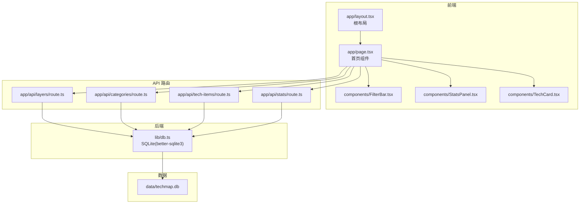
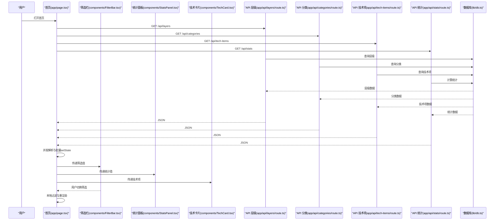
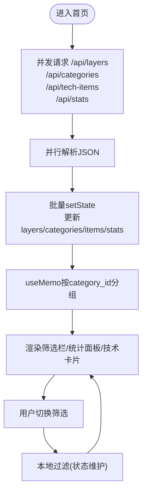
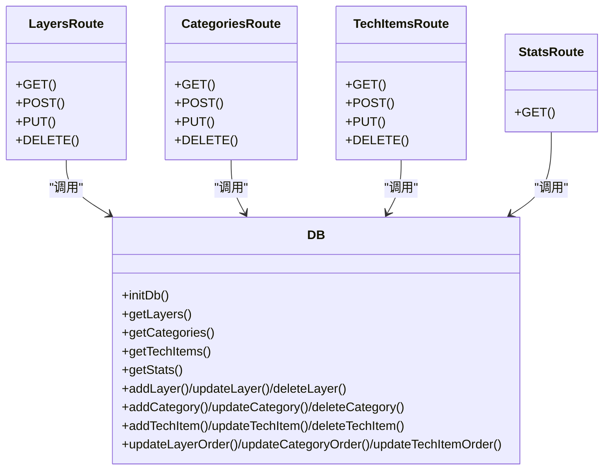
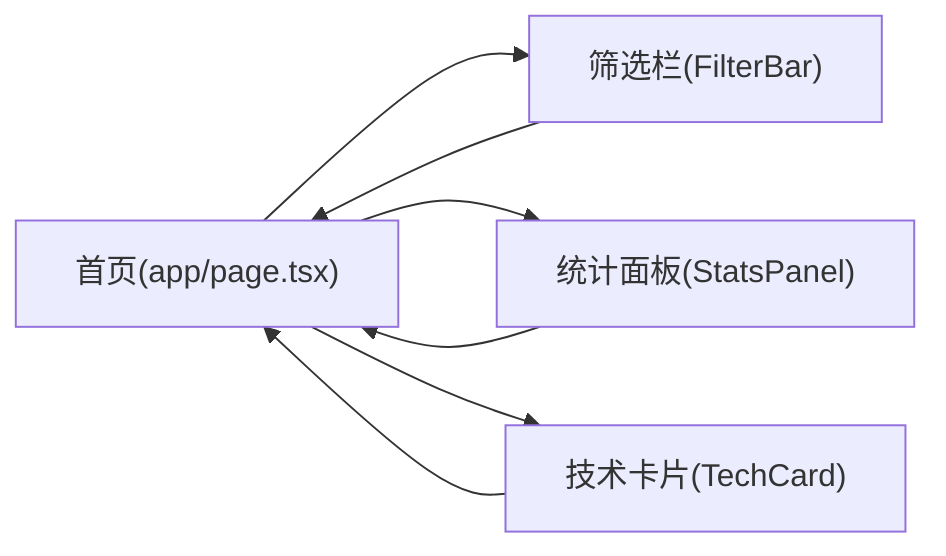
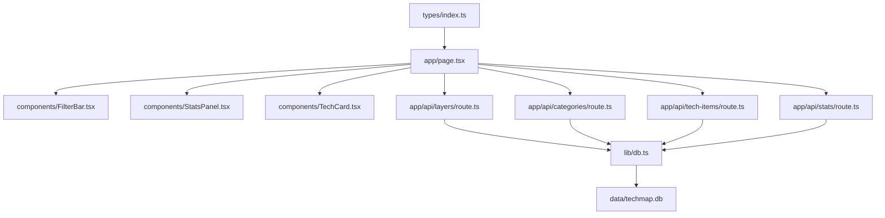

# 数据流设计

<cite>
**本文引用的文件**
- [README.md](file://README.md)
- [app/layout.tsx](file://app/layout.tsx)
- [app/page.tsx](file://app/page.tsx)
- [app/api/layers/route.ts](file://app/api/layers/route.ts)
- [app/api/categories/route.ts](file://app/api/categories/route.ts)
- [app/api/tech-items/route.ts](file://app/api/tech-items/route.ts)
- [app/api/stats/route.ts](file://app/api/stats/route.ts)
- [lib/db.ts](file://lib/db.ts)
- [lib/seed.ts](file://lib/seed.ts)
- [types/index.ts](file://types/index.ts)
- [components/FilterBar.tsx](file://components/FilterBar.tsx)
- [components/StatsPanel.tsx](file://components/StatsPanel.tsx)
- [components/TechCard.tsx](file://components/TechCard.tsx)
</cite>

## 目录
1. [引言](#引言)
2. [项目结构](#项目结构)
3. [核心组件](#核心组件)
4. [架构总览](#架构总览)
5. [详细组件分析](#详细组件分析)
6. [依赖关系分析](#依赖关系分析)
7. [性能考量](#性能考量)
8. [故障排查指南](#故障排查指南)
9. [结论](#结论)
10. [附录](#附录)

## 引言
本文件面向“Lantu Next”项目的数据流设计，系统梳理从用户交互到数据展示的完整路径：数据获取、并发拉取、处理与分组、状态更新、渲染与筛选、统计计算、以及错误处理与性能优化策略。文档同时解释前端组件如何通过API调用获取数据，数据在组件间的传递与状态更新机制，以及如何通过批量操作与缓存策略提升性能。

## 项目结构
项目采用 Next.js App Router，前端页面位于 app/，API 路由位于 app/api/*，数据访问封装于 lib/db.ts，类型定义位于 types/index.ts，UI 组件位于 components/，数据库文件位于 data/techmap.db。首页负责一次性并发拉取层级、分类、技术项与统计信息，并在组件间传递与筛选。

图表来源
- [app/page.tsx](file://app/page.tsx#L15-L92)
- [app/layout.tsx](file://app/layout.tsx#L21-L35)
- [app/api/layers/route.ts](file://app/api/layers/route.ts#L1-L48)
- [app/api/categories/route.ts](file://app/api/categories/route.ts#L1-L48)
- [app/api/tech-items/route.ts](file://app/api/tech-items/route.ts#L1-L50)
- [app/api/stats/route.ts](file://app/api/stats/route.ts#L1-L15)
- [lib/db.ts](file://lib/db.ts#L14-L50)
- [data/techmap.db](file://data/techmap.db)

章节来源
- [README.md](file://README.md#L20-L43)
- [app/layout.tsx](file://app/layout.tsx#L1-L36)
- [app/page.tsx](file://app/page.tsx#L1-L238)
- [lib/db.ts](file://lib/db.ts#L1-L312)

## 核心组件
- 首页组件负责一次性并发请求四个数据源，解析响应后批量更新状态，随后对技术项按分类进行分组，供子组件消费。
- 筛选栏组件提供多维筛选（全部、已有、缺失、标签），并把筛选值回传给首页。
- 统计面板组件接收统计聚合结果，展示已有、缺失、总数与覆盖率。
- 技术卡片组件根据状态与优先级渲染视觉样式与提示信息。

章节来源
- [app/page.tsx](file://app/page.tsx#L15-L92)
- [components/FilterBar.tsx](file://components/FilterBar.tsx#L1-L52)
- [components/StatsPanel.tsx](file://components/StatsPanel.tsx#L1-L84)
- [components/TechCard.tsx](file://components/TechCard.tsx#L1-L37)
- [types/index.ts](file://types/index.ts#L1-L34)

## 架构总览
下图展示了从用户交互到数据展示的端到端数据流：页面首次挂载触发并发请求；API 路由调用数据库层执行查询；数据库层返回结构化数据；前端聚合后渲染组件树；筛选变更触发本地过滤与重新渲染。

图表来源
- [app/page.tsx](file://app/page.tsx#L39-L63)
- [app/api/layers/route.ts](file://app/api/layers/route.ts#L6-L13)
- [app/api/categories/route.ts](file://app/api/categories/route.ts#L6-L13)
- [app/api/tech-items/route.ts](file://app/api/tech-items/route.ts#L7-L14)
- [app/api/stats/route.ts](file://app/api/stats/route.ts#L6-L14)
- [lib/db.ts](file://lib/db.ts#L52-L57)
- [lib/db.ts](file://lib/db.ts#L78-L85)
- [lib/db.ts](file://lib/db.ts#L107-L114)
- [lib/db.ts](file://lib/db.ts#L219-L239)

## 详细组件分析

### 首页数据流与状态管理
- 并发获取：首页在副作用中并发发起四个 fetch 请求，分别获取层级、分类、技术项与统计，使用 Promise.all 提升吞吐。
- 解析与聚合：四个响应并行解析为 JSON，随后一次性批量 setState，减少重渲染次数。
- 本地分组：使用 useMemo 将技术项按 category_id 分组，避免每次渲染创建新引用，降低子组件重渲染成本。
- 筛选逻辑：根据 filter 值对技术项进行本地过滤，支持“全部/已有/缺失/标签”四类条件。
- 刷新机制：通过刷新触发器驱动 useEffect 重新拉取数据，保证后台管理操作后的数据一致性。

图表来源
- [app/page.tsx](file://app/page.tsx#L39-L92)

章节来源
- [app/page.tsx](file://app/page.tsx#L15-L92)

### API 路由与数据库层
- 路由职责：每个 API 路由负责对应实体的 CRUD，统一在请求入口初始化数据库表，保证首次可用。
- 数据库层：提供查询、插入、更新、删除与批量排序更新等方法，使用 better-sqlite3 执行 SQL，事务包裹批量更新以保证一致性。
- 统计计算：在数据库层聚合统计，避免前端重复计算，提升性能与准确性。

图表来源
- [app/api/layers/route.ts](file://app/api/layers/route.ts#L1-L48)
- [app/api/categories/route.ts](file://app/api/categories/route.ts#L1-L48)
- [app/api/tech-items/route.ts](file://app/api/tech-items/route.ts#L1-L50)
- [app/api/stats/route.ts](file://app/api/stats/route.ts#L1-L15)
- [lib/db.ts](file://lib/db.ts#L14-L50)
- [lib/db.ts](file://lib/db.ts#L52-L57)
- [lib/db.ts](file://lib/db.ts#L78-L85)
- [lib/db.ts](file://lib/db.ts#L107-L114)
- [lib/db.ts](file://lib/db.ts#L219-L239)

章节来源
- [app/api/layers/route.ts](file://app/api/layers/route.ts#L1-L48)
- [app/api/categories/route.ts](file://app/api/categories/route.ts#L1-L48)
- [app/api/tech-items/route.ts](file://app/api/tech-items/route.ts#L1-L50)
- [app/api/stats/route.ts](file://app/api/stats/route.ts#L1-L15)
- [lib/db.ts](file://lib/db.ts#L1-L312)

### 组件间数据传递与渲染
- 首页将分组后的技术项与统计信息传递给子组件，子组件仅消费数据，不直接发起网络请求。
- 筛选栏组件通过回调将筛选值回传首页，首页在本地进行过滤并触发重渲染。
- 统计面板与技术卡片组件均为纯展示型，依据传入 props 渲染。

图表来源
- [app/page.tsx](file://app/page.tsx#L101-L237)
- [components/FilterBar.tsx](file://components/FilterBar.tsx#L1-L52)
- [components/StatsPanel.tsx](file://components/StatsPanel.tsx#L1-L84)
- [components/TechCard.tsx](file://components/TechCard.tsx#L1-L37)

章节来源
- [app/page.tsx](file://app/page.tsx#L101-L237)
- [components/FilterBar.tsx](file://components/FilterBar.tsx#L1-L52)
- [components/StatsPanel.tsx](file://components/StatsPanel.tsx#L1-L84)
- [components/TechCard.tsx](file://components/TechCard.tsx#L1-L37)

### 实时数据同步与缓存策略
- 当前实现：首页在每次刷新触发器变化时重新拉取数据，保证视图与数据库一致。
- 缓存策略：fetch 请求显式设置 no-store，避免浏览器缓存导致陈旧数据。
- 建议增强：可引入增量更新（基于时间戳或版本号）与本地持久化缓存（如 IndexedDB 或内存缓存 + TTL），结合订阅机制（WebSocket 或轮询）实现近实时更新。

章节来源
- [app/page.tsx](file://app/page.tsx#L41-L46)

### 数据验证与错误处理
- API 路由：对异常进行 try/catch 包裹，返回结构化的错误信息与状态码，便于前端识别与降级处理。
- 前端：在并发请求中捕获错误并记录日志，避免单一请求失败影响整体渲染。
- 建议增强：在前端增加统一的错误边界与重试机制；对必填字段与枚举值（状态、优先级）进行类型校验与默认值处理。

章节来源
- [app/api/layers/route.ts](file://app/api/layers/route.ts#L10-L12)
- [app/api/categories/route.ts](file://app/api/categories/route.ts#L10-L12)
- [app/api/tech-items/route.ts](file://app/api/tech-items/route.ts#L11-L13)
- [app/api/stats/route.ts](file://app/api/stats/route.ts#L11-L13)
- [app/page.tsx](file://app/page.tsx#L60-L62)

## 依赖关系分析
- 首页依赖类型定义与多个组件，同时依赖四个 API 路由。
- API 路由依赖数据库层，数据库层依赖 SQLite 文件。
- 组件之间通过 props 单向流动，无循环依赖，耦合度低、内聚性强。

图表来源
- [types/index.ts](file://types/index.ts#L1-L34)
- [app/page.tsx](file://app/page.tsx#L1-L238)
- [components/FilterBar.tsx](file://components/FilterBar.tsx#L1-L52)
- [components/StatsPanel.tsx](file://components/StatsPanel.tsx#L1-L84)
- [components/TechCard.tsx](file://components/TechCard.tsx#L1-L37)
- [app/api/layers/route.ts](file://app/api/layers/route.ts#L1-L48)
- [app/api/categories/route.ts](file://app/api/categories/route.ts#L1-L48)
- [app/api/tech-items/route.ts](file://app/api/tech-items/route.ts#L1-L50)
- [app/api/stats/route.ts](file://app/api/stats/route.ts#L1-L15)
- [lib/db.ts](file://lib/db.ts#L1-L312)
- [data/techmap.db](file://data/techmap.db)

章节来源
- [types/index.ts](file://types/index.ts#L1-L34)
- [app/page.tsx](file://app/page.tsx#L1-L238)
- [lib/db.ts](file://lib/db.ts#L1-L312)

## 性能考量
- 并发拉取：使用 Promise.all 并发请求四个接口，显著降低首屏等待时间。
- 批量更新：一次性 setState 更新多个状态，减少多次重渲染。
- 本地分组：useMemo 缓存分组结果，避免每次渲染重建映射。
- 本地过滤：在客户端进行筛选，避免重复网络请求。
- 缓存策略：显式禁用缓存，确保数据新鲜；可考虑引入轻量缓存与失效策略。
- 批量操作：数据库层提供批量排序更新，减少多次往返。

章节来源
- [app/page.tsx](file://app/page.tsx#L26-L34)
- [app/page.tsx](file://app/page.tsx#L41-L63)
- [lib/db.ts](file://lib/db.ts#L241-L282)

## 故障排查指南
- 数据未显示：检查首页并发请求是否成功，确认 API 路由返回状态与错误信息；查看浏览器网络面板与控制台日志。
- 统计异常：确认统计接口是否正确调用数据库聚合函数；核对状态枚举值与计算逻辑。
- 数据陈旧：确认请求头未被缓存；必要时调整缓存策略或添加时间戳。
- 后台管理后未刷新：确认刷新触发器是否正确递增；检查子组件是否正确回传 onUpdate。

章节来源
- [app/page.tsx](file://app/page.tsx#L60-L62)
- [app/api/stats/route.ts](file://app/api/stats/route.ts#L11-L13)
- [lib/db.ts](file://lib/db.ts#L219-L239)

## 结论
Lantu Next 的数据流以“首页并发拉取 + 本地聚合 + 子组件消费”的模式实现，具备良好的可维护性与扩展性。通过批量操作、本地分组与禁用缓存等策略，系统在性能与一致性之间取得平衡。建议后续引入增量更新、本地缓存与统一错误处理，进一步提升用户体验与稳定性。

## 附录
- 数据库初始化与示例数据：通过种子脚本初始化表结构并填充示例数据，便于快速体验。
- 类型定义：明确层级、分类、技术项与统计的字段与约束，保障前后端契约一致。

章节来源
- [lib/seed.ts](file://lib/seed.ts#L1-L80)
- [lib/db.ts](file://lib/db.ts#L14-L50)
- [types/index.ts](file://types/index.ts#L1-L34)