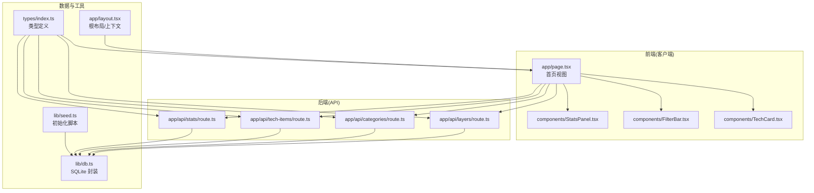
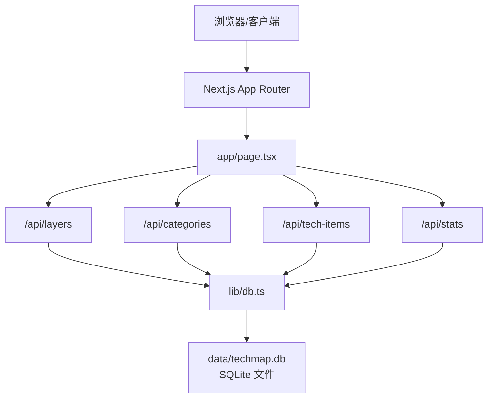
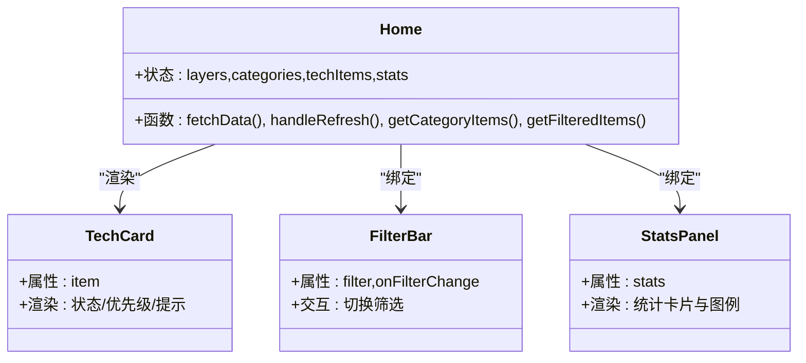
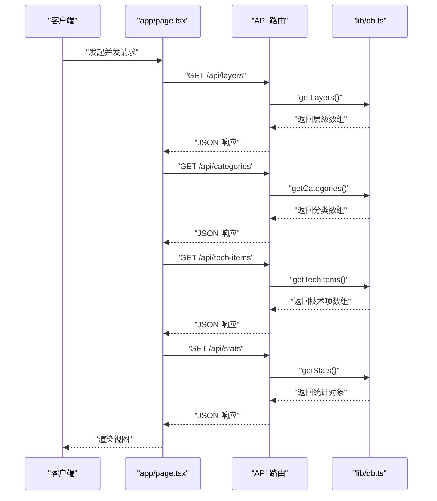
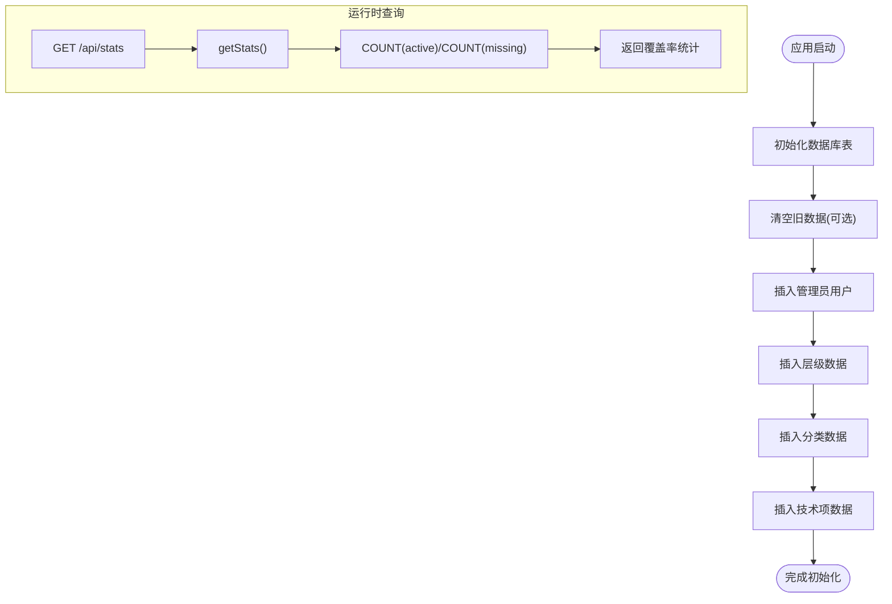
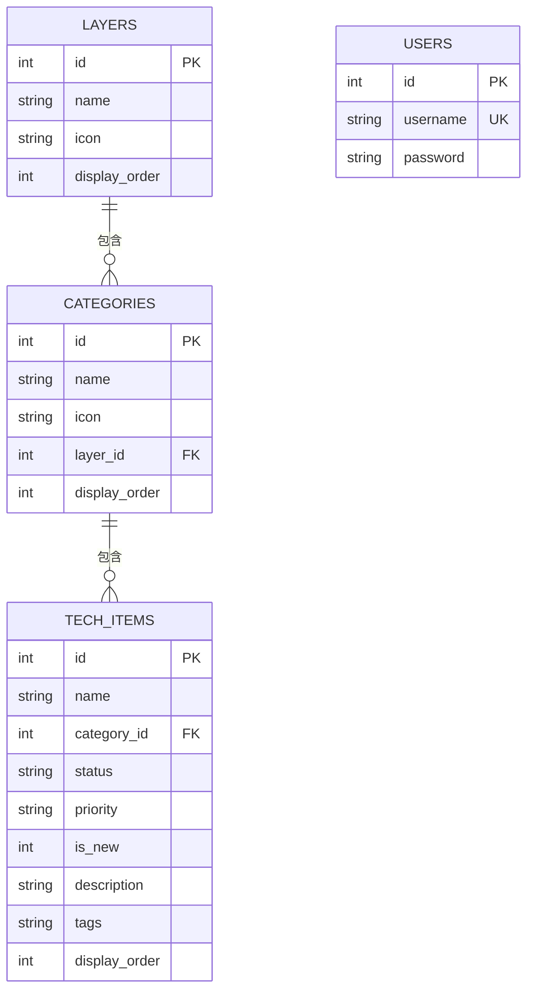
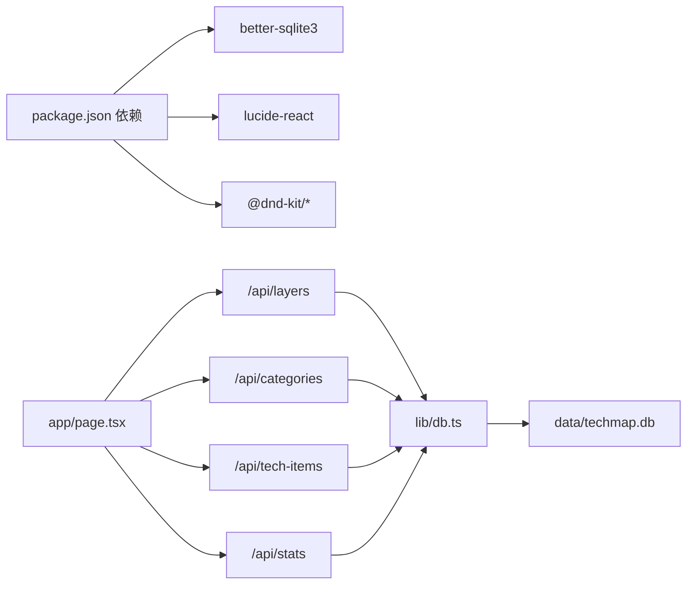

# 系统架构

<cite>
**本文档引用的文件**
- [README.md](file://README.md)
- [package.json](file://package.json)
- [next.config.ts](file://next.config.ts)
- [app/layout.tsx](file://app/layout.tsx)
- [app/page.tsx](file://app/page.tsx)
- [app/api/layers/route.ts](file://app/api/layers/route.ts)
- [app/api/categories/route.ts](file://app/api/categories/route.ts)
- [app/api/tech-items/route.ts](file://app/api/tech-items/route.ts)
- [app/api/stats/route.ts](file://app/api/stats/route.ts)
- [lib/db.ts](file://lib/db.ts)
- [lib/seed.ts](file://lib/seed.ts)
- [types/index.ts](file://types/index.ts)
- [components/TechCard.tsx](file://components/TechCard.tsx)
- [components/FilterBar.tsx](file://components/FilterBar.tsx)
- [components/StatsPanel.tsx](file://components/StatsPanel.tsx)
</cite>

## 目录
1. [引言](#引言)
2. [项目结构](#项目结构)
3. [核心组件](#核心组件)
4. [架构总览](#架构总览)
5. [详细组件分析](#详细组件分析)
6. [依赖分析](#依赖分析)
7. [性能考量](#性能考量)
8. [故障排查指南](#故障排查指南)
9. [结论](#结论)
10. [附录](#附录)

## 引言
本项目采用 Next.js App Router 架构，结合 TypeScript、Tailwind CSS 与 SQLite，构建一个前后端分离的“云平台技术蓝图图谱”应用。系统通过 API 路由提供 REST 接口，前端 React 组件负责视图层渲染与交互，数据库层封装在 lib/db.ts 中，形成清晰的 MVC 分工：视图层（React 组件）、控制器（Next.js API 路由）、模型层（数据库操作）。本文档将系统化阐述数据流向、组件交互关系、技术选型权衡以及可扩展与性能优化策略。

## 项目结构
项目采用 Next.js App Router 的扁平目录风格，按功能域划分 app/api/*、components/*、lib/*、types/*、data/* 等模块，职责清晰、易于维护与扩展。

图表来源
- [app/page.tsx](file://app/page.tsx#L1-L238)
- [app/api/layers/route.ts](file://app/api/layers/route.ts#L1-L48)
- [app/api/categories/route.ts](file://app/api/categories/route.ts#L1-L48)
- [app/api/tech-items/route.ts](file://app/api/tech-items/route.ts#L1-L50)
- [app/api/stats/route.ts](file://app/api/stats/route.ts#L1-L15)
- [lib/db.ts](file://lib/db.ts#L1-L312)
- [lib/seed.ts](file://lib/seed.ts#L1-L840)
- [types/index.ts](file://types/index.ts#L1-L34)
- [app/layout.tsx](file://app/layout.tsx#L1-L36)

章节来源
- [README.md](file://README.md#L20-L43)
- [package.json](file://package.json#L1-L43)
- [next.config.ts](file://next.config.ts#L1-L10)

## 核心组件
- 视图层（React 组件）
  - 首页组件负责数据拉取、状态管理与渲染，使用并发请求获取层级、分类、技术项与统计信息，并通过子组件完成展示与交互。
  - 子组件包括 TechCard、FilterBar、StatsPanel 等，分别承担卡片渲染、筛选交互与统计面板展示。
- 控制器（Next.js API 路由）
  - 四个 API 路由分别对应层级、分类、技术项与统计接口，统一调用 lib/db.ts 的数据库方法，返回 JSON 响应。
- 模型层（数据库封装）
  - lib/db.ts 提供表初始化、CRUD、批量排序更新与统计查询等能力，使用 better-sqlite3 作为本地嵌入式数据库驱动。
- 类型系统（TypeScript）
  - types/index.ts 定义 Layer、Category、TechItem、Stats 等接口，保证前后端数据契约一致。

章节来源
- [app/page.tsx](file://app/page.tsx#L1-L238)
- [components/TechCard.tsx](file://components/TechCard.tsx#L1-L37)
- [components/FilterBar.tsx](file://components/FilterBar.tsx#L1-L52)
- [components/StatsPanel.tsx](file://components/StatsPanel.tsx#L1-L84)
- [app/api/layers/route.ts](file://app/api/layers/route.ts#L1-L48)
- [app/api/categories/route.ts](file://app/api/categories/route.ts#L1-L48)
- [app/api/tech-items/route.ts](file://app/api/tech-items/route.ts#L1-L50)
- [app/api/stats/route.ts](file://app/api/stats/route.ts#L1-L15)
- [lib/db.ts](file://lib/db.ts#L1-L312)
- [types/index.ts](file://types/index.ts#L1-L34)

## 架构总览
系统采用前后端分离的 MVC 模式：
- 视图层：Next.js App Router 下的客户端组件，负责渲染与用户交互。
- 控制器：Next.js API 路由，接收请求、解析参数、调用业务逻辑并返回响应。
- 模型层：SQLite 数据库与 lib/db.ts 封装，提供数据持久化与查询能力。

图表来源
- [app/page.tsx](file://app/page.tsx#L39-L63)
- [app/api/layers/route.ts](file://app/api/layers/route.ts#L1-L48)
- [app/api/categories/route.ts](file://app/api/categories/route.ts#L1-L48)
- [app/api/tech-items/route.ts](file://app/api/tech-items/route.ts#L1-L50)
- [app/api/stats/route.ts](file://app/api/stats/route.ts#L1-L15)
- [lib/db.ts](file://lib/db.ts#L1-L312)

## 详细组件分析

### 视图层组件关系与职责
- app/page.tsx
  - 负责并发拉取四类数据并缓存到状态；提供筛选逻辑与分组渲染；触发刷新机制。
- components/TechCard.tsx
  - 渲染单个技术项卡片，依据状态与优先级设置样式与提示信息。
- components/FilterBar.tsx
  - 提供多种筛选条件按钮，切换视图层过滤状态。
- components/StatsPanel.tsx
  - 展示活跃、缺失、总数与覆盖率等统计指标。

图表来源
- [app/page.tsx](file://app/page.tsx#L15-L238)
- [components/TechCard.tsx](file://components/TechCard.tsx#L1-L37)
- [components/FilterBar.tsx](file://components/FilterBar.tsx#L1-L52)
- [components/StatsPanel.tsx](file://components/StatsPanel.tsx#L1-L84)

章节来源
- [app/page.tsx](file://app/page.tsx#L1-L238)
- [components/TechCard.tsx](file://components/TechCard.tsx#L1-L37)
- [components/FilterBar.tsx](file://components/FilterBar.tsx#L1-L52)
- [components/StatsPanel.tsx](file://components/StatsPanel.tsx#L1-L84)

### 控制器（API 路由）工作流
- app/api/layers/route.ts
  - GET/POST/PUT/DELETE 四个方法，统一调用 lib/db.ts 的 getLayers/addLayer/updateLayer/deleteLayer/initDb。
- app/api/categories/route.ts
  - GET/POST/PUT/DELETE 四个方法，统一调用 lib/db.ts 的 getCategories/addCategory/updateCategory/deleteCategory/initDb。
- app/api/tech-items/route.ts
  - GET/POST/PUT/DELETE 四个方法，统一调用 lib/db.ts 的 getTechItems/addTechItem/updateTechItem/deleteTechItem/initDb。
- app/api/stats/route.ts
  - GET 返回 getStats 统计结果。

图表来源
- [app/page.tsx](file://app/page.tsx#L39-L63)
- [app/api/layers/route.ts](file://app/api/layers/route.ts#L1-L48)
- [app/api/categories/route.ts](file://app/api/categories/route.ts#L1-L48)
- [app/api/tech-items/route.ts](file://app/api/tech-items/route.ts#L1-L50)
- [app/api/stats/route.ts](file://app/api/stats/route.ts#L1-L15)
- [lib/db.ts](file://lib/db.ts#L52-L239)

章节来源
- [app/api/layers/route.ts](file://app/api/layers/route.ts#L1-L48)
- [app/api/categories/route.ts](file://app/api/categories/route.ts#L1-L48)
- [app/api/tech-items/route.ts](file://app/api/tech-items/route.ts#L1-L50)
- [app/api/stats/route.ts](file://app/api/stats/route.ts#L1-L15)

### 模型层（数据库封装）与数据流
- lib/db.ts
  - 初始化表结构（layers、categories、tech_items、users），提供 CRUD 与批量排序更新，以及 getStats 统计查询。
  - 使用 better-sqlite3 本地数据库，路径位于 data/techmap.db。
- lib/seed.ts
  - 初始化数据库、清空旧数据、添加管理员、插入层级/分类/技术项与用户数据。

图表来源
- [lib/db.ts](file://lib/db.ts#L14-L50)
- [lib/seed.ts](file://lib/seed.ts#L1-L840)
- [app/api/stats/route.ts](file://app/api/stats/route.ts#L1-L15)

章节来源
- [lib/db.ts](file://lib/db.ts#L1-L312)
- [lib/seed.ts](file://lib/seed.ts#L1-L840)

### 数据模型与类型定义
- types/index.ts
  - 定义 Layer、Category、TechItem、Stats 接口，确保前后端数据结构一致。

图表来源
- [lib/db.ts](file://lib/db.ts#L14-L49)
- [types/index.ts](file://types/index.ts#L1-L34)

章节来源
- [types/index.ts](file://types/index.ts#L1-L34)
- [lib/db.ts](file://lib/db.ts#L14-L49)

## 依赖分析
- 外部依赖
  - better-sqlite3：本地嵌入式数据库驱动，支持事务与高性能同步操作。
  - lucide-react：图标库，用于界面渲染。
  - @dnd-kit/*：拖拽排序能力，用于层级/分类/技术项顺序调整。
- 内部依赖
  - app/page.tsx 依赖 API 路由与组件库。
  - API 路由依赖 lib/db.ts。
  - lib/db.ts 依赖 better-sqlite3 与 data/techmap.db。
  - 组件依赖 types/index.ts 的类型定义。

图表来源
- [package.json](file://package.json#L12-L36)
- [app/page.tsx](file://app/page.tsx#L39-L63)
- [app/api/layers/route.ts](file://app/api/layers/route.ts#L1-L48)
- [app/api/categories/route.ts](file://app/api/categories/route.ts#L1-L48)
- [app/api/tech-items/route.ts](file://app/api/tech-items/route.ts#L1-L50)
- [app/api/stats/route.ts](file://app/api/stats/route.ts#L1-L15)
- [lib/db.ts](file://lib/db.ts#L1-L312)

章节来源
- [package.json](file://package.json#L12-L36)
- [next.config.ts](file://next.config.ts#L1-L10)

## 性能考量
- 并发请求与状态缓存
  - 首页使用 Promise.all 并发拉取四类数据，减少首屏等待时间；通过 useMemo 对技术项按分类分组，避免重复创建引用导致的重渲染。
- 数据库事务与批量更新
  - lib/db.ts 提供批量排序更新的事务封装，减少多次往返与锁竞争，提升排序操作性能。
- 前端渲染优化
  - 使用 Tailwind CSS 与渐变/阴影等样式减少复杂动画开销；卡片悬浮提示采用条件显示，降低 DOM 压力。
- 部署与运行时优化
  - next.config.ts 启用 reactCompiler 与 serverExternalPackages，减少打包体积与运行时编译成本。

章节来源
- [app/page.tsx](file://app/page.tsx#L26-L63)
- [lib/db.ts](file://lib/db.ts#L242-L282)
- [next.config.ts](file://next.config.ts#L3-L7)

## 故障排查指南
- API 请求失败
  - 检查 API 路由是否正确调用 lib/db.ts 方法；确认 initDb 是否在路由入口执行；查看 NextResponse.json 的错误响应。
- 数据库连接问题
  - 确认 data/techmap.db 文件存在且具备读写权限；若修改表结构，删除数据库文件后重新执行初始化脚本。
- 统计数据异常
  - 检查 getStats 的聚合逻辑与边界值（除零保护）；确认 status 字段枚举值与数据库约束一致。
- 前端渲染异常
  - 检查 types/index.ts 的接口定义是否与后端返回一致；确认组件 props 传递与状态更新时机。

章节来源
- [app/api/layers/route.ts](file://app/api/layers/route.ts#L6-L12)
- [app/api/categories/route.ts](file://app/api/categories/route.ts#L6-L12)
- [app/api/tech-items/route.ts](file://app/api/tech-items/route.ts#L7-L13)
- [app/api/stats/route.ts](file://app/api/stats/route.ts#L6-L13)
- [lib/db.ts](file://lib/db.ts#L220-L239)
- [lib/seed.ts](file://lib/seed.ts#L10-L14)

## 结论
本项目以 Next.js App Router 为核心，采用前后端分离的 MVC 架构：视图层由 React 组件构成，控制器由 API 路由承担，模型层由 SQLite 与 better-sqlite3 封装实现。该架构具备清晰的职责边界、良好的可维护性与扩展性。SQLite 的选择满足小规模团队与内网部署场景，具备低运维成本与高可靠性优势；同时通过事务与批量更新保障性能与一致性。未来可在保持现有架构不变的前提下，逐步引入缓存层、分页查询与更细粒度的鉴权模块，以支撑更大规模的数据与用户场景。

## 附录
- 快速开始与部署要点
  - 安装依赖、初始化数据库、启动开发服务器与生产构建流程详见 README。
- 内网部署建议
  - 使用 PM2 守护进程、Nginx 反向代理与固定端口，确保稳定性与可访问性。

章节来源
- [README.md](file://README.md#L45-L235)