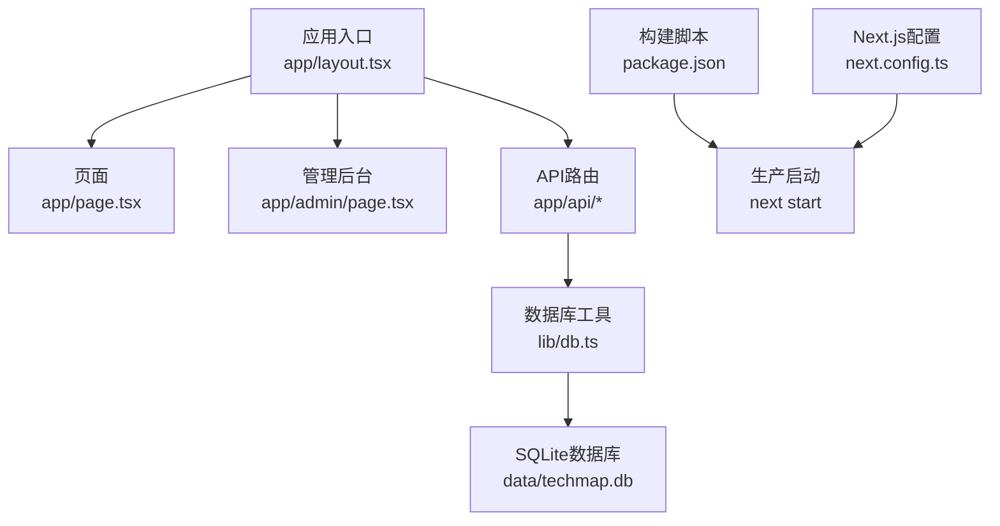
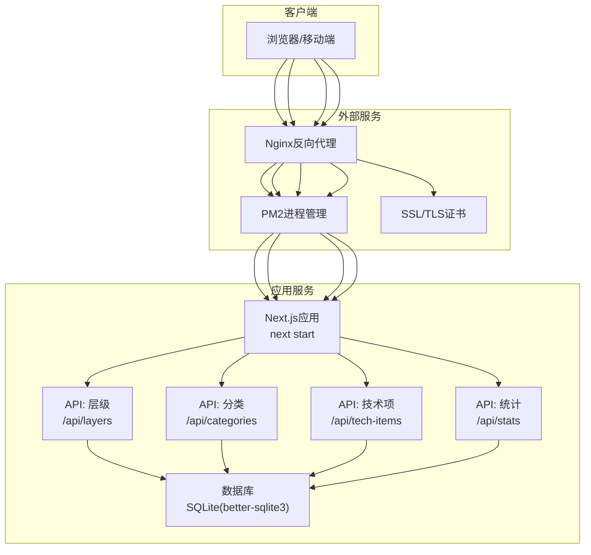
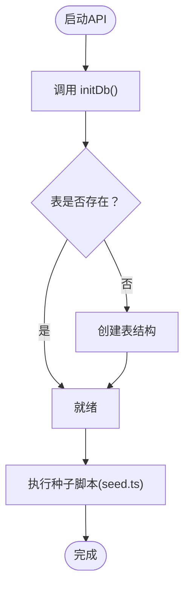
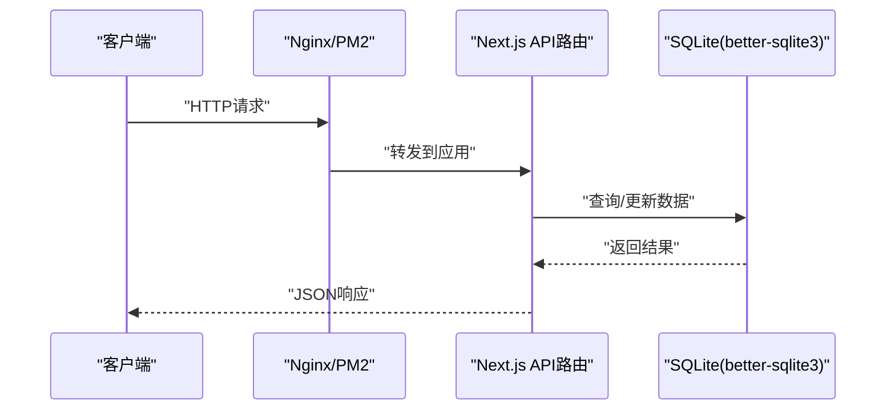
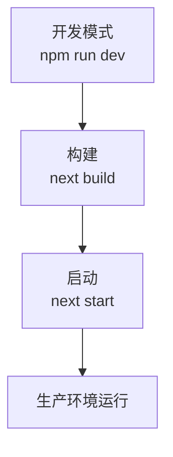
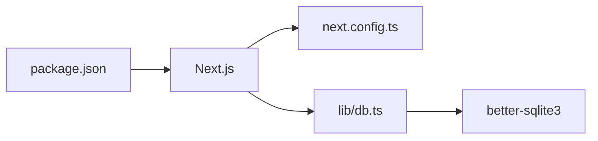

# 部署指南

<cite>
**本文引用的文件**
- [package.json](file://package.json)
- [next.config.ts](file://next.config.ts)
- [README.md](file://README.md)
- [PROJECT_MIGRATION.md](file://PROJECT_MIGRATION.md)
- [lib/db.ts](file://lib/db.ts)
- [lib/seed.ts](file://lib/seed.ts)
- [app/layout.tsx](file://app/layout.tsx)
- [app/api/layers/route.ts](file://app/api/layers/route.ts)
- [app/api/categories/route.ts](file://app/api/categories/route.ts)
- [app/api/tech-items/route.ts](file://app/api/tech-items/route.ts)
- [app/api/stats/route.ts](file://app/api/stats/route.ts)
</cite>

## 目录
1. [简介](#简介)
2. [项目结构](#项目结构)
3. [核心组件](#核心组件)
4. [架构总览](#架构总览)
5. [详细组件分析](#详细组件分析)
6. [依赖关系分析](#依赖关系分析)
7. [性能考虑](#性能考虑)
8. [故障排查指南](#故障排查指南)
9. [结论](#结论)
10. [附录](#附录)

## 简介
本指南面向Lantu Next项目，提供从开发环境到生产环境的完整部署流程，涵盖：
- Docker容器化部署
- 传统服务器部署
- 云平台部署（含Vercel注意事项）
- Nginx反向代理配置
- PM2进程管理
- SSL证书配置
- 环境变量管理
- 日志监控与性能调优
- 部署脚本、自动化CI/CD与回滚机制
- 常见部署问题诊断与解决

## 项目结构
Lantu Next采用Next.js App Router架构，前端页面与API路由分离，数据持久化使用SQLite（better-sqlite3）。关键目录与文件职责概览：
- app/: 页面与API路由
- lib/: 数据库工具与种子脚本
- data/: SQLite数据库文件
- next.config.ts: Next.js构建配置
- package.json: 依赖与脚本命令

**图表来源**
- [app/layout.tsx](file://app/layout.tsx#L1-L36)
- [lib/db.ts](file://lib/db.ts#L1-L312)
- [package.json](file://package.json#L1-L43)
- [next.config.ts](file://next.config.ts#L1-L10)

**章节来源**
- [README.md](file://README.md#L1-L239)
- [PROJECT_MIGRATION.md](file://PROJECT_MIGRATION.md#L1-L205)

## 核心组件
- 数据库层（SQLite + better-sqlite3）
  - 初始化与迁移：通过lib/db.ts中的initDb()与lib/seed.ts执行
  - 数据库文件路径：data/techmap.db
- API路由层
  - 层级接口：/api/layers
  - 分类接口：/api/categories
  - 技术项接口：/api/tech-items
  - 统计接口：/api/stats
- 构建与启动
  - 构建：next build
  - 启动：next start（默认端口可在脚本中调整）

**章节来源**
- [lib/db.ts](file://lib/db.ts#L1-L312)
- [lib/seed.ts](file://lib/seed.ts#L1-L840)
- [app/api/layers/route.ts](file://app/api/layers/route.ts#L1-L48)
- [app/api/categories/route.ts](file://app/api/categories/route.ts#L1-L48)
- [app/api/tech-items/route.ts](file://app/api/tech-items/route.ts#L1-L50)
- [app/api/stats/route.ts](file://app/api/stats/route.ts#L1-L15)
- [package.json](file://package.json#L1-L43)

## 架构总览
Lantu Next的前后端一体化架构，API路由直接对接SQLite数据库，适合中小型应用与内网部署；若迁移到云平台（如Vercel），需替换数据库为云数据库。

**图表来源**
- [app/api/layers/route.ts](file://app/api/layers/route.ts#L1-L48)
- [app/api/categories/route.ts](file://app/api/categories/route.ts#L1-L48)
- [app/api/tech-items/route.ts](file://app/api/tech-items/route.ts#L1-L50)
- [app/api/stats/route.ts](file://app/api/stats/route.ts#L1-L15)
- [lib/db.ts](file://lib/db.ts#L1-L312)
- [README.md](file://README.md#L164-L235)

## 详细组件分析

### 数据库与初始化
- 初始化流程
  - 在API路由中调用initDb()确保表存在
  - 首次部署执行种子脚本生成示例数据
- 数据库文件位置
  - data/techmap.db，需具备读写权限
- 并发与高可用
  - SQLite不支持高并发写入，建议在高并发场景切换为PostgreSQL

**图表来源**
- [lib/db.ts](file://lib/db.ts#L14-L50)
- [lib/seed.ts](file://lib/seed.ts#L1-L800)

**章节来源**
- [lib/db.ts](file://lib/db.ts#L1-L312)
- [lib/seed.ts](file://lib/seed.ts#L1-L840)
- [PROJECT_MIGRATION.md](file://PROJECT_MIGRATION.md#L162-L194)

### API路由与数据访问
- 层级接口：GET/POST/PUT/DELETE
- 分类接口：GET/POST/PUT/DELETE
- 技术项接口：GET/POST/PUT/DELETE
- 统计接口：GET

**图表来源**
- [app/api/layers/route.ts](file://app/api/layers/route.ts#L1-L48)
- [app/api/categories/route.ts](file://app/api/categories/route.ts#L1-L48)
- [app/api/tech-items/route.ts](file://app/api/tech-items/route.ts#L1-L50)
- [app/api/stats/route.ts](file://app/api/stats/route.ts#L1-L15)
- [lib/db.ts](file://lib/db.ts#L1-L312)

**章节来源**
- [app/api/layers/route.ts](file://app/api/layers/route.ts#L1-L48)
- [app/api/categories/route.ts](file://app/api/categories/route.ts#L1-L48)
- [app/api/tech-items/route.ts](file://app/api/tech-items/route.ts#L1-L50)
- [app/api/stats/route.ts](file://app/api/stats/route.ts#L1-L15)

### 构建与启动
- 构建命令：next build
- 启动命令：next start
- 默认端口：可通过脚本参数调整

**图表来源**
- [package.json](file://package.json#L5-L11)
- [README.md](file://README.md#L141-L146)

**章节来源**
- [package.json](file://package.json#L1-L43)
- [README.md](file://README.md#L141-L146)

## 依赖关系分析
- 依赖管理
  - 项目使用better-sqlite3作为数据库驱动，构建时仅针对已编译依赖进行处理
- Next.js配置
  - 启用React Compiler
  - serverExternalPackages包含better-sqlite3，避免打包时编译该包

**图表来源**
- [package.json](file://package.json#L12-L41)
- [next.config.ts](file://next.config.ts#L1-L10)
- [lib/db.ts](file://lib/db.ts#L1-L312)

**章节来源**
- [package.json](file://package.json#L1-L43)
- [next.config.ts](file://next.config.ts#L1-L10)

## 性能考虑
- 构建优化
  - 启用React Compiler提升渲染性能
  - 使用pnpm加速依赖安装
- 数据库优化
  - SQLite适用于中小规模数据；高并发场景建议迁移至PostgreSQL
- 静态资源
  - public目录资源在构建后自动处理，无需额外配置

**章节来源**
- [next.config.ts](file://next.config.ts#L5-L6)
- [README.md](file://README.md#L168-L173)
- [PROJECT_MIGRATION.md](file://PROJECT_MIGRATION.md#L170-L173)

## 故障排查指南
- 数据库权限问题
  - 确保运行用户对data/目录与data/techmap.db具备读写权限
- 端口占用
  - 默认端口可在脚本参数中调整；确认未被其他进程占用
- SQLite并发限制
  - 高并发写入可能导致锁冲突；建议迁移至PostgreSQL
- API错误处理
  - API路由统一捕获异常并返回500错误；检查日志定位具体原因

**章节来源**
- [README.md](file://README.md#L230-L234)
- [app/api/layers/route.ts](file://app/api/layers/route.ts#L10-L12)
- [app/api/categories/route.ts](file://app/api/categories/route.ts#L10-L12)
- [app/api/tech-items/route.ts](file://app/api/tech-items/route.ts#L11-L13)
- [app/api/stats/route.ts](file://app/api/stats/route.ts#L11-L12)

## 结论
Lantu Next提供了清晰的前后端一体化架构与完善的API接口，适合中小型应用与内网部署。通过合理的进程管理、反向代理与数据库规划，可在不同环境中稳定运行。对于需要云平台高可用与高并发的场景，建议替换数据库为PostgreSQL，并结合CI/CD与监控体系实现自动化运维。

## 附录

### A. Docker容器化部署
- 构建镜像
  - 使用多阶段构建，先安装依赖再复制构建产物
- 容器运行
  - 映射端口与数据卷（data/techmap.db）
  - 初始化数据库：首次启动执行种子脚本
- 健康检查
  - 对外暴露健康检查端点，结合反向代理与负载均衡

[本节为通用实践说明，不直接分析具体文件，故无“章节来源”]

### B. 传统服务器部署
- 环境准备
  - Node.js版本要求与包管理器选择
- 代码部署
  - 安装依赖、初始化数据库
- 构建与启动
  - 构建生产包并启动
- PM2进程管理
  - 使用PM2守护进程，设置开机自启
- Nginx反向代理
  - 将80/443端口转发至应用端口

**章节来源**
- [README.md](file://README.md#L164-L228)

### C. 云平台部署
- Vercel部署
  - 需将SQLite替换为PostgreSQL或其他云数据库
- 其他VPS
  - 可直接部署，支持SQLite
- Docker部署
  - 可容器化部署，便于迁移与扩展

**章节来源**
- [PROJECT_MIGRATION.md](file://PROJECT_MIGRATION.md#L170-L173)

### D. Nginx反向代理配置
- 监听80端口，将请求转发至应用端口
- 保持WebSocket升级能力
- 可选启用HTTPS（SSL证书）

**章节来源**
- [README.md](file://README.md#L210-L228)

### E. PM2进程管理
- 启动应用并命名
- 保存进程列表并配置开机自启

**章节来源**
- [README.md](file://README.md#L197-L208)

### F. SSL证书配置
- 通过Nginx或反向代理层启用TLS
- 推荐使用Let’s Encrypt免费证书

[本节为通用实践说明，不直接分析具体文件，故无“章节来源”]

### G. 环境变量管理
- 数据库连接字符串（迁移至PostgreSQL时）
- 应用端口与运行模式
- 日志级别与输出路径

[本节为通用实践说明，不直接分析具体文件，故无“章节来源”]

### H. 日志监控与性能调优
- 日志
  - PM2日志聚合与滚动
  - 应用侧结构化日志输出
- 性能
  - 启用React Compiler
  - 选择合适的包管理器（pnpm）
  - 数据库迁移至PostgreSQL以支持高并发

**章节来源**
- [next.config.ts](file://next.config.ts#L5-L6)
- [README.md](file://README.md#L168-L173)
- [PROJECT_MIGRATION.md](file://PROJECT_MIGRATION.md#L175-L179)

### I. 部署脚本与自动化CI/CD
- 构建脚本
  - next build与next start
- 自动化流程
  - 触发条件：代码推送/合并请求
  - 步骤：安装依赖 → 构建 → 测试（可选）→ 部署
- 回滚机制
  - 版本化发布与快速回滚策略

[本节为通用实践说明，不直接分析具体文件，故无“章节来源”]

### J. 常见部署问题诊断
- 数据库文件权限不足
- 端口被占用
- SQLite并发写入冲突
- API路由异常返回500

**章节来源**
- [README.md](file://README.md#L230-L234)
- [app/api/layers/route.ts](file://app/api/layers/route.ts#L10-L12)
- [app/api/categories/route.ts](file://app/api/categories/route.ts#L10-L12)
- [app/api/tech-items/route.ts](file://app/api/tech-items/route.ts#L11-L13)
- [app/api/stats/route.ts](file://app/api/stats/route.ts#L11-L12)