# 项目概述

<cite>
**本文档引用的文件**
- [README.md](file://README.md)
- [package.json](file://package.json)
- [next.config.ts](file://next.config.ts)
- [tsconfig.json](file://tsconfig.json)
- [app/layout.tsx](file://app/layout.tsx)
- [app/page.tsx](file://app/page.tsx)
- [app/globals.css](file://app/globals.css)
- [types/index.ts](file://types/index.ts)
- [lib/db.ts](file://lib/db.ts)
- [lib/seed.ts](file://lib/seed.ts)
- [components/TechCard.tsx](file://components/TechCard.tsx)
- [components/FilterBar.tsx](file://components/FilterBar.tsx)
- [components/StatsPanel.tsx](file://components/StatsPanel.tsx)
- [app/api/layers/route.ts](file://app/api/layers/route.ts)
- [app/api/categories/route.ts](file://app/api/categories/route.ts)
- [app/api/tech-items/route.ts](file://app/api/tech-items/route.ts)
- [app/api/stats/route.ts](file://app/api/stats/route.ts)
</cite>

## 目录
1. [引言](#引言)
2. [项目结构](#项目结构)
3. [核心组件](#核心组件)
4. [架构概览](#架构概览)
5. [详细组件分析](#详细组件分析)
6. [依赖分析](#依赖分析)
7. [性能考虑](#性能考虑)
8. [故障排除指南](#故障排除指南)
9. [结论](#结论)
10. [附录](#附录)

## 引言

Lantu Next 是一个基于 Next.js 构建的技术栈管理系统，专门用于展示和管理云平台技术蓝图图谱。该项目采用现代化的全栈技术栈，包括 Next.js 16、TypeScript、Tailwind CSS 和 SQLite，为企业级技术规划提供了直观的可视化界面。

### 项目核心目标

该项目旨在解决技术栈管理中的关键痛点：
- **统一技术视图**：将分散的技术栈信息整合到一个可视化的蓝图中
- **实时状态跟踪**：提供技术项的实时状态显示和覆盖率统计
- **灵活的管理能力**：支持技术项的增删改查和层级管理
- **多维度筛选**：支持按状态、标签等多维度技术筛选

### 主要功能特性

- ✅ **技术蓝图展示**：以层级化的方式展示完整的云平台技术栈
- ✅ **实时状态管理**：支持技术项状态的实时更新和显示
- ✅ **多维度筛选**：支持按状态、技术类别、优先级等多维度筛选
- ✅ **统计面板**：提供技术栈覆盖率和状态统计
- ✅ **响应式设计**：适配不同屏幕尺寸的设备访问

### 技术选型理由

选择这些技术栈的原因：
- **Next.js 16**：提供最佳的开发体验和生产性能
- **TypeScript**：增强代码类型安全性和开发效率
- **Tailwind CSS**：快速构建一致的用户界面
- **SQLite**：轻量级、易部署的本地数据库解决方案

## 项目结构

Lantu Next 采用标准的 Next.js 13+ App Router 结构，具有清晰的模块化组织：

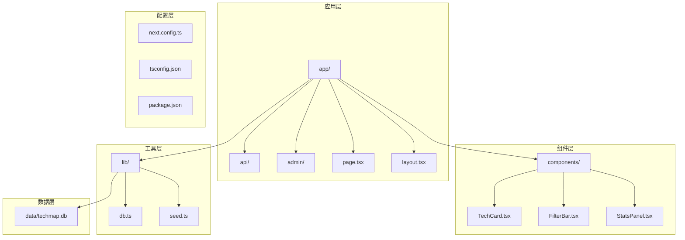

**图表来源**
- [app/layout.tsx](file://app/layout.tsx#L1-L36)
- [lib/db.ts](file://lib/db.ts#L1-L312)
- [components/TechCard.tsx](file://components/TechCard.tsx#L1-L37)

### 核心目录说明

- **app/**：Next.js 应用的主要入口点，包含页面和 API 路由
- **components/**：可复用的 React 组件库
- **lib/**：应用程序的核心逻辑和数据库操作
- **types/**：TypeScript 类型定义
- **data/**：SQLite 数据库文件存储

**章节来源**
- [README.md](file://README.md#L20-L43)
- [package.json](file://package.json#L1-L43)

## 核心组件

### 数据模型架构

项目采用三层嵌套的数据模型来组织技术信息：

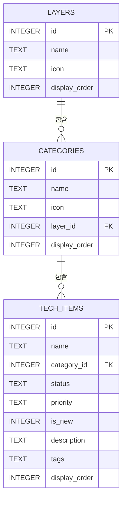

**图表来源**
- [lib/db.ts](file://lib/db.ts#L14-L49)
- [types/index.ts](file://types/index.ts#L1-L34)

### 关键组件关系

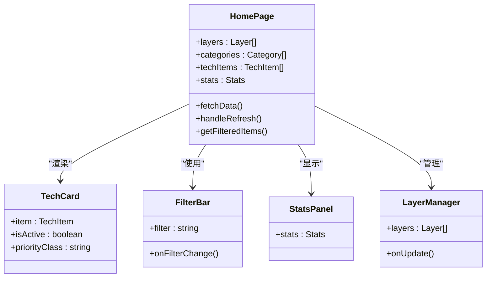

**图表来源**
- [app/page.tsx](file://app/page.tsx#L15-L238)
- [components/TechCard.tsx](file://components/TechCard.tsx#L7-L37)
- [components/FilterBar.tsx](file://components/FilterBar.tsx#L1-L52)
- [components/StatsPanel.tsx](file://components/StatsPanel.tsx#L1-L84)

**章节来源**
- [types/index.ts](file://types/index.ts#L1-L34)
- [app/page.tsx](file://app/page.tsx#L15-L238)

## 架构概览

### 整体系统架构

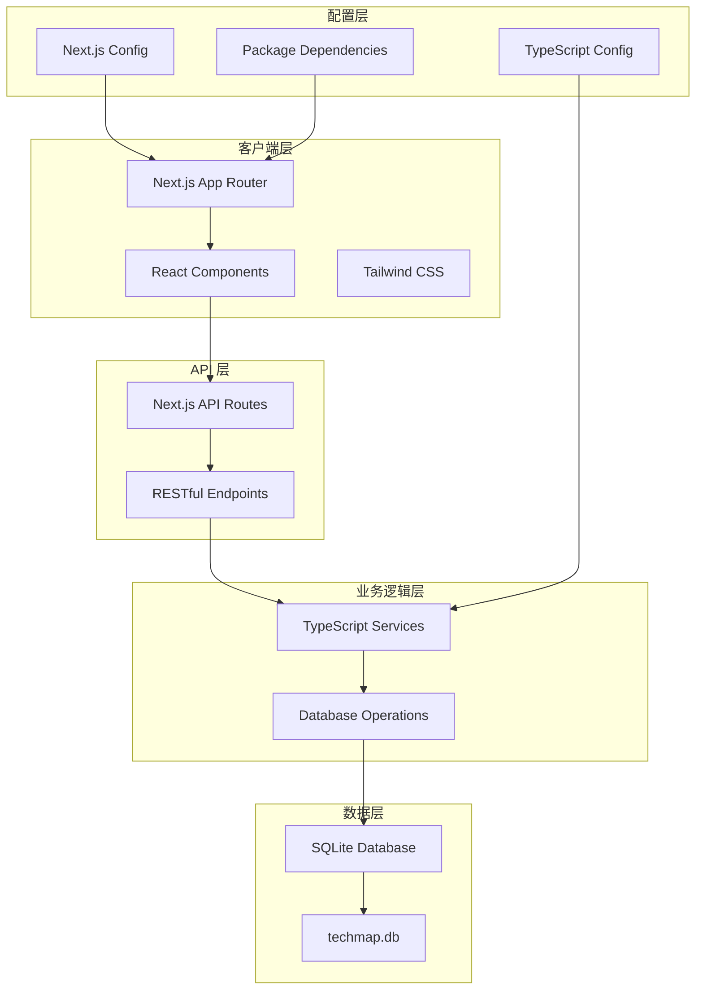

**图表来源**
- [next.config.ts](file://next.config.ts#L1-L10)
- [tsconfig.json](file://tsconfig.json#L1-L35)
- [package.json](file://package.json#L1-L43)

### 数据流架构

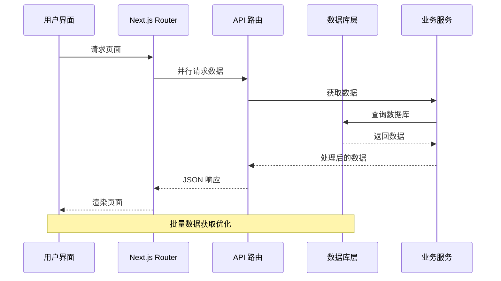

**图表来源**
- [app/page.tsx](file://app/page.tsx#L39-L68)
- [lib/db.ts](file://lib/db.ts#L52-L114)

## 详细组件分析

### 首页组件分析

首页是整个应用的核心，负责协调所有子组件的工作：

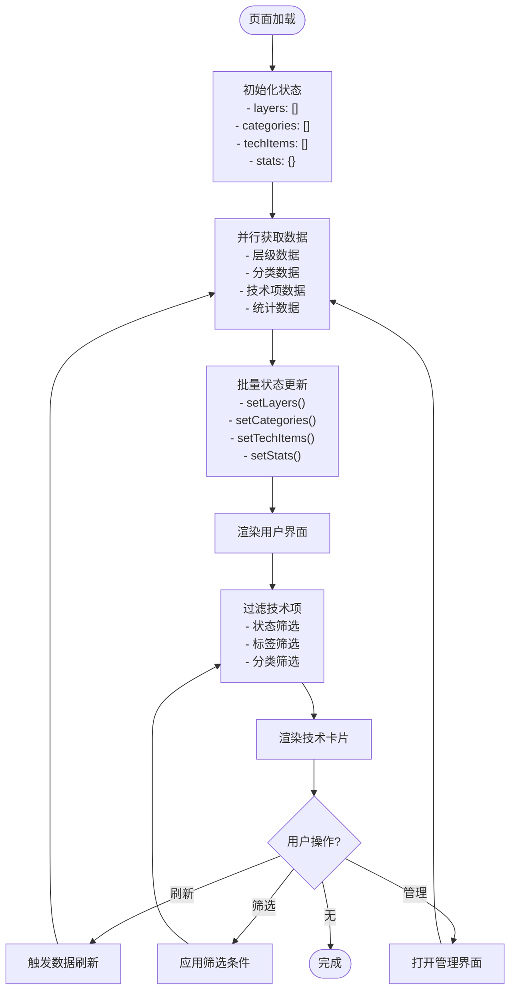

**图表来源**
- [app/page.tsx](file://app/page.tsx#L15-L238)

#### 关键实现特性

1. **并发数据获取**：使用 Promise.all 并行获取所有数据，提升加载性能
2. **状态管理优化**：通过 useMemo 避免不必要的对象创建
3. **动态组件渲染**：根据技术项状态动态调整样式和行为
4. **响应式设计**：支持不同屏幕尺寸的自适应布局

**章节来源**
- [app/page.tsx](file://app/page.tsx#L15-L238)

### 技术卡片组件

技术卡片是展示单个技术项的核心组件：

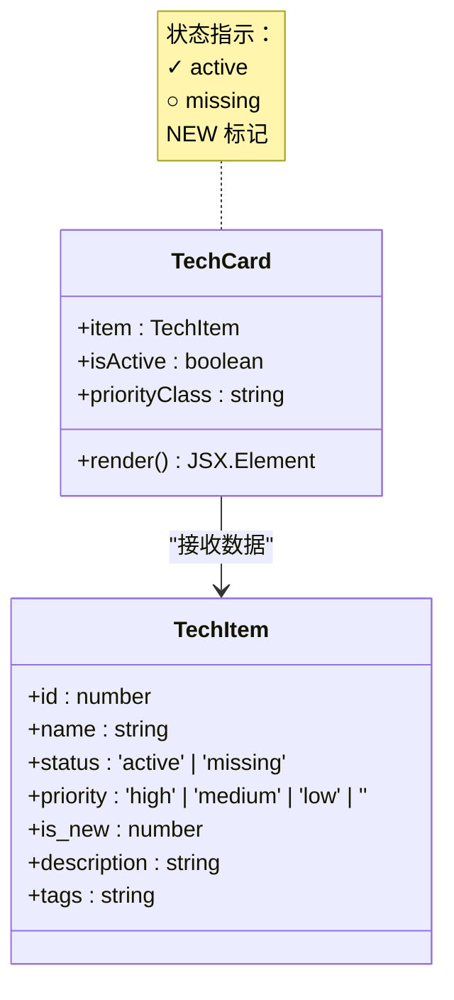

**图表来源**
- [components/TechCard.tsx](file://components/TechCard.tsx#L7-L37)
- [types/index.ts](file://types/index.ts#L16-L26)

#### 设计特色

- **状态可视化**：通过颜色和图标直观显示技术项状态
- **优先级标识**：使用不同颜色边框表示优先级
- **悬停交互**：提供详细的工具提示信息
- **新增标记**：突出显示最新添加的技术项

**章节来源**
- [components/TechCard.tsx](file://components/TechCard.tsx#L1-L37)

### 筛选栏组件

筛选栏提供多种维度的技术项筛选功能：

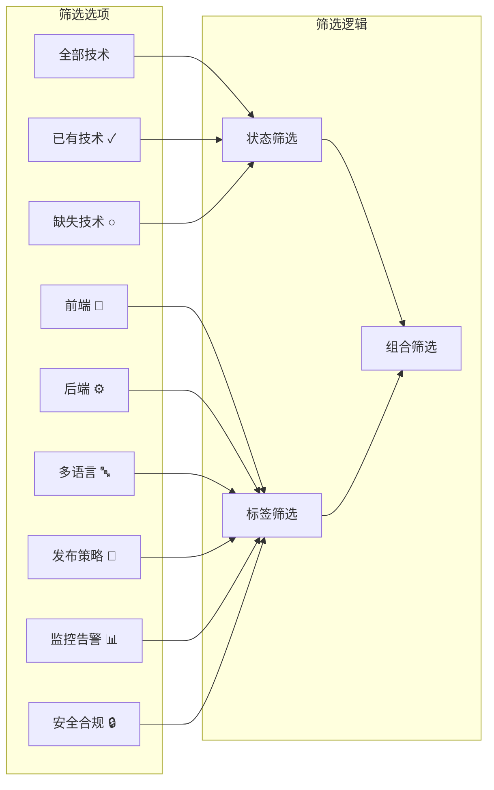

**图表来源**
- [components/FilterBar.tsx](file://components/FilterBar.tsx#L7-L17)

**章节来源**
- [components/FilterBar.tsx](file://components/FilterBar.tsx#L1-L52)

### 统计面板组件

统计面板提供技术栈的整体状态概览：

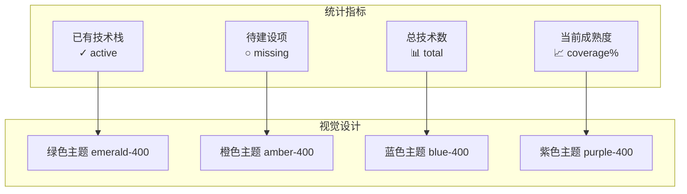

**图表来源**
- [components/StatsPanel.tsx](file://components/StatsPanel.tsx#L10-L54)

**章节来源**
- [components/StatsPanel.tsx](file://components/StatsPanel.tsx#L1-L84)

## 依赖分析

### 技术栈依赖关系

```mermaid
graph TB
subgraph "前端依赖"
A[Next.js 16]
B[React 19]
C[Tailwind CSS]
D[TypeScript]
end
subgraph "数据库依赖"
E[better-sqlite3]
F[SQLite]
end
subgraph "开发工具"
G[ESLint]
H[TailwindCSS]
I[TSX]
end
subgraph "UI 组件"
J[@dnd-kit]
K[lucide-react]
L[clsx]
M[tailwind-merge]
end
A --> B
A --> C
A --> D
E --> F
G --> A
H --> C
I --> D
J --> B
K --> B
L --> C
M --> C
```

**图表来源**
- [package.json](file://package.json#L12-L36)

### 外部依赖管理

项目采用 pnpm 包管理器，特别配置了 `onlyBuiltDependencies` 来优化 better-sqlite3 的安装过程：

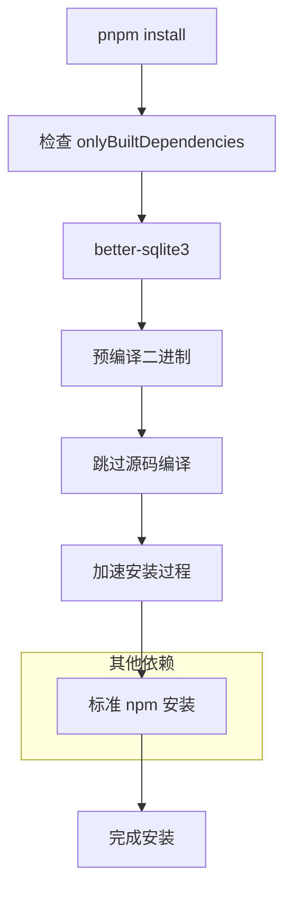

**图表来源**
- [package.json](file://package.json#L37-L41)

**章节来源**
- [package.json](file://package.json#L1-L43)
- [next.config.ts](file://next.config.ts#L1-L10)

## 性能考虑

### 数据加载优化

项目实现了多项性能优化措施：

1. **并发数据获取**：使用 `Promise.all` 并行获取多个 API 端点的数据
2. **缓存策略**：在 API 调用中使用 `cache: "no-store"` 确保数据新鲜度
3. **状态优化**：通过 `useMemo` 避免不必要的对象重建
4. **批量更新**：一次性更新多个状态变量减少重渲染

### 构建时优化

- **React Compiler**：启用 React Compiler 提升运行时性能
- **外部包优化**：配置 `serverExternalPackages` 优化服务器端打包
- **TypeScript 严格模式**：提供更好的类型检查和性能分析

## 故障排除指南

### 常见问题诊断

#### 数据库连接问题

**症状**：页面无法加载或显示空白
**解决方案**：
1. 检查 `data/techmap.db` 文件是否存在
2. 验证数据库文件的读写权限
3. 确认 SQLite 数据库初始化成功

#### API 调用失败

**症状**：网络错误或 500 状态码
**解决方案**：
1. 检查数据库连接字符串
2. 验证 API 路由的正确性
3. 查看服务器端错误日志

#### 样式问题

**症状**：页面样式异常或组件显示不正确
**解决方案**：
1. 确认 Tailwind CSS 配置正确
2. 检查 CSS 变量定义
3. 验证字体加载情况

**章节来源**
- [lib/db.ts](file://lib/db.ts#L1-L312)
- [app/api/layers/route.ts](file://app/api/layers/route.ts#L1-L48)

## 结论

Lantu Next 项目成功地构建了一个功能完整、性能优异的技术栈管理系统。通过合理的架构设计和技术选型，该项目不仅满足了当前的功能需求，还为未来的扩展奠定了坚实的基础。

### 项目优势

1. **架构清晰**：采用分层架构，职责分离明确
2. **性能优秀**：通过多项优化措施确保良好的用户体验
3. **易于维护**：TypeScript 类型安全和模块化设计
4. **扩展性强**：灵活的组件设计支持功能扩展

### 技术创新点

- **可视化技术蓝图**：直观展示复杂的技术栈关系
- **实时状态管理**：提供准确的技术栈状态反馈
- **多维度筛选**：支持灵活的技术项查询和筛选
- **响应式设计**：适配各种设备和屏幕尺寸

## 附录

### API 接口规范

| 资源 | 方法 | 端点 | 描述 |
|------|------|------|------|
| 层级 | GET | `/api/layers` | 获取所有层级 |
| 层级 | POST | `/api/layers` | 创建新层级 |
| 分类 | GET | `/api/categories` | 获取所有分类 |
| 分类 | POST | `/api/categories` | 创建新分类 |
| 技术项 | GET | `/api/tech-items` | 获取所有技术项 |
| 技术项 | POST | `/api/tech-items` | 创建新技术项 |
| 技术项 | PUT | `/api/tech-items` | 更新技术项 |
| 技术项 | DELETE | `/api/tech-items?id={id}` | 删除技术项 |
| 统计 | GET | `/api/stats` | 获取统计数据 |

### 数据库表结构

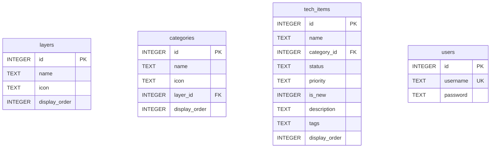

**图表来源**
- [lib/db.ts](file://lib/db.ts#L14-L49)